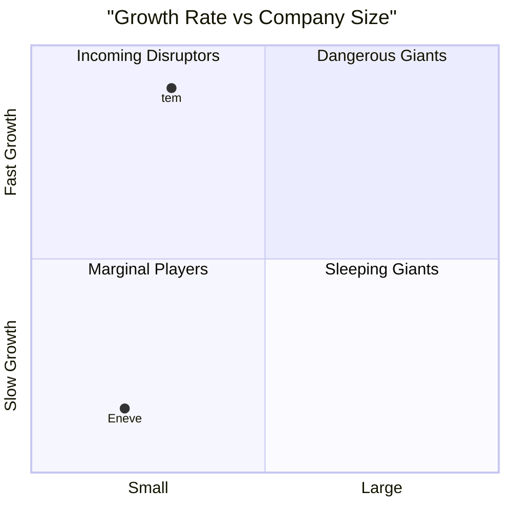
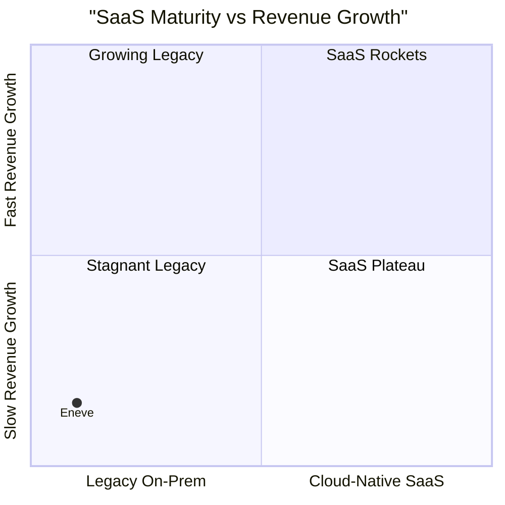
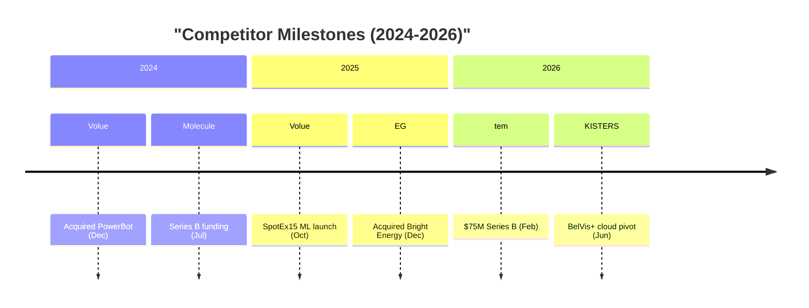

# Financial Dashboard - Exemplar

## Artifact Type

**Type**: Prompt (analysis/market)

## Why This is Exemplary

This prompt represents best-in-class implementation of the multi-source synthesis dashboard pattern. It demonstrates how to take individual per-competitor research outputs and fuse them into a single, high-impact strategic intelligence document that is impossible for decision-makers to ignore.

## Key Quality Elements

1. **Comprehensive output format template**: 345-line markdown template covering every section from classification matrix to methodology -- nothing left to interpretation
2. **7 Mermaid chart templates**: Revenue CAGR bar, Funding bar, Employee Growth bar, Growth vs Size quadrant, SaaS vs Revenue quadrant, Competitor Milestone timeline, and SaaS Maturity ranking -- covering bar, quadrant, and timeline chart types
3. **Reference entity on every chart**: Eneve placed in every leaderboard and chart (bold, estimated) to create visceral visual contrast -- the dashboard's core rhetorical device
4. **Dual-mode generation**: Clear separation of deterministic work (scripts for extraction, ranking, chart generation) and AI work (narrative, qualitative analysis) -- with an explicit table documenting who does what
5. **Evocative narrative element**: "The Meteor Warning" is structured as a 6-part narrative (Numbers Don't Lie, What Rockets Do Differently, Convergence Threat, Clock Is Ticking, What We Must Do, Bottom Line) that transforms data into urgency
6. **Data-scarcity-aware troubleshooting**: 4 specific problems (too few data sources, mostly estimated scores, chart rendering failures, speculative reference estimates) with concrete solutions
7. **4-band classification matrix**: Rocket / Riser / Steady / Dinosaur with score ranges, ensuring every competitor lands in exactly one band
8. **Few-shot example with real scorecard data**: 5-competitor example with scores, showing exactly what the output should look like at table level and chart level
9. **Script integration with clear handoff**: 3 Python scripts (`extract_competitor_data.py`, `generate_excel_report.py`, `generate_markdown_dashboard.py`) with command-line examples and a Quick Start section
10. **Dual output formats**: Both markdown dashboard (`.md`) and Excel workbook (`.xlsx`) from the same source data

## Pattern Demonstrated

**Multi-Source Synthesis Dashboard** -- a framework for prompts that:

1. Scan a folder of per-entity research files for a specific data section
2. Extract structured scores/metrics from each file into a unified dataset
3. Estimate a reference entity's position using the same rubric
4. Build ranked leaderboard tables for each major metric
5. Generate multiple Mermaid chart types from the aggregated data
6. Write a data-driven narrative that transforms numbers into strategic insight
7. Handle missing data explicitly (Missing Data table, Data Quality Notes)
8. Optionally delegate deterministic work to scripts, reserving AI for narrative

## Full Exemplar Content

Below are the key sections from the working prompt that demonstrate this pattern applied to financial competitor analysis in the European energy software market.

---

### Output Format Template (Exemplary)

The prompt specifies a complete output template (345 lines). Key structural elements:

**Classification Matrix** -- grouped by band, not alphabetically:

```markdown
### Rockets (Composite Score 7.0-10.0)
Companies with explosive growth, heavy investment, and market-disrupting trajectories.

| Company | Tier | Composite | Rev Growth | Funding | Emp Growth | Geo Expand | M&A | SaaS | Key Metric |
|---|---|---|---|---|---|---|---|---|---|
| [company] | [tier] | [score] | ... | [standout metric] |

### Dinosaurs (Composite Score 1.0-2.9)
| **Eneve (est.)** | **--** | **[score]** | ... | **[standout metric]** |
```

Bold reference entity in its (likely lowest) band creates the intended contrast.

**Leaderboard + Chart Pairing** -- every leaderboard table is immediately followed by its corresponding Mermaid chart:

```markdown
## Revenue Growth Leaderboard
| Rank | Company | Revenue (latest, EUR) | Revenue CAGR (3yr) | Classification |
|---|---|---|---|---|

### Revenue CAGR Chart
```mermaid
xychart-beta
    title "Revenue CAGR (3yr) - All Competitors"
    x-axis [Company1, Company2, ..., Eneve]
    y-axis "CAGR %" 0 --> 60
    bar [val1, val2, ..., eneveVal]
```
```

### Quadrant Charts (Exemplary)

Two quadrant charts provide strategic landscape views:

**Growth vs Size** -- reveals who is both large AND fast-growing (most dangerous):

```markdown

```

**SaaS Maturity vs Revenue Growth** -- highlights the dual gap (legacy architecture AND slow growth):

```markdown

```

### Timeline Chart (Exemplary)

Competitor milestones across 3 years, limited to 2-3 events per entity:

```markdown

```

### Meteor Warning Narrative Structure (Exemplary)

The narrative section has 6 prescribed subsections, each with clear instructions:

1. **The Numbers Don't Lie**: Raw facts -- how many Rockets, combined funding, average CAGR, Eneve comparison
2. **What the Rockets Are Doing That We Are Not**: 2-3 bullet points per Rocket with EUR amounts and growth percentages
3. **The Convergence Threat**: How multiple trends converge (AI-native entrants, market harmonisation, cloud platforms, VC money, NL market entry)
4. **The Clock Is Ticking**: Timeline projection -- when do rockets reach Eneve's market size?
5. **What Eneve Must Do**: 5 specific recommendations derived from data gaps (SaaS, AI, funding, growth, M&A)
6. **The Bottom Line**: One sentence per key number, punchy closing sentence

### Script Integration (Exemplary)

Clear separation of deterministic and AI work:

| Aspect | Scripts (deterministic) | AI Agent (narrative) |
| --- | --- | --- |
| Data extraction | All Growth Scorecards, revenue, funding, employees | -- |
| Leaderboard tables | Sorted, formatted, with ranks | -- |
| Mermaid charts | Generated with correct syntax | -- |
| Excel workbook | 7 sheets with formatting and charts | -- |
| Classification matrix | Grouped by Rocket/Riser/Steady/Dinosaur | -- |
| Meteor Warning | Skeleton with real numbers | **Full narrative with strategic insight** |
| Data quality notes | -- | **Qualitative assessment of data gaps** |

### Few-Shot Example (Exemplary)

A 5-competitor example with real-looking scorecard data:

| Company | Rev | Fund | Emp | Geo | M&A | SaaS | Composite | Class |
| --- | --- | --- | --- | --- | --- | --- | --- | --- |
| tem | 9 | 9 | 8 | 7 | 3 | 9 | 7.5 | Rocket |
| Volue | 7 | 5 | 7 | 7 | 9 | 6 | 6.8 | Riser |
| Engrate | 9 | 3 | 9 | 3 | 1 | 9 | 5.7 | Riser |
| SOPTIM | 4 | 2 | 3 | 4 | 3 | 4 | 3.3 | Steady |
| Eneve (est.) | 2 | 1 | 2 | 2 | 1 | 1 | 1.5 | Dinosaur |

The example then shows the resulting Revenue CAGR chart and an opening paragraph for the Meteor Warning, demonstrating calibrated output.

### Troubleshooting (Exemplary)

Four targeted problems with solutions:

1. **Too Few Competitors Have Financial Data** -- Generate with available data, list missing in table, prioritise Rockets for follow-up research
2. **Most Scores Are Estimated** -- Add confidence indicator (H/M/L), include only M/H in charts, list L separately with ranges
3. **Mermaid Charts Don't Render** -- Limit to 15 entities, abbreviate names, no spaces in IDs, test syntax
4. **Reference Entity Estimates Too Speculative** -- Use conservative estimates, mark with "(est.)" and bold, explain methodology in Data Quality Notes

### Quality Criteria (Exemplary)

15 specific, verifiable criteria including:
- All competitors with Financial & Growth Deep-Dive sections included
- Eneve estimated and placed in every leaderboard and chart
- Minimum 4 Mermaid charts that render correctly
- All leaderboards sorted by primary metric descending
- Meteor Warning references specific EUR amounts and growth percentages
- Meteor Warning includes actionable recommendations (not just doom)
- All Mermaid charts follow syntax rules

## Learning Points

1. **Reference entity on every chart is the killer feature**: Placing Eneve (or any baseline entity) on every leaderboard and chart transforms abstract competitive data into visceral "where do we stand?" insight. Without it, the dashboard is just information; with it, it's a call to action
2. **Band the classification matrix, don't sort it**: Grouping entities by Rocket/Riser/Steady/Dinosaur band (instead of a flat sorted table) immediately communicates the strategic landscape at a glance
3. **Pair leaderboard tables with Mermaid charts**: Tables provide precision; charts provide impact. Using both for the same metric serves different cognitive modes and stakeholder preferences
4. **Separate deterministic from narrative**: Scripts handle extraction, ranking, formatting, and chart generation (reproducible, testable). The AI handles the Meteor Warning narrative (creative, strategic). This division is documented explicitly so both human and AI know their lane
5. **Structure the narrative section rigidly**: The 6-part Meteor Warning structure (Numbers, Comparison, Convergence, Clock, Actions, Bottom Line) prevents the narrative from becoming vague or unfocused. Each subsection has clear instructions about what data to include
6. **Troubleshoot data scarcity explicitly**: Dashboards often face incomplete data. Addressing this directly (confidence indicators, partial dashboards, missing data tables) prevents the entire dashboard from being abandoned when data is imperfect
7. **Multiple Mermaid chart types enrich the view**: Bar charts show rankings, quadrant charts show strategic positioning, timelines show momentum. Using all three creates a multi-dimensional visual narrative
8. **Dual output formats (markdown + Excel)**: Markdown renders in Git/Cursor/wikis; Excel serves stakeholders who prefer spreadsheets. Same data, different audiences
9. **Evocative names drive action**: "Meteor Warning" is memorable; "Executive Summary" is forgettable. The metaphor (inbound meteor = competitive disruption) carries through the entire narrative section

## When to Reference

Use this exemplar when:

- Creating a new synthesis/dashboard prompt that aggregates per-entity research
- Wanting to see how to pair leaderboard tables with Mermaid chart templates
- Building prompts with a "reference entity on every chart" contrast pattern
- Designing data-driven narrative sections with rigid internal structure
- Setting up script-based generation alongside AI narrative enhancement
- Creating quadrant charts for strategic positioning visualisation
- Handling partial/incomplete data gracefully in dashboard prompts

## Related Exemplars

- `.cursor/exemplars/analysis/market/financial-growth-research-exemplar.md` -- The per-entity research prompt whose outputs this dashboard consumes
- `.cursor/exemplars/analysis/market/research-competitor-exemplar.md` -- Broader 8-category competitor research pattern

## Related Templars

- `.cursor/templars/analysis/market/multi-source-synthesis-dashboard-templar.md` -- The abstract pattern this exemplar implements
- `.cursor/templars/analysis/market/multi-dimensional-research-scorecard-templar.md` -- The per-entity pattern whose outputs feed into this dashboard

---

**Extracted From**: `.cursor/prompts/analysis/market/generate-financial-dashboard.prompt.md`
**Created**: 2026-02-15
