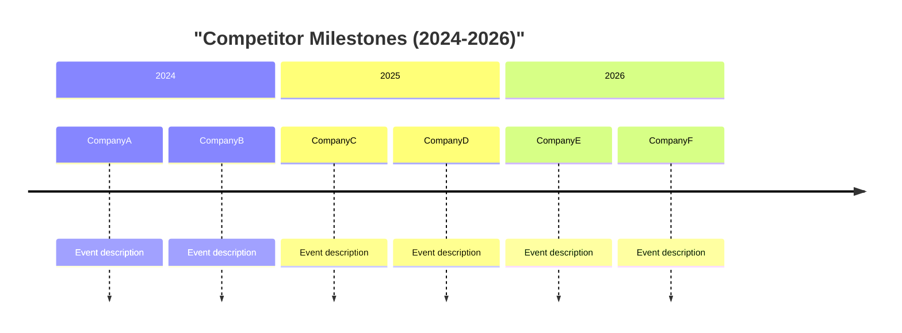

# Generate Financial Dashboard - Cross-Competitor Growth Analysis

Please generate a comprehensive financial dashboard that reads all competitor files from `tickets/COMPETITION/`, extracts their Growth Scorecard data, and produces a master ranking file with Mermaid charts, leaderboards, and a clear dinosaur-vs-rocket classification.

**Pattern**: Synthesis & Visualization Pattern
**Effectiveness**: Transforms per-competitor financial data into a single strategic intelligence document with visual impact
**Use When**: After `research-financial-growth` has been run on all (or most) competitors

---

## Purpose

This prompt synthesizes per-competitor financial data into a single, high-impact strategic document that:

- Ranks all competitors by financial growth metrics
- Classifies each as Rocket, Riser, Steady, or Dinosaur
- Produces Mermaid charts that render directly in markdown
- Places Eneve explicitly on every ranking for visceral contrast
- Delivers a "Meteor Warning" narrative designed to wake up decision-makers

This is the boat horn. The meteor is inbound. This document makes it impossible to ignore.

---

## Required Context

- **Competitor Files**: All files in `tickets/COMPETITION/*/` that contain a `## Financial & Growth Deep-Dive` section with a Growth Scorecard
- **README**: `@tickets/COMPETITION/README.md` for the competitor list and tier classification
- **Eneve Estimates**: The agent should estimate Eneve's own scores where possible (based on README positioning data: on-premise MSSQL, Netherlands-focused, migrating to C#/.NET, no external funding, no AI features, no acquisitions)

---

## Process

### Step 1: Scan All Competitor Files

Read every competitor file in `tickets/COMPETITION/*/`. For each file, extract:

- Company name
- Tier (from Identification section)
- Growth Scorecard (6 dimension scores + composite + classification)
- Key metrics: revenue (latest), revenue CAGR, total funding raised, employee count, employee CAGR, recurring revenue %

If a competitor file does NOT have a `## Financial & Growth Deep-Dive` section, list it in a "Missing Data" table and exclude from charts (but include in the master list with "N/A" scores).

### Step 2: Estimate Eneve's Position

Based on what we know about Eneve from the README:

- On-premise MSSQL platform, migrating to C#/.NET
- Netherlands-focused, expanding to Belgium
- No visible external funding
- No AI features in production
- No acquisitions
- Employee count: estimate from context (small team relative to competitors)

Create an honest Eneve Growth Scorecard using the same rubric. This will likely score low across most dimensions -- that is the point.

### Step 3: Build Leaderboards

For each major metric, rank all competitors (including Eneve) from highest to lowest. Create structured tables.

### Step 4: Generate Mermaid Charts

Create the following Mermaid diagrams. Follow Mermaid syntax rules strictly:

- No spaces in node IDs (use camelCase or underscores)
- No HTML tags
- Quote labels with special characters
- No explicit colors/styling (let theme handle it)

### Step 5: Write the Meteor Warning

Synthesize all data into a hard-hitting narrative. This is not a balanced assessment -- this is a wake-up call. Use the data to paint the picture of what happens if Eneve stays on its current trajectory while rockets accelerate.

### Step 6: Assemble Dashboard

Combine all sections into `tickets/COMPETITION/financial-dashboard.md`.

---

## Output Format

Generate the complete file `tickets/COMPETITION/financial-dashboard.md` with this structure:

````markdown
# Financial Growth Dashboard

**Generated**: YYYY-MM-DD
**Competitors Analyzed**: [N] of [total] (those with Financial & Growth Deep-Dive data)
**Data Source**: Per-competitor financial research via `research-financial-growth` prompt

---

## Growth Classification Matrix

### Rockets (Composite Score 7.0-10.0)

Companies with explosive growth, heavy investment, and market-disrupting trajectories.

| Company | Tier | Composite | Rev Growth | Funding | Emp Growth | Geo Expand | M&A | SaaS | Key Metric |
|---|---|---|---|---|---|---|---|---|---|
| [company] | [tier] | [score] | [score] | [score] | [score] | [score] | [score] | [score] | [standout metric] |

### Risers (Composite Score 5.0-6.9)

Companies with strong growth signals, actively investing in their future.

| Company | Tier | Composite | Rev Growth | Funding | Emp Growth | Geo Expand | M&A | SaaS | Key Metric |
|---|---|---|---|---|---|---|---|---|---|
| [company] | [tier] | [score] | [score] | [score] | [score] | [score] | [score] | [score] | [standout metric] |

### Steady (Composite Score 3.0-4.9)

Stable companies with moderate growth. Evolutionary, not revolutionary.

| Company | Tier | Composite | Rev Growth | Funding | Emp Growth | Geo Expand | M&A | SaaS | Key Metric |
|---|---|---|---|---|---|---|---|---|---|
| [company] | [tier] | [score] | [score] | [score] | [score] | [score] | [score] | [score] | [standout metric] |

### Dinosaurs (Composite Score 1.0-2.9)

Flat or declining. Legacy mode. No visible investment in transformation.

| Company | Tier | Composite | Rev Growth | Funding | Emp Growth | Geo Expand | M&A | SaaS | Key Metric |
|---|---|---|---|---|---|---|---|---|---|
| **Eneve (est.)** | **--** | **[score]** | **[score]** | **[score]** | **[score]** | **[score]** | **[score]** | **[score]** | **[standout metric]** |
| [company] | [tier] | [score] | [score] | [score] | [score] | [score] | [score] | [score] | [standout metric] |

> Note: Eneve's scores are estimates based on publicly known positioning. Bold to highlight our position.

---

## Revenue Growth Leaderboard

| Rank | Company | Revenue (latest, EUR) | Revenue CAGR (3yr) | Classification |
|---|---|---|---|---|
| 1 | [company] | EUR [amount] | [%] | Rocket |
| 2 | [company] | EUR [amount] | [%] | Rocket |
| ... | ... | ... | ... | ... |
| [N] | **Eneve (est.)** | **EUR [amount]** | **[%]** | **[class]** |

### Revenue CAGR Chart

```mermaid
xychart-beta
    title "Revenue CAGR (3yr) - All Competitors"
    x-axis [Company1, Company2, ..., Eneve]
    y-axis "CAGR %" 0 --> 60
    bar [val1, val2, ..., eneveVal]
```

> Populate from Revenue Growth Leaderboard data. Sort descending by CAGR. Eneve always last (bold in leaderboard table, visually at the end of the chart for contrast).

---

## Funding Leaderboard

| Rank | Company | Total Raised (EUR) | Latest Round | Latest Valuation | Classification |
|---|---|---|---|---|---|
| 1 | [company] | EUR [amount] | [round] | EUR [val] | Rocket |
| ... | ... | ... | ... | ... | ... |
| [N] | **Eneve (est.)** | **EUR 0** | **None** | **N/A** | **[class]** |

### Total Funding Chart

```mermaid
xychart-beta
    title "Total Funding Raised (EUR M)"
    x-axis [Company1, Company2, ..., Eneve]
    y-axis "EUR Millions" 0 --> 100
    bar [val1, val2, ..., 0]
```

> Populate from Funding Leaderboard data. Sort descending. Eneve's zero will create a stark visual gap.

---

## Employee Growth Leaderboard

| Rank | Company | Headcount (latest) | Employee CAGR (3yr) | Open Positions | Classification |
|---|---|---|---|---|---|
| 1 | [company] | [count] | [%] | [positions] | Rocket |
| ... | ... | ... | ... | ... | ... |
| [N] | **Eneve (est.)** | **[count]** | **[%]** | **[positions]** | **[class]** |

### Employee Growth Chart

```mermaid
xychart-beta
    title "Employee CAGR (3yr) - All Competitors"
    x-axis [Company1, Company2, ..., Eneve]
    y-axis "CAGR %" 0 --> 40
    bar [val1, val2, ..., eneveVal]
```

> Populate from Employee Growth Leaderboard data. Sort descending. Rapid hiring = investment signal.

---

## SaaS Maturity Ranking

| Rank | Company | Recurring Revenue % | Deployment Model | SaaS Score | Classification |
|---|---|---|---|---|---|
| 1 | [company] | [%] | Cloud-native | [score] | Rocket |
| ... | ... | ... | ... | ... | ... |
| [N] | **Eneve (est.)** | **~0%** | **On-premise (migrating)** | **[score]** | **[class]** |

---

## Growth vs Size Quadrant

```mermaid
quadrantChart
    title "Growth Rate vs Company Size"
    x-axis "Small" --> "Large"
    y-axis "Slow Growth" --> "Fast Growth"
    quadrant-1 "Dangerous Giants"
    quadrant-2 "Incoming Disruptors"
    quadrant-3 "Marginal Players"
    quadrant-4 "Sleeping Giants"
    Company1: [x1, y1]
    Company2: [x2, y2]
    Eneve: [0.2, 0.15]
```

> Position each competitor using: X = relative company size (headcount or revenue normalized 0-1), Y = composite growth score normalized 0-1. This chart reveals the strategic landscape:

- **Top-Right (Dangerous Giants)**: Large AND fast-growing -- most dangerous to Eneve
- **Top-Left (Incoming Disruptors)**: Small but fast-growing -- the rockets approaching
- **Bottom-Right (Sleeping Giants)**: Large but slow -- incumbents ripe for disruption
- **Bottom-Left (Marginal Players)**: Small and slow -- low threat

---

## Competitor Milestone Timeline



> Populate with the most impactful events per competitor: funding rounds (with amounts), acquisitions, product launches, geographic expansion. Maximum 2-3 events per company to avoid clutter.

---

## SaaS Maturity vs Revenue Growth Scatter

```mermaid
quadrantChart
    title "SaaS Maturity vs Revenue Growth"
    x-axis "Legacy On-Prem" --> "Cloud-Native SaaS"
    y-axis "Slow Revenue Growth" --> "Fast Revenue Growth"
    quadrant-1 "SaaS Rockets"
    quadrant-2 "Growing Legacy"
    quadrant-3 "Stagnant Legacy"
    quadrant-4 "SaaS Plateau"
    Company1: [x1, y1]
    Company2: [x2, y2]
    Eneve: [0.1, 0.15]
```

> This chart reveals the SaaS transition dimension specifically. Companies in top-right are both growing fast AND cloud-native -- the ultimate competitive threat. Eneve's position in bottom-left highlights the dual gap: legacy architecture AND slow growth.

---

## The Meteor Warning

### The Numbers Don't Lie

[Opening paragraph: state the raw facts. How many competitors scored as Rockets? What is their combined funding? What is their average revenue CAGR? How does Eneve compare on every dimension?]

### What the Rockets Are Doing That We Are Not

[For each Rocket-classified competitor, 2-3 bullet points on their key financial moves: funding raised, revenue growth, acquisitions made, SaaS transition completed. Make it concrete with EUR amounts and growth percentages.]

### The Convergence Threat

[Explain how multiple trends converge against Eneve:
- AI-native entrants building from scratch what took Eneve 20+ years
- European energy market harmonization (ENTSO-E, MARI, PICASSO) eroding national moats
- Cloud-native platforms with 10x faster implementation times
- PE/VC money pouring into energy software (total funding across all tracked competitors)
- Competitors entering NL market or acquiring NL-capable companies]

### The Clock Is Ticking

[Timeline projection: Based on growth rates observed, when do the fastest rockets reach Eneve's market size? When do they likely enter the Netherlands? What acquisition patterns suggest they could buy their way into NL expertise?]

### What Eneve Must Do

[Specific, actionable recommendations derived from the financial data:
1. [Recommendation based on SaaS gap]
2. [Recommendation based on AI gap]
3. [Recommendation based on funding gap]
4. [Recommendation based on growth gap]
5. [Recommendation based on M&A gap]]

### The Bottom Line

[Final paragraph: One sentence per key number. Total competitor funding vs Eneve's zero. Average competitor revenue CAGR vs Eneve's. Number of competitors ahead on SaaS maturity. Number of competitors with AI in production. End with a single, punchy sentence that makes the urgency undeniable.]

---

## Missing Data

Competitors without `## Financial & Growth Deep-Dive` sections:

| Company | File | Status | Action Needed |
|---|---|---|---|
| [company] | [path] | No financial data | Run `@research-financial-growth [company] [path]` |

---

## Data Quality Notes

[List any caveats about data quality, estimation methodology for Eneve, currency conversion assumptions, or conflicting sources across competitor files]

---

## Methodology

- **Scoring**: All Growth Scorecard scores use the rubric defined in `research-financial-growth.prompt.md`
- **Classification**: Rocket (7.0-10.0), Riser (5.0-6.9), Steady (3.0-4.9), Dinosaur (1.0-2.9)
- **Eneve Estimates**: Based on publicly known positioning from `tickets/COMPETITION/README.md`
- **Currency**: All EUR equivalents use approximate exchange rates at time of research
- **Rankings**: Tied scores broken by revenue CAGR, then funding raised
````

---

## Examples (Few-Shot)

See the exemplar for detailed few-shot examples with real scorecard data, chart output, and Meteor Warning opening paragraph: `.cursor/exemplars/analysis/market/financial-dashboard-exemplar.md`

---

## Troubleshooting

### Problem: Too Few Competitors Have Financial Data

**Symptoms**: Only 3-5 of 25+ competitors have `## Financial & Growth Deep-Dive` sections.

**Solution**:

1. Generate the dashboard with available data -- partial intelligence is better than none
2. List all missing competitors in the "Missing Data" table with their file paths
3. Add a prominent note at the top: "Dashboard based on [N] of [total] competitors. Run `@research-financial-growth` on remaining competitors for complete picture."
4. Prioritize running `research-financial-growth` on competitors most likely to be Rockets first (check README tier classification for hints)

### Problem: Most Scores Are "Unknown" or Estimated

**Symptoms**: Many competitors are private companies with low data availability.

**Solution**:

1. Use a confidence indicator per competitor in the leaderboard tables: (H)igh, (M)edium, (L)ow
2. Add a "Data Confidence" column to the Growth Classification Matrix
3. In Mermaid charts, include only competitors with Medium or High confidence for visual accuracy
4. List Low-confidence competitors separately with their estimated ranges rather than point values

### Problem: Mermaid Charts Don't Render

**Symptoms**: Chart syntax errors or too many data points cause rendering issues.

**Solution**:

1. Limit bar charts to top 15 competitors (plus Eneve) -- too many X-axis labels cause clutter
2. Avoid special characters in company names on X-axis (use abbreviations: "SopraSteria" not "Sopra Steria cpX.Energy")
3. No spaces in quadrant chart node IDs (use camelCase: "temEnergy" not "tem energy")
4. Test chart syntax by re-reading the generated file and checking for common issues: missing commas in arrays, mismatched brackets, negative values where axis starts at 0

### Problem: Eneve Estimates Are Too Speculative

**Symptoms**: Limited information about Eneve's actual revenue, headcount, or growth rate.

**Solution**:

1. Use the most conservative plausible estimates -- the point is directional contrast, not precision
2. Mark all Eneve entries with "(est.)" and bold formatting
3. Add a Data Quality Note explaining the estimation methodology
4. If Eneve data improves (e.g., management provides actual figures), re-run the dashboard

---

## Mermaid Chart Templates

The Output Format section above contains chart templates inline with their leaderboards. For additional reference charts with sample competitor data, see the exemplar: `.cursor/exemplars/analysis/market/financial-dashboard-exemplar.md`

Follow these Mermaid syntax rules for all charts:
- **Bar charts (xychart-beta)**: Sort descending, limit to top 15 + Eneve, no special characters in X-axis labels
- **Quadrant charts**: Normalise axes to 0-1, use camelCase for entity IDs, label quadrants descriptively
- **Timeline charts**: Max 2-3 events per entity, group by year, focus on impactful events

---

## Quality Criteria

- [ ] All competitors with Financial & Growth Deep-Dive sections included in rankings
- [ ] Eneve estimated and placed in every leaderboard and chart
- [ ] Growth Classification Matrix has all four tiers populated
- [ ] Minimum 4 Mermaid charts that render correctly (bar, bar, quadrant, timeline)
- [ ] Revenue Growth Leaderboard sorted by CAGR descending
- [ ] Funding Leaderboard sorted by total raised descending
- [ ] Employee Growth Leaderboard sorted by CAGR descending
- [ ] SaaS Maturity Ranking sorted by score descending
- [ ] Meteor Warning section references specific EUR amounts and growth percentages
- [ ] Meteor Warning includes actionable recommendations (not just doom)
- [ ] Missing Data table lists competitors without financial data
- [ ] Data Quality Notes acknowledge estimation methodology
- [ ] Dashboard saved to `tickets/COMPETITION/financial-dashboard.md`
- [ ] All Mermaid charts follow syntax rules (no spaces in IDs, no HTML, quoted special chars)

---

## Script-Based Generation (Recommended)

Reusable Python scripts automate the deterministic extraction and formatting, producing both an Excel workbook and the markdown dashboard. The AI agent then adds the Meteor Warning narrative and any qualitative analysis.

**Scripts location**: `.cursor/scripts/analysis/market/`

| Script | Purpose | Output |
| --- | --- | --- |
| `extract_competitor_data.py` | Parse all `financial-growth.md` files into structured JSON | `competitor_data.json` |
| `generate_excel_report.py` | Formatted Excel workbook (7 sheets, charts, conditional formatting) | `financial-dashboard.xlsx` |
| `generate_markdown_dashboard.py` | Markdown dashboard with Mermaid charts and leaderboards | `financial-dashboard.md` |

### Quick Start

```bash
# Install dependency (one-time)
pip install -r .cursor/scripts/analysis/market/requirements.txt

# Step 1: Extract all competitor data to JSON
python .cursor/scripts/analysis/market/extract_competitor_data.py \
    --input tickets/COMPETITION/ \
    --output tickets/COMPETITION/competitor_data.json

# Step 2: Generate Excel workbook
python .cursor/scripts/analysis/market/generate_excel_report.py \
    --input tickets/COMPETITION/competitor_data.json \
    --output tickets/COMPETITION/financial-dashboard.xlsx

# Step 3: Generate markdown dashboard
python .cursor/scripts/analysis/market/generate_markdown_dashboard.py \
    --input tickets/COMPETITION/competitor_data.json \
    --output tickets/COMPETITION/financial-dashboard.md
```

### Direct from Source (skips JSON intermediate)

```bash
python .cursor/scripts/analysis/market/generate_excel_report.py \
    --source tickets/COMPETITION/ \
    --output tickets/COMPETITION/financial-dashboard.xlsx
```

### What Scripts Handle vs What AI Adds

| Aspect | Scripts (deterministic) | AI Agent (narrative) |
| --- | --- | --- |
| Data extraction | All Growth Scorecards, revenue, funding, employees | -- |
| Leaderboard tables | Sorted, formatted, with ranks | -- |
| Mermaid charts | Generated with correct syntax | -- |
| Excel workbook | 7 sheets with formatting and charts | -- |
| Classification matrix | Grouped by Rocket/Riser/Steady/Dinosaur | -- |
| Meteor Warning | Skeleton with real numbers | **Full narrative with strategic insight** |
| Eneve estimates | Uses data from `eneve/financial-growth.md` | **Adds context and positioning commentary** |
| Data quality notes | -- | **Qualitative assessment of data gaps** |

---

## Reasoning Process (for AI Agent)

When this prompt is invoked, the AI should:

1. **Run extraction script** (or manually scan): Extract Growth Scorecard data from all `tickets/COMPETITION/*/financial-growth.md` files
2. **Track missing data**: Note which competitors lack financial deep-dive sections
3. **Generate Excel workbook**: Run `generate_excel_report.py` for the formatted `.xlsx` output
4. **Generate markdown dashboard**: Run `generate_markdown_dashboard.py` for the `.md` output
5. **Enhance Meteor Warning**: Replace the skeleton narrative with a compelling, data-backed strategic analysis
6. **Add Data Quality Notes**: Document estimation methodology and data confidence levels
7. **Validate charts**: Re-read generated Mermaid blocks to confirm they follow syntax rules

---

## Usage

Run once after financial research is complete for all (or most) competitors:

```text
@generate-financial-dashboard
```

Re-run whenever new competitor financial data is added:

```text
@generate-financial-dashboard
```

---

## Related Prompts

- `analysis/market/research-financial-growth.prompt.md` - Per-competitor financial research that produces the Growth Scorecards consumed by this dashboard
- `analysis/market/research-competitor.prompt.md` - Broader 8-category competitive analysis
- `analysis/market/research-protocols.prompt.md` - Protocol-based competitor discovery

---

## Related Scripts

- `.cursor/scripts/analysis/market/extract_competitor_data.py` - Core data extraction (markdown to JSON)
- `.cursor/scripts/analysis/market/generate_excel_report.py` - Excel workbook generation
- `.cursor/scripts/analysis/market/generate_markdown_dashboard.py` - Markdown dashboard generation

---

## Pattern Used

This prompt follows: `.cursor/templars/analysis/market/multi-source-synthesis-dashboard-templar.md`

## Reference Example

See exemplar: `.cursor/exemplars/analysis/market/financial-dashboard-exemplar.md`

## Related Rules

- `.cursor/rules/prompts/prompt-creation-rule.mdc` - Prompt creation standards
- `.cursor/rules/prompts/prompt-registry-integration-rule.mdc` - Registry format requirements

---

**Created**: 2026-02-15
**Updated**: 2026-02-15 (added script-based generation workflow)
**Context**: tickets/COMPETITION/ competitive landscape financial dashboard
**Follows**: `.cursor/rules/prompts/prompt-creation-rule.mdc` v1.0.0
