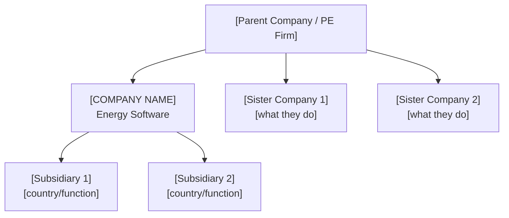
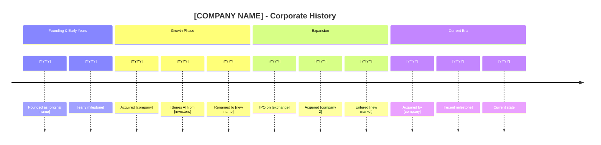
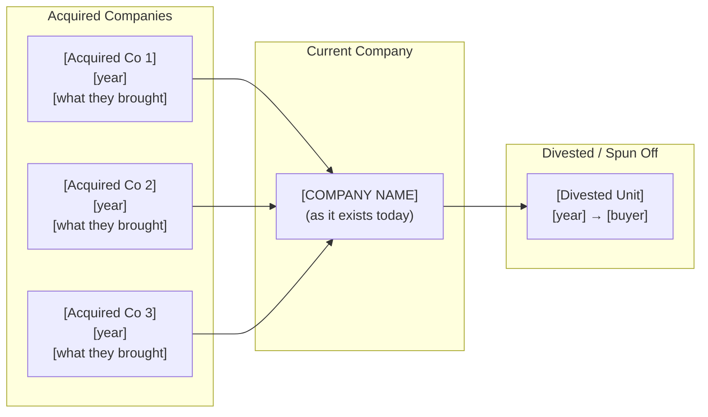

# Research Company History - Corporate Genealogy

Please perform a structured research session on the full corporate history of an energy software company. This prompt drives systematic web research to reconstruct the company's genealogy: mergers, acquisitions, name changes, spin-offs, investment rounds, and critical events that shaped its current form.

**Pattern**: Guided Discovery Pattern
**Effectiveness**: Reveals the true origins, inherited capabilities, and strategic trajectory of competitors
**Use When**: After initial identification, to understand how a company got to where it is today and what that means for its future direction

---

## Purpose

Many energy software companies are the product of decades of mergers, acquisitions, spin-offs, and rebrands. Understanding this history is critical because:
- Acquired companies bring inherited codebases, customers, and market knowledge
- Name changes and rebrands often mask the true age and origin of products
- Investment rounds signal strategic direction and growth ambitions
- Spin-offs and splits reveal which business units a parent company considers non-core
- M&A patterns reveal a company's expansion strategy (geographic, product, market segment)
- Corporate events like IPOs, delistings, or PE buyouts fundamentally change company behavior

Without this history, competitor profiles remain surface-level snapshots that miss the underlying forces shaping the competitive landscape.

---

## Required Context

- **Company Name**: The company to research (current name, e.g., "Volue ASA")
- **Company Folder** (optional): Path to the competitor's folder in `tickets/COMPETITION/` (e.g., `@tickets/COMPETITION/volue/`)
- **Eneve Context**: Reference `@tickets/COMPETITION/README.md` for positioning context

---

## Process

### Step 1: Read Existing Profile (if available)

If a competitor folder exists, read the main identification file (e.g., `volue.md`) and any other existing research files to understand what we already know. Note any historical references or dates already captured.

### Step 2: Research Current Corporate Structure & Ownership

Establish the present-day baseline:
- Legal entity name, jurisdiction, and registration number
- Parent company (if subsidiary)
- Publicly traded or privately held
- Current ownership breakdown (who owns what percentage today)
- Major shareholders with stake sizes (PE firms, strategic investors, founders, public float)
- Board of directors composition (who sits on the board, who do they represent)
- Sister companies under the same parent/PE umbrella (reveals consolidation plays)
- Current brand architecture (product brands vs corporate brand)

### Step 3: Trace Origin Story

Research the company's founding and early history:
- Original founding date, founders, and initial mission
- Original company name (if different from today)
- Original product or service offering
- First customers and market segment
- Early technology decisions that shaped the product

### Step 4: Map Mergers & Acquisitions

Research every M&A event involving this company, both as acquirer and target:

**As acquirer (companies they bought):**
- Target company name, date, and deal value (if disclosed)
- What the acquired company brought (products, customers, technology, market access)
- Whether the acquired product was integrated, maintained separately, or sunsetted

**As acquisition target (companies that bought them):**
- Acquiring company, date, and deal value
- Strategic rationale stated at acquisition time
- What changed post-acquisition (branding, leadership, strategy)

### Step 5: Document Name Changes & Rebrands

Trace every corporate identity change:
- Previous company names with dates of each change
- Reasons for name changes (merger, rebrand, pivot, parent change)
- Product name changes (separate from corporate name)
- Brand architecture changes (e.g., product became a division name)

### Step 6: Research Investment Rounds & Financial Events

Document significant financial events:
- Seed, Series A/B/C rounds with investors, dates, amounts
- Investor profiles: classify each investor (strategic energy investor, generalist VC, PE roll-up fund, sovereign wealth fund, government/public, corporate venture arm)
- IPO date, exchange, initial valuation
- Secondary offerings, delistings, take-private transactions
- PE buyouts with firm names, fund details, and other portfolio companies in energy sector
- Government grants, EU funding, national innovation subsidies (common in European energy sector)
- Debt financing events (if significant and public)
- Revenue milestones (if publicly reported)

### Step 7: Document Splits, Spin-offs & Divestitures

Research any corporate fragmentation events:
- Business unit spin-offs (what was spun off and why)
- Product line divestitures (what was sold and to whom)
- Geographic exits (markets abandoned)
- Joint ventures formed or dissolved
- Demergers or structural reorganizations

### Step 8: Identify Critical Events

Document pivotal moments that changed the company's trajectory:
- Leadership changes (CEO/CTO transitions with strategic impact)
- Major product launches or platform rewrites
- Market pivots (e.g., on-prem to SaaS, single-market to multi-market)
- Regulatory events (won/lost key certifications, compliance changes)
- Major customer wins or losses
- Crisis events (financial trouble, lawsuits, security breaches)
- Strategic partnerships formed or dissolved

### Step 9: Build Visual Diagrams & Timeline

Synthesize all findings into visual Mermaid diagrams and a chronological timeline:

**Required diagrams:**
- **Corporate Structure** (graph TD): Ownership tree showing parent, company, sister companies, subsidiaries
- **Corporate Timeline** (timeline): Chronological view of all events grouped by phase
- **M&A Genealogy** (graph LR): How the company was assembled from acquisitions, and what was divested

**Pattern analysis from the timeline:**
- Growth phases vs consolidation phases
- Organic growth vs acquisition-driven growth
- Technology evolution across the timeline
- Leadership continuity vs turnover patterns

### Step 10: Assess Strategic Implications

Based on the full corporate history, assess:
- What the history tells us about likely future moves
- Inherited strengths (from acquisitions, long history)
- Inherited weaknesses (legacy tech debt, cultural integration issues)
- How the corporate history affects competitiveness against Eneve

### Step 11: Write Corporate History File

Write the corporate history output to a **separate file** within the competitor's folder:

- **File path**: `tickets/COMPETITION/[company-slug]/corporate-history.md`
- **Create the company folder** if it doesn't exist yet (e.g., `tickets/COMPETITION/volue/`)
- Do NOT append to the main identification file -- keep research outputs in their own dedicated files
- If a `corporate-history.md` already exists, replace it with the updated version

---

## Research Categories

### Category 1: Ownership & Key Parties

| Data Point | Search Strategy |
|---|---|
| Current shareholders with % stakes | Annual reports, stock exchange filings, Crunchbase, PitchBook |
| Investor type classification | Investor websites, Crunchbase (strategic/VC/PE/sovereign/government) |
| Board of directors | Company website, LinkedIn, annual reports |
| Board member affiliations | LinkedIn profiles, investor websites (who do they represent?) |
| Parent company & subsidiaries | Trade register, annual reports, corporate structure pages |
| Sister companies under same owner | PE firm portfolio pages, parent company annual reports |
| PE firm's other energy portfolio companies | PE firm website portfolio section |
| Government / public sector backing | EU CORDIS database, national innovation agency databases, press releases |

### Category 2: Corporate Identity Timeline

| Data Point | Search Strategy |
|---|---|
| Original company name | Company website "about" / "history" page, Wikipedia, trade registers |
| All previous names with dates | Companies House, trade register, press releases, Wikipedia |
| Reasons for each name change | Press releases at time of change, news articles |
| Current legal entity | National trade register, annual reports |
| Registration / incorporation details | Companies House (UK), KvK (NL), Handelsregister (DE), SEC (US) |

### Category 3: Mergers & Acquisitions

| Data Point | Search Strategy |
|---|---|
| Acquisitions made (as buyer) | Crunchbase, press releases, annual reports, M&A databases |
| Acquisitions (as target) | Crunchbase, press releases, parent company reports |
| Deal values | Press releases, SEC filings, Crunchbase, news articles |
| Post-acquisition integration | Product pages (did acquired product survive?), press releases |
| Failed/abandoned acquisitions | News articles, regulatory filings |

### Category 4: Investment & Financial Events

| Data Point | Search Strategy |
|---|---|
| Funding rounds (seed through late stage) | Crunchbase, PitchBook, TechCrunch, EU-Startups |
| Investor type and profile | Investor websites, portfolio pages, Crunchbase |
| IPO details | Stock exchange filings, prospectus, news coverage |
| PE buyouts | PE firm websites, press releases, Crunchbase |
| Take-private transactions | SEC filings, press releases, financial news |
| Government / EU grants | EU CORDIS, national innovation agency databases, press releases |
| Revenue milestones | Annual reports, press releases, analyst estimates |

### Category 5: Splits & Divestitures

| Data Point | Search Strategy |
|---|---|
| Spin-offs (divisions made independent) | Press releases, stock exchange filings, news |
| Divestitures (parts sold) | Press releases, M&A databases, buyer announcements |
| Joint ventures formed/dissolved | Press releases, company website partnerships page |
| Geographic market exits | Reduced job postings, office closures, press |

### Category 6: Critical Events & Milestones

| Data Point | Search Strategy |
|---|---|
| CEO/CTO changes | LinkedIn, press releases, company about page |
| Major product launches | Product pages, press releases, conference talks |
| Platform rewrites / tech migrations | Job postings, technical blog, conference talks |
| Key customer wins | Case studies, press releases, annual reports |
| Strategic partnerships | Partner pages, press releases, joint announcements |
| Crisis events | News articles, legal filings, Glassdoor reviews |

---

## Output Format

Structure the output as a **standalone markdown file** saved to `tickets/COMPETITION/[company-slug]/corporate-history.md`:

```markdown
# Corporate History - [COMPANY NAME]

**Research Date**: YYYY-MM-DD
**Genealogy Confidence**: High / Medium / Low (based on source availability)

### Current Ownership & Key Parties

| Stakeholder | Role | Stake % | Type | Since | Source |
|---|---|---|---|---|---|
| [name] | [Majority shareholder / PE investor / Founder / Public float] | [%] | [Strategic / VC / PE / Sovereign / Government / Corporate] | [year] | [source] |

**Board of Directors**:

| Name | Role | Represents | Background | Source |
|---|---|---|---|---|
| [name] | [Chair / Director / Independent] | [investor/founder/independent] | [relevant background] | [source] |

**Corporate Structure** (Mermaid diagram):



Adapt the diagram to match the actual structure. Omit levels that don't exist (e.g., no parent if independent). Highlight sister companies in the energy sector -- these reveal consolidation strategies.

### Origin Story

| Data Point | Value | Source | Confidence |
|---|---|---|---|
| Founded | [year] | [source] | Confirmed/Estimated |
| Original Name | [name] | [source] | ... |
| Founders | [names] | [source] | ... |
| Original Mission | [description] | [source] | ... |
| Original Product | [description] | [source] | ... |
| First Market | [segment/country] | [source] | ... |

### Corporate Identity Changes

| # | Date | From | To | Reason | Source |
|---|---|---|---|---|---|
| 1 | [YYYY] | [old name] | [new name] | [reason] | [source] |
| 2 | [YYYY] | [old name] | [new name] | [reason] | [source] |

### Mergers & Acquisitions Timeline

#### Acquisitions Made (as buyer)

| Date | Target Company | Deal Value | What Was Gained | Integration Outcome | Source |
|---|---|---|---|---|---|
| [YYYY-MM] | [company] | [value or "undisclosed"] | [products/customers/tech/market] | [integrated/maintained/sunsetted] | [source] |

#### Acquired By (as target)

| Date | Acquiring Company | Deal Value | Strategic Rationale | Source |
|---|---|---|---|---|
| [YYYY-MM] | [company] | [value or "undisclosed"] | [stated reason] | [source] |

### Investment & Financial Events

| Date | Event Type | Details | Investors/Counterparty | Investor Type | Amount | Source |
|---|---|---|---|---|---|---|
| [YYYY-MM] | [Seed/Series A/IPO/PE Buyout/Grant/etc.] | [description] | [names] | [Strategic/VC/PE/Govt/etc.] | [amount] | [source] |

### Splits, Spin-offs & Divestitures

| Date | Event Type | What Was Separated | Destination / Buyer | Reason | Source |
|---|---|---|---|---|---|
| [YYYY-MM] | [spin-off/divestiture/demerger] | [business unit/product] | [new entity/buyer] | [stated reason] | [source] |

### Critical Events & Milestones

| Date | Event | Impact | Source |
|---|---|---|---|
| [YYYY-MM] | [event description] | [significance] | [source] |

### Corporate Timeline (Visual)

Render the full corporate history as a Mermaid timeline:



Group events into logical phases (founding, growth, expansion, current era). Adjust section names to reflect the actual trajectory.

### M&A Genealogy (Visual)

Render how the company was assembled from its parts:



Adapt to show the actual M&A tree. For companies built through many acquisitions, this diagram is essential for understanding what capabilities came from where.

### Corporate Timeline (Text Summary)

```text
[YYYY] - Founded as [original name] by [founders]
[YYYY] - [milestone event]
[YYYY] - Acquired [company], gaining [capability]
[YYYY] - Renamed to [new name]
[YYYY] - [Series A] raised [amount] from [investors]
[YYYY] - IPO on [exchange] at [valuation]
[YYYY] - Acquired by [company] for [amount]
[YYYY] - Spin-off of [division]
[YYYY] - Current state: [summary]
```

### Pattern Analysis

**Growth Strategy**: [Organic / Acquisition-driven / Hybrid]
**Acquisition Pattern**: [Geographic expansion / Product expansion / Talent acquisition / Customer base]
**Technology Evolution**: [Summary of platform/tech changes across history]
**Leadership Stability**: [High turnover / Stable / Founder-led]

### Strategic Implications for Eneve

**What the history reveals about future direction**:
- [Insight 1 with evidence]
- [Insight 2 with evidence]

**Inherited strengths from corporate history**:
- [Strength 1]: [how it was acquired and why it matters]
- [Strength 2]: [how it was acquired and why it matters]

**Inherited weaknesses / risks from corporate history**:
- [Weakness 1]: [evidence from history]
- [Weakness 2]: [evidence from history]

**M&A prediction**: [Based on patterns, what might they acquire or be acquired by next?]
```

---

## Quality Criteria

- [ ] Current ownership structure documented (shareholders, stake sizes, investor types)
- [ ] Board of directors listed with affiliations (who they represent)
- [ ] Sister companies / PE portfolio overlap identified (consolidation signals)
- [ ] Origin story documented with founding date, founders, and original name
- [ ] All known name changes listed with dates and reasons
- [ ] All known acquisitions documented (both as buyer and target)
- [ ] Investment rounds documented with dates, amounts, investors, and investor types
- [ ] Government/EU funding identified if applicable
- [ ] Spin-offs and divestitures identified and documented
- [ ] At least 5 critical events / milestones captured
- [ ] Mermaid corporate structure diagram generated (ownership tree)
- [ ] Mermaid timeline diagram generated (chronological visual)
- [ ] Mermaid M&A genealogy diagram generated (acquisition tree)
- [ ] Text timeline synthesized from all events
- [ ] Each data point has source attribution
- [ ] Each data point has confidence level (Confirmed/Estimated/Unknown)
- [ ] Pattern analysis completed (growth strategy, acquisition pattern)
- [ ] Strategic implications assessed relative to Eneve
- [ ] Output saved to `tickets/COMPETITION/[company-slug]/corporate-history.md` (not appended to main file)
- [ ] Contradictions between sources noted explicitly

---

## Usage

### Single company history

```
@research-company-history Volue ASA @tickets/COMPETITION/volue/
```

```
@research-company-history Brady Technologies @tickets/COMPETITION/brady-technologies-powerdesk/
```

```
@research-company-history KISTERS @tickets/COMPETITION/kisters-belvis/
```

### Company without existing folder

```
@research-company-history Hitachi Energy
```

### Focus on recent M&A activity

```
@research-company-history ION Commodities -- focus on the acquisition history that built this company, including all predecessor brands
```

### Trace a product's lineage

```
@research-company-history Brady Technologies -- trace the PowerDesk product specifically, including which company originally built it and how it ended up at Brady
```

---

## Search Query Templates

**Origin & founding:**
- `"[COMPANY]" founded history origin`
- `"[COMPANY]" Wikipedia`
- `"[COMPANY]" "was founded" OR "was established"`

**Name changes:**
- `"[COMPANY]" "formerly known as" OR "previously named" OR "renamed"`
- `"[OLD NAME]" renamed "[NEW NAME]"`
- `"[COMPANY]" rebrand OR rebranding`

**Mergers & acquisitions:**
- `"[COMPANY]" acquisition OR acquired OR merger 2020..2026`
- `"[COMPANY]" acquires OR "has acquired"`
- `"[COMPANY]" "acquired by" OR "merger with"`
- `site:crunchbase.com "[COMPANY]" acquisitions`

**Ownership & key parties:**
- `"[COMPANY]" shareholders ownership structure annual report`
- `"[COMPANY]" board of directors`
- `"[COMPANY]" "backed by" OR "invested in by" OR "portfolio company"`
- `"[PE FIRM]" portfolio energy software` (once PE investor is known)
- `site:kvk.nl "[COMPANY]"` OR `site:companieshouse.gov.uk "[COMPANY]"` (trade registers)

**Investment rounds:**
- `"[COMPANY]" funding round series investment`
- `"[COMPANY]" IPO valuation stock`
- `"[COMPANY]" "private equity" OR "venture capital"`
- `"[COMPANY]" EU grant OR "innovation funding" OR subsidy`
- `site:crunchbase.com "[COMPANY]" funding`

**Splits & spin-offs:**
- `"[COMPANY]" spin-off OR spinoff OR demerger`
- `"[COMPANY]" divestiture OR divested OR sold`
- `"[COMPANY]" "split into" OR "separated from"`

**Critical events:**
- `"[COMPANY]" CEO appointed OR "new CEO"`
- `"[COMPANY]" launched OR "new product" OR "platform"`
- `"[COMPANY]" partnership OR "strategic alliance"`
- `"[COMPANY]" annual report [YEAR]`

**Trade registers:**
- `site:kvk.nl "[COMPANY]"` (Netherlands)
- `site:companieshouse.gov.uk "[COMPANY]"` (UK)
- `site:handelsregister.de "[COMPANY]"` (Germany)
- `site:sec.gov "[COMPANY]"` (US public companies)

---

## Reasoning Process (for AI Agent)

When this prompt is invoked, the AI should:

1. **Read existing data**: Load any existing competitor files from the company folder to understand current state of knowledge and avoid duplicating known information
2. **Establish current identity**: Confirm the company's current legal name, structure, and ownership before tracing backwards
3. **Research backwards**: Start from the present and work backwards through time, following each thread (acquisitions, name changes, parent companies) to its origin
4. **Follow the breadcrumbs**: Each acquisition or name change discovered may reveal earlier events -- follow every chain to its root
5. **Cross-reference sources**: When Wikipedia says one thing and Crunchbase says another, note the discrepancy and pick the most authoritative source
6. **Build the timeline**: As events are discovered, place them chronologically to spot gaps (e.g., "nothing happened between 2008-2015" likely means we missed something)
7. **Identify patterns**: Once the timeline is complete, look for strategic patterns in the M&A activity, funding, and pivots
8. **Build visual diagrams**: Generate Mermaid diagrams for corporate structure (ownership tree), timeline (chronological), and M&A genealogy (how the company was assembled). These make the history scannable at a glance.
9. **Assess implications**: Based on the full history, form an evidence-based view of what this means for Eneve's competitive position
10. **Format and output**: Structure findings in the Corporate History template with tables, diagrams, and text timeline. Write to `tickets/COMPETITION/[company-slug]/corporate-history.md` as a standalone file

The key insight: **companies are shaped by their history**. A product built through 5 acquisitions has different strengths and weaknesses than one built organically over 20 years. Understanding the genealogy reveals the real competitive dynamics.

---

## Pattern Used

This prompt follows: `.cursor/templars/analysis/market/guided-research-prompt-templar.md`

## Reference Example

See exemplar: `.cursor/exemplars/analysis/market/research-company-history-exemplar.md`

---

## Related Prompts

- `analysis/market/research-competitor.prompt.md` - Deep-dive analysis across all competitor dimensions (complements this history-focused prompt)
- `analysis/market/research-protocols.prompt.md` - Protocol mapping to discover competitors by market participation
- `prompt/create-new-prompt.prompt.md` - Template used to create this prompt

---

## Related Rules

- `.cursor/rules/prompts/prompt-creation-rule.mdc` - Prompt creation standards
- `.cursor/rules/prompts/prompt-registry-integration-rule.mdc` - Registry format requirements

---

**Created**: 2026-02-15
**Context**: tickets/COMPETITION/ competitive landscape analysis - corporate genealogy dimension
**Follows**: `.cursor/rules/prompts/prompt-creation-rule.mdc` v1.0.0
