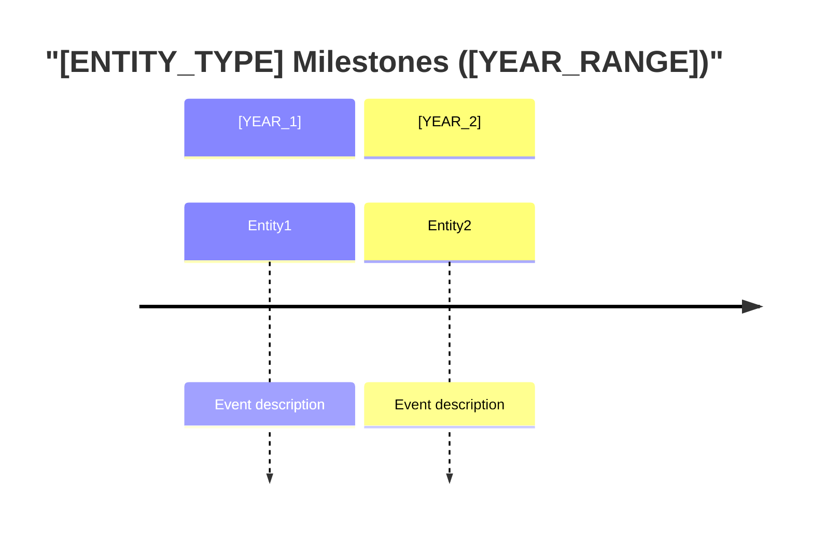

# Multi-Source Synthesis Dashboard - Templar

## Pattern Purpose

Provides a reusable framework for prompts that **aggregate per-entity research files** into a single consolidated dashboard with ranked leaderboards, classification matrices, Mermaid visualisations, and narrative analysis. The key distinction from per-entity research templars: this pattern **consumes** individual research outputs and **synthesises** them into a comparative view.

## Artifact Type

**For**: Prompts (analysis, synthesis, dashboard generation)

## When to Use

- Aggregating per-entity research files (from scorecard-based or structured research prompts) into a single ranked document
- Building leaderboards that rank entities across multiple dimensions
- Creating classification matrices that group entities into named bands
- Generating Mermaid charts (bar, quadrant, timeline, scatter) from aggregated data
- Writing data-driven narrative analysis that contrasts a reference entity against competitors
- Any prompt where the output is a **single dashboard file** synthesised from **multiple input files**

## Relationship to Other Analysis Templars

```text
Per-Entity Research (existing templars)        Synthesis (this templar)
  structured-web-research-templar        ──┐
  multi-dimensional-scorecard-templar    ──┼──►  multi-source-synthesis-dashboard-templar
  systematic-mapping-research-templar    ──┘         (consumes their outputs)
```

## Template Structure

### Frontmatter

```yaml
---
name: [DASHBOARD-SLUG]
description: "[ONE-LINE-PURPOSE]"
category: [CATEGORY]
tags: [COMMA-SEPARATED-TAGS]
argument-hint: "[ARGUMENT-DESCRIPTION-OR-NONE]"
---
```

### Section 1: Title and Purpose

```markdown
# [DASHBOARD_TITLE]

Please generate a comprehensive [DOMAIN] dashboard that reads all [ENTITY_TYPE]
files from `[SOURCE_FOLDER]`, extracts their [DATA_SECTION_NAME] data, and produces
a master ranking file with [VISUALIZATION_TYPES] and [NARRATIVE_ELEMENT].

**Pattern**: Synthesis & Visualization Pattern
**Use When**: After [PREREQUISITE_RESEARCH_PROMPT] has been run on all (or most) [ENTITY_TYPES]
```

**Customise**: Replace `[DOMAIN]`, `[ENTITY_TYPE]`, `[SOURCE_FOLDER]`, `[DATA_SECTION_NAME]`, `[VISUALIZATION_TYPES]`, `[NARRATIVE_ELEMENT]`, and `[PREREQUISITE_RESEARCH_PROMPT]`.

### Section 2: Purpose

```markdown
## Purpose

This prompt synthesises per-[ENTITY_TYPE] [DOMAIN] data into a single document that:

- Ranks all [ENTITY_TYPES] by [RANKING_DIMENSIONS]
- Classifies each as [BAND_1] / [BAND_2] / [BAND_3] / [BAND_4]
- Produces [CHART_TYPES] that render directly in markdown
- [REFERENCE_ENTITY_CONTRAST_STATEMENT]
- Delivers a [NARRATIVE_ELEMENT_NAME] designed to [NARRATIVE_GOAL]
```

### Section 3: Required Context

```markdown
## Required Context

- **[ENTITY_TYPE] Files**: All files in `[SOURCE_FOLDER]/*/` that contain a `[DATA_SECTION_HEADER]` section with [DATA_STRUCTURE_NAME]
- **Index/README**: `[INDEX_FILE]` for the [ENTITY_TYPE] list and tier classification
- **Reference [ENTITY] Estimates**: [HOW_TO_ESTIMATE_REFERENCE_ENTITY]
```

### Section 4: Process Steps

```markdown
## Process

### Step 1: Scan All [ENTITY_TYPE] Files
Read every [ENTITY_TYPE] file in `[SOURCE_FOLDER]/*/`. For each file, extract:
- [FIELD_1]
- [FIELD_2]
- [SCORE_FIELDS] (N dimension scores + composite + classification)
- Key metrics: [METRIC_LIST]

If a file does NOT have a `[DATA_SECTION_HEADER]` section, list it in a
"Missing Data" table and exclude from charts.

### Step 2: Estimate Reference [ENTITY] Position
Based on known attributes of [REFERENCE_ENTITY]:
[LIST_OF_KNOWN_ATTRIBUTES]
Create an honest scorecard using the same rubric.

### Step 3: Build Leaderboards
For each major metric, rank all [ENTITY_TYPES] (including [REFERENCE_ENTITY])
from highest to lowest. Create structured tables.

### Step 4: Generate Mermaid Charts
Create the following Mermaid diagrams:
[LIST_OF_CHARTS]

Follow Mermaid syntax rules:
- No spaces in node IDs (use camelCase or underscores)
- No HTML tags
- Quote labels with special characters
- No explicit colors/styling (let theme handle it)

### Step 5: Write [NARRATIVE_ELEMENT]
Synthesise all data into [NARRATIVE_DESCRIPTION].

### Step 6: Assemble Dashboard
Combine all sections into `[OUTPUT_FILE_PATH]`.
```

### Section 5: Output Format

The output format must include these structural elements (adapt content to domain):

```markdown
## Output Format

Generate `[OUTPUT_FILE_PATH]` with this structure:

### A. Header
- Title, generation date, entity count, data source reference

### B. Classification Matrix (grouped by band)
One table per classification band, ordered from highest to lowest:

| [ENTITY] | [TIER] | Composite | [DIM_1] | [DIM_2] | ... | Key Metric |
|---|---|---|---|---|---|---|

Reference entity bold in its band. Each band has a descriptive paragraph.

### C. Leaderboards (one per major metric)
Ranked tables with:
| Rank | [ENTITY] | [METRIC_VALUE] | [GROWTH_RATE] | Classification |

Reference entity always included (bold), followed by a Mermaid bar chart:

```mermaid
xychart-beta
    title "[METRIC_TITLE] - All [ENTITY_TYPES]"
    x-axis [Entity1, Entity2, ..., ReferenceEntity]
    y-axis "[UNIT]" 0 --> [MAX]
    bar [val1, val2, ..., refVal]
```

### D. Strategic Quadrant Charts
Use `quadrantChart` for 2-dimensional positioning:

```mermaid
quadrantChart
    title "[DIMENSION_X] vs [DIMENSION_Y]"
    x-axis "[LOW_X]" --> "[HIGH_X]"
    y-axis "[LOW_Y]" --> "[HIGH_Y]"
    quadrant-1 "[LABEL_Q1]"
    quadrant-2 "[LABEL_Q2]"
    quadrant-3 "[LABEL_Q3]"
    quadrant-4 "[LABEL_Q4]"
    Entity1: [x1, y1]
    ReferenceEntity: [xRef, yRef]
```

### E. Timeline (optional, if temporal data available)



### F. Narrative Analysis
Data-driven narrative with:
1. Opening: raw facts and key numbers
2. Comparison: what leaders are doing differently
3. Convergence/trend analysis: how multiple trends combine
4. Timeline projection: when do trajectories intersect?
5. Recommendations: specific, actionable, derived from data
6. Bottom line: one sentence per key number, punchy closing

### G. Missing Data Table
| [ENTITY] | File | Status | Action Needed |

### H. Data Quality Notes
Caveats, estimation methodology, currency assumptions, conflicting sources

### I. Methodology
Scoring rubric reference, classification thresholds, reference entity estimation basis
```

### Section 6: Script Integration (Optional)

```markdown
## Script-Based Generation (Recommended)

Scripts automate deterministic extraction and formatting. The AI agent
adds narrative analysis and qualitative assessment.

| Script | Purpose | Output |
| --- | --- | --- |
| `[EXTRACTION_SCRIPT]` | Parse all [DATA_FILES] into structured JSON | `[JSON_OUTPUT]` |
| `[REPORT_SCRIPT]` | Formatted report ([FORMAT]) | `[REPORT_OUTPUT]` |
| `[DASHBOARD_SCRIPT]` | Markdown dashboard with charts | `[DASHBOARD_OUTPUT]` |

### What Scripts Handle vs What AI Adds

| Aspect | Scripts (deterministic) | AI Agent (narrative) |
| --- | --- | --- |
| Data extraction | All structured data | -- |
| Leaderboard tables | Sorted, formatted, ranked | -- |
| Charts | Generated with correct syntax | -- |
| Classification matrix | Grouped by band | -- |
| [NARRATIVE_ELEMENT] | Skeleton with real numbers | **Full narrative** |
| Data quality notes | -- | **Qualitative assessment** |
```

### Section 7: Mermaid Chart Guidelines

```markdown
## Mermaid Chart Guidelines

### Bar Charts (xychart-beta)
- Sort descending by metric value
- Limit to top 15 entities + reference entity
- Reference entity always last for visual contrast
- No special characters in X-axis labels

### Quadrant Charts
- Normalise both axes to 0-1
- Use camelCase for entity IDs (no spaces)
- Label quadrants with descriptive names (not Q1/Q2/Q3/Q4)

### Timeline Charts
- Maximum 2-3 events per entity to avoid clutter
- Group by year sections
- Focus on most impactful events (funding, acquisitions, launches)
```

### Section 8: Troubleshooting

```markdown
## Troubleshooting

### Problem: Too Few [ENTITY_TYPES] Have [DATA_SECTION] Data
Generate dashboard with available data. List missing entities with action items.
Prioritise running prerequisite research on highest-threat entities first.

### Problem: Most Scores Are Estimated
Add confidence indicator (H/M/L) per entity. Include only M/H confidence
entities in charts. List L-confidence entities separately with ranges.

### Problem: Mermaid Charts Don't Render
Limit bar charts to 15 entities. Use abbreviations for long names.
No spaces in quadrant chart IDs. Test syntax for common issues.

### Problem: Reference [ENTITY] Estimates Too Speculative
Use most conservative plausible estimates. Mark with "(est.)" and bold.
Add Data Quality Note explaining estimation methodology.
```

### Section 9: Quality Criteria

```markdown
## Quality Criteria

- [ ] All [ENTITY_TYPES] with [DATA_SECTION] sections included in rankings
- [ ] Reference [ENTITY] estimated and placed in every leaderboard and chart
- [ ] Classification Matrix has all [N] bands populated
- [ ] Minimum [M] Mermaid charts that render correctly
- [ ] Leaderboards sorted by primary metric descending
- [ ] [NARRATIVE_ELEMENT] references specific amounts and percentages
- [ ] [NARRATIVE_ELEMENT] includes actionable recommendations
- [ ] Missing Data table lists [ENTITY_TYPES] without data
- [ ] Data Quality Notes acknowledge estimation methodology
- [ ] Dashboard saved to `[OUTPUT_FILE_PATH]`
- [ ] All Mermaid charts follow syntax rules
```

## Customisation Points

| Placeholder | Guidance |
| --- | --- |
| `[DOMAIN]` | The synthesis domain (Financial, Technology, Vendor, Product, etc.) |
| `[ENTITY_TYPE]` | What is being compared (competitor, vendor, product, market segment) |
| `[SOURCE_FOLDER]` | Where per-entity research files live |
| `[DATA_SECTION_HEADER]` | The section name to extract from each entity file |
| `[RANKING_DIMENSIONS]` | The scored dimensions used for ranking |
| `[CLASSIFICATION_BANDS]` | Named bands with score ranges (3-5 bands) |
| `[REFERENCE_ENTITY]` | The "home" entity placed on every chart for contrast |
| `[CHART_TYPES]` | Which Mermaid chart types to include (bar, quadrant, timeline) |
| `[NARRATIVE_ELEMENT]` | The qualitative analysis section (e.g., "Meteor Warning", "Risk Assessment", "Executive Summary") |
| `[SCRIPT_PATHS]` | Optional automation scripts for deterministic extraction |
| `[OUTPUT_FILE_PATH]` | Where to save the generated dashboard |

## Example Usage

**For Financial Competitor Dashboard** (see exemplar: `.cursor/exemplars/analysis/market/financial-dashboard-exemplar.md`):
- Domain: Financial & Growth
- Entity Type: Competitor
- Source: `tickets/COMPETITION/*/financial-growth.md`
- Bands: Rocket / Riser / Steady / Dinosaur
- Reference Entity: Eneve (with estimated scores)
- Charts: Revenue CAGR bar, Funding bar, Employee Growth bar, Growth vs Size quadrant, SaaS vs Revenue quadrant, Milestone timeline
- Narrative: "Meteor Warning" -- strategic wake-up call

**For Technology Maturity Dashboard**:
- Domain: Technology Maturity
- Entity Type: Product/Platform
- Source: `analysis/tech-stack/*/assessment.md`
- Bands: Cutting-Edge / Modern / Legacy / Obsolete
- Reference Entity: Our Platform
- Charts: Modernity score bar, CI/CD maturity quadrant, Cloud readiness timeline
- Narrative: "Modernisation Urgency" -- technical debt call-to-action

**For Vendor Evaluation Dashboard**:
- Domain: Vendor Assessment
- Entity Type: Vendor
- Source: `procurement/vendors/*/evaluation.md`
- Bands: Strategic Partner / Preferred / Acceptable / Avoid
- Reference Entity: Current Vendor (baseline)
- Charts: Overall score bar, Price vs Quality quadrant, Contract timeline
- Narrative: "Vendor Landscape" -- procurement recommendation

## Related Templars

- `.cursor/templars/analysis/market/multi-dimensional-research-scorecard-templar.md` -- The per-entity research pattern whose outputs this dashboard consumes
- `.cursor/templars/analysis/market/structured-web-research-templar.md` -- Broader per-entity research pattern

## Related Exemplars

- `.cursor/exemplars/analysis/market/financial-dashboard-exemplar.md` -- Full implementation showing this pattern applied to financial competitor analysis

---

**Extracted From**: `.cursor/prompts/analysis/market/generate-financial-dashboard.prompt.md`
**Created**: 2026-02-15
