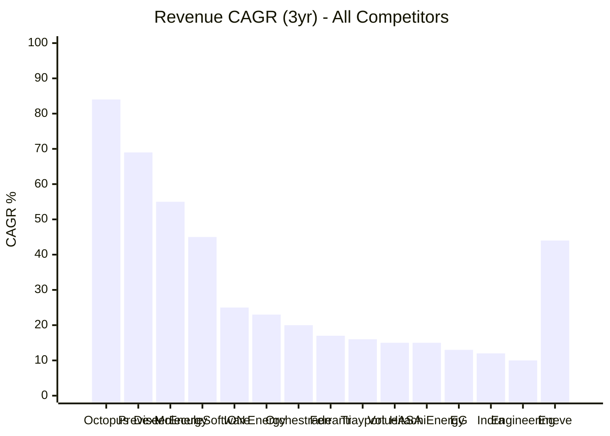
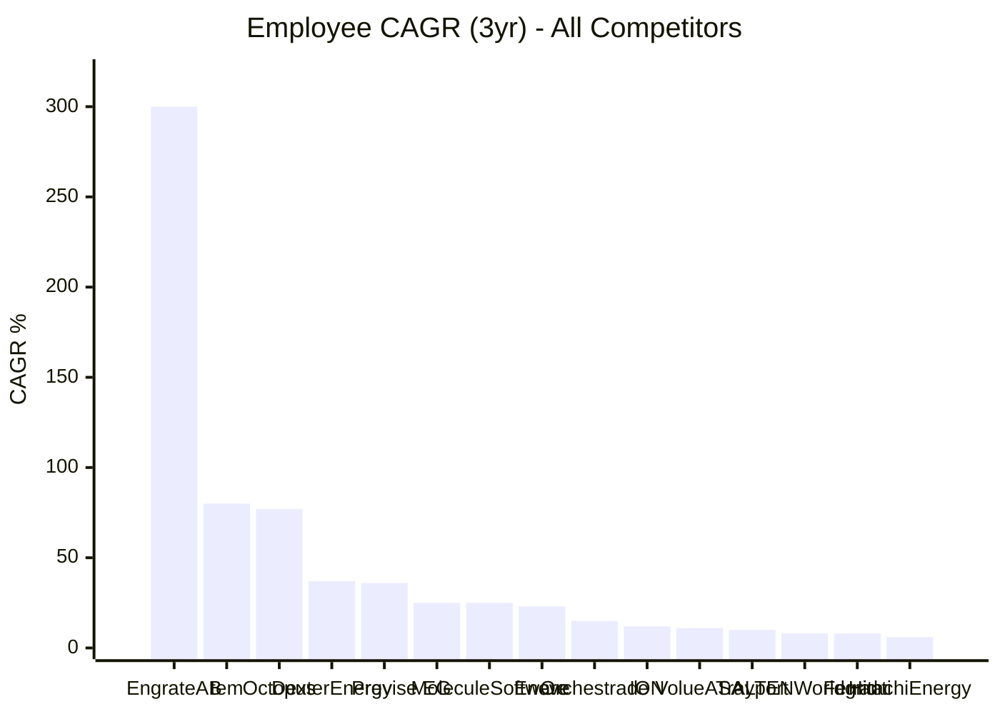
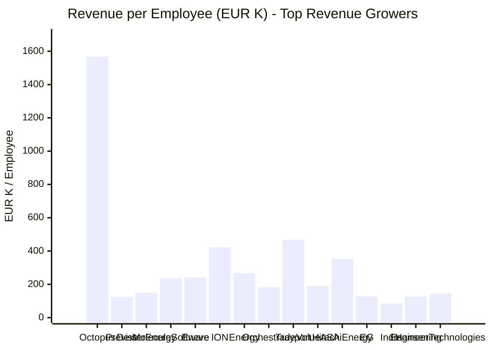
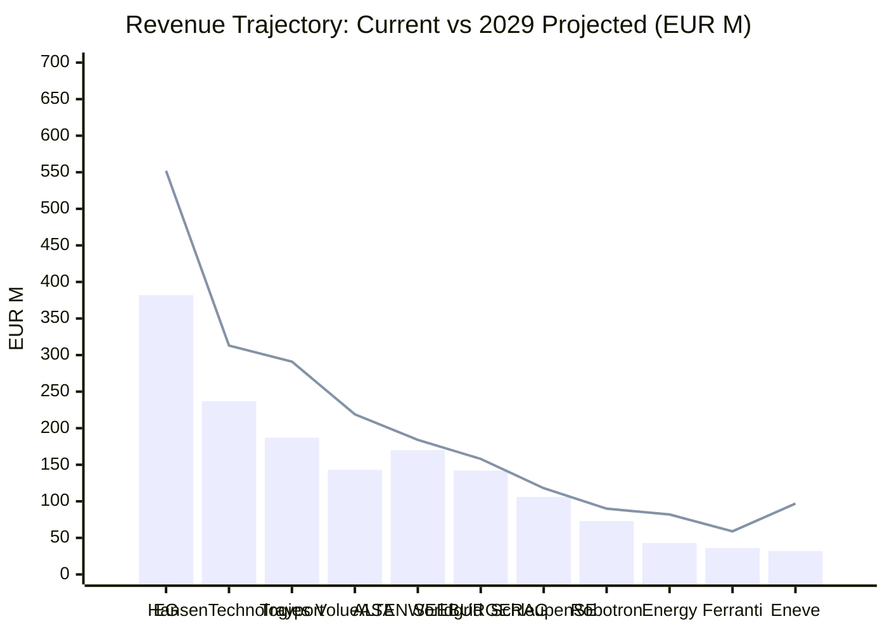

# Financial Growth Dashboard

**Generated**: 2026-02-17
**Competitors Analyzed**: 33 of 35
**Data Source**: Per-competitor financial research via `research-financial-growth` prompt

---

## Growth Classification Matrix

### Rockets (Composite Score 7.0-10.0)

Companies with explosive growth, heavy investment, and market-disrupting trajectories.

| Company | Tier | Composite | Rev Growth | Funding | Emp Growth | Geo Expand | M&A | SaaS |
|---|---|---|---|---|---|---|---|---|
| Octopus Energy Group / Kraken Technologies | Tier 3 | 9.8 | 9 | 10 | 10 | 10 | 10 | 10 |
| EG A/S (Utility Division) | Tier 1b | 8 | 6 | 9 | 8 | 6 | 10 | 9 |
| Previse Systems AG | Tier 2 | 7.3 | 9 | 6 | 9 | 9 | 1 | 10 |
| tem (tem energy) | Tier 3 | 7.3 | 9 | 10 | 9 | 5 | 1 | 10 |
| Volue ASA | Tier 1 | 7.3 | 6 | 9 | 5 | 8 | 9 | 7 |
| Dexter Energy | Tier 3 | 7.2 | 7 | 8 | 8 | 9 | 1 | 10 |

### Risers (Composite Score 5.0-6.9)

Companies with strong growth signals, actively investing in their future.

| Company | Tier | Composite | Rev Growth | Funding | Emp Growth | Geo Expand | M&A | SaaS |
|---|---|---|---|---|---|---|---|---|
| Engrate AB | Tier 1 | 6.2 | 8 | 3 | 9 | 6 | 1 | 10 |
| Molecule Software | Tier 2 | 6.2 | 7 | 5 | 7 | 7 | 1 | 10 |
| Hansen Technologies | Tier 1 | 6 | 5 | 5 | 3 | 7 | 9 | 7 |
| Indra Sistemas / Minsait | Tier 1b | 6 | 6 | 7 | 5 | 5 | 9 | 4 |
| **Eneve (formerly Energy21)** | **--** | **5.8** | **7** | **5** | **6** | **5** | **8** | **4** |
| Asseco Poland S.A. | Tier 1b | 5.7 | 3 | 6 | 4 | 8 | 10 | 3 |
| CGI Inc. | Tier 3 | 5.7 | 4 | 7 | 3 | 7 | 9 | 4 |
| Trayport (TMX Group) | Tier 1 | 5.7 | 6 | 5 | 6 | 6 | 4 | 7 |
| Energy One Limited | Tier 2 | 5.3 | 7 | 4 | 3 | 6 | 5 | 7 |
| Hitachi Energy | Tier 2 | 5.3 | 6 | 8 | 5 | 3 | 7 | 3 |
| Orchestrade Financial Systems | Tier 2 | 5.2 | 6 | 3 | 6 | 7 | 2 | 7 |
| Sopra Steria (cpX.Energy) | Tier 1 | 5.2 | 4 | 4 | 2 | 7 | 8 | 6 |

### Steadys (Composite Score 3.0-4.9)

Stable companies with moderate growth. Evolutionary, not revolutionary.

| Company | Tier | Composite | Rev Growth | Funding | Emp Growth | Geo Expand | M&A | SaaS |
|---|---|---|---|---|---|---|---|---|
| Brady Technologies | Tier 1 | 4.7 | 2 | 4 | 3 | 7 | 5 | 7 |
| Engineering Ingegneria Informatica (Engineering Group) | Tier 1b | 4.7 | 5 | 6 | 4 | 3 | 7 | 3 |
| Ferranti Computer Systems | Tier 1b | 4.5 | 6 | 3 | 5 | 5 | 1 | 7 |
| Schleupen SE | Tier 3 | 3.7 | 6 | 3 | 5 | 1 | 1 | 6 |
| Robotron Datenbank-Software GmbH | Tier 1b | 3.7 | 4 | 3 | 3 | 6 | 2 | 4 |
| ALTEN Worldgrid | Tier 3 | 3.5 | 2 | 5 | 3 | 3 | 7 | 1 |
| MaxBill (LogNet Systems) | Tier 1b | 3.5 | 3 | 2 | 3 | 8 | 1 | 4 |
| Qualia Trading (Qualia Technologies Limited) | Tier 2 | 3.3 | 3 | 2 | 3 | 2 | 1 | 9 |
| Arvato Systems (Bertelsmann) | Tier 3 | 3.2 | 3 | 3 | 3 | 3 | 1 | 6 |
| ION Commodities (ION Group) | Tier 2 | 3 | 3 | 4 | 3 | 3 | 2 | 3 |
| SEEBURGER AG | Tier 3 | 3 | 3 | 3 | 3 | 3 | 1 | 5 |

### Dinosaurs (Composite Score 1.0-2.9)

Flat or declining. Legacy mode. No visible investment in transformation.

| Company | Tier | Composite | Rev Growth | Funding | Emp Growth | Geo Expand | M&A | SaaS |
|---|---|---|---|---|---|---|---|---|
| KISTERS AG | Tier 1 | 2.7 | 3 | 3 | 3 | 3 | 1 | 3 |
| Creatica GmbH | Tier 3 | 2.5 | 2 | 2 | 2 | 2 | 2 | 5 |
| SOPTIM AG | Tier 1 | 2.5 | 3 | 1 | 3 | 2 | 1 | 5 |
| Tietoevry (Tieto) | Tier 1b | 2.5 | 2 | 3 | 1 | 2 | 3 | 4 |

---

## Revenue Growth Leaderboard

| Rank | Company | Tier | Revenue (latest, EUR) | Revenue CAGR (3yr) | Classification |
|---|---|---|---|---|---|
| 1 | Octopus Energy Group / Kraken Technologies | Tier 3 | EUR 14.5B | 84.0% | Rocket |
| 2 | Previse Systems AG | Tier 2 | EUR 6M | 69.0% | Rocket |
| 3 | Dexter Energy | Tier 3 | EUR 14M | 55.0% | Rocket |
| 4 | Molecule Software | Tier 2 | EUR 13M | 45.0% | Riser |
| 5 | **Eneve (formerly Energy21)** | **--** | **EUR 32M** | **44.0%** | **Riser** |
| 6 | ION Commodities (ION Group) | Tier 2 | EUR 5.5B | 25.0% | Steady |
| 7 | Energy One Limited | Tier 2 | EUR 44M | 23.7% | Riser |
| 8 | Orchestrade Financial Systems | Tier 2 | EUR 21M | 20.0% | Riser |
| 9 | Ferranti Computer Systems | Tier 1b | EUR 36M | 17.9% | Steady |
| 10 | Trayport (TMX Group) | Tier 1 | EUR 187M | 16.0% | Riser |
| 11 | Volue ASA | Tier 1 | EUR 143M | 15.4% | Rocket |
| 12 | Hitachi Energy | Tier 2 | EUR 17.6B | 15.0% | Riser |
| 13 | EG A/S (Utility Division) | Tier 1b | EUR 382M | 13.1% | Rocket |
| 14 | Indra Sistemas / Minsait | Tier 1b | EUR 5.2B | 12.6% | Riser |
| 15 | Engineering Ingegneria Informatica (Engineering Group) | Tier 1b | EUR 1.8B | 10.1% | Steady |
| 16 | Hansen Technologies | Tier 1 | EUR 237M | 9.8% | Riser |
| 17 | Arvato Systems (Bertelsmann) | Tier 3 | EUR 5.4B | 8.3% | Steady |
| 18 | CGI Inc. | Tier 3 | EUR 10.3B | 7.3% | Riser |
| 19 | Sopra Steria (cpX.Energy) | Tier 1 | EUR 5.7B | 7.2% | Riser |
| 20 | Robotron Datenbank-Software GmbH | Tier 1b | EUR 74M | 7.0% | Steady |
| 21 | Schleupen SE | Tier 3 | EUR 106M | 3.9% | Steady |
| 22 | SEEBURGER AG | Tier 3 | EUR 142M | 3.8% | Steady |
| 23 | ALTEN Worldgrid | Tier 3 | EUR 170M | 2.7% | Steady |
| 24 | Asseco Poland S.A. | Tier 1b | EUR 4.2B | 2.3% | Riser |
| 25 | Tietoevry (Tieto) | Tier 1b | EUR 1.9B | 2.0% | Dinosaur |
| 26 | tem (tem energy) | Tier 3 | EUR 24M | N/A | Rocket |
| 27 | Engrate AB | Tier 1 | EUR 0M | N/A | Riser |
| 28 | Brady Technologies | Tier 1 | EUR 43M | N/A | Steady |
| 29 | MaxBill (LogNet Systems) | Tier 1b | EUR 11M | N/A | Steady |
| 30 | Qualia Trading (Qualia Technologies Limited) | Tier 2 | N/A | N/A | Steady |
| 31 | KISTERS AG | Tier 1 | EUR 100M | N/A | Dinosaur |
| 32 | Creatica GmbH | Tier 3 | EUR 4M | N/A | Dinosaur |
| 33 | SOPTIM AG | Tier 1 | EUR 45M | N/A | Dinosaur |

### Revenue CAGR Chart



---

## Funding Leaderboard

| Rank | Company | Tier | Funding Score | Total Raised | Latest Valuation | Classification |
|---|---|---|---|---|---|---|
| 1 | Octopus Energy Group / Kraken Technologies | Tier 3 | 10 | ~$3.8B total capital raised | $8.65B (Dec 2025, standalone) | Rocket |
| 2 | tem (tem energy) | Tier 3 | 10 | $94M (~EUR 87M) | $300M+ (~EUR 280M+) post-money (February 2026) | Rocket |
| 3 | EG A/S (Utility Division) | Tier 1b | 9 | EUR 400M equity + DKK 3.7B acquisition = ~EUR 896M total capital deployed | Undisclosed, but the EUR 400M round (EUR 150M primary + EUR 250M secondary) at minority stakes implies enterprise value well above EUR 1B (Nov 2023). Given subsequent 2024 growth, likely EUR 1.2-1.5B range. | Rocket |
| 4 | Volue ASA | Tier 1 | 9 | NOK 500M IPO + NOK 6.1B take-private + EUR 1.5B valuation event = transformative capital trajectory | EUR 1.5 billion (February 2026) -- nearly 3x the take-private valuation of 15 months prior | Rocket |
| 5 | Dexter Energy | Tier 3 | 8 | ~EUR 36M (~$41M) | Undisclosed; estimated EUR 80-150M post-money based on typical Series C multiples for growth-stage climate tech SaaS (3-6x implied revenue on ~EUR 14M est. revenue, cross-referenced with Tracxn/CBInsights range) | Rocket |
| 6 | Hitachi Energy | Tier 2 | 8 | N/A | $11B enterprise value at 2018 deal announcement; current implied value significantly higher given revenue growth from $10B to $16B+ | Riser |
| 7 | Indra Sistemas / Minsait | Tier 1b | 7 | N/A (publicly traded since 1999; self-funded through operations and debt) | N/A | Riser |
| 8 | CGI Inc. | Tier 3 | 7 | N/A (public company since 1986; self-funded through CAD 2.2B+ annual operating cash flow) | ~USD 27.5 billion market cap (February 2026) | Riser |
| 9 | Previse Systems AG | Tier 2 | 6 | Undisclosed (estimated EUR 10-25M cumulative) | Undisclosed (estimated EUR 30-60M post-money, based on Lightrock minority stake and typical SaaS multiples of 8-12x ARR on ~EUR 5M ARR) | Rocket |
| 10 | Asseco Poland S.A. | Tier 1b | 6 | N/A | N/A | Riser |
| 11 | Engineering Ingegneria Informatica (Engineering Group) | Tier 1b | 6 | Not applicable (PE buyouts, not venture rounds; funded via leveraged buyouts + bond issuances) | $1.8B / ~EUR 1.6B (Jul 2020 acquisition price); current implied valuation likely higher given revenue growth | Steady |
| 12 | Molecule Software | Tier 2 | 5 | $25.35M (EUR ~23M) across 5 rounds (CB Insights) | Undisclosed (Series B typically implies $50-100M+ for SaaS companies at this ARR stage, but no data available) | Riser |
| 13 | Hansen Technologies | Tier 1 | 5 | Not applicable (public company since ~2000, self-funding via operating cash flow) | Market cap ~A$1.0-1.1B (~EUR 600-660M) as of Jan 2026 | Riser |
| 14 | **Eneve (formerly Energy21)** | **--** | **5** | **Undisclosed (PE buyout + 3 add-on acquisitions; all funded by Vortex Capital Partners)** | **Undisclosed (typical PE multiples for EUR 28M revenue software co: EUR 50-100M range estimated)** | **Riser** |
| 15 | Trayport (TMX Group) | Tier 1 | 5 | N/A | Not applicable (wholly-owned subsidiary). However, at 2024 revenue of CAD $235M and typical energy software multiples (8-12x revenue), implied value is CAD $1.9-2.8B -- a significant appreciation from the £550M (~CAD $1B) acquisition price. | Riser |
| 16 | ALTEN Worldgrid | Tier 3 | 5 | N/A (public company since 2000; self-funded through operations) | Market cap ~EUR 2.7B (Feb 2026); EV ~EUR 2.34B | Steady |
| 17 | Energy One Limited | Tier 2 | 4 | No external funding rounds post-IPO; growth funded through operating cash flow and debt | Market Cap ~AU$525M / ~EUR 315M (April 2025); peaked with share price up ~198% over prior year | Riser |
| 18 | Sopra Steria (cpX.Energy) | Tier 1 | 4 | N/A -- publicly listed, self-funded through operations | N/A | Riser |
| 19 | Brady Technologies | Tier 1 | 4 | ~GBP 33M (GBP 15M + GBP 18M share placings) | GBP 15M at acquisition; current valuation unclear given -GBP 11.7M net worth but strategic value of PowerDesk platform | Steady |
| 20 | ION Commodities (ION Group) | Tier 2 | 4 | ~$600M+ (TA Associates $200M cumulative + Carlyle ~$400M + ScION SPAC $500M) | £7B / ~€8B (2019); current valuation likely €15-25B+ given €2.2B EBITDA and growth since 2019 | Steady |
| 21 | Engrate AB | Tier 1 | 3 | EUR 3.0M+ (~$2.9M equivalent per i3Connect) | Undisclosed; estimated EUR 10-15M post-money (based on typical European seed-round multiples of 4-6x on EUR 2.5M raise) | Riser |
| 22 | Orchestrade Financial Systems | Tier 2 | 3 | EUR 0 (no disclosed external funding) | Unknown (private, no disclosed rounds) | Riser |
| 23 | Ferranti Computer Systems | Tier 1b | 3 | €0 external funding (self-funded through operations under Nijkerk Group ownership) | N/A -- privately held, no external valuation events | Steady |
| 24 | Schleupen SE | Tier 3 | 3 | EUR 0 (bootstrapped since 1970) | N/A (private, no external investment) | Steady |
| 25 | Robotron Datenbank-Software GmbH | Tier 1b | 3 | EUR 0 (external). Self-funded since founding. Oracle had a stake from ~1993-2005 (likely from the Oracle partnership era), which was repurchased by the family in 2005. | Not applicable (private, no valuations) | Steady |
| 26 | Arvato Systems (Bertelsmann) | Tier 3 | 3 | N/A (internally funded by Bertelsmann) | Not applicable (private subsidiary of privately-held conglomerate) | Steady |
| 27 | SEEBURGER AG | Tier 3 | 3 | EUR 0 (unfunded since 1986 founding) | Unknown (private, no external investment to establish valuation) | Steady |
| 28 | KISTERS AG | Tier 1 | 3 | EUR 0 (zero external capital in 60+ years) | Not applicable (private, never valued externally) | Dinosaur |
| 29 | Tietoevry (Tieto) | Tier 1b | 3 | N/A -- publicly listed since 1984; funded through operations, not venture rounds | ~EUR 2.16-2.26B (Jan 2026), ~EUR 18.68/share | Dinosaur |
| 30 | MaxBill (LogNet Systems) | Tier 1b | 2 | ~EUR 2.9M (single round in 2007) | ~GBP 7.9M implied from 2007 Eurovestech stake (18 years ago; not current) | Steady |
| 31 | Qualia Trading (Qualia Technologies Limited) | Tier 2 | 2 | No externally recorded funding | Unknown -- no valuation data available | Steady |
| 32 | Creatica GmbH | Tier 3 | 2 | EUR 0 (bootstrapped) | N/A (private, no external funding rounds) | Dinosaur |
| 33 | SOPTIM AG | Tier 1 | 1 | EUR 0 (bootstrapped) | Not applicable (private, no funding rounds) | Dinosaur |

---

## Employee Growth Leaderboard

| Rank | Company | Tier | Headcount (latest) | Employee CAGR | Open Positions | Classification |
|---|---|---|---|---|---|---|
| 1 | Engrate AB | Tier 1 | 15 | 300.0% | N/A | Riser |
| 2 | tem (tem energy) | Tier 3 | 100 | 80.0% | 74 | Rocket |
| 3 | Octopus Energy Group / Kraken Technologies | Tier 3 | 9250 | 77.0% | 102 | Rocket |
| 4 | Dexter Energy | Tier 3 | 97 | 37.0% | N/A | Rocket |
| 5 | Previse Systems AG | Tier 2 | 52 | 36.0% | N/A | Rocket |
| 6 | EG A/S (Utility Division) | Tier 1b | 3000 | 25.0% | 61 | Rocket |
| 7 | Molecule Software | Tier 2 | 55 | 25.0% | 3 | Riser |
| 8 | **Eneve (formerly Energy21)** | **--** | **135** | **23.0%** | **5** | **Riser** |
| 9 | Orchestrade Financial Systems | Tier 2 | 115 | 15.0% | N/A | Riser |
| 10 | ION Commodities (ION Group) | Tier 2 | 13000 | 12.0% | 181 | Steady |
| 11 | Volue ASA | Tier 1 | 750 | 11.8% | 21 | Rocket |
| 12 | Trayport (TMX Group) | Tier 1 | 400 | 10.0% | 16 | Riser |
| 13 | ALTEN Worldgrid | Tier 3 | 58300 | 8.4% | N/A | Steady |
| 14 | Ferranti Computer Systems | Tier 1b | N/A | 8.2% | N/A | Steady |
| 15 | Hitachi Energy | Tier 2 | 50000 | 6.8% | N/A | Riser |
| 16 | Engineering Ingegneria Informatica (Engineering Group) | Tier 1b | 14000 | 6.2% | 28 | Steady |
| 17 | Indra Sistemas / Minsait | Tier 1b | 61475 | 6.1% | 35 | Riser |
| 18 | Brady Technologies | Tier 1 | 210 | 5.0% | N/A | Steady |
| 19 | KISTERS AG | Tier 1 | 750 | 5.0% | 13 | Dinosaur |
| 20 | Asseco Poland S.A. | Tier 1b | 35500 | 4.6% | N/A | Riser |
| 21 | CGI Inc. | Tier 3 | 94000 | 4.1% | 400 | Riser |
| 22 | SEEBURGER AG | Tier 3 | 1200 | 4.1% | 28 | Steady |
| 23 | SOPTIM AG | Tier 1 | 410 | 4.0% | N/A | Dinosaur |
| 24 | Robotron Datenbank-Software GmbH | Tier 1b | 650 | 3.3% | N/A | Steady |
| 25 | Energy One Limited | Tier 2 | 163 | 3.0% | N/A | Riser |
| 26 | Sopra Steria (cpX.Energy) | Tier 1 | 46245 | 2.6% | N/A | Riser |
| 27 | Schleupen SE | Tier 3 | 630 | 2.6% | N/A | Steady |
| 28 | Arvato Systems (Bertelsmann) | Tier 3 | 3450 | 2.0% | 88 | Steady |
| 29 | Hansen Technologies | Tier 1 | 1643 | 1.8% | 2 | Riser |
| 30 | MaxBill (LogNet Systems) | Tier 1b | 125 | N/A | 2 | Steady |
| 31 | Qualia Trading (Qualia Technologies Limited) | Tier 2 | 10 | N/A | N/A | Steady |
| 32 | Creatica GmbH | Tier 3 | 20 | N/A | N/A | Dinosaur |
| 33 | Tietoevry (Tieto) | Tier 1b | 15000 | N/A | 499 | Dinosaur |

### Employee Growth Chart



---

## SaaS Maturity Ranking

| Rank | Company | Tier | Recurring Revenue % | SaaS Score | Classification |
|---|---|---|---|---|---|
| 1 | Octopus Energy Group / Kraken Technologies | Tier 3 | 66.0% | 10 | Rocket |
| 2 | Previse Systems AG | Tier 2 | 100.0% | 10 | Rocket |
| 3 | tem (tem energy) | Tier 3 | 100.0% | 10 | Rocket |
| 4 | Dexter Energy | Tier 3 | 100.0% | 10 | Rocket |
| 5 | Engrate AB | Tier 1 | 100.0% | 10 | Riser |
| 6 | Molecule Software | Tier 2 | 95.0% | 10 | Riser |
| 7 | EG A/S (Utility Division) | Tier 1b | 86.1% | 9 | Rocket |
| 8 | Qualia Trading (Qualia Technologies Limited) | Tier 2 | 100.0% | 9 | Steady |
| 9 | Volue ASA | Tier 1 | 71.0% | 7 | Rocket |
| 10 | Hansen Technologies | Tier 1 | 95.0% | 7 | Riser |
| 11 | Trayport (TMX Group) | Tier 1 | 90.0% | 7 | Riser |
| 12 | Energy One Limited | Tier 2 | 90.0% | 7 | Riser |
| 13 | Orchestrade Financial Systems | Tier 2 | 70.0% | 7 | Riser |
| 14 | Brady Technologies | Tier 1 | 60.0% | 7 | Steady |
| 15 | Ferranti Computer Systems | Tier 1b | N/A | 7 | Steady |
| 16 | Sopra Steria (cpX.Energy) | Tier 1 | N/A | 6 | Riser |
| 17 | Schleupen SE | Tier 3 | 59.3% | 6 | Steady |
| 18 | Arvato Systems (Bertelsmann) | Tier 3 | N/A | 6 | Steady |
| 19 | SEEBURGER AG | Tier 3 | N/A | 5 | Steady |
| 20 | Creatica GmbH | Tier 3 | N/A | 5 | Dinosaur |
| 21 | SOPTIM AG | Tier 1 | 50.0% | 5 | Dinosaur |
| 22 | Indra Sistemas / Minsait | Tier 1b | N/A | 4 | Riser |
| 23 | **Eneve (formerly Energy21)** | **--** | **60.0%** | **4** | **Riser** |
| 24 | CGI Inc. | Tier 3 | 45.0% | 4 | Riser |
| 25 | Robotron Datenbank-Software GmbH | Tier 1b | N/A | 4 | Steady |
| 26 | MaxBill (LogNet Systems) | Tier 1b | N/A | 4 | Steady |
| 27 | Tietoevry (Tieto) | Tier 1b | N/A | 4 | Dinosaur |
| 28 | Asseco Poland S.A. | Tier 1b | N/A | 3 | Riser |
| 29 | Hitachi Energy | Tier 2 | N/A | 3 | Riser |
| 30 | Engineering Ingegneria Informatica (Engineering Group) | Tier 1b | N/A | 3 | Steady |
| 31 | ION Commodities (ION Group) | Tier 2 | N/A | 3 | Steady |
| 32 | KISTERS AG | Tier 1 | 30.0% | 3 | Dinosaur |
| 33 | ALTEN Worldgrid | Tier 3 | N/A | 1 | Steady |

---

## Investment Efficiency Ratios

Capital efficiency metrics revealing who builds real value vs burns cash. Revenue/Employee measures operational leverage; Revenue/EUR M Raised measures capital efficiency; Hiring Efficiency (Emp CAGR / Rev CAGR) below 1.0 means revenue grows faster than headcount.

| Rank | Company | Tier | Revenue | Headcount | Total Raised | Rev/Emp (EUR K) | Rev/EUR M Raised | Hiring Eff. | Classification |
|---|---|---|---|---|---|---|---|---|---|
| 1 | Octopus Energy Group / Kraken Technologies | Tier 3 | EUR 14.5B | 9250 | ~$3.8B total capital raised | 1568 🟢 | 4.02 🟢 | 0.92 🔴 | Rocket |
| 2 | Arvato Systems (Bertelsmann) | Tier 3 | EUR 5.4B | 3450 | N/A (internally funded by Bertelsmann) | 1565 🟢 | N/A | 0.24 🟢 | Steady |
| 3 | Trayport (TMX Group) | Tier 1 | EUR 187M | 400 | N/A | 468 🟢 | N/A | 0.62 | Riser |
| 4 | ION Commodities (ION Group) | Tier 2 | EUR 5.5B | 13000 | ~$600M+ (TA Associates $200M cumulati... | 423 🟢 | 9.65 🟢 | 0.48 | Steady |
| 5 | Hitachi Energy | Tier 2 | EUR 17.6B | 50000 | N/A | 352 🟢 | N/A | 0.45 🟢 | Riser |
| 6 | Energy One Limited | Tier 2 | EUR 44M | 163 | No external funding rounds post-IPO; ... | 267 🟢 | N/A | 0.13 🟢 | Riser |
| 7 | tem (tem energy) | Tier 3 | EUR 24M | 100 | $94M (~EUR 87M) | 245 🟢 | 0.28 🔴 | N/A | Rocket |
| 8 | **Eneve (formerly Energy21)** | **--** | **EUR 32M** | **135** | **Undisclosed (PE buyout + 3 add-on acq...** | **241 🟢** | **N/A** | **0.52** | **Riser** |
| 9 | Molecule Software | Tier 2 | EUR 13M | 55 | $25.35M (EUR ~23M) across 5 rounds (C... | 236 | 0.57 | 0.56 | Riser |
| 10 | Brady Technologies | Tier 1 | EUR 43M | 210 | ~GBP 33M (GBP 15M + GBP 18M share pla... | 204 | 1.11 | N/A | Steady |
| 11 | Volue ASA | Tier 1 | EUR 143M | 750 | NOK 500M IPO + NOK 6.1B take-private ... | 191 | 0.10 🔴 | 0.77 🔴 | Rocket |
| 12 | Orchestrade Financial Systems | Tier 2 | EUR 21M | 115 | EUR 0 (no disclosed external funding) | 183 | N/A | 0.75 | Riser |
| 13 | Creatica GmbH | Tier 3 | EUR 4M | 20 | EUR 0 (bootstrapped) | 175 | N/A | N/A | Dinosaur |
| 14 | Schleupen SE | Tier 3 | EUR 106M | 630 | EUR 0 (bootstrapped since 1970) | 168 | N/A | 0.67 | Steady |
| 15 | Dexter Energy | Tier 3 | EUR 14M | 97 | ~EUR 36M (~$41M) | 149 | 0.40 | 0.67 | Rocket |
| 16 | Hansen Technologies | Tier 1 | EUR 237M | 1643 | Not applicable (public company since ... | 144 | N/A | 0.18 🟢 | Riser |
| 17 | KISTERS AG | Tier 1 | EUR 100M | 750 | EUR 0 (zero external capital in 60+ y... | 133 | N/A | N/A | Dinosaur |
| 18 | EG A/S (Utility Division) | Tier 1b | EUR 382M | 3000 | EUR 400M equity + DKK 3.7B acquisitio... | 127 | 0.95 | 1.91 🔴 | Rocket |
| 19 | Engineering Ingegneria Informatica (Engineering Group) | Tier 1b | EUR 1.8B | 14000 | Not applicable (PE buyouts, not ventu... | 126 | N/A | 0.61 | Steady |
| 20 | Previse Systems AG | Tier 2 | EUR 6M | 52 | Undisclosed (estimated EUR 10-25M cum... | 125 | N/A | 0.52 | Rocket |
| 21 | Tietoevry (Tieto) | Tier 1b | EUR 1.9B | 15000 | N/A -- publicly listed since 1984; fu... | 123 | N/A | N/A | Dinosaur |
| 22 | Sopra Steria (cpX.Energy) | Tier 1 | EUR 5.7B | 46245 | N/A -- publicly listed, self-funded t... | 122 | N/A | 0.36 🟢 | Riser |
| 23 | Asseco Poland S.A. | Tier 1b | EUR 4.2B | 35500 | N/A | 119 | N/A | 2 🔴 | Riser |
| 24 | SEEBURGER AG | Tier 3 | EUR 142M | 1200 | EUR 0 (unfunded since 1986 founding) | 118 🔴 | N/A | 1.08 🔴 | Steady |
| 25 | Robotron Datenbank-Software GmbH | Tier 1b | EUR 74M | 650 | EUR 0 (external). Self-funded since f... | 113 🔴 | N/A | 0.47 🟢 | Steady |
| 26 | CGI Inc. | Tier 3 | EUR 10.3B | 94000 | N/A (public company since 1986; self-... | 110 🔴 | N/A | 0.56 | Riser |
| 27 | SOPTIM AG | Tier 1 | EUR 45M | 410 | EUR 0 (bootstrapped) | 110 🔴 | N/A | N/A | Dinosaur |
| 28 | MaxBill (LogNet Systems) | Tier 1b | EUR 11M | 125 | ~EUR 2.9M (single round in 2007) | 88 🔴 | 3.79 🟢 | N/A | Steady |
| 29 | Indra Sistemas / Minsait | Tier 1b | EUR 5.2B | 61475 | N/A (publicly traded since 1999; self... | 84 🔴 | N/A | 0.48 | Riser |
| 30 | Engrate AB | Tier 1 | EUR 0M | 15 | EUR 3.0M+ (~$2.9M equivalent per i3Co... | 7 🔴 | 0.03 🔴 | N/A | Riser |
| 31 | ALTEN Worldgrid | Tier 3 | EUR 170M | 58300 | N/A (public company since 2000; self-... | 3 🔴 | N/A | 3.11 🔴 | Steady |
| 32 | Ferranti Computer Systems | Tier 1b | EUR 36M | N/A | €0 external funding (self-funded thro... | N/A | N/A | 0.46 🟢 | Steady |
| 33 | Qualia Trading (Qualia Technologies Limited) | Tier 2 | N/A | 10 | No externally recorded funding | N/A | N/A | N/A | Steady |

### Revenue/Employee vs Revenue Growth

Scatter approximation: bars show Revenue/Employee (EUR K) for top revenue growers.



---

## Growth vs Size Quadrant

```mermaid
quadrantChart
    title "Growth Rate vs Company Size"
    x-axis "Small" --> "Large"
    y-axis "Slow Growth" --> "Fast Growth"
    quadrant-1 "Dangerous Giants"
    quadrant-2 "Incoming Disruptors"
    quadrant-3 "Marginal Players"
    quadrant-4 "Sleeping Giants"
    Octopus: [0.82, 0.95]
    EG: [0.05, 0.82]
    Previse: [0.05, 0.74]
    tem: [0.05, 0.74]
    VolueASA: [0.05, 0.74]
    DexterEnergy: [0.05, 0.73]
    EngrateAB: [0.05, 0.63]
    MoleculeSoftware: [0.05, 0.63]
    HansenTechnologies: [0.05, 0.61]
    Indra: [0.29, 0.61]
    Eneve: [0.05, 0.59]
    Asseco: [0.24, 0.58]
    CGIInc.: [0.59, 0.58]
    Trayport: [0.05, 0.58]
    Energy: [0.05, 0.54]
    HitachiEnergy: [0.95, 0.54]
    Orchestrade: [0.05, 0.53]
    Sopra: [0.32, 0.53]
    BradyTechnologies: [0.05, 0.48]
    Engineering: [0.1, 0.48]
    Ferranti: [0.05, 0.46]
    SchleupenSE: [0.05, 0.38]
    Robotron: [0.05, 0.37]
    ALTENWorldgrid: [0.05, 0.36]
    MaxBill: [0.05, 0.36]
    Qualia: [0.05, 0.34]
    Arvato: [0.31, 0.33]
    ION: [0.31, 0.31]
    SEEBURGERAG: [0.05, 0.31]
    KISTERSAG: [0.05, 0.28]
    CreaticaGmbH: [0.05, 0.26]
    SOPTIMAG: [0.05, 0.26]
    Tietoevry(Tieto): [0.11, 0.26]
```

---

## The Meteor Warning

### The Numbers Don't Lie

Of the 33 competitors analyzed, **6 are Rockets** and **12 are Risers**. The average revenue CAGR across all tracked competitors is **20.8%**.
 Eneve's estimated CAGR: **44.0%**. Eneve's composite score: **5.8** (Riser).

### What the Rockets Are Doing That We Are Not

- **Octopus Energy Group / Kraken Technologies** (composite 9.8): Revenue CAGR 84.0%, Funding score 10/10
- **EG A/S (Utility Division)** (composite 8): Revenue CAGR 13.1%, Funding score 9/10
- **Previse Systems AG** (composite 7.3): Revenue CAGR 69.0%, Funding score 6/10
- **tem (tem energy)** (composite 7.3): Revenue CAGR N/A, Funding score 10/10
- **Volue ASA** (composite 7.3): Revenue CAGR 15.4%, Funding score 9/10
- **Dexter Energy** (composite 7.2): Revenue CAGR 55.0%, Funding score 8/10

### The Convergence Threat

Multiple trends converge against Eneve:
- AI-native entrants building from scratch what took Eneve 20+ years
- European energy market harmonization (ENTSO-E, MARI, PICASSO) eroding national moats
- Cloud-native platforms with 10x faster implementation times
- PE/VC money pouring into energy software
- Competitors entering NL market or acquiring NL-capable companies

### What Eneve Must Do

1. **Accelerate SaaS transition** -- close the cloud gap with Rockets
2. **Invest in AI** -- every Rocket and most Risers have AI in production
3. **Explore strategic funding** -- organic growth alone cannot match PE-backed competitors
4. **Expand geographically** -- Netherlands-only is a shrinking moat
5. **Consider strategic M&A** -- acquire capabilities instead of building everything in-house

---

---

## Scenario Projections (3-Year Extrapolation)

Revenue and employee projections at current CAGR rates. 🔺 marks projected crossing of key thresholds (Revenue > EUR 100M, Employees > 500).

### Revenue Projections

| Company | Current Revenue | Rev CAGR | 2027 Projected | 2028 Projected | 2029 Projected |
|---|---|---|---|---|---|
| Octopus Energy Group / Kraken Technologies | EUR 14.5B | 84.0% | EUR 26.7B 🔺 | EUR 49.1B 🔺 | EUR 90.3B 🔺 |
| Hitachi Energy | EUR 17.6B | 15.0% | EUR 20.2B 🔺 | EUR 23.3B 🔺 | EUR 26.8B 🔺 |
| CGI Inc. | EUR 10.3B | 7.3% | EUR 11.1B 🔺 | EUR 11.9B 🔺 | EUR 12.7B 🔺 |
| ION Commodities (ION Group) | EUR 5.5B | 25.0% | EUR 6.9B 🔺 | EUR 8.6B 🔺 | EUR 10.7B 🔺 |
| Indra Sistemas / Minsait | EUR 5.2B | 12.6% | EUR 5.8B 🔺 | EUR 6.6B 🔺 | EUR 7.4B 🔺 |
| Sopra Steria (cpX.Energy) | EUR 5.7B | 7.2% | EUR 6.1B 🔺 | EUR 6.5B 🔺 | EUR 7.0B 🔺 |
| Arvato Systems (Bertelsmann) | EUR 5.4B | 8.3% | EUR 5.8B 🔺 | EUR 6.3B 🔺 | EUR 6.9B 🔺 |
| Asseco Poland S.A. | EUR 4.2B | 2.3% | EUR 4.3B 🔺 | EUR 4.4B 🔺 | EUR 4.5B 🔺 |
| Engineering Ingegneria Informatica (Engineering Group) | EUR 1.8B | 10.1% | EUR 1.9B 🔺 | EUR 2.1B 🔺 | EUR 2.4B 🔺 |
| Tietoevry (Tieto) | EUR 1.9B | 2.0% | EUR 1.9B 🔺 | EUR 1.9B 🔺 | EUR 2.0B 🔺 |
| EG A/S (Utility Division) | EUR 382M | 13.1% | EUR 432M 🔺 | EUR 489M 🔺 | EUR 553M 🔺 |
| Hansen Technologies | EUR 237M | 9.8% | EUR 260M 🔺 | EUR 286M 🔺 | EUR 314M 🔺 |
| Trayport (TMX Group) | EUR 187M | 16.0% | EUR 217M 🔺 | EUR 252M 🔺 | EUR 292M 🔺 |
| Volue ASA | EUR 143M | 15.4% | EUR 165M 🔺 | EUR 190M 🔺 | EUR 220M 🔺 |
| ALTEN Worldgrid | EUR 170M | 2.7% | EUR 175M 🔺 | EUR 179M 🔺 | EUR 184M 🔺 |
| SEEBURGER AG | EUR 142M | 3.8% | EUR 147M 🔺 | EUR 153M 🔺 | EUR 159M 🔺 |
| Schleupen SE | EUR 106M | 3.9% | EUR 110M 🔺 | EUR 114M 🔺 | EUR 119M 🔺 |
| **Eneve (formerly Energy21)** | **EUR 32M** | **44.0%** | **EUR 47M** | **EUR 67M** | **EUR 97M** |
| Robotron Datenbank-Software GmbH | EUR 74M | 7.0% | EUR 79M | EUR 84M | EUR 90M |
| Energy One Limited | EUR 44M | 23.7% | EUR 54M | EUR 67M | EUR 83M |
| Ferranti Computer Systems | EUR 36M | 17.9% | EUR 43M | EUR 50M | EUR 59M |
| Dexter Energy | EUR 14M | 55.0% | EUR 22M | EUR 35M | EUR 54M |
| Molecule Software | EUR 13M | 45.0% | EUR 19M | EUR 27M | EUR 40M |
| Orchestrade Financial Systems | EUR 21M | 20.0% | EUR 25M | EUR 30M | EUR 36M |
| Previse Systems AG | EUR 6M | 69.0% | EUR 11M | EUR 19M | EUR 31M |
| tem (tem energy) | EUR 24M | N/A | N/A | N/A | N/A |
| Engrate AB | EUR 0M | N/A | N/A | N/A | N/A |
| Brady Technologies | EUR 43M | N/A | N/A | N/A | N/A |
| MaxBill (LogNet Systems) | EUR 11M | N/A | N/A | N/A | N/A |
| Qualia Trading (Qualia Technologies Limited) | N/A | N/A | N/A | N/A | N/A |
| KISTERS AG | EUR 100M | N/A | N/A | N/A | N/A |
| Creatica GmbH | EUR 4M | N/A | N/A | N/A | N/A |
| SOPTIM AG | EUR 45M | N/A | N/A | N/A | N/A |

### Employee Projections

| Company | Current Employees | Emp CAGR | 2027 Projected | 2028 Projected | 2029 Projected |
|---|---|---|---|---|---|
| CGI Inc. | 94,000 | 4.1% | 97,854 🔺 | 101,866 🔺 | 106,043 🔺 |
| ALTEN Worldgrid | 58,300 | 8.4% | 63,197 🔺 | 68,506 🔺 | 74,260 🔺 |
| Indra Sistemas / Minsait | 61,475 | 6.1% | 65,225 🔺 | 69,204 🔺 | 73,425 🔺 |
| Hitachi Energy | 50,000 | 6.8% | 53,400 🔺 | 57,031 🔺 | 60,909 🔺 |
| Octopus Energy Group / Kraken Technologies | 9,250 | 77.0% | 16,372 🔺 | 28,979 🔺 | 51,293 🔺 |
| Sopra Steria (cpX.Energy) | 46,245 | 2.6% | 47,447 🔺 | 48,681 🔺 | 49,947 🔺 |
| Asseco Poland S.A. | 35,500 | 4.6% | 37,133 🔺 | 38,841 🔺 | 40,628 🔺 |
| ION Commodities (ION Group) | 13,000 | 12.0% | 14,560 🔺 | 16,307 🔺 | 18,264 🔺 |
| Engineering Ingegneria Informatica (Engineering Group) | 14,000 | 6.2% | 14,868 🔺 | 15,790 🔺 | 16,769 🔺 |
| EG A/S (Utility Division) | 3,000 | 25.0% | 3,750 🔺 | 4,688 🔺 | 5,859 🔺 |
| Arvato Systems (Bertelsmann) | 3,450 | 2.0% | 3,519 🔺 | 3,589 🔺 | 3,661 🔺 |
| Hansen Technologies | 1,643 | 1.8% | 1,673 🔺 | 1,703 🔺 | 1,733 🔺 |
| SEEBURGER AG | 1,200 | 4.1% | 1,249 🔺 | 1,300 🔺 | 1,354 🔺 |
| Volue ASA | 750 | 11.8% | 839 🔺 | 937 🔺 | 1,048 🔺 |
| Engrate AB | 15 | 300.0% | 60 | 240 | 960 🔺 |
| KISTERS AG | 750 | 5.0% | 788 🔺 | 827 🔺 | 868 🔺 |
| Robotron Datenbank-Software GmbH | 650 | 3.3% | 671 🔺 | 694 🔺 | 716 🔺 |
| Schleupen SE | 630 | 2.6% | 646 🔺 | 663 🔺 | 680 🔺 |
| tem (tem energy) | 100 | 80.0% | 180 | 324 | 583 🔺 |
| Trayport (TMX Group) | 400 | 10.0% | 440 | 484 | 532 🔺 |
| SOPTIM AG | 410 | 4.0% | 426 | 443 | 461 |
| **Eneve (formerly Energy21)** | **135** | **23.0%** | **166** | **204** | **251** |
| Dexter Energy | 97 | 37.0% | 134 | 183 | 251 |
| Brady Technologies | 210 | 5.0% | 220 | 232 | 243 |
| Energy One Limited | 163 | 3.0% | 168 | 173 | 178 |
| Orchestrade Financial Systems | 115 | 15.0% | 132 | 152 | 175 |
| Previse Systems AG | 52 | 36.0% | 71 | 96 | 131 |
| Molecule Software | 55 | 25.0% | 69 | 86 | 107 |
| Ferranti Computer Systems | N/A | 8.2% | N/A | N/A | N/A |
| MaxBill (LogNet Systems) | 125 | N/A | N/A | N/A | N/A |
| Qualia Trading (Qualia Technologies Limited) | 10 | N/A | N/A | N/A | N/A |
| Creatica GmbH | 20 | N/A | N/A | N/A | N/A |
| Tietoevry (Tieto) | 15,000 | N/A | N/A | N/A | N/A |

### Revenue Trajectory Chart

Mid-market competitors (< EUR 1B current revenue) + Eneve. Bars = current revenue, line = 2029 projected.



> **Disclaimer**: Projections based on historical CAGR, not forecasts. Actual results will vary based on market conditions, strategic decisions, and competitive dynamics.


---

## Missing Data

Competitors without `financial-growth.md` files:

| Company Folder | Tier | Action Needed |
|---|---|---|
| .cache | Unknown | Run `@research-financial-growth` |
| __pycache__ | Unknown | Run `@research-financial-growth` |

## Methodology

- **Scoring**: All Growth Scorecard scores use the rubric defined in `research-financial-growth.prompt.md`
- **Classification**: Rocket (7.0-10.0), Riser (5.0-6.9), Steady (3.0-4.9), Dinosaur (1.0-2.9)
- **Currency**: All EUR equivalents use approximate exchange rates at time of research
- **Rankings**: Tied scores broken by revenue CAGR, then funding raised
- **Generated by**: `.cursor/scripts/analysis/market/generate_markdown_dashboard.py`
