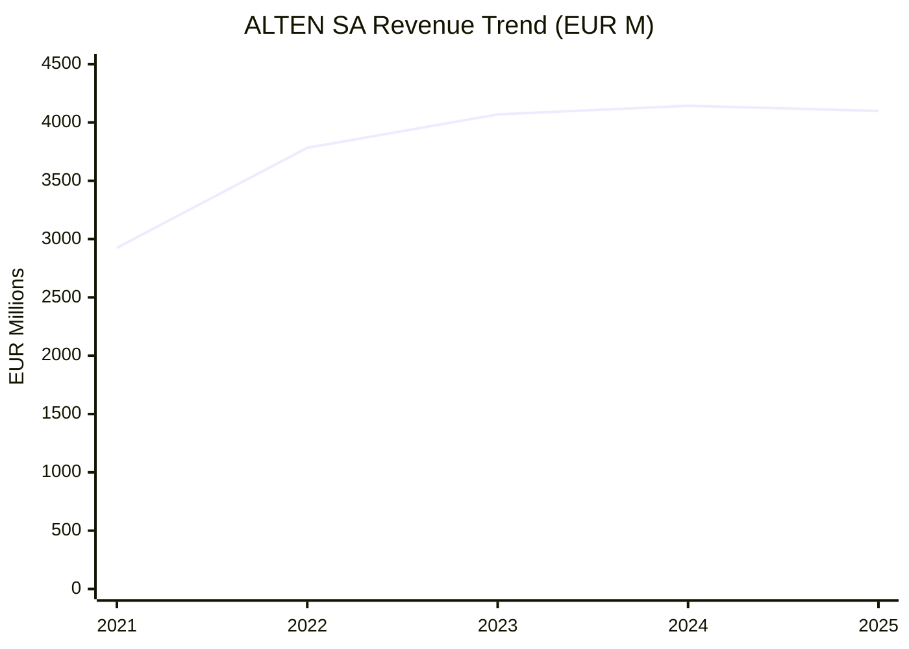
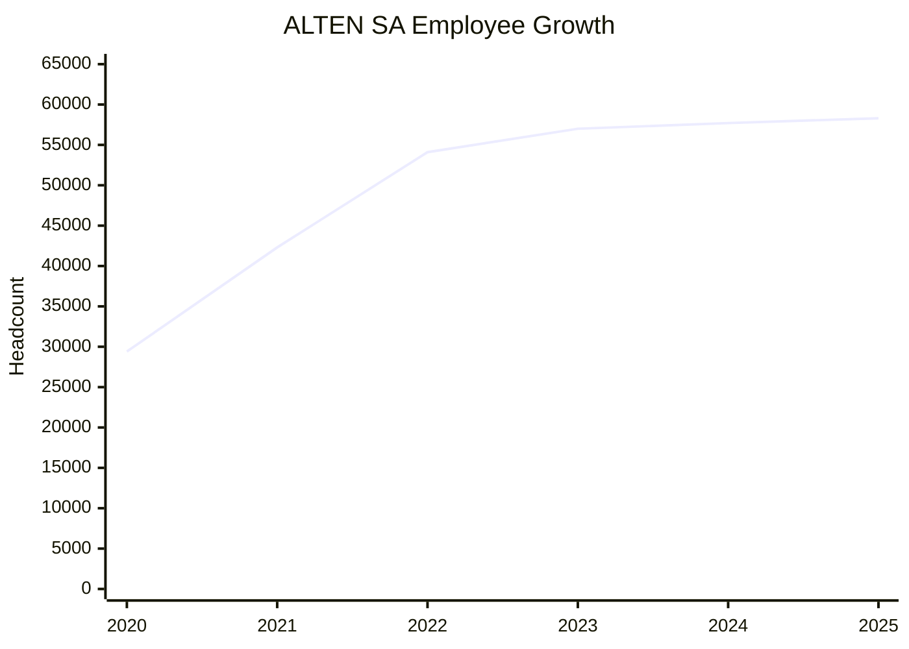
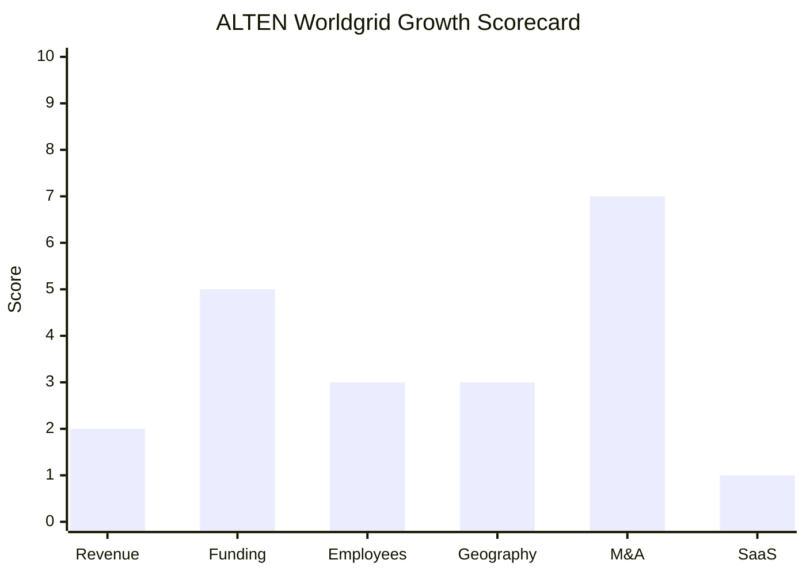

# Financial & Growth Deep-Dive - ALTEN Worldgrid

**Research Date**: 2026-02-15
**Data Availability**: Medium (Worldgrid-specific data limited; parent ALTEN SA is public on Euronext Paris: ATE with full financial disclosure. Worldgrid was a division of Atos, now a division of ALTEN -- neither parent breaks out Worldgrid revenue separately post-acquisition.)

**Important Context**: ALTEN Worldgrid is a **professional services / consulting & engineering** firm, not a software product company. It has zero product revenue and zero SaaS/recurring software revenue. All financial metrics reflect a services business model. Scoring is adjusted accordingly with notes where product-oriented dimensions (e.g., SaaS Maturity) are structurally inapplicable.

---

### Revenue Timeline

#### Worldgrid Division (Limited Data)

| Year | Revenue | Currency | EUR Equivalent | YoY Growth | Source | Confidence |
| --- | --- | --- | --- | --- | --- | --- |
| 2025 | ~EUR 170M | EUR | EUR 170M | ~0% | ALTEN acquisition press release (estimated stable) | Estimated |
| 2024 | EUR 170M | EUR | EUR 170M | N/A | ALTEN Q4 2024 results ("estimated 2024 revenue") | Confirmed |
| 2023 | EUR 170M | EUR | EUR 170M | N/A | Atos/Reuters press releases | Confirmed |
| 2022 | Unknown | -- | -- | -- | Not disclosed (part of Atos Eviden segment) | Unknown |
| 2021 | Unknown | -- | -- | -- | Not disclosed | Unknown |

**Worldgrid Revenue CAGR (3yr)**: Unknown (only one confirmed data point: EUR 170M in 2023, stable into 2024)

#### ALTEN SA Parent (Public Company - Full Disclosure)

| Year | Revenue | Currency | EUR Equivalent | YoY Growth | Source | Confidence |
| --- | --- | --- | --- | --- | --- | --- |
| 2025 | EUR 4,099.0M | EUR | EUR 4,099M | -1.1% | ALTEN annual revenue release Jan 2026 | Confirmed |
| 2024 | EUR 4,143.3M | EUR | EUR 4,143M | +1.8% | ALTEN 2024 annual results | Confirmed |
| 2023 | EUR 4,068.8M | EUR | EUR 4,069M | +7.6% | ALTEN 2023 annual results | Confirmed |
| 2022 | EUR 3,783.1M | EUR | EUR 3,783M | +29.3% | ALTEN 2022 annual results | Confirmed |
| 2021 | EUR 2,925.2M | EUR | EUR 2,925M | +25.0% est. | ALTEN 2022 annual results (prior year) | Confirmed |

**ALTEN Parent Revenue CAGR (3yr, 2022-2025)**: 2.7%
**ALTEN Parent Revenue CAGR (4yr, 2021-2025)**: 8.8%

**Worldgrid as % of ALTEN parent**: EUR 170M / EUR 4,099M = **4.1%** of group revenue

#### Revenue Trend Chart (ALTEN Parent)

---

### Profitability

#### ALTEN SA Parent

| Data Point | Value | Source | Confidence |
| --- | --- | --- | --- |
| EBITDA (2024) | EUR 448.3M | MarketScreener / ALTEN 2024 annual results | Confirmed |
| EBITDA Margin (2024) | 10.8% | Calculated | Confirmed |
| EBITDA (2023) | EUR 454.5M | MarketScreener | Confirmed |
| EBITDA Margin (2023) | 11.2% | Calculated | Confirmed |
| Operating Profit on Activity (2022) | EUR 419.6M (11.1% of revenue) | ALTEN 2022 annual results | Confirmed |
| Operating Profit on Activity (2023) | EUR 382.5M (9.4% of revenue) | ALTEN 2023 annual results | Confirmed |
| Operating Margin (2024) | 8.6% (EUR 356.3M) | ALTEN 2024 annual results | Confirmed |
| Operating Margin (2025 est.) | 8.0-8.1% | ALTEN H1 2025 guidance | Estimated |
| Net Income (2024) | EUR 186.4M (4.5% margin) | ALTEN 2024 annual results | Confirmed |
| Net Income (2023) | EUR 233.2M (5.7% margin) | ALTEN 2023 annual results | Confirmed |
| Net Income (2022) | EUR 457.6M (12.1% margin, incl. exceptional gains) | ALTEN 2022 annual results | Confirmed |
| Net Cash Position (2023) | EUR 297.0M (gearing: -14.6%) | ALTEN 2023 annual results | Confirmed |
| Recurring Revenue % | ~0% (professional services, T&M/fixed-price) | ALTEN business model | Confirmed |
| SaaS Revenue % | 0% (not a software company) | ALTEN business model | Confirmed |
| Revenue per Employee (ALTEN parent, 2024) | EUR 71,800 | Calculated: 4,143M / 57,705 | Confirmed |
| Revenue per Employee (Worldgrid, 2023) | EUR 154,500 | Calculated: 170M / 1,100 | Confirmed |

**Margin Trend**: Declining from 11.1% operating margin (2022) to 8.0-8.1% expected (2025). Reflects post-COVID normalization, automotive sector weakness, and cost absorption from acquisitions.

#### Worldgrid Division

| Data Point | Value | Source | Confidence |
| --- | --- | --- | --- |
| Revenue (2023) | EUR 170M | Atos/ALTEN press releases | Confirmed |
| Revenue per Employee | EUR 154,500 | Calculated: 170M / 1,100 | Confirmed |
| Profitability | Not disclosed separately | -- | Unknown |

Worldgrid's revenue per employee (EUR 155K) is significantly higher than the ALTEN parent average (EUR 72K), reflecting Worldgrid's focus on high-value nuclear engineering and specialized energy consulting versus ALTEN's broader IT staffing model.

---

### Funding & Investment History

| Date | Round | Amount | Lead Investor(s) | Valuation | Source | Confidence |
| --- | --- | --- | --- | --- | --- | --- |
| 2000 (IPO) | IPO | Euronext Paris listing | Public market | EPA: ATE | Euronext Paris | Confirmed |
| Dec 2024 | Acquisition of Worldgrid | EUR 270M enterprise value | ALTEN SA (acquirer) | N/A (division purchase) | Atos/ALTEN/Reuters | Confirmed |
| 2022-2025 | Serial acquisitions (17+ deals) | ~EUR 500M+ cumulative (est.) | Self-funded | N/A | ALTEN annual results | Estimated |

**Total Raised**: N/A (public company since 2000; self-funded through operations)
**Latest Valuation (ALTEN SA)**: Market cap ~EUR 2.7B (Feb 2026); EV ~EUR 2.34B
**Current Investors**: Public shareholders (Euronext: ATE); 82.07% free float
**War Chest Signals**: Net cash position EUR 297M (2023); strong free cash flow generation; EUR 270M acquisition of Worldgrid funded from operations/debt without equity raise; stock trading at ~33-43% discount to analyst consensus (EUR 97.54 target vs ~EUR 75 market)

---

### Employee Timeline

#### ALTEN SA Parent (Global)

| Year | Headcount | YoY Growth | Source | Confidence |
| --- | --- | --- | --- | --- |
| 2025 (H1) | ~58,300 (51,340 engineers) | ~+1% est. | ALTEN H1 2025 results | Confirmed |
| 2024 | 57,705 | +1.2% | StockAnalysis.com / ALTEN results | Confirmed |
| 2023 | 57,000 | +5.4% | ALTEN 2023 annual results | Confirmed |
| 2022 | 54,100 | +27.9% | ALTEN 2022 annual results | Confirmed |
| 2021 | 42,300 | +25.2% | ALTEN 2022 annual results (prior year) | Confirmed |
| 2020 | 29,400 | -9.7% | ALTEN annual results presentation | Confirmed |

**ALTEN Parent Employee CAGR (3yr, 2022-2025)**: ~2.5% (growth stalling)
**ALTEN Parent Employee CAGR (4yr, 2021-2025)**: ~8.4%

#### Worldgrid Division

| Year | Headcount | YoY Growth | Source | Confidence |
| --- | --- | --- | --- | --- |
| 2025 (est.) | ~1,250 | +14% est. | Based on planned 150 hires/year | Estimated |
| 2024 (at acquisition) | ~1,100 | N/A | Atos/ALTEN press release | Confirmed |
| 2023 | ~1,100 | N/A | Atos press release | Confirmed |

**Worldgrid Hiring Plan**: 150 hires/year from 2023 (50% nuclear-focused); tied to EPR2 programme ramp-up
**Current Open Positions**: Not separately disclosed; ALTEN parent lists engineering roles across all divisions
**Hiring Hotspots**: France (nuclear EPR2 programme), Spain, Germany

#### Employee Growth Chart (ALTEN Parent)

---

### Geographic & Market Expansion

| Year | Expansion Event | Details | Source | Confidence |
| --- | --- | --- | --- | --- |
| 2022 | ALTEN: 8 acquisitions in 7 countries | Spain, India/US/Canada, UK (EUR 110M, 710 consultants), Australia, Romania, US, India, Germany | ALTEN 2022 annual results | Confirmed |
| 2023 | ALTEN: 5 acquisitions in 5 countries | US/Canada, Poland, India/US/Germany, Spain/Germany, Japan (EUR 41M, 720 consultants) | ALTEN 2023 annual results | Confirmed |
| 2023 | ALTEN: India exit | Withdrew from India, Nov 2023 | ALTEN 2023 annual results | Confirmed |
| 2024 | ALTEN: Worldgrid acquisition | Added energy/nuclear in FR/ES/DE; Vietnam/Japan software dev; Poland IT | ALTEN Q4 2024 results | Confirmed |
| 2025 | ALTEN: 4 acquisitions | Life Sciences, embedded software, Digital Transformation sectors | ALTEN annual revenue 2025 | Confirmed |
| 2024 | Worldgrid: No geographic expansion | Remains FR/ES/DE only; ALTEN parent has NL/BE/UK presence but Worldgrid not leveraging yet | ALTEN press releases | Estimated |

**ALTEN Parent International Revenue %**: 65.4% (2025); 68.1% (2023)
**ALTEN Parent Countries**: 30+ across Europe, Americas, Asia-Pacific, Middle East/Africa
**Worldgrid Countries**: France (primary), Spain, Germany only

**Expansion Trajectory**: ALTEN parent is a serial acquirer with aggressive international expansion (17+ acquisitions 2022-2025). However, Worldgrid itself remains confined to its original FR/ES/DE footprint. No signals of Worldgrid expanding into new countries, though ALTEN parent's existing NL/BE/UK operations could theoretically leverage Worldgrid capabilities in the future.

---

### M&A Activity

#### ALTEN SA Parent (Serial Acquirer)

| Date | Target | Deal Size | Capability Gained | Strategic Rationale | Source | Confidence |
| --- | --- | --- | --- | --- | --- | --- |
| Dec 2024 | **Worldgrid** (from Atos) | **EUR 270M** | Nuclear I&C, energy engineering, 1,100 employees | Strengthen energy/utilities sector presence; nuclear capabilities | Atos/ALTEN/Reuters | Confirmed |
| 2024 | Vietnam/Japan software co. | ~EUR 20M rev, 950 consultants | Software development | Asia expansion | ALTEN Q4 2024 | Confirmed |
| 2024 | Poland IT services co. | ~EUR 18M rev, 250 consultants | IT services | Eastern Europe expansion | ALTEN Q4 2024 | Confirmed |
| 2023 | Japan embedded software | ~EUR 41M rev, 720 consultants | Embedded software | Japan market entry | ALTEN 2023 results | Confirmed |
| 2023 | 4 other acquisitions | ~EUR 53M combined rev | IT/engineering services | Geographic/capability | ALTEN 2023 results | Confirmed |
| 2022 | UK cloud/digital co. | ~EUR 110M rev, 710 consultants | Cloud architecture, digital transformation | Major UK entry | ALTEN 2022 results | Confirmed |
| 2022 | 7 other acquisitions | ~EUR 91M combined rev | Various IT/engineering | Geographic expansion | ALTEN 2022 results | Confirmed |
| 2025 | 4 acquisitions (details pending) | Not yet disclosed | Life Sciences, embedded software, Digital Transformation | Diversification | ALTEN 2025 revenue release | Confirmed |

**Divestitures**:
- 2023: India operations (Nov 2023)
- 2024: Asia subsidiary (China/Japan, EUR 8.9M revenue, 230 consultants)
- 2022: Non-strategic US/UK Agile consulting division

**M&A Pattern**: ALTEN is one of the most active acquirers in European IT/engineering consulting. 17+ acquisitions in 2022-2025 across 10+ countries. The Worldgrid deal (EUR 270M) was by far the largest, signaling a strategic bet on the energy sector. Average deal size excluding Worldgrid is ~EUR 15-20M. The company acquires to enter new geographies and gain sector expertise, then cross-sells its broader consulting base.

---

### SaaS Transition Metrics

| Data Point | Value | Source | Confidence |
| --- | --- | --- | --- |
| Deployment Model | N/A (professional services company, not a software vendor) | ALTEN business model | Confirmed |
| Cloud Revenue % | 0% (no software products) | ALTEN business model | Confirmed |
| Recurring Revenue % | Low (project-based T&M and fixed-price contracts; some multi-year managed services) | ALTEN services page | Confirmed |
| Platform Stack | N/A (delivers services using client technology stacks) | ALTEN services model | Confirmed |
| Migration Status | N/A (no on-prem to cloud product migration applicable) | -- | Confirmed |

**Note**: SaaS metrics are structurally inapplicable to ALTEN Worldgrid. It is a consulting/engineering services firm that delivers professional services (time & materials, fixed-price managed services). It does not develop, sell, or license software products. Scoring this dimension reflects the business model, not a strategic failure.

---

### Growth Scorecard

| Dimension | Score (1-10) | Evidence Summary |
| --- | --- | --- |
| Revenue Growth | 2 | ALTEN parent 3yr CAGR 2.7% (2022-2025), declining -1.1% in 2025; Worldgrid flat at EUR 170M with no multi-year data |
| Funding Momentum | 5 | Public company (Euronext: ATE), market cap EUR 2.7B, EUR 270M self-funded acquisition of Worldgrid, EUR 297M net cash (2023) |
| Employee Growth | 3 | ALTEN parent slowed from +28% (2022) to +1.2% (2024); Worldgrid plans 150 hires/yr (~14% growth) but from small base |
| Geographic Expansion | 3 | ALTEN parent in 30+ countries but Worldgrid confined to FR/ES/DE; no new market entry signals for energy division |
| M&A Activity | 7 | 17+ acquisitions (2022-2025) including EUR 270M Worldgrid deal; serial acquirer with clear geographic/capability strategy |
| SaaS Maturity | 1 | 100% professional services; zero software products; no SaaS/cloud/recurring revenue. Structurally N/A for consulting firm |
| **COMPOSITE SCORE** | **3.5** | **Classification: Steady** |

**Classification Thresholds**:

- **Rocket** (avg 7.0-10.0): Explosive growth, heavy investment, market disruptor
- **Riser** (avg 5.0-6.9): Strong growth signals, investing in future, accelerating
- **Steady** (avg 3.0-4.9): Stable but not transforming, evolutionary
- **Dinosaur** (avg 1.0-2.9): Flat or declining, legacy mode, no visible investment

**Classification**: **Steady** (3.5) -- ALTEN Worldgrid is a well-capitalized services division of a large public company. Parent is a serial acquirer but core growth has stalled. Worldgrid benefits from the EPR2 nuclear programme anchor but is not a technology company and has no software product trajectory. The SaaS dimension drags the composite down but is structurally irrelevant to this business model. Excluding SaaS, adjusted average = 4.0 (still Steady).

#### Growth Scorecard Radar

> The bar chart shows ALTEN's M&A activity as the standout dimension (serial acquirer) while revenue growth, employee growth, and geographic expansion have all decelerated. SaaS score of 1 reflects the services-only business model rather than a strategic shortcoming.

---

### Key Takeaways for Eneve Competitive Context

1. **Not a product threat**: ALTEN Worldgrid has zero software product revenue. It cannot compete with eBase as a product. The only risk is as a system integrator recommending competitor products at client sites.

2. **Parent is slowing**: ALTEN SA's growth has decelerated sharply -- from +29% (2022) to -1.1% (2025). Automotive sector weakness is the primary driver. The energy sector (including Worldgrid) is one of the few growth areas.

3. **EUR 270M acquisition validates energy sector value**: The Worldgrid price tag (1.6x revenue, EUR 245K per employee) confirms that energy sector expertise commands premium valuations in the European consulting market.

4. **Nuclear anchor**: The EPR2 programme provides a multi-decade revenue anchor for Worldgrid, but it's entirely outside Eneve's competitive domain (nuclear I&C vs energy market back-office software).

5. **NL market distance**: Worldgrid operates only in FR/ES/DE. While ALTEN parent has Dutch offices (alten.nl), the Worldgrid energy division has no NL presence. Low near-term risk to Eneve.

6. **Financial health**: ALTEN SA is financially solid (net cash EUR 297M, profitable operations) despite growth slowdown. Not at risk of distress unlike former parent Atos.

---

**Sources**: ALTEN SA annual results (2021-2025), ALTEN Q4 2024 revenue release, ALTEN H1 2025 results, ALTEN 2023 annual results presentation, Atos press releases (Jun/Nov/Dec 2024), Reuters, MarketScreener, StockAnalysis.com, ALTEN investor relations page.
