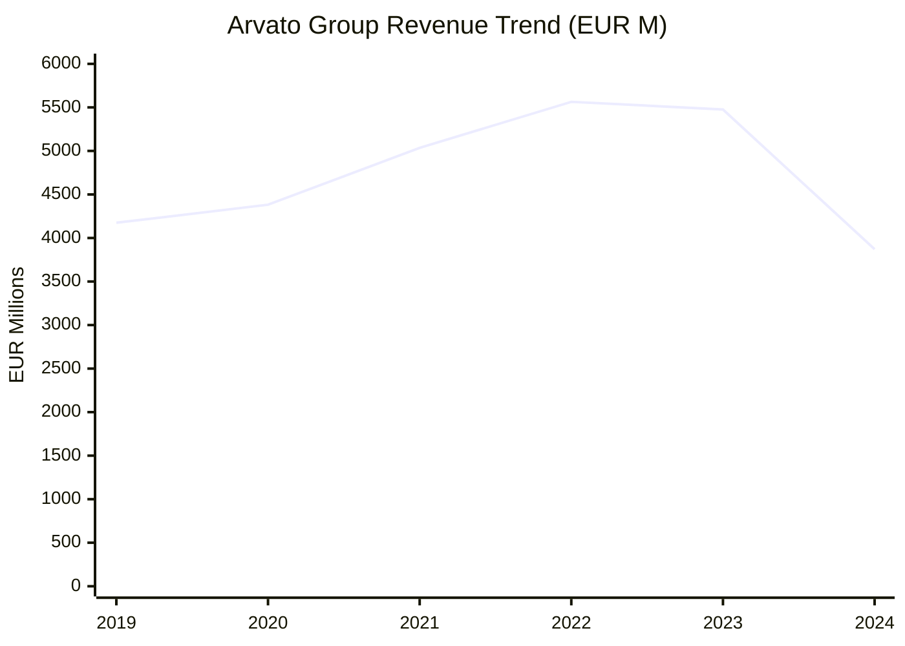
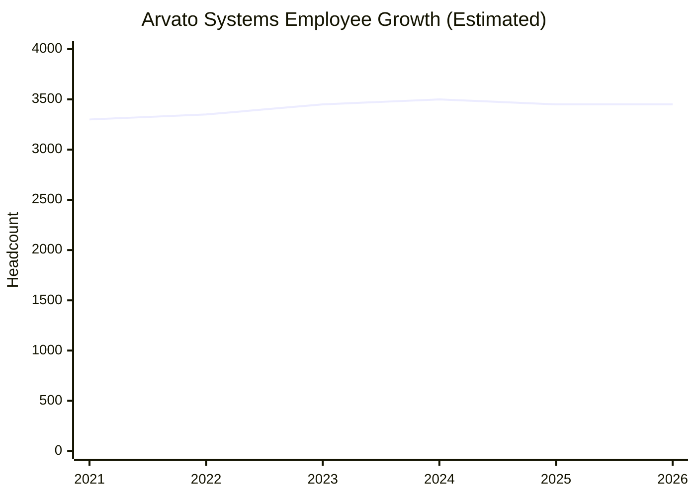
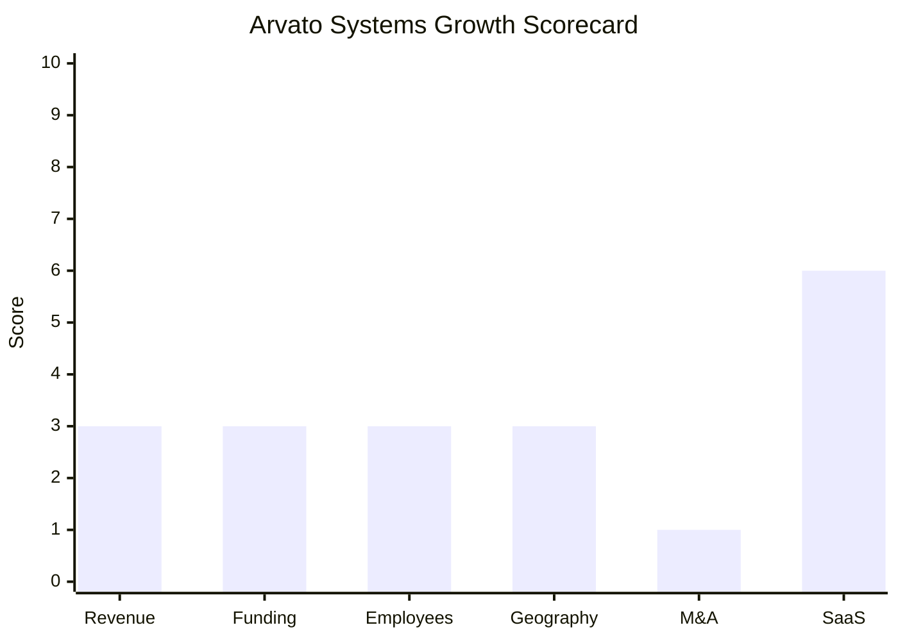

# Financial & Growth Deep-Dive - Arvato Systems (Bertelsmann)

**Research Date**: 2026-02-15
**Data Availability**: Low-Medium (private subsidiary within private conglomerate; Arvato Group segment reported in Bertelsmann annual reports, but Arvato Systems entity-level financials limited)

---

### Revenue Timeline

**Note**: Arvato Systems GmbH (IT services, ~EUR 512M) is one division within the broader Arvato Group (supply chain, financial services/Riverty, IT services, business processing). The Arvato Group figures below include all sub-divisions. The 2024 drop is primarily due to the sale of Majorel (customer support outsourcing) to Teleperformance in late 2023, not organic decline. Arvato Group's continuing operations grew organically ~3% in 2024.

#### Arvato Group (Bertelsmann Segment)

| Year | Revenue | Currency | EUR Equivalent | YoY Growth | Source | Confidence |
| --- | --- | --- | --- | --- | --- | --- |
| 2025 (9mo annualized) | ~EUR 5,400M | EUR | ~EUR 5,400M | ~+40% reported (distorted by 2024 base post-Majorel) | Bertelsmann Q3 2025 (Arvato cited as growth driver) | Estimated |
| 2024 | EUR 3,871M | EUR | EUR 3,871M | -29.3% | Bertelsmann Annual Report 2024 | Confirmed |
| 2023 | EUR 5,476M | EUR | EUR 5,476M | -1.6% | Bertelsmann Annual Report 2023, Statista | Confirmed |
| 2022 | EUR 5,564M | EUR | EUR 5,564M | +10.5% | Bertelsmann Annual Report 2022, Statista | Confirmed |
| 2021 | EUR 5,035M | EUR | EUR 5,035M | +14.9% | Bertelsmann Annual Report 2021, Statista | Confirmed |
| 2020 | EUR 4,382M | EUR | EUR 4,382M | +5.0% | Bertelsmann Annual Report 2020, Statista | Confirmed |
| 2019 | EUR 4,175M | EUR | EUR 4,175M | - | Bertelsmann Annual Report 2019, Statista | Confirmed |

**Arvato Group Revenue CAGR (3yr, 2021-2024)**: -8.3% (distorted by Majorel divestiture)
**Arvato Group Revenue CAGR (3yr, 2020-2023)**: +7.7% (pre-divestiture, reflects organic trajectory)
**Arvato Group Revenue CAGR (5yr, 2019-2024)**: -1.5% (distorted by Majorel sale)

#### Arvato Systems GmbH (IT Services Division)

| Year | Revenue | Currency | EUR Equivalent | YoY Growth | Source | Confidence |
| --- | --- | --- | --- | --- | --- | --- |
| 2025 | ~EUR 512-530M | EUR | ~EUR 520M | ~2-3% | Estimated from stable headcount + organic growth signals | Estimated |
| 2024 | EUR 512M | EUR | EUR 512M | Unknown | Company website, Wikipedia (de) | Confirmed |
| 2023 | ~EUR 500-520M | EUR | ~EUR 510M | Unknown | Estimated from stable headcount | Estimated |
| 2022 | ~EUR 480-510M | EUR | ~EUR 495M | Unknown | Estimated from headcount growth signals | Estimated |
| 2021 | ~EUR 450-480M | EUR | ~EUR 465M | Unknown | Estimated (proxy: ~EUR 140K/employee x ~3,300) | Estimated (proxy) |

**Arvato Systems Revenue CAGR (3yr, est.)**: ~3-5% (estimated from stable headcount and industry trends)

#### Revenue Trend Chart (Arvato Group)

> The sharp 2024 drop reflects the Majorel divestiture, not organic decline. Continuing operations grew organically ~3% in 2024. Arvato was cited as a growth driver in Bertelsmann's Q3 2025 results.

---

### Profitability

| Data Point | Value | Source | Confidence |
| --- | --- | --- | --- |
| EBITDA (Arvato Group, 2024) | EUR 641M | Bertelsmann Annual Report 2024 | Confirmed |
| EBITDA Margin (2024) | 16.6% | Bertelsmann Annual Report 2024 | Confirmed |
| EBITDA (Arvato Group, 2023) | EUR 895M | Bertelsmann Annual Report 2023 | Confirmed |
| EBITDA Margin (2023) | 16.3% | Bertelsmann Annual Report 2023 | Confirmed |
| Invested Capital (2024) | EUR 2,421M | Bertelsmann Annual Report 2024 | Confirmed |
| Invested Capital (2023) | EUR 2,383M | Bertelsmann Annual Report 2023 | Confirmed |
| Net Profit / Loss | Not separately reported | - | Unknown |
| Recurring Revenue % | Not disclosed | - | Unknown |
| SaaS Revenue % | Not disclosed (energy SaaS growing but small relative to group) | - | Unknown |
| Revenue per Employee (Arvato Systems) | ~EUR 146K | Calculated: EUR 512M / 3,500 | Calculated |
| Revenue per Employee (Arvato Group) | ~EUR 156K | Calculated: EUR 3,871M / ~24,850 | Calculated |

---

### Funding & Investment History

| Date | Round | Amount | Lead Investor(s) | Valuation | Source | Confidence |
| --- | --- | --- | --- | --- | --- | --- |
| N/A | Wholly-owned subsidiary | N/A | Bertelsmann SE & Co. KGaA (100%) | N/A (private) | Bertelsmann Annual Report | Confirmed |
| Feb 2022 | SAP Sovereign Cloud partnership | Undisclosed (equity stake) | Arvato Systems became co-shareholder with SAP | N/A | Bertelsmann/SAP press release | Confirmed |

**Total Raised**: N/A (internally funded by Bertelsmann)
**Latest Valuation**: Not applicable (private subsidiary of privately-held conglomerate)
**Current Investors**: Bertelsmann SE & Co. KGaA (100% ownership; Bertelsmann itself is controlled by the Mohn family via Bertelsmann Stiftung)
**War Chest Signals**: Bertelsmann deploying EUR 8B in "Boost" investment strategy through end of 2026 (EUR 1.3B deployed in first 9 months of 2025). In H1 2025, Bertelsmann made ~EUR 1B in economic investments. Arvato Group invested capital EUR 2,421M (2024). Parent has significant resources but prioritizes Penguin Random House, RTL Group (Sky Deutschland acquisition), BMG, and Bertelsmann Education Group for growth investments. Arvato's Boost allocation focuses on supply chain / distribution center expansion and automation -- not IT services or energy specifically. Arvato Systems is not a primary capital allocation target within the Boost strategy.

---

### Employee Timeline

| Year | Headcount | YoY Growth | Source | Confidence |
| --- | --- | --- | --- | --- |
| 2026 (current) | ~3,400-3,500 | ~0% | Company website, LinkedIn | Confirmed |
| 2025 | ~3,400-3,500 | ~0% | Company website | Estimated |
| 2024 | ~3,500 | ~0% | Company website, Wikipedia (de) | Confirmed |
| 2023 | ~3,400-3,500 | ~0% | Company website | Estimated |
| 2022 | ~3,300-3,400 | Unknown | Jan 2022 "growth course" announcement | Estimated |
| 2021 | ~3,200-3,400 | Unknown | No data; estimated from proxy | Estimated |

**Arvato Group Headcount (2024)**: ~24,850 employees (Bertelsmann Annual Report)
**Arvato (Supply Chain) Headcount**: 17,000+ employees across 90+ locations, EUR 2.5B revenue (separate from Arvato Systems)

**Employee CAGR (3yr, est.)**: ~0-2% (essentially flat)
**Current Open Positions**: 88 (LinkedIn, Feb 2026) -- 53 at Arvato Systems, 15 Romania, 5 Malaysia, others
**AI/ML/Data Science Open Roles**: Several AI specialist and generative AI consulting roles listed (ShapeX, AILA-Knowledge); no dedicated energy AI team size disclosed
**Hiring Hotspots**: Germany (primary), Romania (15 open roles), Malaysia (5 open roles)
**Key Recent Hires**: No C-level changes identified; Matthias Moeller continues as CEO (since 2016) and Bertelsmann CIO (since 2019); Frank Brinkmann leads Transformation & Technology (since Jan 2022)

#### Employee Growth Chart

---

### Geographic & Market Expansion

| Year | Expansion Event | Details | Source | Confidence |
| --- | --- | --- | --- | --- |
| 2025 | TenneT AS4 broker contract | Won Europe-wide tender for AS4-based message broker for market communication; 4-year contract + 2x3yr extension options; commenced May 2025 | Arvato Systems press release | Confirmed |
| 2025 | US data center entry (Arvato Group, not Systems) | Des Moines, Iowa; first US data center; plans for Atlanta, Milwaukee, Dulles | Arvato press release | Confirmed |
| 2025 | Dubai GCC hub (Arvato Group, not Systems) | First warehouse in Dubai for Gulf region | Arvato locations page | Confirmed |
| 2025 | ATC acquisition (Arvato Group, not Systems) | Acquired ATC Computer Transport & Logistics (Ireland, 280+ employees); data center logistics across Europe | arvato.com, RTE News | Confirmed |
| 2025 | Italy + Poland distribution (Arvato Group, not Systems) | New distribution centers for Douglas Group | InvestmentMonitor | Confirmed |
| 2022 | SAP Sovereign Cloud partnership | Arvato Systems became shareholder in SAP sovereign cloud for German public sector | Bertelsmann/SAP press release | Confirmed |

**Important Distinction**: Geographic expansion events in 2025 are predominantly Arvato Group (supply chain logistics), not Arvato Systems (IT services). Arvato Systems' energy customers remain exclusively Germany-focused.

**International Revenue %**: Not disclosed; energy IT business is predominantly German market
**Expansion Trajectory**: Arvato Group is expanding globally (US data centers, Gulf logistics, ATC Ireland acquisition) in supply chain. Arvato Systems' energy division remains focused on deepening German market penetration through MaKo, smart metering, AS4 compliance, and new SAP S/4HANA-based products (AEP.EnerS4). The TenneT AS4 broker contract (May 2025) creates a theoretical bridge to the Netherlands through TenneT's Dutch parent, but no NL market entry has been announced. NL uses EDSN protocols (not MaKo), which would require significant new investment.

---

### M&A Activity

| Date | Target | Deal Size | Capability Gained | Strategic Rationale | Source | Confidence |
| --- | --- | --- | --- | --- | --- | --- |
| Nov 2024 | ATC Computer Transport & Logistics (Arvato Group) | Undisclosed | Data center logistics (280+ employees, Ireland/EU) | End-to-end data center lifecycle services | arvato.com, RTE News | Confirmed |
| Feb 2025 | United Custom Services (Arvato Group) | Undisclosed | Custom crating/packaging | Supply chain expansion | Tracxn | Confirmed |
| Nov 2023 | Majorel stake sold to Teleperformance | ~EUR 3B (full company; Bertelsmann held 39.5%) | Divested customer support outsourcing | Portfolio optimization, exit non-core | Reuters | Confirmed |
| Feb 2022 | SAP Sovereign Cloud (equity stake, Arvato Systems) | Undisclosed | Sovereign cloud operations for German public sector | Strategic partnership, not full acquisition | Bertelsmann/SAP press release | Confirmed |
| May 2017 | Next Level Integration GmbH (Arvato Systems) | Undisclosed | Energy software for 250+ utilities; became AEP platform foundation | Enter energy software market | Arvato Systems press release | Confirmed |

**Divestitures**: Majorel sale (2023) -- major divestiture reducing Arvato Group revenue by ~EUR 1.5B
**M&A Pattern**: Minimal acquisition activity for Arvato Systems specifically. The NLI acquisition (2017) was the energy division's founding strategic move, now fully integrated as AEP. The ATC and United Custom Services acquisitions (2024-2025) belong to Arvato Group supply chain, not IT services. Bertelsmann's "Boost" investment strategy focuses M&A on other divisions (RTL/Sky Deutschland, BMG music catalogs, Penguin Random House publishers). No energy-sector acquisitions since NLI in 2017.

---

### SaaS Transition Metrics

| Data Point | Value | Source | Confidence |
| --- | --- | --- | --- |
| Deployment Model | Hybrid SaaS + managed IT services | Company website | Confirmed |
| Cloud Revenue % (current) | Not disclosed; energy SaaS products growing but overall business remains services-heavy | - | Unknown |
| Cloud Revenue % (1yr ago) | Not disclosed | - | Unknown |
| Cloud Revenue % (2yr ago) | Not disclosed | - | Unknown |
| Recurring Revenue % | Not disclosed; mix of SaaS subscriptions + multi-year IT outsourcing contracts (TenneT: 15yr, OGE: 6yr+) | - | Unknown |
| Platform Stack | Microsoft Azure (primary), SAP S/4HANA/BTP, Microsoft Dynamics 365, OpenShift | Company website, job postings, E-world 2026 announcements | Confirmed |
| Migration Status | In-progress -- energy portfolio actively transitioning to SaaS on Azure | Company press releases | Confirmed |

**Energy SaaS Products (current portfolio)**:
- **AEP MaKo Cloud**: End-to-end market communication SaaS, MaKo 2020/2022 compliant (live since Dec 2020)
- **AEP.GWA**: Gateway administration SaaS -- first in Germany to use Azure public cloud, BSI TR-03109 certification (live)
- **AEP.DataHub**: IoT time series platform with AI modules (anomaly detection, forecasting, replacement value generation) (live)
- **API Web Services**: SaaS-based API for market communication replacing EDIFACT; operational from April 1, 2025 (MALO Ident first) (launching)
- **AEP.EnerS4**: New billing platform based on SAP S/4HANA Utilities with cloud-native architecture (announced E-world 2026)
- **AEP.EnergySuite**: CRM template on Microsoft Dynamics 365 for energy suppliers (announced E-world 2026)

**Assessment**: The energy division is genuinely transitioning to cloud SaaS on Azure with a broadening product portfolio (from MaKo communication into billing, CRM, IoT, and AI). However, the broader Arvato Systems business (EUR 512M) remains dominated by managed IT services, IT outsourcing, and SAP consulting -- recurring contract revenue but not SaaS-model recurring. The energy vertical is a small but growing portion of total Arvato Systems revenue.

---

### Growth Scorecard

| Dimension | Score (1-10) | Evidence Summary |
| --- | --- | --- |
| Revenue Growth | 3 | Arvato Systems stable at ~EUR 512M with estimated ~3-5% organic CAGR; Arvato Group CAGR distorted by Majorel sale; no explosive growth signals |
| Funding Momentum | 3 | No external funding; Bertelsmann parent has EUR 8B Boost strategy but Arvato Systems energy is not a primary allocation target; SAP sovereign cloud partnership is strategic but modest |
| Employee Growth | 3 | Headcount flat at ~3,400-3,500 for 3+ years; 88 open positions is moderate; no aggressive hiring or AI team scaling signals |
| Geographic Expansion | 3 | Arvato Group expanding globally (US data centers, Gulf, ATC Ireland) but Arvato Systems energy remains Germany-only; TenneT NL bridge is theoretical only |
| M&A Activity | 1 | Zero energy-sector acquisitions since NLI in 2017; Arvato Group M&A is supply chain focused; no capability-building M&A for IT services/energy |
| SaaS Maturity | 6 | Energy products genuinely transitioning to SaaS on Azure (MaKo Cloud, GWA, DataHub, API WS, new EnerS4 billing, EnergySuite CRM); but overall Arvato Systems business remains services-heavy; no recurring revenue % disclosed |
| **COMPOSITE SCORE** | **3.2** | **Steady -- stable IT services business with growing energy SaaS pocket, but no transformative investment, zero energy M&A, flat headcount** |

**Classification**: **Steady** (avg 3.0-4.9)

Arvato Systems is a stable, profitable IT services business within a massive conglomerate. The energy division shows genuine innovation (broadening from MaKo communication into billing/CRM/IoT/AI on Azure) but is a small part of a EUR 512M entity that is itself a small part of a EUR 3.9B group. No signals of aggressive investment, expansion, or transformation targeting the energy vertical. The parent's Boost investment strategy prioritizes media (RTL/Sky), publishing (Penguin Random House), music (BMG), and education -- not energy IT. The only energy-specific M&A was NLI in 2017, now fully integrated.

#### Growth Scorecard Radar

> Arvato Systems' only above-average dimension is SaaS Maturity (6/10), driven by genuine energy product cloudification on Azure with an expanding portfolio. All other dimensions are flat/minimal. The near-zero M&A score is notable -- unlike competitors investing heavily in capability-building, Arvato Systems relies entirely on organic development within Bertelsmann's portfolio.

---

### Key Observations for Eneve

1. **Conglomerate Dilution**: Arvato Systems' energy division is a niche within a niche -- a small vertical within a EUR 512M IT services company, within a EUR 3.9B services group, within a EUR 19B media/services conglomerate. Energy is not where Bertelsmann's strategic attention or Boost investment capital flows.

2. **Genuine SaaS Innovation in Energy**: Despite the conglomerate dilution, the energy team is broadening its portfolio beyond MaKo communication. New E-world 2026 announcements (AEP.EnerS4 billing on SAP S/4HANA, AEP.EnergySuite CRM on Dynamics 365) plus existing products (DataHub with AI, GWA with BSI certification, API web services) show a systematic platform buildout. The trajectory is from communication infrastructure toward full energy IT stack.

3. **TenneT Bridge Risk**: The 15-year TenneT partnership and new AS4 broker contract (May 2025, Europe-wide tender win, 4yr + 2x3yr extensions) creates a theoretical path to the Dutch market. TenneT TSO GmbH is the German entity, but parent TenneT Holding B.V. is Dutch. However, NL uses EDSN protocols (not MaKo), requiring significant new investment. No NL market entry announced.

4. **No Threat Escalation Expected**: Flat headcount, zero energy M&A since 2017, no external funding, Boost capital directed elsewhere -- Arvato Systems is not accelerating in energy. The energy division will continue serving German MaKo/smart metering/billing but is unlikely to make aggressive moves into new markets or capabilities without a strategic directive from Bertelsmann that is not currently visible.

5. **Infrastructure Expanding Toward Business Logic**: Arvato Systems is evolving from pure communication infrastructure (AS4, message routing) toward more business functionality (billing via EnerS4, CRM via EnergySuite, time series via DataHub, AI via AILA-Knowledge). This direction of travel -- from infrastructure toward business logic -- narrows the gap with back-office specialists like Eneve. However, Eneve's core domain (allocations, settlements, balancing, nominations) remains untouched.

6. **AI Signal Stable at MODERATE**: Microsoft partnership for generative AI (ShapeX consulting, AILA-Knowledge), ISG Leader in Generative AI Services for Microsoft Clouds, AEP.DataHub AI modules (anomaly detection, forecasting). Not AI-native, but systematically integrating AI into energy platform through Microsoft stack. No dedicated energy AI team or acquisitions.

---

### Sources

- Bertelsmann Annual Report 2024 (PDF): bertelsmann.com/media/news-und-media/downloads/geschaeftsjahr-2024/
- Bertelsmann Q3 2025 results: bertelsmann.com/news-and-media/news/q3-2025-bertelsmann-continues-its-revenue-growth-path.jsp
- Bertelsmann H1 2025 results: bertelsmann-investments.com/news/bertelsmann-reports-solid-half-year-2025-results
- Bertelsmann Boost strategy: bertelsmann.com/news-and-media/specials/boost-bertelsmann/
- Bertelsmann Arvato financial figures: bertelsmann.com/investor-relations/bertelsmann-at-a-glance/financial-figures/arvato/
- Bertelsmann Investments H1 2025: bertelsmann.com/news-and-media/news/bertelsmann-investments-reports-organic-growth-of-18.1-percent-after-first-six-months-of-2025.jsp
- Statista - Arvato Group annual revenue 2005-2023: statista.com/statistics/272309/arvatos-annual-revenue/
- Reuters - Majorel sale: reuters.com/markets/europe/bertelsmann-posts-drop-half-year-revenue-due-majorel-sale-2024-08-28/
- Arvato Systems about page: arvato-systems.com/more/about-arvato-systems
- Arvato Systems management: arvato-systems.com/more/about-arvato-systems/management
- Arvato Systems press releases: arvato-systems.com/more/press/
- Arvato Systems TenneT contract: arvato-systems.com/more/press/tennet-relies-on-arvato-systems-for-market-communications
- Arvato Systems NLI acquisition (2017): us.arvato-systems.com/more/press/arvato-systems-becomes-sole-shareholder-of-next-level-integration-gmbh
- Arvato Systems NLI integration (2022): us.arvato-systems.com/more/press/next-level-integration-arvato-systems-continue-to-grow-together
- Arvato Systems SAP partnership: arvato-systems.com/more/press/first-souvereign-cloud-platform-partnership-sap-and-arvato-systems
- Arvato Systems API web services: arvato-systems.com/more/press/arvato-systems-supports-the-energy-sector-with-saas-based-api-we
- Arvato Systems AI & energy: arvato-systems.com/industries/utilities/data-ai
- Arvato Systems generative AI: arvato-systems.com/more/press/arvato-systems-and-microsoft-focus-on-generative-ai
- Arvato Systems E-world 2026: us.arvato-systems.com/more/press/software-for-stable-data-management
- Arvato Systems Energy Days 2026: arvato-systems.com/more/events/arvato-systems-energy-days-2026
- Arvato ATC acquisition: arvato.com/about/insights/arvato-signs-agreement-to-acquire-atc-computer-transport-logistics
- ATC regulatory approval: atc-logistics.com/acquisition-approved-by-ccpc/
- Tracxn - Arvato acquisitions: tracxn.com/d/acquisitions/acquisitions-by-arvato/
- Wikipedia (de) - Arvato Systems: de.wikipedia.org/wiki/Arvato_Systems
- LinkedIn - Arvato Systems jobs: linkedin.com/jobs/arvato-systems-jobs-worldwide
