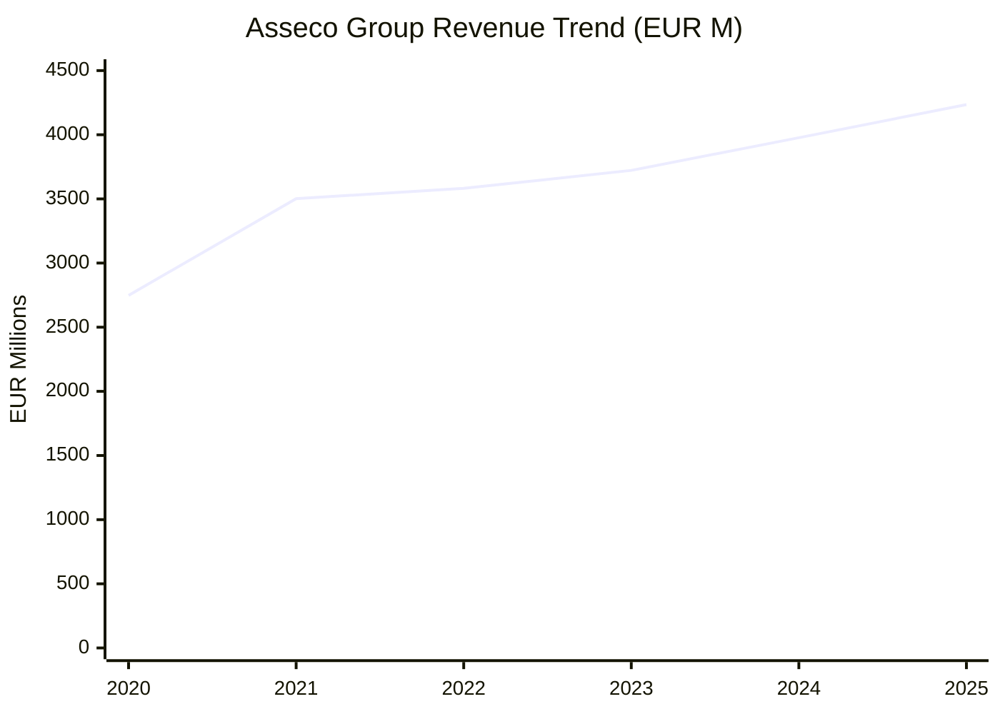
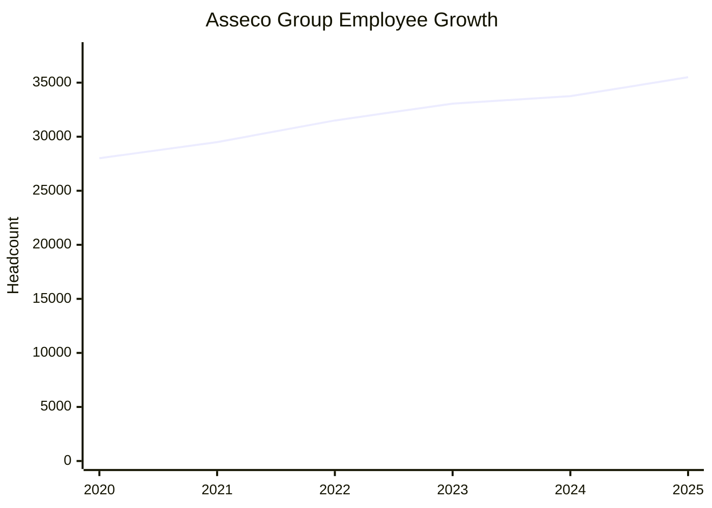
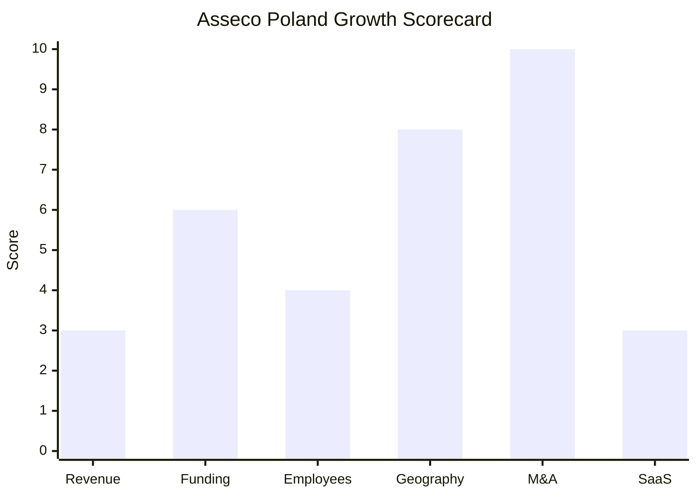

# Financial & Growth Deep-Dive - Asseco Poland S.A.

**Research Date**: 2026-02-15
**Data Availability**: High (public company listed on WSE, extensive annual reports and financial disclosures)

---

### Revenue Timeline

| Year | Revenue | Currency | EUR Equivalent | YoY Growth | Source | Confidence |
| --- | --- | --- | --- | --- | --- | --- |
| 2025 (est.) | PLN 18.0B | PLN | EUR 4,235M | +5.3% | Annualized from 9M PLN 12.3B + H1 8% growth trend | Estimated |
| 2024 | PLN 17.1B | PLN | EUR 3,977M | +1.2% | 2024 Annual Report (esg.asseco.com) | Confirmed |
| 2023 | PLN 16.9B | PLN | EUR 3,722M | +0.6% | 2023 Annual Report (see.asseco.com) | Confirmed |
| 2022 | PLN 16.8B | PLN | EUR 3,582M | +5.0% | ASEE investor page (see.asseco.com) | Confirmed |
| 2021 | PLN 16.0B | PLN | EUR 3,502M | +31.1% | ASEE investor page (see.asseco.com) | Confirmed |
| 2020 | PLN 12.2B | PLN | EUR 2,748M | -- | Non-financial statement 2020 (assecobs.pl) | Confirmed |

**Revenue CAGR (3yr, 2021-2024)**: 2.3% (nominal PLN)
**Revenue CAGR (4yr, 2020-2024)**: 8.8% (heavily inflated by 2020-2021 post-COVID recovery + acquisitions)
**Revenue CAGR (constant currency, 3yr)**: ~4-6% (management reports exclude FX effects; Formula Systems segment +5%, Asseco International +7% in constant currency for 2024)

**Key Context**: The 31% revenue jump in 2021 was driven by post-COVID recovery and the full-year consolidation impact of acquired subsidiaries. Organic growth since 2022 has been low single-digit (1-5% nominal), reflecting the maturity of the group's diversified portfolio. Foreign markets (Formula Systems + Asseco International) account for 88% of Group revenue; the Polish segment contributes only PLN 2.1B (12%).

#### Revenue Trend Chart

### Revenue by Segment (2024)

| Segment | Revenue (PLN) | Revenue (EUR) | % of Group | YoY Growth | Notes |
| --- | --- | --- | --- | --- | --- |
| Formula Systems (Israel) | PLN 11.0B | EUR 2,558M | 64% | +5% (constant currency) | Cybersecurity, healthcare, transportation; listed on NASDAQ (FORTY) |
| Asseco International | PLN 4.1B | EUR 953M | 24% | +7% (constant currency) | Payments, ERP, public sector across CEE/SEE |
| Asseco Poland | PLN 2.1B | EUR 488M | 12% | +4% | Finance, public admin, energy, healthcare (Poland) |

**Critical Insight**: Asseco's "energy business" sits within the Asseco Poland segment (PLN 2.1B), where energy is a sub-segment. Energy-specific revenue is not disclosed separately but is likely EUR 50-150M based on the AUMS client base (TAURON, Enea, etc.). This makes Asseco's energy exposure a rounding error at Group level.

---

### Profitability

| Data Point | Value | Source | Confidence |
| --- | --- | --- | --- |
| Operating Profit (2024) | PLN 1.8B (EUR 419M) | 2024 Annual Report | Confirmed |
| Operating Profit Growth (2024 YoY) | +10% | esg.asseco.com press release | Confirmed |
| Net Profit (2024, to parent shareholders) | PLN 520M (EUR 121M) | 2024 Annual Report | Confirmed |
| Net Profit Growth (2024 YoY) | +8% (record high) | polandinsight.com | Confirmed |
| Operating Margin (2024) | ~10.5% | Calculated: 1.8B / 17.1B | Confirmed |
| EBITDA (2024) | Not separately disclosed | Annual report | Unknown |
| Proprietary Products Revenue (2024) | PLN 13.5B (79% of total) | 2024 Annual Report | Confirmed |
| Recurring Revenue % | Not disclosed | Annual report | Unknown |
| SaaS Revenue % | Not disclosed | Annual report | Unknown |
| Revenue per Employee (2024) | EUR 118K (PLN 507K) | Calculated: 17.1B / 33,752 | Calculated |

**Profitability Note**: The gap between "operating profit" (PLN 1.8B) and "net profit attributable to parent shareholders" (PLN 520M) reflects Asseco's federated structure. The Group generates substantial profits across subsidiaries, but only a fraction flows to Asseco Poland shareholders due to significant minority interests in Formula Systems, ASEE, and other listed subsidiaries.

---

### Funding & Investment History

| Date | Event | Amount | Details | Source | Confidence |
| --- | --- | --- | --- | --- | --- |
| Jan 2025 | TSS acquires 9.99% from Cyfrowy Polsat | PLN 706M (EUR 166M) | 8,300,029 shares at PLN 85/share | asseco.com, whitecase.com | Confirmed |
| Feb 2025 | TSS acquires 14.84% treasury shares | PLN 1.05B (EUR 247M) | 12,318,863 treasury shares at PLN 85/share | asseco.com, whitecase.com | Confirmed |
| 2004 | IPO on Warsaw Stock Exchange | -- | Listed as ACP on WSE | asseco.com | Confirmed |
| 2004-present | Dividend payments | PLN 3.5B total (EUR ~830M) | Cumulative dividends since IPO | 2024 Annual Report | Confirmed |

**Total Strategic Investment (2025)**: PLN 1.76B (~EUR 413M) by TSS for 24.84% stake
**Latest Implied Valuation**: PLN 7.1B (EUR 1.67B) at PLN 85/share (TSS transaction price, Jan-Feb 2025)
**Market Cap (Feb 2026)**: PLN 12.2B (~EUR 2.9B) at PLN 178.40/share
**Market Cap (Sept 2025 peak)**: PLN 14.5B (~EUR 3.4B) at PLN 209.40/share

**Current Key Shareholders**:

| Shareholder | Stake | Notes |
| --- | --- | --- |
| Total Specific Solutions (TSS) | 24.84% | Strategic partner; Topicus.com subsidiary; max 27.96% per agreement |
| Adam Goral Family Foundation | ~10.01% | Founder; CEO until ~2027 succession |
| Public float | ~65% | WSE-listed |

**War Chest Signals**: PLN 1.05B raised from TSS treasury share sale (Feb 2025). Strong free cash flow from operations. PLN 13.5B order backlog for 2025 provides revenue visibility. TSS partnership brings Topicus/Constellation Software acquisition playbook and capital access.

**Dividend Per Share History**:

| Year | DPS (PLN) | YoY Change |
| --- | --- | --- |
| 2020 | 3.01 | -- |
| 2021 | 3.11 | +3.3% |
| 2022 | 3.36 | +8.0% |
| 2023 | 3.50 | +4.2% |
| 2024 | 3.66 | +4.6% |
| 2025 (interim) | 3.94 | +7.7% |

---

### Employee Timeline

| Year | Headcount | YoY Growth | Source | Confidence |
| --- | --- | --- | --- | --- |
| 2025 (est.) | ~35,500 | +5.2% | Estimated from 2024 + 22+ acquisitions in 2025 | Estimated |
| 2024 | 33,752 | +2.1% | 2024 Annual Report (esg.asseco.com) | Confirmed |
| 2023 | 33,062 | +5.0% | 2023 Annual Report (see.asseco.com) | Confirmed |
| 2022 | ~31,500 | +6.8% | Interpolated between 2021 and 2023 | Estimated |
| 2021 | ~29,500 | +5.3% | Interpolated between 2020 and 2022 | Estimated |
| 2020 | 28,009 | -- | Non-financial statement 2020 | Confirmed |

**Employee CAGR (4yr, 2020-2024)**: 4.8%
**Employee CAGR (3yr, 2021-2024, estimated)**: ~4.6%
**Current Open Positions**: Not quantified; job postings found for Java developers, consultants across Poland and Lithuania
**AI/ML Roles**: No energy-specific AI/ML hiring identified; general AI interest at corporate level
**Hiring Hotspots**: Poland (HQ), Israel (Formula Systems), CEE/SEE (Asseco International subsidiaries)

#### Employee Growth Chart

---

### Geographic & Market Expansion

| Year | Expansion Event | Details | Source | Confidence |
| --- | --- | --- | --- | --- |
| 2025 | Israel (3 acquisitions) | Expansion through Formula Systems subsidiary | biznes.pap.pl | Confirmed |
| 2025 | Spain (1 acquisition) | New geographic market entry | biznes.pap.pl | Confirmed |
| 2025 | Egypt (1 acquisition) | Middle East / Africa expansion | biznes.pap.pl | Confirmed |
| 2025 | Slovakia, Czech Republic (2 acquisitions) | CEE consolidation | biznes.pap.pl | Confirmed |
| 2024 | United States (acquisition) | Entry via Formula Systems network | polandinsight.com | Confirmed |
| 2024 | India (acquisition) | Asia expansion | polandinsight.com | Confirmed |
| 2024 | Portugal (acquisition) | Western European market entry | polandinsight.com | Confirmed |
| 2024 | Israel (multiple acquisitions) | Continued Formula Systems growth | polandinsight.com | Confirmed |
| Pre-2024 | 60+ countries presence | Established through 150+ acquisitions since 2004 | asseco.com | Confirmed |

**International Revenue %**: 88% (Formula Systems + Asseco International segments)
**Expansion Trajectory**: Asseco is one of the most geographically aggressive acquirers in European IT. The pace accelerated in 2024-2025 with entry into US, India, Egypt, Spain, and Portugal. However, expansion is entirely acquisition-driven (not organic market entry) and follows the Constellation Software/Topicus playbook of acquiring vertical market software companies. Energy-specific geographic expansion is negligible -- the energy business remains Poland-only.

---

### M&A Activity

| Date | Target | Deal Size | Capability Gained | Strategic Rationale | Source | Confidence |
| --- | --- | --- | --- | --- | --- | --- |
| 2025 Q4 | 9 companies (PL x2, SK, CZ, IL x3, ES, EG) | Undisclosed | Multi-sector IT capabilities | Geographic + capability expansion | biznes.pap.pl | Confirmed |
| 2025 H1 | 13 companies across EU/CA/IN/ME | Undisclosed | Cloud, cybersecurity, AI-adjacent | Acceleration of M&A pace | biznes.pap.pl | Confirmed |
| 2025 | Infocomp (51% stake) | Undisclosed | Hospital IT outsourcing | Healthcare sector expansion | tradingview.com | Confirmed |
| 2024 | 14 companies (US, IN, PT, IL) | Undisclosed | Multi-sector expansion | Geographic + capability diversification | polandinsight.com | Confirmed |
| Jan-Feb 2025 | TSS strategic investment | PLN 1.76B inbound | Constellation Software M&A expertise | Strategic partnership for accelerated acquisitions | asseco.com | Confirmed |

**Total Acquisitions (2024-2025)**: 36+ companies in 2 years
**Total Acquisitions (since 2004)**: 150+ companies
**Divestitures**: None identified
**M&A Pattern**: Serial acquisition machine following the Constellation Software / Topicus vertical market software (VMS) playbook. Targets are typically small-to-medium IT companies in specific verticals (finance, healthcare, public admin, ERP). TSS partnership (Topicus subsidiary) brings proven M&A execution capability and capital. Acquisitions are broad-based -- not focused on energy.

**M&A Velocity Comparison**:

| Period | Acquisitions | Pace |
| --- | --- | --- |
| 2004-2020 (16yr) | ~115 | ~7/year |
| 2021-2023 (3yr) | ~25 est. | ~8/year |
| 2024 | 14 | 14/year |
| 2025 (to date) | 22+ | 29+/year (annualized) |

The TSS partnership has dramatically accelerated the acquisition pace from ~7-8/year to potentially 25-30/year.

---

### SaaS Transition Metrics

| Data Point | Value | Source | Confidence |
| --- | --- | --- | --- |
| Deployment Model | Hybrid (on-premise dominant, some cloud) | Product pages, annual report | Confirmed |
| Cloud Revenue % (current) | Not disclosed | Annual report | Unknown |
| Cloud Revenue % (1yr ago) | Not disclosed | Annual report | Unknown |
| Recurring Revenue % | Not disclosed; proprietary products = 79% of total | Annual report 2024 | Estimated |
| Platform Stack | Java, Spring MVC/Boot, Angular; relational + NoSQL; Docker, Kubernetes | Job postings (Asseco Lithuania, Personio) | Confirmed |
| Migration Status | Gradual; no stated cloud-first migration timeline | Product positioning | Estimated |

**SaaS Assessment**: Asseco's business model is traditional enterprise software licensing + professional services. The "79% proprietary products" metric includes both on-premise licenses and hosted solutions but does not equate to SaaS recurring revenue. The energy business (AUMS) is primarily deployed on-premise for large utility clients (TAURON's 5.4M customer deployment is on-prem). The TSS partnership may accelerate a shift toward recurring revenue models, as TSS/Topicus specializes in vertical SaaS, but no concrete timeline has been announced. Cloud adoption within the Group varies significantly by subsidiary and geography.

---

### Growth Scorecard

| Dimension | Score (1-10) | Evidence Summary |
| --- | --- | --- |
| Revenue Growth | 3 | 3yr nominal CAGR 2.3%; constant currency 4-6%; low single-digit organic growth masked by acquisition contributions |
| Funding Momentum | 6 | TSS invested EUR 413M for 24.84% strategic stake; strong market cap (EUR 2.9B); no VC-style growth funding but significant strategic capital infusion |
| Employee Growth | 4 | 4yr CAGR 4.8%; acquisition-driven headcount growth; no aggressive hiring signals; stable but not expanding organically |
| Geographic Expansion | 8 | Entered 5+ new countries in 2024-2025 (US, India, Portugal, Spain, Egypt, Israel expansion); 60+ country presence; hyper-active geographic M&A |
| M&A Activity | 10 | 36+ acquisitions in 2024-2025; 150+ total since 2004; accelerating pace with TSS partnership; most active acquirer in European IT services |
| SaaS Maturity | 3 | On-premise dominant; no cloud/SaaS revenue disclosed; traditional enterprise licensing; 79% proprietary products but not SaaS; gradual modernization |
| **COMPOSITE SCORE** | **5.7** | **Classification: Riser** |

**Classification Thresholds**:

- **Rocket** (avg 7.0-10.0): Explosive growth, heavy investment, market disruptor
- **Riser** (avg 5.0-6.9): Strong growth signals, investing in future, accelerating
- **Steady** (avg 3.0-4.9): Stable but not transforming, evolutionary
- **Dinosaur** (avg 1.0-2.9): Flat or declining, legacy mode, no visible investment

#### Growth Scorecard Radar

> The scorecard reveals Asseco's defining characteristic: an **M&A-driven conglomerate** with extreme acquisition velocity (10/10) and geographic reach (8/10), but modest organic growth (3/10 revenue) and legacy technology positioning (3/10 SaaS). The TSS strategic investment (6/10 funding) signals a potential inflection point -- Topicus/Constellation's playbook could accelerate the shift from "acquisition accumulator" to "vertical SaaS compounder." The Riser classification at 5.7 is driven almost entirely by the M&A machine, not by product innovation or market disruption.

---

### Eneve Strategic Implications

**Threat Level to Eneve**: Very Low (direct), Low-Moderate (indirect/long-term)

**Why Asseco Scores "Riser" but Isn't a Threat**:

Asseco's 5.7 composite score makes it a "Riser" on paper, but the growth profile is fundamentally different from the Rockets/Risers that threaten Eneve:

1. **The growth is broad, not deep**: 36+ acquisitions in 2 years across healthcare, finance, public admin, cybersecurity, ERP -- energy is a rounding error in the portfolio. None of the recent acquisitions target energy back-office capabilities.

2. **The energy business is static**: The AUMS billing/CIS platform (65% of Polish electricity bills) is a stable cash cow, not a growth engine. No new product versions, no AI features, no cross-border expansion signals.

3. **Geographic expansion avoids NL/Western Europe energy**: New markets (US, India, Egypt, Israel) are for IT services generally, not energy-specific. No EDSN, no MaKo, no Dutch/German protocol expertise.

4. **TSS partnership accelerates breadth, not depth**: The Constellation/Topicus model acquires many small vertical software companies for cash flow, not to build transformative platforms. This makes Asseco a bigger conglomerate, not a better energy software company.

**The one scenario to watch**: If EU energy market harmonization replaces national protocols (CSIRE, EDSN, MaKo) with unified standards, Asseco's acquisition firepower could enable rapid entry into adjacent markets through targeted buys. Currently, protocol fragmentation is Eneve's natural moat.

---

**Sources**:

- Asseco Poland 2024 Annual Report (esg.asseco.com)
- Asseco Poland 2023 Annual Report (see.asseco.com)
- Asseco Non-Financial Statement 2020 (assecobs.pl)
- Asseco Poland Investor Relations (inwestor.asseco.com)
- Poland Insight: "Asseco Reports Record Year in 2024" (polandinsight.com)
- Biznes PAP: "Asseco Poland announces further acquisitions Q4 2025" (biznes.pap.pl)
- Biznes PAP: "Asseco Poland IT optimistic about H2 2025" (biznes.pap.pl)
- TSS Investment announcement (asseco.com, totalspecificsolutions.com)
- White & Case: PLN 1B treasury share sale advisory (whitecase.com)
- StockAnalysis.com (WSE:ACP financial data)
- DividendMax (asseco dividend history)
- AInvest: Q2 2025 earnings analysis (ainvest.com)
- MarketScreener: H1 2025 results and outlook (marketscreener.com)
