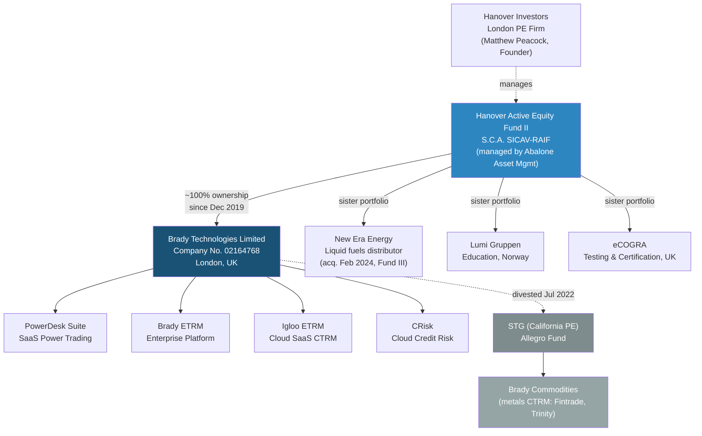
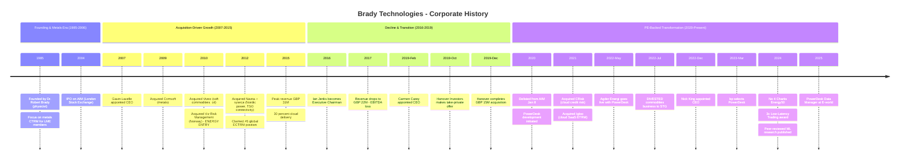
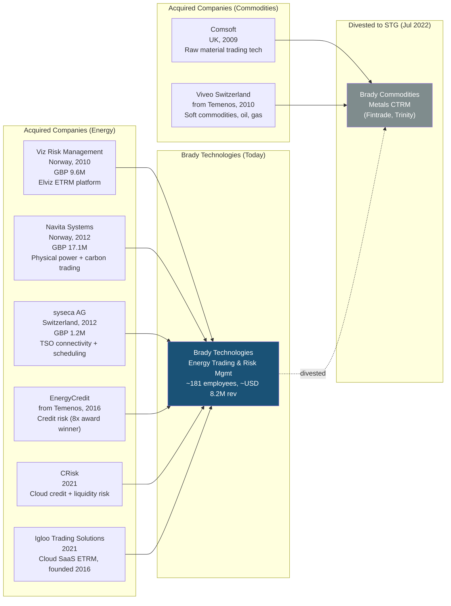

# Brady Technologies - Corporate History

**Research Date**: 2026-02-15
**Genealogy Confidence**: High (Companies House records, press releases, AIM filing history, and PE transaction documentation available)
**Parent Profile**: [brady-technologies-powerdesk.md](brady-technologies-powerdesk.md)

## Current Ownership & Key Parties

| Stakeholder | Role | Stake % | Type | Since | Source |
|---|---|---|---|---|---|
| Hanover Active Equity Fund II S.C.A. SICAV-RAIF | Majority shareholder / PE investor | ~100% | PE (Active Equity) | Dec 2019 | mergr.com, hanoverinvestors.com |
| Abalone Asset Management Limited | Fund manager (manages Hanover Fund II) | N/A | Fund Manager | Dec 2019 | LexisNexis, MarketScreener |

**Board of Directors**:

| Name | Role | Represents | Background | Source |
|---|---|---|---|---|
| Matthew Peacock | Chairman | Hanover Investors (Founder & Chairman) | Founding partner of Hanover Investors; PE strategy oversight | bradytechnologies.com/the-board |
| Nick King | CEO | Management | 30+ years in innovation, media, technology, and PE-backed businesses; appointed Dec 2022 (acting since summer 2022) | bradytechnologies.com/news |
| Andrew Woolley | CFO | Management | Joined Feb 2021 | bradytechnologies.com/the-board |
| Jason Carley | Non-Executive Director | Independent / Investor | N/A | bradytechnologies.com/the-board |

**Corporate Structure** (Mermaid diagram):



## Origin Story

| Data Point | Value | Source | Confidence |
|---|---|---|---|
| Founded | 1985 | bradytechnologies.com/our-history | Confirmed |
| Original Name | Brady (later Brady plc, then Brady Technologies) | Companies House, bradytechnologies.com | Confirmed |
| Founders | Dr. Robert Brady (PhD in physics) | bradytechnologies.com/our-history | Confirmed |
| Original Mission | Address lack of market transparency and inadequate trading management tools in commodities markets | bradytechnologies.com/our-history | Confirmed |
| Original Product | Commodities trading and risk management software (metals focus) | bradytechnologies.com, CTRM Center | Confirmed |
| First Market | UK metals / London Metal Exchange (LME) members | MarketScreener, CTRM Center | Confirmed |
| Company Registration | UK Company No. 02164768 (Brady Technologies Limited) | companycheck.co.uk | Confirmed |

Brady was founded in 1985 by Robert Brady, a physicist, during a period when commodities trading houses lacked adequate software for managing their trading books and risk. The company initially focused on metals trading software, building a strong position among London Metal Exchange members and trading houses. For its first two decades, Brady was primarily a metals-focused CTRM vendor operating from the UK.

## Corporate Identity Changes

| # | Date | From | To | Reason | Source |
|---|---|---|---|---|---|
| 1 | 2004 | Brady (private) | Brady plc (AIM-listed) | IPO on AIM market of London Stock Exchange | aimlisting.co.uk, Chartis Research |
| 2 | Jan 2020 | Brady plc (AIM-listed) | Brady (private, delisted) | Take-private by Hanover Investors; delisted from AIM 8 Jan 2020 | proactiveinvestors.com |
| 3 | ~2020-2021 | Brady plc | Brady Technologies | Rebrand following Hanover acquisition and strategic refocus on energy; website moved to bradytechnologies.com | bradytechnologies.com |

## Mergers & Acquisitions Timeline

### Acquisitions Made (as buyer)

| Date | Target Company | Deal Value | What Was Gained | Integration Outcome | Source |
|---|---|---|---|---|---|
| 2009 | Comsoft (Commodities Software) | Undisclosed | UK-based raw material trading technology for refined/unrefined metals | Integrated into Brady platform | waterstechnology.com |
| Mar 2010 | Viveo Switzerland SA (commodities business, from Temenos) | Undisclosed | Soft commodities, oil, gas, metals trading software; offices in Geneva, France, Italy, Russia; founded 1986 | Integrated; expanded European footprint and asset class coverage | goldenhill.international |
| Dec 2010 | Viz Risk Management Services AS (Norway) | ~GBP 9.6M | Norwegian ETRM platform (Elviz) for electricity, gas, coal, emissions; founded 1992; European energy market entry | Transformational; made Brady largest European commodities software provider | wallstreetandtech.com, finextra.com |
| Feb 2012 | Navita Systems (Norway) | ~GBP 17.1M cash + GBP 682K shares | Physical power and carbon trading systems across Europe and North America; operations in electricity, gas, emissions, coal | Integrated; strengthened Nordic energy capabilities | proactiveinvestors.co.uk, goldenhill.international |
| Feb 2012 | syseca AG (Switzerland) | ~GBP 1.2M (incl. GBP 500K in shares) | Physical electricity trading capabilities; TSO connectivity across European markets; founded 1994 | Integrated; added real-time scheduling and TSO connections | proactiveinvestors.co.uk, aimlisting.co.uk |
| Jan 2016 | EnergyCredit (from Temenos) | Undisclosed | Energy credit risk management; 8x Energy Risk "Credit Risk Solution of the Year" winner | Maintained as separate product; later replaced by CRisk | marketscreener.com |
| Sep 2021 | CRisk | Undisclosed | Cloud-native enterprise credit and liquidity risk platform for energy/commodities trading | Maintained as "CRisk" product brand under Brady | bradytechnologies.com/news |
| Oct 2021 | Igloo Trading Solutions | Undisclosed | Cloud-native SaaS ETRM/CTRM for European energy markets; multi-asset trading, real-time P&L, algo execution; founded 2016 | Maintained as "Igloo ETRM" product brand under Brady | bradytechnologies.com/news |

### Acquired By (as target)

| Date | Acquiring Company | Deal Value | Strategic Rationale | Source |
|---|---|---|---|---|
| Dec 2019 | Hanover Investors (via Hanover Active Equity Fund II) | GBP 15M (18p/share, 171% premium) | Brady lacked capital and public market support for growth despite strong market position; Hanover saw undervalued software asset with transformation potential | mergr.com, proactiveinvestors.com |

## Investment & Financial Events

| Date | Event Type | Details | Investors/Counterparty | Investor Type | Amount | Source |
|---|---|---|---|---|---|---|
| 1985 | Founding | Company established by Dr. Robert Brady | Robert Brady (founder) | Founder | Unknown | bradytechnologies.com |
| 2004 | IPO | Admission to AIM market of London Stock Exchange (ticker: BRY.L) | Public market | Public | Unknown | Chartis Research, aimlisting.co.uk |
| Dec 2010 | Share Placing | Fundraise to fund Viz Risk Management acquisition | Public shareholders | Public | GBP 15M (at 77p/share) | proactiveinvestors.co.uk |
| Feb 2012 | Share Placing | Fundraise to fund Navita + syseca acquisitions | Public shareholders | Public | GBP 18M (at 77p/share) | proactiveinvestors.co.uk |
| Oct 2019 | PE Buyout (initial offer) | Hanover's initial recommended offer for Brady plc | Hanover Investors | PE (Active Equity) | GBP 8.3M (10p/share) | proactiveinvestors.com |
| Nov 2019 | PE Buyout (revised offer) | Hanover increased bid after unnamed competing bidder emerged | Hanover Investors | PE (Active Equity) | GBP 15M (18p/share, 171% premium) | proactiveinvestors.com, LexisNexis |
| Nov 2019 | Debt Facility | Loan from Hanover to Brady to support transaction | Hanover Investors | PE (Active Equity) | GBP 5M | proactiveinvestors.com |
| Jan 2020 | Delisting | Brady delisted from AIM following Hanover take-private | N/A | N/A | N/A | proactiveinvestors.com |

**Revenue milestones** (while publicly listed):

| Year | Revenue | EBITDA | Notes | Source |
|---|---|---|---|---|
| 2007 | ~GBP 5.7M | N/A | Pre-acquisition growth era | businessinsider.com |
| 2010 | ~GBP 11.1M | ~GBP 1.5M pre-tax profit | Post-Comsoft/Viveo/Viz acquisitions | businessinsider.com |
| 2013 | ~GBP 29.4M | N/A | Post-Navita/syseca integration | proactiveinvestors.co.uk |
| 2015 | ~GBP 31.0M | ~GBP 6.3M | Peak revenue; 30% cloud delivery; 20%+ EBITDA margin | proactiveinvestors.co.uk |
| 2017 | ~GBP 22.2M | -GBP 307K (loss) | Revenue decline and profitability crisis | aimlisting.co.uk |
| 2018 | ~GBP 23.2M | GBP 2.6M | Recovery under new management | aimlisting.co.uk |
| 2024 (est.) | ~USD 8.2M (energy-only, post-divestiture) | N/A | Private; energy-only business post-commodities divestiture | RocketReach |

## Splits, Spin-offs & Divestitures

| Date | Event Type | What Was Separated | Destination / Buyer | Reason | Source |
|---|---|---|---|---|---|
| Jul 2022 | Divestiture | Commodities CTRM business (metals focus): Fintrade and Trinity products, development team, IP, employees, and customers | STG (California-based PE firm, Allegro Fund) | Strategic refocus: Brady retained energy trading and credit risk; divested non-energy commodities to concentrate exclusively on energy markets and PowerDesk growth | bradytechnologies.com/news, CTRM Center |

This was the defining corporate event of Brady's modern era. The divestiture split the company in two: Brady Technologies (energy, ~181 employees) retained the PowerDesk suite, ETRM energy platform, Igloo, and CRisk. The commodities business (metals CTRM, considered "functionally richer than any competing product" in metals) went to STG. The result was a smaller but more focused company aligned with the energy transition.

## Critical Events & Milestones

| Date | Event | Impact | Source |
|---|---|---|---|
| 1985 | Founded by Dr. Robert Brady (physicist) | Created one of the earliest European CTRM software companies | bradytechnologies.com |
| 2004 | IPO on AIM (London Stock Exchange) | Access to public capital markets; funded growth phase | Chartis Research |
| Sep 2007 | Gavin Lavelle appointed CEO (replacing founder) | Professional management; aggressive acquisition strategy followed | finextra.com |
| 2009 | Acquired Comsoft | Extended metals trading capabilities | waterstechnology.com |
| Mar 2010 | Acquired Viveo Switzerland from Temenos | Added soft commodities, oil; expanded to Geneva/France/Italy/Russia | goldenhill.international |
| Dec 2010 | Acquired Viz Risk Management (Norway) | **Transformational**: entered European energy ETRM; became largest European commodities software provider | wallstreetandtech.com |
| Feb 2012 | Acquired Navita + syseca | Added Nordic physical power trading and European TSO connectivity; claimed #5 global ECTRM position | proactiveinvestors.co.uk |
| 2015 | Peak revenue at GBP 31M | High-water mark of the acquisition-growth era; 30% cloud delivery | proactiveinvestors.co.uk |
| Sep 2016 | Ian Jenks appointed Executive Chairman | Leadership transition period; Lavelle era ending | proactiveinvestors.co.uk |
| 2017 | Revenue declines to GBP 22.2M; EBITDA loss | Crisis: revenue dropped 29% from 2015 peak; profitability lost | aimlisting.co.uk |
| Feb 2019 | Carmen Carey appointed CEO | New leadership to stabilize and grow; brought AI company experience (Unbabel) | proactiveinvestors.co.uk |
| Oct 2019 | Hanover Investors makes take-private offer | Competing bids emerged; final price GBP 15M (171% premium) | proactiveinvestors.com |
| Dec 2019 | Hanover completes acquisition | Brady goes private after 16 years on AIM; new capital and strategic direction | mergr.com |
| Jan 2020 | Delisted from AIM | End of public company era; freed from short-term market pressures | proactiveinvestors.com |
| 2020 | PowerDesk development initiated | Strategic pivot to SaaS short-term power trading; energy transition bet | bradytechnologies.com |
| ~2020-2021 | Bernard Delahaye becomes CEO | Led CRisk + Igloo acquisitions and PowerDesk development | CTRM Center |
| Sep 2021 | Acquired CRisk | Cloud-native credit risk; modernized risk management stack | bradytechnologies.com |
| Oct 2021 | Acquired Igloo Trading Solutions | Cloud-native SaaS ETRM; multi-asset algo trading capability | bradytechnologies.com |
| May 2022 | Agder Energi goes live with PowerDesk | First major PowerDesk production deployment; validated product-market fit | CTRM Center |
| Jul 2022 | **Divested commodities business to STG** | **Defining event**: split company in two; Brady retained energy-only business; smaller but focused | bradytechnologies.com |
| Dec 2022 | Nick King appointed CEO (4th CEO) | Current leadership; focused on energy and risk management | bradytechnologies.com |
| Mar 2023 | bp selects PowerDesk | Landmark win: major oil company validates PowerDesk for European short-term power trading | bradytechnologies.com |
| Feb 2024 | Published peer-reviewed ML research (Journal of Energy Markets) | Academic validation of algo trading approach (Reactive Technologies partnership) | Risk.net |
| Mar 2024 | SKS selects PowerDesk | Expanded Nordic customer base; 25+ year Brady relationship deepened | bradytechnologies.com |
| 2024 | Ranked #4 Chartis Energy50; 3rd consecutive Low-Latency Trading award | Rising industry recognition despite smaller company size | Chartis Research |
| Feb 2025 | PowerDesk Data Manager showcased at E-world 2025 | New product extending into asset/meter data management (closer to Eneve territory) | bradytechnologies.com |

## Corporate Timeline (Visual)



## M&A Genealogy (Visual)



## Corporate Timeline (Text Summary)

```text
1985 - Founded as Brady by Dr. Robert Brady (physicist) in UK, focused on metals CTRM
2004 - IPO on AIM (London Stock Exchange), ticker BRY.L
2007 - Gavin Lavelle appointed CEO, replacing founder; revenue ~GBP 5.7M
2009 - Acquired Comsoft (UK metals trading software)
2010 - Acquired Viveo Switzerland from Temenos (soft commodities, oil, gas, metals)
2010 - Acquired Viz Risk Management (Norway, GBP 9.6M) - ENERGY MARKET ENTRY
       Became largest European commodities software provider
2012 - Acquired Navita Systems (Norway, GBP 17.1M) + syseca AG (Switzerland, GBP 1.2M)
       Gained Nordic physical power trading + European TSO connectivity
       Claimed #5 global ECTRM position
2013 - Revenue reached ~GBP 29.4M post-integration
2015 - Peak revenue ~GBP 31M; EBITDA margin >20%; 30% cloud delivery
2016 - Ian Jenks appointed Executive Chairman; leadership transition begins
       Acquired EnergyCredit from Temenos (energy credit risk)
2017 - Revenue declined to ~GBP 22.2M; EBITDA loss of GBP 307K - CRISIS
2018 - Partial recovery: revenue GBP 23.2M, EBITDA GBP 2.6M
2019 - Carmen Carey appointed CEO (Feb); Hanover Investors acquires Brady for GBP 15M (Dec)
2020 - Delisted from AIM (Jan 8); PowerDesk development begins
2021 - Acquired CRisk (cloud credit risk, Sep) + Igloo Trading Solutions (cloud SaaS ETRM, Oct)
       Under CEO Bernard Delahaye
2022 - Agder Energi goes live with PowerDesk (May)
       DIVESTED commodities business to STG (Jul) - energy-only company from this point
       Nick King appointed CEO (Dec) - 4th CEO in the company's history
2023 - bp selects PowerDesk for European short-term power trading (Mar)
2024 - Ranked #4 Chartis Energy50 (up from #5); 3x Low-Latency Trading award
       Published peer-reviewed ML research in Journal of Energy Markets (Feb)
       SKS selects PowerDesk (Mar); expanding into North America
2025 - PowerDesk Data Manager showcased at E-world 2025 (Feb)
       Current state: ~181 employees, ~USD 8.2M revenue (est.), PE-owned energy-focused SaaS company
```

## Pattern Analysis

**Growth Strategy**: Acquisition-driven (2009-2016), then PE-backed transformation with targeted SaaS acquisitions (2021), now organic growth with divestiture-funded focus (2022-present)

**Acquisition Pattern**: Three distinct phases:
1. *Cross-commodity expansion* (2009-2012): Comsoft, Viveo, Viz, Navita, syseca -- built a full-spectrum CTRM platform through aggressive M&A, funded by AIM share placings
2. *Capability bolt-ons* (2016): EnergyCredit -- filled a specific gap (credit risk)
3. *SaaS modernization* (2021): CRisk + Igloo -- replaced legacy capabilities with cloud-native alternatives under PE ownership

**Technology Evolution**:
- 1985-2009: On-premise metals CTRM (legacy codebase)
- 2010-2015: Multi-commodity on-premise ETRM (Elviz, Navita, syseca integrated)
- 2016-2019: Began cloud transition (~30% cloud by 2015)
- 2020-present: SaaS-first strategy (PowerDesk cloud-native, Igloo SaaS, CRisk cloud)

**Leadership Stability**: Moderate turnover -- 4 CEOs since founding:
1. Dr. Robert Brady (founder, 1985-2007)
2. Gavin Lavelle (2007-~2016, acquisition era)
3. Ian Jenks as Executive Chairman (2016-2019, transition)
4. Carmen Carey (Feb 2019-~2020, stabilization)
5. Bernard Delahaye (~2020-2022, PE transformation)
6. Nick King (Dec 2022-present, energy-focused growth)

CEO turnover accelerated post-2016, with 4 leaders in 6 years, reflecting strategic pivots under PE ownership.

## Strategic Implications for Eneve

**What the history reveals about future direction**:
- Brady's entire energy business was *assembled through acquisitions* (2010-2012 via Viz, Navita, syseca), not organically built. The original Brady was a metals CTRM company that pivoted into energy. This means their energy domain knowledge is inherited, not foundational -- in contrast to Eneve's organic deep-Dutch-market expertise.
- The 2022 STG divestiture was the culmination of a 3-year PE transformation. With commodities gone, Brady is now a pure-play energy SaaS company -- smaller (est. USD 8.2M revenue vs. GBP 31M peak) but with clear strategic focus on short-term power trading.
- PowerDesk Data Manager's origin from Norway's Institute of Energy Technology gives Brady authentic Nordic energy heritage, but only for the data management component. The trading and algo capabilities were built in-house post-2020.
- The pattern of rapid CEO turnover (4 in 6 years) suggests Brady is still finding its post-transformation identity. Nick King's appointment in Dec 2022 appears to be the PE-backed long-term leader, but stability is not yet proven.

**Inherited strengths from corporate history**:
- **Nordic energy domain expertise** (from Viz 2010, Navita 2012): 15+ years of Nordic energy market relationships; customers like Agder Energi (20+ years) and SKS (25+ years) are among the longest energy software relationships in Europe
- **TSO connectivity network** (from syseca 2012): 30+ European TSO connections built over a decade; hard to replicate from scratch
- **Cloud-native modern stack** (from Igloo 2021, CRisk 2021): Acquired rather than built, allowing rapid SaaS transformation without full platform rewrite
- **Academic/research credibility** (from Reactive Technologies partnership): Peer-reviewed ML research in Journal of Energy Markets is rare among ETRM vendors

**Inherited weaknesses / risks from corporate history**:
- **Revenue contraction**: From GBP 31M (2015) to est. USD 8.2M (2024) -- even accounting for the commodities divestiture, the energy-only business is much smaller than the pre-2017 combined entity. This limits investment capacity.
- **Integration complexity**: Products assembled from 6+ acquisitions (Viz, Navita, syseca, EnergyCredit, CRisk, Igloo) across different tech stacks create potential integration debt. The "single source -- single view" vision from 2012 was never fully realized.
- **Leadership instability**: 4 CEOs in 6 years (Carey, Delahaye, King) plus an Executive Chairman (Jenks) signals strategic uncertainty. Each new leader brings a different focus.
- **PE time horizon**: Hanover acquired Brady in Dec 2019 for GBP 15M. PE funds typically target 5-7 year exits. A 2024-2026 exit window means Brady may soon face another ownership change, merger, or sale -- creating strategic uncertainty for customers and employees.
- **Small employee base**: ~181 employees limits the pace of product development across PowerDesk (Trading, Balancer, Scheduler, Data Manager, Edge), Brady ETRM, Igloo, and CRisk simultaneously.

**M&A prediction**: Based on PE ownership patterns and Brady's current profile:
- **Most likely (2025-2027)**: Hanover exits via sale to a larger energy software consolidator (Volue, ION, or a mid-market PE firm building an energy platform). Brady's PowerDesk + Nordic relationships + SaaS revenue make it an attractive bolt-on.
- **Alternative**: Brady acquires 1-2 additional small SaaS companies to strengthen specific capabilities (e.g., NL/Belgian market support, gas trading) before a combined exit.
- **Low probability**: Brady attempts organic growth to profitability sufficient for Hanover's return without a sale. The small revenue base and PE return expectations make this unlikely.
