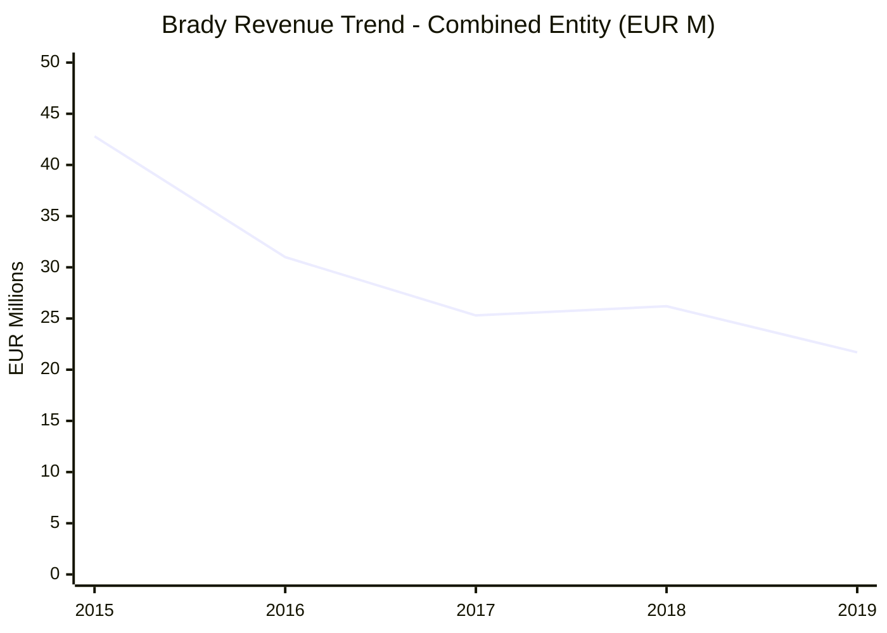
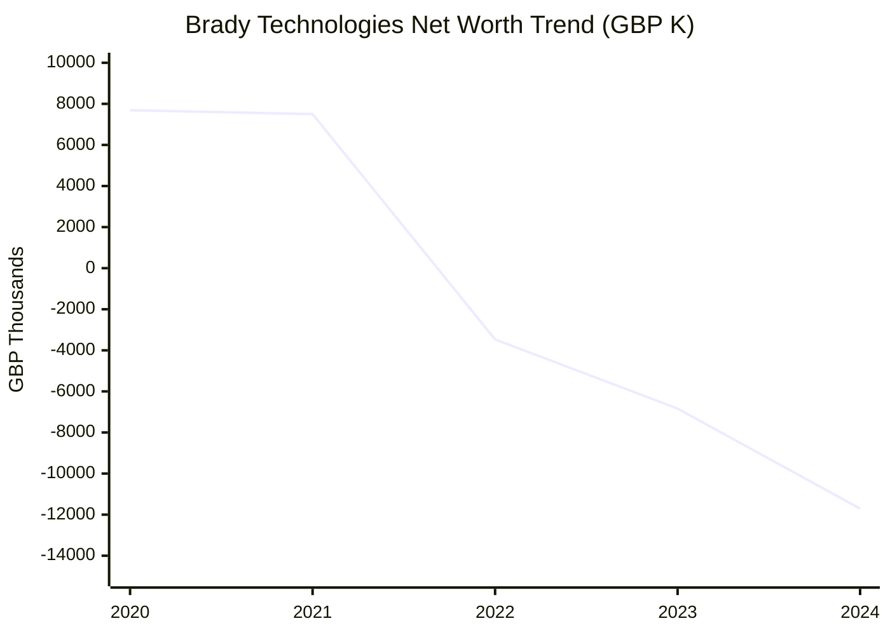
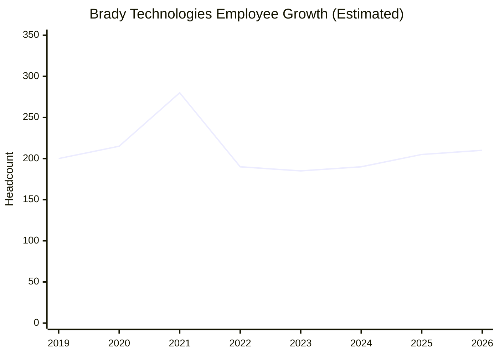
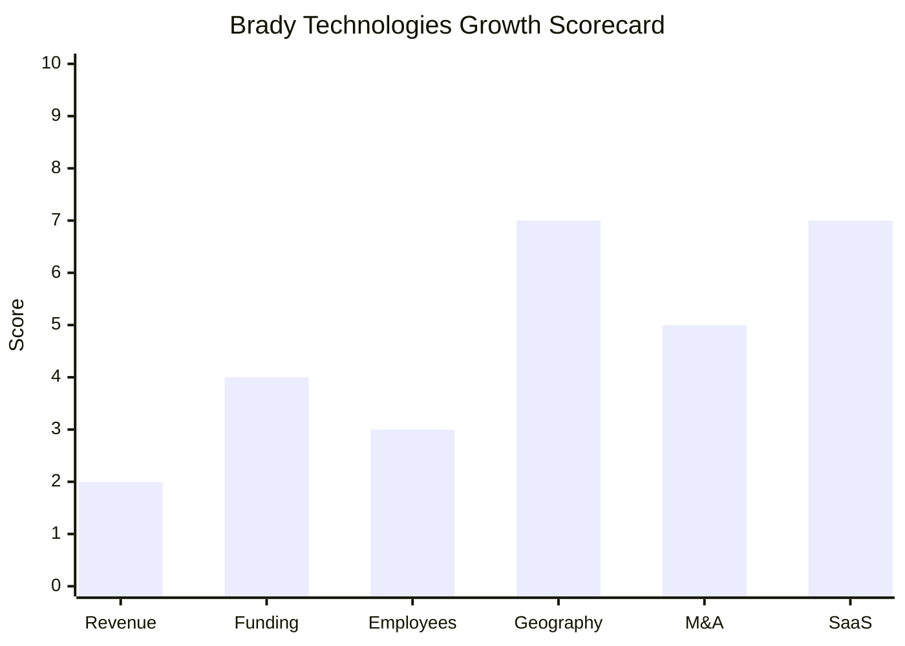

# Financial & Growth Deep-Dive - Brady Technologies

**Research Date**: 2026-02-15 (updated with Companies House 2024 filings and 2025 corporate events)
**Data Availability**: Medium-High (former AIM-listed company with historical public filings 2004-2019; private since Jan 2020 under Hanover Investors PE ownership; Companies House balance sheet data available through Dec 2024; no disclosed turnover post-delisting)

### Revenue Timeline

Brady's revenue history must be read as two distinct eras: the combined commodities + energy entity (2007-2022), and the energy-only company post-divestiture (Jul 2022 onwards). The 2022 commodities divestiture to STG effectively halved the business.

**Era 1: Combined Entity (commodities + energy)**

| Year | Revenue | Currency | EUR Equivalent | YoY Growth | Source | Confidence |
| --- | --- | --- | --- | --- | --- | --- |
| 2015 | GBP 31.0M | GBP | EUR 42.8M | +5% | Proactive Investors; corporate history | Confirmed |
| 2016 | GBP 25.4M | GBP | EUR 31.0M | -18% | Edison Investment Research (financial table) | Confirmed |
| 2017 | GBP 22.2M | GBP | EUR 25.3M | -13% | Edison Investment Research; AIM filings | Confirmed |
| 2018 | GBP 23.2M | GBP | EUR 26.2M | +4% | AIM preliminary results; Edison | Confirmed |
| 2019 | GBP 19.0M | GBP | EUR 21.7M | -18% | Edison forecast (Aug 2019); company guidance | Estimated |
| 2020 | GBP 3.3M | GBP | EUR 3.7M | -83% | MarketScreener (full year ended Dec 31, 2020) | Confirmed (anomalous) |
| 2021 | GBP 12.1M | GBP | EUR 14.0M | +265% | MarketScreener (full year ended Dec 31, 2021) | Confirmed |

*Note on 2020*: The GBP 3.3M figure is anomalous and likely reflects the combined impact of: (1) COVID-19 disruption, (2) post-take-private transition and Hanover restructuring, and (3) possible accounting period adjustments. The GBP 12.05M rebound in 2021 includes revenue from CRisk and Igloo acquired in H2 2021.

**Era 2: Energy-Only Company (post-Jul 2022 divestiture)**

| Year | Revenue | Currency | EUR Equivalent | YoY Growth | Source | Confidence |
| --- | --- | --- | --- | --- | --- | --- |
| 2022 | Unknown | - | - | - | Private; partial year split | Unknown |
| 2023 | Unknown | - | - | - | Private | Unknown |
| 2024 | USD 8.2M | USD | EUR 7.5M | - | RocketReach estimate | Estimated |
| 2025 | Unknown | - | - | - | Private | Unknown |

**Revenue CAGR (combined entity, 2015-2019)**: -11.5% (declining from GBP 31.0M to GBP 19.0M)
**Revenue CAGR (combined entity, 2018-2021)**: -19.5% (GBP 23.2M to GBP 12.1M; heavily distorted by 2020 anomaly)
**Revenue CAGR (energy-only)**: Not calculable (single data point)

#### Revenue Trend Chart

The chart below shows the combined entity revenue through its public AIM era. The post-2019 decline reflects take-private transition, COVID-19, and strategic restructuring before the 2022 divestiture.

### Profitability

| Data Point | Value | Source | Confidence |
| --- | --- | --- | --- |
| EBITDA (2018) | GBP 0.7M (3.0% margin) | Edison Investment Research | Confirmed |
| EBITDA (2017) | GBP -2.6M (-11.9% margin) | Edison Investment Research | Confirmed |
| EBITDA (2016) | GBP 1.9M (7.5% margin) | Edison Investment Research | Confirmed |
| EBITDA (2019e) | GBP -3.9M (-20.6% margin) | Edison Investment Research forecast | Estimated |
| EBITDA (2015) | ~GBP 6.3M (~20% margin) | Proactive Investors | Confirmed |
| Net Profit / Loss (2021) | GBP -0.41M | MarketScreener | Confirmed |
| Net Profit / Loss (2020) | GBP -4.76M | MarketScreener | Confirmed |
| Net Profit / Loss (2018) | GBP -1.8M (after exceptional costs) | AIM filings | Confirmed |
| Recurring Revenue % (2016) | ~60% (H1 2016: recurring + services) | Proactive Investors | Confirmed |
| Recurring Revenue % (2014) | ~51% (GBP 15.85M of GBP 31M) | Proactive Investors | Confirmed |
| Revenue per Employee (2024 est.) | ~EUR 36K (EUR 7.5M / ~210 employees) | Calculated (energy-only) | Estimated |
| Revenue per Employee (2015 peak) | ~EUR 143K-171K (EUR 42.8M / 250-300 employees) | Calculated (combined) | Estimated |

**Profitability Analysis**: Brady has been consistently unprofitable since 2016, with only the 2015 peak era showing strong margins. The Edison data reveals that even "good" years (2018) had near-zero EBITDA. The current energy-only business at ~EUR 7.5M revenue and ~210 employees implies very low revenue per employee (~EUR 36K), well below the software industry average of EUR 150-250K. This suggests either: (a) the RocketReach revenue estimate is significantly understated, (b) Brady is heavily investing in product development at the expense of revenue, or (c) the energy-only business is structurally sub-scale. The PE model likely involves burning through investment capital to build product value for an eventual exit.

### Balance Sheet Data (Companies House -- NEW)

Companies House filings for Brady Technologies Limited (Company 02164768) provide actual audited balance sheet data through December 31, 2024:

| Data Point | 31 Dec 2024 | 31 Dec 2023 | 31 Dec 2022 | 31 Dec 2021 | 31 Dec 2020 | Source |
| --- | --- | --- | --- | --- | --- | --- |
| Cash | GBP 159K | GBP 766K | GBP 672K | GBP 289K | GBP 217K | CompanyCheck / Companies House |
| Net Worth | GBP -11,705K | GBP -6,837K | GBP -3,470K | GBP 7,500K | GBP 7,690K | CompanyCheck / Companies House |
| Total Current Assets | GBP 2,012K | GBP 2,830K | GBP 4,620K | GBP 5,357K | GBP 1,165K | CompanyCheck / Companies House |
| Total Current Liabilities | GBP 22,676K | GBP 19,625K | GBP 18,724K | GBP 10,628K | GBP 6,891K | CompanyCheck / Companies House |

**Balance Sheet Analysis**:

The Companies House data paints a starkly deteriorating financial picture:

1. **Net worth collapse**: From +GBP 7.5M (2021) to -GBP 11.7M (2024), a swing of -GBP 19.2M in three years. This implies cumulative losses of approximately GBP 19M over 2022-2024, consistent with heavy investment in product development (PowerDesk suite, algo trading) and restructuring costs from the commodities divestiture.

2. **Cash burn accelerating**: Cash dropped from GBP 766K (2023) to GBP 159K (2024) -- an 80% decline. Combined with the June 2025 Ashgrove Capital refinancing (see Funding section), this suggests Brady was approaching a liquidity constraint.

3. **Liabilities tripling**: Current liabilities grew from GBP 6.9M (2020) to GBP 22.7M (2024). The sharp jump from GBP 10.6M (2021) to GBP 18.7M (2022) likely reflects intercompany liabilities related to the commodities divestiture and restructuring. The continued growth to GBP 22.7M in 2024 suggests ongoing debt accumulation.

4. **Working capital deeply negative**: Current assets of GBP 2.0M vs current liabilities of GBP 22.7M gives a working capital deficit of GBP -20.7M. This level of negative working capital in a software company typically relies on PE parent support or external lending to continue operations.

### Funding & Investment History

| Date | Round | Amount | Lead Investor(s) | Valuation | Source | Confidence |
| --- | --- | --- | --- | --- | --- | --- |
| 2004 | IPO (AIM) | Unknown | Public market | Unknown | Chartis Research, aimlisting.co.uk | Confirmed |
| Dec 2010 | Share Placing | GBP 15M (at 77p/share) | Public shareholders | ~GBP 64M market cap implied | Proactive Investors | Confirmed |
| Feb 2012 | Share Placing | GBP 18M (at 77p/share) | Public shareholders | ~GBP 64M market cap implied | Proactive Investors | Confirmed |
| Nov 2019 | PE Take-Private | GBP 15M (18p/share) | Hanover Investors (via Fund II) | GBP 15M (171% premium to share price) | Proactive Investors, mergr.com | Confirmed |
| Nov 2019 | Debt Facility | GBP 5M (GBP 3M drawn) | Hanover Investors | N/A | Proactive Investors | Confirmed |
| Jan 2020 | Delisting | N/A | N/A | N/A | Proactive Investors | Confirmed |
| Jun 2025 | **Secured Lending Facility** | **Undisclosed** | **Ashgrove Capital LLP** | **N/A** | **Companies House charge registration (27 Jun 2025)** | **Confirmed** |

**Total Raised (public era)**: ~GBP 33M (GBP 15M + GBP 18M share placings)
**PE Acquisition Value**: GBP 15M (Dec 2019)
**Latest Valuation**: GBP 15M at acquisition; current valuation unclear given -GBP 11.7M net worth but strategic value of PowerDesk platform
**Current Investors**: Hanover Active Equity Fund II S.C.A. SICAV-RAIF (~100% ownership)

**New Lending Facility (June 2025)**: Companies House records show a new charge registered on June 27, 2025, with **Ashgrove Capital LLP** as security agent for secured parties. Ashgrove Capital is a pan-European specialty lender focused on B2B software and services companies (closed Fund II at GBP 650M hard cap). The previous Hanover Investors charges from November 2019 are now marked as SATISFIED, indicating the original PE debt was replaced with this new external facility. This refinancing, combined with the cash position of only GBP 159K at year-end 2024, strongly suggests Brady needed fresh capital to continue operations and product investment.

**War Chest Signals**: Hanover Investors historically achieved >40% IRR; raised GBP 150M toward a GBP 300M Fund III; 18 portfolio companies managed. The Ashgrove refinancing is a significant signal -- it demonstrates that (a) Brady can attract external B2B software lending despite negative net worth, likely based on recurring revenue and product quality; and (b) Hanover may be extending its hold period beyond the typical 5-7 year window (Dec 2019 + 7 = Dec 2026), possibly to allow PowerDesk to gain more market traction before exit.

**Office Co-Location (July 2025)**: Brady Technologies moved its registered office from Centennium House (100 Lower Thames Street, London) to 40 Villiers Street, Charing Cross, London WC2N 6NJ -- which is the Hanover Investors headquarters address. This cost-optimization move signals tighter PE oversight and shared services.

### Employee Timeline

| Year | Headcount | YoY Growth | Source | Confidence |
| --- | --- | --- | --- | --- |
| 2026 (current) | ~210 | +3% | LeadIQ employee directory (Feb 2026) | Estimated |
| 2025 | ~200-210 | +5-10% | LeadIQ, RocketReach | Estimated |
| 2024 | ~181-200 | ~0% | RocketReach, LeadIQ | Estimated |
| 2023 | ~180-190 | - | Estimated (post-divestiture stabilization) | Estimated |
| 2022 (post-divestiture, Jul) | ~180-200 | -25% to -35% | Estimated (commodities staff transferred to STG) | Estimated |
| 2022 (pre-divestiture) | ~260-300 | - | Estimated (includes CRisk/Igloo staff from 2021) | Estimated |
| 2021 (post-acquisitions) | ~260-300 | +15-30% | Estimated (CRisk + Igloo teams added in H2) | Estimated |
| 2020 | ~200-230 | ~0% | Estimated (Hanover transition; AIM era staff) | Estimated |
| 2019 | ~200 | -10% | Brady stated ~200 customers served by ~200 employees | Estimated |
| 2015 (peak era) | ~250-300 | - | Estimated (peak revenue GBP 31M, large integrated company) | Estimated |

**Employee CAGR (3yr, 2022-2025)**: ~5% (slight growth from ~190 to ~210 post-divestiture)
**Current Open Positions**: No open positions found on LinkedIn (Feb 2026); careers page directs to BambooHR portal
**AI/ML/Data Science Roles**: Previously hiring Lead Data Scientists and Principal Software Engineers (2024 postings via Uplers)
**Hiring Hotspots**: London (UK HQ, co-located with Hanover at Villiers Street), Halden/Oslo (Norway, PowerDesk Data Manager origin), US (expanding)
**Key Recent Hires**: Nick King as CEO (Dec 2022); CRO Craig Vintcent (active in public-facing sales role); Giles Smyth (new director, appointed Sep 2025)

**Geographic Distribution (current, Feb 2026)**:

| Location | Employees | % of Total |
| --- | --- | --- |
| United Kingdom | 131 | 62% |
| Norway | 31 | 15% |
| United States | 17 | 8% |
| India | 15 | 7% |
| Switzerland | 8 | 4% |
| Poland | 3 | 1% |
| Denmark | 2 | 1% |
| Finland | 1 | <1% |
| Canada | 2 | 1% |
| Mexico | 1 | <1% |
| **Total** | **~210** | **100%** |

*Source: LeadIQ employee directory, Feb 2026*

#### Employee Growth Chart

### Geographic & Market Expansion

| Year | Expansion Event | Details | Source | Confidence |
| --- | --- | --- | --- | --- |
| 2024-2025 | North America (US) | Established US offices with ~17 employees; entering US power trading market | LeadIQ, bradytechnologies.com | Confirmed |
| 2024-2025 | Canada (Ontario) | Added Ontario market connectivity in PowerDesk Scheduler | bradytechnologies.com product pages | Confirmed |
| 2024-2025 | Western Australia | Added Western Australian market connectivity in PowerDesk | bradytechnologies.com product pages | Confirmed |
| 2024-2025 | Poland, Denmark, Finland | Small presence established (3+2+1 employees) | LeadIQ employee directory | Confirmed |
| 2025 | Brady ETRM 2025.1 | Euronext Nordic & Baltic Power Futures support; Nord Pool API 15-min SDAC; enhanced 15-min market capabilities | LinkedIn, bradytechnologies.com | Confirmed |
| 2023 | GB Power Market | PowerDesk gained second customer trading in GB (Great Britain) power market | ComTech Advisory (CRO interview) | Confirmed |
| 2022-2024 | TSO Expansion | Expanded European TSO connections from existing base to 30+ across Europe | bradytechnologies.com | Confirmed |
| 2022 | Strategic Refocus | Exited metals/commodities markets (divested to STG); concentrated on energy markets | bradytechnologies.com, CTRM Center | Confirmed |

**International Revenue %**: Not disclosed
**Expansion Trajectory**: Brady continues executing intercontinental expansion from its Nordic/European base into North America (US, Ontario) and Australia. The expansion is connectivity-led (adding market/TSO connections and exchange integrations like Euronext) rather than office-led, keeping overhead low. The Brady ETRM 2025.1 release adding Euronext Nordic & Baltic Power Futures shows continued investment in exchange connectivity breadth. Small employee presences in Poland, Denmark, and Finland suggest further European infill beyond core UK and Norway. No signals of NL/Benelux market entry.

### M&A Activity

| Date | Target | Deal Size | Capability Gained | Strategic Rationale | Source | Confidence |
| --- | --- | --- | --- | --- | --- | --- |
| Oct 2021 | Igloo Trading Solutions | Undisclosed | Cloud-native SaaS ETRM for European energy; multi-asset trading, real-time P&L, algo execution | SaaS modernization; replaced legacy platform capabilities with cloud-native architecture | bradytechnologies.com | Confirmed |
| Sep 2021 | CRisk | Undisclosed | Cloud-native enterprise credit and liquidity risk management for energy/commodities | Replaced legacy EnergyCredit with modern cloud platform; deepened risk management offering | bradytechnologies.com | Confirmed |
| Jul 2022 | **Divestiture**: Commodities business to STG | Undisclosed | N/A (divested metals CTRM: Fintrade, Trinity products, IP, employees, customers) | Strategic refocus on energy-only; shed non-core commodities to concentrate resources on PowerDesk and energy growth | bradytechnologies.com, CTRM Center | Confirmed |

**Earlier Acquisitions (pre-2021)**:
- EnergyCredit from Temenos (Jan 2016, undisclosed): Energy credit risk
- syseca AG, Switzerland (Feb 2012, ~GBP 1.2M): TSO connectivity + scheduling
- Navita Systems, Norway (Feb 2012, ~GBP 17.1M): Physical power + carbon trading
- Viz Risk Management, Norway (Dec 2010, ~GBP 9.6M): European energy ETRM entry
- Viveo Switzerland from Temenos (Mar 2010, undisclosed): Soft commodities, oil
- Comsoft, UK (2009, undisclosed): Metals trading technology

**Divestitures**: Commodities business to STG (Jul 2022, undisclosed price)
**M&A Pattern**: Brady's M&A history shows three distinct phases: (1) aggressive cross-commodity expansion via AIM-funded acquisitions (2009-2012), (2) targeted capability bolt-ons (2016), and (3) PE-era SaaS modernization acquisitions + strategic divestiture (2021-2022). The current phase is post-M&A consolidation and organic growth. No new acquisitions since 2021. The Ashgrove Capital refinancing (Jun 2025) and co-location with Hanover suggest the PE hold period may be extended, pushing any exit or next M&A event to 2027+.

### SaaS Transition Metrics

| Data Point | Value | Source | Confidence |
| --- | --- | --- | --- |
| Deployment Model | Hybrid: SaaS-first (PowerDesk, Igloo, CRisk) + on-premise legacy (Brady ETRM) | bradytechnologies.com | Confirmed |
| Cloud Revenue % (current) | Not disclosed; PowerDesk, Igloo, CRisk all SaaS/cloud | bradytechnologies.com | Unknown |
| Cloud Revenue % (2015) | ~30% of new licenses delivered via cloud | Proactive Investors | Confirmed |
| Recurring Revenue % (2016) | ~60% (H1 2016: recurring + services as % of total sales) | Proactive Investors | Confirmed |
| Recurring Revenue % (2014) | ~51% (GBP 15.85M of GBP 31M total) | Proactive Investors | Confirmed |
| Recurring Revenue % (current) | Estimated 65-80% (all new products are SaaS; Brady ETRM legacy has recurring maintenance) | Inferred from product model | Estimated |
| Platform Stack | Python (PowerDesk Edge algo libraries); cloud-based SaaS architecture; web dashboards | bradytechnologies.com, job postings | Confirmed |
| Migration Status | In progress: new products (PowerDesk, Igloo, CRisk) are cloud-native; legacy Brady ETRM remains on-premise for existing customers with continued active development (2025.1 release); no disclosed timeline for full migration | bradytechnologies.com | Estimated |
| Customer Churn / Retention | Not disclosed; long-tenure customer relationships (Å Energi/Agder Energi 20+ years, SKS 25+ years) suggest strong retention | bradytechnologies.com press releases | Estimated |
| Named Customers (current) | bp, Å Energi (formerly Agder Energi), Salten Kraftsamband (SKS), Falck Renewables/Nadara, plus unnamed "one of the Nordic region's largest utilities" | bradytechnologies.com | Confirmed |

**SaaS Transition Analysis**: Brady executed a two-pronged SaaS strategy: (1) build new products as cloud-native from inception (PowerDesk suite since 2020), and (2) acquire cloud-native platforms (Igloo 2021, CRisk 2021) rather than migrate the legacy Brady ETRM codebase. Notably, the legacy Brady ETRM is still receiving active investment -- the 2025.1 release added Euronext Nordic & Baltic Power Futures and 15-minute SDAC support, suggesting the legacy platform still generates significant revenue from existing customers. This "build + acquire new, maintain old" approach avoids the pain of legacy migration while gradually shifting revenue toward SaaS. Brady operates two technology stacks simultaneously with ~210 employees.

**PowerDesk Edge AI/Algo Update (2025-2026)**: The PowerDesk Edge algorithmic trading platform expanded significantly in 2025 with: (a) October 2025 "Playbooks" publication providing step-by-step implementation guides for different user personas (independent asset owners to utility trading desks); (b) planned release to make the platform more accessible beyond larger firms with dedicated IT teams; (c) continued investment in Python-based algo libraries with ML capabilities for grid signal detection. Brady's AI investment remains focused on PowerDesk Edge as a differentiated trading product.

### Growth Scorecard

| Dimension | Score (1-10) | Evidence Summary |
| --- | --- | --- |
| Revenue Growth | 2 | Revenue declined from GBP 31M (2015 peak) to est. USD 8.2M energy-only (2024); net worth deteriorated by GBP 19M over 2022-2024; no disclosed growth in energy-only segment |
| Funding Momentum | 4 | PE-backed (Hanover Fund II, GBP 15M take-private 2019); new Ashgrove Capital debt facility (Jun 2025) demonstrates ability to attract B2B software lending despite negative net worth; no new equity rounds |
| Employee Growth | 3 | Slight growth from ~190 to ~210 over 2022-2026 (CAGR ~5%); stabilized after post-divestiture contraction; zero open LinkedIn positions in Feb 2026 dampens signal |
| Geographic Expansion | 7 | Entered North America (US offices, ~17 employees), Canada (Ontario), and Western Australia in last 2-3 years; small presences added in Poland, Denmark, Finland; Brady ETRM 2025.1 added Euronext exchange connectivity |
| M&A Activity | 5 | 2 cloud-native acquisitions (CRisk, Igloo in 2021) + strategic commodities divestiture (2022); no M&A activity since 2022; consolidation phase |
| SaaS Maturity | 7 | SaaS-first strategy since 2020; PowerDesk, Igloo, CRisk all cloud-native; estimated 65-80% recurring revenue; legacy ETRM still actively developed (2025.1 release); PowerDesk Edge algo trading expanding |
| **COMPOSITE SCORE** | **4.7** | **Steady -- stable strategic positioning offset by deteriorating financials and flat growth** |

**Classification**: **Steady** (avg 3.0-4.9)

Brady Technologies continues to occupy a paradoxical position: its strategic moves (SaaS pivot, geographic expansion, algo trading investment, exchange connectivity) are textbook PE transformation plays, but the financial fundamentals from Companies House filings are now confirmed as deteriorating -- net worth swung from +GBP 7.5M to -GBP 11.7M over 2021-2024, cash fell to GBP 159K, and current liabilities tripled to GBP 22.7M. The Ashgrove Capital refinancing in June 2025 was likely essential to sustain operations. The composite 4.7 places Brady at the upper boundary of "Steady", on the cusp of "Riser" -- but the balance sheet data argues against upgrading until revenue growth is demonstrated.

#### Growth Scorecard Radar

> The scorecard reveals Brady's dual nature: strong strategic positioning (SaaS: 7, Geography: 7) offset by weak financial fundamentals (Revenue: 2, Employees: 3, Funding: 4). The M&A score dropped from 6 to 5 reflecting the 3+ year gap since last acquisition and the shift into consolidation mode. The "strategy-rich, revenue-poor" profile is now confirmed by Companies House balance sheet data showing a company burning through capital to build product value.

### Eneve Strategic Implications

**Dinosaur or Rocket?**: Neither -- Brady is a **Phoenix under financial stress** attempting to rise from its own ashes but running low on fuel. The old Brady (GBP 31M metals + energy CTRM) declined and was broken up. The new Brady (est. EUR 7.5M energy-only SaaS) is strategically sound but financially deteriorating, requiring external lending (Ashgrove Capital) to sustain operations.

**What the updated financials reveal for Eneve**:

1. **Brady is financially weakened**: Companies House data confirms net worth of -GBP 11.7M and cash of only GBP 159K at end of 2024. The Ashgrove Capital refinancing (Jun 2025) bought time but signals liquidity stress. Brady cannot outspend or outstaff Eneve from this position.

2. **PE exit clock has been reset**: The Jun 2025 Ashgrove refinancing, Jul 2025 office move to Hanover HQ, and Sep 2025 new director appointment suggest Hanover is **extending its hold period** rather than imminently exiting. The typical 5-7 year hold (Dec 2019 + 7 = Dec 2026) is now likely being pushed to 2027-2028, giving Brady more runway to demonstrate SaaS revenue growth before exit.

3. **Product investment continues despite financial stress**: Brady ETRM 2025.1 (Euronext, Nord Pool 15-min), PowerDesk Edge Playbooks (Oct 2025), E-world 2026 presence, and continued algo trading R&D show the company is prioritizing product development. The Ashgrove Capital facility exists precisely to fund this product investment phase.

4. **Customer wins are real but small**: bp, Å Energi, SKS, Falck Renewables/Nadara are genuine enterprise customers. The CRO cited 7 new customers in 2024. PowerDesk is winning deals, but at ~EUR 7.5M total revenue, the average deal size is modest.

5. **NL market entry remains unlikely**: No EDSN protocol support, no NL-specific regulatory knowledge, no NL hiring signals, no Dutch customers. Geographic expansion targets North America, Australia, and Nordic infill -- not Benelux.

6. **Revised risk scenario**: The highest-risk scenario for Eneve is no longer a Brady PE exit to a well-capitalized buyer (timing pushed back). Instead, the risk is:
   - **Acquisition by consolidator**: If Brady's financial stress forces a sale at a discount, a larger player (e.g., Volue, ION, or a platform-building PE firm) could acquire PowerDesk's technology and customer base cheaply and inject capital for acceleration.
   - **Ashgrove Capital conversion**: If Brady cannot service the Ashgrove debt, the lender (specializing in B2B software) could facilitate a restructuring or sale, potentially to another software platform.
   - **Successful turnaround**: If the 2025-2026 product investments generate revenue growth, Brady could enter 2027 as a stronger, profitable SaaS company with proven algo trading capabilities -- making it a more formidable competitor if it then expands into additional markets.

---

**EUR Conversion Rates Used**: Annual averages (approximate): 2015: 1 GBP = 1.38 EUR; 2016: 1 GBP = 1.22 EUR; 2017: 1 GBP = 1.14 EUR; 2018: 1 GBP = 1.13 EUR; 2019: 1 GBP = 1.14 EUR; 2020: 1 GBP = 1.12 EUR; 2021: 1 GBP = 1.16 EUR; 2024: 1 USD = 0.92 EUR. Sources: ECB historical rates (approximate).
