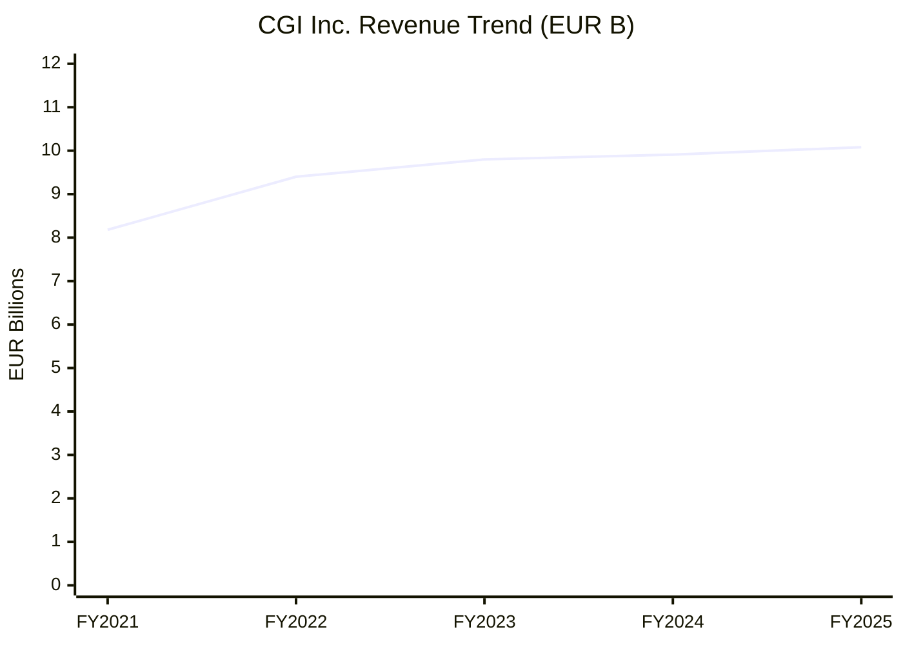
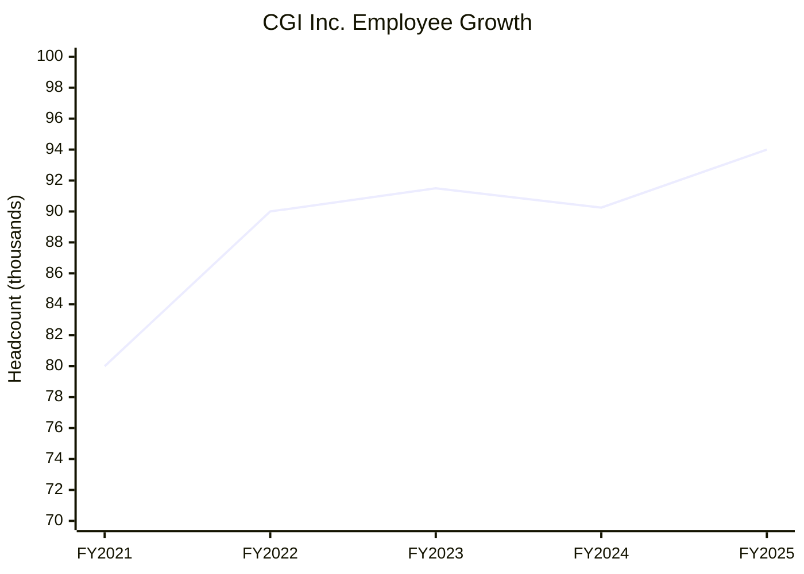
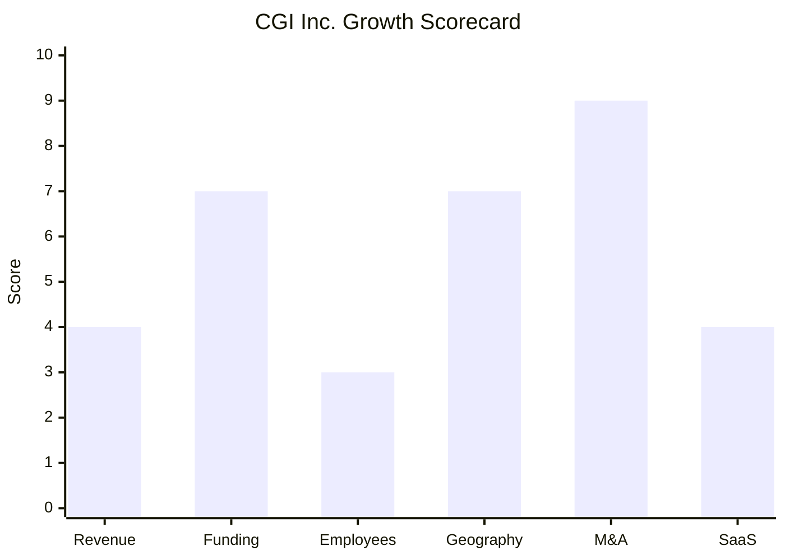

# Financial & Growth Deep-Dive - CGI Inc.

**Research Date**: 2026-02-15
**Data Availability**: High (CGI is publicly traded on TSX: GIB.A and NYSE: GIB with full annual report disclosure)

### Revenue Timeline

CGI's fiscal year ends September 30. All figures in CAD; EUR converted at annual average CAD/EUR rates from Bank of Canada.

| Year | Revenue | Currency | EUR Equivalent | YoY Growth | Source | Confidence |
| --- | --- | --- | --- | --- | --- | --- |
| FY2026 (Q1 annualized) | ~CAD 16.3B | CAD | ~EUR 10.3B | ~7.7% | Q1 FY2026 press release (annualized) | Estimated |
| FY2025 (ended Sep 2025) | CAD 15.91B | CAD | EUR 10.08B | +8.4% | CGI Q4 FY2025 press release | Confirmed |
| FY2024 (ended Sep 2024) | CAD 14.68B | CAD | EUR 9.91B | +2.7% | CGI Q4 FY2024 press release | Confirmed |
| FY2023 (ended Sep 2023) | CAD 14.30B | CAD | EUR 9.80B | +11.1% | CGI Q4 FY2023 press release | Confirmed |
| FY2022 (ended Sep 2022) | CAD 12.87B | CAD | EUR 9.40B | +6.1% | CGI Q4 FY2022 press release | Confirmed |
| FY2021 (ended Sep 2021) | CAD 12.13B | CAD | EUR 8.18B | +1.1% (cc) | CGI Q4 FY2021 press release | Confirmed |

**EUR Conversion Rates Used** (Bank of Canada annual averages, CAD per EUR):
2021: 1.4828 | 2022: 1.3696 | 2023: 1.4597 | 2024: 1.4818 | 2025: 1.5782

**Revenue CAGR (3yr, FY2022-FY2025)**: 7.3%
**Revenue CAGR (4yr, FY2021-FY2025)**: 7.0%

#### Revenue Trend Chart

### Profitability

| Data Point | Value | Source | Confidence |
| --- | --- | --- | --- |
| Adjusted EBIT (FY2025) | CAD 2,610.9M (EUR ~1,654M) | Q4 FY2025 press release | Confirmed |
| Adjusted EBIT Margin (FY2025) | 16.4% | Q4 FY2025 press release | Confirmed |
| Adjusted EBIT Margin (FY2024) | 16.5% | Q4 FY2024 press release | Confirmed |
| Adjusted EBIT Margin (FY2023) | 16.2% | Q4 FY2023 press release | Confirmed |
| Adjusted EBIT Margin (FY2022) | 16.2% | Q4 FY2022 press release | Confirmed |
| Net Earnings (FY2025) | CAD 1,658.3M (10.4% margin) | Q4 FY2025 press release | Confirmed |
| Adjusted Net Earnings (FY2025) | CAD 1,871.5M (11.8% margin) | Q4 FY2025 press release | Confirmed |
| Net Earnings (FY2024) | CAD 1,690M (11.5% margin) | Q4 FY2024 press release | Confirmed |
| Net Earnings (FY2023) | CAD 1,630M (~11.4% margin) | Q4 FY2023 press release | Confirmed |
| Net Earnings (FY2022) | CAD 1,470M (11.4% margin) | Q4 FY2022 press release | Confirmed |
| Adjusted Diluted EPS (FY2025) | CAD 8.30 (+8.9% YoY) | Q4 FY2025 press release | Confirmed |
| Cash from Operations (FY2025) | CAD 2,234.2M (14.0% of revenue) | Q4 FY2025 press release | Confirmed |
| Cash from Operations (Q1 FY2026) | CAD 871.9M (21.4% of revenue) -- record | Q1 FY2026 press release | Confirmed |
| Recurring Revenue % | Not separately disclosed; managed services ~45% of revenue | CGI annual reports | Estimated |
| SaaS Revenue % | N/A -- CGI is a services company, not a SaaS vendor | N/A | Confirmed |
| Revenue per Employee (FY2025) | CAD 169K / EUR ~107K | Calculated: 15.91B / 94,000 | Calculated |

### Funding & Investment History

CGI is a mature public company that has been listed since 1986. It does not raise venture capital or PE rounds -- it self-funds growth through highly profitable operations and selective debt.

| Date | Round | Amount | Lead Investor(s) | Valuation | Source | Confidence |
| --- | --- | --- | --- | --- | --- | --- |
| 1986 | IPO (TSX) | N/A | Public markets | N/A | CGI corporate history | Confirmed |
| 1998 | NYSE listing | N/A | Public markets | N/A | CGI corporate history | Confirmed |
| Ongoing | Operations + debt | CAD 2.2B+ cash from ops annually | Self-funded | Market cap: ~USD 27.5B (Feb 2026) | CGI annual reports | Confirmed |

**Total Raised**: N/A (public company since 1986; self-funded through CAD 2.2B+ annual operating cash flow)
**Latest Valuation**: ~USD 27.5 billion market cap (February 2026)
**Current Investors**: Public shareholders (TSX: GIB.A, NYSE: GIB). Godin family (founders) retain significant influence as Executive Chair (Julie Godin) and Co-Chair (Serge Godin).
**War Chest Signals**: Record cash from operations (CAD 871.9M in Q1 FY2026 alone). CAD 31.3B backlog (1.9x annual revenue). $1B AI investment committed through 2026. Active acquisition pace (6+ deals in FY2025). 13% dividend increase announced FY2025.

### Employee Timeline

| Year | Headcount | YoY Growth | Source | Confidence |
| --- | --- | --- | --- | --- |
| 2025 (current, FY2025) | 94,000 | +4.2% | CGI FY2025 annual report | Confirmed |
| 2024 (FY2024) | 90,250 | -1.4% | CGI FY2024 annual report | Confirmed |
| 2023 (FY2023) | 91,500 | +1.7% | CGI FY2023 annual report | Confirmed |
| 2022 (FY2022) | 90,000 | +12.5% | CGI FY2022 annual report | Confirmed |
| 2021 (FY2021) | 80,000 | N/A | CGI FY2021 annual report | Confirmed |

**Employee CAGR (3yr, FY2022-FY2025)**: 1.5%
**Employee CAGR (4yr, FY2021-FY2025)**: 4.1%
**Current Open Positions**: Actively hiring across 400+ offices in 40+ countries. Dedicated AI/ML/Data Science recruitment pipeline. Energy-specific role count not separately disclosed.
**Hiring Hotspots**: US metro markets (post-Daugherty expansion), UK (post-BJSS: 8,500+ UK employees), France (post-Apside), Poland (post-Comarch agreement)

#### Employee Growth Chart

### Geographic & Market Expansion

| Year | Expansion Event | Details | Source | Confidence |
| --- | --- | --- | --- | --- |
| 2025-2026 | Comarch acquisition (Poland) | Agreement Oct 2025; adds Polish IT services capability | CGI press release | Confirmed |
| 2025 | BJSS acquisition (UK) | 2,400 professionals; UK workforce now 8,500+ | CGI press release | Confirmed |
| 2025 | Apside acquisition (France) | Digital and engineering services leader in France | CGI press release | Confirmed |
| 2025 | Online Business Systems (Canada) | Winnipeg-based IT consulting | CGI press release | Confirmed |
| 2024 | Daugherty acquisition (US) | 1,100+ consultants across St. Louis, Atlanta, Minneapolis, Chicago, Columbus, Dallas, NYC | CGI press release | Confirmed |
| 2023 | Poland CSIRE contract | CAD 97M to build Central Energy Market Information System for PSE | CGI press release | Confirmed |
| 2023 | Finland Datahub 2.0 upgrades | Energy communities support, 15-minute settlement added | CGI/Fingrid press release | Confirmed |
| 2022 | Umanis acquisition (France) | EUR 310M; 2,500+ employees; data/digital solutions | CGI press release | Confirmed |
| 2022 | Finland Datahub launch | Full launch Feb 2022; 3.8M electricity points, 80 DSOs, 80 suppliers | CGI/Fingrid press release | Confirmed |

**International Revenue %**: Not separately disclosed by geography in detail; CGI operates in 40+ countries across North America, Europe, and Asia-Pacific
**Expansion Trajectory**: CGI expands primarily through acquisitions rather than greenfield offices. Energy datahub expansion follows government tender wins (Poland CSIRE, Finland Datahub). FY2025 saw the most aggressive acquisition pace in recent years, with 6+ deals adding capabilities in UK, France, US, Poland, and Canada.

### M&A Activity

| Date | Target | Deal Size | Capability Gained | Strategic Rationale | Source | Confidence |
| --- | --- | --- | --- | --- | --- | --- |
| Feb 2026 | Stratfield Consulting | Undisclosed | Atlanta-based consulting | US metro market expansion | CGI press release | Confirmed |
| Jan 2026 | Comarch Polska SA | Undisclosed | Polish IT services, energy sector | Eastern European expansion | CGI press release | Confirmed |
| Dec 2025 | Online Business Systems | Undisclosed | Winnipeg IT consulting | Canadian market fill-in | CGI press release | Confirmed |
| Aug 2025 | Apside | Undisclosed | French digital/engineering services | Western European depth | CGI press release | Confirmed |
| Feb 2025 | BJSS | Undisclosed | UK tech consultancy, 2,400 people | UK presence (8,500+ total) | CGI press release | Confirmed |
| Dec 2024 | Daugherty | Undisclosed | US multi-city IT consulting, 1,100+ people | US metro market expansion | CGI press release | Confirmed |
| Oct 2023 | Momentum Consulting Corp | Undisclosed | Miami-based IT/business consulting | US expansion | CGI press release | Confirmed |
| May 2022 | Umanis | ~EUR 310M | French data/digital/business, 2,500+ people, EUR 246M revenue | French market dominance | CGI press release | Confirmed |
| Apr 2022 | Harwell Management | Undisclosed | French management consulting | French services depth | CGI press release | Confirmed |

**Divestitures**: None identified in the 2021-2025 period
**M&A Pattern**: Aggressive geographic consolidation through acquisition of mid-size IT services firms. CGI has completed 105+ mergers since 1986. The pattern is clear: acquire profitable consulting/services firms in target geographies (US, UK, France, Poland) to build local density. Most deal sizes are undisclosed (typical CGI pattern for mid-size tuck-in acquisitions). Umanis at EUR 310M was the largest disclosed deal in this period. FY2025 represented peak acquisition pace with 6+ deals.

### SaaS Transition Metrics

| Data Point | Value | Source | Confidence |
| --- | --- | --- | --- |
| Deployment Model | Services company (consulting + managed services); energy datahubs are cloud-based | CGI annual reports | Confirmed |
| Cloud Revenue % (current) | Not separately disclosed | CGI annual reports | Unknown |
| Managed Services % | ~45% of revenue (managed services); ~55% consulting/integration | Industry estimates, CGI reporting patterns | Estimated |
| Managed Services Growth | 117% book-to-bill (Q1 FY2026) -- strongest segment | Q1 FY2026 press release | Confirmed |
| Recurring Revenue % | Not separately disclosed; managed services contracts are multi-year with recurring characteristics | CGI annual reports | Estimated |
| Platform Stack (energy) | AWS, Kafka streaming, Kappa architecture (EDSN); Hansen GENERIS base (C-ARM) | Xomnia/EDSN case study, CGI case study | Confirmed |
| Migration Status | N/A -- CGI is not migrating from on-prem to SaaS; it builds cloud solutions for clients while operating as a services company | N/A | Confirmed |

### Growth Scorecard

| Dimension | Score (1-10) | Evidence Summary |
| --- | --- | --- |
| Revenue Growth | 4 | 3yr CAGR 7.3% (CAD 12.87B to 15.91B); solid for a CAD 16B company but below 10% threshold |
| Funding Momentum | 7 | Self-funded with CAD 2.2B+ annual cash generation; $1B AI investment; record CAD 872M Q1 cash; active acquirer |
| Employee Growth | 3 | 3yr CAGR 1.5%; headcount stable at ~90-94K; growth primarily acquisitive, not organic |
| Geographic Expansion | 7 | Energy datahubs in 10 countries; Poland CSIRE (new); 6+ acquisitions adding UK/France/US/Poland in 2024-2025 |
| M&A Activity | 9 | 6+ acquisitions in FY2025 alone; Umanis EUR 310M; BJSS 2,400 people; 105+ total since IPO; active consolidator |
| SaaS Maturity | 4 | Services company (~45% managed services); energy datahubs cloud-native but overall model is consulting/services, not SaaS |
| **COMPOSITE SCORE** | **5.7** | **Classification: Riser** |

**Classification Thresholds**:

- **Rocket** (avg 7.0-10.0): Explosive growth, heavy investment, market disruptor
- **Riser** (avg 5.0-6.9): Strong growth signals, investing in future, accelerating
- **Steady** (avg 3.0-4.9): Stable but not transforming, evolutionary
- **Dinosaur** (avg 1.0-2.9): Flat or declining, legacy mode, no visible investment

#### Growth Scorecard Radar

> The scorecard reveals CGI's distinctive profile: a **mega-cap acquirer** with massive financial firepower (funding 7, M&A 9, geography 7) but moderate organic growth metrics (revenue 4, employees 3, SaaS 4). CGI grows primarily by acquiring companies and geographies, not by organic revenue acceleration or SaaS transformation. For Eneve, the threat is not CGI competing as a product vendor -- it's CGI's energy datahub empire expanding downstream from market infrastructure into participant-level operations, backed by a war chest that dwarfs the entire energy software vendor landscape.

### Eneve Strategic Context

**CGI vs Eneve -- the asymmetry**: CGI's CAD 15.91B revenue is roughly **300x Eneve's estimated scale**. CGI's Q1 FY2026 cash generation alone (CAD 872M) exceeds the annual revenue of every energy-specific software competitor in the landscape combined. This is not a competitor to outspend -- it's an ecosystem partner to stay ahead of.

**Key risk metric**: CGI's managed services book-to-bill of 117% signals accelerating demand for outsourced energy IT operations. If EDSN or other datahub clients push for more functionality within the managed service boundary (e.g., participant-level settlement, portfolio management), CGI has the capacity to build it. The $1B AI investment and OpenAI partnership (Jan 2026) provide the technology backbone. The Poland CSIRE contract (CAD 97M) shows CGI continues to win new national energy infrastructure mandates.

**The protection**: CGI's business model is infrastructure operation, not participant software. Expanding downstream would mean competing with their own clients' tool vendors -- a strategic tension that has historically kept CGI at the market infrastructure layer. Eneve's best defense is ensuring eBase remains the indispensable participant-level complement to C-ARM, not a layer that C-ARM could absorb.
