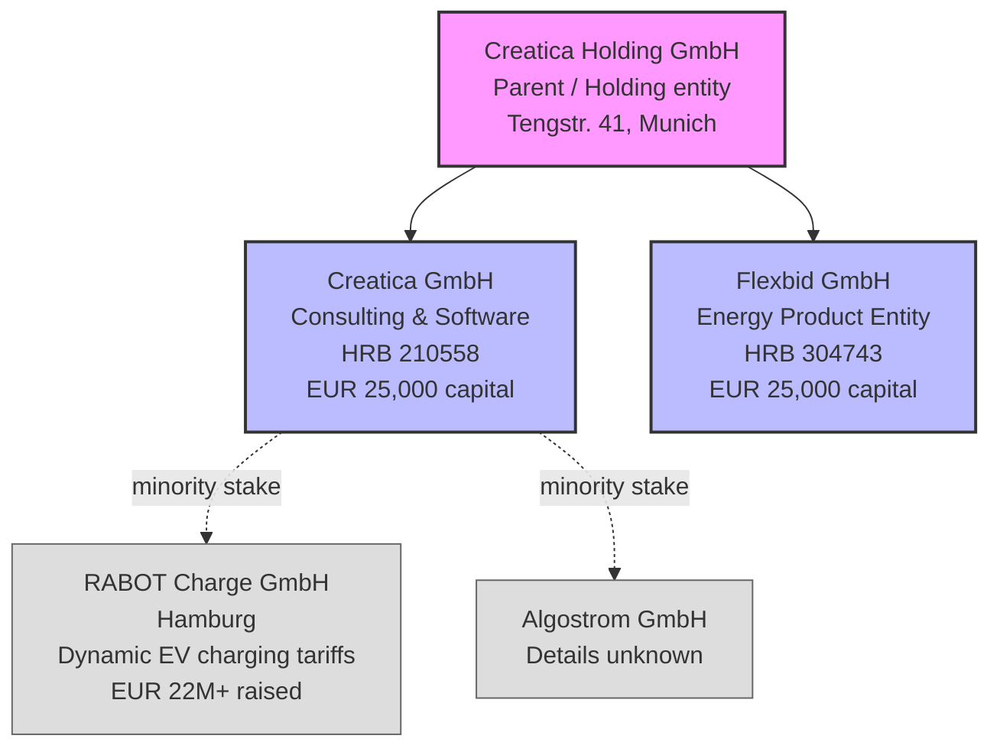
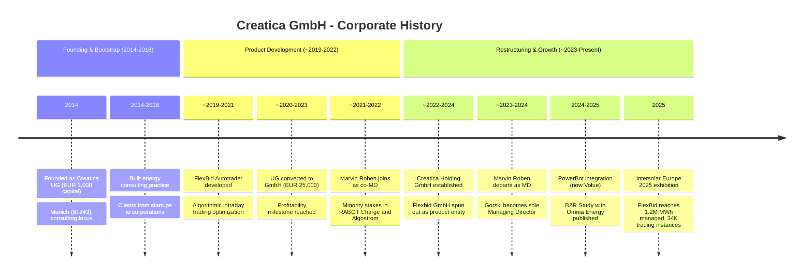
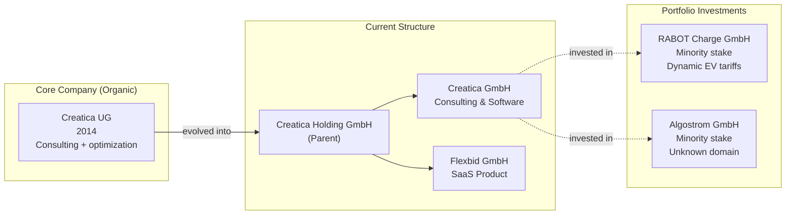

# Corporate History - Creatica GmbH

**Research Date**: 2026-02-16
**Genealogy Confidence**: Medium (private company, limited public financial data; strong corporate registry data from NorthData/Handelsregister)

---

### Current Ownership & Key Parties

| Stakeholder | Role | Stake % | Type | Since | Source |
|---|---|---|---|---|---|
| Vadim Gorski | Managing Director / Co-founder | 50% (of Creatica GmbH) | Founder | 2014 | NorthData HRB 210558 |
| Unknown second shareholder(s) | Shareholder(s) | 50% | Unknown | Unknown | NorthData (shareholder list published but details behind paywall) |
| Creatica Holding GmbH | Parent company | Unknown (holds Creatica GmbH + Flexbid GmbH) | Holding | Est. ~2022-2024 | NorthData (Flexbid registered c/o Creatica Holding GmbH) |

**Board / Management**:

| Name | Role | Represents | Background | Source |
|---|---|---|---|---|
| Dr. Vadim Gorski | Managing Director (sole) | Founder / Shareholder | Energy markets, mathematical optimization, PhD (field unknown) | NorthData, Intersolar, creatica.de |
| Marvin Roben | Former Co-Managing Director | Co-founder (no longer MD) | Energy consulting, co-author BZR Study | NorthData (departure recorded) |
| Enrico Groz | Key team member / Author | Employee or associate | BZR Study co-author | creatica.de/bzr-study-germany |

**Corporate Structure** (Mermaid diagram):



**Notable**: Creatica GmbH appears in the shareholder lists ("Liste der Gesellschafter") of both RABOT Charge GmbH and Algostrom GmbH per NorthData. This signals a portfolio investment strategy through the holding structure, placing minority stakes in adjacent energy startups.

---

### Origin Story

| Data Point | Value | Source | Confidence |
|---|---|---|---|
| Founded | February 6, 2014 (partnership agreement); registered March 5, 2014 | NorthData HRB 210558, registration publication | Confirmed |
| Original Name | Creatica UG (haftungsbeschrankt) | NorthData registration record | Confirmed |
| Founders | Vadim Gorski (+ at least one other, name redacted in free NorthData) | NorthData (initial MD appointment) | Confirmed (Gorski); Estimated (co-founder) |
| Original Address | 81243 Munich, Germany (different from current Tengstr. 41) | NorthData registration record | Confirmed |
| Original Mission | "Beratung von anderen Gesellschaften oder Privatpersonen, sowie Entwicklung und Vertrieb von eigenen Produkten" (Consulting for other companies or private persons, as well as development and distribution of own products) | NorthData corporate purpose | Confirmed |
| Original Product | Consulting services in energy markets, optimization, and IT | creatica.de, business model inference | Estimated |
| Initial Capital | EUR 1,000 (UG minimum) | NorthData registration | Confirmed |
| First Market | Germany, energy sector | creatica.de | Confirmed |

**Origin narrative**: Creatica was founded in early 2014 as a UG (haftungsbeschrankt) -- Germany's micro-company format requiring only EUR 1 capital. This indicates a bootstrapped start with no external funding at inception. The corporate purpose was deliberately broad: consulting and product development. The initial address (81243 Munich, Aubing-Lochhausen area) suggests a home-office or small-office start rather than a commercial Munich city center location. The company was co-founded by Vadim Gorski (later Dr. Vadim Gorski) alongside at least one other person (identity redacted in public records). Marvin Roben was appointed as co-Managing Director at a later stage.

---

### Corporate Identity Changes

| # | Date | From | To | Reason | Source |
|---|---|---|---|---|---|
| 1 | 2014-02-06 | (new entity) | Creatica UG (haftungsbeschrankt) | Initial incorporation as micro-company | NorthData HRB 210558 |
| 2 | Est. ~2020-2023 | Creatica UG | Creatica GmbH | Capital increase from EUR 1,000 to EUR 25,000; conversion to full GmbH | NorthData (capital and name change publication) |
| 3 | Est. ~2022-2024 | (no holding) | Creatica Holding GmbH created | Corporate restructuring; holding company established to own Creatica GmbH and Flexbid GmbH | NorthData (Flexbid registered c/o Creatica Holding) |

**UG to GmbH conversion**: In Germany, a UG (haftungsbeschrankt) is a "mini-GmbH" that can be formed with as little as EUR 1 capital. The UG must retain 25% of annual profits until EUR 25,000 is accumulated, at which point it can convert to a full GmbH. Creatica's conversion from UG (EUR 1,000) to GmbH (EUR 25,000) signals the company reached sufficient profitability to accumulate the required capital -- a milestone indicating sustainable revenue generation from consulting and/or software.

---

### Mergers & Acquisitions Timeline

#### Acquisitions Made (as buyer)

| Date | Target Company | Deal Value | What Was Gained | Integration Outcome | Source |
|---|---|---|---|---|---|
| (none known) | -- | -- | -- | -- | Web search |

#### Acquired By (as target)

| Date | Acquiring Company | Deal Value | Strategic Rationale | Source |
|---|---|---|---|---|
| (none known) | -- | -- | -- | Web search |

#### Minority Investment Stakes Held

| Date | Target Company | Stake Size | What Was Gained | Source |
|---|---|---|---|---|
| Unknown | RABOT Charge GmbH (Hamburg) | Minority (unknown %) | Exposure to dynamic EV charging tariffs / energy retail innovation | NorthData shareholder list mention |
| Unknown | Algostrom GmbH | Minority (unknown %) | Unknown (company details not publicly available) | NorthData shareholder list mention |

**M&A assessment**: Creatica has not made any acquisitions or been acquired. Instead, the company pursues a **portfolio investment strategy** -- holding minority stakes in adjacent energy startups through its holding structure. This is unusual for a boutique company of this size and suggests the founders have an investment/incubation mindset alongside their consulting and product business.

---

### Investment & Financial Events

| Date | Event Type | Details | Investors/Counterparty | Investor Type | Amount | Source |
|---|---|---|---|---|---|---|
| 2014-02-06 | Incorporation | Founded as Creatica UG with minimum capital | Founders (bootstrapped) | Self-funded | EUR 1,000 | NorthData |
| Est. ~2020-2023 | Capital Increase | Conversion from UG to GmbH | Internal (retained earnings) | Self-funded | EUR 25,000 (total capital) | NorthData |
| Est. ~2022-2024 | Corporate Restructuring | Creation of Creatica Holding GmbH as parent; Flexbid GmbH spun out as separate product entity | Internal | Self-funded | EUR 25,000 (Flexbid capital) | NorthData |
| Unknown | Minority Investment | Stake in RABOT Charge GmbH | Creatica as investor | Strategic | Unknown | NorthData |
| Unknown | Minority Investment | Stake in Algostrom GmbH | Creatica as investor | Strategic | Unknown | NorthData |

**Financial assessment**: No external funding rounds have been identified for Creatica itself. No Crunchbase profile exists. No VC, PE, or government funding announcements found. The company appears to be entirely **self-funded through consulting revenue**, which funded both the product development (FlexBid) and the corporate restructuring into a holding model. The ability to make minority investments in other startups (RABOT Charge raised EUR 22M+) suggests Creatica generates meaningful consulting/SaaS revenue despite its small size.

---

### Splits, Spin-offs & Divestitures

| Date | Event Type | What Was Separated | Destination / Buyer | Reason | Source |
|---|---|---|---|---|---|
| Est. ~2022-2024 | Spin-out | FlexBid product separated into Flexbid GmbH | Flexbid GmbH (under Creatica Holding) | Professionalization: separate product entity from consulting entity | NorthData HRB 304743 |

**Structural significance**: The creation of Flexbid GmbH as a separate legal entity under Creatica Holding GmbH is a notable maturation signal. By separating the FlexBid SaaS product from the Creatica consulting business, the founders created:
1. **Clean product entity**: Flexbid GmbH can take on product-specific investors or partners without affecting the consulting business
2. **Liability separation**: Product liability isolated from consulting operations
3. **Potential exit path**: Flexbid GmbH could be sold independently if an acquirer wants the algorithmic trading product but not the consulting arm
4. **Holding efficiency**: Creatica Holding GmbH can manage both subsidiaries and portfolio investments (RABOT Charge, Algostrom) under one umbrella

---

### Critical Events & Milestones

| Date | Event | Impact | Source |
|---|---|---|---|
| 2014-02-06 | Founded as Creatica UG in Munich | Company inception; bootstrapped consulting start | NorthData |
| Est. 2014-2018 | Early consulting phase | Built reputation in energy consulting, optimization, and digital transformation | creatica.de (service offerings) |
| Unknown (pre-2024) | Marvin Roben appointed co-Managing Director | Expanded leadership; dual-MD structure for growth phase | NorthData |
| Unknown | FlexBid Autotrader developed and launched | Transition from pure consulting to hybrid consulting + SaaS product company | creatica.de |
| Unknown | Minority stake acquired in RABOT Charge GmbH | Portfolio diversification into EV charging/dynamic tariffs | NorthData |
| Unknown | Minority stake acquired in Algostrom GmbH | Portfolio diversification (details unknown) | NorthData |
| Est. ~2020-2023 | UG to GmbH conversion (capital increase to EUR 25,000) | Professionalization milestone; indicates sustained profitability | NorthData |
| Unknown | Address change to Tengstr. 41, 80796 Munich | Move from initial 81243 address to Munich Schwabing office | NorthData |
| Unknown | Marvin Roben departs as Managing Director | Vadim Gorski becomes sole MD; potential co-founder exit | NorthData |
| Est. ~2022-2024 | Creatica Holding GmbH created; Flexbid GmbH spun out | Corporate restructuring into holding model; product/consulting separation | NorthData |
| Est. 2024-2025 | PowerBot integration for FlexBid | Access to EPEX SPOT and Nord Pool exchanges via PowerBot (now Volue) | powerbot-trading.com |
| 2025 (pre-May) | BZR Study published (with Omnia Energy) | Research credibility in German market design; paid research product as revenue diversification | creatica.de |
| 2025-05 | Intersolar Europe 2025 exhibition (Booth A4.360) | Marketing investment; public visibility at major energy trade show | intersolar.de |
| 2024-12 | Volue acquires PowerBot | Creatica's integration partner now owned by Volue; indirect dependency on Volue ecosystem | volue.com, powerbot-trading.com |

---

### Corporate Timeline (Visual)



### M&A Genealogy (Visual)



**Key observation**: Unlike most competitors in this landscape, Creatica was not assembled through acquisitions. It grew entirely organically from a bootstrapped two-person UG into a structured holding with separate consulting and product entities. The M&A genealogy is simple -- there is no genealogy to speak of. This is pure organic growth.

---

### Corporate Timeline (Text Summary)

```text
2014-02-06 - Founded as Creatica UG (haftungsbeschrankt) in Munich, EUR 1,000 capital
2014-2018  - Built energy consulting practice (optimization, digital transformation, energy markets)
~2019-2021 - Developed FlexBid Autotrader algorithmic trading platform
~2020-2023 - Converted from UG to GmbH (capital increase to EUR 25,000) -- profitability milestone
~2021-2023 - Marvin Roben appointed co-Managing Director; minority stakes in RABOT Charge and Algostrom
~2022-2024 - Created Creatica Holding GmbH; spun out Flexbid GmbH as separate product entity
~2023-2024 - Marvin Roben departs as Managing Director; Gorski sole MD
2024       - PowerBot integration enables EPEX SPOT access for FlexBid
2024-12    - Volue acquires PowerBot (Creatica's key integration partner)
2025       - BZR Study published with Omnia Energy; exhibited at Intersolar Europe 2025
2025-2026  - FlexBid claims 37% profit increase, 1.2M MWh managed, 34K trading instances
```

---

### Pattern Analysis

**Growth Strategy**: Organic (100% organic growth; no acquisitions, no external funding rounds)

**Acquisition Pattern**: N/A -- Creatica has not acquired any companies. Instead pursues minority investment stakes in adjacent energy startups (portfolio strategy rather than integration strategy).

**Technology Evolution**: Consulting-first -> Product development -> SaaS platform. Started as pure consulting (optimization, energy markets), then developed proprietary FlexBid algorithmic trading product, then separated product into dedicated entity. Technology is mathematical optimization (operations research), not ML/AI.

**Leadership Stability**: Mixed -- Co-founder/co-MD Marvin Roben departed, leaving Dr. Vadim Gorski as sole Managing Director. For a company of <20 people, this is either a natural evolution (co-founder pursuing other interests) or a potential disagreement. The company continues operating under single leadership.

**Revenue Model Evolution**:
1. **Phase 1** (2014-~2019): Pure consulting revenue
2. **Phase 2** (~2019-~2023): Consulting + FlexBid SaaS product revenue
3. **Phase 3** (~2023-present): Consulting + SaaS + paid research reports (BZR Study) + portfolio investment income (RABOT Charge, Algostrom stakes)

**Corporate Maturation Trajectory**:
1. UG (micro-company, EUR 1,000) -> GmbH (EUR 25,000) -> Holding structure (Creatica Holding -> Creatica GmbH + Flexbid GmbH)
2. Home-office/small-office (81243 Munich) -> Schwabing office (Tengstr. 41, 80796 Munich)
3. Solo/duo founders -> Structured with MD, key team members, published research

---

### Strategic Implications for Eneve

**What the history reveals about future direction**:
- Creatica's trajectory is from consulting boutique toward structured product + investment company. The holding structure, separate product entity, and portfolio investments signal **ambition beyond boutique consulting**. However, the pace is slow and entirely self-funded.
- The Volue acquisition of PowerBot (Dec 2024) creates a strategic dependency: FlexBid's exchange access runs through a competitor's platform. This could force Creatica to either deepen the Volue relationship, find alternative exchange connectivity, or become acquisition-attractive to Volue itself.
- The BZR Study partnership with Omnia Energy positions Creatica in the **market design advisory** space. If Germany's bidding zones split (ENTSO-E recommended 5 zones in April 2025), Creatica's expertise becomes valuable for clients navigating the transition.

**Inherited strengths from corporate history**:
- **Organic expertise**: 10+ years of self-funded growth means deep, real expertise in energy market optimization -- no "acquired capabilities" to integrate or maintain
- **Lean operation**: Bootstrapped from EUR 1,000 to a holding structure indicates extreme capital efficiency and sustainable revenue generation
- **Investment network**: Minority stakes in RABOT Charge (EUR 22M+ raised) and Algostrom provide visibility into adjacent energy innovation (EV charging, likely algorithmic energy management)
- **No legacy debt**: As a purely organic company with no acquisitions, there is no inherited tech debt, cultural integration risk, or conflicting product roadmaps

**Inherited weaknesses / risks from corporate history**:
- **Scale limitation**: 10 years of bootstrapped growth produced a <20 person company. Without external capital, scaling FlexBid to compete with well-funded algorithmic trading platforms (Volue Algo Trader, Dexter Energy) will be challenging
- **Co-founder departure**: Marvin Roben's exit as co-MD concentrates all leadership in a single person (Gorski). Single-point-of-failure risk for a company this small
- **Platform dependency**: FlexBid's exchange access via PowerBot (now Volue) creates strategic vulnerability. Volue could prioritize its own Algo Trader product over the PowerBot integration that Creatica depends on
- **No external validation**: Lack of VC/PE funding means no external due diligence or governance has been applied. The company's actual financial health and product-market fit are unvalidated by outside investors

**M&A prediction**: Creatica is more likely to be **acquired than to acquire**. The holding structure and separate Flexbid GmbH entity create a clean acquisition path for the product business specifically. Potential acquirers:
1. **Volue** -- already owns PowerBot (Creatica's integration partner); acquiring Flexbid would add a complementary optimization layer to Volue's Algo Trader suite
2. **KISTERS** or **SOPTIM** -- German energy software companies that could add intraday trading optimization to their platforms
3. **A flexibility asset operator** -- battery storage or pumped hydro companies seeking to in-house their trading optimization

The portfolio investment strategy (RABOT Charge, Algostrom stakes) could also signal a pivot toward becoming an **energy-focused micro-VC/incubator**, using consulting revenue to fund stakes in adjacent startups. This would be unusual but aligned with the holding structure.

---

**Research notes**:
- NorthData free tier provides corporate events but redacts individual names and specific dates for many publications. Full shareholder lists, exact dates of MD changes, and Creatica Holding GmbH registration details would require NorthData Premium access.
- No Crunchbase profile, no LinkedIn company page, and no press coverage found for Creatica. This is consistent with a bootstrapped boutique that does not seek public visibility.
- The exact dates of FlexBid development, PowerBot integration, and co-founder departure could not be confirmed. Estimated ranges are based on publication ordering on NorthData and product maturity signals.
- Algostrom GmbH could not be independently verified via web search. It appears only in NorthData's "Mentions" section as a shareholder list where Creatica is mentioned. The company may be very small, recently dissolved, or operating under a different public-facing name.
- The Omnia Energy partnership for the BZR Study connects Creatica to serious regulatory expertise: Andreas Pointvogl (15+ years energy market reform, EU Network Codes) and Dr. Kai Dunker (PhD applied econometrics, former BP Lead Economist).
