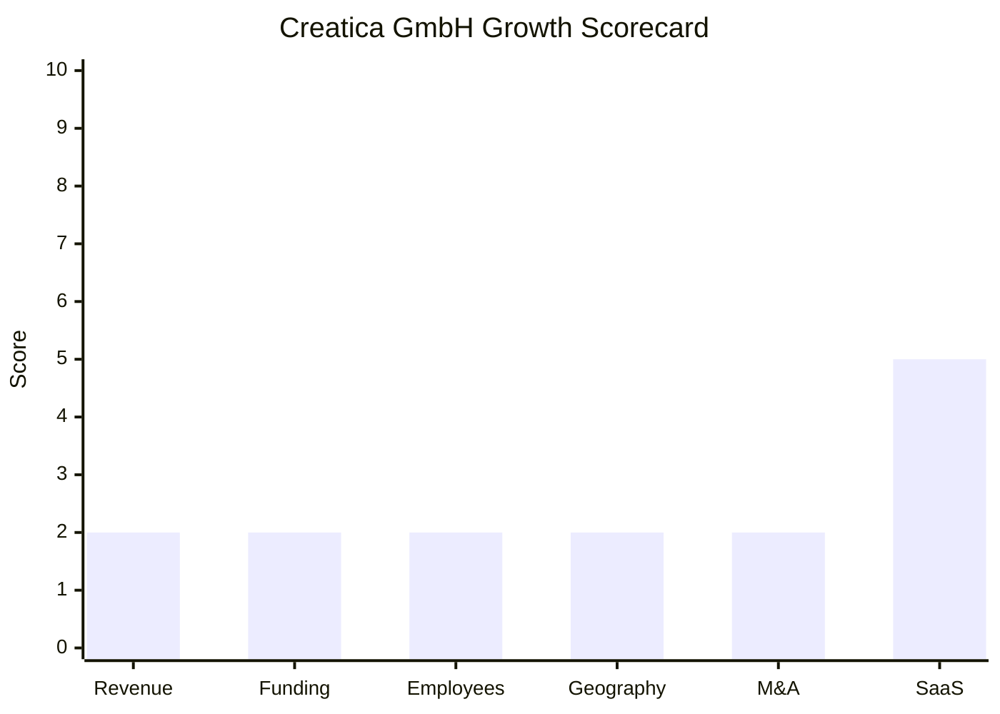

# Financial & Growth Deep-Dive - Creatica GmbH

**Research Date**: 2026-02-16
**Data Availability**: Low (private German GmbH, no VC funding, no Crunchbase profile, no LinkedIn company page found, Bundesanzeiger filings not publicly accessible for micro-companies)

### Revenue Timeline

| Year | Revenue | Currency | EUR Equivalent | YoY Growth | Source | Confidence |
| --- | --- | --- | --- | --- | --- | --- |
| 2025 | EUR 2-5M (range) | EUR | EUR 2-5M | Unknown | Proxy: <20 employees x EUR 150-250K | Estimated (proxy) |
| 2024 | Unknown | - | Unknown | Unknown | No public data | Unknown |
| 2023 | Unknown | - | Unknown | Unknown | No public data | Unknown |
| 2022 | Unknown | - | Unknown | Unknown | No public data | Unknown |
| 2021 | Unknown | - | Unknown | Unknown | No public data | Unknown |

**Revenue CAGR (3yr)**: Unknown (insufficient data for calculation)
**Revenue CAGR (5yr)**: Unknown (insufficient data for calculation)

#### Revenue Estimation Methodology

No confirmed revenue figures exist for Creatica GmbH. The EUR 2-5M range estimate is derived from:

1. **Headcount proxy**: Estimated <20 employees at EUR 150-250K revenue per employee (industry benchmark for consulting/SaaS hybrid firms)
2. **Share capital signal**: EUR 25,000 GmbH capital (converted from EUR 1,000 UG) -- typical for bootstrapped micro-companies, not indicative of high revenue
3. **Revenue streams identified**:
   - FlexBid Autotrader SaaS subscriptions (primary recurring)
   - Consulting engagements (energy, optimization, digital transformation)
   - BZR Study research report sales (minor, one-time)
4. **Product traction metrics**: 37% profit increase, 1.2M MWh managed, 34K trading instances -- these indicate real market usage but do not translate directly to revenue

**Revenue chart omitted**: Fewer than 2 confirmed data points.

### Profitability

| Data Point | Value | Source | Confidence |
| --- | --- | --- | --- |
| EBITDA (current) | Unknown | Private company | Unknown |
| EBITDA Margin | Unknown | Private company | Unknown |
| Net Profit / Loss | Unknown | Private company | Unknown |
| Recurring Revenue % | Unknown; FlexBid is SaaS but consulting is project-based | Business model assessment | Estimated |
| SaaS Revenue % | Unknown; estimated 30-60% of total (FlexBid SaaS + consulting mix) | Business model assessment | Estimated |
| Revenue per Employee | EUR 150-250K (industry proxy) | Industry benchmark | Estimated (proxy) |

### Funding & Investment History

| Date | Round | Amount | Lead Investor(s) | Valuation | Source | Confidence |
| --- | --- | --- | --- | --- | --- | --- |
| - | None found | - | - | - | Crunchbase, Tracxn, web search | Confirmed (no funding) |

**Total Raised**: EUR 0 (bootstrapped)
**Latest Valuation**: N/A (private, no external funding rounds)
**Current Investors**: Vadim Gorski (50% of Creatica GmbH); remaining 50% holder unknown (likely co-founders via Creatica Holding GmbH)
**War Chest Signals**: Minimal. EUR 25,000 share capital for both Creatica GmbH and Flexbid GmbH. No known credit facilities or PE backing. Cash reserves unknown but likely modest given micro-company scale.

#### Investment Portfolio (Outbound)

Creatica Holding GmbH holds minority stakes in:

| Company | Sector | Funding Raised (total) | Key Investors | Source | Confidence |
| --- | --- | --- | --- | --- | --- |
| RABOT Charge GmbH (Hamburg) | Dynamic EV charging tariffs | $22.7M (3 rounds, latest Series A Feb 2024) | HV Capital, HTGF, Bosch Ventures, Yabeo Impact | Tracxn, Startupcity Hamburg | Confirmed |
| Algostrom GmbH | Unknown (energy-adjacent) | Unknown | Unknown | NorthData | Confirmed (existence) |

This portfolio strategy suggests financial sophistication beyond the EUR 25K share capital, indicating retained earnings from consulting/SaaS being deployed into adjacent energy startups. However, stake sizes and investment amounts are unknown.

### Employee Timeline

| Year | Headcount | YoY Growth | Source | Confidence |
| --- | --- | --- | --- | --- |
| 2026 (current) | <20 est. | Unknown | No LinkedIn page; inferred from consultancy profile and single registered office | Estimated |
| 2025 | <20 est. | Unknown | Intersolar 2025 exhibitor, no disclosed team size | Estimated |
| 2024 | Unknown | Unknown | No public data | Unknown |
| 2023 | Unknown | Unknown | No public data | Unknown |
| 2022 | Unknown | Unknown | No public data | Unknown |
| 2021 | Unknown | Unknown | No public data | Unknown |

**Employee CAGR (3yr)**: Unknown (insufficient data)
**Current Open Positions**: 0 found (no careers page on creatica.de, no job postings on LinkedIn/Indeed/StepStone)
**Hiring Hotspots**: None visible

#### Key Personnel

| Name | Role | Status | Source | Confidence |
| --- | --- | --- | --- | --- |
| Dr. Vadim Gorski | Managing Director | Active | NorthData, Intersolar, creatica.de | Confirmed |
| Marvin Roben | Former Co-Managing Director | No longer MD | NorthData | Confirmed |
| Enrico Groz | BZR Study co-author | Active (role unknown) | BZR Study, creatica.de | Confirmed |

**Employee chart omitted**: Fewer than 2 confirmed data points.

### Geographic & Market Expansion

| Year | Expansion Event | Details | Source | Confidence |
| --- | --- | --- | --- | --- |
| 2024-2025 | PowerBot/Volue integration | FlexBid available on PowerBot platform, providing indirect access to EPEX SPOT, Nord Pool, BSP Southpool, HUPX, IBEX, TGE, CROPEX, SEMOpx, BRM, OPCOM, SEEPEX, GENEX | PowerBot integrations page | Confirmed |
| 2025 | Intersolar Europe exhibition | Booth A4.360, Munich -- first confirmed major trade show presence | Intersolar exhibitor list | Confirmed |
| 2025-2026 | BZR Study publication | Paid research report on German Bidding Zone Review, co-authored with Omnia Energy | creatica.de | Confirmed |

**International Revenue %**: Unknown (likely near 0% -- all identified activity is Germany/EPEX-focused)
**Expansion Trajectory**: Creatica remains firmly Germany-focused. The PowerBot/Volue integration theoretically extends FlexBid's reach to 12+ European exchanges, but there is no evidence of active customer acquisition outside Germany. The company's BZR Study is Germany-specific. No new offices, no new country entries, no international hiring signals.

### M&A Activity

| Date | Target | Deal Size | Capability Gained | Strategic Rationale | Source | Confidence |
| --- | --- | --- | --- | --- | --- | --- |
| - | None | - | - | - | Web search, NorthData | Confirmed (no M&A) |

**Divestitures**: None
**M&A Pattern**: No M&A activity. Creatica's growth strategy is organic: develop in-house products (FlexBid), publish research (BZR Study), and take minority investment stakes in adjacent startups (RABOT Charge, Algostrom) via the holding company. This is a portfolio/venture-builder approach rather than an acquisition approach.

#### Corporate Restructuring (Internal)

| Date | Event | Details | Source | Confidence |
| --- | --- | --- | --- | --- |
| Unknown | UG to GmbH conversion | Creatica upgraded from UG (EUR 1,000 capital) to GmbH (EUR 25,000 capital) | NorthData | Confirmed |
| Unknown | Holding structure created | Creatica Holding GmbH established as parent of Creatica GmbH + Flexbid GmbH | NorthData | Confirmed |
| Unknown | Flexbid GmbH spin-out | FlexBid product separated into its own legal entity (HRB 304743, EUR 25,000 capital) at same address (c/o Creatica Holding GmbH) | NorthData | Confirmed |

This restructuring indicates professionalization and potential for future fundraising (a holding structure is standard preparation for taking on external capital or separating assets).

### SaaS Transition Metrics

| Data Point | Value | Source | Confidence |
| --- | --- | --- | --- |
| Deployment Model | SaaS (FlexBid is cloud-native) + consulting (project-based) | creatica.de | Confirmed |
| Cloud Revenue % (current) | Unknown (FlexBid is SaaS; consulting is not) | Business model assessment | Estimated |
| Recurring Revenue % | Estimated 30-60% (FlexBid SaaS portion) | Business model assessment | Estimated |
| Platform Stack | Java, Python, web service APIs | creatica.de | Confirmed |
| Migration Status | N/A -- FlexBid was built cloud-native; no migration needed | creatica.de | Confirmed |
| PowerBot Integration | FlexBid available as optimizer within PowerBot (Volue) SaaS platform | PowerBot integrations page | Confirmed |

**SaaS assessment**: FlexBid Autotrader is a modern, cloud-native SaaS product from inception. The technology stack (Java, Python, web services) is contemporary. However, Creatica as a whole is a hybrid consulting + SaaS business. The consulting arm generates project-based, non-recurring revenue. The overall SaaS maturity depends on the revenue mix, which is unknown. The Flexbid GmbH spin-out into its own entity suggests intent to separate SaaS product economics from consulting.

### Growth Scorecard

| Dimension | Score (1-10) | Evidence Summary |
| --- | --- | --- |
| Revenue Growth | 2 | No revenue data available; proxy estimate EUR 2-5M; no evidence of growth trajectory; bootstrapped micro-company |
| Funding Momentum | 2 | Zero external funding raised; bootstrap model; EUR 25K share capital; holds minority stakes in funded startups but no capital inflow to Creatica itself |
| Employee Growth | 2 | Estimated <20, stable; no job postings found; no LinkedIn company page; no visible hiring activity |
| Geographic Expansion | 2 | Germany-only focus; EPEX SPOT via PowerBot integration but no active international expansion; no new offices or country entries |
| M&A Activity | 2 | No acquisitions; no divestitures; portfolio investment stakes (RABOT Charge, Algostrom) are passive, not M&A |
| SaaS Maturity | 5 | FlexBid is cloud-native SaaS from design; modern tech stack (Java/Python/APIs); but consulting arm is project-based; hybrid model with unknown recurring revenue % |
| **COMPOSITE SCORE** | **2.5** | **Classification: Dinosaur** |

**Classification Thresholds**:

- **Rocket** (avg 7.0-10.0): Explosive growth, heavy investment, market disruptor
- **Riser** (avg 5.0-6.9): Strong growth signals, investing in future, accelerating
- **Steady** (avg 3.0-4.9): Stable but not transforming, evolutionary
- **Dinosaur** (avg 1.0-2.9): Flat or declining, legacy mode, no visible investment

#### Growth Scorecard Radar

> **Classification caveat**: Creatica's "Dinosaur" score (2.5) is driven primarily by **data opacity** rather than confirmed decline. Unlike true dinosaurs (flat revenue, legacy architecture, no investment), Creatica has a modern SaaS product (FlexBid), active conference presence (Intersolar 2025), investment portfolio ambitions (RABOT Charge, Algostrom), and corporate restructuring signals (holding company, Flexbid spin-out). However, the lack of any external funding, visible growth metrics, hiring activity, or geographic expansion means the scores must follow the rubric conservatively. Creatica is better described as a **specialized micro-company** with a modern product but no visible growth engine.

---

### Comparative Context vs Eneve

| Dimension | Creatica | Eneve | Gap |
| --- | --- | --- | --- |
| Revenue | EUR 2-5M (est.) | EUR ~8-12M (est.) | Eneve ~3-5x larger |
| Employees | <20 est. | ~60-80 est. | Eneve ~4x larger |
| Funding | EUR 0 (bootstrapped) | Organic (established) | Both bootstrapped; Eneve has scale advantage |
| SaaS Maturity | FlexBid is cloud-native | On-premise, migrating to C#/.NET | Creatica ahead on SaaS for its product |
| Market Scope | Germany / EPEX intraday only | Netherlands (primary), Belgium (expanding) | Different markets, different scope |
| Threat Level | Low | - | Different value chain layers; no direct overlap |

### Key Takeaways

1. **Not a competitive threat**: Creatica operates in algorithmic intraday trading optimization, entirely different from Eneve's back-office/settlement/balancing domain. No overlap exists today.

2. **Modern product, no scale**: FlexBid is a genuinely modern SaaS product with real market traction (1.2M MWh, 34K instances), but the company has no visible growth engine (no funding, no hiring, no geographic expansion).

3. **Venture-builder ambitions**: The holding structure and investment stakes (RABOT Charge with $22.7M funding, Algostrom) suggest Creatica's founders are building a portfolio of energy technology bets, not just a single product company.

4. **PowerBot/Volue integration is the growth lever**: FlexBid's integration into PowerBot (acquired by Volue Dec 2024) provides theoretical access to 12+ European exchanges without Creatica needing its own exchange connectivity. This is capital-efficient expansion.

5. **Opaque by design**: As a German GmbH with <EUR 25K share capital, Creatica has minimal disclosure obligations. The absence of data signals bootstrap discipline, not necessarily decline.
