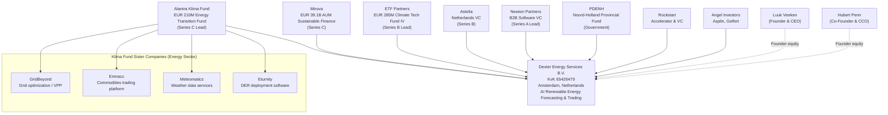
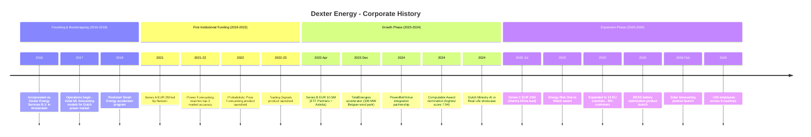
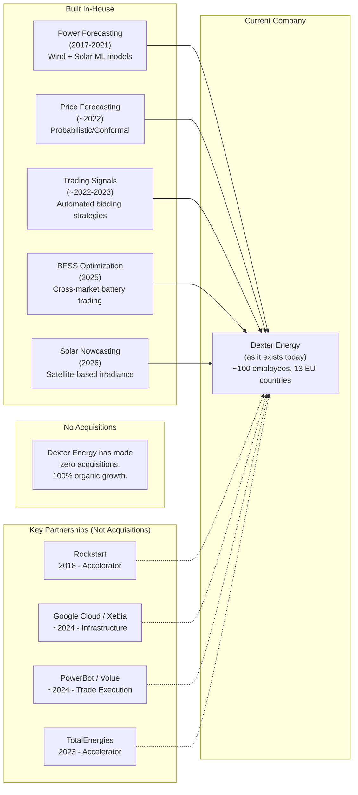

# Corporate History - Dexter Energy

**Research Date**: 2026-02-16
**Genealogy Confidence**: High (well-funded Dutch B.V. with strong press coverage, public investor announcements, KvK registration, and active corporate blog)

---

### Current Ownership & Key Parties

| Stakeholder | Role | Stake % | Type | Since | Source |
|---|---|---|---|---|---|
| Alantra Klima Energy Transition Fund | Series C lead investor | Undisclosed | PE / Energy Transition Fund | 2025 | alantra.com, press releases |
| Mirova | Series C investor | Undisclosed | Sustainable Asset Manager (EUR 39.1B AUM) | 2025 | mirova.com, press releases |
| ETF Partners | Series B co-lead, continued C | Undisclosed | Climate Tech VC (EUR 285M Fund IV) | 2023 | etfpartners.capital, press releases |
| Astelia | Series B co-lead | Undisclosed | VC (Netherlands-based) | 2023 | CBInsights, press releases |
| Newion Partners | Series A lead, continued B+C | Undisclosed | Early-stage B2B Software VC | 2021 | newion.com, press releases |
| PDENH | Series A participant, continued B+C | Undisclosed | Government / Provincial Fund (Noord-Holland, EUR 85M) | 2021 | PDENH, press releases |
| Rockstart | Accelerator, continued B | Undisclosed | Accelerator / VC | 2018 | rockstart.com, press releases |
| Luuk Veeken | Founder & CEO | Undisclosed (founder equity) | Founder | 2016 | dexterenergy.ai |
| Hubert Penn | Co-Founder & CCO | Undisclosed (founder equity) | Founder | 2016 | dexterenergy.ai |
| Stephen Asplin | Angel investor | Undisclosed | Angel | 2021 | newion.com Series A announcement |
| Andreas Gelfort | Angel investor | Undisclosed | Angel | 2021 | newion.com Series A announcement |

**Note**: As a private B.V., exact stake percentages are not publicly disclosed. With EUR 36M+ raised across 4 rounds from 7+ investors, founders likely retain a significant minority stake. VC investors collectively hold the majority.

**Management Team**:

| Name | Role | Background | Source |
|---|---|---|---|
| Luuk Veeken | CEO & Founder | MSc Energy Science (Utrecht Univ.), BSc Chemistry, self-taught Python programmer, ex-Eemflow Energy (smart grids) | dexterenergy.ai, theorg.com, CEO interview |
| Hubert Penn | CCO & Co-Founder | Co-founder from inception, commercial leadership | dexterenergy.ai, press releases |
| Tom Lemmens | CPTO (Chief Product & Technology Officer) | Product and technology leadership | dexterenergy.ai, FinSMEs |
| Mehmet Karadayi | CTO | Technology leadership (appears in 2023+ listings) | newion.com, theorg.com |
| Igor Curic | CFO | Financial leadership (appears in 2025 listings) | FinSMEs Series C announcement |

**Board of Directors**: Not publicly disclosed. Key investor representatives likely include Patrick Polak (Newion Managing Partner) who has been Dexter's designated investor contact since Series A.

**Corporate Structure** (Mermaid diagram):



**Sister Companies Under Klima Fund**: Enmacc (commodities trading platform) is the most strategically relevant -- it operates in adjacent energy trading space, suggesting Alantra is assembling an energy trading technology portfolio.

---

### Origin Story

| Data Point | Value | Source | Confidence |
|---|---|---|---|
| Founded | 2016 (incorporated) / 2017 (operations) | KvK registration (Creditsafe), Crunchbase, press releases | Confirmed |
| Original Name | Dexter Energy Services B.V. | KvK 65426479 | Confirmed |
| Founders | Luuk Veeken (CEO), Hubert Penn (CCO), Fons de Leeuw | iamsterdam.com, thesaasnews.com, dexterenergy.ai | Confirmed (Veeken/Penn), Estimated (de Leeuw) |
| Original Mission | Apply AI/ML to optimize short-term renewable power trading and reduce grid imbalance costs | dexterenergy.ai, CEO interviews | Confirmed |
| Original Product | AI-powered renewable energy generation forecasting (wind/solar) | dexterenergy.ai, Rockstart | Confirmed |
| First Market | Netherlands (Dutch short-term power market, TenneT balancing) | dexterenergy.ai, press releases | Confirmed |
| KvK Number | 65426479 | Creditsafe | Confirmed |
| Registered Address | Joan Muyskenweg 22, 1096 CJ Amsterdam | KvK, Creditsafe | Confirmed |
| SIC Code | 62100 (Computer programming activities) | Creditsafe | Confirmed |
| VAT Number | NL856107189B01 | Creditsafe | Confirmed |

**Founder Background**: Luuk Veeken holds a Master's in Energy Science and BSc in Chemistry from Utrecht University, with additional study at the London School of Economics. Before founding Dexter, he worked at Eemflow Energy on smart grid implementation and demand response management, and developed mathematical models for photovoltaic thermal hybrid solar collectors at QING Groep. Critically, Veeken taught himself Python during his daily train commute -- this self-taught coding ability combined with energy science education became the foundation for Dexter's ML-powered platform.

**Founding Insight**: The energy transition creates a fundamental forecasting challenge -- renewable generation depends on weather rather than fuel supply, making electricity supply inherently unpredictable. Traditional power trading systems were designed for dispatchable fossil generation. Veeken recognized that machine learning could quantify this uncertainty and optimize trading decisions for renewables-heavy portfolios. Dexter was built to solve this specific problem.

---

### Corporate Identity Changes

| # | Date | From | To | Reason | Source |
|---|---|---|---|---|---|
| - | - | - | - | No name changes found | KvK, all sources |

**Note**: Dexter Energy has maintained the same corporate identity since incorporation. The company has always been "Dexter Energy Services B.V." (legal) / "Dexter Energy" (trading name). No rebrands, no name changes, no corporate identity shifts. This is consistent with its nature as an organic startup that has never been acquired or merged.

---

### Mergers & Acquisitions Timeline

#### Acquisitions Made (as buyer)

| Date | Target Company | Deal Value | What Was Gained | Integration Outcome | Source |
|---|---|---|---|---|---|
| - | None | - | - | - | All sources searched |

**Note**: Dexter Energy has made zero acquisitions in its history. All growth has been purely organic -- building products and capabilities in-house through hiring and R&D, funded by VC rounds.

#### Acquired By (as target)

| Date | Acquiring Company | Deal Value | Strategic Rationale | Source |
|---|---|---|---|---|
| - | Not acquired | - | - | All sources searched |

**Note**: Dexter Energy remains an independent, VC-backed private company. It has not been acquired by any entity.

---

### Investment & Financial Events

| Date | Event Type | Details | Investors/Counterparty | Investor Type | Amount | Source |
|---|---|---|---|---|---|---|
| 2018 | Accelerator | Rockstart Smart Energy accelerator program; first external validation and support network | Rockstart | Accelerator / VC | Undisclosed | rockstart.com, rockstart.pr.co |
| 2021-03 | Series A | First institutional funding; established investor base | Newion (lead), PDENH, Stephen Asplin, Andreas Gelfort | VC (Newion), Government (PDENH), Angel (Asplin, Gelfort) | EUR 2M | newion.com, dexterenergy.ai |
| 2023-04 | Series B | Growth funding; target to double team to 80 by end-2023 | ETF Partners (co-lead), Astelia (co-lead), Newion, PDENH, Rockstart | Climate Tech VC (ETF), VC (Astelia), VC (Newion), Government (PDENH), Accelerator (Rockstart) | EUR 10.5M | dexterenergy.ai, rockstart.pr.co |
| 2025-07 | Series C | Expansion into BESS/battery optimization, new EU markets, enhanced wind/solar tools | Alantra Klima (lead), Mirova, ETF Partners, Newion, PDENH | PE/Energy Fund (Klima), Sustainable AM (Mirova), Climate Tech VC (ETF), VC (Newion), Government (PDENH) | EUR 23M (~$27M) | alantra.com, reuters.com, mirova.com, dexterenergy.ai |
| **Total** | | | | | **~EUR 36M (~$41M)** | |

**Investor Classification:**

| Investor | Type | Focus | Significance |
|---|---|---|---|
| Alantra Klima | Energy Transition Growth Fund (EUR 210M) | Late-stage venture / early growth in energy-tech | Backed by EIF (European Investment Fund), Canadian Pension Fund, Enagás; pan-European focus |
| Mirova | Sustainable Asset Manager (EUR 39.1B AUM) | Energy transition, ESG | Natixis subsidiary; Article 9 SFDR; B Corp certified |
| ETF Partners | Climate Tech VC (EUR 285M Fund IV) | Sustainability through innovation | 20+ years track record; "intelligence layer for modern infrastructure" thesis |
| Astelia | Netherlands-based VC | General tech / sustainability | Single known investment is Dexter Energy |
| Newion Partners | Early-stage B2B software VC | Netherlands B2B software | Patrick Polak (Managing Partner) is key contact; led earliest institutional round |
| PDENH | Provincial Government Fund (EUR 85M) | Sustainable economy in Noord-Holland | Province of Noord-Holland; managed by ROM InWest since 2024; closed-end since 2024 |
| Rockstart | Accelerator & VC | Smart energy, emerging tech | Amsterdam-based; Smart Energy accelerator program |

**Government/Public Funding**: PDENH participation in all 3 institutional rounds represents consistent Dutch government backing through the Province of Noord-Holland's sustainable economy fund. No EU grants or Topsector Energie subsidies were identified in public records, though Dexter is registered in the Topsector Energie organization database.

**Revenue Milestones**: Dexter is a private company and does not publicly report revenue. Growjo estimates ~$11.3M current revenue, which remains unconfirmed.

---

### Splits, Spin-offs & Divestitures

| Date | Event Type | What Was Separated | Destination / Buyer | Reason | Source |
|---|---|---|---|---|---|
| - | None | - | - | - | All sources searched |

**Note**: Dexter Energy has no spin-offs, divestitures, or corporate fragmentation events. The company has operated as a single B.V. entity since incorporation, with no subsidiaries, joint ventures, or structural reorganizations found in public records.

---

### Critical Events & Milestones

| Date | Event | Impact | Source |
|---|---|---|---|
| 2016 | Incorporated as Dexter Energy Services B.V. (KvK 65426479) | Legal entity established in Amsterdam | Creditsafe, KvK |
| 2017 | Operations begin; initial ML model development | First forecasting models for Dutch power market | dexterenergy.ai, press |
| 2018 | Rockstart Smart Energy accelerator program | First external validation; access to energy VC network; early mentorship | rockstart.com |
| 2021-03 | Series A (EUR 2M) led by Newion | First institutional capital; enabled team growth from founding team | newion.com |
| ~2021-2022 | Power Forecasting product reaches market-leading accuracy | "Top-3 market accuracy" for renewable generation forecasts; reduces balancing costs by up to 35% | dexterenergy.ai |
| ~2022 | Price Forecasting product launch (probabilistic/conformal prediction) | Expanded from generation forecasting into market price forecasting; enabled trading strategy products | dexterenergy.ai/blog |
| ~2022-2023 | Trading Signals product launch | Strategic pivot from "forecasting provider" to "trading and balancing power as a service" | dexterenergy.ai, iamsterdam.com |
| 2023-04 | Series B (EUR 10.5M) led by ETF Partners + Astelia | Growth capital; target to double team to 80; European expansion beyond NL/DE | dexterenergy.ai, rockstart.pr.co |
| 2023-12 | TotalEnergies startup accelerator program | Major customer validation; 300 MW Belgian wind park optimization project | dexterenergy.ai |
| ~2024 | PowerBot/Volue integration partnership | Forecasts and trading signals integrated into PowerBot execution platform; indirect access to EPEX Spot, Nord Pool, and other exchanges | powerbot-trading.com, dexterenergy.ai |
| ~2024 | Google Cloud / Xebia technology partnership | Cloud infrastructure partnership; 200+ TB data processing; Google Cloud case study published | docs.cloud.google.com, xebia.com |
| 2024 | Computable Award nomination (highest jury score: 7.94/10) | Top-10 most sustainable tech company in Netherlands recognition | dexterenergy.ai |
| 2024 | Dutch Ministry of Economic Affairs "AI in Real Life" feature | Government recognition of Dexter as showcase AI company in Netherlands | dexterenergy.ai |
| 2025-07 | Series C (EUR 23M) led by Alantra Klima | Major growth capital; BESS/battery optimization expansion; new EU markets | reuters.com, alantra.com, mirova.com |
| 2025 | Energy Risk "One to Watch" award | Industry recognition from leading energy risk publication | risk.net, dexterenergy.ai |
| 2025 | Expansion to 13 European countries, 80+ customers | Geographic footprint: NL, BE, DE, AT, FR, IE, IT, RO, UK + 4 others | iamsterdam.com, dexterenergy.ai |
| 2025 | BESS cross-market optimization product launch | Expanded from renewables-only to battery storage trading optimization | pv-magazine.com, dexterenergy.ai |
| 2025 | Team reaches ~90-100 employees | 43% YoY growth; 59% in AI/data science roles | Growjo, dexterenergy.ai |
| 2026-02 | Solar Nowcasting product launch | Satellite-based 0-3 hour irradiance prediction; fills gap for assets without SCADA data | dexterenergy.ai |

---

### Corporate Timeline (Visual)



### M&A Genealogy (Visual)



### Corporate Timeline (Text Summary)

```text
2016 - Incorporated as Dexter Energy Services B.V. in Amsterdam (KvK 65426479)
2017 - Operations begin; Luuk Veeken (CEO), Hubert Penn (CCO), Fons de Leeuw build first ML forecasting models
2018 - Rockstart Smart Energy accelerator (first external validation, energy VC network access)
2019-2020 - Bootstrap phase: product development, early Dutch customers, proving ML forecasting accuracy
2021 Mar - Series A: EUR 2M led by Newion Partners (first institutional capital)
2021-2022 - Power Forecasting reaches "top-3 market accuracy" for renewable generation
~2022 - Probabilistic Price Forecasting launched (conformal prediction methodology)
~2022-2023 - Trading Signals product launched; strategic pivot to "Trading as a Service"
2023 Apr - Series B: EUR 10.5M led by ETF Partners + Astelia (growth capital)
2023 Dec - TotalEnergies startup accelerator (300 MW Belgian wind park project)
2024 - PowerBot/Volue integration; Google Cloud/Xebia partnership
2024 - Computable Award nomination (highest jury score 7.94); Dutch Ministry "AI in Real Life"
2025 Jul - Series C: EUR 23M led by Alantra Klima (expansion into BESS, new EU markets)
2025 - Energy Risk "One to Watch"; expanded to 13 EU countries, 80+ customers
2025 - BESS cross-market optimization product launched
2026 Feb - Solar Nowcasting product launched (satellite-based 0-3h irradiance prediction)
2026 - ~90-100 employees, 59% in AI/data science roles, 9 countries with offices/presence
```

---

### Pattern Analysis

**Growth Strategy**: Purely organic -- no acquisitions, no mergers, no spin-offs. All capabilities built in-house through R&D and hiring. Funded by progressive VC rounds (Accelerator -> Series A -> B -> C) with increasing ticket sizes (undisclosed -> EUR 2M -> EUR 10.5M -> EUR 23M). This is a classic European deep-tech venture trajectory.

**Acquisition Pattern**: N/A -- Dexter has never acquired a company. The growth strategy relies entirely on internal product development, strategic partnerships (PowerBot/Volue for execution, Google Cloud/Xebia for infrastructure, TotalEnergies for customer validation), and geographic expansion through SaaS/API delivery.

**Technology Evolution**: Consistent deepening of ML/AI capabilities across the same core domain:
1. **2017-2021**: Generation forecasting (wind + solar power output prediction using NWP + ML)
2. **~2022**: Price forecasting (imbalance and intraday market price prediction using conformal prediction)
3. **~2022-2023**: Trading signals (automated bidding strategies combining forecasts with market fundamentals)
4. **2025**: BESS optimization (cross-market battery storage trading across FCR, spot, balancing)
5. **2026**: Solar nowcasting (satellite-based short-horizon irradiance prediction)

Each product builds on the previous one -- generation forecasts feed price forecasts, which feed trading signals, which feed optimization strategies. This is a deliberate platform expansion from data to intelligence to automation.

**Leadership Stability**: High. Founder-led since inception. Luuk Veeken (CEO) and Hubert Penn (CCO) have been with the company from founding through all growth phases. No CEO/CTO departures found. Tom Lemmens (CPTO) and Mehmet Karadayi (CTO) appear to have been added as the technical team scaled. The only noted leadership change is the CFO role transitioning from Ana Caria (~2023) to Igor Curic (~2025).

**Investor Continuity**: Remarkably consistent. Newion and PDENH have participated in every institutional round (A, B, C). Rockstart continued from accelerator through Series B. ETF Partners continued from Series B to C. This consistent investor follow-on signals strong internal metrics and investor confidence.

**Strategic Pivot**: The most significant strategic evolution is from "forecasting provider" (pure data/analytics) to "Trading as a Service" (TaaS) -- the company is moving up the value chain from providing inputs to trading decisions toward providing the trading decisions themselves. This is visible in the product evolution: forecasts (2017) -> signals (2023) -> automated optimization (2025).

---

### Strategic Implications for Eneve

**What the history reveals about future direction**:
- **Continued organic growth, not acquisition**: Dexter's 8-year history shows zero M&A activity. They build capabilities internally. This means Eneve is unlikely to see Dexter suddenly acquire a back-office or nominations company to compete directly. Expansion will be through product development, not inorganic growth.
- **Platform expansion up the value chain**: The clear trajectory from forecasting -> signals -> optimization -> TaaS suggests Dexter will continue moving upstream toward portfolio management and automated trading. Each product iteration gets closer to decision-making, not just data provision.
- **EUR 23M Series C fuels 2-3 year expansion**: With Alantra Klima and Mirova backing, Dexter has capital for aggressive product development (BESS optimization, prosumption forecasting) and geographic expansion into new EU markets. This capital runway extends through ~2027-2028.
- **BESS expansion signals broadening asset coverage**: Moving from renewables-only to battery storage opens Dexter to the flexibility market -- a market that increasingly overlaps with balancing operations where Eneve operates.

**Inherited strengths from corporate history**:
- **AI-native DNA from founding**: Unlike competitors that added AI to existing platforms, Dexter's entire technology stack was built for ML from day one. 59% of staff in AI/data science is a structural advantage that is difficult to replicate by adding "an AI team" to a legacy platform.
- **8 years of proprietary training data**: Since 2017, Dexter has been collecting and processing weather data, generation data, and market data across European markets. This historical dataset (200+ TB) is a compounding competitive moat.
- **Consistent investor backing**: Every institutional investor has followed on in subsequent rounds. This continuity provides stability, strategic guidance, and warm introductions to customers/partners.
- **Dutch market incumbency**: As an Amsterdam-based company serving Greenchoice, Scholt Energy, and other major Dutch players since early days, Dexter has deep relationships in Eneve's home market.

**Inherited weaknesses / risks from corporate history**:
- **No back-office DNA**: 8 years of pure forecasting/trading focus means Dexter has zero experience with nominations, scheduling, EDI messaging, settlement, or market participant management. Building these capabilities would be a fundamental pivot.
- **VC-dependent growth model**: With EUR 36M raised and estimated ~$11M revenue, Dexter is likely still pre-profit. The company depends on continued VC funding or a path to profitability. A market downturn or investor sentiment shift could constrain growth.
- **Narrow specialization risk**: Power-only, short-term-only, renewables/BESS-only specialization makes Dexter vulnerable if market structure changes or if integrated platforms bundle forecasting into broader offerings.
- **No acquisition experience**: If Dexter's growth strategy eventually requires acquiring capabilities (e.g., a nominations platform), they have no M&A integration experience to draw on.

**M&A prediction**: Based on the organic growth pattern and current investor composition (Klima, Mirova, ETF Partners are all impact/energy transition funds), Dexter is more likely to be an acquisition target than an acquirer. Likely acquirers include:
1. **Volue ASA** -- Already connected via PowerBot integration; Volue has been acquisitive (PowerBot, Quorum) and Dexter would extend their renewable trading intelligence
2. **A major utility** -- TotalEnergies accelerator relationship signals interest from large utilities seeking to internalize trading optimization
3. **A larger ETRM vendor** -- Brady, ION, or Hitachi could acquire Dexter to add AI-native forecasting capabilities
4. **PE roll-up** -- Alantra Klima's portfolio includes Enmacc (commodities trading) and GridBeyond (grid optimization), suggesting a potential energy trading technology consolidation play

The partnership with PowerBot/Volue deserves particular attention -- integration partnerships frequently precede acquisitions in the energy software sector.

---

### Data Quality Notes

| Category | Sources Available | Confidence Assessment |
|---|---|---|
| Founding & registration | KvK, Creditsafe, multiple press sources | High -- confirmed across sources |
| Funding amounts & dates | Official press releases, investor websites, Reuters | High -- confirmed |
| Leadership team | Company website, investor announcements, TheOrg | High (CEO/CCO/CPTO), Medium (CFO role transition unclear) |
| Board composition | Not publicly available | Low -- private company, no board disclosure |
| Exact ownership percentages | Not publicly available | Low -- private B.V., no disclosure requirement |
| Revenue figures | Growjo estimates only | Low -- unconfirmed third-party estimate |
| M&A activity | All sources searched, none found | High -- absence confirmed |
| Product launch dates | Blog posts, press releases | Medium -- approximate dates for some products |
| Employee counts | Company statements, Growjo | Medium -- ranges rather than exact figures |

---

**Contradictions Between Sources**:
1. **Founding date**: KvK/Creditsafe shows incorporation in 2016; most press sources cite 2017 as founding year. Likely the entity was registered in 2016 with operations beginning in 2017.
2. **CFO identity**: Ana Caria listed as CFO in 2023 Series B announcements; Igor Curic listed as CFO in 2025 Series C announcements. Likely a CFO transition occurred between 2023-2025.
3. **Third co-founder**: Fons de Leeuw mentioned as co-founder in iamsterdam.com and thesaasnews.com but absent from current company website and most other sources. May have departed early.
4. **Employee count**: "90 professionals across 9 countries" (company statement) vs "~100 post-Series C" (iamsterdam.com) vs "63 named on website" (direct count). All are approximately consistent with ~90-100 range.
