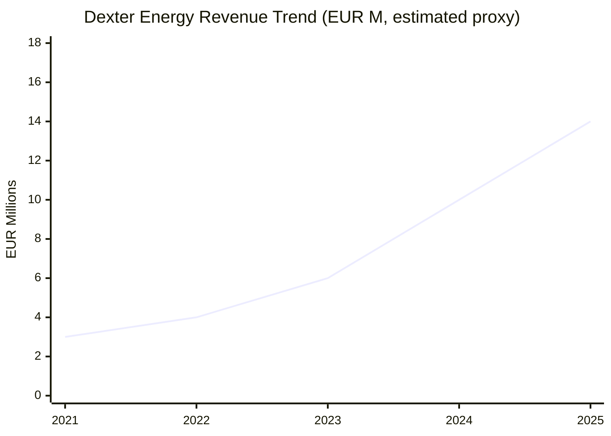
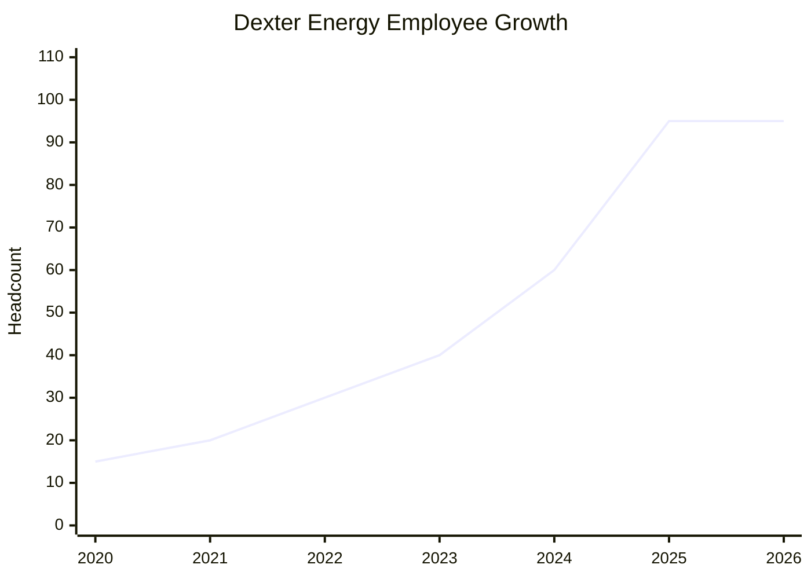
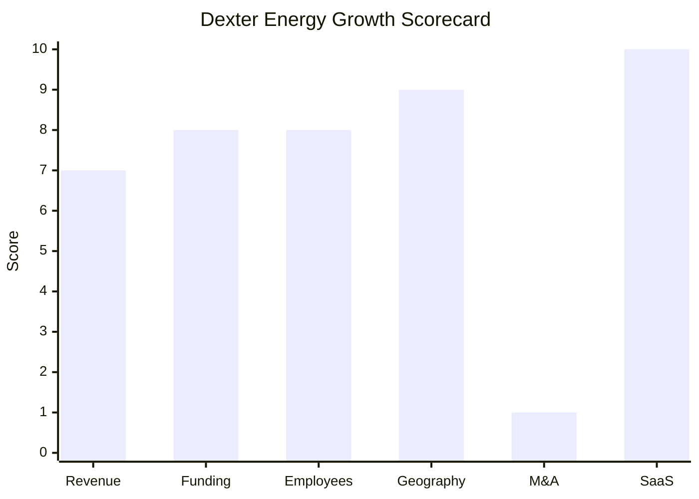

# Financial & Growth Deep-Dive - Dexter Energy

**Research Date**: 2026-02-16
**Data Availability**: Low-Medium (VC-funded private company; funding data reliable from Crunchbase/press, revenue data proxy-estimated only)

### Revenue Timeline

| Year | Revenue | Currency | EUR Equivalent | YoY Growth | Source | Confidence |
| --- | --- | --- | --- | --- | --- | --- |
| 2025 | EUR 12-17M | EUR | EUR 12-17M | ~40-60% | Employee proxy (95 x EUR 130-175K) | Estimated (proxy) |
| 2024 | ~$11.3M | USD | ~EUR 10.3M | ~45-55% | Growjo (60 employees x $189K) | Estimated |
| 2023 | EUR 5-7M | EUR | EUR 5-7M | ~40-50% | Employee proxy (40 x EUR 130-175K) | Estimated (proxy) |
| 2022 | EUR 3-5M | EUR | EUR 3-5M | ~50-70% | Employee proxy (30 x EUR 100-170K) | Estimated (proxy) |
| 2021 | EUR 2-4M | EUR | EUR 2-4M | - | Employee proxy (20 x EUR 100-175K) | Estimated (proxy) |

**Revenue CAGR (3yr, est. 2022-2025)**: ~35-55% (based on employee-proxy midpoints EUR 4M -> EUR 14M)
**Revenue CAGR (5yr)**: Not available (company too young for 5yr history at meaningful scale)

**Revenue Data Quality Note**: Dexter Energy is a private, VC-funded company that does not disclose revenue. The only external estimate is Growjo's $11.3M (~EUR 10.3M) based on 60 employees at $189K/employee. All other figures are proxy estimates using headcount x EUR 130-175K per employee (typical for growth-stage European energy SaaS). Actual revenue could be higher or lower depending on average contract value and growth investment burn rate. KVK filings (Dutch Chamber of Commerce) may contain actuals but are not publicly available online.

#### Revenue Trend Chart

### Profitability

| Data Point | Value | Source | Confidence |
| --- | --- | --- | --- |
| EBITDA (current) | Likely negative (pre-profit, VC growth stage) | Inferred from funding stage and growth investment | Estimated |
| EBITDA Margin | Negative | Inferred from EUR 36M total raised vs estimated revenue | Estimated |
| EBITDA Margin (1yr ago) | Negative | Pre-profit growth company | Estimated |
| Net Profit / Loss | Net loss (burning VC capital for growth) | Standard for Series C company growing 40%+ YoY | Estimated |
| Recurring Revenue % | ~100% (pure SaaS subscription model) | dexterenergy.ai, API-based delivery model | Confirmed |
| SaaS Revenue % | ~100% (no on-premise, no services revenue) | dexterenergy.ai | Confirmed |
| Revenue per Employee | ~EUR 110-175K (range based on headcount uncertainty) | Growjo ($189K/60 emp) vs proxy (EUR 14M/95 emp) | Estimated |

### Funding & Investment History

| Date | Round | Amount | Lead Investor(s) | Valuation | Source | Confidence |
| --- | --- | --- | --- | --- | --- | --- |
| 2018 | Rockstart Accelerator | Undisclosed (est. EUR 20-50K) | Rockstart | N/A | Rockstart PR, Crunchbase | Confirmed |
| Mar 2021 | Series A | EUR 2M | Newion | Undisclosed | Rockstart blog, Crunchbase | Confirmed |
| Apr 2023 | Series B | EUR 10.5M | ETF Partners, Astelia | Undisclosed | dexterenergy.ai press release, Crunchbase | Confirmed |
| Jul 2025 | Series C | EUR 23M (~$27.1M) | Alantra Klima Energy Transition | Undisclosed (est. EUR 80-150M post-money) | Reuters, dexterenergy.ai, Alantra press release | Confirmed (amount), Estimated (valuation) |

**Total Raised**: ~EUR 36M (~$41M)
**Latest Valuation**: Undisclosed; estimated EUR 80-150M post-money based on typical Series C multiples for growth-stage climate tech SaaS (3-6x implied revenue on ~EUR 14M est. revenue, cross-referenced with Tracxn/CBInsights range)
**Current Investors**: Alantra Klima Energy Transition (lead Series C), Mirova (Series C), ETF Partners (lead Series B, Series C), Astelia (Series B), Newion (lead Series A, all subsequent rounds), PDENH (all rounds), Rockstart (accelerator, all subsequent rounds)
**War Chest Signals**: EUR 23M Series C raised Jul 2025 -- approximately 7 months ago. Assuming monthly burn of EUR 0.8-1.2M (95 employees + cloud infrastructure + EU expansion), estimated remaining runway of 12-18 months from research date. No debt financing or credit facilities disclosed. VC investors include Mirova (EUR 28.6B AUM) and Alantra Klima, suggesting strong follow-on capacity.

### Employee Timeline

| Year | Headcount | YoY Growth | Source | Confidence |
| --- | --- | --- | --- | --- |
| 2026 (current) | ~95-100 | ~0-5% | dexterenergy.ai ("90 professionals across 9 countries"), iamsterdam (~100 post-Series C) | Confirmed |
| 2025 | ~90-100 | ~50-67% | iamsterdam.com, company website, CEO interview | Confirmed |
| 2024 | ~60 | ~50% | Growjo, Crunchbase (51-100 range) | Estimated |
| 2023 | ~40 | ~33% | TotalEnergies accelerator page (40 employees, Dec 2023), Series B target of 80 by end-2023 | Confirmed |
| 2022 | ~30 | ~50% | Estimated from growth trajectory (post-Series A) | Estimated (proxy) |
| 2021 | ~20 | ~33% | Pre-Series A team size, company blog references | Estimated (proxy) |
| 2020 | ~15 | ~50% | Small pre-funding team | Estimated (proxy) |

**Employee CAGR (3yr, 2023-2026)**: ~33% (from ~40 to ~95)
**Employee CAGR (5yr, 2021-2026)**: ~37% (from ~20 to ~95)
**Current Open Positions**: 0 currently listed (careers page); ML Engineer role recently posted/filled; historically recruits Data Scientists, ML Engineers, Data Engineers, Meteorological Engineers, Quantitative Trading Analysts
**Hiring Hotspots**: Amsterdam (HQ, primary office); remote/hybrid across 9 countries

**Hiring Signal Note**: The temporary absence of open positions (Feb 2026) likely reflects post-Series C hiring completion rather than a structural freeze. The company grew from ~60 to ~95 in approximately 6 months (Jul-Dec 2025), suggesting rapid absorption of Series C hiring budget. Stock appreciation rights (SARs) offered to employees indicates equity-based retention strategy.

#### Employee Growth Chart

### Geographic & Market Expansion

| Year | Expansion Event | Details | Source | Confidence |
| --- | --- | --- | --- | --- |
| 2017-2020 | NL core market established | Netherlands as founding market, focus on Dutch balancing/imbalance market | dexterenergy.ai | Confirmed |
| 2021-2022 | DE + BE market entry | Expanded to Germany and Belgium power markets | dexterenergy.ai, press releases | Confirmed |
| 2023 | TotalEnergies Belgium partnership | Joined TotalEnergies accelerator for 300 MW Belgian wind park optimization | dexterenergy.ai press release | Confirmed |
| 2023-2024 | Expansion to 9 European countries | Added AT, FR, IE, IT, RO, UK + others beyond NL/DE/BE core | dexterenergy.ai, deep-analysis research | Confirmed |
| 2025 | Expansion to 13 European countries | 4 additional European markets entered post-Series C | iamsterdam.com, EU-Startups | Confirmed |
| 2025-2026 | Further EU expansion planned | Series C funds earmarked for additional European market entries | Series C press release, CEO interviews | Confirmed |

**International Revenue %**: Not disclosed (likely >50% given 13-country footprint with NL as primary but not sole market)
**Expansion Trajectory**: Aggressive European expansion -- from 1 country (NL) in 2020 to 13 countries by mid-2025. SaaS/API delivery model enables rapid geographic scaling without local offices. Expansion driven by growing EU renewable capacity and cross-border balancing market harmonization (PICASSO, MARI). Core markets remain NL, BE, DE; peripheral markets growing.

### M&A Activity

| Date | Target | Deal Size | Capability Gained | Strategic Rationale | Source | Confidence |
| --- | --- | --- | --- | --- | --- | --- |
| - | None | - | - | - | - | Confirmed |

**Divestitures**: None
**M&A Pattern**: Dexter Energy has pursued purely organic growth with no acquisitions or divestitures. The company builds all technology in-house (ML models, forecasting engines, API platform). This is consistent with an AI-native company where the core competitive advantage is proprietary models rather than acquired capabilities. No M&A signals detected from CEO interviews, press releases, or investor commentary.

### SaaS Transition Metrics

| Data Point | Value | Source | Confidence |
| --- | --- | --- | --- |
| Deployment Model | Cloud-native SaaS (API-delivered) | dexterenergy.ai, Google Cloud case study | Confirmed |
| Cloud Revenue % (current) | 100% | Pure cloud company, no on-premise option | Confirmed |
| Cloud Revenue % (1yr ago) | 100% | Cloud-native from founding | Confirmed |
| Cloud Revenue % (2yr ago) | 100% | Cloud-native from founding | Confirmed |
| Recurring Revenue % | ~100% (subscription SaaS) | dexterenergy.ai, business model | Confirmed |
| Platform Stack | Python/ML, Google Cloud (GKE, BigQuery, Cloud SQL, Cloud Functions, Compute Engine, Cloud Storage, Cloud Logging), Docker, Kubernetes, CI/CD | Google Cloud case study, Xebia case study, job postings | Confirmed |
| Migration Status | N/A (born cloud-native, no migration needed) | dexterenergy.ai | Confirmed |

**SaaS Maturity Note**: Dexter Energy is a textbook cloud-native SaaS company. Founded in 2017 directly on Google Cloud infrastructure, the company has never had an on-premise product. All delivery is via RESTful API, Email, and sFTP. The platform processes 200+ TB of data across 2,000+ daily workloads using containerized microservices on GKE. This is the architectural gold standard that legacy energy software companies are trying to migrate toward.

### Growth Scorecard

| Dimension | Score (1-10) | Evidence Summary |
| --- | --- | --- |
| Revenue Growth | 7 | Estimated proxy CAGR ~35-55% from employee growth trajectory; no confirmed revenue data (private); Growjo estimates $11.3M |
| Funding Momentum | 8 | EUR 33.5M raised in last 3yr (Series B EUR 10.5M + Series C EUR 23M); strong climate-focused investors (Alantra Klima, Mirova, ETF Partners) |
| Employee Growth | 8 | 33% employee CAGR over 3yr (40 to 95); 59% of staff in AI/data science; aggressive post-Series C hiring |
| Geographic Expansion | 9 | Expanded from 3 core countries to 13 EU countries in 3yr; API-first model enables rapid geographic scaling |
| M&A Activity | 1 | Zero acquisitions, zero divestitures, no M&A signals; purely organic growth strategy |
| SaaS Maturity | 10 | Cloud-native from founding (2017); 100% SaaS/API delivery; 100% recurring revenue; Google Cloud infrastructure; zero on-premise legacy |
| **COMPOSITE SCORE** | **7.2** | **Rocket -- Explosive growth, heavy investment, AI-native market disruptor** |

**Classification Thresholds**:

- **Rocket** (avg 7.0-10.0): Explosive growth, heavy investment, market disruptor
- **Riser** (avg 5.0-6.9): Strong growth signals, investing in future, accelerating
- **Steady** (avg 3.0-4.9): Stable but not transforming, evolutionary
- **Dinosaur** (avg 1.0-2.9): Flat or declining, legacy mode, no visible investment

**Dexter Energy Classification: ROCKET** (7.2) -- The score is driven by exceptional SaaS maturity (10), strong geographic expansion (9), solid funding momentum (8), and robust employee growth (8). The only weak dimension is M&A activity (1), reflecting a deliberate organic-only growth strategy typical of AI-native companies that build rather than buy. Revenue growth scores 7 despite likely being higher, penalized for lack of confirmed data. If KVK filings confirmed revenue CAGR >30%, the composite would rise to 7.5+.

#### Growth Scorecard Radar

> The bar chart above reveals Dexter's distinctive "growth without acquisition" fingerprint: exceptional SaaS maturity and geographic expansion powered by VC funding and employee growth, with zero M&A activity. This pattern is characteristic of AI-native companies whose competitive moat is proprietary technology rather than acquired customer bases or capabilities. The M&A gap (score 1) is the most notable vulnerability -- if a competitor acquires complementary capabilities (e.g., back-office operations), Dexter would need to respond through partnerships rather than counter-acquisitions.

---

### Eneve Comparison Context

| Dimension | Dexter Energy | Eneve (eBase) | Gap Analysis |
| --- | --- | --- | --- |
| Revenue Growth | ~35-55% CAGR (est.) | Low single-digit (est. mature platform) | Dexter growing 10-20x faster |
| Funding | EUR 36M VC raised | Self-funded / parent-funded | Dexter has significant growth capital advantage |
| Employee Growth | 33% CAGR, ~95 employees | Stable headcount | Dexter aggressively scaling while Eneve holds steady |
| Geographic Reach | 13 EU countries, API-scaling | NL primary, BE expanding | Dexter has broader reach despite being younger |
| M&A | None (organic only) | None visible | Both companies focused on organic growth |
| SaaS Maturity | Cloud-native, 100% SaaS | MSSQL on-premise, migrating to C#/.NET | Generation gap in architecture -- Dexter is where Eneve is trying to get to |

**Strategic Implication**: Dexter Energy demonstrates what a modern, cloud-native, AI-powered energy software company looks like at Series C stage. Operating in Eneve's home market (NL) with shared customers (Greenchoice), Dexter represents a real-time benchmark for what "good looks like" in energy tech modernization. The EUR 36M in VC funding, 33% employee CAGR, and 13-country expansion contrast sharply with Eneve's more traditional growth profile. While the two companies serve different layers (intelligence vs operations), the gap in architecture, AI capability, and growth velocity creates increasing competitive pressure on Eneve to modernize faster.
