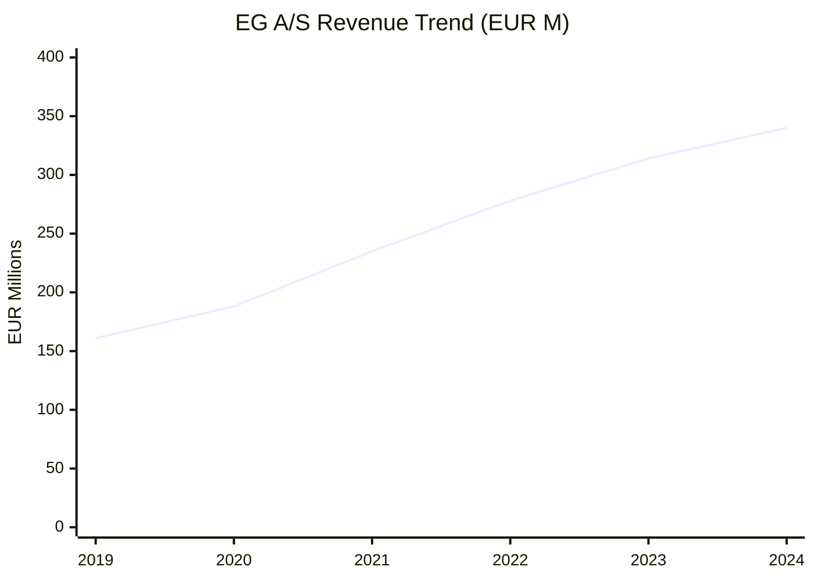
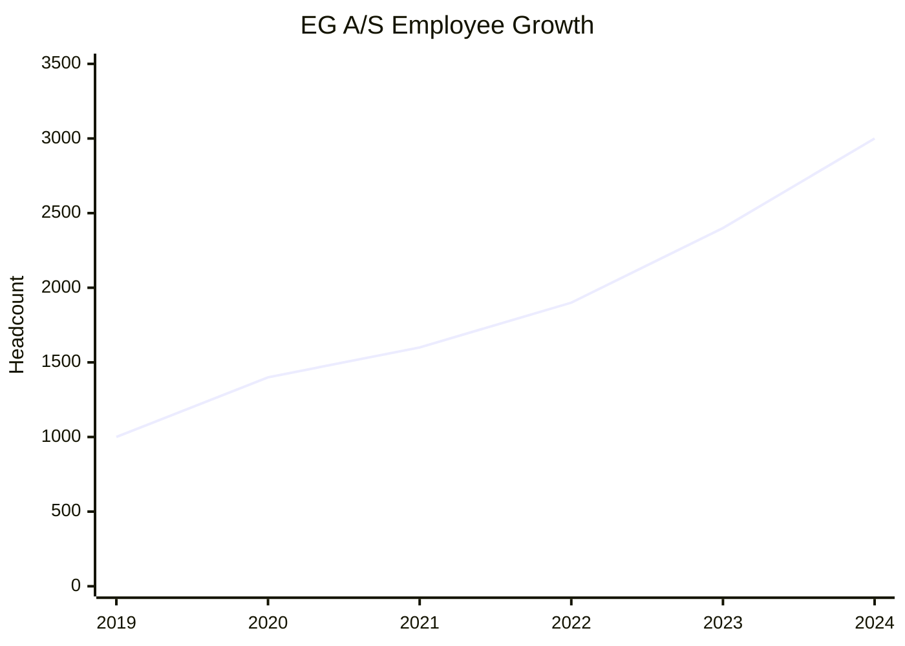
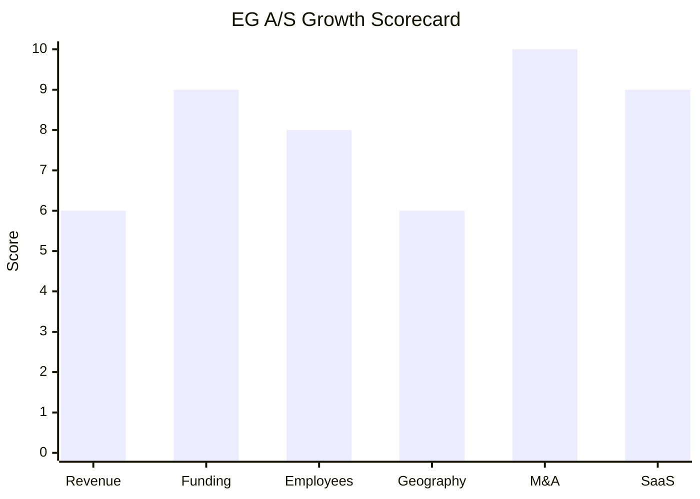

# Financial & Growth Deep-Dive - EG A/S (Utility Division)

**Research Date**: 2026-02-15
**Data Availability**: High (PE-backed private company with published annual reports since 2022; Francisco Partners disclosures; extensive press releases)

---

### Revenue Timeline

All figures represent **EG A/S group-level** revenue. The Utility division (~240 of 3,000+ employees, ~8% of headcount) does not report separately. Utility-specific revenue is estimated where noted.

| Year | Revenue | Currency | EUR Equivalent | YoY Growth | Source | Confidence |
| --- | --- | --- | --- | --- | --- | --- |
| 2025 (est.) | DKK 2,800-2,900M | DKK | EUR 375-389M | 10-15% | EG outlook statement (2024 annual report) | Estimated |
| 2024 | DKK 2,539M | DKK | EUR 340M | 8.2% | Annual report 2024 | Confirmed |
| 2023 | DKK 2,346M | DKK | EUR 314M | 13.0% | Annual report 2023 | Confirmed |
| 2022 | DKK 2,077M | DKK | EUR 278M | 18.3% | Annual report 2022 | Confirmed |
| 2021 | ~DKK 1,755M | DKK | ~EUR 235M | ~25% (est.) | Calculated (2022 rev / 1.183) | Estimated |
| 2020 | ~DKK 1,400M | DKK | ~EUR 188M | ~17% (est.) | Estimated from CAGR trend; 8 acquisitions completed | Estimated |
| 2019 | ~DKK 1,200M | DKK | ~EUR 161M | Baseline | Estimated from "nearly doubled revenue" to 2023 + DKK 3.7B acquisition price (~3x rev) | Estimated |

**Currency note**: DKK is pegged to EUR via ERM II at ~7.46 DKK/EUR. Rate is stable across all years.

**Revenue CAGR (3yr, 2021-2024)**: ~13.1%
**Revenue CAGR (5yr, 2019-2024)**: ~16.2%

#### Revenue Trend Chart

---

### Profitability

| Data Point | Value | Source | Confidence |
| --- | --- | --- | --- |
| EBITDA (2024) | DKK 856M (~EUR 115M) | Annual report 2024 | Confirmed |
| EBITDA Margin (2024) | 33.7% | Annual report 2024 | Confirmed |
| EBITDA (2023) | DKK 823M (~EUR 110M) | Annual report 2023 | Confirmed |
| EBITDA Margin (2023) | 35.1% | Annual report 2023 | Confirmed |
| EBITDA (2022) | DKK 745M (~EUR 100M) | Annual report 2022 | Confirmed |
| EBITDA Margin (2022) | 35.9% | Annual report 2022 | Confirmed |
| EBITDA Growth (2023-2024) | 4.0% | Annual report 2024 | Confirmed |
| EBITDA Growth (2022-2023) | 10.5% | Annual report 2023 | Confirmed |
| Net Profit / Loss | Not disclosed (private company) | N/A | Unknown |
| Recurring Revenue % (2024) | 86.1% | Annual report 2024 | Confirmed |
| Recurring Revenue % (2023) | 83.7% (84% rounded) | Annual report 2023 | Confirmed |
| Recurring Revenue % (2022) | 81.9% | Annual report 2022 | Confirmed |
| Revenue per Employee (2024) | ~EUR 113K (DKK 846K) | Calculated: 2,539M / 3,000 | Estimated |
| Revenue per Employee (2022) | ~EUR 146K (DKK 1,093K) | Calculated: 2,077M / 1,900 | Estimated |

**Margin trend**: EBITDA margin declining from 35.9% (2022) to 33.7% (2024) as EG invests heavily in restructuring, India development center scaling, and acquisition integration. Revenue per employee dropped due to rapid India hiring at lower cost points. This is a deliberate investment phase, not structural margin erosion.

---

### Funding & Investment History

| Date | Round | Amount | Lead Investor(s) | Valuation | Source | Confidence |
| --- | --- | --- | --- | --- | --- | --- |
| Jun 2019 | PE Acquisition | DKK 3.7B (~EUR 496M) | Francisco Partners | DKK 3.7B (enterprise) | franciscopartners.com, dnbcarnegie.com | Confirmed |
| Nov 2023 | Growth Equity | EUR 400M (DKK 2,983M) | Sofina + LGT Capital Partners | Undisclosed (implied >EUR 1B) | franciscopartners.com, global.eg.dk | Confirmed |

**Total Raised**: EUR 400M equity + DKK 3.7B acquisition = ~EUR 896M total capital deployed
**Latest Valuation**: Undisclosed, but the EUR 400M round (EUR 150M primary + EUR 250M secondary) at minority stakes implies enterprise value well above EUR 1B (Nov 2023). Given subsequent 2024 growth, likely EUR 1.2-1.5B range.
**Current Investors**: Francisco Partners (majority), Sofina (minority since Nov 2023), LGT Capital Partners (minority since Nov 2023)
**War Chest Signals**: EUR 150M of the Nov 2023 round was primary capital earmarked specifically for acquisitions. CEO signaled in mid-2025 intention to "ramp up acquisition activities" after a consolidation period. Significant dry powder available.

---

### Employee Timeline

| Year | Headcount | YoY Growth | Source | Confidence |
| --- | --- | --- | --- | --- |
| 2024 | 3,000+ | ~25% | Annual report 2024 | Confirmed |
| 2023 | 2,400+ | ~26% | Annual report 2023 | Confirmed |
| 2022 | 1,900+ | ~19% (est.) | Annual report 2022 | Confirmed |
| 2021 | ~1,600 | ~14% (est.) | Estimated from growth trajectory | Estimated |
| 2020 | ~1,400 | ~17% (est.) | Estimated; 8 acquisitions completed | Estimated |
| 2019 | 1,000+ | Baseline | Francisco Partners acquisition announcement | Confirmed |

**Employee CAGR (3yr, 2021-2024)**: ~23%
**Employee CAGR (5yr, 2019-2024)**: ~25%

**India Operations (EGDK India Pvt Ltd, Mangaluru)**:
- 2019: ~20 employees
- 2024-2025: 850+ employees (EG's largest engineering center outside Europe)
- Handles full product lifecycle: development, testing, UX, AI, customer support
- Annual turnover: ~INR 100 crore (~EUR 11M)
- Source: economictimes.com, thehindubusinessline.com (Confirmed)

**Current Open Positions**: ~61 worldwide (LinkedIn, Feb 2026)
**AI/ML/Data Science Roles**: AI Product Owner (Mangaluru), leading AI team with data scientists and ML Ops engineers using AWS LLMs
**Hiring Hotspots**: Mangaluru (India), Denmark, Sweden, Norway

#### Employee Growth Chart

---

### Geographic & Market Expansion

| Year | Expansion Event | Details | Source | Confidence |
| --- | --- | --- | --- | --- |
| 2019 | EGDK India established | Mangaluru development center acquired as ~20-person team | economictimes.com | Confirmed |
| 2022 | Ørn Software (Norway) | Acquired 160-employee Norwegian SaaS provider; expanded NO presence in real estate & energy | franciscopartners.com | Confirmed |
| 2022 | Poland operations | Existing development office; maintained across period | annual report 2022 | Confirmed |
| 2023 | PatientSky (Norway) | Norwegian healthcare SaaS acquisition; deepened NO presence | franciscopartners.com | Confirmed |
| 2023 | Vattenfall contract (NO/DK) | EG Xellent D365 for billing across DK and NO with FI/SE expansion potential | global.eg.dk | Confirmed |
| 2024 | Timma (Finland) | Acquired Finnish SaaS company; 10,000+ customers across FI, DK, NO | global.eg.dk | Confirmed |
| 2024 | India scaling to 850+ | Mangaluru GCC scaled to 850 staff, supports 14 business units | economictimes.com | Confirmed |
| 2024 | Mestro (Sweden) | Acquired Swedish listed energy optimization SaaS | eg.se | Confirmed |
| 2025 | Bright Energy (Sweden) | Acquired AI-driven energy platform for Nordic utility customers | egsoftware.com | Confirmed |
| 2025 | Utility Nordic expansion | Active expansion into Norway and Finland utility markets with 240 specialists | egsoftware.com | Confirmed |

**International Revenue %**: Not disclosed separately; EG operates across DK (primary), SE, NO, FI, PL, IN
**Expansion Trajectory**: Systematic Nordic consolidation via acquisition, supplemented by India-based engineering scale-up. EG's strategy is to become the dominant vertical software platform in every Nordic country it enters. No evidence of expansion beyond Nordics + India.

---

### M&A Activity

| Date | Target | Deal Size | Capability Gained | Strategic Rationale | Source | Confidence |
| --- | --- | --- | --- | --- | --- | --- |
| Jun 2019 | EG A/S (by Francisco Partners) | DKK 3.7B | Entire Nordic vertical software platform | PE buy-and-build platform creation | franciscopartners.com | Confirmed |
| 2020 | 8 acquisitions (inc. Holte AS, Sigma Estimates) | Undisclosed | Construction, healthcare, public sector | Nordic vertical market consolidation | global.eg.dk | Confirmed |
| 2021 | Multiple acquisitions | Undisclosed | Various verticals | Continued buy-and-build | franciscopartners.com | Confirmed |
| Aug 2022 | Ørn Software Holding AS (NO) | Undisclosed | Real estate, energy management, sustainability SaaS; 160 employees | Norwegian market entry + energy management capability | franciscopartners.com | Confirmed |
| 2022 | 4 additional acquisitions | Undisclosed | Various Nordic verticals | Consolidation | annual report 2022 | Confirmed |
| Apr 2023 | PatientSky SaaS Norway | Undisclosed | Healthcare SaaS (Hove, Infodoc, PatientSky Clinic/App) | Norwegian healthcare market | franciscopartners.com | Confirmed |
| 2023 | 5 additional acquisitions | Undisclosed | Various Nordic verticals | Consolidation | annual report 2023 | Confirmed |
| Feb 2024 | Mestro AB (SE, listed) | Undisclosed | AI anomaly detection, real estate energy optimization; 15,000+ properties | Swedish energy SaaS + AI capability | eg.se | Confirmed |
| 2024 | Timma Oy (FI) | Undisclosed | Beauty/wellness SaaS; 10,000+ customers | Finnish market entry | global.eg.dk | Confirmed |
| 2024 | Vigilo, Easoft, Zeroni | Undisclosed | Various verticals | Nordic consolidation | annual report 2024 | Confirmed |
| Dec 2025 | Bright Energy AB (SE) | Undisclosed | AI consumption forecasting, VPP/flexibility, customer engagement; hundreds of thousands of users | AI energy management for utility division | egsoftware.com | Confirmed |

**Total Acquisitions**: 40+ since Francisco Partners acquisition (Jun 2019)
**Acquisition pace**: ~5-8 per year consistently
**Divestitures**: None identified
**M&A Pattern**: Classic PE buy-and-build. Systematic Nordic vertical market consolidation. Acquires market leaders in specific verticals (construction, healthcare, utility, beauty), then cross-sells and integrates. Recent shift toward AI-capability acquisitions (Mestro, Bright Energy) signals evolution from pure geographic/market consolidation to technology capability building.

---

### SaaS Transition Metrics

| Data Point | Value | Source | Confidence |
| --- | --- | --- | --- |
| Deployment Model | Hybrid (Cloud + On-premise) | egsoftware.com, global.eg.dk | Confirmed |
| Cloud Revenue % (current) | Not separately disclosed | N/A | Unknown |
| Recurring Revenue % (2024) | 86.1% | Annual report 2024 | Confirmed |
| Recurring Revenue % (2023) | 83.7% | Annual report 2023 | Confirmed |
| Recurring Revenue % (2022) | 81.9% | Annual report 2022 | Confirmed |
| Recurring Revenue Growth (2024) | 11.3% total, 5.3% organic | Annual report 2024 | Confirmed |
| Recurring Revenue Growth (2023) | 15.5% total, 5.8% organic | Annual report 2023 | Confirmed |
| Gross Retention Rate (2024) | 96% | Annual report 2024 | Confirmed |
| Gross Retention Rate (2022) | 98% | Annual report 2022 | Confirmed |
| Platform Stack | Microsoft Dynamics 365, Azure, RESTful APIs | global.eg.dk, developer.enerkey.com | Confirmed |
| Migration Status | In-progress; hybrid model with increasing cloud share | egsoftware.com | Confirmed |

**Trajectory**: Recurring revenue share increasing ~2 percentage points per year (81.9% -> 83.7% -> 86.1%), demonstrating successful and steady SaaS transition. The 5-6% organic recurring growth indicates genuine platform stickiness, not just acquisition-driven growth. Gross retention rate of 96-98% is best-in-class for vertical SaaS.

---

### Growth Scorecard

| Dimension | Score (1-10) | Evidence Summary |
| --- | --- | --- |
| Revenue Growth | 6 | 3yr CAGR ~13.1% (2021-2024); 5yr CAGR ~16.2%; slowing from 18.3% (2022) to 8.2% (2024) as base grows |
| Funding Momentum | 9 | EUR 400M raised Nov 2023; EUR 150M earmarked for acquisitions; Francisco Partners majority + Sofina/LGT minority |
| Employee Growth | 8 | 3yr CAGR ~23%; 1,000 (2019) to 3,000+ (2024); India center 20 to 850+ in 5 years |
| Geographic Expansion | 6 | Active NO/FI utility expansion; India dev center; but all within existing Nordic footprint + India, no intercontinental market expansion |
| M&A Activity | 10 | 40+ acquisitions since 2019 (~7/year); 5 in 2024, Bright Energy in 2025; transformative buy-and-build machine with dedicated acquisition war chest |
| SaaS Maturity | 9 | 86.1% recurring revenue (2024), 96% gross retention, Microsoft Azure/D365 stack, steady 2pp/year increase |
| **COMPOSITE SCORE** | **8.0** | **Rocket** |

**Classification Thresholds**:

- **Rocket** (avg 7.0-10.0): Explosive growth, heavy investment, market disruptor
- **Riser** (avg 5.0-6.9): Strong growth signals, investing in future, accelerating
- **Steady** (avg 3.0-4.9): Stable but not transforming, evolutionary
- **Dinosaur** (avg 1.0-2.9): Flat or declining, legacy mode, no visible investment

#### Growth Scorecard Radar

> EG's fingerprint shows a classic PE buy-and-build pattern: extreme M&A activity (10/10) and massive funding (9/10) fuel growth, while the underlying organic revenue growth is more moderate (6/10). The very high SaaS maturity (9/10) and strong employee growth (8/10) indicate a well-executing platform company. Geographic expansion scores lower (6/10) because EG remains purely Nordic-focused -- but within that geography, they are aggressively consolidating every vertical.

---

### Utility Division Financial Estimates

Since EG's Utility division does not report separately, these proxy estimates provide an order of magnitude:

| Data Point | Estimate | Method | Confidence |
| --- | --- | --- | --- |
| Utility Division Revenue | ~EUR 27-34M (DKK 200-250M) | 240/3,000 headcount ratio x group revenue; adjusted for higher-value enterprise contracts | Estimated (proxy) |
| Utility Division Employees | ~240 specialists | egsoftware.com (confirmed) | Confirmed |
| Revenue per Utility Employee | ~EUR 113-142K | Group average or industry benchmark | Estimated |
| Notable Utility Customers | Vattenfall, E.ON, Fortum, Norlys, Skellefteå Kraft | egsoftware.com, global.eg.dk | Confirmed |
| Utility Product Count | 7+ (Zynergy, Xellent D365, EnerKey, Mestro, Omega, Bright Energy, Authorisations) | egsoftware.com | Confirmed |

---

### Key Insights for Eneve

1. **Scale Asymmetry**: EG A/S group revenue (EUR 340M) dwarfs Eneve. Even the Utility division alone (~EUR 30M, 240 people) is a substantial operation backed by EUR 400M in recent investment capital.

2. **Acquisition Machine Risk**: EG's 40+ acquisition track record and dedicated EUR 150M war chest means a Dutch market entry via acquisition is plausible at any time. They could buy a Dutch player rather than build Dutch protocol expertise.

3. **AI Investment Pattern**: The Bright Energy acquisition (Dec 2025) mirrors exactly what Eneve should consider -- bolting AI capabilities onto an existing CIS/billing platform. EG moved faster.

4. **Recurring Revenue Moat**: 86.1% recurring revenue with 96% gross retention creates extreme customer stickiness. Displacing EG from existing Nordic utility customers is nearly impossible.

5. **India Arbitrage**: The 850-person Mangaluru center gives EG a structural cost advantage in development capacity that smaller competitors cannot match.

---

### Sources

- EG A/S Annual Report 2024: egsoftware.com/assets/annual-report-2024-eg-as_hd.pdf
- EG A/S Annual Report 2023: eg.dk/siteassets/media/files/about-eg/annualreport2023-eg.pdf
- EG A/S Annual Report 2022: eg.dk/siteassets/media/files/about-eg/annualreport2022-eg-as.pdf
- Francisco Partners - EG acquisition: franciscopartners.com/media/francisco-partners-completes-acquisition-of-eg
- Francisco Partners - EUR 400M round: franciscopartners.com/media/eg-broadens-investor-base-with-eur-400m-investment-round
- EG Utility Nordic strategy: egsoftware.com/global/ressource/utility-at-eg-is-focusing-on-the-entire-nordic-region
- EG Bright Energy acquisition: egsoftware.com/global/ressource/eg-acquires-bright-energy-and-strengthens-its-position
- EG Mestro acquisition: eg.se/nyheter/2024/februari/eg-offers-to-acquire-mestro-ab/
- EG Ørn Software acquisition: franciscopartners.com/media/eg-closes-acquisition-of-rn-software-holding-as
- EG India (Mangaluru): economictimes.indiatimes.com (Danish IT firm EGDK leaps from 20 to 850 staff)
- DNB Carnegie - DKK 3.7B acquisition: dnbcarnegie.com/transaction/acquisition-of-eg-as
- Vattenfall contract: global.eg.dk/news/2023/march/vattenfall-signs-deal-to-use-eg-xellent-d365/
- EG Careers: global.eg.dk/about-eg/career
- Growjo estimate: growjo.com/company/EG_A%2FS
