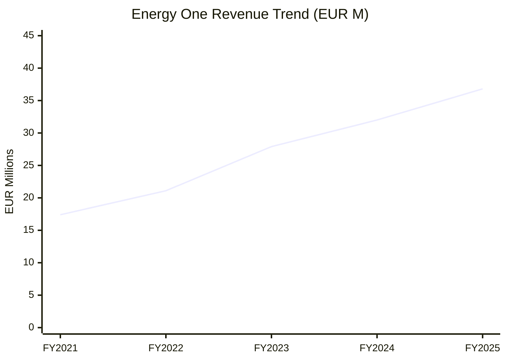
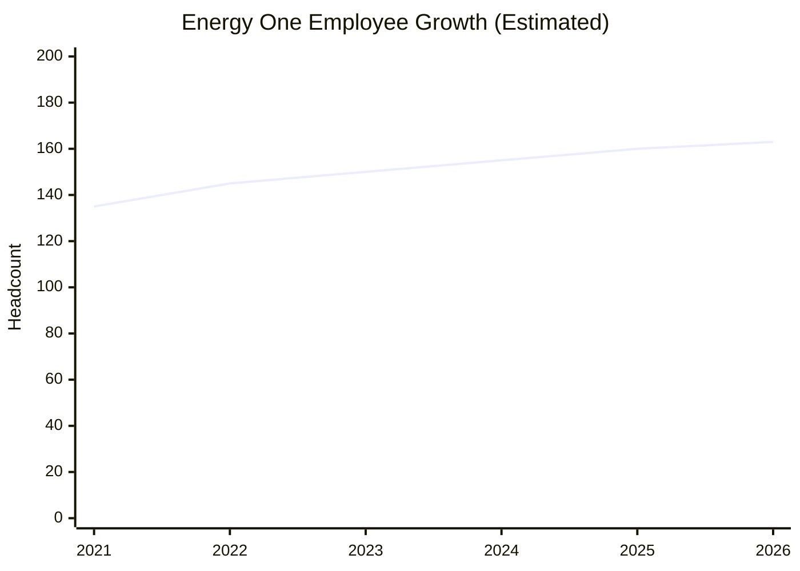
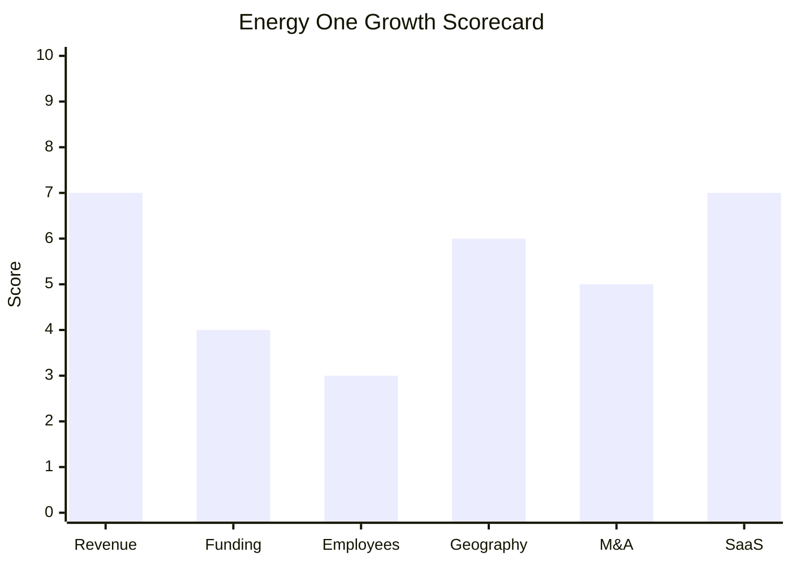

# Financial & Growth Deep-Dive - Energy One Limited

**Research Date**: 2026-02-15
**Data Availability**: High (ASX-listed public company since 2007; annual reports, Appendix 4E filings, investor presentations publicly available)

---

### Revenue Timeline

| Year | Revenue | Currency | EUR Equivalent | YoY Growth | Source | Confidence |
| --- | --- | --- | --- | --- | --- | --- |
| FY2026 (est.) | AUD 72.7M | AUD | ~EUR 43.6M | ~18% | Stockopedia analyst consensus | Estimated |
| FY2025 | AUD 61.36M | AUD | ~EUR 36.8M | +17.0% | FY2025 Annual Report (ASX) | Confirmed |
| FY2024 | AUD 52.46M | AUD | ~EUR 32.0M | +16.7% | FY2024 Annual Report (ASX) | Confirmed |
| FY2023 | AUD 44.95M | AUD | ~EUR 27.9M | +38.7% | FY2023 Annual Report (ASX) | Confirmed |
| FY2022 | AUD 32.40M | AUD | ~EUR 21.1M | +17.2% | FY2022 Annual Report (ASX) | Confirmed |
| FY2021 | AUD 27.65M | AUD | ~EUR 17.4M | -- | FY2021 Annual Report (ASX) | Confirmed |

**Revenue CAGR (3yr, FY2022-FY2025)**: ~23.7%
**Revenue CAGR (4yr, FY2021-FY2025)**: ~22.1%

**Note**: EUR equivalents use approximate annual average AUD/EUR exchange rates for each fiscal year (FY ends 30 June). FY2023 spike (+38.7%) includes first full-year contribution from EGSSIS (acquired Nov 2021).

#### Revenue Trend Chart

### Profitability

| Data Point | Value | Source | Confidence |
| --- | --- | --- | --- |
| EBITDA (FY2025) | ~AUD 16.1M | Derived from EV/EBITDA 33.1x (Stockopedia) | Estimated |
| EBITDA Margin (FY2025) | ~26% | Derived (EBITDA / Revenue) | Estimated |
| Operating Margin (FY2025) | 15.63% | Stockopedia | Confirmed |
| Gross Margin | ~63% | Rask Media analyst report (blended software + services) | Confirmed |
| Net Profit (FY2025) | ~AUD 4.5M | Derived from 74% NPAT growth + H1 FY2025 data | Estimated |
| Net Profit (FY2024) | ~AUD 2.6M | Derived (FY2025 NPAT / 1.74) | Estimated |
| Net Profit (FY2023) | ~AUD 3.1M | Derived from EPS AUD 0.10 x 31.2M shares | Estimated |
| Net Profit (FY2022) | ~AUD 4.4M | Derived from EPS AUD 0.14 x 31.2M shares | Estimated |
| Recurring Revenue % | ~90% | Rask Media; multi-year subscriptions + managed services | Confirmed |
| SaaS Revenue % | Not separately disclosed | -- | Unknown |
| Net Revenue Retention | ~104% (H1 FY2025) | Company H1 FY2025 earnings call | Confirmed |
| Revenue per Employee | ~AUD 376K (~EUR 226K) | Calculated: AUD 61.36M / ~163 employees | Estimated |

**Profitability Context**: FY2024 profitability was depressed by the August 2023 cyber attack on corporate systems (Australia & UK), which required CyberCX engagement, system remediation, and disabled corporate-to-customer system links. FY2025 represents the recovery trajectory with 74% NPAT growth.

### Funding & Investment History

| Date | Round | Amount | Lead Investor(s) | Valuation | Source | Confidence |
| --- | --- | --- | --- | --- | --- | --- |
| 2007 | IPO (ASX listing) | Undisclosed | -- | -- | ASX records | Confirmed |
| Ongoing | Organic cash flow | Self-funded | -- | Market Cap ~AU$525M (Apr 2025) | ASX market data | Confirmed |

**Total Raised**: No external funding rounds post-IPO; growth funded through operating cash flow and debt
**Latest Valuation**: Market Cap ~AU$525M / ~EUR 315M (April 2025); peaked with share price up ~198% over prior year
**Current Investors**: Ian Ferrier (23.35%), Sonpine Pty Ltd (16.37%), Vaughan Busby (11.28%), remainder institutional/retail
**War Chest Signals**: Net debt decreased from AUD 14.2M (Jun 2024) to AUD 13.0M (Dec 2024). Free cash flow at strongest level since June 2021 (~AUD 1.2M in H1 FY2025). Company actively evaluating "profitable, synergistic acquisitions" per FY2025 annual report. No dividends paid (capital preserved for growth and debt reduction).

**Key Share Price Data**:
- Current: ~AUD 17 (Jan-Feb 2026)
- 12-month performance: +123% to +198% (strong re-rating)
- Shares outstanding: ~31.17M
- Enterprise Value: ~AU$535M (~EUR 321M)

### Employee Timeline

| Year | Headcount | YoY Growth | Source | Confidence |
| --- | --- | --- | --- | --- |
| 2026 (current) | ~163 | ~+2% | LeadIQ employee directory (Feb 2026) | Estimated (directory may undercount) |
| 2025 (FY end) | ~160 | ~+3% | Estimated from directory + annual report signals | Estimated |
| 2024 | ~155 | ~+3% | Estimated; post-cyber recovery, pre-hiring push | Estimated |
| 2023 | ~150 | ~+5% | Estimated; post-EGSSIS integration complete | Estimated |
| 2022 | ~145 | ~+8% | Estimated; first full year with EGSSIS team | Estimated |
| 2021 | ~135 | +10-15% | Estimated; EGSSIS acquired Nov 2021 (~10-12 staff) | Estimated |

**Employee CAGR (3yr, 2022-2025)**: ~3% (estimated)
**Current Open Positions**: Not quantified; company website and LinkedIn indicate selective hiring
**Hiring Hotspots**: Europe (France, UK); Australia (Sydney/Adelaide); evaluating US expansion

**Employee Geographic Split (Feb 2026, from LeadIQ)**:
- Europe: 84 (France 37, UK 33, Belgium 12, Ireland 1, Spain 1)
- Oceania: 75 (Australia 72, New Zealand 3)
- North America: 4 (United States)

**Note**: Employee headcount is estimated for historical years; Energy One does not prominently disclose headcount in annual reports. Growth is primarily acquisition-driven (Contigo 2018 added ~30-40, eZ-nergy 2020 added ~35-40, EGSSIS 2021 added ~10-12). Organic hiring has been modest, consistent with the "consolidation and margin improvement" strategy described in FY2025 report.

#### Employee Growth Chart

### Geographic & Market Expansion

| Year | Expansion Event | Details | Source | Confidence |
| --- | --- | --- | --- | --- |
| 2018 | UK market entry | Acquired Contigo Software Limited (Solihull, UK) | Energy One corporate history | Confirmed |
| 2020 | France market entry | Acquired eZ-nergy SAS (France); gas + power operations | Energy One corporate history | Confirmed |
| 2021 | Belgium market entry | Acquired EGSSIS NV (Belgium) for EUR 4.25M | ASX announcement, press release | Confirmed |
| 2022 | European brand unification | Contigo + eZ-nergy + EGSSIS rebranded as Energy One | energyone.com press release | Confirmed |
| 2024-2025 | Central/Eastern Europe | Expansion into new CEE markets; 30 new European customers in 12 months | FY2025 Annual Report, CEO designate commentary | Confirmed |
| 2025 | Full European coverage target | Plans to cover all of Europe by end of 2026 | H1 FY2025 investor presentation | Confirmed |
| 2025 | US market evaluation | Board and Executive actively evaluating US market entry | FY2025 Annual Report | Confirmed |

**International Revenue %**: European operations generated AUD 16.2M in H1 FY2025 (17% growth), representing roughly ~53% of half-year revenue. Australian operations provided ~47%.
**Expansion Trajectory**: Acquisition-led European entry (2018-2021) now transitioning to organic market expansion across continental Europe. The "follow-the-sun" operational model (UK contracts, French power operations, Belgian gas operations, Adelaide night shift) enables serving multi-country customers from existing offices. US market is the next declared frontier.

### M&A Activity

| Date | Target | Deal Size | Capability Gained | Strategic Rationale | Source | Confidence |
| --- | --- | --- | --- | --- | --- | --- |
| Dec 2018 | Contigo Software Ltd (UK) | Undisclosed | enTrader ETRM, UK energy trading, 24/7 managed services | European market entry; power + gas trading software | energyone.com history | Confirmed |
| Jun 2020 | eZ-nergy SAS (France) | ~EUR 4M (AUD 6.41M) | French gas/power scheduling, nominations, operations | Continental European expansion; 44-45 customers across 10 countries | ComTech Advisory; ASX announcement | Confirmed |
| Nov 2021 | EGSSIS NV (Belgium) | EUR 4.25M | Belgian gas operations, TSO communication | Benelux coverage; expected AUD 5.9M income + AUD 1M EBITDA (FY23) | ASX announcement; press release | Confirmed |

**Divestitures**: None
**M&A Pattern**: Disciplined geographic "tuck-in" acquisition strategy -- three small-to-mid acquisitions over 3 years to build pan-European footprint. Each acquisition added a national market + specific commodity/capability. All three have been integrated and rebranded under the Energy One name (completed Dec 2022). The company is actively evaluating further acquisitions ("profitable, synergistic deals") focused on home market share and US entry, but no new deals announced since 2021.

### SaaS Transition Metrics

| Data Point | Value | Source | Confidence |
| --- | --- | --- | --- |
| Deployment Model | Hybrid (SaaS + on-premise) | Company website; Rask Media | Confirmed |
| Cloud Revenue % (current) | Not separately disclosed | -- | Unknown |
| Recurring Revenue % | ~90% | Rask Media analyst report | Confirmed |
| Recurring Revenue % (trend) | Stable at ~90% | Multi-year investor presentations | Estimated |
| ARR Growth | +18% (trailing 12 months to Dec 2024) | H1 FY2025 earnings call | Confirmed |
| Net Revenue Retention | ~104% (H1 FY2025) | H1 FY2025 earnings call | Confirmed |
| Gross Margin | ~63% | Rask Media (blended software + managed services) | Confirmed |
| Platform Stack | Not fully disclosed; modernized for high-frequency trading | Company announcements | Estimated |
| Migration Status | In-progress (hybrid; increasing SaaS proportion) | Product pages; annual report signals | Estimated |

**SaaS Context**: Energy One's 90% recurring revenue is strong, but the recurring base is split between software subscriptions (higher margin) and managed services contracts (labor-intensive, ~63% blended gross margin). This is not a pure SaaS model -- the managed services component (24/7 "follow-the-sun" operations) is inherently people-intensive. The company is unlikely to reach 80%+ gross margins without either scaling the software component disproportionately or significantly automating managed services.

### Growth Scorecard

| Dimension | Score (1-10) | Evidence Summary |
| --- | --- | --- |
| Revenue Growth | 7 | 3yr CAGR ~24% (boosted by EGSSIS full-year in FY2023); organic growth ~17% in FY2025 |
| Funding Momentum | 4 | Self-funded from operations; no external rounds post-IPO; profitable but no fresh investment fuel |
| Employee Growth | 3 | CAGR ~3% (estimated); acquisition-driven historically; modest organic hiring |
| Geographic Expansion | 6 | Three countries added via M&A (2018-2021); active CEE expansion; 30+ countries; US evaluation |
| M&A Activity | 5 | Three acquisitions in 2018-2021; fully integrated; actively evaluating new deals but none since 2021 |
| SaaS Maturity | 7 | 90% recurring revenue; 104% NRR; hybrid SaaS/on-prem; 63% gross margin (managed services dilution) |
| **COMPOSITE SCORE** | **5.3** | **Riser -- strong recurring revenue base with solid organic growth, but modest hiring and no fresh capital** |

**Classification Thresholds**:

- **Rocket** (avg 7.0-10.0): Explosive growth, heavy investment, market disruptor
- **Riser** (avg 5.0-6.9): Strong growth signals, investing in future, accelerating
- **Steady** (avg 3.0-4.9): Stable but not transforming, evolutionary
- **Dinosaur** (avg 1.0-2.9): Flat or declining, legacy mode, no visible investment

#### Growth Scorecard Radar

> The scorecard reveals Energy One's strengths (revenue growth, SaaS maturity) alongside clear vulnerabilities (low employee growth, self-funded model with no acquisition war chest). The company is a disciplined, profitable grower -- not a rocket, but not a dinosaur either. The key risk is whether self-funded organic growth (17%) can keep pace with VC-backed competitors growing 30-50%+ annually.

---

### Key Insights for Eneve Competitive Intelligence

1. **Profitable but modestly resourced**: ~163 employees generating AUD 61M revenue (~AUD 376K/employee) is efficient but limits capacity for large R&D bets or rapid market expansion.

2. **Acquisition playbook is proven but dormant**: Three successful tuck-in acquisitions (2018-2021) created a pan-European platform. The FY2025 annual report signals appetite for more, but net debt of AUD 13M and free cash flow of ~AUD 1.2M (H1) constrain deal capacity without capital raising.

3. **Cyber attack was a speed bump, not a detour**: The August 2023 cyber incident impacted FY2024 profitability but the company recovered strongly in FY2025 with record H1 results.

4. **No AI play visible**: Energy One ranks 23rd of 26 competitors on AI adoption (LOW signal). The 24/7 managed services model could benefit enormously from AI automation but no investments are publicly announced.

5. **90% recurring but 63% gross margin**: The managed services component provides stickiness (NRR 104%) but dilutes margins. Pure SaaS competitors achieve 75-85% gross margins.

6. **Australia is the cash cow**: ~50% market share in Australian energy trading. European revenue growing faster (17% in H1 FY2025) but from a smaller base.

7. **CEO transition underway**: Ben Tranier (CEO Designate) grew European revenue 20% and added 30 customers. Leadership change could accelerate or disrupt strategy.

---

**Sources**: Energy One FY2021-FY2025 Annual Reports (ASX), H1 FY2025 Half-Year Results Presentation, Stockopedia (ASX:EOL), Simply Wall St, Rask Media analyst coverage, LeadIQ employee directory, ComTech Advisory, company website (energyone.com), ASX market data.
