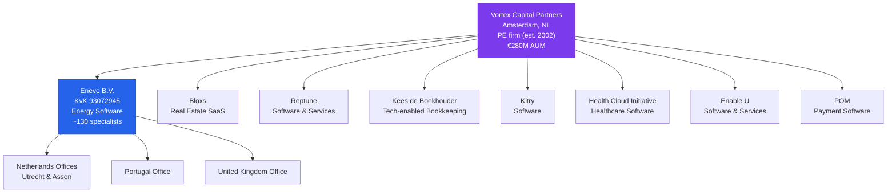
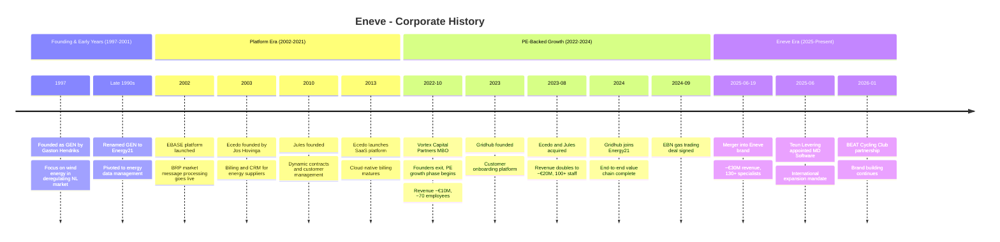
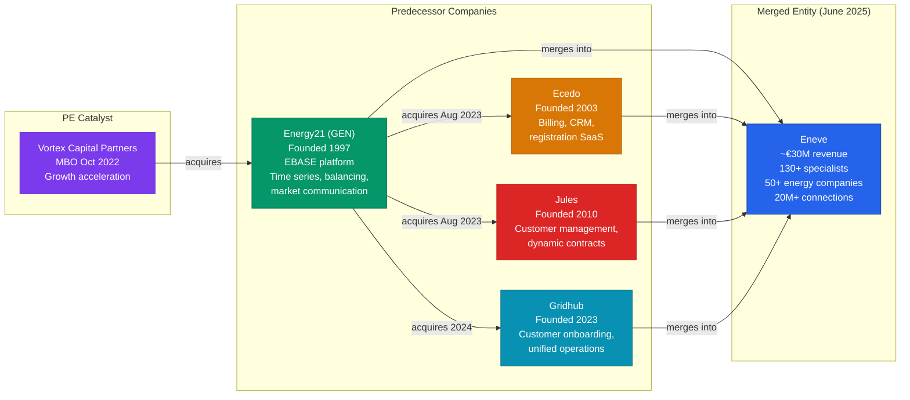

# Corporate History - Eneve

**Research Date**: 2026-02-15
**Genealogy Confidence**: High (based on company website timeline, PE firm press releases, acquisition announcements, and trade register references)

---

## Current Ownership & Key Parties

| Stakeholder | Role | Stake % | Type | Since | Source |
|---|---|---|---|---|---|
| Vortex Capital Partners | Majority shareholder | Majority (undisclosed) | PE | 2022 | [Vortex press release](https://vortexcp.com/news/software-and-services-provider-energy21-acquired-by-management-and-vortex/) |
| Management team | Co-investors (MBO) | Minority (undisclosed) | Management | 2022 | [Vortex press release](https://vortexcp.com/news/software-and-services-provider-energy21-acquired-by-management-and-vortex/) |
| Gaston Hendriks | Co-founder (exited majority, retained role) | Unknown | Founder | 1997 | [TheOrg](https://theorg.com/org/energy21/org-chart/gaston-hendriks) |

**Board of Directors / Leadership Team**:

| Name | Role | Represents | Background | Source |
|---|---|---|---|---|
| Michiel Kuiper | CEO | Management/Vortex | Energy software leadership | [Eneve press release](https://eneve.com/news/energy-software-companies-energy21-ecedo-jules-and-gridhub-join-forces) |
| Teun Levering | Managing Director Software | Management | SaaS, product development, business transformation | [Vortex announcement](https://vortexcp.com/news/ceo-founder-day-2025-copy/) |
| Gaston Hendriks | Co-founder / Leadership Team | Founder | MSc Electrical Engineering (TU Eindhoven), co-founder Quantoz Blockchain | [TheOrg](https://theorg.com/org/energy21/org-chart/gaston-hendriks) |

**Corporate Structure** (Mermaid diagram):



Vortex Capital Partners has invested in 25+ platform companies and executed 75+ add-on acquisitions, with 8 successful exits. Eneve is their only energy sector investment -- the rest are general software/tech platforms. This means Eneve is not part of an energy-sector roll-up strategy but rather a PE software portfolio play.

---

## Origin Story

| Data Point | Value | Source | Confidence |
|---|---|---|---|
| Founded | April 1, 1997 | [TheOrg](https://theorg.com/org/energy21/org-chart/gaston-hendriks) | Confirmed |
| Original Name | GEN | [CBInsights](https://www.cbinsights.com/company/energy21-1) | Confirmed |
| Renamed to | Energy21 | [CBInsights](https://www.cbinsights.com/company/energy21-1), [Eneve About](https://eneve.com/about-eneve) | Confirmed |
| Founders | Gaston Hendriks (+ co-founders, names unknown) | [TheOrg](https://theorg.com/org/energy21/org-chart/gaston-hendriks) | Confirmed (partial) |
| Original Mission | Advance wind energy; evolved to energy data & decision support | [Eneve About](https://eneve.com/about-eneve) | Confirmed |
| Original Product | Energy data management for wind energy sector | [Eneve About](https://eneve.com/about-eneve) | Confirmed |
| First Market | Netherlands | [Energy21 About](https://energy21.com/en/about/) | Confirmed |
| EBASE Launch | 2002 -- processing market messages, e-programs, t-programs for BRPs | [Eneve About](https://eneve.com/about-eneve) | Confirmed |
| HQ | Utrecht, Netherlands | [Energy21 About](https://energy21.com/en/about/) | Confirmed |

Energy21 (originally GEN) was founded on April 1, 1997, by Gaston Hendriks -- an electrical engineer from Eindhoven University of Technology -- to advance wind energy in the deregulating Dutch energy market. The company pivoted from wind energy services to energy data management software as the Dutch energy market liberalized and needed tools to process the new market communication protocols. In 2002, EBASE went live as a platform for Balance Responsible Parties (BRPs) to process market messages and generate e-programs and t-programs, establishing the core product that still anchors the company today.

---

## Corporate Identity Changes

| # | Date | From | To | Reason | Source |
|---|---|---|---|---|---|
| 1 | ~Late 1990s/Early 2000s | GEN | Energy21 | Rebrand reflecting pivot from wind energy to broader energy data/software | [CBInsights](https://www.cbinsights.com/company/energy21-1), [Eneve About](https://eneve.com/about-eneve) |
| 2 | June 19, 2025 | Energy21, Ecedo, Jules, Gridhub | Eneve | Merger of four companies into unified brand following PE-backed consolidation | [Eneve press release](https://eneve.com/news/ecedo-energy21-gridhub-and-jules-become-eneve) |

Product brands (EBASE, Ecedo, Jules, Gridhub) continue under their original names within the Eneve corporate brand.

---

## Mergers & Acquisitions Timeline

### Acquisitions Made (as buyer)

| Date | Target Company | Deal Value | What Was Gained | Integration Outcome | Source |
|---|---|---|---|---|---|
| 2023-08 | Ecedo | Undisclosed | Cloud-based billing, CRM, registration software for energy suppliers; ~25 employees; ~1M customer accounts managed; 15+ energy company clients | Maintained as product brand within Eneve | [Vortex announcement](https://vortexcp.com/news/energy21-enhances-its-tech-offering-following-the-acquisition-of-two-innovative-software-providers/) |
| 2023-08 | Jules Energy | Undisclosed | SaaS customer management, dynamic contract solutions, energy procurement platform; self-service supplier tools | Maintained as product brand within Eneve | [Jules Energy announcement](https://julesenergy.com/2023/08/25/exciting-news-jules-and-ecedo-acquired-by-energy21/) |
| 2024 | Gridhub | Undisclosed | Customer onboarding tools, unified operational platform for energy suppliers; 18+ energy provider clients | Maintained as product brand within Eneve | [Eneve About timeline](https://eneve.com/about-eneve) |

### Acquired By (as target)

| Date | Acquiring Company | Deal Value | Strategic Rationale | Source |
|---|---|---|---|---|
| 2022-10 | Vortex Capital Partners (+ management MBO) | Undisclosed (est. €5-25M based on Vortex typical deal range) | Management buyout from founders; PE-backed growth acceleration for market-leading energy data platform | [Vortex press release](https://vortexcp.com/news/software-and-services-provider-energy21-acquired-by-management-and-vortex/) |

---

## Investment & Financial Events

| Date | Event Type | Details | Investors/Counterparty | Investor Type | Amount | Source |
|---|---|---|---|---|---|---|
| 2022-10 | PE Buyout (MBO) | Management and Vortex acquire Energy21 from founders | Vortex Capital Partners + Management | PE (mid-market software specialist) | Undisclosed (Vortex typical range: €5-25M) | [Vortex](https://vortexcp.com/news/software-and-services-provider-energy21-acquired-by-management-and-vortex/) |
| 2023-08 | Add-on Acquisition | Ecedo acquired by Energy21/Vortex | Vortex-backed (Energy21 as vehicle) | PE add-on | Undisclosed | [Vortex](https://vortexcp.com/news/energy21-enhances-its-tech-offering-following-the-acquisition-of-two-innovative-software-providers/) |
| 2023-08 | Add-on Acquisition | Jules Energy acquired by Energy21/Vortex | Vortex-backed (Energy21 as vehicle) | PE add-on | Undisclosed | [Jules Energy](https://julesenergy.com/2023/08/25/exciting-news-jules-and-ecedo-acquired-by-energy21/) |
| 2024 | Add-on Acquisition | Gridhub joins Energy21/Vortex | Vortex-backed (Energy21 as vehicle) | PE add-on | Undisclosed | [Eneve About](https://eneve.com/about-eneve) |

**Revenue milestones**:
- ~€10M annual revenue at time of Vortex acquisition (2022, Energy21 standalone) -- [Vortex press release](https://vortexcp.com/news/software-and-services-provider-energy21-acquired-by-management-and-vortex/)
- ~€20M annual revenue post Ecedo+Jules acquisition (2023, combined group) -- [Vortex announcement](https://vortexcp.com/news/energy21-enhances-its-tech-offering-following-the-acquisition-of-two-innovative-software-providers/)
- ~€30M expected annual revenue post full merger (2025, Eneve) -- [Eneve press release](https://eneve.com/news/energy-software-companies-energy21-ecedo-jules-and-gridhub-join-forces)

**Employee growth**:
- ~70 employees at Vortex acquisition (2022) -- [Vortex press release](https://vortexcp.com/news/software-and-services-provider-energy21-acquired-by-management-and-vortex/)
- ~100+ employees post Ecedo+Jules (2023) -- [Vortex announcement](https://vortexcp.com/news/energy21-enhances-its-tech-offering-following-the-acquisition-of-two-innovative-software-providers/)
- ~130+ specialists as Eneve (2025) -- [Eneve press release](https://eneve.com/news/energy-software-companies-energy21-ecedo-jules-and-gridhub-join-forces)

---

## Splits, Spin-offs & Divestitures

| Date | Event Type | What Was Separated | Destination / Buyer | Reason | Source |
|---|---|---|---|---|---|
| -- | -- | -- | -- | -- | -- |

No known spin-offs, divestitures, or corporate fragmentation events. Eneve's trajectory has been purely additive: each step added capabilities through acquisition and merger.

---

## Critical Events & Milestones

| Date | Event | Impact | Source |
|---|---|---|---|
| 1997-04 | Founded as GEN by Gaston Hendriks | Established the company that would become the core of Eneve | [TheOrg](https://theorg.com/org/energy21/org-chart/gaston-hendriks) |
| ~Late 1990s | Renamed from GEN to Energy21 | Reflected pivot from wind energy to broader energy data management | [CBInsights](https://www.cbinsights.com/company/energy21-1) |
| 2002 | EBASE platform launched | Core product goes live; BRPs can process market messages, e-programs, t-programs | [Eneve About](https://eneve.com/about-eneve) |
| 2003 | Ecedo founded (Jos Hovinga) | Future billing/CRM pillar of Eneve created | [Eneve About](https://eneve.com/about-eneve), [Tracxn](https://tracxn.com/d/companies/ecedo/) |
| 2010 | Jules founded | Future customer management/dynamic contracts pillar created | [Eneve About](https://eneve.com/about-eneve) |
| 2013 | Ecedo launches fully in-house SaaS platform | Ecedo matures into cloud-native billing platform | [Eneve About](https://eneve.com/about-eneve) |
| 2022-10 | Vortex Capital Partners MBO of Energy21 | Founders exit majority; PE-backed growth phase begins | [Vortex](https://vortexcp.com/news/software-and-services-provider-energy21-acquired-by-management-and-vortex/) |
| 2023 | Gridhub founded | Customer onboarding platform for energy suppliers; serves 18+ providers | [Eneve About](https://eneve.com/about-eneve) |
| 2023-08 | Energy21 acquires Ecedo and Jules | Revenue doubles to ~€20M; 100+ employees; portfolio expands to billing, CRM, contracts | [Vortex](https://vortexcp.com/news/energy21-enhances-its-tech-offering-following-the-acquisition-of-two-innovative-software-providers/) |
| 2024 | Gridhub joins Energy21 | Customer onboarding added; end-to-end value chain coverage achieved | [Eneve About](https://eneve.com/about-eneve) |
| 2024-09 | EBN gas trading & shipping agreement | Major Dutch gas market customer won; enables EBN's transition from GasTerra model | [Eneve News](https://eneve.com/news/ebn-signs-agreement-with-energy21-now-eneve-for-gas-trading-and-shipping) |
| 2025-01 | Allocation 2.0 Tranche 3 goes live | Major Dutch market regulation change; Eneve supports clients through transition | [Eneve Blog](https://eneve.com/blogs/a-2025-review-on-the-dutch-energy-market) |
| 2025-03 | Pure Energie collaboration announced | Successful customer partnership highlighted | [Eneve News](https://eneve.com/news/successful-collaboration-with-pure-energie) |
| 2025-06-19 | Merger into Eneve brand | Four companies become one; ~€30M revenue, 130+ specialists, international offices | [Eneve press release](https://eneve.com/news/energy-software-companies-energy21-ecedo-jules-and-gridhub-join-forces) |
| 2025-06 | Teun Levering appointed MD Software | New leadership for product integration and international expansion | [Vortex](https://vortexcp.com/news/ceo-founder-day-2025-copy/) |
| 2025-09-30 | 15-minute MTU transition in European markets | Eneve supports clients adapting to 15-minute Day-Ahead trading blocks | [Eneve Blog](https://eneve.com/blogs/a-2025-review-on-the-dutch-energy-market) |
| 2026-01 | BEAT Cycling Club partnership | Brand visibility / community partnership | [Eneve News](https://eneve.com/news/eneve-beat-cycling-club-partnership-pr) |
| Ongoing | Energy21 Great Place to Work certified | Employer brand recognition | [GPTW NL](https://www.greatplacetowork.nl/en/certification/certified/energy21) |

---

## Corporate Timeline (Visual)



---

## M&A Genealogy (Visual)



---

## Corporate Timeline (Text Summary)

```text
1997    - Founded as GEN by Gaston Hendriks (MSc EE, TU Eindhoven); wind energy focus
~2000   - Renamed to Energy21; pivoted to energy data management and market software
2002    - EBASE platform launched; BRPs process market messages, e-programs, t-programs
2003    - Ecedo founded by Jos Hovinga in Tynaarlo; billing/CRM for energy suppliers
2010    - Jules founded; dynamic contracts and customer management for energy suppliers
2013    - Ecedo launches fully in-house developed SaaS platform
2022-10 - Vortex Capital Partners + management acquire Energy21 (MBO from founders)
         Revenue: ~€10M | Employees: ~70 | Clients: ~50 European energy companies
2023    - Gridhub founded; customer onboarding platform; 18+ energy suppliers
2023-08 - Energy21 acquires Ecedo and Jules; combined revenue: ~€20M, 100+ employees
2024    - Gridhub joins Energy21; end-to-end energy value chain coverage achieved
2024-09 - EBN signs gas trading & shipping agreement with Energy21
2025-01 - Allocation 2.0 Tranche 3 live; major NL market regulation change
2025-03 - Pure Energie collaboration announced
2025-06 - Energy21, Ecedo, Jules, Gridhub merge under Eneve brand
         Revenue: ~€30M | Employees: ~130+ | Offices: NL, PT, UK
         CEO: Michiel Kuiper | MD Software: Teun Levering
2025-09 - 15-minute MTU transition; Eneve supports client adaptation
2026-01 - BEAT Cycling Club partnership announced
2026    - Current state: expanding internationally (DE, BE, UK)
```

---

## Pattern Analysis

**Growth Strategy**: Acquisition-driven (PE buy-and-build)
- Vortex Capital Partners executed a classic PE software playbook: acquire platform company (Energy21), rapidly bolt on complementary add-ons (Ecedo, Jules, Gridhub), unify under single brand (Eneve), then expand internationally.
- Revenue tripled from ~€10M to ~€30M in 3 years through acquisitions alone.

**Acquisition Pattern**: Product expansion (fill value chain gaps)
- Each acquisition targeted a specific gap in the energy supplier value chain:
  - Energy21 = core data/balancing/market communication
  - Ecedo = billing and CRM
  - Jules = customer management and dynamic contracts
  - Gridhub = customer onboarding and operations
- Together they provide end-to-end coverage from onboarding through billing.

**Technology Evolution**:
- 1997-2002: Wind energy consulting to energy data management
- 2002-2022: EBASE as on-premise MSSQL platform; became Dutch market standard for BRPs
- 2013: Ecedo built cloud-native SaaS billing separately
- 2022-present: Migrating EBASE core to C#/.NET; integrating four distinct product codebases
- Significant technical debt challenge: unifying EBASE (MSSQL/on-prem) with Ecedo (SaaS), Jules (SaaS), and Gridhub (SaaS)

**Leadership Stability**: Moderate
- Founder Gaston Hendriks exited majority ownership but remains on leadership team
- New CEO Michiel Kuiper installed (timing unclear, likely post-Vortex)
- New MD Software Teun Levering appointed June 2025 for product integration
- Classic PE pattern: professional management replacing founder-led operations

---

## Strategic Implications for Eneve (Self-Assessment Context)

**What the history reveals about trajectory**:
- Eneve is in the **PE value creation phase** (typically 3-5 years post-acquisition). Vortex entered in Oct 2022, meaning the expected exit window is 2025-2027. The rapid consolidation and brand unification under Eneve signals preparation for either a strategic sale or secondary PE buyout.
- The international expansion mandate (DE, BE, UK) given to Teun Levering is a classic pre-exit value maximization move.
- Revenue growth from €10M to €30M in 3 years through acquisitions is impressive but organic growth rate is unclear.

**Inherited strengths from corporate history**:
- **28 years of domain expertise**: Energy21's founding in 1997 gives deep institutional knowledge of Dutch energy market protocols, regulations, and customer relationships
- **Market-standard platform**: EBASE is deeply embedded in Dutch BRP operations; switching costs are very high
- **Blue-chip customer base**: Eneco, Essent, Vattenfall, BASF, AXPO, EBN represent tier-1 references
- **End-to-end value chain**: Post-merger covers onboarding → management → billing → balancing → settlement
- **Dutch market dominance**: 20M+ connections, 50+ energy companies, 7M+ households served through clients

**Inherited weaknesses / risks from corporate history**:
- **Four codebases to integrate**: Each predecessor company has its own technology stack; EBASE (MSSQL/on-prem) is architecturally different from Ecedo/Jules/Gridhub (SaaS). Integration is the defining challenge.
- **On-premise legacy**: EBASE's MSSQL on-premise architecture is a competitive disadvantage vs cloud-native competitors (Engrate, Molecule, Previse). The C#/.NET migration is underway but is a multi-year effort.
- **No visible AI strategy**: Unlike competitors (tem, MaxBill, Robotron), Eneve shows no public AI product features or AI-related announcements. In a market where AI-native entrants are raising $75M+ (tem), this is a strategic gap.
- **PE ownership timeline pressure**: Vortex's typical hold period means exit preparation may prioritize short-term revenue growth over long-term technology investment.
- **Netherlands concentration**: Despite "European" positioning, core revenue remains heavily Dutch. International expansion (DE, BE, UK) is stated ambition but unproven at scale.

**M&A prediction**: Based on the PE playbook pattern:
- **Most likely near-term**: 1-2 more add-on acquisitions to fill remaining gaps (forecasting/AI, German market entry) before exit
- **Exit scenario (2026-2028)**: Strategic sale to a larger energy software/services company (e.g., Sopra Steria, TietoEVRY, or a larger PE fund doing sector roll-up) or secondary buyout by a larger PE fund
- **Less likely**: IPO (company too small at €30M revenue for European exchange listing)

---

## Predecessor Company Profiles

### Energy21 (core platform company)

| Attribute | Detail |
|---|---|
| Founded | April 1, 1997 |
| Original name | GEN |
| Founder | Gaston Hendriks |
| HQ | Utrecht, Netherlands |
| Core product | EBASE -- time series, balancing, market communication, nominations |
| Technology | MSSQL, on-premise, migrating to C#/.NET |
| Revenue at acquisition | ~€10M (2022) |
| Employees at acquisition | ~70 (2022) |
| Key clients | Eneco, Essent, PZEM, Vattenfall, BASF, USG-Chemelot |
| Markets | NL (primary), BE, FR, DE, CH, UK |

### Ecedo (billing & CRM)

| Attribute | Detail |
|---|---|
| Founded | 2003 |
| Founder | Jos Hovinga |
| HQ | Tynaarlo, Netherlands (now Assen office) |
| Core product | Cloud-based billing, CRM, registration for energy suppliers |
| Technology | SaaS (fully in-house, launched 2013) |
| Employees at acquisition | ~25 (2023) |
| Key capability | Processing billing for ~1M customer accounts |
| Acquired by | Energy21, August 24, 2023 |

### Jules Energy (customer management)

| Attribute | Detail |
|---|---|
| Founded | 2010 |
| HQ | Netherlands |
| Core product | SaaS customer management, dynamic contracts, energy procurement |
| Key capability | Self-service platform for suppliers to manage electricity/gas positions |
| Acquired by | Energy21, August 24, 2023 |

### Gridhub (customer onboarding)

| Attribute | Detail |
|---|---|
| Founded | 2023 |
| HQ | Netherlands |
| Core product | Customer onboarding, unified operational platform, supplier portal |
| Components | GridHub Core (lead-to-contract), GridHub Portal (customer self-service) |
| Key capability | Serving 18+ energy providers |
| Joined | Energy21, 2024 |

---

## Key Clients & Market Position

| Client | Relationship | Sector | Source |
|---|---|---|---|
| Eneco | Long-term customer | Dutch energy supplier | [Eneve](https://eneve.com/cases) |
| Essent | Long-term customer | Dutch energy supplier | [Eneve press release](https://eneve.com/news/energy-software-companies-energy21-ecedo-jules-and-gridhub-join-forces) |
| Vattenfall | Long-term customer | European energy (Swedish HQ) | [Eneve press release](https://eneve.com/news/energy-software-companies-energy21-ecedo-jules-and-gridhub-join-forces) |
| BASF | Long-term customer | Energy-intensive industry | [Energy21 case study](https://energy21.com/en/cases/case-basf/) |
| AXPO | Customer | Swiss-based cross-border supply | [Energy21 case study](https://energy21.com/en/cases/case-axpo/) |
| EBN | New customer (2024) | Dutch gas production (40% of NL gas) | [Eneve News](https://eneve.com/news/ebn-signs-agreement-with-energy21-now-eneve-for-gas-trading-and-shipping) |
| Engie | Customer | European energy supplier | [Eneve press release](https://eneve.com/news/energy-software-companies-energy21-ecedo-jules-and-gridhub-join-forces) |
| Pure Energie | Customer | Dutch energy supplier | [Eneve News](https://eneve.com/news/successful-collaboration-with-pure-energie) |
| Mega Energy | Customer | Dutch energy supplier | [Eneve press release](https://eneve.com/news/energy-software-companies-energy21-ecedo-jules-and-gridhub-join-forces) |
| Vandebron | Customer | Dutch energy supplier | [Eneve press release](https://eneve.com/news/energy-software-companies-energy21-ecedo-jules-and-gridhub-join-forces) |
| Scholt Energie | Customer | Dutch energy supplier | [Eneve press release](https://eneve.com/news/energy-software-companies-energy21-ecedo-jules-and-gridhub-join-forces) |
| USG-Chemelot | Long-term customer | Industrial energy consumer | [Vortex](https://vortexcp.com/news/software-and-services-provider-energy21-acquired-by-management-and-vortex/) |
| PZEM | Long-term customer | Dutch energy producer/supplier | [Vortex](https://vortexcp.com/news/software-and-services-provider-energy21-acquired-by-management-and-vortex/) |

**Market reach**: 50+ energy companies, 20M+ energy connections, 7M+ households, 3M+ business customers (through clients).

---

## Sources & Confidence Assessment

| Source | Type | Reliability | Used For |
|---|---|---|---|
| eneve.com | Company website | High (self-reported, may omit negatives) | Timeline, products, clients, team |
| energy21.com | Legacy company website | High | Historical details, cases |
| vortexcp.com | PE firm website | High (deal announcements) | Acquisition details, financials |
| siliconcanals.com | Tech news | Medium-High | Independent reporting on merger |
| TheOrg | Professional profiles | Medium-High | Leadership, founding details |
| Tracxn | Company data | Medium | Founding dates, acquisition dates |
| CBInsights | Company data | Medium | Original name (GEN), profile |
| Mergr | M&A database | Medium-High | Ownership history |
| julesenergy.com | Legacy company website | High | Acquisition confirmation |
| ecedo.com | Legacy company website | High | Product details |
| BDO / Brookz | Advisory firm | High | Ecedo acquisition details |

**Key discrepancy**: Ecedo founding date varies across sources (2003 per Eneve About page, 2005 per Tracxn, "since 2008" per BDO advisory). The Eneve About page (company's own timeline) is used as primary source, listing 2003. The 2008 and 2013 dates likely refer to SaaS product launch milestones rather than company founding.

---

*Research conducted 2026-02-15 using web search, company websites, PE firm announcements, and M&A databases.*
