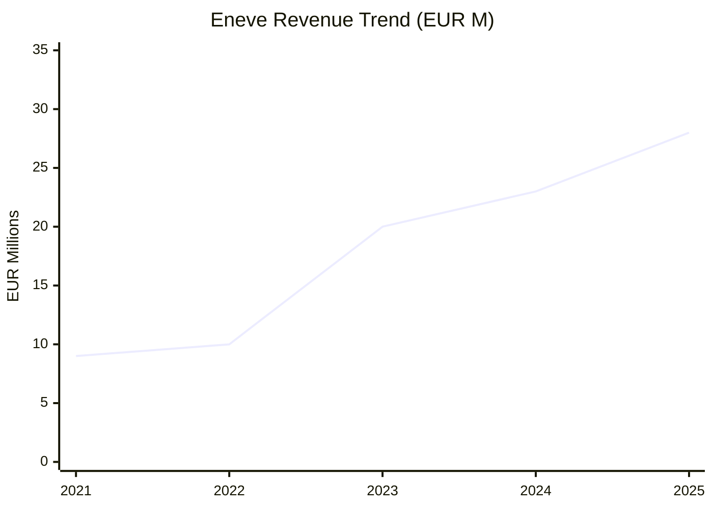
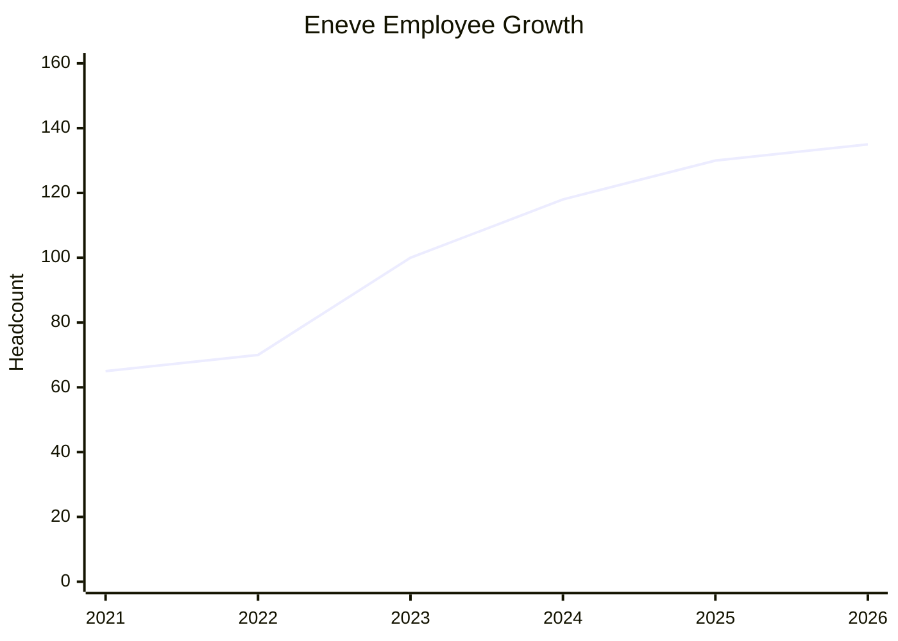
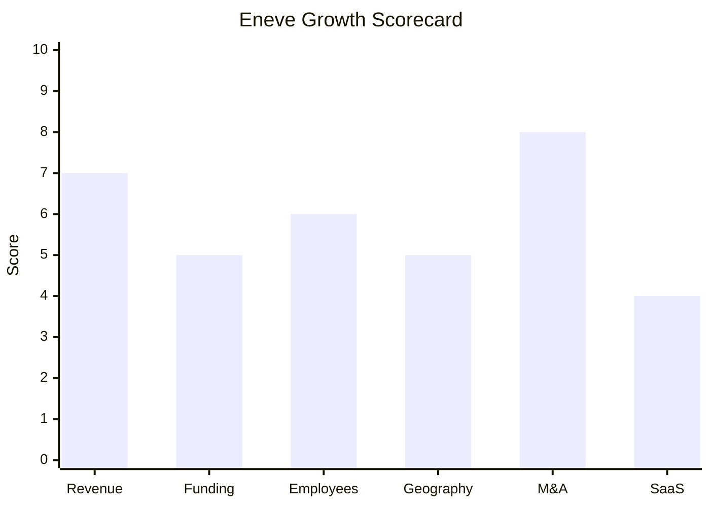

# Financial & Growth Deep-Dive - Eneve (formerly Energy21)

**Research Date**: 2026-02-15
**Data Availability**: Medium (private/PE-backed company; revenue estimates from press releases, no public filings)

> **Note**: Eneve is analyzed here as a self-assessment using the same framework applied to all competitors. This enables like-for-like comparison. Eneve was formed in June 2025 through the merger of Energy21, Ecedo, Jules, and Gridhub, backed by Vortex Capital Partners.

---

### Revenue Timeline

| Year | Revenue | Currency | EUR Equivalent | YoY Growth | Source | Confidence |
| --- | --- | --- | --- | --- | --- | --- |
| 2026 (est.) | ~EUR 30-35M | EUR | EUR 30-35M | ~10-15% | Extrapolation from 2025 base + organic growth | Estimated |
| 2025 | ~EUR 25-30M | EUR | EUR 25-30M | ~25-50% | Eneve press release (Jun 2025): "annual revenue close to EUR 30 million" | Confirmed (range) |
| 2024 | ~EUR 22-25M | EUR | EUR 22-25M | ~10-25% | Estimated: Energy21+Ecedo+Jules+Gridhub pre-merger; Gridhub joined 2024 | Estimated |
| 2023 | ~EUR 20M | EUR | EUR 20M | ~100% | Press release (Sep 2023): "annual revenue of approximately EUR 20 million" post Ecedo+Jules acquisition | Confirmed |
| 2022 | ~EUR 10M | EUR | EUR 10M | N/A (baseline) | Vortex Capital press release (Oct 2022): "annual revenues of about EUR 10 million" | Confirmed |
| 2021 | ~EUR 8-10M | EUR | EUR 8-10M | Unknown | Estimated: Energy21 pre-acquisition, stable Dutch market | Estimated (proxy) |

**Revenue CAGR (3yr, 2022-2025)**: ~44% (primarily M&A-driven, not organic)
**Estimated Organic CAGR (3yr)**: ~5-15% (underlying product growth excluding acquisitions)

#### Revenue Trend Chart

> **Critical context**: The jump from EUR 10M (2022) to EUR 20M (2023) is almost entirely from acquiring Ecedo and Jules. The growth from EUR 20M to EUR 25-30M (2024-2025) includes Gridhub and organic growth. Organic growth alone is likely in the 5-15% range, modest for a software company.

---

### Profitability

| Data Point | Value | Source | Confidence |
| --- | --- | --- | --- |
| EBITDA (current) | Unknown | Private company, not disclosed | Unknown |
| EBITDA Margin | Unknown | Private company, not disclosed | Unknown |
| Net Profit / Loss | Unknown | Private company, not disclosed | Unknown |
| Recurring Revenue % | ~40-60% (estimated) | Mix of SaaS (Ecedo since 2013) + on-prem licenses (eBase) + services | Estimated |
| SaaS Revenue % | ~30-40% (estimated) | Ecedo SaaS + Gridhub cloud + Jules digital; eBase remains on-prem | Estimated |
| Revenue per Employee | ~EUR 200-230K | Calculated: EUR 28M / 130 employees | Estimated |

> Revenue per employee of EUR 200-230K is reasonable for a hybrid software/services company. Pure SaaS companies typically achieve EUR 250-400K+. This suggests meaningful services/consulting revenue alongside software licenses.

---

### Funding & Investment History

| Date | Round | Amount | Lead Investor(s) | Valuation | Source | Confidence |
| --- | --- | --- | --- | --- | --- | --- |
| Oct 2022 | PE Buyout (MBO) | Undisclosed | Vortex Capital Partners + Management | Undisclosed | Vortex press release | Confirmed (no amounts) |
| Aug 2023 | Add-on acquisition (Ecedo) | Undisclosed | Vortex Capital Partners | N/A | Vortex / Energy21 press release | Confirmed (no amounts) |
| Aug 2023 | Add-on acquisition (Jules) | Undisclosed | Vortex Capital Partners | N/A | bdaily.co.uk / Energy21 press release | Confirmed (no amounts) |
| 2024 | Add-on acquisition (Gridhub) | Undisclosed | Vortex Capital Partners | N/A | Eneve website timeline | Confirmed (no amounts) |

**Total Raised**: Undisclosed (PE buyout + 3 add-on acquisitions; all funded by Vortex Capital Partners)
**Latest Valuation**: Undisclosed (typical PE multiples for EUR 28M revenue software co: EUR 50-100M range estimated)
**Current Investors**: Vortex Capital Partners (majority shareholder) + Management
**War Chest Signals**: Vortex has invested in 25+ platform companies with 75+ add-on acquisitions total. Active buy-and-build investor with demonstrated capacity for further acquisitions. Germany and Belgium expansion likely requires additional investment.

> **Vortex Capital Partners profile**: Specialist investor in software and digital technology companies. Netherlands-based. Entrepreneurial approach. The 3 add-on acquisitions in 2 years signal ongoing availability of capital for growth.

---

### Employee Timeline

| Year | Headcount | YoY Growth | Source | Confidence |
| --- | --- | --- | --- | --- |
| 2026 (current) | ~130-140 | ~0-8% | Eneve website still states "130+ specialists"; 5 open positions on Recruitee | Estimated |
| 2025 | 130+ | ~8-17% | Eneve press release (Jun 2025): "more than 130 specialists" | Confirmed |
| 2024 | ~115-120 | ~15-20% | Estimated: Energy21+Ecedo+Jules post-integration + Gridhub team | Estimated |
| 2023 | 100+ | ~43% | Press release (Sep 2023): "over 100 employees" after Ecedo+Jules | Confirmed |
| 2022 | ~70 | N/A (baseline) | Vortex press release (Oct 2022): "approximately 70 people" | Confirmed |
| 2021 | ~60-70 | Unknown | Estimated: Energy21 pre-acquisition, stable operation | Estimated (proxy) |

**Employee CAGR (3yr, 2022-2025)**: ~23% (primarily M&A-driven)
**Current Open Positions**: 5 (of which 3 tech: C#/.NET, PHP/Laravel, Lead .NET; plus 2 corporate: Financial Controller, HR)
**Hiring Hotspots**: Utrecht (NL), Assen (NL), Lisbon (Portugal)

#### Employee Growth Chart

> **Key observation**: Only 5 open positions (3 engineering) signals modest organic hiring. No AI/ML/Data Science-specific roles observed. The C#/.NET roles in Lisbon and Assen confirm active eBase platform modernization but at a measured pace.

---

### Geographic & Market Expansion

| Year | Expansion Event | Details | Source | Confidence |
| --- | --- | --- | --- | --- |
| 2025 | Germany expansion planned | Teun Levering (MD Software) mandated with "expanding international presence including Germany, Belgium and the UK" | Eneve press release (Jun 2025) | Confirmed (intent, not execution) |
| 2025 | Belgium expansion active | BASF Antwerp case study live; achieved grid operator certification for BASF complex | Eneve case study | Confirmed |
| 2023 | UK market entry | Jules acquisition gives UK office, product team, and client base | bdaily.co.uk (Sep 2023) | Confirmed |
| ~2020+ | Portugal development office | Eneve/Energy21 maintains Lisbon-based development team | Job postings, Vortex portfolio page | Confirmed |
| 1997+ | Netherlands (home market) | Dominant position: Eneco, Essent, Engie, Mega, Vandebron, Scholt Energie | Multiple sources | Confirmed |

**International Revenue %**: Unknown (estimated 10-20%; bulk of revenue remains Netherlands)
**Expansion Trajectory**: Methodical, acquisition-driven entry into UK (2023). Belgium expanding through industrial customers (BASF). Germany and broader UK are strategic targets but no confirmed wins yet. AXPO (Swiss, 30+ countries) is a cross-border client.

---

### M&A Activity

| Date | Target | Deal Size | Capability Gained | Strategic Rationale | Source | Confidence |
| --- | --- | --- | --- | --- | --- | --- |
| Jun 2025 | Merger (Eneve formation) | N/A | Unified brand, integrated platform | Create single entity from 4 companies for market positioning | Eneve press release | Confirmed |
| 2024 | Gridhub | Undisclosed | Customer onboarding, supplier portals | End-to-end value chain coverage (onboarding to balancing) | Eneve website timeline | Confirmed |
| Aug 2023 | Ecedo | Undisclosed | SaaS billing, CRM, customer management | Add cloud-native billing/CRM to complement eBase back-office | Vortex / Real Deals | Confirmed |
| Aug 2023 | Jules (UK) | Undisclosed | Energy procurement platform, UK market presence | Geographic expansion (UK) + dynamic contract management | bdaily.co.uk / Energy21 | Confirmed |

**Divestitures**: None
**M&A Pattern**: Classic PE buy-and-build strategy. Vortex acquired the platform (Energy21) then systematically added complementary capabilities through 3 bolt-on acquisitions in 2 years, followed by brand unification. Each acquisition fills a specific gap: billing (Ecedo), UK market + procurement (Jules), onboarding (Gridhub). Well-executed capability assembly.

---

### SaaS Transition Metrics

| Data Point | Value | Source | Confidence |
| --- | --- | --- | --- |
| Deployment Model | Hybrid (on-prem + SaaS) | Product analysis; eBase = on-prem MSSQL, Ecedo = SaaS since 2013, Gridhub = cloud-native | Confirmed |
| Cloud Revenue % (current) | ~30-40% (estimated) | Ecedo SaaS + Gridhub cloud revenue as portion of total | Estimated |
| Cloud Revenue % (2024) | ~25-35% (estimated) | Pre-Eneve merger, Ecedo SaaS growing | Estimated |
| Cloud Revenue % (2023) | ~20-30% (estimated) | Ecedo SaaS was newer acquisition | Estimated |
| Recurring Revenue % | ~40-60% (estimated) | SaaS subscriptions + maintenance contracts; offset by project/consulting revenue | Estimated |
| Platform Stack | eBase: MSSQL / C++ migrating to C#/.NET; Ecedo: PHP/Laravel SaaS; Gridhub: cloud-native | Job postings (C#/.NET, PHP/Laravel roles) | Confirmed (tech stack) |
| Migration Status | In progress | eBase C++ to C#/.NET migration actively underway (job postings confirm); multi-year effort | Job postings / internal context | Confirmed |

> **Critical assessment**: Eneve runs a fundamentally **heterogeneous technology estate**. The core eBase platform is legacy on-premise MSSQL with a C++ to C#/.NET migration underway. Ecedo runs on PHP/Laravel as a separate SaaS platform. Gridhub and Jules are additional separate platforms. The 2025 brand merger (Eneve) unifies the *brand* but the *technology* remains fragmented across at least 4 distinct codebases. True platform consolidation will take years. This is the company's biggest strategic vulnerability -- competitors with unified cloud-native platforms have a structural advantage.

---

### Growth Scorecard

| Dimension | Score (1-10) | Evidence Summary |
| --- | --- | --- |
| Revenue Growth | 7 | CAGR ~44% (2022-2025) driven by PE buy-and-build; EUR 10M to EUR 28M in 3yr. Organic growth estimated 5-15%. |
| Funding Momentum | 5 | PE-backed (Vortex Capital Partners) since 2022; 3 add-on acquisitions funded. Undisclosed amounts. Active support but no large disclosed rounds. |
| Employee Growth | 6 | From 70 to 130+ (23% CAGR) but mostly M&A-driven. Only 5 current open roles; modest organic hiring pace. No AI/ML hires. |
| Geographic Expansion | 5 | Entered UK (2023), expanding Belgium (BASF), planning Germany. Still heavily Netherlands-focused (~80%+ revenue). 3 office countries. |
| M&A Activity | 8 | 3 acquisitions in 2 years + brand unification. Clear capability-building pattern. Well-executed PE buy-and-build playbook. |
| SaaS Maturity | 4 | Core eBase is on-premise MSSQL (C++ migrating to C#/.NET). Ecedo is SaaS (PHP/Laravel). Heterogeneous tech estate. Estimated 30-40% cloud revenue. Migration in-progress. |
| **COMPOSITE SCORE** | **5.8** | **Classification: Riser** |

**Classification Thresholds**:

- **Rocket** (avg 7.0-10.0): Explosive growth, heavy investment, market disruptor
- **Riser** (avg 5.0-6.9): Strong growth signals, investing in future, accelerating
- **Steady** (avg 3.0-4.9): Stable but not transforming, evolutionary
- **Dinosaur** (avg 1.0-2.9): Flat or declining, legacy mode, no visible investment

#### Growth Scorecard Radar

> The bar chart reveals Eneve's fingerprint: **strong M&A execution** (8) is the standout dimension, reflecting a well-executed PE buy-and-build strategy. Revenue growth (7) is healthy but largely acquisition-driven. The **SaaS maturity score (4) is the critical vulnerability** -- the legacy on-premise eBase core and heterogeneous technology estate across 4 codebases limits scalability and competitiveness against cloud-native rivals. Geographic expansion (5) and employee growth (6) are moderate, reflecting a company that is investing but not yet at the pace needed to compete with AI-native disruptors.

---

### Strategic Assessment: Eneve's Position in the Competitive Landscape

**Strengths**:
- Dominant Dutch market position (Eneco, Essent, Engie, Mega, Vandebron -- 7M+ households)
- PE backing provides acquisition capital and strategic guidance
- 28 years of deep energy domain expertise
- 20M+ energy connections provide significant data moat
- Complementary product portfolio post-merger (onboarding through balancing)
- Recent client wins (EBN gas trading, BASF Belgium) demonstrate ongoing relevance

**Vulnerabilities**:
- **No AI strategy**: Zero explicit AI features, no AI/ML hiring, no AI product announcements. Ranks at the bottom of the AI adoption spectrum alongside the competitors it aims to beat
- **Fragmented technology**: 4+ distinct codebases (eBase/C++, Ecedo/PHP, Gridhub, Jules) under one brand. Integration is years away
- **Legacy core**: eBase MSSQL on-premise platform is the revenue backbone but the technology anchor. C#/.NET migration is underway but multi-year
- **Netherlands concentration**: Estimated 80%+ revenue from one market. Belgium/UK/Germany expansion is early stage
- **Modest organic growth**: Strip out M&A and organic growth is likely single-digit percentage
- **Low hiring velocity**: Only 5 open positions for a 130-person company suggests cost discipline over growth investment

**Comparative Position**:
- **vs. Rockets** (tem at $75M Series B, Engrate cloud-native): Eneve is being outpaced in technology investment and AI adoption by orders of magnitude
- **vs. Risers** (Volue at 71% recurring, Molecule cloud-only): Eneve's SaaS transition lags significantly
- **vs. Direct Twin** (SOPTIM): Both companies share similar strengths (deep national market expertise) and weaknesses (limited AI, moderate SaaS transition). SOPTIM has 377 employees vs Eneve's 130, but similar strategic positioning
- **vs. AI-Native Entrants** (MaxBill, Qualia, Engrate): These competitors threaten to leapfrog Eneve's capabilities within 2-3 years if Eneve doesn't accelerate AI and cloud investment

---

### Data Gaps and Limitations

| Data Point | Status | Reason |
| --- | --- | --- |
| Exact revenue figures | Ranges only | Private PE-backed company; no mandatory public disclosure |
| EBITDA / profitability | Unknown | Not disclosed in any public source |
| Recurring revenue % | Estimated range | Not disclosed; inferred from product mix |
| Organic vs M&A growth split | Estimated | Cannot isolate without internal data |
| Deal sizes (all acquisitions) | Unknown | PE transactions typically undisclosed |
| Valuation | Unknown | No public valuation events |
| Customer churn rate | Unknown | Not disclosed |
| Contract values / ARR | Unknown | Not disclosed |
| Technology migration timeline | Unknown | Only confirmed "in progress" from job postings |

---

**Sources**:
1. Eneve press release (Jun 2025) - Company formation announcement
2. Vortex Capital Partners press release (Oct 2022) - Energy21 acquisition
3. Vortex Capital Partners portfolio page - Eneve/Energy21
4. bdaily.co.uk (Sep 2023) - Jules UK acquisition
5. Real Deals (Aug 2023) - Vortex-backed Energy21 double bolt-on
6. Silicon Canals (Jun 2025) - Eneve emergence article
7. Eneve website (eneve.com) - About, Cases, Careers
8. Energy21 website (energy21.com) - About, Cases, News
9. Eneve Recruitee page - Current open positions
10. Transfirm.nl - Energy21 Solutions B.V. KVK registration
