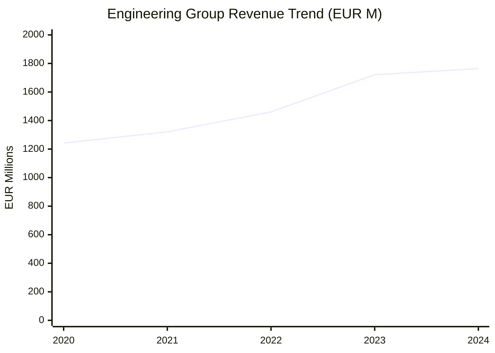
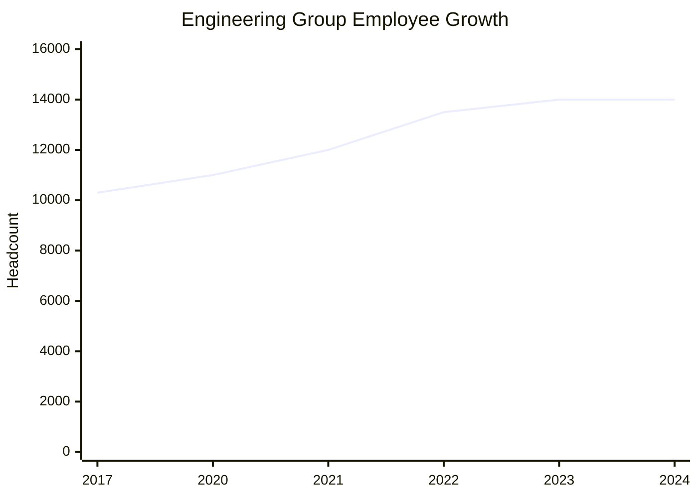
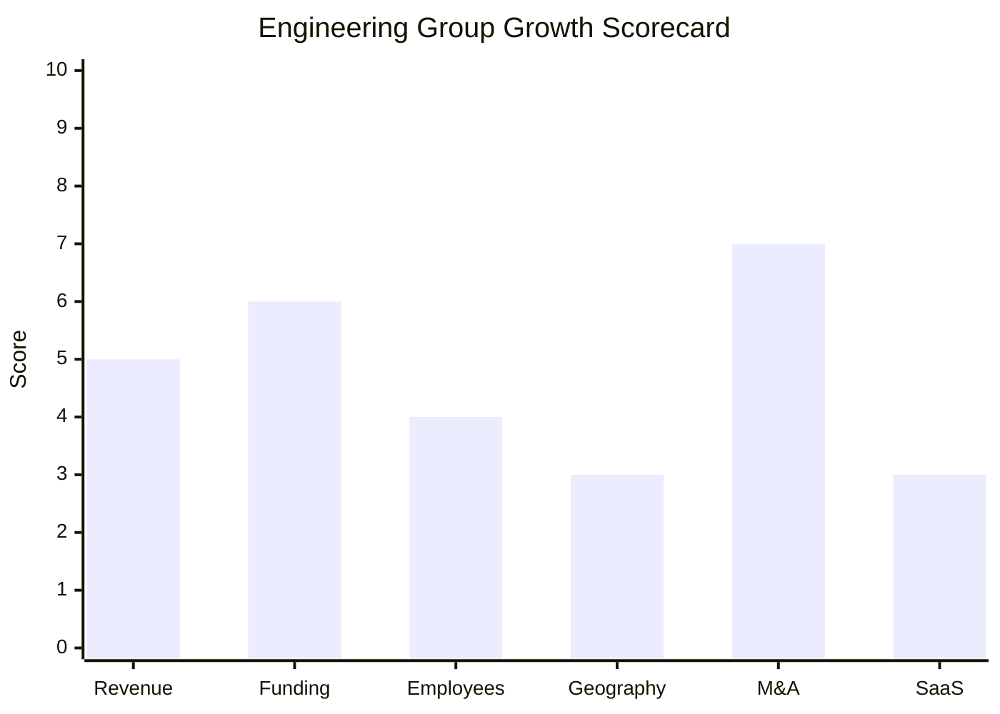

# Financial & Growth Deep-Dive - Engineering Ingegneria Informatica (Engineering Group)

**Research Date**: 2026-02-15
**Data Availability**: Medium-High (PE-owned, previously public; annual results published via press releases; detailed segment-level breakdown not disclosed)

---

### Revenue Timeline

| Year | Revenue | Currency | EUR Equivalent | YoY Growth | Source | Confidence |
| --- | --- | --- | --- | --- | --- | --- |
| 2024 | EUR 1,764.2M | EUR | EUR 1,764.2M | +2.5% | eng.it 2024 annual results press release | Confirmed |
| 2023 | EUR 1,721.1M | EUR | EUR 1,721.1M | +17.9% | eng.it 2023 annual results press release | Confirmed |
| 2022 | EUR 1,460.0M | EUR | EUR 1,460.0M | +10.5% | industriaitaliana.it (2023 results report) | Confirmed |
| 2021 | EUR 1,321.0M | EUR | EUR 1,321.0M | +6.4% | italia-informa.com (2021 results report) | Confirmed |
| 2020 | EUR 1,241.5M | EUR | EUR 1,241.5M | N/A | Estimated: EUR 1,321M / 1.064 (from 2021's 6.4% growth) | Estimated |

**Revenue CAGR (3yr, 2021-2024)**: 10.1%
**Revenue CAGR (4yr, 2020-2024)**: 9.2%

**Note**: The 2022-2023 step-up (+17.9%) is substantially acquisition-driven. Be Shaping the Future (EUR 235M revenue, acquired Sep 2022) was fully consolidated from Q4 2022 / FY2023. Organic growth is closer to 5-8% annually.

#### Revenue Trend Chart

---

### Profitability

| Data Point | Value | Source | Confidence |
| --- | --- | --- | --- |
| EBITDA Adjusted (2024) | EUR 276.2M | eng.it 2024 annual results | Confirmed |
| EBITDA Adjusted (2023) | EUR 257.3M | eng.it 2024 annual results | Confirmed |
| EBITDA Adjusted (2022) | EUR 208.6M | industriaitaliana.it | Confirmed |
| EBITDA Adjusted (2021) | EUR 198.2M | italia-informa.com | Confirmed |
| EBITDA Margin (2024) | 15.6% | Calculated: 276.2 / 1,764.2 | Calculated |
| EBITDA Margin (2023) | 14.9% | Calculated: 257.3 / 1,721.1 | Calculated |
| EBITDA Margin (2022) | 14.3% | Calculated: 208.6 / 1,460.0 | Calculated |
| EBITDA Margin (2021) | 15.0% | italia-informa.com (reported as 15.3% of revenue) | Confirmed |
| Net Profit (2022) | EUR 28.3M | industriaitaliana.it | Confirmed |
| Net Profit (2021) | EUR 47.5M | italia-informa.com | Confirmed |
| Recurring Revenue % | Not disclosed (services-heavy model) | Web research | Unknown |
| SaaS Revenue % | Not disclosed (emerging SaaS modules in Neta) | Web research | Unknown |
| Revenue per Employee (2024) | EUR ~126K | Calculated: 1,764.2M / ~14,000 | Calculated |
| Revenue per Employee (2021) | EUR ~110K | Calculated: 1,321M / ~12,000 | Calculated |

**Margin Trend**: EBITDA margin has improved from ~14.3% (2022) to ~15.6% (2024), showing operational leverage despite modest top-line growth. Revenue per employee of ~EUR 126K is typical for IT services (below pure-play software companies but within range for services-heavy firms).

---

### Funding & Investment History

| Date | Round | Amount | Lead Investor(s) | Valuation | Source | Confidence |
| --- | --- | --- | --- | --- | --- | --- |
| Pre-2016 | Public (Borsa Italiana) | N/A | Public market | Market cap varied | Borsa Italiana | Confirmed |
| Feb 2016 | PE Buyout | ~EUR 1.5B (est.) | Apax Partners (VIII) + NB Renaissance Partners | EUR 66/share (18.1% premium) | Apax press release | Confirmed |
| Jul 2020 | PE Buyout | $1.8B (~EUR 1.6B) | Bain Capital + NB Renaissance Partners | $1.8B | Reuters, Mergerlinks, Bain Capital | Confirmed |
| 2020 | Senior Secured Notes | EUR 605M | N/A (bond market) | N/A | Luxembourg Stock Exchange filing | Confirmed |
| 2024 | Bond Issuance | Undisclosed | N/A (bond market) | N/A | eng.it 2024 annual results | Confirmed |

**Total Raised**: Not applicable (PE buyouts, not venture rounds; funded via leveraged buyouts + bond issuances)
**Latest Valuation**: $1.8B / ~EUR 1.6B (Jul 2020 acquisition price); current implied valuation likely higher given revenue growth
**Current Investors**: Bain Capital Private Equity (co-control) + NB Renaissance Partners (co-control); founder Michele Cinaglia retains minority stake
**War Chest Signals**: EUR 605M bonds (2020) refinanced acquisition bridge facility; 2024 bond issuance for organic growth and tech investments. PE sponsors typically maintain additional dry powder for bolt-on acquisitions. Reuters notes Engineering as a "potential listing candidate" -- IPO would unlock further capital.

---

### Employee Timeline

| Year | Headcount | YoY Growth | Source | Confidence |
| --- | --- | --- | --- | --- |
| 2024-2025 | ~14,000 | ~0% | eng.it press releases (Apr 2025) | Confirmed |
| 2023 | ~14,000 | ~0% | eng.it, PitchBook | Estimated |
| 2022 | ~13,500 | +12.5% | Estimated (post-Be Shaping: ~12,000 + ~1,500-1,800 from Be Shaping) | Estimated |
| 2021 | ~12,000 | +9.1% | eng.it pre-acquisition references, Tracxn | Estimated |
| 2020 | ~11,000 | N/A | Bain Capital press release ("over 11,000 professionals") | Confirmed |
| 2017 | ~10,300 | N/A | Devex | Confirmed |

**Employee CAGR (3yr, 2021-2024)**: ~5.3% (largely acquisition-driven; organic growth near zero)
**Employee CAGR (4yr, 2020-2024)**: ~6.2% (includes Be Shaping acquisition impact)
**Current Open Positions**: ~28 (LinkedIn Italy, Feb 2026)
**AI/ML/Data Science Roles**: 1 Junior AI Data Scientist (Milan); 450+ researchers/data scientists in R&I division overall
**Hiring Hotspots**: Milan (18 positions), Rome (8 positions), Naples (1 position) -- Italy-focused
**Key Recent Hire**: Aldo Bisio, CEO (appointed Apr 2025, former CEO Vodafone Italia)

#### Employee Growth Chart

---

### Geographic & Market Expansion

| Year | Expansion Event | Details | Source | Confidence |
| --- | --- | --- | --- | --- |
| Pre-2020 | Established presence | Italy (HQ), Spain (Barcelona), Germany, Belgium, Serbia, Brazil, Argentina, USA | eng.it, Devex | Confirmed |
| 2022 | Be Shaping integration | Extended presence in digital consulting across Be Shaping's markets (Italy-focused) | eng.it press release | Confirmed |
| 2023-2025 | No new country entries | Consolidating existing markets; no new office announcements identified | Web research | Estimated |

**International Revenue %**: Not disclosed; Italy is dominant market (estimated 80%+ of revenue)
**Countries Active**: ~12-14 countries, 50+ offices (21 countries per eng.it "at a glance" page, but concentrated in Italy)
**Expansion Trajectory**: Consolidating, not expanding. Strategic focus under new CEO (Bisio) is on operational efficiency, organic growth, and IPO preparation rather than new market entry. Neta platform expansion focused on Spain and LatAm within existing presence.

---

### M&A Activity

| Date | Target | Deal Size | Capability Gained | Strategic Rationale | Source | Confidence |
| --- | --- | --- | --- | --- | --- | --- |
| Jan 2022 | Cybertech | Undisclosed | Cybersecurity (300+ specialists) | Strengthen cybersecurity capability across all business units | eng.it press release | Confirmed |
| Sep 2022 | Be Shaping the Future | ~EUR 340M (est.; EUR 3.45/share for 135M shares + EUR 20M tender) | Digital transformation consulting (~1,800 emp, EUR 235M revenue) | Scale digital consulting, expand customer base, delisted from Euronext | eng.it, TIP press, Luxembourg filing | Estimated |
| Jul 2023 | Extra Red | Undisclosed | Cloud/DevOps (Red Hat Premier Partner, AWS, IBM) | Strengthen cloud-native, microservices, containerization capability | eng.it press release | Confirmed |

**Prior Acquisitions (2013-2021)**: 4 additional acquisitions including Municipia (public admin), Nexen (financial consulting), and others. Total 7 acquisitions from 2013-2023 per Tracxn.

**Divestitures**: None identified
**M&A Pattern**: Capability-building acquisitions to broaden IT services portfolio. Be Shaping was transformative (~20% revenue step-up). Strategic pivot under Bisio: shifting from acquisitive growth to organic growth + small tuck-in deals, consistent with pre-IPO operational focus.

---

### SaaS Transition Metrics

| Data Point | Value | Source | Confidence |
| --- | --- | --- | --- |
| Deployment Model | Hybrid (on-premise dominant + emerging SaaS) | eng.it product pages | Confirmed |
| Cloud Revenue % (current) | Not disclosed | Web research | Unknown |
| Cloud Revenue % (1yr ago) | Not disclosed | Web research | Unknown |
| Cloud Revenue % (2yr ago) | Not disclosed | Web research | Unknown |
| Recurring Revenue % | Not disclosed; estimated 20-30% (services-heavy DNA) | Business model analysis | Estimated |
| Platform Stack | Java-based; Oracle Cloud Infrastructure (OCI) for Neta; cloud-native microservices, REST APIs, Data Lakehouse architecture for new modules | eng.it, case studies | Confirmed |
| Migration Status | In-progress (Neta modules being cloudified; Cloudesire SaaS marketplace operational) | eng.it product pages | Confirmed |

**SaaS Transition Assessment**: Engineering is an IT services company first, software product company second. The core Neta suite remains predominantly on-premise with OCI cloud hosting as an option. New SaaS modules (MDM Sale, MDM Water, Energy Community) are cloud-native but represent a small fraction of total revenue. The Cloudesire marketplace platform enables SaaS distribution. The company's revenue model is heavily weighted toward professional services, consulting, and managed services rather than recurring software licenses. Full SaaS transition would require fundamental business model transformation that is not currently visible.

---

### Growth Scorecard

| Dimension | Score (1-10) | Evidence Summary |
| --- | --- | --- |
| Revenue Growth | 5 | 3yr CAGR 10.1%, but acquisition-inflated; organic growth ~5-8%; 2024 decelerated to +2.5% |
| Funding Momentum | 6 | Significant PE backing (Bain Capital + NB Renaissance, $1.8B deal); EUR 605M bonds; IPO candidate |
| Employee Growth | 4 | 3yr CAGR ~5.3% (acquisition-driven); organic growth near flat; only 28 open roles for 14,000-person company |
| Geographic Expansion | 3 | No new countries in 3 years; consolidating Italy, Spain, LatAm; Italy represents ~80%+ of revenue |
| M&A Activity | 7 | 3 acquisitions in 2022-2023; Be Shaping was transformative (EUR 235M revenue, delisted); now shifting to organic |
| SaaS Maturity | 3 | On-premise dominant; no cloud revenue % disclosed; services-heavy DNA; SaaS modules emerging but small fraction |
| **COMPOSITE SCORE** | **4.7** | **Classification: Steady** |

**Classification Thresholds**:

- **Rocket** (avg 7.0-10.0): Explosive growth, heavy investment, market disruptor
- **Riser** (avg 5.0-6.9): Strong growth signals, investing in future, accelerating
- **Steady** (avg 3.0-4.9): Stable but not transforming, evolutionary
- **Dinosaur** (avg 1.0-2.9): Flat or declining, legacy mode, no visible investment

#### Growth Scorecard Radar

> The scorecard shows Engineering's strength in M&A capability-building (7) and PE-backed funding infrastructure (6), but weaknesses in geographic expansion (3), SaaS transition (3), and employee momentum (4). The company is a large, stable IT services firm executing acquisitive growth but not transforming into a cloud-native or AI-native business. Revenue growth is decelerating (from +18% in 2023 to +2.5% in 2024), consistent with post-acquisition normalization.

---

### Strategic Context for Eneve

**Dinosaur vs Rocket Assessment**: Engineering Group is firmly in the **Steady** category. It is a EUR 1.76B revenue, 14,000-employee Italian IT services conglomerate with PE backing and IPO ambitions. Its Neta Open Suite dominates Italian utility CIS, but this is one business unit within a much larger, diversified group. The company is not transforming -- it is optimizing for an IPO exit.

**Key Financial Signals**:
- **Revenue deceleration**: From +18% (2023, acquisition-driven) to +2.5% (2024) signals organic growth fatigue
- **EBITDA margin improvement**: From 14.3% (2022) to 15.6% (2024) shows cost discipline, typical pre-IPO behavior
- **Low hiring intensity**: Only 28 open positions for a 14,000-person company suggests headcount freeze/optimization
- **CEO change**: Bisio (ex-Vodafone Italia) appointed Apr 2025 -- PE firms change CEOs when preparing for exit events
- **Revenue per employee**: EUR ~126K is in the IT services range, not the EUR 200K+ of pure software companies

**Implications**: Engineering's Neta platform competes with Eneve only at the CIS/metering/billing layer, and exclusively in Southern European markets. Their PE-backed capital and scale (40M+ end users) are formidable, but their strategic focus is IPO-readiness, not aggressive market expansion. The EngGPT/AI investment (EUR 30M R&D, 450+ researchers) is notable but applies across all business units, not just energy. The company does not represent an imminent competitive threat to Eneve in the Netherlands or Northern Europe.

---

### Sources

- eng.it/en/news/press-releases/2025/04/ (2024 annual results)
- eng.it/en/news/press-releases/2024/03/ (2023 annual results)
- industriaitaliana.it (2022 baseline financials)
- italia-informa.com (2021 financial results)
- Reuters (CEO change, IPO speculation, $1.8B deal)
- Bain Capital press release (2020 acquisition)
- Apax Partners press release (2016 acquisition)
- eng.it/en/group/eng-at-a-glance (company overview)
- Tracxn (acquisition history)
- Luxembourg Stock Exchange (bond filing, Be Shaping delisting)
- LinkedIn Italy (job postings)
