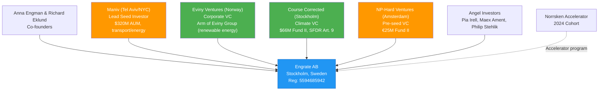
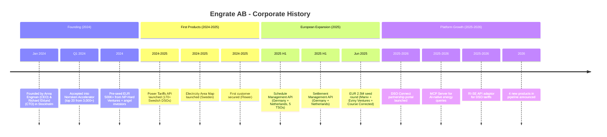
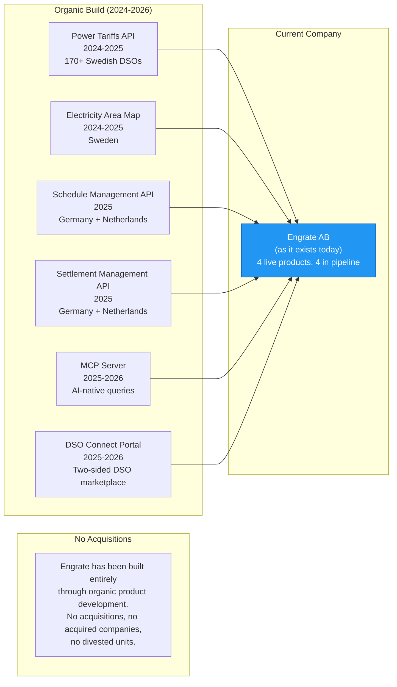

# Engrate AB - Corporate History

**Research Date**: 2026-02-15
**Genealogy Confidence**: Medium (young private startup; public information is limited to press coverage, investor announcements, and product pages. No annual reports, trade register filings beyond basic registration, or financial disclosures available.)

## Current Ownership & Key Parties

| Stakeholder | Role | Stake % | Type | Since | Source |
|---|---|---|---|---|---|
| Anna Engman | Co-founder / CEO | Undisclosed (founder equity) | Founder | Jan 2024 | EU-Startups, SiliconCanals |
| Richard Eklund | Co-founder / CTO | Undisclosed (founder equity) | Founder | Jan 2024 | EU-Startups, SiliconCanals |
| Maniv (Maniv Mobility) | Lead seed investor | Undisclosed | VC (transport/energy) | Jun 2025 | Golden Wiki, EU-Startups |
| Eviny Ventures | Seed co-investor | Undisclosed | Corporate VC (Norwegian energy) | Jun 2025 | EU-Startups, Bird & Bird |
| Course Corrected | Seed co-investor | Undisclosed | VC (Swedish climate-focused) | Jun 2025 | EU-Startups, SiliconCanals |
| NP-Hard Ventures | Pre-seed lead | Undisclosed | VC (Dutch pre-seed software) | 2024 | StartupReporter, Golden Wiki |
| Pia Irell | Angel investor | Undisclosed | Angel | 2024 | Nordic Angels, SiliconCanals |
| Maex Ament | Angel investor | Undisclosed | Angel | 2024 | Nordic Angels, SiliconCanals |
| Philip Stehlik | Angel investor | Undisclosed | Angel | 2024 | Nordic Angels, SiliconCanals |

**Board of Directors** (limited public information):

| Name | Role | Represents | Background | Source |
|---|---|---|---|---|
| Unknown | Unknown | Unknown | Board composition not publicly disclosed for this private startup | N/A |

*Note: Patrik Fagerfjall and Christopher Engman appear in Norrsken Accelerator and LinkedIn contexts associated with Engrate, but their formal roles (board, advisory, or other) cannot be confirmed from public sources.*

**Corporate Structure** (Mermaid diagram):



**Investor Sister Companies in Energy Sector**:

| Investor | Other Energy Portfolio Companies | Consolidation Signal |
|---|---|---|
| Maniv | Anaphite (battery tech), Celadyne (green hydrogen), Vammo (EV), Autofleet (fleet optimization) | Transport/energy decarbonization theme; Shell Ventures is LP. Engrate fits their energy digitization thesis. |
| Eviny Ventures | Tibber (digital electricity), Heimdall Power (grid digitization), Zinus (maritime electrification), Tequs (heat pumps), Photoncycle (H2 storage), Voltfang (battery storage) | Strong energy/grid portfolio. Engrate aligns with grid flexibility and energy data infrastructure theme. Tibber is notable as a digital energy retailer that could use Engrate APIs. |
| Course Corrected | Emulate Energy (energy trading), ReCarber (carbon removal), Modvion (wind towers) | Climate-tech focused; Emulate Energy overlap is interesting -- both in energy trading space. |
| NP-Hard Ventures | No specific energy companies identified | General European pre-seed software; Engrate appears to be their energy sector bet. |

## Origin Story

| Data Point | Value | Source | Confidence |
|---|---|---|---|
| Founded | January 2024 | EU-Startups, SiliconCanals, StartupReporter | Confirmed |
| Original Name | Engrate AB | Bolagsverket (Reg: 5594685942), NorthData | Confirmed |
| Founders | Anna Engman (CEO) and Richard Eklund (CTO) | EU-Startups, SiliconCanals, Bird & Bird | Confirmed |
| Founder Background (Engman) | Serial entrepreneur ("5x founder"), Co-founder of MINESTORAGE (Aug 2020), MSc from City University (UK) | ContactOut, LinkedIn | Estimated |
| Founder Background (Eklund) | Described as part of a "spectacular founding team" by investors; specific prior career not publicly documented | SiliconCanals | Estimated |
| Original Mission | Build IT integrations for the energy industry; create a platform where energy companies can integrate with third parties to retrieve or upload energy data | Bolagsverket corporate purpose, NorthData | Confirmed |
| Original Product | Digital integration platform for energy companies, starting with Swedish DSO tariff data harmonization | engrate.io, StartupReporter | Confirmed |
| First Market | Sweden (Power Tariffs from 170+ DSOs) | engrate.io | Confirmed |
| First Customer | Flower (Swedish flexibility operator / renewable energy aggregator) | Nordic Angels, StartupReporter | Confirmed |
| Registered Address | Klarabergsgatan 60, 111 21 Stockholm, Sweden | NorthData, Bolagsverket | Confirmed |
| Alternative Listed Address | Birger Jarlsgatan 57C, Stockholm, 113 57 | CBInsights | Confirmed |

**Founding Context**: Engrate was founded in early 2024 against the backdrop of Europe's accelerating energy transition. EU climate targets require tripling renewable energy capacity by 2030, and Swedish electricity consumption is expected to double within 10-20 years. The founders identified that the energy sector's digital infrastructure was fragmented -- every TSO, DSO, and market used incompatible systems and formats. Their thesis: a unified API layer abstracting this complexity would unlock a new generation of energy applications, similar to how Stripe abstracted payment complexity for fintech.

## Corporate Identity Changes

| # | Date | From | To | Reason | Source |
|---|---|---|---|---|---|
| -- | -- | -- | -- | No name changes. Engrate AB has been the legal entity name since incorporation in January 2024. | Bolagsverket, NorthData |

## Mergers & Acquisitions Timeline

### Acquisitions Made (as buyer)

| Date | Target Company | Deal Value | What Was Gained | Integration Outcome | Source |
|---|---|---|---|---|---|
| -- | None | -- | Engrate has not made any acquisitions. As a seed-stage startup with <20 employees and EUR 3M+ total funding, organic product development is the sole growth strategy to date. | -- | Confirmed (no evidence of M&A activity) |

### Acquired By (as target)

| Date | Acquiring Company | Deal Value | Strategic Rationale | Source |
|---|---|---|---|---|
| -- | Not acquired | -- | Engrate remains an independent, founder-led startup. | Confirmed |

## Investment & Financial Events

| Date | Event Type | Details | Investors/Counterparty | Investor Type | Amount | Source |
|---|---|---|---|---|---|---|
| Q1 2024 | Accelerator | Accepted into Norrsken Accelerator 2024 cohort (top 20 from 3,000+ applicants) | Norrsken Foundation | Accelerator (non-dilutive / minimal equity) | Not disclosed | StartupReporter, Norrsken |
| 2024 | Pre-seed | First external funding round | NP-Hard Ventures (lead), Pia Irell, Maex Ament, Philip Stehlik | VC + Angels | EUR 500K+ | StartupReporter, Golden Wiki, Nordic Angels |
| June 2025 | Seed | Seed round led by Maniv with strategic energy co-investors. Legal advised by Bird & Bird (Henrik Nobel, Lukas Holmberg). | Maniv (lead), Eviny Ventures, Course Corrected | VC (global) + Corporate VC (energy) + Climate VC | EUR 2.5M | EU-Startups, SiliconCanals, Bird & Bird, Golden Wiki |
| **Total Raised** | | | | | **EUR 3M+** | |

**Investor Profile Analysis**:

| Investor | HQ | AUM / Fund Size | Focus | Energy Relevance |
|---|---|---|---|---|
| Maniv | Tel Aviv / NYC | ~$320M across 3 funds ($140M Fund III, 2024) | Transport/energy decarbonization & digitization | High -- Shell Ventures is LP; portfolio includes battery tech, green hydrogen, fleet optimization. Engrate is their energy data/integration play. |
| Eviny Ventures | Bergen, Norway | 250M+ NOK deployed (50M EUR initial capitalization) | Cleantech, energy transition, grid tech (seed to Series A) | Very High -- corporate arm of Eviny Group (major Norwegian renewable energy provider, formerly BKK). Portfolio includes Tibber, Heimdall Power. Strategic investor with deep energy domain knowledge. |
| Course Corrected | Stockholm | $66M Fund II (2025) | Climate-positive technology (SFDR Article 9) | High -- exclusively climate-tech. Portfolio includes Emulate Energy (energy trading). Provides Swedish tech ecosystem access. |
| NP-Hard Ventures | Amsterdam | €25M Fund II (2025), €12M Fund I (2023) | European pre-seed software | Moderate -- generalist software VC. Engrate may be their primary energy sector investment. Dutch base provides NL market connections. |

## Splits, Spin-offs & Divestitures

| Date | Event Type | What Was Separated | Destination / Buyer | Reason | Source |
|---|---|---|---|---|---|
| -- | None | Not applicable. Engrate is a young, single-entity startup with no divisions or subsidiaries to separate. | -- | -- | Confirmed |

## Critical Events & Milestones

| Date | Event | Impact | Source |
|---|---|---|---|
| Jan 2024 | Company founded by Anna Engman (CEO) and Richard Eklund (CTO) in Stockholm | Established Engrate AB as legal entity with energy integration platform vision | EU-Startups, Bolagsverket |
| Q1 2024 | Accepted into Norrsken Accelerator (top 20 from 3,000+ applicants) | Provided validation, mentorship, early-stage network, and visibility in Nordic startup ecosystem | StartupReporter, Norrsken |
| 2024 | Pre-seed funding (EUR 500K+ from NP-Hard Ventures + angels) | Enabled initial platform development and first product launch | StartupReporter, Golden Wiki |
| 2024-2025 | Power Tariffs API launched (Sweden, 170+ DSOs, 2,400+ tariffs) | First product to market -- established Engrate as energy data platform with Swedish DSO coverage | engrate.io |
| 2024-2025 | Electricity Area Map launched (Sweden) | Complementary data product for Swedish metering grid areas | engrate.io |
| 2024-2025 | Flower secured as first customer | First commercial validation -- Flower is a notable Swedish flexibility operator approved by Svenska Kraftnat | Nordic Angels, StartupReporter |
| 2025 H1 | Schedule Management API launched (Germany + Netherlands) | Major expansion: crossed from Swedish market into German and Dutch energy markets. Integrated with 5 TSOs (Amprion, 50Hertz, TenneT DE, TransnetBW, TenneT NL). | engrate.io |
| 2025 H1 | Settlement Management API launched (Germany + Netherlands) | Completed the scheduling + settlement pair, enabling full nomination-to-settlement workflow for DE + NL markets | engrate.io |
| Jun 2025 | EUR 2.5M seed round closed (led by Maniv, with Eviny Ventures + Course Corrected) | Provided runway for international expansion and product development. Brought strategic energy investors (Eviny) and climate-tech network (Course Corrected) to the cap table. | EU-Startups, SiliconCanals, Bird & Bird |
| 2025-2026 | DSO Connect partnership portal launched | Created a two-sided marketplace model: DSOs verify their tariff data, API customers consume it. 170+ DSOs onboarded. | engrate.io/dso-connect |
| 2025-2026 | MCP Server launched for AI-native energy data queries | Positioned Engrate at the intersection of AI and energy data -- enabling Claude and other AI assistants to query energy data via natural language | engrate.io |
| 2025-2026 | RI-SE API adaptor launched for Swedish DSO tariffs | Enabled compatibility with Sweden's standardized RI-SE API format, expanding the addressable market for tariff data | engrate.io, docs.engrate.io |
| 2026 (announced) | 4 products in pipeline: Grid Transfer Fees, Energy Tax, Feed-in Tariffs, Reactive Power Tariffs | Signals continued rapid product expansion in Swedish energy data, building toward comprehensive DSO data coverage | engrate.io |

## Corporate Timeline (Visual)



## M&A Genealogy (Visual)



## Corporate Timeline (Text Summary)

```text
Jan 2024   - Founded as Engrate AB by Anna Engman (CEO) and Richard Eklund (CTO) in Stockholm
Q1 2024    - Accepted into Norrsken Accelerator (top 20 from 3,000+ applicants)
2024       - Raised EUR 500K+ pre-seed from NP-Hard Ventures + angels (Pia Irell, Maex Ament, Philip Stehlik)
2024-2025  - Power Tariffs API launched covering 170+ Swedish DSOs (2,400+ tariffs)
2024-2025  - Electricity Area Map launched for Sweden
2024-2025  - First customer secured: Flower (Swedish flexibility operator)
2025 H1    - Schedule Management API launched for Germany (4 TSOs) + Netherlands (TenneT NL)
2025 H1    - Settlement Management API launched for Germany + Netherlands
Jun 2025   - Raised EUR 2.5M seed round led by Maniv, with Eviny Ventures + Course Corrected
2025-2026  - DSO Connect partnership portal launched (170+ DSOs onboarded)
2025-2026  - MCP Server launched for AI-native energy data queries
2025-2026  - RI-SE API adaptor launched for Swedish DSO tariff compatibility
2026       - 4 new products announced in pipeline (Grid Transfer Fees, Energy Tax, Feed-in Tariffs, Reactive Power Tariffs)
2026       - Current state: ~10-20 employees, 4 live products, 3 markets (SE/DE/NL), EUR 3M+ total raised
```

## Pattern Analysis

**Growth Strategy**: Organic (100% organic product development; no acquisitions)

**Acquisition Pattern**: Not applicable -- too early stage for acquisition-driven growth. The clean organic build is unusual and reflects the API-first model where new products are built on top of a shared platform rather than acquired.

**Technology Evolution**: Built cloud-native from day one. REST/JSON API-first architecture with Mintlify developer docs. AI-native design principle (MCP integration) from early product stages. No legacy technology transitions -- born modern.

**Leadership Stability**: Founder-led from inception. Anna Engman (CEO) and Richard Eklund (CTO) remain in their founding roles. No leadership changes in the company's 2-year history. Engman's serial entrepreneur background (5x founder per ContactOut, including MINESTORAGE co-founding in 2020) suggests experienced startup operator, not first-time founder.

**Funding Velocity**: EUR 3M+ raised in ~18 months (pre-seed + seed). For a B2B energy API startup, this is rapid. The progression from Dutch pre-seed VC (NP-Hard) to global seed lead (Maniv) with strategic energy co-investors (Eviny) shows increasing investor quality and strategic alignment.

**Market Expansion Pattern**: Started in home market (Sweden, DSO tariffs), then expanded to adjacent European markets (Germany + Netherlands) within first 18 months. This is unusually fast for energy market integrations, which typically require deep regulatory and TSO relationship knowledge. Suggests either prior domain expertise from founders or exceptional execution speed.

## Strategic Implications for Eneve

**What the history reveals about future direction**:
- **Rapid organic expansion is the DNA**: Engrate went from zero to 4 live products across 3 markets in under 2 years. This pace suggests continued aggressive product launches. The 4 "Coming Soon" products confirm this trajectory.
- **Investor thesis points to European scale**: Maniv (global, $320M AUM) and Eviny Ventures (Norwegian energy strategic) did not invest in a Sweden-only tariff API. The seed round was sized and positioned for European expansion. Northern European markets (Nordics, Germany, Netherlands) are the likely near-term targets, with potential expansion to Belgium, France, or UK as the platform matures.
- **Eviny portfolio synergies are a risk**: Eviny Ventures' portfolio includes Tibber (digital electricity supplier with millions of customers across 7 European countries). If Tibber uses Engrate's APIs for tariff optimization or settlement, this creates a high-volume showcase customer that could accelerate Engrate's credibility and scale.
- **NP-Hard Ventures' Dutch base enabled NL market entry**: The pre-seed investor is Amsterdam-based, which likely provided connections and market intelligence for Engrate's early Netherlands market entry via TenneT NL integration.

**Inherited strengths from corporate history**:
- **Clean-sheet architecture**: No legacy code, no acquired systems to integrate, no technical debt from M&A. Every product was built on the same modern API platform from day one.
- **Serial entrepreneur CEO**: Anna Engman's "5x founder" background suggests pattern recognition for startup growth, fundraising, and team building that first-time founders lack.
- **Strategic investor network**: Eviny Ventures brings deep energy domain knowledge and a portfolio of energy-adjacent companies. Course Corrected brings Nordic climate-tech network. Maniv brings global transport/energy decarbonization connections and Shell Ventures as LP.
- **Norrsken validation**: Selection into Norrsken's accelerator (top 20 from 3,000+) provides credibility in Nordic impact/climate investing circles.

**Inherited weaknesses / risks from corporate history**:
- **No enterprise track record**: With only one named customer (Flower) and ~18 months of operations, Engrate has no demonstrated ability to serve large enterprise energy companies at production scale. The API-first model is unproven at the volumes that companies like Eneve's customers require.
- **Thin team for multi-market operations**: At 10-20 employees covering 3 markets with 4 live products, Engrate is stretched. Any team attrition or founder departure would be a significant event. The reliance on a small team is both a speed advantage and a fragility risk.
- **No deep regulatory relationships**: Engrate has built TSO integrations rapidly, but energy markets require ongoing regulatory relationship management (e.g., EDSN protocol evolution in NL, Bundesnetzagentur in DE). These relationships take years to build and cannot be API'd away.
- **Seed-stage funding runway**: EUR 3M+ total funding provides limited runway (estimated 18-24 months at current burn). The company will need to raise a Series A (likely EUR 8-15M) by 2027 or demonstrate revenue sustainability. A failed Series A would be existential.
- **No gas capabilities**: Electricity-only focus is a deliberate simplification but limits addressable market. If energy companies require a single platform for both electricity and gas (as eBase provides), Engrate cannot compete on breadth.

**M&A prediction**: Based on the patterns observed:
- **Most likely next move (2026-2027)**: Series A fundraise (EUR 8-15M) to fund European expansion and team growth. Likely led by a growth-stage energy/climate VC, potentially with participation from a strategic energy company or utility.
- **Acquisition target probability**: Medium-High within 3-5 years. Engrate's API-first energy data platform is exactly the type of capability that larger energy software companies (KISTERS, Volue, Sopra Steria, or even non-competitors like Tibber or utility IT divisions) would acquire to accelerate their own API/cloud strategies. The clean organic build with no legacy code makes Engrate an attractive bolt-on acquisition.
- **Potential acquirers**: (1) Larger Tier 1 competitors seeking API/cloud capabilities, (2) Eviny Group itself (strategic investor with track record of investing then acquiring), (3) A utility IT company seeking to build an energy data platform, (4) A PE-backed energy software consolidator.
- **Acquisition by Eneve scenario**: Low probability but strategically interesting. Engrate's API layer could complement eBase's deep back-office capabilities, giving Eneve a modern API front-end for its existing platform. The cultural and technical gap (API startup vs. MSSQL on-premise) would be the primary integration challenge.
