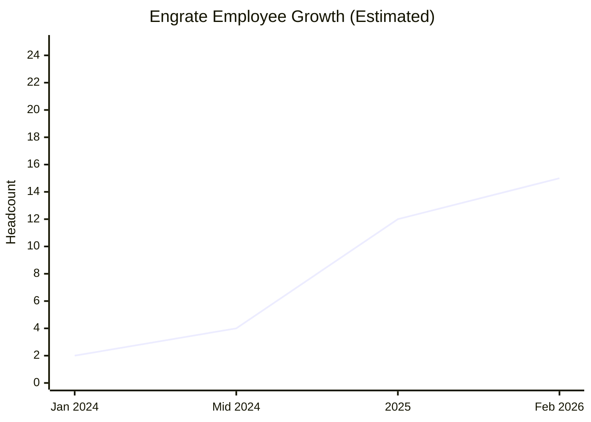
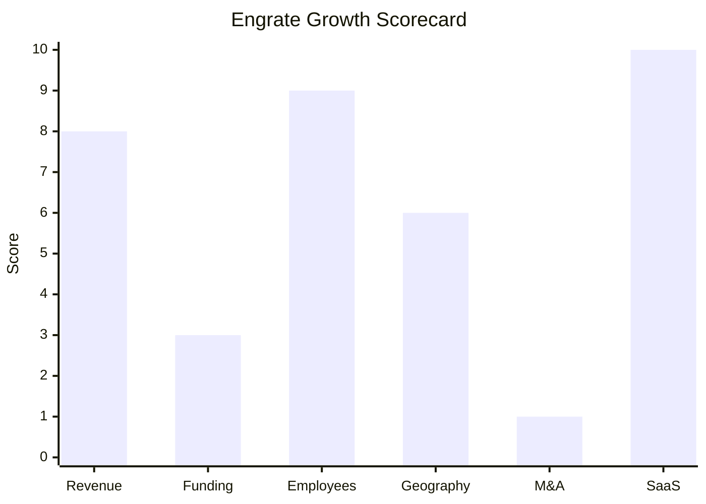

# Financial & Growth Deep-Dive - Engrate AB

**Research Date**: 2026-02-15
**Data Availability**: Low-Medium (VC-funded seed-stage startup; funding data confirmed via press releases and investor databases, but revenue and detailed financials are undisclosed. Employee data estimated from aggregator sites.)

### Revenue Timeline

| Year | Revenue | Currency | EUR Equivalent | YoY Growth | Source | Confidence |
| --- | --- | --- | --- | --- | --- | --- |
| 2026 (est.) | EUR 100K-400K | EUR | EUR 100K-400K | >100% | Proxy: customer count x pricing model | Estimated (proxy) |
| 2025 | EUR 30K-150K | EUR | EUR 30K-150K | N/A (first revenue) | Proxy: 1+ customer at EUR 499/mo + commercial API | Estimated (proxy) |
| 2024 | ~EUR 0 | EUR | ~EUR 0 | N/A | Pre-revenue, product in development | Estimated |
| 2023 | N/A | N/A | N/A | N/A | Company did not exist | Confirmed |

**Revenue CAGR (3yr)**: N/A (company less than 3 years old; meaningful CAGR cannot be calculated)
**Revenue CAGR (5yr)**: N/A

**Revenue Estimation Methodology**:
- No revenue figures are publicly disclosed. Engrate is a seed-stage startup burning through EUR 3M+ in raised capital.
- **Known pricing**: DSO cross-tariff access at EUR 499/month; Power Tariffs API has a free tier with paid upgrade; Schedule Management and Settlement Management API pricing undisclosed (likely higher-value commercial contracts).
- **Known customers**: Flower (Swedish flexibility operator, confirmed). Likely single-digit additional paying customers.
- **Proxy estimate**: 1-5 paying customers x EUR 500-5,000/month average = EUR 6K-300K/year. Midpoint estimate: EUR 50K-200K for 2025 H2-2026.
- The company is definitively **pre-profitability**, funding operations from seed capital.
- **Data gap acknowledgment**: Lack of disclosed revenue is normal for seed-stage European startups. Engrate's Bolagsverket (Swedish Companies Registry) annual report for FY2024 would be the first mandatory filing, but it is not yet publicly searchable.

#### Revenue Trend Chart

Revenue chart not generated -- fewer than 2 meaningful data points exist. All revenue figures are proxy estimates from pricing model analysis.

### Profitability

| Data Point | Value | Source | Confidence |
| --- | --- | --- | --- |
| EBITDA (current) | Negative (burning seed capital) | Inferred from funding stage | Estimated |
| EBITDA Margin | N/A (pre-profitability) | N/A | N/A |
| Net Profit / Loss | Net loss (estimated EUR 500K-1.5M/year burn) | Inferred: 10-20 employees x EUR 60-80K avg + infra | Estimated (proxy) |
| Recurring Revenue % | ~100% (API subscription model) | Business model analysis | Estimated |
| SaaS Revenue % | 100% (cloud API only, no services) | engrate.io product pages | Confirmed |
| Revenue per Employee | EUR 5K-20K (if revenue estimates correct) | Calculated: est. revenue / est. headcount | Estimated (proxy) |

**Profitability Analysis**: Engrate is a textbook seed-stage startup -- all revenue (if any) is dwarfed by operating costs. The EUR 3M+ in raised capital is being deployed to build the platform, hire the team, and acquire initial customers. Profitability is not expected for 2-4+ years. The key metric at this stage is **runway**: at an estimated EUR 80K-125K/month burn rate (10-20 employees + cloud infra), the EUR 2.5M seed provides ~20-31 months of runway from June 2025, lasting approximately until Q1-Q4 2027 without additional revenue or funding.

### Funding & Investment History

| Date | Round | Amount | Lead Investor(s) | Valuation | Source | Confidence |
| --- | --- | --- | --- | --- | --- | --- |
| Jun 2025 | Seed | EUR 2.5M ($2.874M) | Maniv (Tel Aviv, transport/energy VC) | Undisclosed; est. EUR 10-15M post-money | EU-Startups, SiliconCanals, i3Connect | Confirmed (amount); Estimated (valuation) |
| 2024 | Pre-seed | EUR 500K+ | NP-Hard Ventures (Dutch VC) | Undisclosed | StartuReporter, EU-Startups | Confirmed |
| 2024 | Accelerator | Non-dilutive (program value) | Norrsken Foundation | N/A | Norrsken, LinkedIn | Confirmed |

**Total Raised**: EUR 3.0M+ (~$2.9M equivalent per i3Connect)
**Latest Valuation**: Undisclosed; estimated EUR 10-15M post-money (based on typical European seed-round multiples of 4-6x on EUR 2.5M raise)
**Current Investors**:

| Investor | Type | Role | Notes |
| --- | --- | --- | --- |
| Maniv | Global VC (Tel Aviv) | Seed lead | Transport & energy specialization; portfolio includes mobility and energy transition companies |
| Eviny Ventures | Corporate VC (Norway) | Seed co-investor | Venture arm of Eviny, Norwegian renewable energy provider. Strategic energy investor. |
| Course Corrected | Swedish VC | Seed co-investor | Swedish early-stage tech focus |
| NP-Hard Ventures | Dutch VC | Pre-seed lead | Netherlands-based; strategic for NL market entry |
| Norrsken Foundation | Accelerator | Pre-seed/accelerator | Top 20 from 3,000+ applicants in 2024 cohort |
| Pia Irell | Angel | Pre-seed | Individual angel investor |
| Maex Ament | Angel | Pre-seed | Individual angel investor |
| Philip Stehlik | Angel | Pre-seed | Individual angel investor |

**War Chest Signals**: EUR 2.5M seed raised June 2025. At estimated burn rate of EUR 80K-125K/month, runway extends to approximately Q1-Q4 2027. Next fundraise (likely Series A of EUR 5-15M) expected in late 2026 or H1 2027 if traction materializes. No debt financing or government grants disclosed.

### Employee Timeline

| Year | Headcount | YoY Growth | Source | Confidence |
| --- | --- | --- | --- | --- |
| 2026 (current) | 10-20 | +25% to +100% | StartupRise.co.uk, LinkedIn estimates | Estimated |
| 2025 | 8-15 | +300% to +650% | Inferred from funding/founding timeline | Estimated |
| 2024 (mid) | 2-5 | N/A (founding year) | Founding team + first hires | Estimated |
| 2024 (Jan) | 2 | N/A | Founded by Anna Engman + Richard Eklund | Confirmed |
| 2023 | 0 | N/A | Company did not exist | Confirmed |

**Employee CAGR (3yr)**: N/A (company less than 3 years old)
**Employee CAGR (2yr, Jan 2024 - Feb 2026)**: ~200-300% total growth (2 founders to 10-20 employees)
**Current Open Positions**: No public careers page found on engrate.io; no job postings found on LinkedIn/Indeed as of Feb 2026. This suggests the team may be at comfortable capacity for current runway, or hiring is done through network/referral channels.
**Hiring Hotspots**: Stockholm, Sweden (all employees appear to be Stockholm-based)

**Key Personnel**:

| Name | Role | Background | Source |
| --- | --- | --- | --- |
| Anna Engman | Co-founder & CEO | Energy sector experience | EU-Startups, SiliconCanals |
| Richard Eklund | Co-founder & CTO | Ex-Head of Engineering at Tibber, ex-Technical Director at Volvo Cars, ex-Spotify | TheOrg, SiliconCanals |
| Patrik Fagerfjall | Co-founder/Associate | Listed in Norrsken cohort | LinkedIn, Norrsken |
| Christopher Engman | Co-founder/Associate | Listed in Norrsken cohort | LinkedIn, Norrsken |

**Team Capability Signal**: CTO Richard Eklund's background at Tibber (energy tech unicorn), Volvo Cars, and Spotify represents an unusually strong technical pedigree for a seed-stage energy startup. This caliber of founding team is an investor confidence signal and explains the quality of the investor roster.

#### Employee Growth Chart

### Geographic & Market Expansion

| Year | Expansion Event | Details | Source | Confidence |
| --- | --- | --- | --- | --- |
| 2024 Q1 | Founded in Sweden | Stockholm HQ, initial focus on Swedish market (Power Tariffs, Electricity Area Map) | EU-Startups, Norrsken | Confirmed |
| 2024 H2 | Norrsken Accelerator | Joined 2024 cohort (top 20 from 3,000+ applicants) | Norrsken LinkedIn | Confirmed |
| 2025 H1 | Germany market entry | Schedule Management + Settlement Management APIs covering 4 German TSOs (Amprion, 50Hertz, TenneT DE, TransnetBW) | engrate.io product pages | Confirmed |
| 2025 H1 | Netherlands market entry | Schedule Management + Settlement Management covering TenneT NL | engrate.io product pages | Confirmed |
| 2025 H2 | Flower customer expansion | Key customer Flower expanded to DE, NL, FI (Nov 2025) potentially using Engrate APIs | Flower press release, inferred | Estimated |
| 2025-2026 | Northern Europe expansion planned | Seed funding earmarked for "international expansion, with initial focus on Northern Europe" | EU-Startups, SiliconCanals | Confirmed |

**International Revenue %**: Unknown (likely 0-30%; most revenue from Swedish DSO products, DE/NL products are newer)
**Expansion Trajectory**: Rapid virtual expansion via API coverage (no physical offices in new markets). Sweden to Germany + Netherlands in under 18 months. Next targets likely Norway, Denmark, Finland, or Belgium based on Northern Europe focus. Expansion is API-first: entering a new market means building TSO/DSO integrations, not opening offices.

### M&A Activity

| Date | Target | Deal Size | Capability Gained | Strategic Rationale | Source | Confidence |
| --- | --- | --- | --- | --- | --- | --- |
| N/A | None | N/A | N/A | N/A | N/A | Confirmed (none) |

**Divestitures**: None
**M&A Pattern**: No M&A activity. At seed stage with EUR 3M total funding, acquisitions are not feasible. Engrate is more likely to be an **acquisition target** itself than an acquirer, given its API platform model, cloud-native architecture, and multi-market coverage. Potential acquirers could include larger energy software platforms seeking API/cloud capabilities (Volue, KISTERS, Sopra Steria) or infrastructure players wanting energy market API layers.

### SaaS Transition Metrics

| Data Point | Value | Source | Confidence |
| --- | --- | --- | --- |
| Deployment Model | Cloud-native API (born-cloud, never on-premise) | engrate.io | Confirmed |
| Cloud Revenue % (current) | 100% | Business model analysis | Confirmed |
| Cloud Revenue % (1yr ago) | 100% | Business model analysis | Confirmed |
| Cloud Revenue % (2yr ago) | N/A (company did not exist) | N/A | N/A |
| Recurring Revenue % | ~100% (API subscription) | Pricing model analysis (EUR 499/mo DSO; commercial API subscriptions) | Estimated |
| Platform Stack | Cloud-native, REST/JSON APIs, Mintlify docs, MCP Server, AI-native architecture | engrate.io, docs.engrate.io | Confirmed |
| Migration Status | N/A (no migration needed -- cloud-native from founding) | N/A | Confirmed |
| Customer Self-Service | Full self-service: sign up, get API keys, start building; no sales cycle for initial adoption | engrate.io | Confirmed |
| Implementation Timeline | "Days, not months" -- basic integration < 1 day, advanced < 1 week | engrate.io/energy-api-platform | Confirmed |

**SaaS Model Analysis**: Engrate represents the purest API-as-a-product model in the competitive landscape. No on-premise component, no implementation services, no consulting revenue. This gives it the highest possible SaaS maturity score but also means revenue per customer is low compared to traditional enterprise platforms (EUR 499/mo vs EUR 100K+/year for eBase-class deployments). The model trades high per-customer value for low friction adoption and potential for large customer volumes.

### Growth Scorecard

| Dimension | Score (1-10) | Evidence Summary |
| --- | --- | --- |
| Revenue Growth | 8 | Growing from near-zero; any revenue represents explosive YoY growth (>50%), but absolute figures are tiny (est. EUR 30K-400K). Scored 8 not 9-10 because revenue is unproven at meaningful scale. |
| Funding Momentum | 3 | EUR 3M+ total raised in 18 months. Rubric: <EUR 5M = 3-4 range. Strong investor quality (Maniv, Eviny) but small quantum. |
| Employee Growth | 9 | From 2 founders (Jan 2024) to 10-20 employees (Feb 2026) = ~7-10x growth in 2 years. Rapid team building from zero. CTO from Tibber/Volvo/Spotify signals ability to attract talent. |
| Geographic Expansion | 6 | Entered 2 new countries (DE, NL) via API in 18 months from Sweden base. No physical offices abroad. Plans for further Northern Europe expansion. Virtual expansion model is fast but shallow. |
| M&A Activity | 1 | No acquisitions, no divestitures, no M&A signals. Expected at seed stage. |
| SaaS Maturity | 10 | Cloud-native from day one. 100% API/SaaS. Zero on-premise. MCP Server for AI consumption. Purest cloud model in entire competitive landscape. |
| **COMPOSITE SCORE** | **6.2** | **Riser (high variance, high upside)** |

**Classification**: **Riser** (avg 6.2, threshold 5.0-6.9)

**Scorecard Context**: Engrate's composite score of 6.2 reflects extreme variance across dimensions. It scores at or near maximum on SaaS Maturity (10) and Employee Growth (9), but bottoms out on M&A (1) and Funding Momentum (3). This is the classic "seed-stage rocket" profile -- if the next funding round (Series A) materializes at EUR 10M+, the Funding Momentum score jumps to 7-8 and the composite pushes into Rocket territory. The risk is that traction doesn't materialize and the company runs out of runway. **This is the competitor most likely to change classification (either up to Rocket or down to nothing) within 12-18 months.**

#### Growth Scorecard Radar

> The bar chart above shows Engrate's extreme variance: maximum SaaS maturity and strong employee/revenue growth momentum, but minimal funding quantum and zero M&A activity. The "spikey" profile is characteristic of early-stage disruptors -- watch the Funding bar in particular, as a successful Series A would dramatically reshape this scorecard.

### Eneve Contrast Summary

| Dimension | Engrate | Eneve (eBase) | Implication |
| --- | --- | --- | --- |
| Revenue | Pre-revenue (est. EUR 100K-400K) | Established (multi-million EUR) | Eneve has massive revenue advantage today |
| Funding | EUR 3M+ seed, VC-backed | Self-funded / parent company | Engrate has external growth capital; Eneve does not |
| Employees | 10-20, growing fast | ~50+, stable | Eneve larger but Engrate growing faster |
| Geography | SE + DE + NL (API coverage) | NL primary, BE expanding | Engrate already covers more markets |
| Cloud Model | 100% cloud-native API | MSSQL on-premise, migrating | Engrate is architecturally 10 years ahead |
| Time to Customer | Days (self-service API) | Months (implementation project) | Fundamentally different adoption models |
| Revenue Model | API subscriptions (EUR 499/mo+) | Enterprise licensing (EUR 100K+/yr) | Different market segments, convergence risk |

**Strategic Assessment**: Engrate is not a revenue threat today, but it is an **architectural threat** and a **narrative threat**. When enterprise customers see that TSO schedule management can be done via a simple API call with a free tier, it reframes what they expect from incumbent platforms. The danger for Eneve is not that Engrate steals existing customers -- it's that Engrate captures the *next generation* of customers who would never consider a 6-month on-premise implementation.

### Key Risks & Watch Items

1. **Series A trigger**: If Engrate raises EUR 10M+ Series A in 2026-2027, reclassify from Riser to Rocket. This would signal product-market fit confirmation and accelerated hiring/expansion.
2. **Customer traction in NL**: Monitor for Engrate customer wins among Dutch energy companies that are also eBase prospects or customers. TenneT NL integration is already live.
3. **EDSN protocol entry**: If Engrate adds EDSN protocol support, it enters Eneve's core differentiation territory.
4. **Gas market entry**: Currently electricity-only. Gas capabilities would represent a significant capability expansion.
5. **Partnership announcements**: An integration partnership with a larger platform (e.g., Volue, KISTERS) could accelerate Engrate's reach dramatically.
6. **Runway clock**: At estimated burn, runway extends to Q1-Q4 2027. If no Series A materializes, the company faces a down-round or wind-down scenario.
7. **Acqui-hire risk**: The founding team's pedigree (Tibber, Spotify, Volvo) makes Engrate an attractive acqui-hire target for larger energy software companies seeking cloud/API talent.
