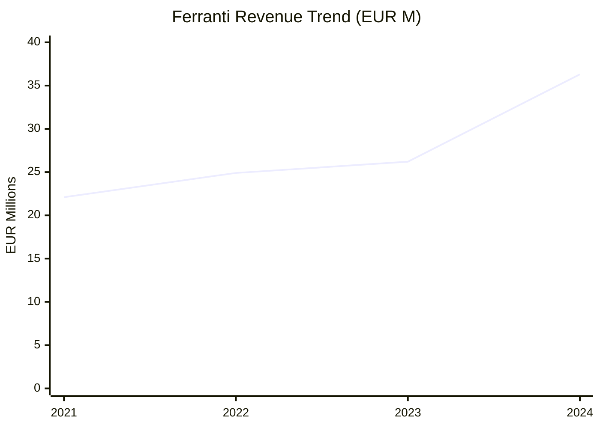
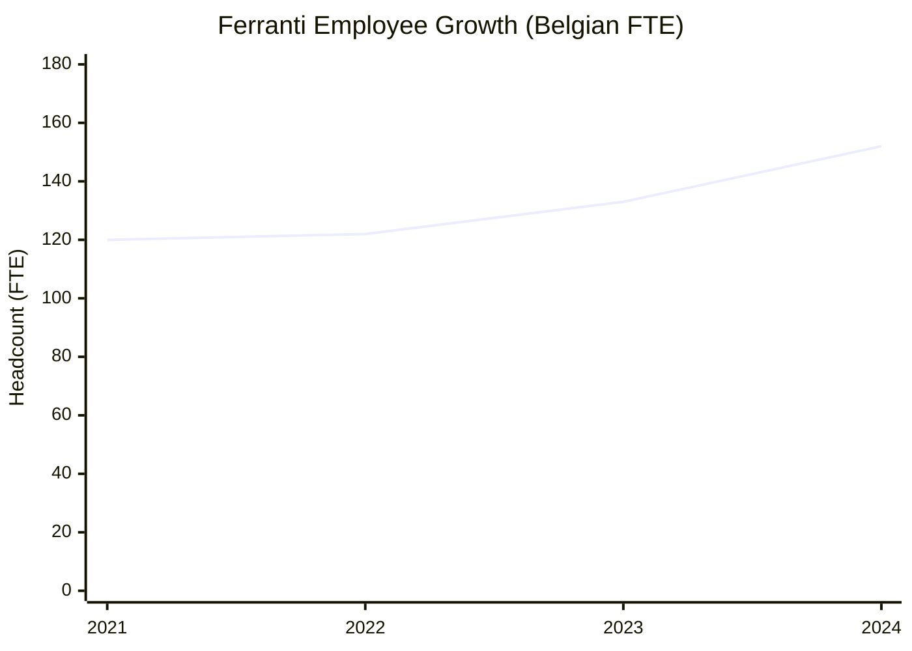
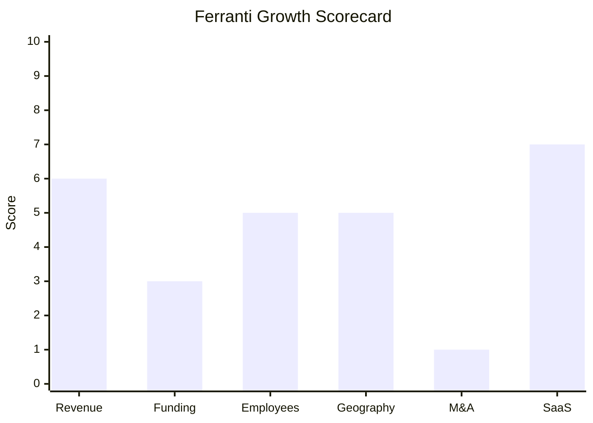

# Financial & Growth Deep-Dive - Ferranti Computer Systems

**Research Date**: 2026-02-15
**Data Availability**: Medium-High (private company, but Belgian NBB mandatory filings provide 4 years of verified revenue/headcount data)

### Revenue Timeline

| Year | Revenue | Currency | EUR Equivalent | YoY Growth | Source | Confidence |
| --- | --- | --- | --- | --- | --- | --- |
| 2024 | €36,322,612 | EUR | €36,322,612 | +38.7% | CompanyWeb.be (NBB filing, filed 2025-06-20) | Confirmed |
| 2023 | €26,183,798 | EUR | €26,183,798 | +5.0% | CompanyWeb.be (NBB filing) | Confirmed |
| 2022 | €24,934,190 | EUR | €24,934,190 | +12.6% | CompanyWeb.be (NBB filing) | Confirmed |
| 2021 | €22,141,631 | EUR | €22,141,631 | Unknown | CompanyWeb.be (NBB filing) | Confirmed |
| 2020 | Unknown | EUR | Unknown | Unknown | Not available in registry search | Unknown |

**Revenue CAGR (3yr, 2021-2024)**: 17.9%
**Revenue CAGR (5yr)**: Not calculable (2020 data unavailable)

**Note**: Revenue figures are for the Belgian entity Ferranti Computer Systems NV (BE0416.296.878) only. The company also has subsidiary operations in UK (Ferranti Computer Systems Ltd, company 09869633), North Macedonia (Skopje office), and Singapore. Consolidated global revenue is likely higher than the Belgian entity alone but not publicly disclosed.

**Key observation**: The 2024 revenue jump of +38.7% is exceptional for a 48-year-old company. This likely reflects a combination of new customer go-lives (12 in 2025 alone) and cloud SaaS subscription revenue compounding. The 2023 growth of only +5% followed by 2024's +39% suggests major project deliveries or licensing milestones in 2024.

#### Revenue Trend Chart

### Profitability

| Data Point | Value | Source | Confidence |
| --- | --- | --- | --- |
| EBITDA (current) | Not separately disclosed | Private company | Unknown |
| Gross Margin (2024) | €21,551,635 (59.3%) | CompanyWeb.be (NBB filing) | Confirmed |
| Gross Margin (2023) | Not available in search results | Private company | Unknown |
| Net Profit (2024) | €2,882,132 (7.9% margin) | CompanyWeb.be (NBB filing) | Confirmed |
| Net Profit (2023) | ~€524K est. (implied by 450% increase) | Derived from 2024 delta | Estimated |
| Equity (2024) | €9,312,127 (+45% YoY) | CompanyWeb.be (NBB filing) | Confirmed |
| Recurring Revenue % | Not disclosed; SaaS subscription is primary model | ferranti.be | Estimated |
| SaaS Revenue % | Not disclosed; cloud SaaS is primary deployment model since 2019 | ferranti.be | Estimated |
| Revenue per Employee (Belgian entity) | €238,650 | Calculated: €36.3M / 152.2 FTE | Confirmed |
| Revenue per Employee (Global est.) | ~€145,000 | Calculated: €36.3M / ~250 total employees | Estimated |

**Profitability assessment**: Ferranti turned decisively profitable in 2024 with a 7.9% net margin and 59% gross margin. The 450% profit increase from 2023 to 2024 suggests the company crossed a profitability inflection point, possibly driven by SaaS subscription revenue scaling while implementation costs remained stable. Belgian entity equity of €9.3M provides a modest but growing capital base.

### Funding & Investment History

| Date | Round | Amount | Lead Investor(s) | Valuation | Source | Confidence |
| --- | --- | --- | --- | --- | --- | --- |
| 1994 | Acquisition by Nijkerk Group | Unknown | Nijkerk Ontwikkel Maatschappij | Unknown | ferranti.be/about, nijkerk.nl | Confirmed |
| 1976 | Founding (Ferranti International plc subsidiary) | Unknown | Ferranti International plc | N/A | ithistory.org | Confirmed |

**Total Raised**: €0 external funding (self-funded through operations under Nijkerk Group ownership)
**Latest Valuation**: N/A -- privately held, no external valuation events
**Current Investors**: Nijkerk Ontwikkel Maatschappij (100% owner since 1994). Nijkerk is a Belgian industrial IT holding company with roots in electronics distribution dating to early 1900s.
**War Chest Signals**: Belgian entity equity of €9.3M. No external debt financing visible. Cash position not disclosed. Operating profitability provides self-funding capability for organic growth. No signals of PE interest, acquisition war chest, or external capital raising.

**Funding assessment**: Ferranti operates entirely within the Nijkerk Group structure with no external funding history. This is typical of Belgian family/holding-owned software companies. The advantage is independence and long-term orientation; the disadvantage is limited capital for transformative investments (major acquisitions, AI R&D labs, aggressive geographic expansion).

### Employee Timeline

| Year | Headcount (Belgian FTE) | YoY Growth | Global Estimate | Source | Confidence |
| --- | --- | --- | --- | --- | --- |
| 2025 (current) | ~165 est. | ~8% est. | 250+ (23 new hires in 2025) | ferranti.be 2025 review | Estimated |
| 2024 | 152.2 | +14.5% | ~240 est. | CompanyWeb.be (NBB filing) | Confirmed (BE), Estimated (global) |
| 2023 | 132.9 | +9.3% | ~220 est. | CompanyWeb.be (NBB filing) | Confirmed (BE), Estimated (global) |
| 2022 | 121.6 | +1.2% | ~200 est. | CompanyWeb.be (NBB filing) | Confirmed (BE), Estimated (global) |
| 2021 | 120.1 | Unknown | ~190 est. | CompanyWeb.be (NBB filing) | Confirmed (BE), Estimated (global) |

**Employee CAGR (3yr, 2021-2024, Belgian FTE)**: 8.2%
**Current Open Positions**: Not enumerable from web search (careers page not accessible); company actively recruiting via job fairs (KU Leuven, Thomas More, UA) and hosting dedicated Job Event (April 2025)
**Hiring Hotspots**: Belgium (primary), North Macedonia (Skopje development center), UK (new sales hires in 2025 targeting UK/Nordics), Singapore (APAC operations)
**AI/ML Hiring**: No AI/ML-specific job postings found. Hiring focuses on Dynamics 365 consultants, solution architects, .NET developers.

**Notable**: Average employee tenure exceeds 10 years (per ferranti.be/about), indicating exceptionally high retention. The "Ride to Shine" junior consultant program suggests investment in growing talent internally rather than poaching.

#### Employee Growth Chart

### Geographic & Market Expansion

| Year | Expansion Event | Details | Source | Confidence |
| --- | --- | --- | --- | --- |
| 2026 | Germany market push | E-world 2026 (Feb, Essen) targeting commercial electricity and gas suppliers with country templates | ferranti.be/news | Confirmed |
| 2025-2026 | Switzerland entry | Nexplore partnership for Swiss energy/utility market; first project underway | ferranti.be/partners/nexplore | Confirmed |
| 2025 | UK/Nordic sales expansion | Hired Gemma & Willem for UK and Nordic market development | ferranti.be/news | Confirmed |
| 2019-ongoing | Italy market entry | Utilia partnership, MECOMS4ITA for Italian energy retail; Sorgenia as customer | technologyrecord.com, ferranti.be | Confirmed |
| 2019 | Skopje office established | Development center in North Macedonia | ferranti.be/about | Confirmed |
| 2016 | UK office opened | Manchester office for UK market | thebusinessdesk.com | Confirmed |
| 2010 | Singapore APAC office | PacificLight Energy, Tuas Power as APAC customers | ferranti.be/about | Confirmed |

**International Revenue %**: Not disclosed
**Expansion Trajectory**: Ferranti is pursuing a partnership-led geographic expansion model (Nexplore for Switzerland, Utilia for Italy) rather than opening owned offices. The E-world 2026 presence signals intent to enter the German commercial energy market. The recent UK/Nordic sales hires indicate a push into Northern Europe. Overall pace is measured and deliberate, expanding through partnerships and country-specific templates rather than aggressive geographic scaling.

### M&A Activity

| Date | Target | Deal Size | Capability Gained | Strategic Rationale | Source | Confidence |
| --- | --- | --- | --- | --- | --- | --- |
| -- | No acquisitions found (last 5 years) | -- | -- | -- | Web search | Confirmed |

**Divestitures**: None
**M&A Pattern**: Ferranti has no M&A activity whatsoever. The company grows purely organically through product development and partnership-based market entry. This is consistent with the Nijkerk Group's holding company model and the company's measured, long-term approach. No CEO interviews or analyst commentary signal any M&A appetite.

### SaaS Transition Metrics

| Data Point | Value | Source | Confidence |
| --- | --- | --- | --- |
| Deployment Model | Cloud SaaS (primary) + on-premise available | ferranti.be, appsource.microsoft.com | Confirmed |
| Cloud Revenue % (current) | Not disclosed; SaaS is primary deployment since 2019 | ferranti.be | Estimated |
| Cloud Revenue % (1yr ago) | Not disclosed | Private company | Unknown |
| Cloud Revenue % (2yr ago) | Not disclosed | Private company | Unknown |
| Recurring Revenue % | Not disclosed; subscription SaaS model dominant | ferranti.be | Estimated |
| Platform Stack | Microsoft Dynamics 365 F&O, Azure, Power Platform (BI, Apps, Automate, Virtual Agents), Copilot Studio, .NET, C# | ferranti.be/technology | Confirmed |
| Migration Status | Complete (cloud-first since 2019, 100th cloud release achieved 2025) | ferranti.be 2025 review | Confirmed |
| Release Cadence | Every 3 weeks (continuous cloud releases since 2019) | ferranti.be | Confirmed |
| Certifications | ISO 27001, ISO 9001; Microsoft Dynamics certified with independent 3rd-party testing per release | ferranti.be/about | Confirmed |

**SaaS assessment**: Ferranti's SaaS transition is mature and well-executed. The 100th cloud release milestone (2025) and 3-week release cadence demonstrate a genuine cloud-native operation, not a lift-and-shift. Building on Microsoft Dynamics 365/Azure provides enterprise-grade infrastructure without proprietary cloud investment. The on-premise option remains for regulated utilities requiring data sovereignty, but cloud is clearly the primary model. The 2024 revenue jump (+39%) may partly reflect the compounding effect of SaaS subscription revenue as more customers move to cloud.

### Growth Scorecard

| Dimension | Score (1-10) | Evidence Summary |
| --- | --- | --- |
| Revenue Growth | 6 | 3yr CAGR 17.9%; exceptional +39% YoY in 2024; solidly in the 10-20% CAGR range with upward momentum |
| Funding Momentum | 3 | Zero external funding; self-funded under Nijkerk Group; profitable bootstrap model |
| Employee Growth | 5 | Belgian FTE CAGR 8.2% (3yr); 23 new hires in 2025; steady growth but no aggressive scaling |
| Geographic Expansion | 5 | Switzerland (new partnership 2025/26), Germany (E-world 2026 push), UK/Nordic hires; partnership-led model |
| M&A Activity | 1 | Zero acquisitions, zero divestitures, no M&A signals whatsoever; purely organic growth |
| SaaS Maturity | 7 | Cloud-first since 2019, 100th release, 3-week cadence, Microsoft D365/Azure stack; on-prem still available |
| **COMPOSITE SCORE** | **4.5** | **Steady -- profitable and growing organically with strong SaaS maturity, but no external investment or M&A** |

**Classification Thresholds**:

- **Rocket** (avg 7.0-10.0): Explosive growth, heavy investment, market disruptor
- **Riser** (avg 5.0-6.9): Strong growth signals, investing in future, accelerating
- **Steady** (avg 3.0-4.9): Stable but not transforming, evolutionary
- **Dinosaur** (avg 1.0-2.9): Flat or declining, legacy mode, no visible investment

#### Growth Scorecard Radar

> The bar chart shows Ferranti's distinctive "steady grower" fingerprint: strong SaaS maturity (7) and decent revenue growth (6) offset by zero M&A activity (1) and no external funding (3). The company's strength is its Microsoft-powered SaaS platform and organic growth discipline; its vulnerability is the absence of capital for transformative moves. Compared to well-funded competitors (tem at $75M, Previse at $52M+), Ferranti cannot compete on investment pace -- but its profitability and 48-year track record provide stability that VC-funded startups lack.

### Strategic Implications for Eneve

**Revenue reality check**: Ferranti's actual revenue (€36.3M in 2024) is more than double the Growjo estimate ($16.7M / ~€15M) previously cited. This makes Ferranti a significantly larger competitor than initially assessed, roughly comparable to Eneve's estimated scale.

**Profitability advantage**: Ferranti is profitable and self-funding, with improving margins. This means they can sustain long-term competition without external funding pressure or VC-driven timelines. They won't suddenly disappear due to funding gaps.

**SaaS maturity as competitive moat**: The 100th cloud release and 3-week cadence on Microsoft Dynamics 365 gives Ferranti a genuine cloud platform advantage in the Belgian utility market. Microsoft's ongoing AI investments (Copilot, Azure AI) flow automatically into Ferranti's platform without dedicated AI R&D spend.

**Growth acceleration in 2024**: The +39% revenue jump warrants attention. If this trend continues, Ferranti's 3yr CAGR could reach 25%+ by 2025, pushing them toward "Riser" classification. The Swiss partnership and German market push suggest the company is entering a more ambitious growth phase after years of steady expansion.

**M&A vulnerability**: With zero M&A capability, Ferranti cannot acquire its way into new capabilities (AI, balancing, settlement). If a larger player decided to enter the Belgian MDM/CIS space through acquisition, Ferranti could itself become an acquisition target -- especially given the Nijkerk Group holding structure and the €9.3M equity base that suggests a modest valuation.
