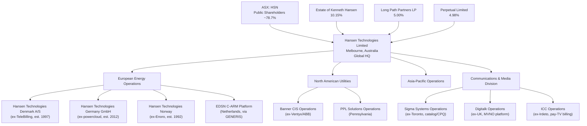
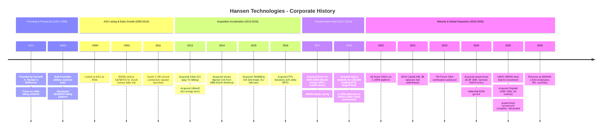
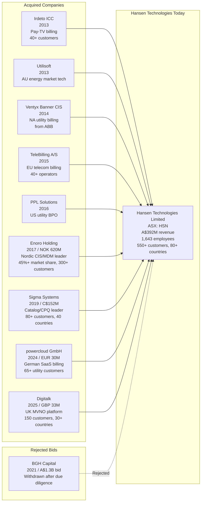

# Corporate History - Hansen Technologies

**Research Date**: 2026-02-16
**Genealogy Confidence**: High (ASX-listed since ~2000, extensive press releases, annual reports, M&A databases, and public filings available)

---

### Current Ownership & Key Parties

| Stakeholder | Role | Stake % | Type | Since | Source |
|---|---|---|---|---|---|
| Estate of Kenneth Hansen | Founding family estate | 10.15% | Founder/Family | 1971 | MarketScreener, ASX filings | Confirmed |
| Long Path Partners LP | Significant shareholder | 5.00% | Institutional investor | Unknown | MarketScreener | Confirmed |
| Perpetual Limited | Significant shareholder | 4.98% | Institutional investor (Australian) | Unknown | MarketScreener | Confirmed |
| Investors Mutual Ltd. | Minor institutional holder | 0.84% | Institutional investor | Unknown | MarketScreener | Confirmed |
| Andrew Hansen | CEO & Managing Director | 0.34% | Founder's family / Executive | Unknown | MarketScreener | Confirmed |
| Public float | Retail & other institutional | ~78.7% | Public (ASX: HSN) | ~2000 | ASX | Estimated |

**Note**: Andrew Hansen conducted a A$37.8M block trade of 7 million shares in August 2023 following FY23 results, reducing the family's direct holding. The Estate of Kenneth Hansen retains the largest single block at 10.15%.

**Board of Directors**:

| Name | Role | Represents | Background | Source |
|---|---|---|---|---|
| David Dundas Trude | Non-Executive Independent Chairman | Independent | Board governance | Reuters, ASX filings | Confirmed |
| Andrew Hansen | Global CEO & Managing Director | Founding family | Son/heir of founder Kenneth Hansen; operational leadership since pre-2017 | Reuters, company website | Confirmed |
| Bruce Adams | Non-Executive Director | Historical major shareholder (~17.5% at BGH bid time) | Long-standing board member | Reuters, AFR | Confirmed |
| David Howell | Non-Executive Independent Director | Independent | Governance | Reuters | Confirmed |
| Lisa Pendlebury | Non-Executive Independent Director | Independent | Governance | Reuters | Confirmed |
| Don Rankin | Non-Executive Independent Director | Independent | Governance | Reuters | Confirmed |
| Rebecca Wilson | Non-Executive Independent Director | Independent | Governance | Reuters | Confirmed |

**Corporate Structure** (Mermaid diagram):



---

### Origin Story

| Data Point | Value | Source | Confidence |
|---|---|---|---|
| Founded | 1971 | Company website, ASX filings, Mergr | Confirmed |
| Original Name | Hansen Technologies (no evidence of prior name) | Company website | Confirmed |
| Founder | Kenneth A. Hansen | Company website, Australian Stock Report | Confirmed |
| Original Mission | Managing customer and organizational data; billing and data management software | MatrixBCG, company history | Confirmed |
| Original Product | Billing systems software for service providers | Company website, AnnualReports.com | Confirmed |
| First Market | Australian utilities (gas, electricity, water) | IBISWorld, company history | Estimated |
| Incorporation | Melbourne, Victoria, Australia | ASX filings | Confirmed |

Hansen Technologies was founded in 1971 by Kenneth A. Hansen in Melbourne, Australia. The company's initial focus was on billing and customer data management software for utilities. For nearly three decades it operated as a privately held Australian company, building deep expertise in utility billing systems before listing on the ASX around 2000. The company has remained headquartered in Melbourne throughout its 55-year history, maintaining a remarkably stable corporate identity with no known name changes.

---

### Corporate Identity Changes

| # | Date | From | To | Reason | Source |
|---|---|---|---|---|---|
| -- | -- | -- | -- | No corporate name changes identified | Multiple sources | Confirmed |

Hansen Technologies has maintained its original corporate name since founding in 1971. Unlike many competitors that have undergone multiple rebrands through M&A, Hansen has consistently operated under its founding identity, absorbing acquisitions into the Hansen brand rather than rebranding itself.

**Product brand changes** (acquired brands absorbed into Hansen):
- Enoro products rebranded to Hansen CIS/MDM/EDM (Nordic energy suite)
- Sigma Systems products rebranded to Hansen Catalog, Hansen CPQ
- Irdeto Customer Central (ICC) maintained as Hansen CCB
- powercloud maintained as "Hansen powercloud" within Hansen CIS
- TeleBilling absorbed into Hansen Communications suite
- Digitalk brand maintained post-acquisition (as of Feb 2026)

---

### Mergers & Acquisitions Timeline

#### Acquisitions Made (as buyer)

| Date | Target Company | Deal Value | What Was Gained | Integration Outcome | Source |
|---|---|---|---|---|---|
| 2013-01 | Irdeto Customer Central (ICC) | Undisclosed (from Naspers/Irdeto Inc.) | Pay-TV billing & customer care for 40+ customers globally; offices in USA, China, Argentina, South Africa, India, NL | Integrated as Hansen CCB; served DIRECTV LatAm, Univisa | Hansen press release, Mergr | Confirmed |
| 2013-03 | Utilisoft Pty. | Undisclosed (internal cash) | Melbourne-based electricity & gas market access technology; real-time energy market interaction software | Integrated into Hansen energy suite | MarketScreener, Mergr | Confirmed |
| 2014-05 | Ventyx Banner CIS (from ABB) | Undisclosed (internal cash + debt) | North American utilities billing & customer care; 30+ US states, Canada, Caribbean; 33 subject matter experts | Integrated; represented >10% of combined revenue; immediately accretive | Hansen press release, Newswire | Confirmed |
| 2015-05 | TeleBilling A/S | Undisclosed | Danish/European OSS/BSS billing for 40+ Tier-1/2 telecom operators; CRM, ERP, triple/quad-play billing; 95 staff; offices in Sonderborg (DK) and Hamburg (DE) | Integrated; represented ~20% of combined revenue; formed basis of Hansen Technologies Denmark A/S | PRNewswire, MarketScreener | Confirmed |
| 2016-07 | PPL Solutions LLC | Undisclosed | US utility billing & BPO services (Allentown, Pennsylvania) | Integrated into North American operations | MergerLinks, Mergr | Confirmed |
| 2017-07 | Enoro Holding A/S | NOK 620M (~A$96M) enterprise value | Nordic CIS/MDM market leader; 45%+ Nordic market share; 300+ customers; 250+ employees; offices in NO, SE, FI, DE, NL, CH, AT. Founded 1992, HQ Dale, Norway. Previously owned by Herkules Capital (since 2010) | Integrated as Hansen Energy suite (Nordic); Enoro products became Hansen CIS/MDM/EDM for energy; A$50M equity raising to fund | Hansen press release, Reuters, Alpha.no | Confirmed |
| 2019-06 | Sigma Systems | C$152.2M (~A$165M) | Toronto-based catalog-driven software leader; 80+ customers across 40 countries; Catalog, CPQ, Order Management, Provisioning; previously owned by Birch Hill Equity Partners (since 2015) | Integrated as Hansen Catalog & Hansen CPQ; largest acquisition to date; cross-sell into energy customers | Hansen press release, Lexpert, FinancialPost | Confirmed |
| 2024-02 | powercloud GmbH | EUR 30M (~A$49M) | German SaaS billing for utilities; 65+ customers; 300+ employees (reduced to ~140 post-acquisition); cloud-native billing; full German MaKo compliance. Founded 2012 | Turnaround acquisition: workforce cut from ~390 to ~140; A$31M+ annual cost savings; rebranded to Hansen Technologies Germany GmbH (Jul 2025); integrated into Hansen CIS | Hansen press release, ASX announcement | Confirmed |
| 2025-12 | Digitalk Group Holdings Ltd | GBP 33.1M (~A$66.4M) | UK MVNO/carrier-grade platform; 150 customers in 30+ countries; 60 staff; 90%+ recurring revenue (GBP 10.5M); full-stack MVNO billing/CRM/provisioning. Founded 1996, HQ Milton Keynes, UK | Completed Dec 31, 2025; immediately accretive to EPS; expands communications recurring revenue | ASX announcement, ProactiveInvestors | Confirmed |

**Estimated additional acquisition** (details sparse):
- ~2016: A second 2016 acquisition is indicated in M&A databases (Tracxn shows 2 acquisitions in 2016) but specific target company name beyond PPL Solutions could not be confirmed from public sources.

#### Acquired By (as target)

| Date | Acquiring Company | Deal Value | Strategic Rationale | Outcome | Source |
|---|---|---|---|---|---|
| 2021-06 | BGH Capital (PE firm, unsolicited bid) | A$1.3B (A$6.50/share, 25.5% premium) | PE roll-up / take-private of utility software platform | **Withdrawn** by BGH in Sep 2021 after extensive due diligence; no reason disclosed; Hansen remained independent | Reuters, AFR, TheMarketOnline | Confirmed |

Hansen Technologies has never been acquired. The only known takeover attempt was BGH Capital's unsolicited A$1.3B bid in June 2021, which was initially supported by the board and major shareholders (Andrew Hansen at 17.5%, David Osborne at 17.5%, Bruce Adams at 17.5%) but was withdrawn by BGH after due diligence without disclosed reason.

---

### Investment & Financial Events

| Date | Event Type | Details | Investors/Counterparty | Investor Type | Amount | Source |
|---|---|---|---|---|---|---|
| ~2000 | IPO | Listed on Australian Securities Exchange (ASX) under ticker HSN | Public markets | Public | Unknown | ASX, company references | Estimated |
| 2017-07 | Equity Raising | Institutional placement + share placement to fund Enoro acquisition | Institutional investors | Public markets | A$50M (A$40M institutional + A$10M placement) | Reuters, ASX announcement | Confirmed |
| 2021-06 | PE Buyout Bid (Withdrawn) | BGH Capital non-binding proposal at A$6.50/share; board-supported | BGH Capital | PE | A$1.3B (proposed, not completed) | Reuters, AFR | Confirmed |
| 2023-08 | Block Trade (family sell-down) | Andrew Hansen sold 7M shares post-FY23 results | Public market buyers | Family divestment | A$37.8M | Henslow, AFR | Confirmed |
| 2025-01 | Minority Investment | 30% stake in Dial AI for AI-enhanced customer interaction | Dial AI | Strategic investment | A$2.2M | Hansen 1H25 results | Confirmed |

**Revenue Milestones**:

| Period | Revenue | Growth | Source | Confidence |
|---|---|---|---|---|
| FY16 | ~A$149M | +41% (acquisition-driven) | Intelligent Investor | Estimated |
| FY20 | ~A$296M | Combined segments | ASX FY20 filing | Confirmed |
| FY22 | A$296.5M | Baseline | Company press release | Confirmed |
| FY23 | A$311.8M | +5.2% | ASX Annual Report | Confirmed |
| FY24 | A$353.1M | +13.2% (organic core: +7.3%) | ASX Annual Report | Confirmed |
| FY25 | A$392.5M | +11.2% | ASX Annual Report | Confirmed |

---

### Splits, Spin-offs & Divestitures

| Date | Event Type | What Was Separated | Destination / Buyer | Reason | Source |
|---|---|---|---|---|---|
| -- | -- | No known spin-offs or divestitures | -- | -- | Multiple sources | Confirmed |

Hansen Technologies has no documented spin-offs, divestitures, or demergers in its corporate history. The company has operated as a pure acquirer, absorbing companies into its portfolio without divesting business units. This is notable given many peers (ABB/Ventyx, ION Group, Hitachi) have divested energy software assets that Hansen subsequently acquired.

---

### Critical Events & Milestones

| Date | Event | Impact | Source |
|---|---|---|---|
| 1971 | Founded by Kenneth A. Hansen in Melbourne | Established utility billing software company | Company website | Confirmed |
| ~2000 | IPO on ASX (ticker: HSN) | Transition from private to public company; enabled M&A funding | ASX filings | Estimated |
| ~2001 | EDSN/CGI begin Dutch energy data hub (using Hansen GENERIS) | Hansen platform selected for Netherlands central energy data infrastructure | CGI case study | Confirmed |
| 2011 | EDSN Central Connection Register (C-AR) launched on GENERIS | Hansen platform underpins Dutch energy market liberalization infrastructure | CGI case study | Confirmed |
| 2013-01 | Irdeto ICC acquisition | Entry into pay-TV billing; expanded to Latin America, Africa, Asia | Hansen press release | Confirmed |
| 2013-03 | Utilisoft acquisition | Expanded Australian energy market technology capabilities | MarketScreener | Confirmed |
| 2014-05 | Ventyx Banner CIS acquisition (from ABB) | Major North American utilities billing entry; 30+ US states | Hansen press release | Confirmed |
| 2015-05 | TeleBilling A/S acquisition | European telecom billing entry; 40+ operators across Northern/Central Europe | PRNewswire | Confirmed |
| 2016-07 | PPL Solutions acquisition | US utility billing BPO expansion | MergerLinks | Confirmed |
| 2017-07 | Enoro Holding acquisition (NOK 620M) | Transformative Nordic energy market entry; 45%+ CIS market share; 300+ customers | Hansen press release, Reuters | Confirmed |
| 2019-06 | Sigma Systems acquisition (C$152.2M) | Largest-ever acquisition; catalog/CPQ capabilities; 80+ customers in 40 countries | Hansen press release, Lexpert | Confirmed |
| 2019-07 | C-ARM solution delivered for EDSN | Hansen GENERIS now processes 100% of Dutch electricity/gas connections (15M+ metering points) | CGI case study | Confirmed |
| 2020 | All Dutch DSOs transitioned to C-ARM | Hansen platform becomes sole infrastructure for Dutch energy data processing (4M messages/day peak) | CGI case study | Confirmed |
| 2020 | City of Regina & City of Columbus CIS go-lives | Major North American municipal utility wins | Hansen press releases | Confirmed |
| 2021-06 | BGH Capital A$1.3B takeover bid | PE interest validated company value; board supported but BGH withdrew after due diligence | Reuters, AFR | Confirmed |
| 2021-09 | BGH Capital withdraws bid | Hansen remained independent; share price fell ~8-11% | AFR, TheMarketOnline | Confirmed |
| 2021-10 to 2021-12 | Fortum mFRR/aFRR/day-ahead/intraday trading agreements | Expanded Hansen Trade adoption with major Nordic energy company | Hansen press release | Confirmed |
| 2023 | TM Forum "Ready For ODA" status achieved | Among first vendors globally with ODA certification; 11 certified Open APIs | Hansen press release, TM Forum | Confirmed |
| 2023-08 | Andrew Hansen A$37.8M block trade | Founding family reduced direct holding; signaled maturity of institutional ownership | Henslow, AFR | Confirmed |
| 2024-02 | powercloud acquisition (EUR 30M) | German DACH market entry; 65+ utility customers; aggressive turnaround play | ASX announcement | Confirmed |
| 2024-05 | Vattenfall EDM go-live (Sweden/Denmark/Norway) | Major Nordic energy data management deployment | BusinessWire | Confirmed |
| 2024 | TM Forum Catalyst with AWS, NTT Data (AI-driven offer lifecycle) | GenAI product catalog rationalization using LLMs; Telefonica, Verizon, Viasat participation | AWS blog, TM Forum | Confirmed |
| 2024-2025 | powercloud turnaround: staff reduced ~390 to ~140 | A$31M+ annual cost savings; powercloud on path to EBITDA positive | ASX FY25 results | Confirmed |
| 2025-01 | 30% stake in Dial AI | Strategic minority investment for AI-enhanced customer interaction | Hansen 1H25 results | Confirmed |
| 2025-07 | powercloud rebranded to Hansen Technologies Germany GmbH | Full integration complete; German operations under Hansen brand | Hansen press release | Confirmed |
| 2025 | VMO2 A$50M five-year master agreement | Largest single communications deal; major UK customer win | Hansen 1H25 results | Confirmed |
| 2025-12 | Digitalk acquisition completed (GBP 33.1M) | UK MVNO platform; 150 customers in 30+ countries; 90%+ recurring revenue | ASX announcement | Confirmed |
| 2026-02 | E-world 2026 exhibition (Essen, Germany) | Showcasing Hansen energy suite to European energy market | Hansen events page | Confirmed |

---

### Corporate Timeline (Visual)



---

### M&A Genealogy (Visual)



---

### Corporate Timeline (Text Summary)

```text
1971 - Founded by Kenneth A. Hansen in Melbourne, Australia as utility billing software company
~2000 - Listed on Australian Securities Exchange (ASX: HSN)
~2001 - EDSN/CGI select Hansen GENERIS for Dutch central energy data hub
2011 - Dutch Central Connection Register (C-AR) goes live on GENERIS platform
2013 - Acquired Irdeto ICC (pay-TV billing, 40+ customers globally, from Naspers subsidiary)
2013 - Acquired Utilisoft (Melbourne energy market access technology)
2014 - Acquired Ventyx Banner CIS from ABB (North American utility billing, 30+ US states)
2015 - Acquired TeleBilling A/S (Danish/European telecom billing, 40+ Tier-1/2 operators)
2016 - Acquired PPL Solutions (US utility billing BPO, Allentown, Pennsylvania)
2016 - Revenue reaches ~A$149M (+41% YoY, acquisition-driven)
2017 - Acquired Enoro Holding for NOK 620M (Nordic CIS/MDM market leader, 45%+ share, 300+ customers)
2017 - A$50M equity raising to fund Enoro acquisition
2019 - Acquired Sigma Systems for C$152.2M (largest-ever deal; catalog/CPQ, 80+ customers)
2019 - C-ARM solution delivered for EDSN (100% of Dutch electricity/gas connections)
2020 - All 7 Dutch DSOs transitioned to C-ARM; Hansen processes 15M+ metering points nationwide
2020 - Revenue reaches ~A$296M
2021 - BGH Capital proposes A$1.3B (A$6.50/share) PE buyout; board and major shareholders support
2021 - BGH withdraws bid after due diligence without disclosed reason; Hansen remains independent
2023 - Achieved TM Forum "Ready For ODA" status (among first vendors globally)
2023 - Andrew Hansen family block trade: A$37.8M sale of 7M shares
2023 - Revenue reaches A$311.8M
2024 - Acquired powercloud GmbH for EUR 30M (German SaaS billing, 65+ utilities; turnaround play)
2024 - Vattenfall EDM go-live across Sweden, Denmark, Norway
2024 - Revenue reaches A$353.1M (+13.2%)
2025 - powercloud turnaround: workforce reduced ~390 to ~140; A$31M+ annual cost savings
2025 - VMO2 A$50M five-year master agreement (largest comms deal)
2025 - Invested A$2.2M for 30% stake in Dial AI (AI customer interaction)
2025 - powercloud rebranded to Hansen Technologies Germany GmbH (full integration)
2025 - Acquired Digitalk for GBP 33.1M (UK MVNO platform, 150 customers, 90%+ recurring)
2025 - Revenue reaches A$392.5M (+11.2%); EBITDA margin improves to ~28.5%
2026 - Current state: A$1.0-1.1B market cap, 1,643 employees, 550+ customers in 80+ countries
```

---

### Pattern Analysis

**Growth Strategy**: Hybrid -- organic growth (~7% core) supplemented by disciplined, serial acquisitions (~1-2 per year in active phases)

**Acquisition Pattern**: Multi-vector expansion across three dimensions:
1. **Geographic expansion**: Australia -> North America (Banner CIS, PPL) -> Europe (TeleBilling, Enoro) -> Germany (powercloud) -> UK (Digitalk)
2. **Product expansion**: Utility billing -> Pay-TV billing (ICC) -> Catalog/CPQ (Sigma) -> Energy data management (Enoro) -> SaaS billing (powercloud) -> MVNO platform (Digitalk)
3. **Market segment**: Utilities -> Communications -> Media -> Energy trading

**Acquisition Playbook**: Hansen follows a consistent pattern:
- Target companies with strong installed customer bases (300+ customers is common)
- Buy at reasonable multiples (powercloud at distressed pricing; Digitalk at 10x EBITDA)
- Fund through internal cash + debt (rarely equity, only for Enoro)
- Integrate aggressively into Hansen brand architecture
- Focus on immediately accretive acquisitions
- Recent evolution: turnaround acquisitions (powercloud bought at discount, costs cut 60%+)

**Technology Evolution**:
- 1970s-1990s: On-premise utility billing software (GENERIS platform era)
- 2000s: Client-server billing, expansion to communications
- 2010s: Began cloud/SaaS transition; API-driven architecture; TM Forum alignment
- 2020s: Cloud-native (powercloud), AI features (trading AI, ConvAI, payment AI), ODA certification, GenAI catalysts with AWS

**Leadership Stability**: Very high -- founder-family-led for 55 years:
- Kenneth A. Hansen founded company in 1971
- Andrew Hansen (son/heir) serves as CEO & Managing Director
- No known non-family CEO in company history
- Board has experienced low turnover; independent directors in majority

---

### Strategic Implications for Eneve

**What the history reveals about future direction**:
- Hansen's acquisition pace is accelerating (3 deals in 3 years: powercloud, Digitalk, Dial AI stake) after a pause during COVID/BGH bid period. The company has demonstrated it will continue acquiring.
- The powercloud turnaround model (buy distressed asset at steep discount, slash costs 60%, rebrand under Hansen) is a playbook that could be applied to other European energy software companies, potentially including Dutch market participants.
- Hansen's FY25 revenue of A$392M with improving margins (28.5% EBITDA) and strong cash generation provides ongoing M&A firepower without needing external funding.
- The Dial AI minority investment signals Hansen is building AI capabilities through partnerships rather than internal R&D alone -- a faster but potentially less differentiated approach.

**Inherited strengths from corporate history**:
- **Dutch infrastructure lock-in**: Since ~2001, Hansen GENERIS has powered the Dutch energy data backbone (EDSN C-ARM). By 2020, 100% of Dutch electricity/gas connections (15M+ metering points, 4M messages/day) flow through Hansen infrastructure. This is a 25-year entrenchment that no competitor can replicate.
- **Nordic energy dominance**: The 2017 Enoro acquisition delivered 45%+ Nordic CIS market share, 300+ customers, and relationships with Vattenfall, Fortum, EPV. This surrounds the Dutch market from the north.
- **German DACH entry**: The 2024 powercloud acquisition gives Hansen 65+ German utility customers and full MaKo compliance at a time when Germany's smart meter mandate begins (2025-2030). This flanks the Dutch market from the east.
- **50+ year track record**: Unlike startup competitors, Hansen has 55 years of continuous operation with zero financial crises, zero failed acquisitions, and consistent cash generation. This creates deep customer trust.
- **Catalog/CPQ from Sigma**: The C$152M Sigma acquisition brought enterprise catalog-driven architecture that enables composable, API-first product offerings -- a capability increasingly demanded by energy retailers.

**Inherited weaknesses / risks from corporate history**:
- **Legacy technology debt**: GENERIS, the platform powering Dutch C-ARM, is older technology. Cloud migration of legacy systems is ongoing but incomplete. Large installed bases create upgrade inertia.
- **Dual-sector distraction**: ~50% of revenue comes from Communications & Media (Sigma, TeleBilling, Digitalk, ICC). Corporate attention and R&D investment is split between two fundamentally different industries. Energy-focused competitors can outinvest Hansen in energy-specific innovation.
- **Acquisition integration complexity**: 9+ acquisitions across 8 countries in 12 years creates cultural, technical, and organizational complexity. The aggressive powercloud restructuring (from 390 to 140 staff) indicates not all integrations are smooth.
- **Founding family concentration risk**: Despite block trade sell-downs, the Hansen family estate still holds 10.15% and the CEO is a family member. Succession risk and governance concentration are real concerns.
- **BGH bid aftermath**: The rejected A$1.3B PE bid (and BGH's unexplained withdrawal) creates lingering questions about what due diligence revealed and whether the company's intrinsic value matches market expectations. The high P/E ratio (~270x trailing) amplifies this risk.

**M&A prediction**: Based on the pattern of geographic and product expansion:
- **High probability**: Hansen acquires a Belgian or Dutch energy software company to move "down" from infrastructure provider (C-ARM) to retailer-level back-office -- directly into Eneve's market. The powercloud playbook (buy distressed, cut costs, integrate) could apply to any struggling European energy software firm.
- **Medium probability**: Hansen acquires an AI-native energy technology company (like a Dexter Energy or similar) to accelerate AI capabilities in its energy suite, similar to the Dial AI minority stake pattern.
- **Low probability**: Hansen itself becomes an acquisition target again. The BGH bid showed PE interest; another PE firm or a strategic buyer (SAP, Oracle, large utility) could make a run at the now-larger Hansen.

---

*Sources: ASX Annual Reports (FY16-FY25), Hansen Technologies website (hansencx.com), CGI case study (EDSN C-ARM), Reuters, Australian Financial Review, MarketScreener, Mergr, Tracxn, MergerLinks, PRNewswire, BusinessWire, Lexpert, ProactiveInvestors, Henslow, Alpha.no, TM Forum, AWS blog, IBISWorld, Australian Stock Report, Intelligent Investor, multiple press releases and financial databases.*
