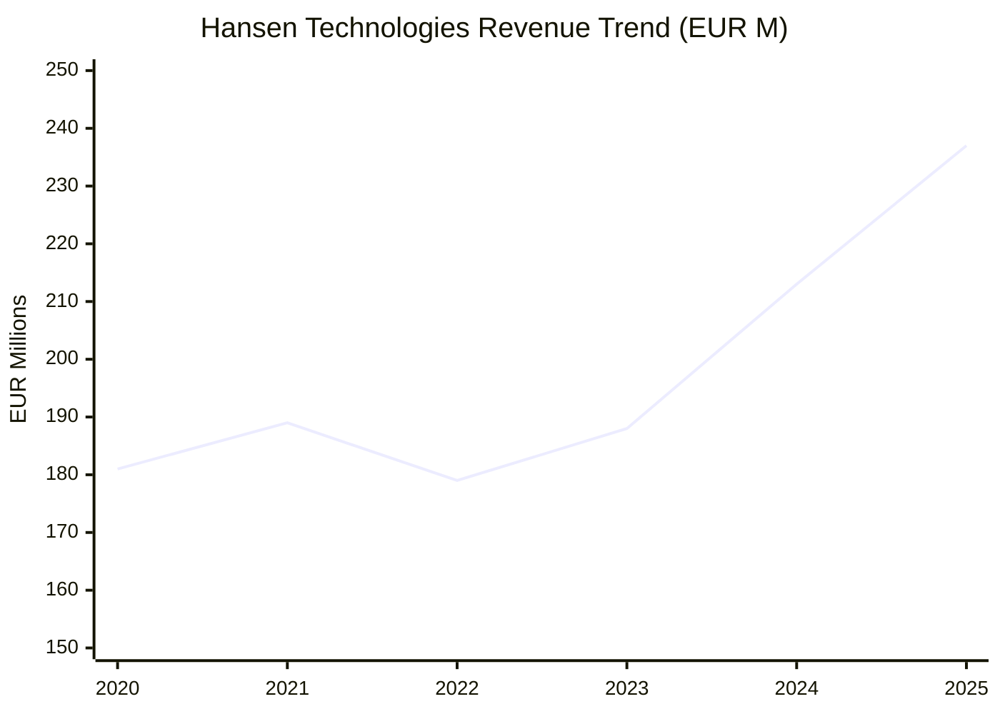
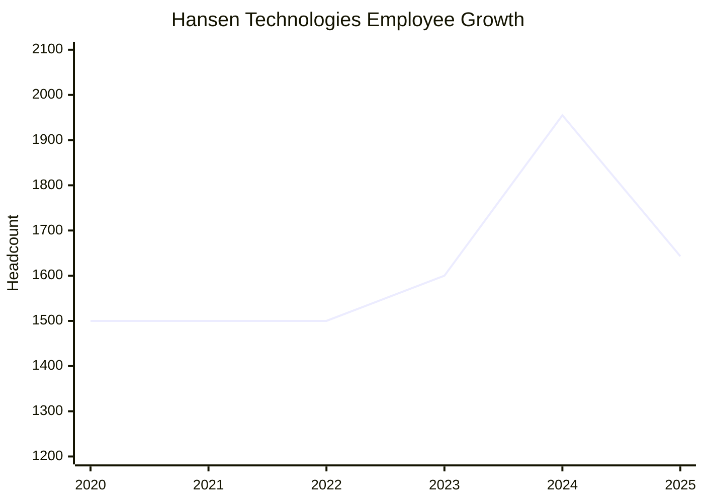
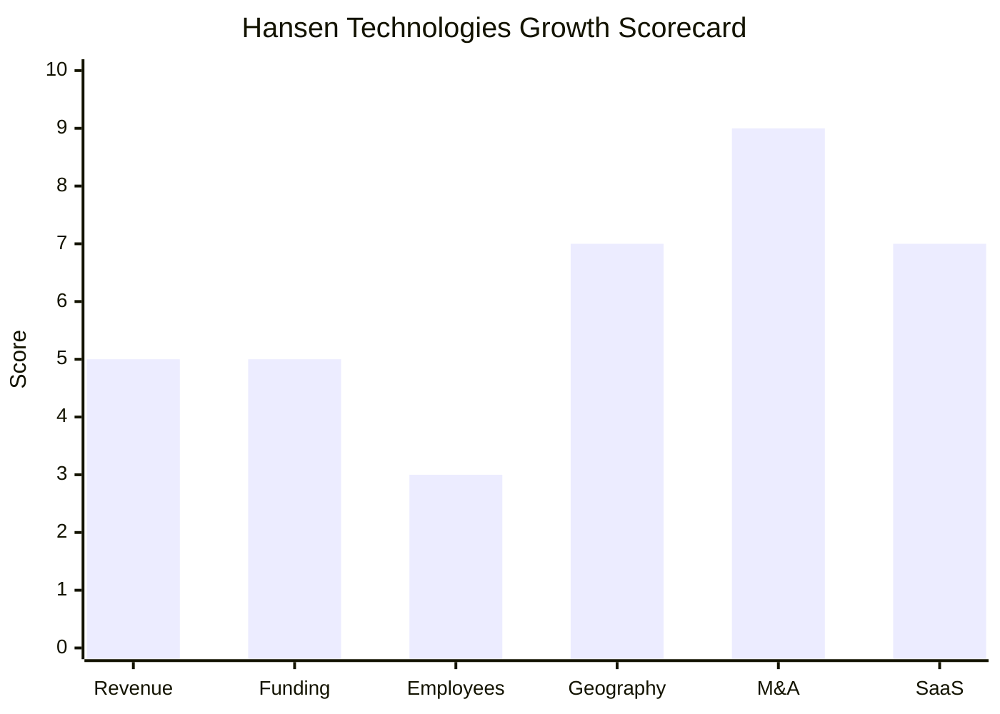

# Financial & Growth Deep-Dive - Hansen Technologies

**Research Date**: 2026-02-16
**Data Availability**: High (publicly listed on ASX as HSN since ~2000; annual reports, segment reporting, ASX filings, and investor relations data available)

### Revenue Timeline

| Year | Revenue | Currency | EUR Equivalent | YoY Growth | Source | Confidence |
| --- | --- | --- | --- | --- | --- | --- |
| FY2025 (Jun 2025) | A$392.5M | AUD | EUR ~237M | +11.2% | ASX FY25 Annual Report | Confirmed |
| FY2024 (Jun 2024) | A$353.1M | AUD | EUR ~213M | +13.2% | ASX FY24 Annual Report | Confirmed |
| FY2023 (Jun 2023) | A$311.8M | AUD | EUR ~188M | +5.2% | ASX FY23 Annual Report | Confirmed |
| FY2022 (Jun 2022) | A$296.5M | AUD | EUR ~179M | -1.1% | ASX FY22 Annual Report | Confirmed |
| FY2021 (Jun 2021) | A$299.7M | AUD | EUR ~189M | +1.2% | ASX FY21 Annual Report | Confirmed |
| FY2020 (Jun 2020) | A$296.1M | AUD | EUR ~181M | -- | ASX FY20 Annual Report | Confirmed |

**Revenue CAGR (3yr, FY22-FY25)**: ~9.8%
**Revenue CAGR (5yr, FY20-FY25)**: ~5.8%

**Revenue Composition (FY2023 reported)**: ~53% Energy/Gas/Electricity/Water, ~47% Communications & Media. Approximately 95% of revenue described as "recurring and predictable" (includes SaaS, maintenance, and managed services contracts).

#### Revenue Trend Chart

**Revenue Pattern Analysis**: Hansen's revenue was essentially flat from FY2020-FY2022 (~A$296-300M), reflecting organic stagnation. The inflection began in FY2023 (+5.2%) and accelerated through FY2024 (+13.2%, boosted by powercloud acquisition) and FY2025 (+11.2%). The 3yr CAGR of ~9.8% masks a tale of two halves: flat legacy base + acquisition-driven growth. Organic core growth guided at 5-7%.

### Profitability

| Data Point | Value | Source | Confidence |
| --- | --- | --- | --- |
| EBITDA (FY2025, underlying) | A$111.7M | ASX FY25 results | Confirmed |
| EBITDA Margin (FY2025) | ~28.5% | ASX FY25 results | Confirmed |
| EBITDA (FY2024, underlying) | A$92.4M | ASX FY24 results | Confirmed |
| EBITDA Margin (FY2024) | ~26.2% | ASX FY24 results | Confirmed |
| EBITDA Margin (FY2023) | ~31.9% | ASX FY23 Annual Report | Confirmed |
| Cash EBITDA (FY2025) | A$93.4M (+21.5% YoY) | ASX FY25 results | Confirmed |
| Net Profit (FY2025, statutory) | A$43.3M (+105.7% YoY) | ASX FY25 results | Confirmed |
| Net Profit (FY2024, statutory) | A$21.1M | ASX FY24 results | Confirmed |
| Net Profit (FY2023, statutory) | A$42.8M | ASX FY23 results | Confirmed |
| Net Profit (FY2021, statutory) | A$57.3M | ASX FY21 Annual Report | Confirmed |
| Core Hansen EBITDA Margin | ~30% (excl. powercloud) | FY25 results commentary | Confirmed |
| Medium-Term EBITDA Target | At least 30% underlying | Company guidance | Confirmed |
| Recurring Revenue % | ~95% (recurring and predictable) | FY23 Annual Report | Confirmed |
| SaaS Revenue % | Not separately disclosed | -- | Unknown |
| Revenue per Employee (FY2025) | A$239K (~EUR 144K) | Calculated: A$392.5M / 1,643 | Calculated |
| Revenue per Employee (FY2024) | A$181K (~EUR 109K) | Calculated: A$353.1M / 1,955 | Calculated |

**Profitability Insight**: The FY2024 EBITDA margin dip to 26.2% reflects powercloud integration costs. Core Hansen (ex-powercloud) maintained ~30% margins throughout. The A$31M+ cost reduction at powercloud drove margin recovery to 28.5% in FY2025. Revenue per employee jumped 32% in FY2025 (A$181K -> A$239K), directly reflecting the powercloud headcount reduction and efficiency gains.

### Funding & Investment History

| Date | Round | Amount | Lead Investor(s) | Valuation | Source | Confidence |
| --- | --- | --- | --- | --- | --- | --- |
| ~2000 | IPO (ASX: HSN) | -- | Public listing | -- | ASX records | Confirmed |
| Ongoing | Operating cash flow | A$59.1M (FY25 net) | Self-funding | -- | ASX FY25 results | Confirmed |
| Ongoing | Debt facilities | A$89.4M total debt | Bank facilities | -- | ASX FY25 balance sheet | Confirmed |

**Total Raised**: Not applicable (public company since ~2000, self-funding via operating cash flow)
**Latest Valuation**: Market cap ~A$1.0-1.1B (~EUR 600-660M) as of Jan 2026
**Current Investors**: Public shareholders. Andrew Hansen (CEO, founding family) holds ~10.6% stake. No dominant institutional block reported in search results.
**War Chest Signals**: A$59M net operating cash flow per year, A$89M debt (conservative 20% of capital structure, D/E ratio 27%), A$337M shareholders' equity. Has financial capacity for continued acquisitions at A$30-50M deal size. Returned A$211.5M to banks and shareholders since FY2019 while still funding 3 acquisitions.

**Funding Assessment**: Hansen does not participate in VC funding rounds -- it generates its own acquisition capital through operations. The company is modestly leveraged (D/E 27%) with strong free cash flow, giving it a "permanent war chest" for opportunistic M&A. This is a mature, profitable acquirer -- not a venture-funded rocket, but financially self-sustaining with proven ability to fund A$50-100M acquisitions.

### Employee Timeline

| Year | Headcount | YoY Growth | Source | Confidence |
| --- | --- | --- | --- | --- |
| FY2025 (Jun 2025) | 1,643 (1,607 FT + 36 PT) | -16.0% | StockAnalysis.com / ASX filings | Confirmed |
| FY2024 (Jun 2024) | 1,955 | +22.2% | StockAnalysis.com / ASX filings | Confirmed |
| FY2023 (Jun 2023) | 1,600 | +6.7% | StockAnalysis.com / ASX filings | Confirmed |
| FY2022 (Jun 2022) | 1,500 | 0.0% | StockAnalysis.com / ASX filings | Confirmed |
| FY2021 (Jun 2021) | 1,500 | 0.0% | ASX FY21 Annual Report | Confirmed |
| FY2020 (Jun 2020) | 1,500 | -- | Estimated from FY21 report | Estimated |

**Employee CAGR (3yr, FY22-FY25)**: ~3.1%
**Employee CAGR (5yr, FY20-FY25)**: ~1.8%
**Current Open Positions**: Very limited -- approximately 1-3 visible on SEEK/LinkedIn (Feb 2026)
**Hiring Hotspots**: Melbourne (HQ), minimal visible external hiring
**AI/ML/Data Science Roles**: No dedicated AI/ML job postings visible; AI capabilities appear embedded in existing product engineering teams

#### Employee Growth Chart

**Employee Pattern Analysis**: The headcount trajectory tells a story of acquisition-driven growth followed by aggressive cost optimization. The FY2024 spike to 1,955 is almost entirely from the powercloud acquisition (300+ staff). The subsequent drop to 1,643 (-312 in one year) reflects A$31M+ of powercloud cost reductions. Organic headcount has been essentially flat (1,500 for three consecutive years FY2020-2022). The very low visible job openings in Feb 2026 suggest the restructuring is complete but hiring is not ramping up.

### Geographic & Market Expansion

| Year | Expansion Event | Details | Source | Confidence |
| --- | --- | --- | --- | --- |
| 2017 | Nordics (Enoro acquisition) | Norway, Sweden, Finland, Netherlands, Switzerland -- 250+ employees, 300+ customers, 45%+ Nordic CIS market share | ASX announcement, Mergr | Confirmed |
| 2024 | Germany/DACH (powercloud acquisition) | 65+ German utility customers, 300+ staff, full MaKo compliance | ASX announcement, Feb 2024 | Confirmed |
| 2024-25 | Nordic Trading expansion | Hansen Trade new customers in Norway, Sweden, UK (Stockholm Exergi, Bixia, Fortum expansions) | Company press releases | Confirmed |
| 2025 | CONUTI assets (Germany) | Market messaging solution, data analytics for German energy market | ASX announcement, Apr 2025 | Confirmed |
| 2025 | UK (Digitalk acquisition) | 30+ countries, 150+ customers, MVNO/MNO platform, 60 staff. Primarily Communications sector. | ASX announcement, Dec 2025 | Confirmed |
| Ongoing | NL infrastructure (EDSN C-ARM) | 100% of Dutch energy connections, 15M+ metering points, 4M messages/day | CGI case study, EDSN | Confirmed |

**International Revenue %**: Not separately disclosed, but majority of revenue is international (Australia is HQ but not primary market)
**Expansion Trajectory**: Hansen is executing a deliberate European expansion strategy through acquisition. The pattern: (1) buy a distressed or undervalued asset in a new European market, (2) cut costs and integrate, (3) cross-sell the full Hansen suite. Germany is the current strategic priority as Europe's largest energy market.

### M&A Activity

| Date | Target | Deal Size | Capability Gained | Strategic Rationale | Source | Confidence |
| --- | --- | --- | --- | --- | --- | --- |
| Jul 2017 | Enoro Holding A/S | NOK 620M (~A$96M) | Nordic CIS/MDM market leader, 45%+ market share, 300+ customers | European expansion anchor, ~25% of combined revenue | ASX announcement, Mergr | Confirmed |
| Feb 2024 | powercloud GmbH | EUR 30M (~A$49M) | German billing SaaS, full MaKo compliance, 65+ utility customers | DACH market entry via distressed-asset turnaround | ASX announcement | Confirmed |
| Apr 2025 | CONUTI GmbH (assets) | EUR 7.5M (~A$13.4M) | German market messaging, data analytics, powercloud integrations | Strengthening German energy stack | ASX announcement | Confirmed |
| Dec 2025 | Digitalk | GBP 33.1M | Cloud SaaS MVNO/MNO platform, 150+ customers, 90%+ recurring revenue | UK market, high-margin recurring revenue, Communications expansion | ASX announcement, Digitalk PR | Confirmed |

**Pre-2017 Acquisitions**: 10 acquisitions totaling ~A$119M through 2021 (per Mergr data), building the core Hansen platform across energy and communications.
**Total M&A (All Time)**: 11+ acquisitions
**Divestitures**: None reported
**M&A Pattern**: **Capability-building + geographic expansion through disciplined value acquisition**. Hansen targets assets that are (a) distressed/undervalued (powercloud bought at EUR 30M after reportedly losing EUR 70M+), (b) strategically positioned in target markets (Enoro = Nordics, powercloud = Germany, Digitalk = UK), and (c) amenable to cost optimization (powercloud: A$31M+ cost reduction within 18 months). The CEO Andrew Hansen has described this as deliberately building a "globally and industry-diverse" company to counter cyclical risks.

### SaaS Transition Metrics

| Data Point | Value | Source | Confidence |
| --- | --- | --- | --- |
| Deployment Model | Hybrid: SaaS (powercloud, Digitalk), cloud-hosted, on-premise (legacy GENERIS) | Company website, annual reports | Confirmed |
| Cloud Revenue % (current) | Not separately disclosed | -- | Unknown |
| Recurring Revenue % (FY2023) | ~95% (recurring and predictable) | FY23 Annual Report | Confirmed |
| Digitalk Recurring % | 90%+ | Acquisition announcement | Confirmed |
| powercloud Model | Full SaaS (cloud-native billing) | Company website | Confirmed |
| Platform Stack | AWS cloud infrastructure; microservices architecture; TM Forum ODA certified; Open APIs (TMF620, TMF622, TMF633, TMF641, TMF648) | Company website, TM Forum directory | Confirmed |
| Migration Status | In progress -- new products (powercloud, Digitalk) are SaaS; core GENERIS/CIS transitioning from on-prem to cloud-hosted | Company strategy disclosures | Confirmed |
| Medium-Term Target | 5-7% organic growth, 30%+ EBITDA margins, driven by recurring revenue base | AGM presentation FY25 | Confirmed |

**SaaS Transition Assessment**: Hansen's SaaS strategy is "acquire SaaS, don't build it." Rather than migrating legacy on-prem products to cloud-native (a risky, expensive process), Hansen acquires cloud-native companies (powercloud, Digitalk) and integrates them. This dual-track approach keeps the cash-generating on-prem base stable while adding SaaS revenue. The 95% "recurring and predictable" figure includes traditional maintenance contracts alongside true SaaS subscriptions, so the actual pure-SaaS percentage is lower but growing.

### Growth Scorecard

| Dimension | Score (1-10) | Evidence Summary |
| --- | --- | --- |
| Revenue Growth | 5 | 3yr CAGR ~9.8% (FY22-FY25); 5yr CAGR ~5.8%; recent YoY 11-13% but includes acquisitions; organic core guided at 5-7% |
| Funding Momentum | 5 | No VC/PE rounds (public company), but A$1.1B market cap, A$59M annual operating cash flow, conservative A$89M debt, proven self-funding for A$50-100M acquisitions |
| Employee Growth | 3 | 3yr CAGR ~3.1%; flat organic headcount (1,500 for 3 years); FY24 spike from powercloud, then -16% restructuring; very limited visible hiring |
| Geographic Expansion | 7 | Entered Germany/DACH (2024) and strengthened UK (2025) via acquisition; expanded Nordic trading; already present in 80+ countries |
| M&A Activity | 9 | 3 acquisitions in <2 years (powercloud, CONUTI, Digitalk) plus strong historical track record; clear capability-building + geographic pattern |
| SaaS Maturity | 7 | ~95% recurring revenue; powercloud and Digitalk are pure SaaS; core products hybrid; AWS/microservices/ODA stack; active transition via acquisition-led strategy |
| **COMPOSITE SCORE** | **6.0** | **Classification: Riser** |

**Classification Thresholds**:

- **Rocket** (avg 7.0-10.0): Explosive growth, heavy investment, market disruptor
- **Riser** (avg 5.0-6.9): Strong growth signals, investing in future, accelerating
- **Steady** (avg 3.0-4.9): Stable but not transforming, evolutionary
- **Dinosaur** (avg 1.0-2.9): Flat or declining, legacy mode, no visible investment

#### Growth Scorecard Radar

> The scorecard reveals Hansen's distinctive growth fingerprint: **M&A-dominant expansion** (score 9) powering geographic reach (7) and SaaS transition (7), while organic employee growth (3) and revenue growth (5) remain modest. This is a company growing through acquisitions rather than organic scaling -- a deliberate strategy that trades explosive top-line growth for calculated geographic and capability expansion. The weak employee score (3) alongside strong M&A (9) reflects the "buy and optimize" playbook: acquire companies, cut costs aggressively, integrate the best parts.

---

### Eneve Comparison Context

| Metric | Hansen Technologies | Eneve (eBase) | Gap |
| --- | --- | --- | --- |
| Revenue (latest) | A$392.5M (~EUR 237M) | Significantly smaller | Hansen ~50-100x larger |
| Employees | 1,643 | Significantly smaller | Hansen ~30-50x larger |
| Market Cap | ~EUR 660M | Private, undisclosed | Hansen has public market access |
| Recurring Revenue | ~95% | Undisclosed | Both likely high-recurring |
| Countries | 80+ | 1-2 (NL, expanding BE) | Hansen massively more global |
| M&A Capability | 3 deals in 2yr, A$50-100M range | No M&A activity | Hansen is a proven acquirer |
| Dutch Market | Infrastructure layer (EDSN C-ARM) | Retailer/supplier back-office | Different layers, same market |
| Growth Mode | Acquisition-driven geographic expansion | Organic, NL-focused | Fundamentally different strategies |

**Threat to Eneve**: Hansen's financial profile makes it a **uniquely dangerous competitor**. It is not competing through organic growth (where Eneve's local expertise gives an advantage) but through acquisition (where Hansen's A$59M annual cash flow and public market access give it overwhelming firepower). The specific risk: Hansen could acquire a Dutch energy back-office company and integrate it with its existing EDSN C-ARM infrastructure, creating a vertically integrated Dutch energy software stack that Eneve cannot match. Hansen's "buy distressed, optimize, integrate" playbook (proven with powercloud) could be applied to any Dutch or Benelux energy software company.

---

*Sources: ASX Annual Reports (FY20-FY25), Hansen Technologies investor relations (hansencx.com), StockAnalysis.com, Mergr.com, CGI case study (EDSN C-ARM), Reuters, Intelligent Investor, Company press releases, TM Forum directory, Digitalk PR, SEEK/LinkedIn job listings. EUR conversions use approximate annual average AUD/EUR rates per financial year.*
