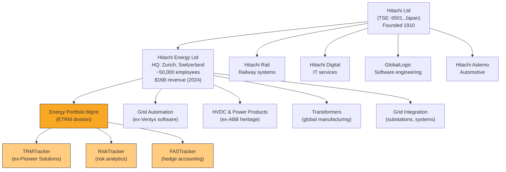
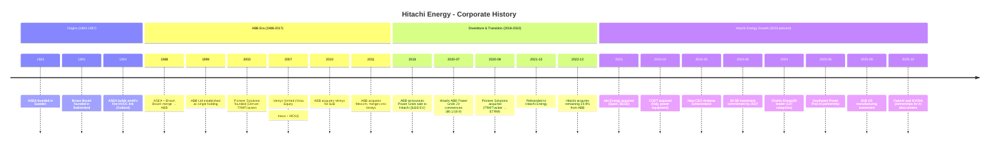
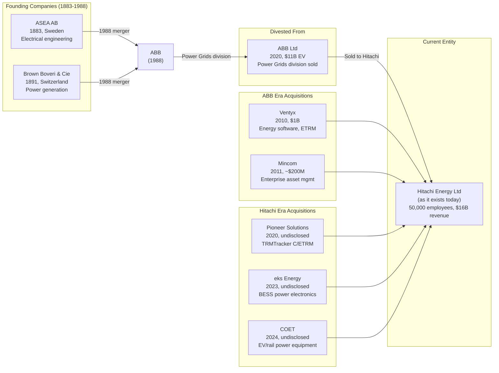
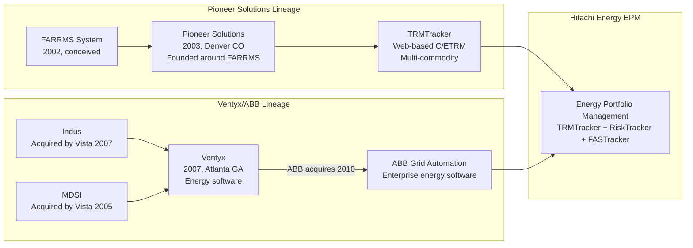

# Hitachi Energy - Corporate History

**Research Date**: 2026-02-15
**Genealogy Confidence**: High (public company with extensive documentation; ETRM-specific lineage is Medium due to limited disclosure of division-level history)
**Parent Profile**: [hitachi-energy.md](hitachi-energy.md)

## Current Ownership & Key Parties

| Stakeholder | Role | Stake % | Type | Since | Source |
|---|---|---|---|---|---|
| Hitachi Ltd (TSE: 6501) | Parent / sole owner | 100% | Strategic (Japanese conglomerate) | 2022 (full); 2020 (majority) | Wikipedia, ABB press releases |
| ABB Ltd | Former minority holder | 0% (exited) | Strategic (divested) | 2020-2022 | ABB press release |

**Board of Directors** (as of July 2024):

| Name | Role | Represents | Background | Source |
|---|---|---|---|---|
| Alistair Dormer | Chair | Hitachi | Former Hitachi Rail CEO | hitachienergy.com |
| Frank Duggan | Vice Chair | Management | Energy industry veteran | hitachienergy.com |
| Akihide Hirao | Director | Hitachi | Hitachi executive | hitachienergy.com |
| Lorena Dellagiovanna | Director | Hitachi | Appointed July 2024 | hitachienergy.com |
| Manuel Valverde | Director | Independent | Industry expert | hitachienergy.com |
| Seiichiro Nukui | Director | Hitachi | Hitachi executive | hitachienergy.com |
| Shashank Samant | Director | Independent | Technology leadership | hitachienergy.com |

**Executive Leadership:**

| Name | Role | Since | Background | Source |
|---|---|---|---|---|
| Andreas Schierenbeck | CEO | July 2024 | Former CEO of Uniper (2019-2021), thyssenkrupp Elevator; Siemens veteran | hitachienergy.com |
| Ismo Haka | CFO | -- | Finance leadership | hitachienergy.com |
| Gerhard Salge | CTO | -- | Technology leadership | hitachienergy.com |
| Urs Dogwiler | Chief Transformation Officer | -- | Supply chain, operations | hitachienergy.com |

**Corporate Structure** (Mermaid diagram):



The ETRM division (Energy Portfolio Management) is a small but strategically positioned business unit within the much larger Hitachi Energy entity. Hitachi Energy itself is one of several major subsidiaries of Hitachi Ltd. The board is dominated by Hitachi-appointed directors (4 of 7), reflecting full ownership.

## Origin Story

| Data Point | Value | Source | Confidence |
|---|---|---|---|
| Ultimate origin | 1883 (ASEA, Sweden) / 1891 (Brown Boveri, Switzerland) | ABB history, Wikipedia | Confirmed |
| ABB formed | January 5, 1988 (ASEA + Brown Boveri merger) | ABB history, Britannica | Confirmed |
| Power Grids division | Inherited from both ASEA and BBC; formalized as ABB division | ABB corporate docs | Confirmed |
| ETRM capability origin | 2010 (Ventyx acquisition by ABB, $1B) | Reuters, ABB press | Confirmed |
| ETRM product origin | 2003 (Pioneer Solutions founded, TRMTracker) | CTRMCenter, PRNewswire | Confirmed |
| Hitachi entry | July 1, 2020 (Hitachi acquires 80.1% of ABB Power Grids) | ABB press release | Confirmed |
| Current name adopted | October 2021 (Hitachi ABB Power Grids -> Hitachi Energy) | hitachienergy.com | Confirmed |
| Full Hitachi ownership | December 2022 (remaining 19.9% from ABB) | Wikipedia, press | Confirmed |
| Parent Hitachi Ltd founded | 1910, Ibaraki Prefecture, Japan | Hitachi corporate | Confirmed |

The entity known today as Hitachi Energy is the product of three distinct lineages converging:

1. **ASEA (1883, Sweden)** + **Brown Boveri (1891, Switzerland)** merged in 1988 to form **ABB**, inheriting over a century of power grid, HVDC, and transformer expertise.
2. **Ventyx** (2007, formed by Vista Equity Partners combining Indus + MDSI) was acquired by ABB in 2010 for $1B, bringing enterprise energy software and early ETRM capabilities.
3. **Pioneer Solutions** (2003, Denver, CO) built TRMTracker as a standalone C/ETRM platform, acquired by Hitachi ABB Power Grids in September 2020.

## Corporate Identity Changes

| # | Date | From | To | Reason | Source |
|---|---|---|---|---|---|
| 1 | 1988-01 | ASEA AB + BBC Brown Boveri | ABB Asea Brown Boveri | Merger of equals | ABB history |
| 2 | 1996 | ASEA AB / BBC Brown Boveri AG | ABB AB / ABB AG | Parent companies renamed to ABB | ABB heritage brands |
| 3 | 1999 | Dual-listed parents | ABB Ltd (single holding) | Corporate simplification | ABB history |
| 4 | 2020-07 | ABB Power Grids (division) | Hitachi ABB Power Grids (JV) | Hitachi acquires 80.1% stake | ABB press release |
| 5 | 2021-10 | Hitachi ABB Power Grids | Hitachi Energy Ltd | Rebrand to reflect full Hitachi identity | hitachienergy.com |

## Mergers & Acquisitions Timeline

### Acquisitions Made (as buyer / inherited from ABB)

| Date | Target Company | Deal Value | What Was Gained | Integration Outcome | Source |
|---|---|---|---|---|---|
| 1988-01 | ASEA + BBC merger | 50/50 merger | World's leading power grid company | Fully integrated as ABB | ABB history |
| 2010-06 | Ventyx (from Vista Equity) | ~$1B | Enterprise energy software, ETRM, asset mgmt, 900 employees, 40 countries | Integrated into ABB Power Systems/Grid Automation | Reuters, ABB press |
| 2011-05 | Mincom (from Francisco Partners) | ~$200M est. | Enterprise asset mgmt software, ~1,000 employees, mining/energy focus | Merged into Ventyx subsidiary by Feb 2012 | Reuters |
| 2020-09 | Pioneer Solutions LLC | Undisclosed | TRMTracker C/ETRM platform, top-5 ETRM vendor, Denver + Rotterdam offices, ~85 employees | Maintained as core ETRM product | hitachienergy.com, TDWorld |
| 2023-10 | eks Energy (Spain) | Undisclosed | Power electronics for BESS, renewables integration | Integrated into grid solutions | hitachienergy.com |
| 2024-01 | COET (Italy) | Undisclosed | Power equipment for EV charging, rail traction, ~80 employees, Milan area | Standalone under existing management | hitachienergy.com |
| 2025-01 | eks Energy (additional) | Undisclosed | Further BESS/renewables capability | Integrated | Tracxn |

### Acquired By (as target)

| Date | Acquiring Company | Deal Value | Strategic Rationale | Source |
|---|---|---|---|---|
| 2020-07 | Hitachi Ltd (80.1% of ABB Power Grids) | $6.85B (80.1%) / $11B EV (100%) | Hitachi gains global power grid leadership; ABB sheds least profitable division | ABB press, Reuters, PowerMag |
| 2022-12 | Hitachi Ltd (remaining 19.9%) | ~$1.96B (implied from $11B EV) | Full ownership, ABB exit per pre-agreed option | Wikipedia, press |

## Investment & Financial Events

| Date | Event Type | Details | Investors/Counterparty | Investor Type | Amount | Source |
|---|---|---|---|---|---|---|
| 2018-12 | Divestiture agreement | ABB announces sale of Power Grids to Hitachi | Hitachi Ltd / ABB Ltd | Strategic | $11B enterprise value | ABB press |
| 2020-07 | JV formation | Hitachi acquires 80.1% stake | Hitachi Ltd | Strategic | $6.85B | ABB press |
| 2022-12 | Full acquisition | Hitachi buys remaining 19.9% from ABB | Hitachi Ltd | Strategic | ~$1.96B (implied) | Wikipedia |
| 2024-06 | Capex commitment | $4.5B additional investment by 2027 in mfg, R&D, digital | Hitachi Energy (self-funded) | Corporate | $4.5B | hitachienergy.com |
| 2025-03 | Capex commitment | Additional transformer production investment | Hitachi Energy | Corporate | $250M | hitachienergy.com |
| 2025-09 | US manufacturing | New transformer factory in South Boston, VA + US expansion | Hitachi Energy | Corporate | $1B | hitachienergy.com |
| 2025 (cumulative) | Global investment program | Total investment announced for manufacturing, R&D, engineering | Hitachi Energy | Corporate | ~$9B total | hitachienergy.com |

**Revenue Milestones:**

| Period | Revenue | Growth | Source |
|---|---|---|---|
| 2020 (at JV formation) | ~$10B | Baseline | ABB press |
| FY2023 (Apr 2022-Mar 2023) | $12.6B | +23% YoY | Hitachi financial results |
| FY2024 (Apr 2023-Mar 2024) | $15.5B | +22% YoY | Hitachi financial results |
| 2024 calendar year | ~$16B | Continued growth | Wikipedia |
| Order backlog (2024) | >$30B | 3x since 2020 | hitachienergy.com |

EBITA margin expanded from 6.1% (FY2021) to 11.0% (FY2024), showing profitability improvement under Hitachi ownership.

## Splits, Spin-offs & Divestitures

| Date | Event Type | What Was Separated | Destination / Buyer | Reason | Source |
|---|---|---|---|---|---|
| 2018-12 / 2020-07 | Divestiture by ABB | ABB Power Grids division (~36,000 employees, ~$10B revenue) | Hitachi Ltd (80.1%) | ABB portfolio simplification; activist investor (Cevian, 5.34% stake) pressure; Power Grids was least profitable ABB division at 10% margin | Reuters, ABB press |
| 2022-12 | Exit by ABB | Remaining 19.9% equity stake | Hitachi Ltd (full ownership) | Pre-agreed exit option exercised after 3 years | Wikipedia, press |

The ABB divestiture was the defining corporate event. ABB's activist investor Cevian Capital pressured CEO Ulrich Spiesshofer to sell Power Grids, which ABB considered its least profitable division. ABB used the $7.6-7.8B net cash proceeds for share buybacks and refocused on digital industries (Electrification, Industrial Automation, Robotics, Motion).

## Critical Events & Milestones

| Date | Event | Impact | Source |
|---|---|---|---|
| 1954 | ASEA installs world's first commercial HVDC link (Gotland 1, Sweden) | Established HVDC technology leadership that persists today (>50% global installed base) | ABB HVDC history |
| 1988-01 | ASEA + Brown Boveri merge to form ABB | Created world's largest power grid company | ABB history |
| 2010-06 | ABB acquires Ventyx for $1B | Brought enterprise energy software (including early ETRM) into ABB's portfolio | Reuters |
| 2018-12 | ABB announces Power Grids sale to Hitachi | Activist investor Cevian forced ABB's hand; end of ABB's 130-year power grid heritage | Reuters |
| 2020-07 | Hitachi ABB Power Grids JV commences operations | New entity with Japanese parent, Swiss HQ, global operations | hitachienergy.com |
| 2020-09 | Acquisition of Pioneer Solutions | Brought TRMTracker C/ETRM platform; created Energy Portfolio Management division | hitachienergy.com |
| 2021-10 | Rebrand to Hitachi Energy | Completed identity transition from ABB heritage | hitachienergy.com |
| 2022-12 | Hitachi acquires remaining 19.9% from ABB | Full Hitachi ownership; clean break from ABB | Wikipedia |
| 2024-03 | CEO transition: Facchin -> Schierenbeck | New CEO from Uniper/Siemens background signals energy market focus | hitachienergy.com |
| 2024-06 | $4.5B investment commitment by 2027 | Massive capex expansion for grid infrastructure | hitachienergy.com |
| 2024 | Chartis Energy50: #1 in 13+ categories | Market validation of ETRM platform | Chartis Research |
| 2025-06 | Southwest Power Pool AI partnership | AI to reduce grid interconnection study times by 80% | Hitachi press |
| 2025-09 | $1B US manufacturing investment | New transformer factory in Virginia; response to AI data center demand | hitachienergy.com |
| 2025-10 | OpenAI strategic partnership (MOU) | Joint development of AI data center power infrastructure | Hitachi corporate |
| 2025-10 | NVIDIA 800V DC architecture collaboration | 15x power increase for hyperscale AI facilities | hitachienergy.com |

## Corporate Timeline (Visual)



## M&A Genealogy (Visual)



## ETRM Product Genealogy

The ETRM products specifically trace through:



## Corporate Timeline (Text Summary)

```text
1883 - ASEA founded in Sweden (electrical engineering)
1891 - Brown Boveri & Cie founded in Switzerland (power generation, turbines)
1954 - ASEA builds world's first commercial HVDC link (Gotland 1)
1988 - ASEA + Brown Boveri merge to form ABB Asea Brown Boveri
1996 - Parent companies formally renamed to ABB AB / ABB AG
1999 - ABB Ltd established as single holding company
2002 - FARRMS system conceived (precursor to TRMTracker)
2003 - Pioneer Solutions founded in Denver, CO
2007 - Ventyx formed by Vista Equity Partners (combining Indus + MDSI)
2010 - ABB acquires Ventyx for $1B (enterprise energy software)
2011 - ABB acquires Mincom for ~$200M (merged into Ventyx)
2018 - ABB announces sale of Power Grids to Hitachi ($11B enterprise value); activist investor Cevian forced the decision
2020-07 - Hitachi ABB Power Grids commences operations (Hitachi 80.1%, ABB 19.9%)
2020-09 - Pioneer Solutions acquired (TRMTracker becomes core ETRM product)
2021-07 - Announced rebrand to Hitachi Energy
2021-10 - Hitachi Energy name takes effect
2022-12 - Hitachi acquires remaining 19.9% from ABB (100% ownership)
2023-10 - eks Energy acquired (Spain, BESS/renewables power electronics)
2024-01 - COET acquired (Italy, EV/rail power equipment)
2024-03 - CEO transition: Claudio Facchin -> Andreas Schierenbeck (ex-Uniper CEO)
2024-06 - $4.5B additional investment commitment by 2027
2024    - Chartis Energy50: leader in 13+ categories; $15.5B revenue; order backlog >$30B
2025-03 - Additional $250M transformer production investment
2025-06 - Southwest Power Pool AI partnership (80% faster grid interconnection studies)
2025-09 - $1B US manufacturing investment (new Virginia transformer factory)
2025-10 - OpenAI strategic partnership for AI data center power infrastructure
2025-10 - NVIDIA collaboration on 800V DC architecture for AI facilities
2025    - Total cumulative investment program reaches ~$9B
```

## Pattern Analysis

**Growth Strategy**: Hybrid (inherited organic growth from ABB + strategic acquisitions post-2020)

**Acquisition Pattern**:
- Pre-Hitachi (ABB era): Large software acquisitions to build digital/software capability (Ventyx $1B, Mincom $200M)
- Post-Hitachi: Targeted niche acquisitions (Pioneer Solutions for ETRM, eks Energy for BESS, COET for EV) -- smaller, capability-focused
- ~1 acquisition per year since 2020, all complementary to existing portfolio

**Technology Evolution**:
- 1883-1988: Hardware-centric (transformers, HVDC, power equipment)
- 1988-2010: ABB adds automation and control systems
- 2010-2020: ABB adds enterprise software (Ventyx) and ETRM (Pioneer Solutions)
- 2020-2024: Hitachi adds digital transformation, cloud migration, FastTracker cloud-native ETRM
- 2025+: AI pivot (OpenAI, NVIDIA, SPP partnerships; AI data center infrastructure)

**Leadership Stability**: Moderate turnover at CEO level
- Claudio Facchin led the transition (2020-2024, ~4 years) then departed
- Andreas Schierenbeck (July 2024-present) brings outsider perspective from Uniper/Siemens
- Board dominated by Hitachi appointees (4 of 7), reflecting Japanese parent control

## Strategic Implications for Eneve

**What the history reveals about future direction**:
- Hitachi Energy's ETRM is a bolt-on capability (Pioneer Solutions, 2020) inside a hardware-dominated $16B entity. The ETRM division receives strategic investment but is not the company's primary focus.
- The $9B investment program is overwhelmingly directed at grid infrastructure (transformers, HVDC) and AI data center power -- not ETRM software.
- The AI partnerships (OpenAI, NVIDIA, SPP) focus on grid operations and data center power delivery, not trading/risk management software.
- The new CEO (Schierenbeck, ex-Uniper) understands energy trading from the customer side -- could drive more ETRM investment.

**Inherited strengths from corporate history**:
- **130+ year grid expertise**: ASEA/BBC/ABB heritage provides unmatched credibility with large utilities
- **Global scale**: 50,000 employees, $16B revenue, 90+ countries means Hitachi Energy can bundle ETRM with grid infrastructure deals
- **Ventyx software DNA**: The 2010 Ventyx acquisition ($1B) brought real enterprise software capability; grid automation software is mature
- **Virtually unlimited capital**: Hitachi Ltd parent ($80B+ revenue) can fund any expansion
- **Hardware-software convergence**: Unique ability to combine grid hardware (transformers, HVDC) with energy software (ETRM, grid automation)

**Inherited weaknesses / risks from corporate history**:
- **ETRM as afterthought**: Pioneer Solutions was a small (~85 employees) bolt-on acquisition; ETRM is tiny relative to the parent
- **Integration complexity**: Three different software lineages (Ventyx, Mincom, Pioneer Solutions) create potential technical debt
- **Japanese conglomerate culture**: Hitachi's consensus-driven decision-making may slow ETRM innovation vs. nimble startups
- **Identity crisis**: Three name changes in 4 years (ABB Power Grids -> Hitachi ABB Power Grids -> Hitachi Energy) creates market confusion
- **ABB heritage loss**: The divestiture severed the ABB brand association that utilities knew for 130+ years; Hitachi brand is weaker in European energy
- **Hardware bias**: Capital allocation heavily favors physical infrastructure ($9B) over software; ETRM development investment likely constrained

**M&A prediction**: Based on the pattern of ~1 targeted acquisition per year:
- Likely to acquire additional niche energy software companies (grid analytics, DER management, AI forecasting)
- Unlikely to make a major ETRM acquisition -- the TRMTracker/Pioneer Solutions product is considered sufficient
- More likely to acquire BESS, EV charging, and grid edge companies aligned with the $9B infrastructure investment theme
- Risk: If AI-native ETRM competitors (Qualia, Molecule) gain traction, Hitachi Energy may need to acquire or invest to modernize TRMTracker faster
