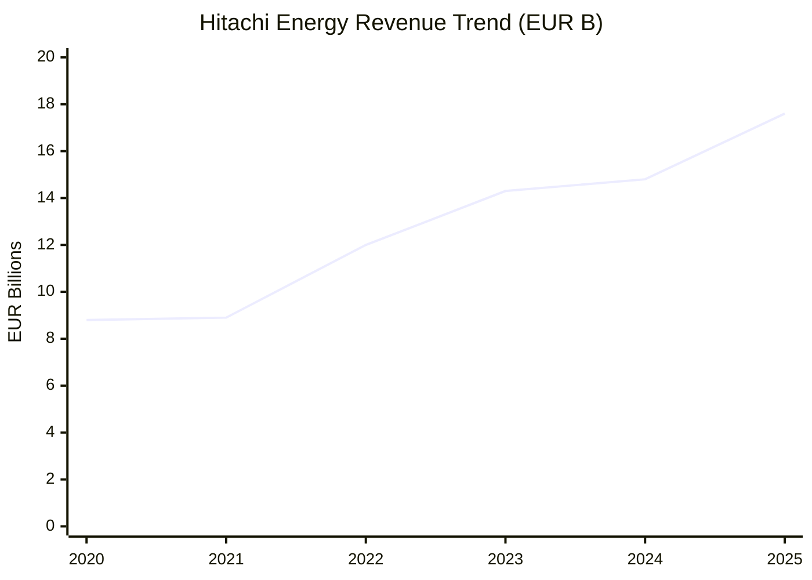
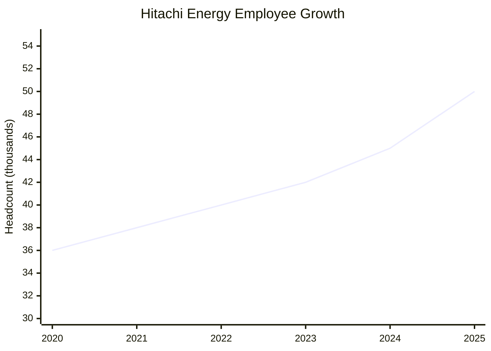
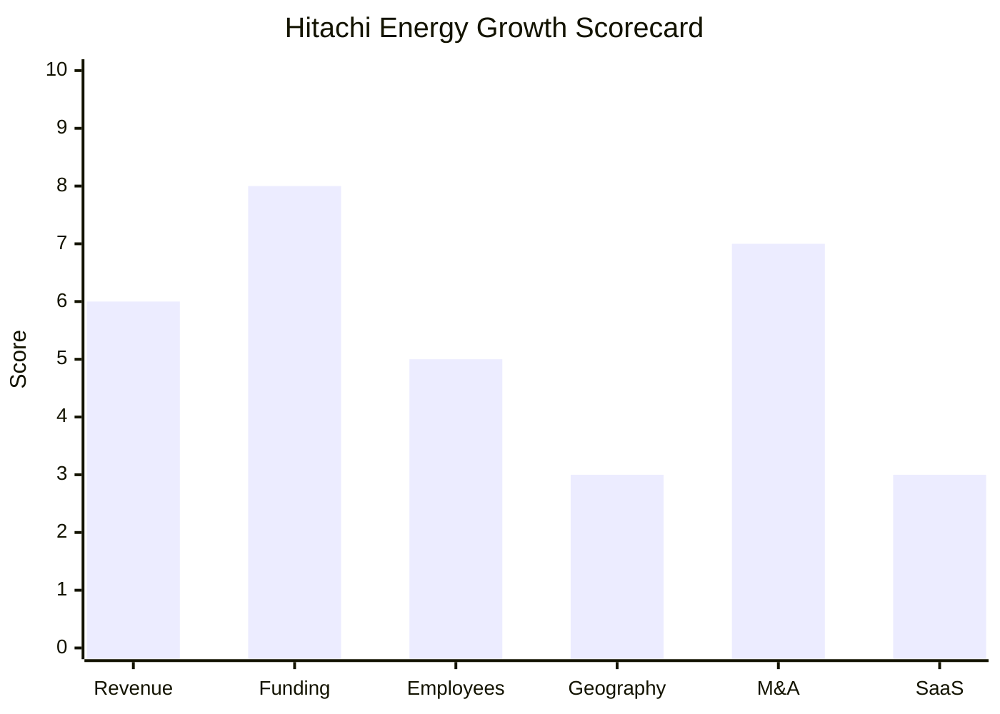

# Financial & Growth Deep-Dive - Hitachi Energy

**Research Date**: 2026-02-15
**Data Availability**: Medium-High (subsidiary of public Hitachi Ltd; segment-level financials from parent annual reports. ETRM division-specific financials not separately disclosed.)

### Revenue Timeline

Hitachi Energy reports within Hitachi Ltd's "Energy" segment (part of Green Energy & Mobility sector). Revenue figures below represent the Hitachi Energy entity, sourced from Hitachi Ltd financial results and press releases. Hitachi's fiscal year runs April-March; calendar year figures are approximated from fiscal year data.

| Year | Revenue | Currency | EUR Equivalent | YoY Growth | Source | Confidence |
| --- | --- | --- | --- | --- | --- | --- |
| 2025 (est.) | ~$19B | USD | ~€17.6B | +19% | Hitachi FY2025 Energy segment forecast (2,970B JPY) | Estimated |
| 2024 | ~$16B | USD | ~€14.8B | +14% | Hitachi financial results, hitachienergy.com | Confirmed |
| 2023 (FY ending Mar 2024) | $15.5B | USD | €14.3B | +22% | Hitachi financial results | Confirmed |
| 2022 (FY ending Mar 2023) | $12.6B | USD | €12.0B | +23% | Hitachi financial results | Confirmed |
| 2021 | ~$10.5B | USD | ~€8.9B | +5% | Estimated from formation baseline | Estimated |
| 2020 (at JV formation) | ~$10B | USD | ~€8.8B | Baseline | ABB divestiture press release, PowerMag | Confirmed |

**Revenue CAGR (3yr, 2022-2025 est.)**: ~15%
**Revenue CAGR (5yr, 2020-2025 est.)**: ~14%
**Order Backlog**: >$30B (2024), tripled since 2020 -- strong forward revenue indicator

#### Revenue Trend Chart

### Profitability

| Data Point | Value | Source | Confidence |
| --- | --- | --- | --- |
| EBITA Margin (FY2024, ending Mar 2025) | ~11.0% | Hitachi financial results (3-sector adjusted EBITA) | Confirmed |
| EBITA Margin (FY2023, ending Mar 2024) | ~10.1% | Hitachi financial results | Confirmed |
| EBITA Margin (FY2021) | ~6.1% | Corporate history, Hitachi financial results | Confirmed |
| EBITA Margin Trajectory | 6.1% → 11.0% over 4 years | Hitachi annual reports | Confirmed |
| Net Profit / Loss | Profitable (part of Hitachi consolidated) | Hitachi annual report | Confirmed |
| Recurring Revenue % | Not disclosed (predominantly project/equipment) | N/A | Unknown |
| SaaS Revenue % | Not disclosed (ETRM SaaS is tiny fraction of total) | N/A | Unknown |
| Revenue per Employee | ~EUR 296K (€14.8B / 50,000) | Calculated | Estimated |

The EBITA margin improvement from 6.1% to 11.0% under Hitachi ownership is notable -- ABB considered Power Grids its least profitable division (~10% margins). Hitachi has achieved material profitability improvement through operational discipline and favorable market conditions (grid infrastructure demand boom).

### Funding & Investment History

Hitachi Energy does not raise external funding -- it is a wholly-owned subsidiary of Hitachi Ltd (TSE: 6501). Investment comes through corporate capital allocation. The investment scale is extraordinary by energy software standards.

| Date | Event | Amount | Counterparty | Type | Source | Confidence |
| --- | --- | --- | --- | --- | --- | --- |
| 2020-07 | Hitachi acquires 80.1% of ABB Power Grids | $6.85B | ABB Ltd | Strategic acquisition | ABB press release | Confirmed |
| 2022-12 | Hitachi acquires remaining 19.9% from ABB | ~$1.7B | ABB Ltd | Full ownership | MergerLinks, press | Confirmed |
| 2024-04 | Transformer production capex commitment | $1.5B | Self-funded | Corporate capex | Hitachi press | Confirmed |
| 2024-06 | Manufacturing, engineering, digital, R&D capex | $4.5B (by 2027) | Self-funded | Corporate capex | hitachienergy.com | Confirmed |
| 2024-06 | Sweden expansion (Ludvika, Vasteras) | $330M | Self-funded | Corporate capex | hitachienergy.com | Confirmed |
| 2025-04 | Pennsylvania manufacturing expansion | $70M+ | Self-funded | Corporate capex | hitachienergy.com | Confirmed |
| 2025-09 | US manufacturing (South Boston, VA transformer factory) | $1B | Self-funded | Corporate capex | hitachienergy.com | Confirmed |
| 2025 (cumulative) | Total global investment program | ~$9B+ | Self-funded | Corporate capex | hitachienergy.com | Confirmed |

**Total Acquisition Cost**: ~$8.55B (Hitachi's total outlay for Hitachi Energy)
**Total Capex Committed**: ~$9B+ through 2027
**Grand Total Investment**: ~$17-18B (acquisition + capex)
**Latest Valuation**: $11B enterprise value at 2018 deal announcement; current implied value significantly higher given revenue growth from $10B to $16B+
**Current Investors**: Hitachi Ltd (100% ownership since December 2022)
**War Chest Signals**: Hitachi Ltd parent has ~$80B+ annual revenue, investment-grade credit, and has demonstrated willingness to deploy billions into Hitachi Energy. Capital is functionally unlimited.

### Employee Timeline

| Year | Headcount | YoY Growth | Source | Confidence |
| --- | --- | --- | --- | --- |
| 2025-2026 (current) | 50,000+ | +11% | hitachienergy.com, LeadIQ | Confirmed |
| 2024 | ~45,000 | +7% | Estimated from growth trajectory | Estimated |
| 2023 | ~42,000 | +5% | Estimated from growth trajectory | Estimated |
| 2022 | ~40,000 | +5% | Estimated from growth trajectory | Estimated |
| 2021 | ~38,000 | +6% | Estimated from growth trajectory | Estimated |
| 2020 (at JV formation) | ~36,000 | Baseline | ABB divestiture press, PowerMag | Confirmed |

**Employee CAGR (5yr, 2020-2025)**: ~6.8%
**Current Open Positions**: 3,000+ (LinkedIn, February 2026)
**AI/ML/Data Science Roles**: Active hiring for R&D Scientists in Applied AI/ML (Poland), Power Systems ML (Canada), Automated Trading/Energy Market Analytics (Switzerland, Germany, Canada, USA, Sweden, Poland)
**Hiring Hotspots**: Sweden (+2,000 by 2027), India (Global Capability Centers in Hyderabad, Pune; tech center expanding to 4,000+), USA (Virginia, Pennsylvania, Missouri), Finland (Vaasa region)

**Future Growth Plans**:
- +2,000 employees in Sweden by 2027 (from ~6,000 to ~8,000)
- India Global Technology & Innovation Center expanding to 4,000+ employees
- 4,000+ new jobs globally from $1.5B transformer production investments
- 100+ new jobs at Pennsylvania facilities

#### Employee Growth Chart

### Geographic & Market Expansion

Hitachi Energy already operates in 90+ countries with 60+ manufacturing/engineering sites. Expansion is primarily about deepening capacity within existing markets rather than entering new countries.

| Year | Expansion Event | Details | Source | Confidence |
| --- | --- | --- | --- | --- |
| 2023-2024 | Sweden manufacturing expansion | New HVDC factories in Dalarna region (Smedjebacken, Ludvika); 30,000+ sq meter factory expansion | hitachienergy.com | Confirmed |
| 2024 | India Global Capability Centers | New GCC offices in Hyderabad and Pune; tech center expanding to 4,000+ employees serving 40+ countries | Reuters, hitachienergy.com | Confirmed |
| 2024 | Finland transformer factory | $180M new 30,000 sq meter transformer factory in Vaasa region | Hitachi press | Confirmed |
| 2024 | Germany expansion | $30M+ investment in Bad Honnef | Hitachi press | Confirmed |
| 2024-2025 | Sweden new campus | New Vasteras campus accommodating 1,800 employees | hitachienergy.com | Confirmed |
| 2025 | USA transformer factory | $457M new large power transformer facility in South Boston, Virginia (largest in US) | hitachienergy.com | Confirmed |
| 2025 | USA switchgear expansion | $70M+ expansion at Mount Pleasant and Hunker, Pennsylvania | hitachienergy.com | Confirmed |
| 2025 | Sweden Pitea expansion | Composite component factory workforce increasing 50% (~100 jobs), completion fall 2026 | hitachienergy.com | Confirmed |

**International Revenue %**: Not separately disclosed (overwhelmingly international; Swiss HQ with global operations)
**Expansion Trajectory**: Hitachi Energy is in a massive manufacturing capacity build-out driven by grid infrastructure demand (AI data centers, renewable energy connections, aging grid upgrades). Not entering new countries but dramatically expanding production capacity in USA, Sweden, Finland, India, and Germany. This is infrastructure investment, not market entry.

### M&A Activity

| Date | Target | Deal Size | Capability Gained | Strategic Rationale | Source | Confidence |
| --- | --- | --- | --- | --- | --- | --- |
| 2020-07 | ABB Power Grids (80.1%) | $6.85B | Global power grid business, 36,000 employees | Hitachi enters power grid market as global leader | ABB press, PowerMag | Confirmed |
| 2020-09 | Pioneer Solutions LLC | Undisclosed | TRMTracker C/ETRM platform, ~85 employees | ETRM capability for Energy Portfolio Management division | hitachienergy.com, TDWorld | Confirmed |
| 2022-12 | ABB Power Grids (remaining 19.9%) | ~$1.7B | Full ownership, clean break from ABB | Complete ownership control | MergerLinks, press | Confirmed |
| 2023-10 | eks Energy (controlling stake) | Undisclosed | Power electronics for BESS, renewables integration (Spain) | Energy storage capability | hitachienergy.com | Confirmed |
| 2024-01 | COET (Italy) | Undisclosed | Power equipment for EV charging, rail traction, ~80 employees | Electric mobility, power electronics | hitachienergy.com | Confirmed |
| 2025-08 | eks Energy (remaining stake) | Undisclosed | Full ownership of BESS power conversion subsidiary | Complete control of energy storage capability | hitachienergy.com | Confirmed |

**Divestitures**: None by Hitachi Energy itself. ABB divested the Power Grids division to Hitachi (2020-2022).
**M&A Pattern**: Capability-building acquisitions averaging ~1 per year since 2020. Pioneer Solutions (ETRM) was the strategic ETRM entry; subsequent deals focus on grid adjacencies (BESS, EV charging). All acquisitions are small relative to $16B revenue. No transformative software acquisitions beyond Pioneer Solutions.

### SaaS Transition Metrics

| Data Point | Value | Source | Confidence |
| --- | --- | --- | --- |
| Deployment Model | Overwhelmingly on-premise/project-based (grid infrastructure); ETRM products offer cloud SaaS | Product pages, press releases | Confirmed |
| Cloud Revenue % (current) | Not disclosed; negligible as % of total $16B revenue | N/A | Unknown |
| Cloud Revenue % (ETRM only) | Not disclosed; TRMTracker marketed as "cloud-native SaaS" | hitachienergy.com | Estimated |
| Recurring Revenue % | Not disclosed; predominantly project/equipment revenue | N/A | Unknown |
| Platform Stack | TRMTracker: web-based, multi-commodity C/ETRM; broader business is hardware + grid automation software | hitachienergy.com | Confirmed |
| Migration Status | ETRM: actively transitioning to cloud (TRMTracker SaaS, FastTracker); overall business remains hardware/project-centric | Product pages, blogs | Confirmed |

TRMTracker is now marketed as a "cloud-native" SaaS ETRM platform with automated trade-to-cash processes. However, the ETRM division is a tiny fraction of Hitachi Energy's overall $16B revenue, which is dominated by grid infrastructure hardware (transformers, HVDC systems, substations). SaaS metrics for the ETRM division are not separately reported. The "SaaS transition" concept applies only to the Energy Portfolio Management division, not to Hitachi Energy as a whole.

### Growth Scorecard

| Dimension | Score (1-10) | Evidence Summary |
| --- | --- | --- |
| Revenue Growth | 6 | 3yr CAGR ~15%; fiscal year YoY growth of +22-23% (FY2023-FY2024); strong but driven by hardware demand, not software |
| Funding Momentum | 8 | No external funding needed; parent investing $9B+ in capex through 2027; functionally unlimited capital from Hitachi Ltd ($80B+ parent) |
| Employee Growth | 5 | 5yr CAGR ~7% (36k→50k); 3,000+ open roles; hiring plans for 2,000+ in Sweden, 4,000+ in India |
| Geographic Expansion | 3 | Already in 90+ countries; expanding manufacturing capacity (US, Sweden, Finland, India) but not entering new markets |
| M&A Activity | 7 | 4 acquisitions since 2022 (ABB remaining stake, eks Energy x2, COET); clear capability-building pattern in BESS/EV/grid |
| SaaS Maturity | 3 | ETRM products (TRMTracker) offer SaaS; overall business is >95% hardware/project revenue; no cloud revenue % disclosed |
| **COMPOSITE SCORE** | **5.3** | **Classification: Riser** |

**Classification Thresholds**:

- **Rocket** (avg 7.0-10.0): Explosive growth, heavy investment, market disruptor
- **Riser** (avg 5.0-6.9): Strong growth signals, investing in future, accelerating
- **Steady** (avg 3.0-4.9): Stable but not transforming, evolutionary
- **Dinosaur** (avg 1.0-2.9): Flat or declining, legacy mode, no visible investment

#### Growth Scorecard Radar

> The bar chart reveals Hitachi Energy's distinctive profile: **massive corporate investment** (Funding: 8) and **active M&A** (7) contrast sharply with **weak SaaS maturity** (3) and **no geographic expansion** (3, already everywhere). This is a hardware-dominant infrastructure giant that happens to have an ETRM product, not a software company investing in grid technology. The composite 5.3 (Riser) is driven primarily by the sheer scale of capital deployment.

### Eneve Implications

**What the financial data reveals for competitive positioning:**

1. **Scale mismatch**: Hitachi Energy at ~EUR 14.8B revenue is ~100-200x larger than typical Eneve competitors. Direct competition is unlikely in the back-office niche -- but bundling ETRM with grid infrastructure deals to European utilities is a real threat.

2. **ETRM is a rounding error**: The Energy Portfolio Management (ETRM) division is likely <1% of Hitachi Energy's total revenue. Investment decisions favor grid hardware over software. The $9B capex program is overwhelmingly for transformers, HVDC, and manufacturing -- not ETRM software development.

3. **AI partnerships are grid-focused**: The OpenAI, NVIDIA, and Southwest Power Pool partnerships target grid operations and AI data center power delivery, not energy trading software. The AI signal is strong at the company level but weak at the ETRM level.

4. **Order backlog provides moat**: The >$30B order backlog (3x since 2020) means Hitachi Energy is capacity-constrained in its core business. Management attention and capital are flowing to hardware backlogs, not ETRM market share.

5. **Revenue per employee (EUR 296K)** is typical for a hardware/engineering company, much lower than pure software companies (EUR 200-400K for SaaS). This confirms the hardware-dominant revenue mix.

6. **SaaS weakness is structural**: Hitachi Energy cannot become a SaaS company -- its DNA is grid infrastructure. The ETRM division could modernize, but it will always be a small add-on to the core business, not a strategic priority.

**Bottom line**: Hitachi Energy is a Riser driven by infrastructure megatrends (AI data centers, renewables, grid upgrades), not by software innovation. For Eneve, the threat is bundling (ETRM included in grid deals), not direct product competition.
