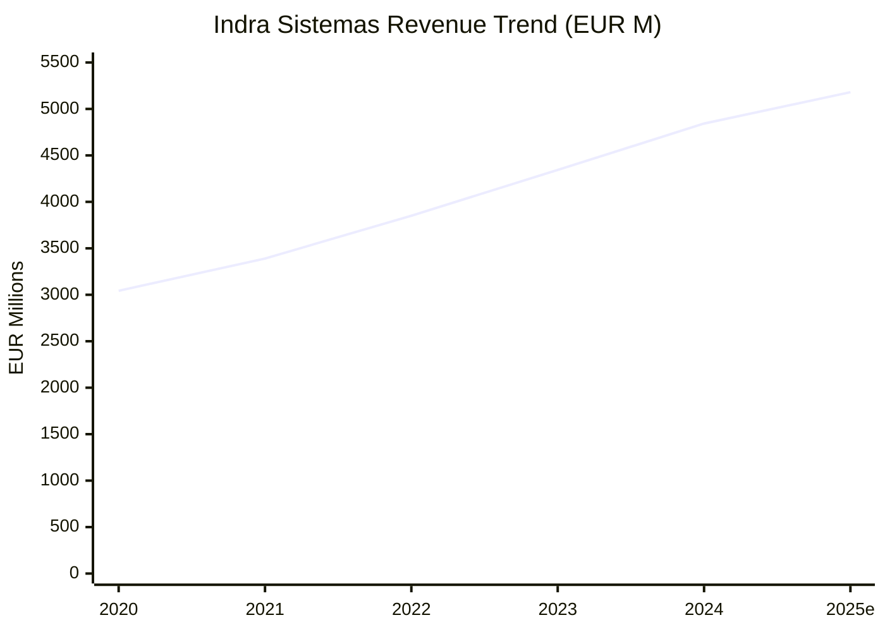
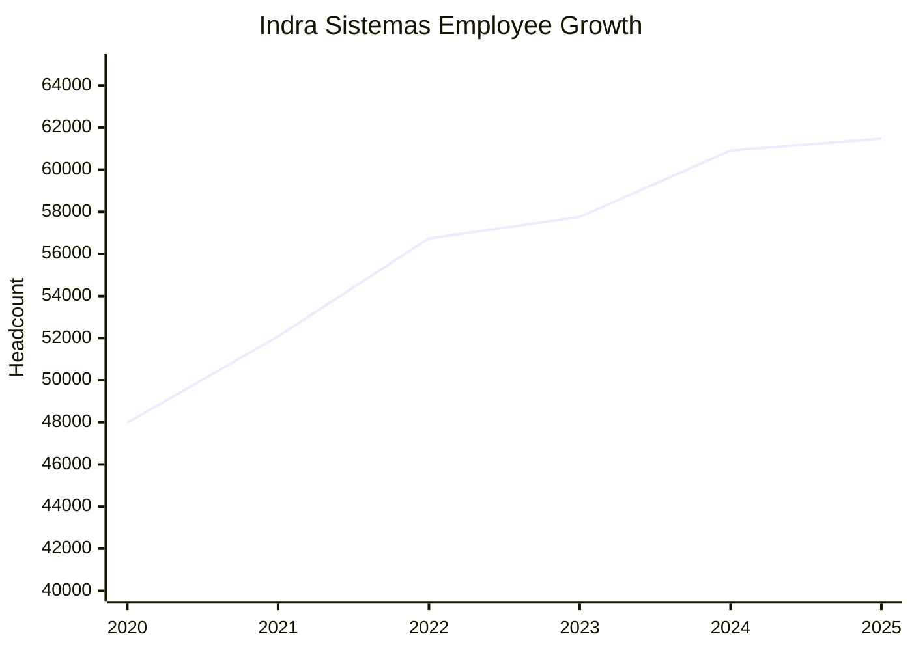
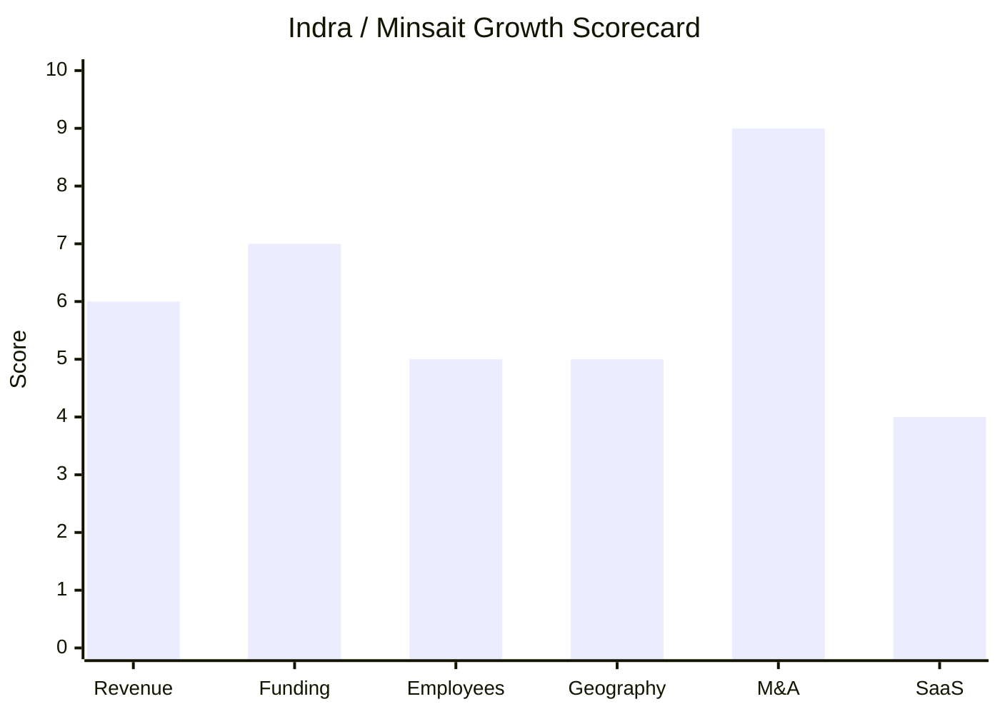

# Financial & Growth Deep-Dive - Indra Sistemas / Minsait

**Research Date**: 2026-02-15
**Data Availability**: High (public company, BME: IDR, IBEX 35 component; annual reports and quarterly filings publicly available via CNMV)

---

### Revenue Timeline

| Year | Revenue | Currency | EUR Equivalent | YoY Growth | Source | Confidence |
| --- | --- | --- | --- | --- | --- | --- |
| 2025 (est.) | EUR 5,180M | EUR | EUR 5,180M | +7% | MarketScreener consensus; H1 2025 = EUR 2,450M (+6.3%) | Estimated |
| 2024 | EUR 4,843M | EUR | EUR 4,843M | +11.5% | FY24 results (indracompany.com) | Confirmed |
| 2023 | EUR 4,343M | EUR | EUR 4,343M | +12.8% | FY23 results (indracompany.com) | Confirmed |
| 2022 | EUR 3,851M | EUR | EUR 3,851M | +13.6% | MarketScreener; annual report | Confirmed |
| 2021 | EUR 3,390M | EUR | EUR 3,390M | +11.4% | MarketScreener; annual report | Confirmed |
| 2020 | EUR 3,043M | EUR | EUR 3,043M | - | MarketScreener; annual report | Confirmed |

**Revenue CAGR (3yr, 2021-2024)**: 12.6%
**Revenue CAGR (4yr, 2020-2024)**: 12.3%

#### Minsait Segment Revenue

| Year | Revenue | YoY Growth | % of Group | Source | Confidence |
| --- | --- | --- | --- | --- | --- |
| 2024 | EUR 2,982M | +7% (organic +6%) | 61.6% | FY24 segment reporting | Confirmed |
| 2023 | EUR 2,810M | +10% | 64.7% | FY23 segment reporting | Confirmed |
| 2022 | EUR 2,555M (est.) | ~+11% | ~66% | Derived from 2023 growth rate | Estimated |
| 2021 | EUR 2,300M (est.) | ~+8% | ~68% | Derived from group proportion | Estimated |

Minsait's share of group revenue is declining (from ~68% to ~62%) as Defence (+26% in 2024) and ATM (+30% in 2024) grow faster under the "Leading the Future" strategic plan.

#### Revenue Trend Chart

---

### Profitability

| Data Point | Value | Source | Confidence |
| --- | --- | --- | --- |
| EBITDA (2024) | EUR 545.2M | FY24 results | Confirmed |
| EBITDA Margin (2024) | 11.3% | Calculated: 545.2/4843 | Confirmed |
| EBITDA (2023) | EUR 446.1M | FY23 results, MarketScreener | Confirmed |
| EBITDA Margin (2023) | 10.3% | Calculated: 446.1/4343 | Confirmed |
| EBITDA (2022) | EUR 400.3M | MarketScreener | Confirmed |
| EBITDA Margin (2022) | 10.4% | Calculated: 400.3/3851 | Confirmed |
| EBITDA (2021) | EUR 349.1M | MarketScreener | Confirmed |
| EBITDA Margin (2021) | 10.3% | Calculated: 349.1/3390 | Confirmed |
| EBITDA (2020) | EUR 340.7M | MarketScreener | Confirmed |
| EBITDA Margin (2020) | 11.2% | Calculated: 340.7/3043 | Confirmed |
| EBITDA (H1 2025) | +15% YoY | H1 2025 results | Confirmed |
| EBIT (2024) | EUR 438.3M (+26% YoY) | FY24 results | Confirmed |
| EBIT (2023) | EUR 347.0M | FY23 results | Confirmed |
| Net Profit (2024) | EUR 277.5M (+35% YoY) | FY24 results | Confirmed |
| Net Profit (2023) | EUR 205.8M | FY23 results | Confirmed |
| Net Profit (2022) | EUR 171.9M | MarketScreener | Confirmed |
| Net Profit (2021) | EUR 143.4M | MarketScreener | Confirmed |
| Net Profit (2020) | -EUR 65M (loss) | MarketScreener | Confirmed |
| Net Profit (H1 2025) | EUR 215M (+88% YoY) | H1 2025 results | Confirmed |
| Net Profit (2025 est.) | EUR 384M (+38% YoY) | MarketScreener consensus | Estimated |
| Recurring Revenue % | Not disclosed (services-heavy model) | Annual report | Unknown |
| SaaS Revenue % | Not disclosed | Annual report | Unknown |
| Revenue per Employee (2024) | EUR 79,500 | Calculated: 4843M/60,907 | Confirmed |

**Profitability trajectory**: Strong margin expansion from 2020 loss to 11.3% EBITDA margin in 2024. Net profit went from -EUR 65M (2020) to EUR 277.5M (2024) -- a dramatic turnaround. H1 2025 net profit of EUR 215M already nearly matches full-year 2023.

---

### Funding & Investment History

| Date | Event | Amount | Details | Source | Confidence |
| --- | --- | --- | --- | --- | --- |
| 1999 | IPO | - | Listed on Bolsa de Madrid (BME: IDR) | Wikipedia, BME | Confirmed |
| 2024-2025 | TESS Defence acquisition | Undisclosed | 51% majority stake in armoured vehicle manufacturer | indracompany.com | Confirmed |
| 2025-01 | Hispasat acquisition | EUR 725M | 89.68% of satellite operator from Redeia | Reuters, indracompany.com | Confirmed |
| 2025 | Dividend introduced | EUR 0.25/share | First dividend from 2024 earnings, payable Jul 2025 | FY24 results | Confirmed |
| 2025 | SPARC investment | Undisclosed | 37% stake in microchip startup | H1 2025 results | Confirmed |
| 2024-2025 | Minsait Payments sale (pending) | ~EUR 400-450M | Negotiations with Apis Partners; initially valued EUR 500-600M | Reuters, thecorner.eu | Estimated |

**Total Raised**: N/A (publicly traded since 1999; self-funded through operations and debt)
**Latest Market Cap**: ~EUR 9.5B (Jan 2026); significant stock appreciation +181% over 12 months
**Current Investors**:

| Shareholder | Ownership | Type |
| --- | --- | --- |
| Government of Spain (SEPI) | 28.0% | Strategic/sovereign |
| Escribano M&E | 14.3% | Strategic/defence |
| SAPA Placencia | 7.9% | Financial |
| Amber Capital | 7.2% | Activist/financial |
| D.E. Shaw | 3.5% | Quantitative/financial |

**War Chest Signals**: Net cash position of EUR 86M at year-end 2024 (improved from EUR 107M net debt in 2023). Deployed EUR 725M for Hispasat. Potential EUR 400-450M inflow from Minsait Payments sale. Strong free cash flow generation supports continued M&A.

**Valuation Metrics (2026)**:

| Metric | Value | Source |
| --- | --- | --- |
| Market Cap | ~EUR 9.5B | MarketScreener (Jan 2026) |
| P/E Ratio (2026e) | 23.6x | MarketScreener |
| EV/Sales (2026e) | 1.46x | MarketScreener |
| Dividend Yield (2026e) | 0.62% | MarketScreener |

---

### Employee Timeline

| Year | Headcount | YoY Growth | Source | Confidence |
| --- | --- | --- | --- | --- |
| 2025 (Sep) | 61,475 | +0.9% from YE24 | StockAnalysis.com | Confirmed |
| 2025 (H1) | +3,542 added (+6%) | +6% in H1 | H1 2025 results; 75% hired in Spain | Confirmed |
| 2024 | 60,907 | +5.5% | TradingEconomics, StockAnalysis | Confirmed |
| 2023 | 57,755 | +1.8% | StockAnalysis, annual report | Confirmed |
| 2022 | 56,735 | +8.9% | StockAnalysis | Confirmed |
| 2021 | 52,083 | +8.5% | StockAnalysis | Confirmed |
| 2020 | 47,980 | - | StockAnalysis | Confirmed |

**Employee CAGR (3yr, 2021-2024)**: 5.3%
**Employee CAGR (4yr, 2020-2024)**: 6.1%
**Current Open Positions**: Not researched (large IBEX 35 company; typically hundreds of openings)
**Hiring Hotspots**: Spain (75% of H1 2025 hires), Latin America (15,000 employees across region), 46 countries total
**Key Hires**: Angel Escribano appointed CEO (May 2023); new Chief Technology/Science/R&D Officer (Jul 2023)

**Minsait-Specific**: 46,000+ professionals within the Minsait division; 3,500+ AI & Data specialists across 10 countries

#### Employee Growth Chart

---

### Geographic & Market Expansion

| Year | Expansion Event | Details | Source | Confidence |
| --- | --- | --- | --- | --- |
| 2021 | North America launch | Onesait Utilities Customers launched in North American market | PRNewswire | Confirmed |
| 2021+ | Fort Collins, CO (USA) | Utility client win for Onesait platform | minsaitacs.com | Confirmed |
| 2023 | Brazil expansion | Minsait consulting unit launched with 300 digital experts | Nearshore Americas | Confirmed |
| 2023 | Deuser acquisition (Germany) | OT/Industry 4.0 capabilities; expanded German presence | indracompany.com | Confirmed |
| 2024 | Colombia (MQA acquisition) | Acquired MQA to strengthen LatAm digital position | Atalayar | Confirmed |
| 2024 | Poland/Vietnam (Defence) | Radar contracts expanding Defence footprint in Eastern Europe and Asia | FY24 results | Confirmed |
| 2025 | Hispasat (global satellite) | EUR 725M acquisition gives global satellite coverage | Reuters | Confirmed |
| 2025 | Transport for London (UK) | New customer win expanding UK presence | MarketScreener | Confirmed |
| 2025 | BWT Alpine F1 (AI partnership) | AI integration partnership expanding brand visibility | MarketScreener | Confirmed |

**International Revenue %**: Latin America represents >30% of Indra's revenue; Spain is the largest single market; exact international breakdown not published in segment reporting
**Geographic Footprint**: 46 countries, 5 continents, 15,000 employees in Latin America, 8 software labs, 17 centres of excellence

**Expansion Trajectory**: Indra's geographic expansion is broadening from its traditional Spain/Latin America base into defence/aerospace in Eastern Europe (Poland, Romania), Asia (Vietnam), and strengthening North American presence through Onesait Utilities. The Hispasat satellite acquisition adds global coverage. However, there are **no signals of Northern European expansion** -- no EDSN, MaBiS, or Dutch/German energy market protocol support.

---

### M&A Activity

| Date | Target | Deal Size | Capability Gained | Strategic Rationale | Source | Confidence |
| --- | --- | --- | --- | --- | --- | --- |
| 2023 | **Deuser** | Undisclosed | OT/Industry 4.0, IT/OT convergence | Industrial AI and digital twin capabilities | indracompany.com | Confirmed |
| 2023 | **NAE** | Undisclosed | Telecom consulting | ATM/telecom expansion | indracompany.com | Confirmed |
| 2023 | **Pecunpay** | Undisclosed | Electronic Money Institution license | Payment services expansion in Europe | indracompany.com | Confirmed |
| 2024 | **ICASYS** | Undisclosed | IT services (Minsait bolt-on) | Minsait capabilities reinforcement | Annual report | Confirmed |
| 2024 | **Tramasierra** | Undisclosed | IT services (Minsait bolt-on) | Minsait capabilities reinforcement | Annual report | Confirmed |
| 2024 | **Totalnet** | Undisclosed | IT services (Minsait bolt-on) | Minsait capabilities reinforcement | Annual report | Confirmed |
| 2024 | **MQA** (Colombia) | Undisclosed | Digital services, LatAm presence | "Leading the Future" dual digital+international strategy | Atalayar | Confirmed |
| 2024 | **Deimos** | Undisclosed | Space technology | Foundation of Indra Space division | indracompany.com | Confirmed |
| 2024 | **TESS Defence** (initial 25%) | Undisclosed | Armoured vehicle manufacturing | Spanish land defence flagship; EUR 10B+ pipeline in Spain over 15yr | indracompany.com | Confirmed |
| 2024 | **Epicom** (30% stake) | Undisclosed | Defence electronics | Defence portfolio expansion | Annual report | Confirmed |
| 2024 | **ITP** (9.5% stake) | Undisclosed | Aero engine technology | Aerospace capability | Annual report | Confirmed |
| 2025 | **TESS Defence** (additional 26%) | Undisclosed | Majority control (51%) | Full consolidation of land defence | indracompany.com, Reuters | Confirmed |
| 2025 | **Hispasat** (89.68%) | **EUR 725M** | Satellite operations, Hisdesat (43%) | Creation of Indra Space (Deimos + Hispasat + Hisdesat + Startical) | Reuters, indracompany.com | Confirmed |
| 2025 | **SPARC** (37% stake) | Undisclosed | Microchip technology | Sovereign chip technology investment | H1 2025 results | Confirmed |

**Pending Divestiture**:

| Date | Target | Expected Value | Rationale |
| --- | --- | --- | --- |
| 2025 (pending) | **Minsait Payments** | EUR 400-450M | Streamline portfolio; fund defence/aerospace pivot; negotiations with Apis Partners | Reuters |

**M&A Pattern**: Highly acquisitive (13+ deals in 3 years). Two clear strategies: (1) **Transformative defence/aerospace buildout** -- TESS Defence, Hispasat, Deimos, Epicom, ITP, SPARC creating "Indra Space" and land defence flagship; (2) **Minsait bolt-on strengthening** -- Deuser, NAE, ICASYS, Tramasierra, Totalnet, MQA, Pecunpay building services capabilities. Combined acquisition spend exceeds EUR 1B+ (Hispasat alone = EUR 725M).

---

### SaaS Transition Metrics

| Data Point | Value | Source | Confidence |
| --- | --- | --- | --- |
| Deployment Model | Hybrid: SaaS + Licensed (on-premise) | minsaitacs.com, Azure/AWS Marketplace | Confirmed |
| Cloud Revenue % (current) | Not disclosed | Annual report | Unknown |
| Cloud Revenue % (1yr ago) | Not disclosed | Annual report | Unknown |
| Cloud Revenue % (2yr ago) | Not disclosed | Annual report | Unknown |
| Recurring Revenue % | Not disclosed; services-heavy model implies high contract renewal but low product-SaaS % | Annual report | Estimated |
| Platform Stack | Spring Boot microservices, Docker, Python/Java/JavaScript, Kafka, MQTT, FIWARE NGSI-v2, Rancher (CaaS) | Onesait Platform blog | Confirmed |
| Cloud Providers | **Azure Marketplace** (Onesait Platform, Onesait Customers), **AWS Marketplace** (Onesait Metering, Onesait Markets), **Google Cloud** (global partnership Jan 2024) | Azure, AWS, indracompany.com | Confirmed |
| Migration Status | In-progress: Onesait products available on cloud marketplaces; Google Cloud partnership for Onesait portfolio migration (Jan 2024); services business remains project/contract-based | minsaitacs.com, indracompany.com | Confirmed |

**SaaS Assessment**: Minsait's business model is fundamentally **services-heavy** (consulting, system integration, managed services), with Onesait products as a secondary revenue stream. The Onesait product line is transitioning to cloud (available on Azure, AWS, and migrating to Google Cloud), but no recurring revenue percentages are disclosed. The EUR 2,982M Minsait revenue is predominantly professional services, not SaaS subscriptions. This is a hybrid model in early-to-mid cloud transition for products, but the underlying business economics are services-driven.

---

### Growth Scorecard

| Dimension | Score (1-10) | Evidence Summary |
| --- | --- | --- |
| Revenue Growth | 6 | 3yr CAGR of 12.6% (solid in 10-20% range); 4 consecutive years of double-digit group growth |
| Funding Momentum | 7 | IBEX 35 component, EUR 9.5B market cap, stock +181% in 12mo, EUR 725M deployed for Hispasat, government-backed (28% SEPI) |
| Employee Growth | 5 | 3yr CAGR of 5.3% (steady); grew from 48K to 61K over 4 years; 3,500+ AI specialists |
| Geographic Expansion | 5 | Already in 46 countries; North America Onesait launch (2021), Brazil (2023), defence expansion into Poland/Vietnam/UK; no Northern European energy market entry |
| M&A Activity | 9 | 13+ acquisitions in 3yr including transformative EUR 725M Hispasat; TESS Defence; creating Indra Space; Minsait bolt-on strategy |
| SaaS Maturity | 4 | Services-heavy model; Onesait products on Azure/AWS/Google Cloud; no disclosed recurring revenue %; hybrid deployment; early-mid cloud transition |
| **COMPOSITE SCORE** | **6.0** | **Classification: Riser** |

**Classification Thresholds**:

- **Rocket** (avg 7.0-10.0): Explosive growth, heavy investment, market disruptor
- **Riser** (avg 5.0-6.9): Strong growth signals, investing in future, accelerating
- **Steady** (avg 3.0-4.9): Stable but not transforming, evolutionary
- **Dinosaur** (avg 1.0-2.9): Flat or declining, legacy mode, no visible investment

#### Growth Scorecard Radar

> The scorecard reveals a highly asymmetric profile: **extreme M&A activity** (score 9) driven by the defence/aerospace pivot, combined with **strong funding momentum** (score 7) from public market appreciation and government backing. However, **SaaS maturity lags** (score 4) due to the services-heavy business model, and **geographic expansion** (score 5) reflects depth in existing markets rather than new market entry.

---

### Strategic Context for Eneve

**Indra is a "Riser" but with a critical caveat**: The growth and investment are overwhelmingly directed toward **defence, aerospace, and satellite** -- not energy software. The "Leading the Future" strategic plan (2024-2030) positions Minsait as the **stable cash-generating IT pillar** funding the defence transformation. This means:

1. **Minsait (energy) is the cash cow, not the growth engine**: Minsait's 7% growth vs Defence's 26% and ATM's 30% in 2024 tells the story. Investment priority is clearly defence/aerospace.

2. **NL/Northern European energy market entry remains unlikely**: Zero signals of EDSN, MaBiS, or Dutch/German protocol development. No Northern European acquisitions. No energy market specialist acquisitions. The geographic expansion is in defence markets (Poland, Vietnam) and LatAm IT services.

3. **The risk scenario remains acquisition-driven**: If Indra acquired a Northern European energy market specialist (KISTERS, Robotron, or similar) and combined it with Minsait's 3,500 AI specialists and scale, that would be transformative. But current M&A focus is entirely defence/space (Hispasat, TESS, Deimos, SPARC).

4. **Revenue per employee (EUR 79,500) is low for software**: Confirms the services-heavy model. Pure-play energy software companies like Volue or SOPTIM achieve significantly higher revenue per employee. This is a system integrator that happens to have software products, not a software company.

**Net assessment**: Indra/Minsait is a large, growing, and increasingly defence-focused conglomerate. The energy software business (Onesait Utilities) is mature, profitable, and serving 400+ utilities -- but it is not where strategic investment is going. For Eneve, this remains an **ambient threat** (massive scale + AI capabilities) rather than an **active threat** (no investment toward Eneve's market or protocols).

---

### Sources

- Indra FY24 Results: https://www.indracompany.com/sites/default/files/rdos_fy24_eng.pdf
- Indra H1 2025 Results: https://www.indracompany.com/en/noticia/indra-group-accelerates-growth-revenues-profitability-first-half-year-securing-eu215-million
- MarketScreener (financials, segments): https://www.marketscreener.com/quote/stock/INDRA-SISTEMAS-S-A-413470/finances/
- MarketScreener (segments): https://www.marketscreener.com/quote/stock/INDRA-SISTEMAS-S-A-184385156/finances-segments/
- StockAnalysis (employees): https://stockanalysis.com/quote/bit/1IDR/employees/
- TradingEconomics (employees): https://tradingeconomics.com/idr:sm:employees
- Reuters (Hispasat): https://www.reuters.com/markets/deals/spains-defence-company-indra-buys-satellite-operator-hispasat-2025-01-31/
- Reuters (TESS Defence): https://www.reuters.com/en/indras-h1-profit-nearly-doubles-operations-boost-higher-tess-stake-valuation-2025-07-23/
- Reuters (Minsait Payments): https://www.reuters.com/markets/deals/cinven-makes-offer-indras-minsait-payments-expansion-reports-2024-08-29/
- Minsait About: https://www.minsait.com/en/about-us
- Azure Marketplace (Onesait): https://azuremarketplace.microsoft.com/en-us/marketplace/apps/indra-minsait.onesaitplatform
- AWS Marketplace (Minsait): https://aws.amazon.com/marketplace/seller-profile?id=d84ae787-cfa0-482b-a6a5-c131eb779550
- Atalayar (MQA): https://www.atalayar.com/en/articulo/economy-and-business/minsait-acquires-colombian-company-mqa/20241009163819206133.html
- The Corner (Minsait Payments renegotiation): https://thecorner.eu/companies/indra-renegotiates-sale-of-minsait-payments/123322/
