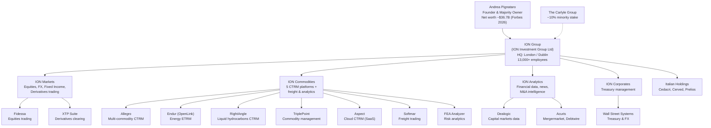
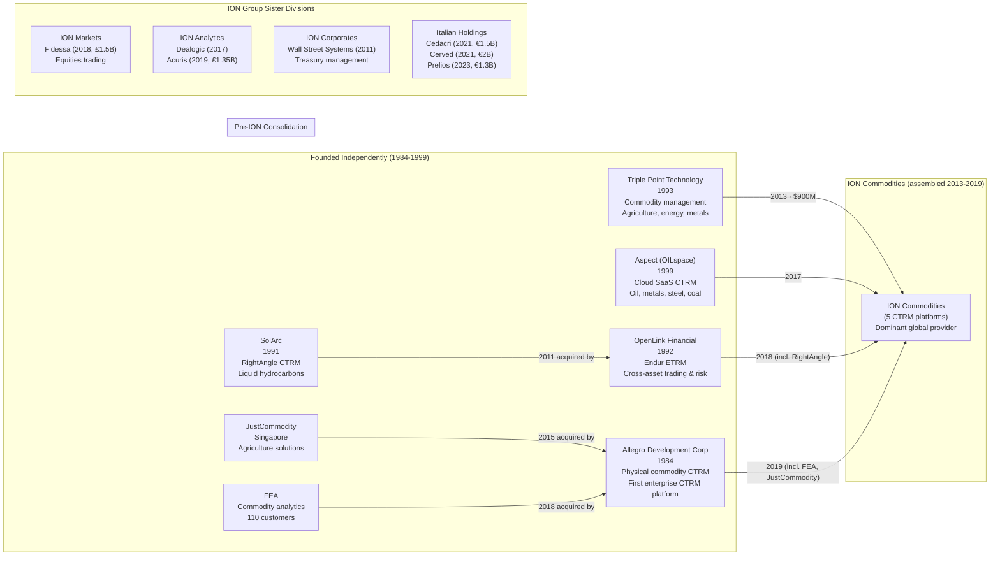

# ION Commodities - Corporate History

> **Parent file**: [ion-commodities-allegro.md](ion-commodities-allegro.md)

**Research Date**: 2026-02-15
**Genealogy Confidence**: High (well-documented acquisitions, public investor transactions, press releases)

## Current Ownership & Key Parties

| Stakeholder | Role | Stake % | Type | Since | Source |
|---|---|---|---|---|---|
| Andrea Pignataro | Founder & CEO, majority owner | ~90% est. | Founder | 1997 | [Wikipedia](https://en.wikipedia.org/wiki/Andrea_Pignataro) |
| The Carlyle Group | Minority investor (Carlyle Partners VI) | ~10% | PE | 2016 | [Carlyle press release](https://www.carlyle.com/media-room/news-release-archive/carlyle-group-makes-minority-investment-ion) |
| TA Associates | Former investor (exited via Carlyle) | 0% (exited) | PE | 2004-2016 | [Wikipedia](https://en.wikipedia.org/wiki/ION_Group) |

**Board of Directors**:

| Name | Role | Represents | Background | Source |
|---|---|---|---|---|
| Andrea Pignataro | Founder & CEO | Founder/Majority owner | PhD Mathematics, Imperial College; former Salomon Brothers bond trader | [Forbes](https://www.forbes.com/profile/andrea-pignataro/) |
| Renee James | Board Director | Carlyle Group | Former Intel President; Carlyle Operating Executive | [Carlyle press release](https://www.carlyle.com/media-room/news-release-archive/carlyle-group-makes-minority-investment-ion) |
| Cam Dyer | Board Director | Carlyle Group | Carlyle Operating Executive | [Carlyle press release](https://www.carlyle.com/media-room/news-release-archive/carlyle-group-makes-minority-investment-ion) |
| Sunil Biswas | CEO, ION Corporates | Management | Oversees ION Commodities division | [Energy Risk interview 2025](https://www.risk.net/insight/energy-and-commodities/7961804/energy-risk-software-rankings-2025-ion-commodities-interview) |

**Corporate Structure** (Mermaid diagram):



## Origin Story

| Data Point | Value | Source | Confidence |
|---|---|---|---|
| Founded | 1997 (as joint venture); 1999 (independent) | [Wikipedia](https://en.wikipedia.org/wiki/ION_Group), [Caproasia](https://www.caproasia.com) | Confirmed |
| Original Name | ION (joint venture between Salomon Brothers and List Holdings) | [Wikipedia](https://en.wikipedia.org/wiki/Andrea_Pignataro) | Confirmed |
| Founders | Andrea Pignataro (with backing from Salomon Brothers and List Holdings, Pisa) | [Wikipedia](https://en.wikipedia.org/wiki/Andrea_Pignataro) | Confirmed |
| Original Mission | Trading software and automation for fixed-income markets | [Wikipedia](https://en.wikipedia.org/wiki/ION_Group) | Confirmed |
| Original Product | Government bond trading software (from List Holdings heritage) | [Caproasia](https://www.caproasia.com) | Confirmed |
| First Market | Fixed-income trading desks at investment banks (London) | [Wikipedia](https://en.wikipedia.org/wiki/ION_Group) | Confirmed |

ION originated in 1997 when Andrea Pignataro, an Italian-born PhD mathematician working as a bond trader at Salomon Brothers in London, established a joint venture between Salomon Brothers and List Holdings (a Pisa-based software firm specializing in government bond trading). In 1999, Pignataro left Salomon Brothers and established ION as an independent company. The company's earliest focus was fixed-income trading automation, and it grew by serving investment banks and central banks with trading and workflow software.

ION did not enter the commodity/energy trading space until 2013 with the acquisition of Triple Point Technology. The entire ION Commodities division was assembled through acquisitions between 2013 and 2019 -- none of its five core CTRM products were built organically by ION.

## Corporate Identity Changes

| # | Date | From | To | Reason | Source |
|---|---|---|---|---|---|
| 1 | 1997 | (new entity) | ION (joint venture) | Founded as JV between Salomon Brothers and List Holdings | [Wikipedia](https://en.wikipedia.org/wiki/ION_Group) |
| 2 | 1999 | ION (JV) | ION (independent) | Pignataro left Salomon Brothers; ION became standalone | [Wikipedia](https://en.wikipedia.org/wiki/Andrea_Pignataro) |
| 3 | ~2005 | ION | ION Trading | Brand evolution as trading focus solidified | [MarketsWiki](https://www.marketswiki.com/wiki/ION_Group) |
| 4 | ~2013 | ION Trading | ION Investment Group | Reflected broader investment/acquisition strategy beyond trading | [Mergr](https://mergr.com/company/ion-group) |
| 5 | ~2018 | ION Investment Group | ION Group | Simplified corporate brand as multi-division conglomerate | [iongroup.com](https://iongroup.com) |

Product brand names have been preserved through acquisitions: Allegro, Endur, RightAngle, Aspect, and TriplePoint all retain their pre-acquisition identities under the "ION Commodities" umbrella.

## Mergers & Acquisitions Timeline

### Acquisitions Made (as buyer) -- Commodities Division

| Date | Target Company | Deal Value | What Was Gained | Integration Outcome | Source |
|---|---|---|---|---|---|
| 2013-07 | Triple Point Technology | $900M | Cloud/on-prem commodity management; 850+ employees; agriculture, energy, metals CTRM | Maintained as separate brand "TriplePoint" | [Mergr](https://mergr.com/transaction/ion-group-acquires-triple-point-technology), [Bloomberg](https://www.bloomberg.com/news/articles/2013-06-03/welsh-carson-said-close-to-selling-triple-point-for-800-million) |
| 2017 | Aspect Enterprise Solutions | Undisclosed | Cloud-native SaaS CTRM; oil, metals, steel, coal, gas, agriculture; founded 1999 as OILspace | Maintained as separate brand "Aspect" | [ION press release](https://iongroup.com/press-release/commodities/ion-enters-definitive-agreement-acquire-aspect-enterprise-solutions) |
| 2018-02 | OpenLink Financial | Undisclosed | Endur ETRM flagship + RightAngle CTRM; 460+ customers; 12 of top 25 energy companies | Maintained as "OpenLink" / "Endur" and "RightAngle" brands | [ION press release](https://iongroup.com/press-release/commodities/ion-investment-group-completes-acquisition-of-openlink), [Mergr](https://mergr.com/transaction/ion-investment-group-acquires-openlink-financial) |
| 2019-04 | Allegro Development Corporation | Undisclosed | Enterprise CTRM for physical commodities; 97% retention rate; included FEA analytics and JustCommodity | Maintained as separate brand "Allegro" | [ION press release](https://iongroup.com/press-release/commodities/ion-announces-acquisition-of-allegro), [Financial Post](https://financialpost.com/pmn/press-releases-pmn/business-wire-news-releases-pmn/vector-and-cerium-sell-allegro-development-corporation-to-ion-group) |

### Acquisitions Made (as buyer) -- Other Divisions

| Date | Target Company | Deal Value | What Was Gained | Division | Source |
|---|---|---|---|---|---|
| 2011-07 | Wall Street Systems | Undisclosed | Treasury & FX management; 650+ customers; 700 employees | ION Corporates | [Finextra](https://www.finextra.com/pressarticle/40022/ion-completes-wall-street-acquisition) |
| 2017-11 | Dealogic | Undisclosed (controlling stake) | Capital markets data platform | ION Analytics | [Reuters](https://www.reuters.com) |
| 2018 | Fidessa | £1.5B (~$2.3B) | Equities trading software | ION Markets | [FT](https://www.ft.com/content/8796afda-4479-11e8-93cf-67ac3a6482fd) |
| 2019-07 | Acuris (Mergermarket, Debtwire) | £1.35B (~$1.4B) | Financial news, M&A intelligence, investigative journalism | ION Analytics | [Reuters](https://www.reuters.com/article/us-bc-partners-divestiture-acuris-idUSKCN1SJ1GI/) |
| 2021 | Cedacri | ~€1.5B ($1.8B) | Italian banking software, 70+ banks | Italian Holdings | [Reuters](https://www.reuters.com/article/business/media-telecom/ion-group-nears-18-bln-deal-to-buy-italys-cedacri-sources-idUSL8N2K259I/) |
| 2021-09 | Cerved | ~€2B | Italian credit analysis and management | Italian Holdings | [Reuters](https://www.reuters.com/technology/fintech-group-ion-ups-its-2-bln-bid-italys-cerved-2021-08-27/) |
| 2023-08 | Prelios | ~€1.3B ($1.5B) | Italian real estate/credit management; €40B AUM | Italian Holdings | [Reuters](https://www.reuters.com/markets/deals/ion-seals-acquisition-italys-prelios-davidson-kempner-estimated-15-bln-deal-2023-08-11/) |

### "Acquired Acquisitions" -- What ION's Targets Had Already Bought

These companies were brought into ION indirectly through target company acquisitions:

| Date | Acquirer | Target | What Was Gained | Source |
|---|---|---|---|---|
| 1991/1994 | (founded) | SolArc | RightAngle CTRM for liquid hydrocarbons; 70%+ of NGL market | [OGJ](https://www.ogj.com/home/article/17294604/solarc-provides-insight-and-control) |
| 2011-11 | OpenLink | SolArc | RightAngle integrated into OpenLink portfolio | [DerivSource](https://derivsource.com/2011/10/17/openlink-announces-pending-solarc-acquisition) |
| 2015-06 | Allegro | JustCommodity | Singapore agriculture commodities solutions | [Wikipedia](https://en.wikipedia.org/wiki/Allegro_Development_Corporation) |
| 2018-04 | Allegro | Financial Engineering Associates (FEA) | Commodity analytics, 110 new customers | [Energy Risk](https://www.risk.net/awards/6823366/commodity-trading-and-risk-management-software-house-of-the-year-ion-allegro) |

### Acquired By (as target)

ION Group has never been acquired. It remains privately held under founder Andrea Pignataro's majority ownership.

## Investment & Financial Events

| Date | Event Type | Details | Investors/Counterparty | Investor Type | Amount | Source |
|---|---|---|---|---|---|---|
| 2004-06 | Strategic Investment | Initial minority investment in ION | TA Associates | PE (Growth) | $44M (initial); $200M cumulative | [Wikipedia](https://en.wikipedia.org/wiki/ION_Group) |
| 2016-05 | Secondary Sale | Carlyle acquired 10% stake from TA Associates | The Carlyle Group (Carlyle Partners VI) | PE (Buyout) | ~€360M (~$400M) | [Carlyle](https://www.carlyle.com/media-room/news-release-archive/carlyle-group-makes-minority-investment-ion), [MarketScreener](https://uk.marketscreener.com) |
| 2019-11 | Valuation Milestone | Enterprise value reached £7B after 20 acquisitions (2005-2019) | N/A | N/A | £7B EV | [Wikipedia](https://en.wikipedia.org/wiki/ION_Group) |
| 2020-12 | SPAC IPO | ScION Tech Growth I & II listed on Nasdaq; raised $500M | Public investors | Public (SPAC) | $500M raised | [Bebeez](https://bebeez.eu/2020/12/18/the-spac-by-ion-investment-group-andrea-pignataro-raises-500-mln-and-starts-listing-on-nasdaq/) |
| 2025 | Tax Settlement | Pignataro settled €280M tax dispute with Italian authorities over alleged evasion (2013-2023) | Italian Revenue Agency | Regulatory | €280M settlement | [Caproasia](https://www.caproasia.com), [Wikipedia](https://en.wikipedia.org/wiki/Andrea_Pignataro) |

**Allegro's Pre-ION Funding History**:

| Date | Event Type | Details | Investors | Amount | Source |
|---|---|---|---|---|---|
| 1984 | Founded | Allegro Development Corporation founded by Eldon Klaassen | Founder | N/A | [Wikipedia](https://en.wikipedia.org/wiki/Allegro_Development_Corporation) |
| 2014 | Recapitalization | Vector Capital + Cerium Technology partner with founder to recapitalize | Vector Capital, Cerium Technology | Undisclosed | [Financial Post](https://financialpost.com/pmn/press-releases-pmn/business-wire-news-releases-pmn/vector-and-cerium-sell-allegro-development-corporation-to-ion-group) |
| 2019-04 | Sale to ION | Revenue grew 50%, 2 acquisitions completed, geographic expansion under PE ownership | ION Group (buyer) | Undisclosed | [Financial Post](https://financialpost.com) |

**OpenLink's Pre-ION PE Ownership Chain**:

| Date | Event | Owner | Amount/Valuation | Source |
|---|---|---|---|---|
| 1992 | Founded | Founders (5 staff, New York) | N/A | [IT History](https://www.ithistory.org/db/companies/openlink-financial) |
| 2006-02 | Recapitalization | TA Associates | $100M valuation | [Preqin](https://www.preqin.com/data/profile/asset/openlink-financial-llc/29590) |
| 2006 | PE Buyout | The Carlyle Group (acquired from TA Associates) | Undisclosed | [Hellman & Friedman](https://hf.com/hellman-friedman-acquires-openlink-from-the-carlyle-group/) |
| 2011-09 | Secondary Buyout | Hellman & Friedman (acquired from Carlyle) | ~$390M financing | [Mergr](https://mergr.com/hellman-%26-friedman-acquires-openlink-financial) |
| 2018-02 | Sale to ION | ION Investment Group (acquired from H&F) | Undisclosed | [ION press release](https://iongroup.com/press-release/commodities/ion-investment-group-completes-acquisition-of-openlink) |

## Splits, Spin-offs & Divestitures

| Date | Event Type | What Was Separated | Destination / Buyer | Reason | Source |
|---|---|---|---|---|---|
| N/A | N/A | No known divestitures from ION Commodities | N/A | ION operates a "buy and hold" multi-brand strategy; no CTRM brands have been divested | N/A |

ION's strategy is explicitly accumulative: acquire CTRM brands and operate them as separate products under a shared umbrella. No commodity software product or division has been divested since ION began building the commodities portfolio in 2013.

## Critical Events & Milestones

| Date | Event | Impact | Source |
|---|---|---|---|
| 1984 | Allegro Development Corporation founded by Eldon Klaassen (Dallas, TX) | Created first enterprise platform for physical commodity management | [Wikipedia](https://en.wikipedia.org/wiki/Allegro_Development_Corporation) |
| 1991 | SolArc founded by 3 ex-Andersen Consulting colleagues | Created RightAngle; within 4 years captured 70%+ of NGL market | [OGJ](https://www.ogj.com/home/article/17294604/solarc-provides-insight-and-control) |
| 1992 | OpenLink Financial founded in New York (5 staff) | Built Endur, which became the dominant ETRM platform for 11 consecutive years | [IT History](https://www.ithistory.org/db/companies/openlink-financial) |
| 1993 | Triple Point Technology founded in Westport, CT | Cloud and on-premise commodity management; grew to 850+ employees | [Mergr](https://mergr.com/transaction/ion-group-acquires-triple-point-technology) |
| 1997 | ION founded as Salomon Brothers / List Holdings joint venture | Origin of the ION empire | [Wikipedia](https://en.wikipedia.org/wiki/ION_Group) |
| 1999 | Aspect Enterprise Solutions founded as OILspace | Pioneered cloud-native CTRM delivery model | [CTRM Center](https://www.ctrmcenter.com/resources/aspect-enterprise-solutions-ltd/) |
| 2013-07 | ION acquires Triple Point Technology for $900M | ION's entry into commodity trading software | [Bloomberg](https://www.bloomberg.com/news/articles/2013-06-03/welsh-carson-said-close-to-selling-triple-point-for-800-million) |
| 2016-05 | Carlyle acquires 10% of ION for ~$400M | Valued ION's EBITDA at €300M+; signaled institutional confidence | [Carlyle](https://www.carlyle.com/media-room/news-release-archive/carlyle-group-makes-minority-investment-ion) |
| 2017 | ION acquires Aspect Enterprise Solutions | Added cloud-native SaaS CTRM capability | [ION press release](https://iongroup.com/press-release/commodities/ion-enters-definitive-agreement-acquire-aspect-enterprise-solutions) |
| 2018-02 | ION acquires OpenLink Financial (Endur + RightAngle) | Gained the #1-ranked ETRM platform and dominant liquid hydrocarbons CTRM | [ION press release](https://iongroup.com/press-release/commodities/ion-investment-group-completes-acquisition-of-openlink) |
| 2018 | ION acquires Fidessa for £1.5B | Largest single acquisition; established ION Markets division | [FT](https://www.ft.com/content/8796afda-4479-11e8-93cf-67ac3a6482fd) |
| 2019-04 | ION acquires Allegro Development Corporation | Described as "last major independent CTRM vendor"; completed ION's CTRM monopoly concerns | [Risk.net](https://www.risk.net/commodities/6573426/ions-deal-for-allegro-worries-commodity-firms) |
| 2019-04 | Risk.net: "ION's deal for Allegro worries commodity firms" | Market concern about near-monopoly in CTRM software; ION now owned 5 of the top CTRM platforms | [Risk.net](https://www.risk.net/commodities/6573426/ions-deal-for-allegro-worries-commodity-firms) |
| 2019-07 | ION acquires Acuris for £1.35B | Added Mergermarket and Debtwire; established ION Analytics | [Reuters](https://www.reuters.com/article/us-bc-partners-divestiture-acuris-idUSKCN1SJ1GI/) |
| 2020-12 | ScION SPAC listed on Nasdaq, raised $500M | ION's first public market activity | [Bebeez](https://bebeez.eu/2020/12/18/) |
| 2021 | ION acquires Cedacri (~€1.5B) and Cerved (~€2B) in Italy | Massive Italian expansion; ~€3.5B invested in Italian financial infrastructure | [Reuters](https://www.reuters.com) |
| 2023-08 | ION acquires Prelios for ~€1.3B | Continued Italian strategy; total €6B+ invested in Italy | [Reuters](https://www.reuters.com/markets/deals/ion-seals-acquisition-italys-prelios-davidson-kempner-estimated-15-bln-deal-2023-08-11/) |
| 2025-01 | Pignataro settles €280M Italian tax dispute | Regulatory risk; alleged tax evasion 2013-2023 | [Wikipedia](https://en.wikipedia.org/wiki/Andrea_Pignataro) |
| 2025-03 | RightAngle S25 released | Latest product update for liquid hydrocarbons with Azure cloud integration | [ION press release](https://iongroup.com/press-release/ion-releases-rightangle-s25-for-navigating-the-evolving-liquid-hydrocarbon-market) |
| 2025-05 | ION Commodities wins CTRM Software House of the Year (Energy Risk Awards 2025) | Continued market leadership recognition | [ION press releases](https://iongroup.com/press-release/commodities) |
| 2025-09 | Softmar relaunched as SaaS platform for freight trading | Expansion into maritime logistics and freight risk management | [ION press release](https://iongroup.com/press-release/commodities/ion-commodities-relaunches-softmar-as-volatility-reshapes-global-freight-trading/) |

## Corporate Timeline (Visual)

```mermaid
timeline
    title ION Commodities - Corporate Genealogy
    section Pre-ION Origins (1984-1999)
        1984 : Allegro Development Corp founded (Dallas, TX) by Eldon Klaassen
        1991 : SolArc founded (RightAngle for liquid hydrocarbons)
        1992 : OpenLink Financial founded (New York, 5 staff)
        1993 : Triple Point Technology founded (Westport, CT)
        1994 : SolArc launches RightAngle - captures 70%+ NGL market
        1997 : ION founded as Salomon Brothers / List Holdings JV
        1999 : Aspect founded as OILspace ; ION goes independent
    section ION Foundation (2004-2012)
        2004 : TA Associates invests $44M in ION
        2006 : Carlyle acquires OpenLink from TA Associates
        2008 : OpenLink Endur ranked #1 in 13 ETRM categories
        2011 : ION acquires Wall Street Systems (treasury) ; H&F acquires OpenLink from Carlyle ; OpenLink acquires SolArc (RightAngle)
    section ION Commodities Assembly (2013-2019)
        2013 : ION acquires Triple Point Technology for $900M
        2014 : Vector Capital recapitalizes Allegro
        2016 : Carlyle buys 10% of ION for ~$400M
        2017 : ION acquires Aspect Enterprise Solutions
        2018 : ION acquires OpenLink (Endur + RightAngle) ; ION acquires Fidessa for £1.5B ; Allegro acquires FEA
        2019 : ION acquires Allegro ; ION acquires Acuris for £1.35B ; Enterprise value reaches £7B
    section Italian Expansion & Current Era (2020-2026)
        2020 : ScION SPAC raises $500M on Nasdaq
        2021 : ION acquires Cedacri (~€1.5B) and Cerved (~€2B) in Italy
        2023 : ION acquires Prelios (~€1.3B)
        2025 : RightAngle S25 launched ; CTRM Software House of the Year ; Softmar SaaS relaunch ; Pignataro settles €280M tax case
```



## M&A Genealogy (Visual)



## Corporate Timeline (Text Summary)

```text
1984 - Allegro Development Corporation founded by Eldon Klaassen in Dallas, TX (first enterprise CTRM platform)
1991 - SolArc founded by 3 ex-Andersen Consulting colleagues (created RightAngle for liquid hydrocarbons)
1992 - OpenLink Financial founded in New York with 5 staff (built Endur ETRM)
1993 - Triple Point Technology founded in Westport, CT by Peter Armstrong (commodity management)
1994 - SolArc launches RightAngle; captures 70%+ of NGL market within 4 years
1997 - ION founded as joint venture between Andrea Pignataro (Salomon Brothers) and List Holdings (Pisa)
1999 - Pignataro leaves Salomon Brothers; ION becomes independent. OILspace (later Aspect) founded
2004 - TA Associates invests $44M in ION (later $200M cumulative)
2006 - TA Associates recapitalizes OpenLink at $100M valuation; Carlyle Group acquires OpenLink from TA
2008 - OpenLink Endur ranked #1 in 13 ETRM categories by Energy Risk Magazine
2011 - ION acquires Wall Street Systems (treasury, 700 employees)
2011 - Hellman & Friedman acquires OpenLink from Carlyle (secondary buyout)
2011 - OpenLink acquires SolArc (RightAngle), integrating liquid hydrocarbon CTRM
2013 - ION acquires Triple Point Technology for $900M -- ION's entry into commodity software
2014 - Vector Capital and Cerium Technology recapitalize Allegro with founder Klaassen
2015 - Allegro acquires JustCommodity (Singapore, agriculture); Frank Brienzi becomes CEO
2016 - Carlyle acquires 10% of ION from TA Associates for ~€360M; ION EBITDA exceeds €300M
2017 - ION acquires Aspect Enterprise Solutions (cloud CTRM) and Dealogic (capital markets data)
2018 - ION acquires OpenLink Financial (Endur + RightAngle) from Hellman & Friedman
2018 - ION acquires Fidessa for £1.5B (equities trading) -- largest single acquisition
2018 - Allegro acquires FEA (Financial Engineering Associates, commodity analytics)
2019 - ION acquires Allegro Development Corp from Vector Capital/Cerium -- "last independent CTRM vendor"
2019 - ION acquires Acuris (Mergermarket, Debtwire) for £1.35B; enterprise value reaches £7B
2020 - ScION SPAC raises $500M on Nasdaq
2021 - ION acquires Cedacri (~€1.5B) and Cerved (~€2B) in Italy; total €6B+ invested in Italian financial sector
2022 - FEA Analyzer launched (predictive analytics, stochastic models for commodity risk)
2023 - ION acquires Prelios (~€1.3B, Italian real estate/credit management)
2025 - RightAngle S25 released (Azure cloud); CTRM Software House of the Year; Softmar SaaS relaunch
2025 - Pignataro settles €280M tax dispute with Italian authorities; net worth ~$36.7B (Forbes)
```

## Pattern Analysis

**Growth Strategy**: Acquisition-driven (100% of commodity division assembled via M&A; no organic CTRM products)

**Acquisition Pattern**: Systematic roll-up of the entire CTRM software market. ION acquired all five major independent CTRM vendors between 2013-2019, creating an effective near-monopoly. The pattern is: acquire independent market leaders, preserve their brand identity, operate as multi-brand portfolio.

**Technology Evolution**: Each acquired product maintains its own technology stack. Allegro (power/multi-commodity), Endur (energy ETRM flagship), RightAngle (liquid hydrocarbons), TriplePoint (agriculture/metals), Aspect (cloud-native SaaS). Cross-platform capabilities like ION Cloud (12+ years) and FEA Analyzer provide shared analytics, but the core platforms remain distinct. No evidence of a unified next-generation platform being built.

**Leadership Stability**: Andrea Pignataro has led ION since founding in 1997 (28 years). Acquired company leadership tends to depart within 1-3 years post-acquisition (Triple Point founder Peter Armstrong left post-acquisition; Allegro's leaders from Vector/Cerium era). Sunil Biswas leads the Corporates/Commodities divisions.

**Financial Pattern**: ION is a buy-and-hold acquirer funded by private capital. No IPO for the parent company (only SPACs). Pignataro maintains majority control. The €360M Carlyle stake (10%) in 2016 implied a ~€3.6B total valuation; by 2019 enterprise value reached £7B. Current valuation is likely significantly higher given €5B+ in Italian acquisitions alone since 2021. Pignataro's personal net worth ($36.7B per Forbes) is primarily tied to ION's unrealized value.

## Strategic Implications for Eneve

**What the history reveals about future direction**:
- ION's commodity division is in **maintenance/optimization mode**, not innovation mode. The assembly phase (2013-2019) is over. The company's recent investment focus is overwhelmingly on Italy (€6B+ in Cedacri, Cerved, Prelios) and financial data (Acuris, Dealogic), not on commodity/energy software innovation.
- The multi-brand strategy means ION is managing five separate legacy codebases rather than building one modern platform. This creates significant tech debt and integration overhead, making rapid innovation difficult.
- ION's SPAC activity (2020) and Italian acquisitions suggest Pignataro's strategic priority is Italian financial infrastructure, not energy/commodity technology.

**Inherited strengths from corporate history**:
- **Installed base dominance**: By acquiring all five major CTRM vendors, ION has an unmatched installed base. Switching costs are enormous for existing customers. This is ION's most significant competitive advantage.
- **Brand portfolio breadth**: Can offer different products for different customer segments without head-to-head self-competition.
- **Deep pockets**: Pignataro's $36.7B fortune and ION's proven ability to execute billion-dollar acquisitions means ION could acquire any competitor if threatened.
- **12+ years of cloud capability**: ION Cloud is more mature than many competitors' cloud offerings.

**Inherited weaknesses / risks from corporate history**:
- **No organic innovation DNA**: ION has never built a CTRM product from scratch. Every product came through acquisition. This creates cultural dependency on acquired talent, much of which departs post-acquisition.
- **Multi-codebase complexity**: Maintaining 5 separate CTRM platforms (each with different architecture, technology stack, and customer base) is inherently less efficient than a single modern platform.
- **Regulatory risk**: Pignataro's €280M Italian tax settlement, Bank of Italy scrutiny over complex corporate structures, and near-monopoly concerns from Risk.net's 2019 reporting all signal elevated regulatory exposure.
- **Attention deficit for commodities**: With €6B+ invested in Italian financial infrastructure and major financial data assets, ION's strategic attention and capital allocation are increasingly diverted from the commodities division.
- **AI gap**: Despite enormous resources, ION Commodities shows LOW AI adoption signals. The company's multi-platform strategy makes AI integration harder (must build for 5 platforms instead of 1), and no AI product features have been announced.

**M&A prediction**: ION Commodities is unlikely to make further major CTRM acquisitions (the market is already consolidated). However, ION Group could:
1. **Acquire a European back-office/operations vendor** (threat to Eneve) if it decides to extend downstream from trading into operations.
2. **Acquire an AI/analytics startup** to address the AI gap across its CTRM portfolio.
3. **Be taken private/restructured** if Pignataro seeks liquidity -- the SPAC activity and Italian expansion pattern could signal a preparation for a partial IPO or large-scale refinancing of ION Group.

The most relevant risk for Eneve: ION is a sleeping giant in the commodity technology space. Its commodities division appears deprioritized relative to financial markets and Italian holdings, but the company could redirect massive capital toward energy back-office innovation if strategic priorities shift. The probability is LOW but the impact would be HIGH.
