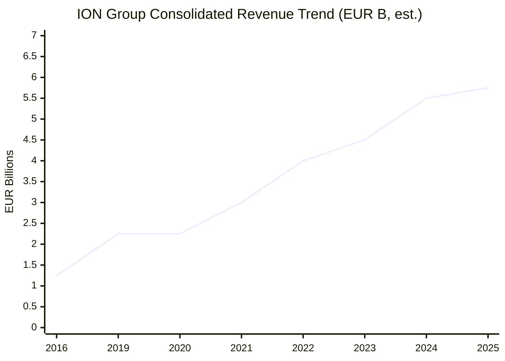
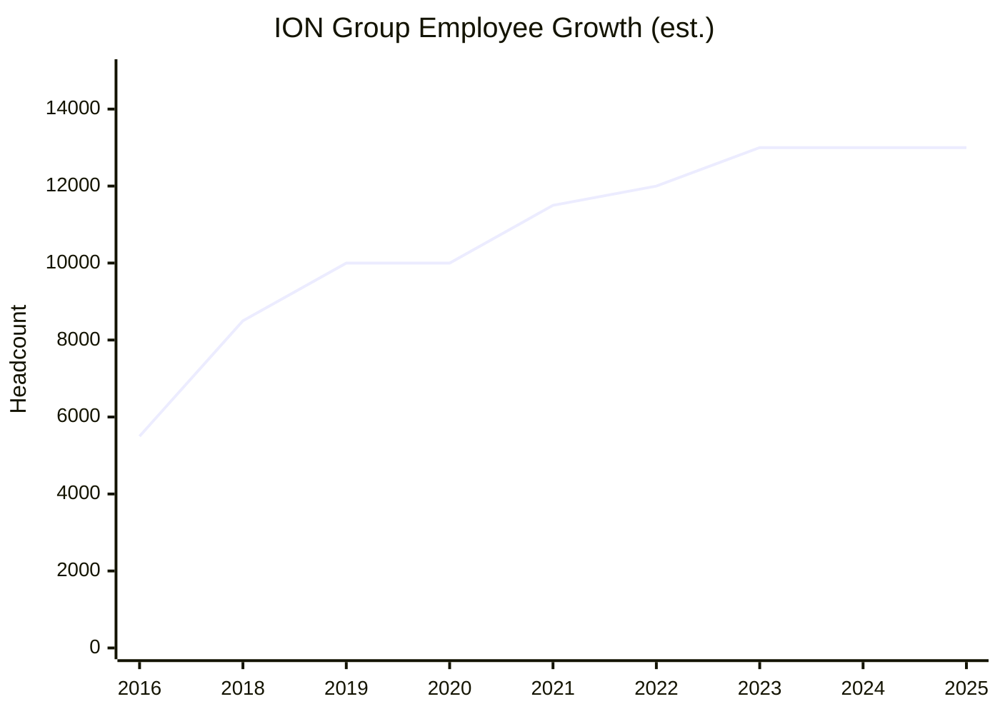
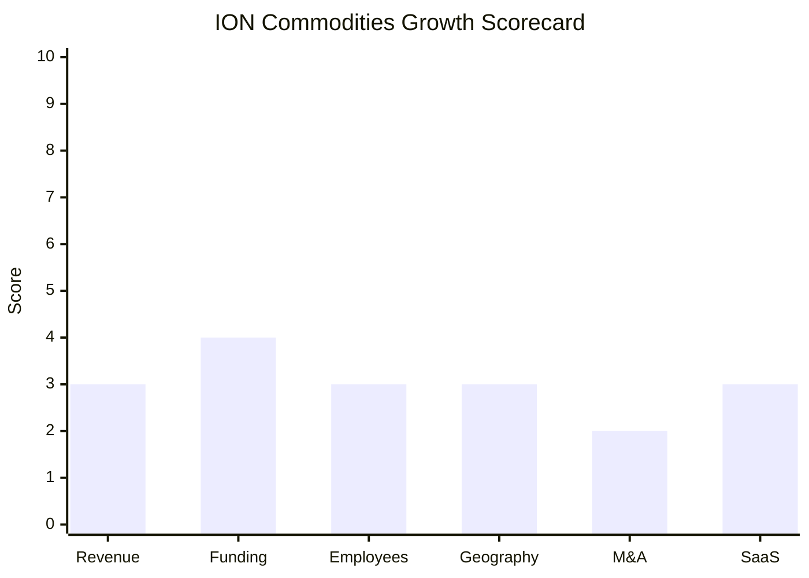

# Financial & Growth Deep-Dive - ION Commodities (ION Group)

**Research Date**: 2026-02-15
**Data Availability**: Low-Medium (ION Group is private; group-level EBITDA available via Bloomberg/S&P; commodities division financials not separately disclosed; proxy estimates required)

> **Important Note**: ION Commodities is a division of ION Group, a private conglomerate with 5 major divisions (Markets, Analytics, Commodities, Corporates, Italian Holdings). Division-level financials are not publicly reported. This analysis presents ION Group consolidated figures where available and estimates ION Commodities separately using proxy methodology. All ION Commodities-specific figures are clearly marked as estimates.

---

### Revenue Timeline

#### ION Group (Consolidated) - Estimated

| Year | Revenue | Currency | EUR Equivalent | YoY Growth | Source | Confidence |
| --- | --- | --- | --- | --- | --- | --- |
| 2025 (est.) | ~€5-6B | EUR | €5-6B | ~5-10% | Derived from €2.2B EBITDA (2024) at ~35-40% margin | Estimated (proxy) |
| 2024 | ~€5-6B | EUR | €5-6B | ~10-15% | Bloomberg: €2.2B EBITDA; 35-40% EBITDA margin implied | Estimated (proxy) |
| 2023 | ~€4-5B | EUR | €4-5B | ~15-20% | S&P: 10x leverage at $15B debt = ~$1.5B EBITDA; includes Italian acquisitions | Estimated (proxy) |
| 2022 | ~€3.5-4.5B | EUR | €3.5-4.5B | ~25-35% | Cedacri + Cerved contributing first full year | Estimated (proxy) |
| 2021 | ~€2.5-3.5B | EUR | €2.5-3.5B | ~15-25% | Cedacri (~€1.5B) + Cerved (~€2B) acquired, partial year contribution | Estimated (proxy) |
| 2020 | ~€2-2.5B | EUR | €2-2.5B | ~5% | Post-Allegro/Acuris consolidation; COVID impact | Estimated (proxy) |
| 2019 | ~€2-2.5B | EUR | €2-2.5B | ~30%+ | Enterprise value reached £7B; Allegro + Acuris acquired | Estimated (proxy) |
| 2016 | ~€1-1.5B | EUR | €1-1.5B | N/A | Carlyle: EBITDA >€300M; implies revenue at ~25-30% margin | Estimated (proxy) |

**Estimation Methodology**: Revenue derived from EBITDA anchors (€300M+ in 2016 per Carlyle; €2.2B in 2024 per Bloomberg) applying 25-40% EBITDA margins typical for financial software/data companies. Growth includes both organic and acquisition-driven (Italian acquisitions 2021-2023 are the largest contributors).

**Revenue CAGR (3yr, 2021-2024)**: ~15-25% (acquisition-driven; Italian holdings account for most growth)
**Revenue CAGR (8yr, 2016-2024)**: ~18-22% (acquisition-driven)

#### ION Commodities Division - Estimated

| Year | Revenue | Currency | EUR Equivalent | YoY Growth | Source | Confidence |
| --- | --- | --- | --- | --- | --- | --- |
| 2025 (est.) | ~€600M-1B | EUR | €600M-1B | ~3-5% | Proxy: 1,200+ customers, 5 major CTRM platforms, industry position | Estimated (proxy) |
| 2024 | ~€600M-1B | EUR | €600M-1B | ~3-5% | No acquisitions; organic growth only since 2019 | Estimated (proxy) |
| 2023 | ~€550M-950M | EUR | €550M-950M | ~3-5% | Stable CTRM market; no new product launches | Estimated (proxy) |
| 2022 | ~€500M-900M | EUR | €500M-900M | ~5-8% | Post-COVID recovery; energy price volatility driving demand | Estimated (proxy) |
| 2021 | ~€500M-850M | EUR | €500M-850M | ~5% | Allegro fully integrated; energy market recovery | Estimated (proxy) |
| 2019 | ~€450M-800M | EUR | €450M-800M | ~30%+ | Allegro acquisition completed April 2019 | Estimated (proxy) |

**Division Estimation Methodology**: ION Commodities comprises 5 major CTRM platforms (Allegro, Endur/OpenLink, RightAngle, TriplePoint, Aspect) plus Softmar and FEA. Triple Point alone was $900M acquisition (2013) at ~850 employees, suggesting significant revenue. Combined 1,200+ customers serving 62% of top 250 energy companies. Revenue estimated at 15-20% of ION Group total, consistent with being one of 5 divisions (Markets, Analytics, Corporates, Commodities, Italian Holdings) where Italian and Markets/Analytics are likely larger.

**ION Commodities Revenue CAGR (3yr, organic)**: ~3-5% (Estimated; no acquisitions since 2019)

#### Revenue Trend Chart

### Profitability

| Data Point | Value | Source | Confidence |
| --- | --- | --- | --- |
| EBITDA - ION Group (2024) | ~€2.2B | Bloomberg Billionaires Index | Estimated |
| EBITDA - ION Group (2016) | >€300M | Carlyle press release (2016) | Confirmed |
| EBITDA Margin (est.) | ~35-40% | Derived from revenue/EBITDA estimates | Estimated |
| Net Profit / Loss | Unknown (private) | N/A | Unknown |
| Recurring Revenue % | Unknown for commodities | Not disclosed | Unknown |
| SaaS Revenue % | Low (Aspect only is true SaaS) | Product analysis | Estimated |
| Revenue per Employee - ION Group | ~€400-460K | €5.5B / 13,000 employees | Estimated (proxy) |
| Revenue per Employee - Commodities | Unknown | Division headcount not disclosed | Unknown |
| Debt / EBITDA Leverage (2023) | 10x (incl. holdco debt); 8.3x (excl.) | S&P Global Ratings | Confirmed |

### Funding & Investment History

| Date | Round | Amount | Lead Investor(s) | Valuation | Source | Confidence |
| --- | --- | --- | --- | --- | --- | --- |
| 2004-06 | Strategic Investment | $44M (later $200M cumulative) | TA Associates | Unknown | Wikipedia | Confirmed |
| 2016-05 | Secondary Sale (PE) | ~€360M (~$400M) for 10% stake | The Carlyle Group (Carlyle Partners VI) | ~€3.6B (~$4B) implied total | Carlyle press release, MarketScreener | Confirmed |
| 2019-11 | Valuation Milestone | N/A (operational) | N/A | £7B (~€8B) enterprise value | Wikipedia | Confirmed |
| 2020-12 | SPAC IPO | $500M raised | Public investors (ScION Tech Growth I & II on Nasdaq) | N/A | Bebeez | Confirmed |
| 2024-02 | Debt Financing | $276M (dividend recap + cash buffer) | HPS Investment Partners + public markets | N/A | Bloomberg Law | Confirmed |
| 2024-04 | Bond Issuance | $720M ($400M USD + €300M EUR) | Public bond markets | N/A | Bloomberg Law | Confirmed |
| 2024-09 | Leveraged Loan | $575M (upsized 9%) | Syndicated loan market | N/A | Bloomberg | Confirmed |

**Total Raised (Equity)**: ~$600M+ (TA Associates $200M cumulative + Carlyle ~$400M + ScION SPAC $500M)
**Total Debt Outstanding**: ~$15B ($12B bonds/loans + ~$3B private credit from HPS)
**Latest Valuation**: £7B / ~€8B (2019); current valuation likely €15-25B+ given €2.2B EBITDA and growth since 2019
**Current Investors**: Andrea Pignataro ~90% (sole economic owner of main operating units per Bloomberg); The Carlyle Group ~10% (Carlyle Partners VI, since 2016)
**War Chest Signals**: Massive access to debt capital (raised ~$1.5B in debt in 2024 alone). HPS Investment Partners provides ~$3B in private credit. Pignataro's personal net worth $19.8-36.7B (Bloomberg/Forbes). However, high leverage (10x EBITDA) limits acquisition capacity without further debt. Capital allocation priority is clearly Italian financial infrastructure (€6B+ invested since 2021), not commodities.

### Employee Timeline

#### ION Group (Consolidated)

| Year | Headcount | YoY Growth | Source | Confidence |
| --- | --- | --- | --- | --- |
| 2026 (current) | ~13,000+ | ~0% | Wikipedia, PitchBook, ION press materials | Confirmed |
| 2025 | ~13,000+ | ~0% | ION press releases; Energy Risk Awards 2025 | Confirmed |
| 2024 | ~13,000+ | ~0-5% | Bloomberg, industry reports | Estimated |
| 2023 | ~13,000+ | ~5-10% | Prelios acquisition (~1,000 employees est.) | Estimated |
| 2022 | ~12,000+ | ~5-10% | Post-Cedacri/Cerved integration; partial Prelios | Estimated |
| 2021 | ~11,000-12,000 | ~10-15% | Cedacri (banking) + Cerved (credit) acquisitions | Estimated |
| 2020 | ~10,000+ | ~0% | Post-Allegro/Acuris; pre-Italian expansion | Estimated |
| 2019 | ~10,000+ | ~15-20% | Allegro + Acuris acquisitions completed | Estimated |
| 2018 | ~8,000-9,000 | ~30%+ | Fidessa (~1,800 staff) + OpenLink acquisitions | Estimated |
| 2016 | ~5,000-6,000 | N/A | Pre-major acquisitions; Carlyle investment year | Estimated |

**Employee CAGR (3yr, 2022-2025)**: ~3-5% (mainly acquisition-driven; organic hiring flat)
**Employee CAGR (8yr, 2016-2024)**: ~10-12% (entirely acquisition-driven)
**Current Open Positions**: ~181 across entire ION Group (as of Feb 2026)
**AI/ML/Data Science Roles**: Not separately quantified; ION careers page lists Data Science & Analytics department
**Hiring Hotspots**: India (Noida, Bangalore, Chennai, Gurgaon), London, New York, Sydney

#### Employee Growth Chart

### Geographic & Market Expansion

| Year | Expansion Event | Details | Source | Confidence |
| --- | --- | --- | --- | --- |
| 2021-2023 | Massive Italian expansion | Cedacri (banking), Cerved (credit), Prelios (real estate) - all Italian | Reuters, Bloomberg | Confirmed |
| 2025-09 | Softmar SaaS relaunch | Expanded into maritime freight trading as SaaS | ION press release | Confirmed |
| 2025-03 | RightAngle S25 with Azure | Azure cloud integration for liquid hydrocarbons market | ION press release | Confirmed |
| N/A | No new commodities markets entered | No new countries or exchanges for commodities division since 2019 | Industry analysis | Estimated |

**International Revenue %**: Not disclosed (ION is globally distributed across 50+ offices)
**Expansion Trajectory**: ION Group's expansion energy is overwhelmingly directed at Italian financial infrastructure (€6B+ since 2021). The commodities division has made no geographic expansion moves since completing its 2013-2019 acquisition assembly. No new offices, countries, or exchange integrations announced for commodities. The division appears to be in steady-state geographic mode, serving existing global markets.

### M&A Activity

#### ION Group (Consolidated, Last 5 Years)

| Date | Target | Deal Size | Capability Gained | Strategic Rationale | Source | Confidence |
| --- | --- | --- | --- | --- | --- | --- |
| 2023-08 | Prelios | ~€1.3B ($1.5B) | Italian real estate/credit management; €40B AUM | Italian financial infrastructure strategy | Reuters | Confirmed |
| 2021 | Cerved | ~€2B | Italian credit analysis and management | Italian financial data dominance | Reuters | Confirmed |
| 2021 | Cedacri | ~€1.5B ($1.8B) | Italian banking software; 70+ banks | Italian core banking infrastructure | Reuters | Confirmed |

#### ION Commodities Division (Last 5 Years)

| Date | Target | Deal Size | Capability Gained | Strategic Rationale | Source | Confidence |
| --- | --- | --- | --- | --- | --- | --- |
| N/A | None since Allegro (April 2019) | N/A | N/A | Commodities M&A program completed in 2019 | Industry analysis | Confirmed |

**Divestitures**: None (ION operates a "buy and hold" multi-brand strategy; no CTRM brands divested)
**M&A Pattern**: ION Group remains an active acquirer, but all M&A capital since 2019 has been directed at Italian financial services (€6B+ across Cedacri, Cerved, Prelios). The commodities division has had zero acquisitions in 6+ years. This signals commodities is a mature, deprioritized division within ION's portfolio. The CTRM market is already consolidated under ION, so further commodity M&A targets are limited. Future M&A risk for Eneve: ION could theoretically acquire a European back-office/operations vendor, but current capital allocation patterns make this unlikely.

### SaaS Transition Metrics

| Data Point | Value | Source | Confidence |
| --- | --- | --- | --- |
| Deployment Model | Hybrid (primarily on-premise; Aspect is cloud-native SaaS) | Product analysis, ION website | Confirmed |
| Cloud Revenue % (current) | Unknown; likely <20% of commodities revenue | Only Aspect is SaaS; other 4 platforms are on-prem | Estimated |
| Cloud Revenue % (1yr ago) | Unknown; slightly lower | Pre-Softmar SaaS relaunch | Estimated |
| Cloud Revenue % (2yr ago) | Unknown; likely <15% | Pre-RightAngle S25 Azure integration | Estimated |
| Recurring Revenue % | Unknown; likely 60-80% (license + maintenance + SaaS combined) | CTRM industry norm for enterprise software | Estimated |
| Platform Stack | Mixed: Aspect (cloud-native SaaS), Allegro (on-prem + hosted), Endur (on-prem), RightAngle (on-prem + Azure), TriplePoint (on-prem + hosted), Softmar (SaaS relaunch 2025), FEA Analyzer (cloud) | ION product pages | Confirmed |
| Migration Status | In-progress (incremental; no unified cloud platform announced) | Product roadmap analysis | Estimated |

**SaaS Transition Assessment**: ION Commodities faces a unique cloud migration challenge: it manages 5 separate CTRM platforms, each with different architectures and technology stacks. Rather than building a unified cloud-native replacement, ION is incrementally adding cloud capabilities to each platform independently:
- **Aspect**: Already cloud-native SaaS (multi-tenant); strongest SaaS story. Generating "double-digit sales" and growing rapidly
- **RightAngle S25**: Azure cloud integration added (March 2025)
- **Softmar**: Relaunched as SaaS (September 2025)
- **FEA Analyzer**: Cloud-based analytics
- **Allegro**: On-premise with ION Cloud hosting (12+ years); not rebuilt as SaaS
- **Endur**: Primarily on-premise; no SaaS announcement
- **TriplePoint**: Primarily on-premise/hosted

The multi-platform burden makes a true SaaS transformation significantly more expensive and complex than for single-product competitors.

### AI Product Assessment (Updated)

| Data Point | Value | Source | Confidence |
| --- | --- | --- | --- |
| FEA Analyzer | Predictive analytics, Monte Carlo simulations, stochastic models, ML in valuation/optimization | ION press releases, product pages | Confirmed |
| Allegro/Endur AI features | None announced (blog content on AI benefits only) | ION blog, product releases | Confirmed |
| RightAngle S25 AI features | None announced | ION press release (March 2025) | Confirmed |
| Energy Risk 2025 interview | AI strategy mentioned; "integrating AI across product suite" | Risk.net interview (2025) | Confirmed |
| ION Group hiring | Data Science & Analytics department listed; specific AI/ML roles not quantified | ION careers page | Estimated |

**AI Assessment**: Upgraded from "LOW" to "LOW-MODERATE". FEA Analyzer provides genuine ML/predictive analytics capability for commodity risk. ION claims AI integration strategy across the suite (per Energy Risk 2025 interview), but no concrete AI features have shipped in Allegro, Endur, or RightAngle. The multi-platform architecture makes AI deployment harder (must build for 5 platforms). Aspect may get AI features first due to modern SaaS architecture.

---

### Growth Scorecard

| Dimension | Score (1-10) | Evidence Summary |
| --- | --- | --- |
| Revenue Growth | 3 | ION Commodities organic CAGR estimated ~3-5% (no acquisitions since 2019); ION Group growth is acquisition-driven (Italian holdings), not commodities |
| Funding Momentum | 4 | No new equity funding; ION Group raises heavy debt ($15B total) but capital flows to Italy, not commodities. Deep pockets exist but are not deployed here |
| Employee Growth | 3 | ION Group stable at ~13,000; growth entirely from acquisitions. Commodities division hiring flat. 181 open positions across entire group |
| Geographic Expansion | 3 | Already global across 50+ offices; no new countries or markets entered by commodities division since 2019. Italian expansion is financial services only |
| M&A Activity | 2 | Zero commodities acquisitions since Allegro (April 2019). All ION M&A capital (€6B+) directed at Italian financial infrastructure. CTRM market already consolidated |
| SaaS Maturity | 3 | On-premise dominant for 4 of 5 core platforms. Aspect is cloud-native SaaS (growing). Incremental cloud additions (RightAngle Azure, Softmar SaaS). No unified cloud platform |
| **COMPOSITE SCORE** | **3.0** | **Classification: Steady (bottom of range; Dinosaur risk for commodities specifically)** |

**Classification Thresholds**:

- **Rocket** (avg 7.0-10.0): Explosive growth, heavy investment, market disruptor
- **Riser** (avg 5.0-6.9): Strong growth signals, investing in future, accelerating
- **Steady** (avg 3.0-4.9): Stable but not transforming, evolutionary
- **Dinosaur** (avg 1.0-2.9): Flat or declining, legacy mode, no visible investment

#### Growth Scorecard Radar

> The bar chart reveals a uniformly low profile across all dimensions. ION Commodities' scores cluster around 2-4 with no standout dimension -- characteristic of a "Steady" incumbent coasting on installed base dominance. The M&A score of 2 is the weakest signal, confirming the commodities division is no longer receiving acquisition investment. The gap between ION Group's overall resources (€2.2B EBITDA, $15B debt capacity, billionaire founder) and the commodities division's actual growth trajectory is stark.

---

### Strategic Context: The Sleeping Giant Paradox

ION Commodities presents a unique analytical challenge: it is simultaneously the **most dominant** player in the CTRM market (5 platforms, 1,200+ customers, 62% of top 250 energy companies, #1 Energy50 for 5 consecutive years) and one of the **least dynamic** in terms of growth, innovation, and investment.

**Why the low scores despite market dominance:**

1. **Capital misallocation**: ION Group's €2.2B EBITDA and $15B debt capacity are overwhelmingly directed at Italian financial infrastructure (€6B+ since 2021), not commodity technology innovation
2. **Multi-platform burden**: Managing 5 separate CTRM codebases prevents unified innovation, cloud migration, or AI deployment
3. **Completed consolidation**: Having acquired all major independent CTRM vendors (2013-2019), there are no remaining acquisition targets, eliminating ION's primary growth mechanism
4. **Organic growth culture gap**: ION has never built a CTRM product from scratch; its DNA is financial engineering and M&A, not product innovation

**Risk for Eneve**: LOW probability, HIGH impact. If ION redirected even a fraction of its resources toward energy back-office innovation or acquired a European operations vendor, the competitive landscape would shift dramatically. Current evidence suggests this is unlikely but cannot be ruled out given ION's proven acquisition capability.

---

### Key Financial Intelligence Summary

| Metric | ION Group (Consolidated) | ION Commodities (Division) |
| --- | --- | --- |
| Revenue (est.) | €5-6B | €600M-1B |
| EBITDA | €2.2B (2024) | Unknown |
| Employees | 13,000+ | Unknown (est. 2,000-4,000) |
| Total Debt | ~$15B | N/A (group-level debt) |
| Enterprise Value | £7B (2019); est. €15-25B+ current | Not separately valued |
| Organic Growth | Flat to modest | ~3-5% CAGR |
| Acquisition Growth | €6B+ (2021-2023, Italian) | None since 2019 |
| AI Investment | LOW-MODERATE | LOW (FEA Analyzer only) |
| SaaS Transition | Mixed | Aspect SaaS growing; others on-prem |
| Growth Classification | Steady (group) | Steady/Dinosaur boundary (division) |

---

**Sources Used**: Forbes, Bloomberg Billionaires Index, Bloomberg Law, S&P Global Ratings, Carlyle Group press releases, Reuters, ION Group press releases, ION Group website, Wikipedia, Bebeez, MarketScreener, Caproasia, ZoomInfo, Growjo, Risk.net (Energy Risk 2025), CTRM Center, Financial Post, Mergr, CB Insights, PitchBook, FT
