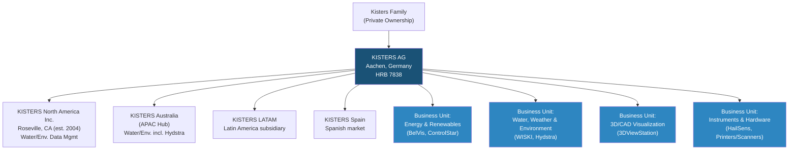
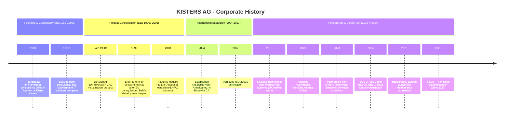
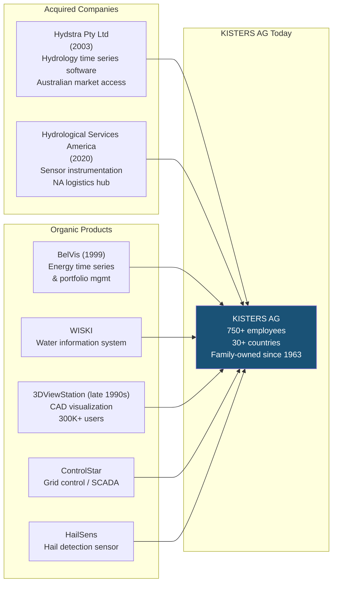

# KISTERS AG - Corporate History

**Research Date**: 2026-02-15
**Genealogy Confidence**: Medium (private family company; limited public financial/M&A disclosures)
**Parent Profile**: [kisters-belvis.md](kisters-belvis.md)

## Current Ownership & Key Parties

| Stakeholder | Role | Stake % | Type | Since | Source |
|---|---|---|---|---|---|
| Klaus Kisters (founder) | CEO & Owner | Undisclosed (controlling) | Founder / Family | 1963 | kisters.eu, Crunchbase, RocketReach |
| Kisters Family | Shareholders | Undisclosed (majority assumed) | Family | 1963 | kisters.eu ("family company") |

KISTERS AG is a privately held, family-owned Aktiengesellschaft (AG). No external investors, PE firms, or institutional shareholders have been identified. The company has never taken external funding rounds or gone public. Klaus Kisters, the founder, remains CEO after 60+ years.

**Key Management Team**:

| Name | Role | Division | Background | Source |
|---|---|---|---|---|
| Klaus Kisters | CEO / Founder | Corporate | Founded company in 1963, still active | Crunchbase, kisters.eu |
| Frank Skodzik | CFO | Corporate | Finance leadership | RocketReach |
| Dr. Markus Probst | Head of Energy Division | Energy & Renewables | Leads BelVis product family, E-world spokesperson | kisters.eu |
| Volker Bühner | Head of Business Unit Energy | Energy & Renewables | Energy business unit leadership | RocketReach |
| Anna Wall | Director of Global Marketing | Corporate | Marketing leadership | RocketReach |
| Edgar Wetzel | Global Head of Product Mgmt (Instrumentation) | Hydromet | Hardware/sensor product management | RocketReach |

**Board of Directors**: Not publicly disclosed. As a private AG, KISTERS has a Vorstand (executive board) and Aufsichtsrat (supervisory board) per German corporate law, but membership is not published externally.

**Corporate Structure** (Mermaid diagram):



KISTERS is a single-entity private company with no sister companies under a PE umbrella. The diversified business unit structure (energy, water, 3D visualization, hardware) is all contained within one corporate entity, providing financial cross-subsidization.

## Origin Story

| Data Point | Value | Source | Confidence |
|---|---|---|---|
| Founded | 1963 | kisters.eu, Crunchbase | Confirmed |
| Original Name | KISTERS (engineering office) | kisters.eu company profile | Confirmed |
| Founder | Klaus Kisters | kisters.eu, Crunchbase | Confirmed |
| Original Mission | Environmental consultancy and engineering | kisters.eu company profile PDF | Confirmed |
| Original Product | Environmental consulting services | kisters.eu ("founded as environmental consultancy office") | Confirmed |
| First Market | Germany / Aachen region | kisters.eu | Confirmed |
| Incorporated As | Aktiengesellschaft (AG) | Handelsregister HRB 7838, Aachen | Confirmed |

KISTERS was founded in 1963 by Klaus Kisters as an environmental consultancy office in Aachen, Germany. The company started as a German engineering firm focused on environmental data collection and consulting. Over the following decades, it evolved from pure consultancy into an IT and software development company, adding hardware (sensors, printers) and software products for environmental monitoring and data management. The founder remains CEO 60+ years later, making this one of the longest founder-led companies in the European energy software space.

## Corporate Identity Changes

| # | Date | From | To | Reason | Source |
|---|---|---|---|---|---|
| - | - | - | - | No corporate name changes identified | Multiple sources |

KISTERS has maintained the same corporate name since founding in 1963. The company has never undergone a corporate rebrand or name change, which is notable given its 60+ year history. Product brands (BelVis, WISKI, 3DViewStation, ControlStar, HailSens) operate under the KISTERS corporate umbrella.

## Mergers & Acquisitions Timeline

### Acquisitions Made (as buyer)

| Date | Target Company | Deal Value | What Was Gained | Integration Outcome | Source |
|---|---|---|---|---|---|
| 2003-12 | Hydstra Pty Ltd (Australia) | Undisclosed (asset sale) | Hydrology time series data management software; Australian market presence; government agency customers | Integrated as KISTERS product; Hydstra brand maintained; formed basis of KISTERS Australia APAC hub | ACCC Public Register |
| 2020-08 | Hydrological Services America (HSA) | Undisclosed | Instrumentation competency center for North America; hardware (sensors, telemetry); logistics hub; hydromet/water quality monitoring capabilities | Integrated into KISTERS Group; all staff retained under CEO Peter Ward; became NA instrumentation center | kisters.net press release |

Both acquisitions strengthened KISTERS' water/environmental monitoring business (not the energy division). The Hydstra acquisition (2003) was pivotal in establishing KISTERS' presence in Australia and the Asia-Pacific region. The HSA acquisition (2020) added hardware and instrumentation capabilities in North America, completing a sensor-to-software value chain.

### Acquired By (as target)

| Date | Acquiring Company | Deal Value | Strategic Rationale | Source |
|---|---|---|---|---|
| - | - | - | KISTERS has never been acquired. Remains founder-owned and independent since 1963. | Multiple sources |

## Investment & Financial Events

| Date | Event Type | Details | Investors/Counterparty | Investor Type | Amount | Source |
|---|---|---|---|---|---|---|
| 1963 | Founding | Founded as environmental consultancy office in Aachen | Klaus Kisters (founder) | Founder / Self-funded | Undisclosed | kisters.eu |
| Unknown | Incorporation as AG | Converted to Aktiengesellschaft (joint-stock company) | Kisters family | Family | Undisclosed | Handelsregister HRB 7838 |

KISTERS has never taken external investment, venture capital, or private equity funding. No IPO, no funding rounds, no PE buyouts. The company has been entirely self-funded through organic growth and retained earnings for 60+ years. This is a defining characteristic -- KISTERS is one of the few major energy software companies that has grown to 750+ employees without any external capital.

**Revenue**: Estimated at approximately $50M (per RocketReach/Ampliz estimates). Not independently confirmed as KISTERS does not publish financials.

## Splits, Spin-offs & Divestitures

| Date | Event Type | What Was Separated | Destination / Buyer | Reason | Source |
|---|---|---|---|---|---|
| - | - | - | - | No spin-offs, splits, or divestitures identified | Multiple sources |

KISTERS has maintained all business units under one corporate entity throughout its history. Despite operating in distinctly different markets (energy, water, 3D CAD, hardware), the company has never spun off or divested any division. This consolidation strategy contrasts sharply with peers like Volue (which divested non-core units) or ION Group (which assembled through acquisitions).

## Critical Events & Milestones

| Date | Event | Impact | Source |
|---|---|---|---|
| 1963 | Founded as environmental consultancy in Aachen, Germany | Established the company's DNA in environmental data | kisters.eu |
| ~1990s | Expansion into software development and IT solutions | Pivoted from pure consultancy to technology company | kisters.eu company profile |
| ~Late 1990s | Development of 3DViewStation CAD visualization | Created a second major business pillar (now 300K+ users, 3K+ companies) | 3dviewstation.com ("25 years experience") |
| 1998-04 | German Energy Act deregulation | Created the market opportunity for energy software | Bundesnetzagentur |
| 1999 | Entry into energy software market; BelVis development begins | Launched what would become KISTERS' flagship energy product family | kisters.eu, CTRM Center |
| 2003-12 | Acquisition of Hydstra Pty Ltd (Australia) | Established APAC presence; added hydrology software capabilities | ACCC Public Register |
| 2004 | Establishment of KISTERS North America Inc. (Roseville, CA) | Formal North American subsidiary for water/environmental market | ESRI partner page |
| 2017 | ISO 27001 certification achieved | Established security credentialing for cloud services | kisters.eu |
| 2018-01 | Strategic partnership with Everest Risk Systems (UK) | Entry into UK energy market; sales channel for BelVis/VPP/forecasting | CTRM Center |
| 2020-08 | Acquisition of Hydrological Services America (HSA) | Added sensor/instrumentation capabilities in North America | kisters.net |
| 2023-09 | Strategic partnership with GWS Grimm Water Solutions | Added AI-powered water analytics capabilities | kisters.eu |
| 2024-10 | SOC 2 Type 2 and BSI C5 Type 2 attestation achieved | Enterprise-grade cloud security certification for KISTERScloud | kisters.eu |
| 2025-02 | E-world 2025 -- showcased dynamic energy platform | Demonstrated evolving cloud-native strategy | kisters.eu |
| 2025-05 | HailSens360 European launch (Meteomatics partnership) | Expanded hardware product line into European weather/hail detection | meteomatics.com, kisters.eu |
| 2026-02 | E-world 2026 -- unveiled BelVis+ PFM platform | Major cloud platform pivot announcement; low-voltage grid digital twins | kisters.eu |
| 2026-06 | BelVis+ PFM official market launch (scheduled) | Cloud-based portfolio management for European energy trading | kisters.eu |

## Corporate Timeline (Visual)



## M&A Genealogy (Visual)



KISTERS is overwhelmingly an organic-growth company. Only 2 acquisitions in 60+ years, both in the water/environmental segment, not in energy. The BelVis energy product family, 3DViewStation, ControlStar, WISKI, and HailSens were all developed in-house.

## Corporate Timeline (Text Summary)

```text
1963    - Founded as environmental consultancy office in Aachen, Germany by Klaus Kisters
1990s   - Evolved from consultancy into IT/software company; began developing environmental data management platforms
Late 90s - Developed 3DViewStation CAD visualization product (now 25+ years old, 300K+ users)
1998    - German Energy Act deregulation opens energy software market
1999    - Entered energy software market; began developing BelVis time series and portfolio management platform
2003    - Acquired Hydstra Pty Ltd (Australia) - hydrology time series software, APAC market entry
2004    - Established KISTERS North America Inc. subsidiary in Roseville, California
~2010s  - Grew to 750+ employees across 30+ countries, 5 continents
2017    - Achieved ISO 27001 security certification for cloud services
2018    - Strategic partnership with Everest Risk Systems for UK energy market entry
2020    - Acquired Hydrological Services America (HSA) - sensors and instrumentation for North America
2023    - Strategic partnership with GWS Grimm Water Solutions for AI-powered water analytics
2024    - Achieved SOC 2 Type 2 and BSI C5 Type 2 cloud security attestation
2025    - Launched HailSens360 hail detection system across Europe (Meteomatics partnership)
2025    - E-world 2025: Showcased evolving cloud-native energy platform
2026    - E-world 2026: Unveiled BelVis+ PFM cloud portfolio management platform
2026    - BelVis+ PFM official market launch scheduled for June 2026
2026    - Current: ~750 employees, ~$50M revenue (est.), family-owned, Klaus Kisters still CEO
```

## Pattern Analysis

**Growth Strategy**: Overwhelmingly Organic. Only 2 small acquisitions in 60+ years, both in water/environmental (not energy). All core products developed in-house. This is rare among energy software companies of this size.

**Acquisition Pattern**: Capability + Market Access. Both acquisitions (Hydstra 2003, HSA 2020) were in the water/hydrology domain, acquiring software capabilities (Hydstra) and hardware/instrumentation (HSA) to build a sensor-to-software value chain. No acquisitions in the energy domain.

**Technology Evolution**: Consultancy (1963) -> Environmental Data Software (1990s) -> Energy Software / BelVis (1999) -> CAD Visualization / 3DViewStation (late 1990s) -> Grid Control / ControlStar -> Hardware / HailSens -> Cloud Platform / BelVis+ (2024-2026). The company has consistently added new technology layers while maintaining the old, resulting in a broad but potentially fragmented portfolio.

**Leadership Stability**: Extremely High (Founder-led). Klaus Kisters founded the company in 1963 and remains CEO in 2026 -- 63 years of continuous founder leadership. This is exceptional in the software industry. The company has never had a non-founder CEO. This brings stability but raises succession risk.

**Diversification Strategy**: KISTERS operates in 4+ distinct business domains (energy, water/environment, 3D CAD visualization, hardware/instruments) under one corporate entity. This is unusual for an energy software competitor and provides financial stability but may dilute focus on the energy business.

**Partnership Strategy**: Since ~2018, KISTERS has accelerated partnerships (Everest Risk Systems for UK, FlexPowerHub for balancing energy, GWS for AI water analytics, Meteomatics for hail detection) rather than acquisitions, suggesting a capital-light expansion approach consistent with private, self-funded ownership.

## Strategic Implications for Eneve

**What the history reveals about future direction**:
- KISTERS' BelVis+ PFM cloud launch (June 2026) is the company's most significant strategic pivot in its 60+ year history. After 25 years of on-premise BelVis, the cloud rewrite signals urgency to modernize before cloud-native competitors erode the installed base.
- The partnership-driven expansion model (UK via Everest, EU via FlexPowerHub) suggests KISTERS will expand BelVis+ geographically through channel partners rather than direct sales teams in new markets. This could mean a slower but more capital-efficient expansion into NL/BE markets.
- The self-funded, organic-growth model means KISTERS cannot match the investment velocity of VC/PE-backed competitors (tem raised $75M in a single round; KISTERS has raised $0 in external capital in 60 years).

**Inherited strengths from corporate history**:
- **60+ years of domain expertise**: Founded in 1963, the company has unmatched institutional knowledge in environmental and energy data management. This depth is difficult for startups to replicate.
- **750+ energy company installed base**: Built organically over 25 years since 1999, this customer base provides recurring revenue, upsell opportunities for BelVis+ PFM, and deep market intelligence.
- **Diversified revenue streams**: Water/environmental, 3D visualization, and hardware divisions provide financial stability even if energy growth slows. KISTERS doesn't depend solely on energy software revenue.
- **No debt, no investors**: Complete strategic independence. No PE firm pressuring for exits, growth-at-all-costs, or portfolio consolidation. KISTERS can play a long game.
- **Security certifications**: ISO 27001 (since 2017), SOC 2 Type 2, BSI C5 Type 2 give enterprise credibility for cloud services.

**Inherited weaknesses / risks from corporate history**:
- **Founder-dependency risk**: Klaus Kisters has led the company for 63 years with no visible succession plan disclosed publicly. A leadership transition could destabilize the organization.
- **Late cloud pivot**: BelVis was on-premise for 25 years (1999-2024). The BelVis+ PFM cloud rewrite launching in June 2026 puts KISTERS years behind cloud-native competitors (Engrate, Previse, Molecule). Migration friction from 750+ on-premise customers to cloud could be enormous.
- **Diluted focus**: Operating 4+ business divisions (energy, water, 3D CAD, hardware) with ~750 employees means the energy division likely has only 150-250 people. Focused competitors like SOPTIM (377 employees, 100% energy) may outpace KISTERS in energy-specific innovation.
- **No M&A muscle in energy**: Zero acquisitions in the energy domain in 60 years. If the market enters a consolidation phase, KISTERS' self-funded model cannot compete with PE-backed acquirers.
- **DACH concentration**: Primary energy market is Germany/Austria/Switzerland. Expansion into NL (Eneve's home market) would require significant localization of protocols, regulations, and market communication -- something KISTERS' partnership model has not yet demonstrated.

**M&A prediction**: KISTERS is unlikely to be acquired (founder-owned AG with no external pressure to sell) and unlikely to make major acquisitions (self-funded, capital-conservative). The most likely scenario is continued partnership-based expansion. However, upon succession (when Klaus Kisters steps down), the company could become an acquisition target for larger environmental/energy conglomerates seeking a 750-customer installed base. Potential acquirers could include Hitachi Energy, Siemens, or a PE roll-up fund targeting European energy software.
