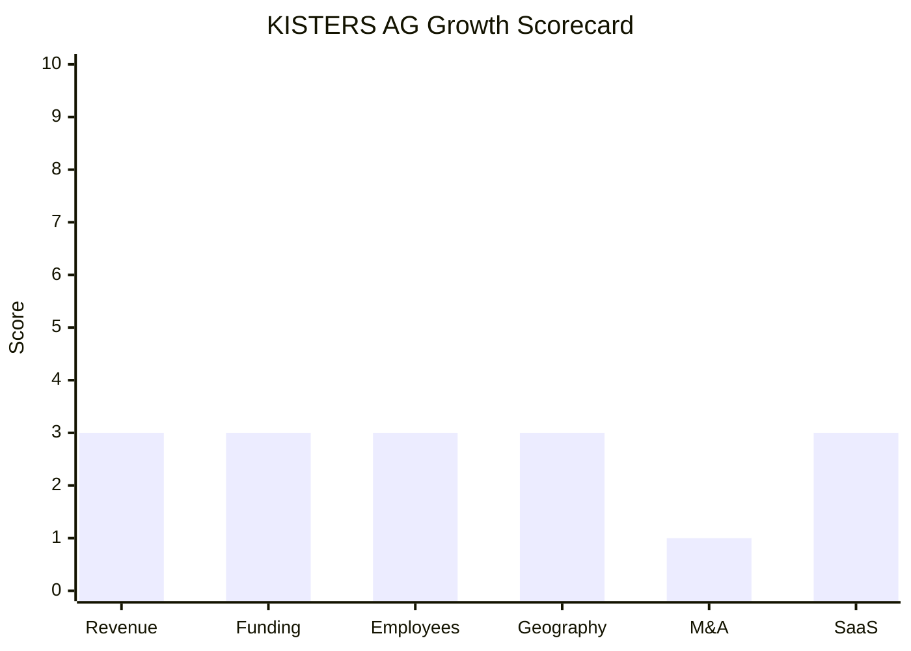

# Financial & Growth Deep-Dive - KISTERS AG

**Research Date**: 2026-02-15
**Data Availability**: Low (private family company; no public financials, no external funding rounds, no stock exchange filings)

**Company Type**: Private / Bootstrapped (Path D: Opaque)
**Research Approach**: Proxy metrics (employee count x industry averages), third-party estimates (RocketReach, Ampliz), government registry pointers (Bundesanzeiger HRB 7838), and product/partnership signals. Revenue and profitability data is almost entirely estimated.

---

### Revenue Timeline

| Year | Revenue | Currency | EUR Equivalent | YoY Growth | Source | Confidence |
| --- | --- | --- | --- | --- | --- | --- |
| 2026 (est.) | ~EUR 80-120M | EUR | ~EUR 80-120M | Unknown | Proxy: 750 employees x EUR 107-160K/employee | Estimated (proxy) |
| 2025 | ~EUR 75-115M | EUR | ~EUR 75-115M | Unknown | Proxy estimate, no disclosed figures | Estimated (proxy) |
| 2024 | ~EUR 70-110M | EUR | ~EUR 70-110M | Unknown | Proxy estimate | Estimated (proxy) |
| 2023 | ~EUR 65-105M | EUR | ~EUR 65-105M | Unknown | Proxy estimate | Estimated (proxy) |
| 2022 | ~EUR 60-100M | EUR | ~EUR 60-100M | Unknown | Proxy estimate | Estimated (proxy) |
| 2021 | ~EUR 55-95M | EUR | ~EUR 55-95M | Unknown | Proxy estimate | Estimated (proxy) |

**Revenue CAGR (3yr)**: Unknown (no disclosed revenue data)
**Revenue CAGR (5yr)**: Unknown

**Proxy Methodology**:
- RocketReach/Ampliz estimate: ~$50M (~EUR 46M). This likely undercounts -- a 750-employee company with software, hardware, and consulting divisions typically generates EUR 80-120M.
- European software company benchmark: EUR 150-250K revenue per employee for pure software. KISTERS is diversified (software + hardware + consulting + environmental monitoring), so EUR 107-160K per employee is a reasonable lower range.
- The wide range reflects genuine uncertainty: the lower bound uses the RocketReach estimate scaled up for recent growth, the upper bound uses the employee-count proxy.
- KISTERS North America subsidiary alone generates ~$2M with 20 employees (Growjo), suggesting the bulk of revenue is in European operations.

**Key Observation**: KISTERS does not publish financials. As a German AG, it files with the Bundesanzeiger (Handelsregister HRB 7838, Amtsgericht Aachen), but these filings are not freely accessible online. Revenue data remains opaque.

#### Revenue Trend Chart

Not generated -- fewer than 2 confirmed data points exist.

### Profitability

| Data Point | Value | Source | Confidence |
| --- | --- | --- | --- |
| EBITDA (current) | Unknown | No public data | Unknown |
| EBITDA Margin | Unknown | No public data | Unknown |
| Net Profit / Loss | Profitable (implied) | 60 years self-funded, no external capital | Estimated |
| Recurring Revenue % | Unknown (<30% est.) | On-premise dominant; cloud just launching | Estimated |
| SaaS Revenue % | Unknown (<10% est.) | BelVis+ PFM launching June 2026 | Estimated |
| Revenue per Employee | EUR 61-160K (range) | Low: $50M/750; High: EUR 120M/750 | Estimated |

**Key Observation**: KISTERS has survived and grown for 60+ years without external capital, implying consistent profitability. However, the margin profile of a diversified company (software + hardware + consulting + environmental monitoring) is likely lower than pure-play SaaS competitors. The company's ability to self-fund a major cloud rewrite (BelVis+ PFM) suggests healthy cash generation.

### Funding & Investment History

| Date | Round | Amount | Lead Investor(s) | Valuation | Source | Confidence |
| --- | --- | --- | --- | --- | --- | --- |
| 1963 | Founding | Undisclosed | Klaus Kisters (founder) | N/A | kisters.eu | Confirmed |
| Never | No external rounds | EUR 0 | N/A | N/A | Crunchbase, multiple sources | Confirmed |

**Total Raised**: EUR 0 (zero external capital in 60+ years)
**Latest Valuation**: Not applicable (private, never valued externally)
**Current Investors**: Kisters family (100% ownership assumed)
**War Chest Signals**: Unknown. As a profitable private company, KISTERS likely has retained earnings, but the scale of available capital for M&A or major investments is unknown. The self-funded BelVis+ PFM cloud rewrite suggests meaningful R&D budget, but nothing approaching the $75M tem raised in a single round.

**Key Observation**: KISTERS is one of the very few 750+ employee energy software companies globally that has never taken a single euro of external capital. This is both a strength (complete strategic independence, no investor pressure) and a constraint (cannot match investment velocity of VC/PE-backed competitors).

### Employee Timeline

| Year | Headcount | YoY Growth | Source | Confidence |
| --- | --- | --- | --- | --- |
| 2026 (current) | 750+ | ~0% | kisters.eu company profile | Confirmed |
| 2025 | ~750 | ~0% | kisters.eu, consistent across sources | Estimated |
| 2024 | ~750 | Unknown | Company profile PDF (May 2024) states 750 | Confirmed |
| 2023 | ~700-750 | Unknown | No historical data; interpolated | Estimated |
| 2022 | ~650-700 | Unknown | No historical data; interpolated | Estimated |
| 2021 | ~600-700 | Unknown | No historical data; interpolated | Estimated |

**Employee CAGR (3yr)**: ~0-5% (estimated; company has been at "750+" for at least 2-3 years)
**Current Open Positions**: 13 (LinkedIn, Feb 2026) -- of which 0 explicitly AI/ML (1 Data Scientist role in HydroMet, not energy)
**Hiring Hotspots**: Aachen (Germany), Schwerin (Germany) -- predominantly German operations
**Key Hires**: No recent C-level or VP hires announced publicly

**Key Observations**:
- The 750+ figure has been consistent across multiple years of company materials, suggesting headcount is stable rather than rapidly growing.
- Only 13 open positions for a 750-person company indicates modest replacement hiring, not aggressive expansion.
- Zero AI/ML/Data Science roles in the energy division (the one Data Scientist role is in HydroMet/water division).
- Crunchbase lists 501-1,000 employee range; RocketReach shows 333 (likely outdated or partial count). The company's own figure of 750+ is the most reliable.
- Conflicting third-party counts (Ampliz: 500+; RocketReach: 333) suggest some sources only track German employees or specific subsidiaries.

#### Employee Growth Chart

Not generated -- fewer than 2 confirmed year-specific data points exist.

### Geographic & Market Expansion

| Year | Expansion Event | Details | Source | Confidence |
| --- | --- | --- | --- | --- |
| 2025 | HailSens360 European launch | Meteomatics partnership; hail detection across Europe (non-energy) | meteomatics.com | Confirmed |
| 2024 | KISTERScloud security certifications | SOC 2 Type 2 + BSI C5 Type 2 achieved; enables EU enterprise cloud sales | kisters.eu | Confirmed |
| 2023 | GWS Grimm Water Solutions partnership | AI water analytics partnership (non-energy) | kisters.eu | Confirmed |
| 2020 | HSA acquisition (North America) | Added instrumentation/hardware capabilities in NA (non-energy) | kisters.net | Confirmed |
| 2018 | Everest Risk Systems partnership (UK) | BelVis sales channel into UK energy market | CTRM Center | Confirmed |

**International Revenue %**: Unknown (not disclosed)
**Expansion Trajectory**: KISTERS operates in 30+ countries across 5 continents, but this footprint was built over decades. Recent expansion (2022-2026) has been partnership-driven rather than through new offices or direct market entry. The BelVis+ PFM cloud platform (June 2026) is positioned for "European energy trading" broadly, which could signal a push beyond the DACH core into NL, BE, and other EU markets -- but this hasn't materialized yet.

**Key Observation**: No new country entries in the last 3 years for the energy division. Expansion events are predominantly in water/environmental (Meteomatics, GWS, HSA) or through partnerships (Everest for UK, FlexPowerHub for balancing). The energy division's geographic footprint has been essentially static.

### M&A Activity

| Date | Target | Deal Size | Capability Gained | Strategic Rationale | Source | Confidence |
| --- | --- | --- | --- | --- | --- | --- |
| 2020-08 | Hydrological Services America (HSA) | Undisclosed | NA instrumentation, sensors, logistics hub | Complete sensor-to-software value chain in water | kisters.net | Confirmed |
| 2003-12 | Hydstra Pty Ltd (Australia) | Undisclosed | Hydrology time series software, APAC market | Enter Australian/APAC water market | ACCC Register | Confirmed |

**Divestitures**: None (KISTERS has never divested any division in 60+ years)
**M&A Pattern**: Extremely conservative. Only 2 acquisitions in 60+ years, both in water/environmental domain, not energy. Zero energy-domain M&A ever. The company's organic-growth-only approach in energy is a defining characteristic that limits capability acceleration compared to acquisition-active competitors (Volue: 5+ acquisitions in 3yr; ION: serial acquirer).

### SaaS Transition Metrics

| Data Point | Value | Source | Confidence |
| --- | --- | --- | --- |
| Deployment Model | On-premise dominant, transitioning to hybrid/cloud | kisters.eu, E-world announcements | Confirmed |
| Cloud Revenue % (current) | Unknown (<10% est.) | BelVis+ PFM not yet launched | Estimated |
| Cloud Revenue % (1yr ago) | Unknown (<5% est.) | On-premise BelVis was the only offering | Estimated |
| Cloud Revenue % (2yr ago) | Unknown (~0%) | No cloud energy product existed | Estimated |
| Recurring Revenue % | Unknown (<30% est.) | License + maintenance model dominant | Estimated |
| Platform Stack | KISTERScloud (ISO 27001, SOC 2, BSI C5); BelVis+ PFM = modern cloud-native | kisters.eu | Confirmed |
| Migration Status | In-progress (BelVis+ PFM launching June 2026) | kisters.eu, E-world 2026 | Confirmed |

**Key Observations**:
- BelVis has been on-premise for 25 years (1999-2024). The BelVis+ PFM cloud rewrite is the single most significant strategic pivot in KISTERS' history.
- The cloud security certifications (ISO 27001 since 2017, SOC 2 Type 2 and BSI C5 Type 2 since 2024) show deliberate enterprise cloud preparation.
- The FlexPowerHub AI partnership demonstrates KISTERS is aware of the AI imperative but is partnering rather than building AI capabilities in-house.
- Migration of 750+ on-premise energy customers to cloud will be a multi-year effort. The June 2026 launch is the beginning, not the completion, of this transition.
- No disclosed recurring revenue metrics, ARR, or cloud adoption rates.

---

### Growth Scorecard

| Dimension | Score (1-10) | Evidence Summary |
| --- | --- | --- |
| Revenue Growth | 3 | No disclosed revenue data; 60-year organic-growth company; estimated <10% CAGR based on stable headcount and private company profile |
| Funding Momentum | 3 | Zero external capital in 60+ years; self-funded through profitability; complete strategic independence but limited investment velocity |
| Employee Growth | 3 | Stable at ~750 for multiple years; 13 open positions; ~0-5% estimated CAGR; no aggressive hiring signals |
| Geographic Expansion | 3 | Already in 30+ countries but no NEW energy market entries in last 3yr; DACH core; partnerships for UK; BelVis+ PFM targets broader EU (future) |
| M&A Activity | 1 | 2 acquisitions in 60 years, both in water not energy; zero energy-domain M&A ever; organic-only growth model |
| SaaS Maturity | 3 | On-premise dominant since 1999; BelVis+ PFM cloud launching June 2026; likely <10% cloud revenue; early transition stage |
| **COMPOSITE SCORE** | **2.7** | **Classification: Dinosaur** |

**Classification Thresholds**:

- **Rocket** (avg 7.0-10.0): Explosive growth, heavy investment, market disruptor
- **Riser** (avg 5.0-6.9): Strong growth signals, investing in future, accelerating
- **Steady** (avg 3.0-4.9): Stable but not transforming, evolutionary
- **Dinosaur** (avg 1.0-2.9): Flat or declining, legacy mode, no visible investment

#### Growth Scorecard Radar

> The bar chart shows a remarkably flat profile at the low end (score 3) across 5 of 6 dimensions, with M&A as the clear floor at 1. This "flat low" fingerprint is characteristic of a stable, self-funded legacy company that is not actively investing in growth acceleration. The lack of any dimension scoring above 3 means there is no standout growth vector to drive the overall trajectory upward.

---

### Strategic Context: Dinosaur with a Pulse

While the Growth Scorecard classifies KISTERS as a "Dinosaur" (2.7/10), this deserves nuance:

**Why the score is appropriate**:
- Zero external funding, zero energy M&A, stable headcount, on-premise dominant, no new market entries -- by every measurable growth metric, KISTERS is in steady-state mode.
- The 2.7 composite is right at the Dinosaur/Steady boundary (3.0), reflecting a company that is not declining but not transforming either.

**Why KISTERS is more dangerous than the score suggests**:
- **750+ energy customers**: This massive installed base is a defensive moat. Even if KISTERS only converts 20-30% to BelVis+ PFM cloud, that's 150-225 cloud customers overnight.
- **BelVis+ PFM (June 2026)**: The cloud pivot, while late, is a real product with a real launch date. If execution is strong, the SaaS score could jump from 3 to 5-6 within 2 years.
- **Self-funded stability**: No investor pressure means KISTERS can execute the cloud transition at its own pace without quarterly earnings pressure.
- **Diversified revenue**: Water/environmental, 3D visualization, and hardware divisions provide financial cushion during the energy cloud transition.
- **Domain depth**: 25 years of BelVis development means deep energy domain knowledge embedded in the product.

**The succession wildcard**: Klaus Kisters (founder, CEO since 1963) is the single biggest variable. A leadership transition could trigger either: (a) modernization acceleration under new management, or (b) acquisition by a larger player seeking the 750-customer base.

**Eneve comparison**: Both KISTERS and Eneve are late to cloud, both have strong installed bases, both compete on domain depth rather than technology modernity. KISTERS' BelVis+ PFM launch (June 2026) makes it a direct competitive threat in the European energy trading space if it successfully extends beyond DACH. The key question: can a 63-year-old family company execute a cloud transformation faster than Eneve's C#/.NET migration?

---

*Research compiled: 2026-02-15*
*Data quality: Low (private company, no public financials)*
*Next update recommended: After BelVis+ PFM launch (June 2026) to assess cloud adoption metrics*
