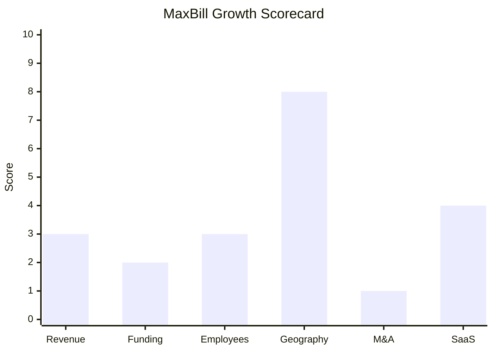

# Financial & Growth Deep-Dive - MaxBill (LogNet Systems)

**Research Date**: 2026-02-15
**Data Availability**: Low (private Israeli company; no public financials, no disclosed funding rounds post-2007, no annual reports available)

---

### Revenue Timeline

| Year | Revenue | Currency | EUR Equivalent | YoY Growth | Source | Confidence |
| --- | --- | --- | --- | --- | --- | --- |
| 2026 (est.) | Unknown | - | - | - | N/A | Unknown |
| 2025 | Unknown | - | ~EUR 10-12M (proxy) | Unknown | Proxy estimate | Estimated (proxy) |
| 2024 | ~$10.6M | USD | ~EUR 9.7M | Unknown | Owler | Estimated |
| 2023 | Unknown | - | - | - | N/A | Unknown |
| 2022 | Unknown | - | - | - | N/A | Unknown |
| 2021 | Unknown | - | - | - | N/A | Unknown |

**Revenue CAGR (3yr)**: Unknown (insufficient data)
**Revenue CAGR (5yr)**: Unknown (insufficient data)

**Revenue Estimation Methodology**:
- Owler estimates LogNet Systems (parent company, trading as MaxBill) at $10.6M revenue with an estimated range of $5-25M. This figure covers the entire LogNet Systems entity including both the MaxBill billing/CIS division and the WebGuru travel technology division.
- Proxy calculation: Using Tracxn's 51-200 employee estimate for MaxBill at EUR 150K revenue/employee yields EUR 7.5-30M. At the Owler midpoint (~150 employees for the billing division), this suggests EUR 10-15M for the MaxBill product line.
- For a company founded in 1996 (28+ years), $10.6M total revenue indicates a small-to-mid-size operation that has grown slowly relative to its age. The lack of disclosed financials and absence of funding rounds suggest the company is either modestly profitable (bootstrapped) or growth-constrained.

**Note**: No Mermaid revenue chart generated -- fewer than 2 confirmed data points exist.

---

### Profitability

| Data Point | Value | Source | Confidence |
| --- | --- | --- | --- |
| EBITDA (current) | Unknown | N/A | Unknown |
| EBITDA Margin | Unknown | N/A | Unknown |
| Net Profit / Loss | Unknown (likely modest profit given 28yr survival with no funding) | Inference | Estimated |
| Recurring Revenue % | Unknown (SaaS + enterprise license mix) | N/A | Unknown |
| SaaS Revenue % | Unknown (growing with AI Billing SaaS push) | N/A | Unknown |
| Revenue per Employee | ~EUR 53-97K (based on $10.6M / 100-200 employees) | Calculated from Owler + Tracxn | Estimated |

**Profitability Assessment**: Revenue per employee of EUR 53-97K is significantly below the software industry average of EUR 150-250K. This suggests either: (a) the Owler revenue figure understates actual revenue, (b) Owler employee counts overstate headcount, (c) significant services/implementation component dragging down per-employee revenue, or (d) the company operates at thin margins typical of billing/CIS implementation businesses. The 28-year survival without visible external funding post-2007 implies at least breakeven profitability.

---

### Funding & Investment History

| Date | Round | Amount | Lead Investor(s) | Valuation | Source | Confidence |
| --- | --- | --- | --- | --- | --- | --- |
| Jul 2007 | Strategic Investment | GBP 2M (~EUR 2.9M at 2007 rates) | Eurovestech plc | Implied ~GBP 7.9M (25.4% stake) | Investegate (Eurovestech announcement) | Confirmed |

**Total Raised**: ~EUR 2.9M (single round in 2007)
**Latest Valuation**: ~GBP 7.9M implied from 2007 Eurovestech stake (18 years ago; not current)
**Current Investors**: Eurovestech plc (~20.4% current stake per UK Companies House), Safari Atlantic Ltd (minority stake)
**War Chest Signals**: None visible. No cash on balance sheet disclosed, no undrawn facilities, no PE dry powder. Company appears self-funded from operations since 2007.

**Funding Assessment**: MaxBill/LogNet Systems has essentially been bootstrapped since a single GBP 2M strategic investment in 2007. No Series A, B, or growth equity rounds. No PE acquisition. No visible government grants. The Eurovestech investment was from a small UK-listed investment holding company focused on early-stage tech, not a tier-1 VC or growth PE fund. This positions MaxBill as a self-funded, organically growing company -- the opposite of the venture-backed "rockets" in this competitive landscape (tem: $75M, Previse: $52M+, Engrate: EUR 3M).

---

### Employee Timeline

| Year | Headcount | YoY Growth | Source | Confidence |
| --- | --- | --- | --- | --- |
| 2026 (current) | 51-200 (MaxBill) / ~502 (LogNet overall per Owler) | Unknown | Tracxn, Owler | Estimated |
| 2025 | 51-200 | Unknown | Tracxn (Jul 2024 snapshot) | Estimated |
| 2024 | 51-200 | Unknown | Tracxn | Estimated |
| 2023 | Unknown | - | N/A | Unknown |
| 2022 | Unknown | - | N/A | Unknown |
| 2021 | Unknown | - | N/A | Unknown |

**Employee CAGR (3yr)**: Unknown (insufficient historical data)
**Current Open Positions**: Low -- 1-3 visible positions (Product Owner on Djinni.co, primarily Ukraine-based)
**AI/ML Hiring**: Head of AI Programs role exists (Roni Rechter, internal appointment), no external AI/ML hiring surge visible
**Hiring Hotspots**: Ukraine (Kyiv -- development center), Czech Republic, Israel (R&D)

**Employee Data Discrepancy**: Owler reports 502 employees for LogNet Systems (parent), while Tracxn reports 51-200 for MaxBill specifically. IVC Online (Israel) reports ~90 employees. The discrepancy likely reflects: (a) Owler counting the entire LogNet group including WebGuru travel division, (b) Tracxn scoping to MaxBill billing product only, or (c) Owler's automated estimation being inflated. Best estimate for MaxBill billing division: **80-150 employees**, with core dev team in Ukraine (Kyiv) and offices in UK, Israel, Czech Republic.

**Note**: No Mermaid employee chart generated -- no multi-year trend data available.

---

### Geographic & Market Expansion

| Year | Expansion Event | Details | Source | Confidence |
| --- | --- | --- | --- | --- |
| 2025 | Saudi Arabia entry | New partnership for on-premises billing deployment | MaxBill 2025 blog | Confirmed |
| 2025 | Singapore entry | New partnership for enterprise billing in Southeast Asia | MaxBill 2025 blog | Confirmed |
| 2025 | Southeast Asia ISP | ISP deployment in Southeast Asian market | MaxBill 2025 blog | Confirmed |
| 2025 | Poland (CSIRE) | Partnership with Sygnity for Polish energy market, CSIRE integration | MaxBill blog, Sygnity announcement | Confirmed |
| 2025 | Baltics expansion | Onboarded top-3 Baltic energy + EV charging provider, 3-country billing | MaxBill 2025 blog | Confirmed |
| 2025 | EV Charging vertical | Dedicated EV Charging Billing Software launched (Oct 2025) | CBInsights | Confirmed |
| 2022 | UK water/heating | Tilix partnership for UK energy, water, and district heating billing | MaxBill blog (Jan 2022) | Confirmed |
| 2021 | Ukraine (YASNO) | Won YASNO, Ukraine's largest energy supplier (3.5M families) | MaxBill blog (Nov 2021) | Confirmed |
| Pre-2021 | Netherlands | Serving KPN, Caiway/DELTA Fiber, Infopact (telecom/ISP/multi-utility) | MaxBill success stories | Confirmed |
| Pre-2021 | UK (Shell Energy) | Shell Energy Retail billing and CRM deployment | MaxBill success stories | Confirmed |

**International Revenue %**: Unknown (not disclosed)
**Expansion Trajectory**: MaxBill is in an aggressive geographic expansion phase. In 2025 alone, the company entered 4+ new markets (Saudi Arabia, Singapore, Southeast Asia, Baltics) and deepened presence in Poland via Sygnity. However, this expansion is partner-led (local integrators) rather than direct office establishment, which limits capital requirement but also limits control. The expansion into Middle East and Asia marks a shift from European-centric operations.

---

### M&A Activity

| Date | Target | Deal Size | Capability Gained | Strategic Rationale | Source | Confidence |
| --- | --- | --- | --- | --- | --- | --- |
| Pre-2015 (est.) | MaxBill (billing platform) | Unknown | Convergent billing/CIS platform | LogNet Systems acquired MaxBill product/company to enter billing market | Investegate, Owler, Tracxn | Estimated |

**Divestitures**: None found
**M&A Pattern**: MaxBill/LogNet Systems has made no acquisitions in the last 5+ years and shows no M&A pipeline signals. The company's growth strategy is entirely organic + partnership-driven. No CEO interviews mention acquisition ambitions. The Eurovestech investment (2007) was a financial investment, not an acqui-hire. The only known M&A event is LogNet Systems' original acquisition of the MaxBill product (date unclear, estimated pre-2015).

---

### SaaS Transition Metrics

| Data Point | Value | Source | Confidence |
| --- | --- | --- | --- |
| Deployment Model | Hybrid: SaaS + Enterprise on-premises | maxbill.com/product, enterprise-deployment page | Confirmed |
| Cloud Revenue % (current) | Unknown | N/A | Unknown |
| Cloud Revenue % (1yr ago) | Unknown | N/A | Unknown |
| Cloud Revenue % (2yr ago) | Unknown | N/A | Unknown |
| Recurring Revenue % | Unknown (mix of SaaS subscriptions + enterprise licenses) | N/A | Unknown |
| Platform Stack | Java EE, Microprofile, Spring, Oracle, PostgreSQL, Cassandra, MongoDB, C++, JavaScript, CSS | Djinni.co job postings | Confirmed |
| Migration Status | Hybrid - AI Billing is SaaS-first; Enterprise on-prem still offered | maxbill.com/product/ai-billing | Confirmed |

**SaaS Assessment**: MaxBill operates a hybrid model. The newer AI Billing product is positioned as SaaS-first ("go live in days, no implementation project"), targeting SMB and new market entrants. However, enterprise clients (Shell Energy, YASNO, Baltic provider) likely use on-premises or private cloud deployments. The tech stack (Java EE, Oracle, C++) reflects a legacy architecture that has been incrementally modernized rather than rebuilt cloud-native. The 2025 blog specifically mentions "enterprise-grade SaaS being accessible for small and mid-size operators" -- suggesting SaaS is the growth channel while enterprise on-prem remains the revenue base.

The platform does NOT appear to be microservices/cloud-native architecture. Job postings reference Java EE and Microprofile (Jakarta EE ecosystem), which is mature enterprise Java -- not the Spring Boot/Kubernetes/cloud-native stack that true SaaS-first platforms use.

---

### Growth Scorecard

| Dimension | Score (1-10) | Evidence Summary |
| --- | --- | --- |
| Revenue Growth | 3 | Unknown CAGR; ~$10.6M after 28 years suggests slow historical growth; no disclosed revenue trajectory |
| Funding Momentum | 2 | Single GBP 2M round in 2007; no funding in 17+ years; self-funded/bootstrapped since |
| Employee Growth | 3 | Stable 51-200 range (Tracxn); minimal visible job openings; no hiring surge signals |
| Geographic Expansion | 8 | Entered 4+ new markets in 2025 (Saudi Arabia, Singapore, SE Asia, Baltics, Poland deepening) |
| M&A Activity | 1 | Zero acquisitions in 5+ years; no M&A pipeline signals; purely organic growth |
| SaaS Maturity | 4 | Hybrid model; AI Billing is SaaS; enterprise on-prem still dominant; Java EE legacy stack |
| **COMPOSITE SCORE** | **3.5** | **Steady -- geographic expansion masks otherwise flat growth metrics** |

**Classification**: **Steady** (avg 3.5, range 3.0-4.9)

MaxBill is a **Steady** competitor: a 28-year-old company with modest revenue, no external funding since 2007, stable (not growing) headcount, and no M&A activity. The one bright spot is aggressive geographic expansion (4+ new markets in 2025), but this is partner-led expansion requiring minimal capital investment rather than organic office/team growth. The AI branding is strong (marketing-led), but the underlying platform architecture (Java EE, Oracle, C++) and business fundamentals (low revenue/employee, no VC backing) suggest evolutionary rather than revolutionary growth.

**Key Contrast**: While MaxBill brands as "AI-native," its financial profile is that of a small, self-funded niche billing company -- the opposite of the well-capitalized AI-native rockets (tem: $75M funding, Previse: $52M+, Engrate: EUR 3M seed). The geographic expansion is the most notable financial signal, suggesting the company is trying to grow market reach without proportional investment.

**Classification Thresholds**:
- **Rocket** (avg 7.0-10.0): Explosive growth, heavy investment, market disruptor
- **Riser** (avg 5.0-6.9): Strong growth signals, investing in future, accelerating
- **Steady** (avg 3.0-4.9): Stable but not transforming, evolutionary
- **Dinosaur** (avg 1.0-2.9): Flat or declining, legacy mode, no visible investment

---

### Strategic Implications for Eneve

**Financial Threat Level**: **Low**

MaxBill's financial profile reveals a company whose marketing ambition significantly exceeds its capital backing. The "AI-native" branding creates an impression of a well-funded technology leader, but the reality is a ~$10.6M revenue company with no external funding since a GBP 2M investment in 2007, stable-to-flat headcount, and a legacy Java EE/Oracle tech stack.

**Where MaxBill Is Dangerous Despite Weak Financials**:
1. **Partner-led expansion**: Low-cost geographic growth via local integrators (Sygnity in Poland, unnamed partners in Saudi Arabia and Singapore) means MaxBill can establish presence in new markets without proportional capital investment
2. **SaaS entry wedge**: The "go live in days" AI Billing SaaS product could capture new market entrants (new energy retailers, EV charging CPOs) before they evaluate deeper back-office platforms like eBase
3. **AI narrative**: In RFP/procurement contexts, MaxBill's AI branding and Gartner recognition (2024 Market Guide Representative Vendor) carries weight regardless of underlying financials

**Where MaxBill Is Unlikely to Threaten**:
1. No capital for major R&D investment or acquisitions
2. No ability to compete on enterprise-scale implementations requiring large delivery teams
3. No pathway to building balancing/settlement/TSO communication capabilities (capital and domain expertise barrier)
4. Revenue per employee metrics suggest thin margins leaving little room for aggressive pricing

---

### Sources

- Owler: https://www.owler.com/company/lognet-systems
- Tracxn (MaxBill): https://tracxn.com/d/companies/maxbill/
- Tracxn (LogNet Systems): https://tracxn.com/d/companies/lognet-systems/
- CBInsights: https://cbinsights.com/company/maxbill
- Investegate (Eurovestech investment): https://www.investegate.co.uk/index.php/announcement/prn/eurovestech-plc--evt/investment-update/1189057
- Pomanda (LogNet Information Systems Limited): https://pomanda.com/company/05796595/lognet-information-systems-limited
- MaxBill 2025 Results Blog: https://maxbill.com/blog/maxbill-in-2025-from-results-to-even-more-value-in-2026-with-billing-built-to-perform/
- MaxBill About: https://maxbill.com/about/
- MaxBill Enterprise Deployment: https://maxbill.com/enterprise-deployment/
- MaxBill AI Billing: https://maxbill.com/product/ai-billing/
- Djinni.co (job postings): https://djinni.co/jobs/company-maxbill
- IVC Online (LogNet Israel): https://www.ivc-online.com/Google-Card?id=a18a4908-207a-e111-ac59-00155d32a403
- Startup Nation Central: https://finder.startupnationcentral.org/company_page/lognet
- MaxBill-Tilix Partnership: https://maxbill.com/blog/tilix-maxbill-billing-solution-for-water-and-district-heating-companies/
- MaxBill-Sygnity Partnership: https://maxbill.com/blog/maxbill-partners-up-with-sygnity/
- YASNO customer win: https://maxbill.com/blog/yasno-ukraine-biggest-energy-supplier-has-selected-maxbill-to-support-companys-strategic-digital-transformation/
- Shell Energy success story: https://maxbill.com/success-stories/shell-energy/
- Caiway success story: https://maxbill.com/success-stories/caiway/
