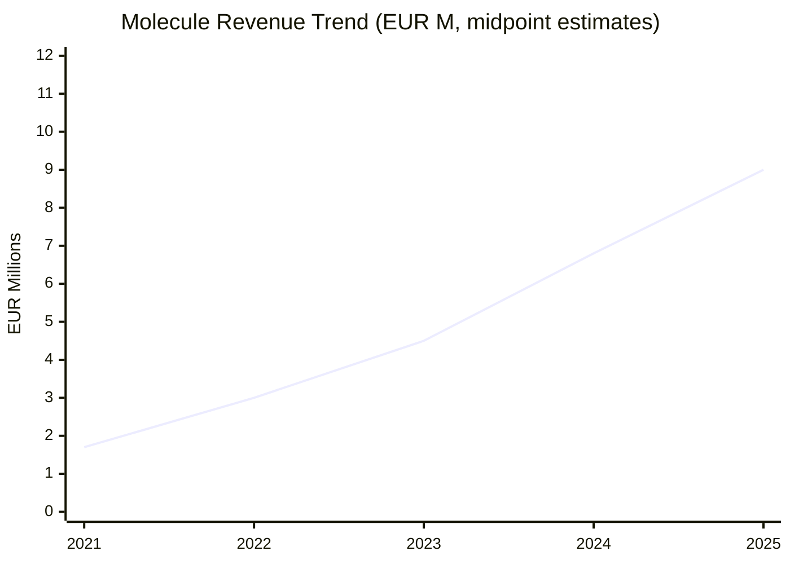
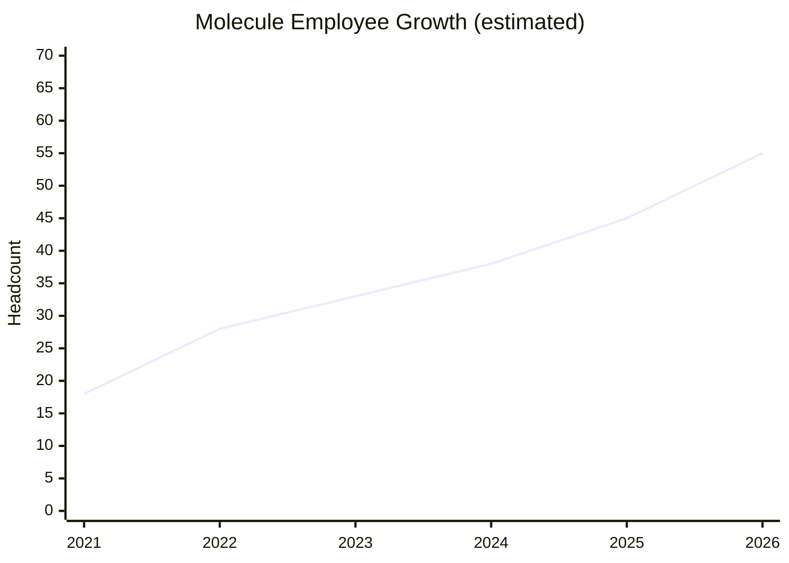
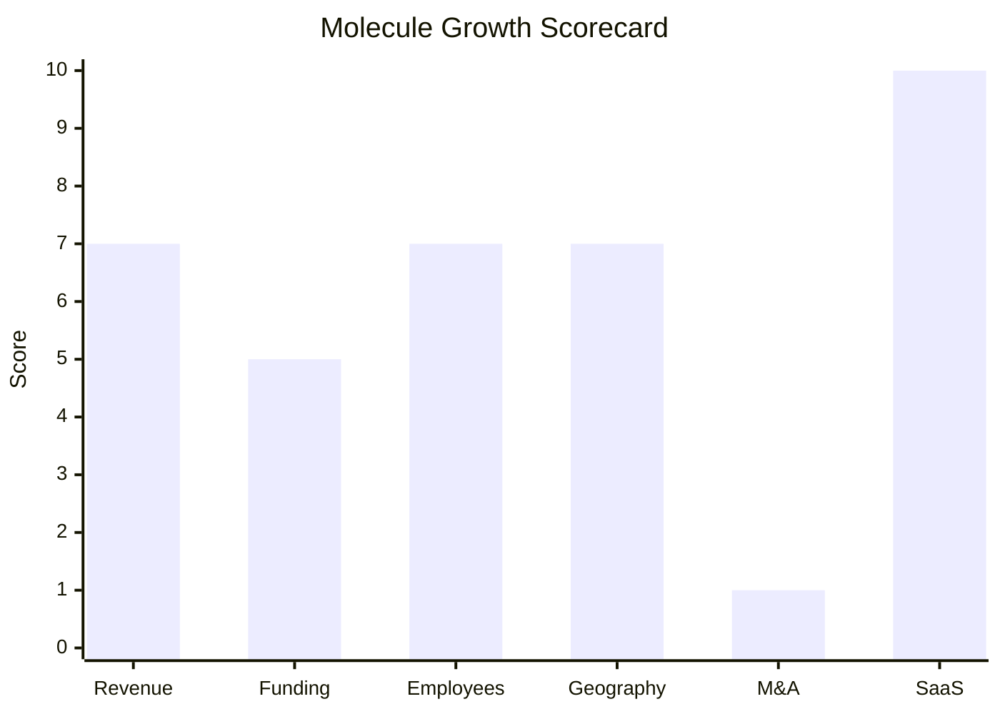

# Financial & Growth Deep-Dive - Molecule Software

**Research Date**: 2026-02-15
**Data Availability**: Medium (VC-funded private company; funding rounds well-documented via Crunchbase/press releases, revenue undisclosed, employee data from BuiltIn/LinkedIn/team page)

---

### Revenue Timeline

| Year | Revenue | Currency | EUR Equivalent | YoY Growth | Source | Confidence |
| --- | --- | --- | --- | --- | --- | --- |
| 2026 (est.) | $12-16M | USD | EUR 11-15M | +40-50% | Proxy (headcount x $250K-$350K) | Estimated (proxy) |
| 2025 | $8-12M | USD | EUR 7-11M | +40-50% | Proxy (headcount x $250K-$300K, Series B signals strong ARR) | Estimated (proxy) |
| 2024 | $6-9M | USD | EUR 5.5-8M | +40-50% | Proxy (headcount ~35-40, Chartis Top 10, expanding EU) | Estimated (proxy) |
| 2023 | $4-6M | USD | EUR 3.5-5.5M | +50-70% | Proxy (headcount ~30-35, 5M trades milestone, WGL win) | Estimated (proxy) |
| 2022 | $2.5-4M | USD | EUR 2.5-3.5M | +50-75% | Proxy (headcount ~25-30, post-Series A scaling) | Estimated (proxy) |
| 2021 | $1.5-2.5M | USD | EUR 1.3-2M | N/A | Proxy (headcount ~15-20, Series A closed May 2021) | Estimated (proxy) |

**Revenue CAGR (3yr, 2022-2025 midpoints)**: ~45% (estimated)
**Revenue CAGR (5yr)**: Not calculable (insufficient pre-2021 data)

**Estimation Methodology**: Molecule does not disclose revenue. Estimates use employee count proxy ($200K-$300K revenue/employee for SaaS ETRM), cross-referenced with funding milestones (Series B typically requires $5M+ ARR), customer win cadence (WGL 2023, Nuveen 2025), and Chartis Energy50 advancement (#15 in 2023 to Top 10 in 2024, implying revenue growth outpacing peers).

#### Revenue Trend Chart

---

### Profitability

| Data Point | Value | Source | Confidence |
| --- | --- | --- | --- |
| EBITDA (current) | Unknown (likely negative or breakeven) | No disclosure; typical for VC-funded growth-stage SaaS | Estimated |
| EBITDA Margin | Unknown | No disclosure | Unknown |
| Net Profit / Loss | Unknown (likely net loss, reinvesting for growth) | Typical for Series B SaaS company | Estimated |
| Recurring Revenue % | ~90-95% | Cloud-only SaaS model, subscription-based | Estimated (high confidence) |
| SaaS Revenue % | ~100% | Cloud-native from founding, no on-prem option | Confirmed |
| Revenue per Employee | ~EUR 200K-250K (estimated) | Proxy: midpoint revenue / headcount | Estimated |

---

### Funding & Investment History

| Date | Round | Amount | Lead Investor(s) | Valuation | Source | Confidence |
| --- | --- | --- | --- | --- | --- | --- |
| May 2012 | Seed | Undisclosed | Unknown (early backers) | Undisclosed | CB Insights | Confirmed (date) |
| Dec 2013 | Seed VC | Undisclosed | Mercury, Surge Ventures, Houston Angel Network | Undisclosed | CB Insights, FinSMEs | Confirmed |
| May 2021 | Series A | $12M (EUR ~10.2M) | Mercury (existing investor) | Undisclosed | Molecule press release, FinSMEs | Confirmed |
| Jul 2025 | Series B | $11.87M (EUR ~10.9M) | Sundance Growth | Undisclosed | CB Insights, Molecule press release, Sundance Growth | Confirmed |

**Total Raised**: $25.35M (EUR ~23M) across 5 rounds (CB Insights)
**Latest Valuation**: Undisclosed (Series B typically implies $50-100M+ for SaaS companies at this ARR stage, but no data available)
**Current Investors**: Mercury (seed + Series A lead), Sundance Growth (Series B lead), Surge Ventures, Houston Angel Network
**War Chest Signals**: $11.87M fresh capital (Jul 2025) earmarked for product innovation, team expansion, and global market entry. No debt financing disclosed. Sundance Growth is a software-focused growth equity firm, suggesting patient capital with operational expertise.

---

### Employee Timeline

| Year | Headcount | YoY Growth | Source | Confidence |
| --- | --- | --- | --- | --- |
| 2026 (current) | ~50-60 | +20-30% | Estimated (post-Series B hiring, VP Engineering role open) | Estimated |
| 2025 | ~40-50 | +15-25% | BuiltIn (31 listed), Molecule team page (~40+ named), Series B press | Estimated (medium) |
| 2024 | ~35-40 | +15-20% | Chartis Top 10 advancement, EU expansion staffing | Estimated |
| 2023 | ~30-35 | +15-25% | Q3 2023 blog (expanding Customer Success, sales, IT teams) | Estimated (medium) |
| 2022 | ~25-30 | +40-60% | Post-Series A scaling (Elektra/Hive development) | Estimated |
| 2021 | ~15-20 | N/A | Pre/post-Series A baseline | Estimated |

**Employee CAGR (3yr, 2022-2025)**: ~20-25% (estimated)
**Current Open Positions**: 3 visible (VP Engineering, Sales Engineer, Implementation Specialist)
**AI/ML/Data Science Roles**: 0 visible
**Hiring Hotspots**: Houston TX (HQ), Remote US (28 locations for Sales Engineer), EU/UK (implementation/support per press releases)
**Key Recent Hires**: Not publicly disclosed; Series B capital earmarked for team expansion

#### Employee Growth Chart

---

### Geographic & Market Expansion

| Year | Expansion Event | Details | Source | Confidence |
| --- | --- | --- | --- | --- |
| 2023 | EU production environment launched | Dedicated EU/UK hosting cluster on AWS for data residency/GDPR compliance | Molecule press release (Mar 2023) | Confirmed |
| 2023 | UK and EU sales/support staff | Hired EU- and UK-based sales, implementation, and support personnel | Molecule press release | Confirmed |
| 2025 | Canada customer presence | Customer base extends to Canada (referenced in Series B press) | Molecule Series B press release | Confirmed |
| 2025 | South America customer presence | Customer base extends to South America (referenced in Series B press) | Molecule Series B press release | Confirmed |
| 2025 | Nuveen (EU customer win) | Major global asset manager ($1.3T AUM) for renewable trading across US, Europe, Asia | Molecule/CTRMCenter press release (Jun 2025) | Confirmed |
| 2025 | Series B expansion mandate | Capital earmarked for "new global markets" expansion | Sundance Growth, Molecule press | Confirmed |

**International Revenue %**: Unknown (not disclosed). Customer base confirmed in US, UK, EU, Canada, South America.
**Expansion Trajectory**: Molecule is executing a deliberate US-outward expansion. After establishing the core US business (2012-2022), it planted infrastructure in EU/UK (2023), then won marquee international customers (WGL US 2023, Nuveen global 2025). Series B capital explicitly targets further global market entry. The pattern is organic geographic expansion rather than acquisition-driven.

---

### M&A Activity

| Date | Target | Deal Size | Capability Gained | Strategic Rationale | Source | Confidence |
| --- | --- | --- | --- | --- | --- | --- |
| N/A | None | N/A | N/A | N/A | N/A | Confirmed (no M&A) |

**Divestitures**: None
**M&A Pattern**: Molecule has pursued a purely organic growth strategy with zero acquisitions to date. Growth has been driven by internal product development (Elektra, Hive, Djinn modules) and hiring. The only external partnership is the Fidectus integration (Sep 2021) for post-trade processing, which is a technical integration, not an acquisition.
**M&A Outlook**: With $11.87M in Series B funding and Sundance Growth (software-focused growth equity) as lead investor, Molecule is positioned for potential tuck-in acquisitions, but no signals of imminent M&A activity. The company appears focused on organic product and market expansion.

---

### SaaS Transition Metrics

| Data Point | Value | Source | Confidence |
| --- | --- | --- | --- |
| Deployment Model | Cloud-native SaaS (from founding in 2012) | molecule.io, press releases | Confirmed |
| Cloud Revenue % (current) | ~100% | No on-prem option available | Confirmed |
| Cloud Revenue % (1yr ago) | ~100% | No on-prem option ever offered | Confirmed |
| Cloud Revenue % (2yr ago) | ~100% | Always cloud-only | Confirmed |
| Recurring Revenue % | ~90-95% (estimated) | SaaS subscription model | Estimated (high confidence) |
| Platform Stack | AWS (cloud hosting), Kubernetes, Docker, Ember.js, open-source contributions, REST APIs | molecule.io/platform/technology, GitHub repos | Confirmed |
| Migration Status | Complete (never on-prem; born cloud-native) | Company positioning since 2012 founding | Confirmed |

**SaaS Maturity Notes**: Molecule is one of the rare energy trading platforms that was cloud-native from inception (2012), predating the SaaS wave in ETRM by several years. This gives them a genuine architectural advantage: no legacy code migration debt, no hybrid complexity, no on-prem support burden. Their API-first architecture with 30+ exchange/GL/BI integrations demonstrates mature SaaS platform thinking. Open-source contributions (CME STP Adapter, Kubernetes utilities) signal engineering culture beyond typical ETRM vendors.

---

### Growth Scorecard

| Dimension | Score (1-10) | Evidence Summary |
| --- | --- | --- |
| Revenue Growth | 7 | Estimated ~45% CAGR (3yr) based on employee proxy and customer win acceleration; Chartis ranking jumped from #15 to Top 10 |
| Funding Momentum | 5 | $25.35M total raised ($11.87M Series B in 2025); solid but below EUR 50M threshold; Sundance Growth adds growth equity expertise |
| Employee Growth | 7 | Estimated ~20-25% CAGR (3yr) from ~28 to ~45; post-Series B hiring underway with VP Engineering open |
| Geographic Expansion | 7 | Entered EU/UK (2023) with dedicated production environment; customers in Canada and South America; Nuveen win spans US/EU/Asia |
| M&A Activity | 1 | Zero acquisitions in company history; purely organic growth; Fidectus partnership only external move |
| SaaS Maturity | 10 | Cloud-native from 2012 founding; 100% SaaS; AWS/Kubernetes; API-first; 30+ integrations; open-source contributor |
| **COMPOSITE SCORE** | **6.2** | **Riser -- Strong organic growth, cloud-native advantage, but limited funding scale and no M&A activity** |

**Classification**: **Riser** (avg 6.2, threshold 5.0-6.9)

Molecule shows strong growth signals driven by product excellence and cloud-native architecture, but is constrained by modest total funding ($25M vs. $75M+ for tem, $52M+ for Previse) and absence of M&A activity. The SaaS maturity score of 10 is the highest achievable -- Molecule is what legacy vendors are trying to become. The gap is in scale and investment firepower, not in technology or product direction.

#### Growth Scorecard Radar

> The bar chart reveals Molecule's distinctive profile: exceptional SaaS maturity (10) as a cloud-native-from-birth platform, balanced growth across revenue/employees/geography (all 7), but a critical gap in M&A activity (1) and moderate funding momentum (5). The M&A score drags the composite down -- if Molecule used its Series B capital for a strategic acquisition, the composite could jump to 7.0+ (Rocket territory). The company is a strong organic grower that hasn't yet leveraged the inorganic growth lever.

---

### Key Insights for Eneve

1. **Cloud-native authenticity**: Molecule didn't migrate to cloud -- they were born there (2012). This means zero legacy debt, which translates to faster feature delivery and lower operational costs. Eneve's ongoing C#/.NET migration means Molecule will maintain deployment speed advantage for years.

2. **Limited Eneve overlap (for now)**: Molecule is trading-focused (ETRM), not operations-focused (balancing, scheduling, TSO communication). However, EU expansion + Hive (renewables certificates) + dedicated EU production environments show intent to serve European energy operations beyond pure trading.

3. **Nuveen win is a signal**: Landing a $1.3T AUM global asset manager for renewable trading across US/EU/Asia demonstrates enterprise credibility. If institutional investors use Molecule for EU renewable certificate management, this encroaches on Eneve's adjacent space.

4. **Modest funding limits threat level**: At $25M total raised, Molecule is well-funded for organic growth but lacks the war chest for aggressive EU market penetration or acquisition-driven expansion. Compare: tem raised $75M, Previse $52M+. Molecule is a "slow burn" threat, not an imminent disruptor in Eneve's core market.

5. **Watch for**: NL-specific features (balancing, TSO integration), partnership with EU market operators, additional EU customer wins, hiring of EU energy operations domain experts, and any pivot from pure trading toward back-office operations.

---

**Sources Used**:
- molecule.io (press releases, blog, platform pages, team page)
- CB Insights (Molecule Software financials page)
- Sundance Growth (portfolio page, press release)
- FinSMEs (Series A funding report)
- Chartis Research (Energy50 2023, 2024 reports)
- GlobalData (2025 Power Technology Excellence Awards)
- CTRMCenter (Nuveen customer win coverage)
- BuiltIn (Molecule Software company profile)
- Mercury Fund (portfolio page)
