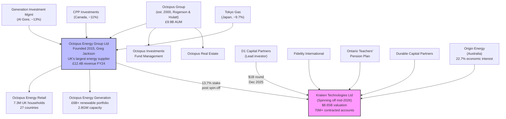
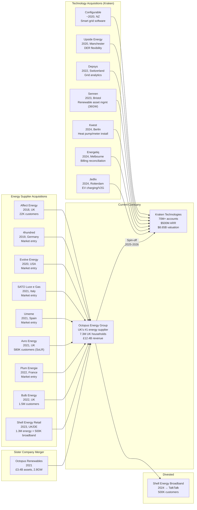

# Corporate History - Octopus Energy Group / Kraken Technologies

**Research Date**: 2026-02-16
**Genealogy Confidence**: High (well-funded, high-profile company with extensive public data; Companies House filings, annual reports, major press coverage of all funding rounds and acquisitions)

---

### Current Ownership & Key Parties

**Octopus Energy Group Limited** (pre-Kraken spin-off):

| Stakeholder | Role | Stake % | Type | Since | Source |
|---|---|---|---|---|---|
| Octopus Group (Rogerson/Hulatt) | Founding backer / Parent group | Undisclosed (majority) | Strategic / Corporate | 2015 | Wikipedia, Octopus Group |
| Origin Energy (Australia) | Strategic investor, AU license holder | ~22.7% economic interest | Strategic / Energy Utility | 2020 | Reuters, Brisbane Times |
| Generation Investment Management (Al Gore) | Major investor (~13% at peak) | ~13% | Strategic / Sustainable Investment | 2021 | Octopus press, FT |
| CPP Investments (Canada) | Major pension investor (~11%) | ~11% | Sovereign / Pension | 2022 | Reuters, Octopus press |
| Tokyo Gas | Strategic investor (9.7%) | ~9.7% | Strategic / Energy Utility | 2020 | Octopus press |
| Aware Super (Australia) | Pension investor | Undisclosed | Sovereign / Pension | 2024 | Brisbane Times |
| Greg Jackson (Founder) | Founder & CEO | Undisclosed | Founder | 2015 | Wikipedia |

**Kraken Technologies Ltd** (post spin-off, Dec 2025):

| Stakeholder | Role | Stake % | Type | Since | Source |
|---|---|---|---|---|---|
| D1 Capital Partners | Lead investor ($1B round) | Undisclosed (significant) | Hedge Fund / Growth Equity | 2025 | Reuters, ESG Today |
| Fidelity International | Investor | Undisclosed | Asset Management | 2025 | Reuters |
| Ontario Teachers' Pension Plan | Investor (via Teachers' Venture Growth) | Undisclosed | Sovereign / Pension | 2025 | Reuters |
| Durable Capital Partners | Investor | Undisclosed | Growth Equity | 2025 | Reuters |
| Origin Energy | Retained economic interest | ~22.7% | Strategic / Energy Utility | 2025 | Reuters, Origin filings |
| Octopus Energy Group | Retained stake post-demerger | ~13.7% | Strategic / Corporate | 2025 | Reuters, BBC |

**Board of Directors (Octopus Energy Group)**:

| Name | Role | Represents | Background | Source |
|---|---|---|---|---|
| Greg Jackson CBE | Founder & Group CEO | Founder | Serial tech entrepreneur, Cambridge economics, Time 100 Climate Leader, CBE 2024 | Wikipedia, Gov.uk |
| Stuart Jackson | Co-Founder & CFO | Co-Founder | Previously Barclays, co-founded retail financial services businesses (no relation to Greg) | octopus.energy |
| Simon Rogerson | Board Director | Octopus Group (parent) | Co-Founder & CEO of Octopus Group (est. 2000) | Companies House, Octopus Group |
| Chris Hulatt | Board Director | Octopus Group (parent) | Co-Founder of Octopus Group | Companies House, Octopus Group |

**Board of Directors (Kraken Technologies)**:

| Name | Role | Represents | Background | Source |
|---|---|---|---|---|
| Gavin Patterson | Chairman | Independent | Former CEO of BT Group | Wikipedia, kraken.tech |
| Amir Orad | CEO | Management | Ex-CEO Sisense (grew 17x), ex-CEO Nice Actimize, Columbia MBA | kraken.tech press |
| Tim Wan | CFO | Management | Ex-Asana (led IPO), Silicon Valley finance leader | kraken.tech press |

**Corporate Structure** (Mermaid diagram):



---

### Origin Story

| Data Point | Value | Source | Confidence |
|---|---|---|---|
| Founded | 5 August 2015 (launched to customers 2016) | Wikipedia, Companies House | Confirmed |
| Original Name | Octopus Energy Limited | Companies House | Confirmed |
| Founders | Greg Jackson (CEO), Stuart Jackson (CFO, no relation) | octopus.energy, Wikipedia | Confirmed |
| Backed By | Octopus Group (est. 2000 by Simon Rogerson, Chris Hulatt, Guy Myles) | Wikipedia, Octopus Group | Confirmed |
| Original Mission | Make clean, affordable energy accessible by leveraging technology and data to disrupt an industry lacking transparency and innovation | Canvas Business Model, The Guardian | Confirmed |
| Original Product | Retail energy supply with proprietary technology platform (later named "Kraken") | octopus.energy | Confirmed |
| First Market | UK domestic energy supply | octopus.energy | Confirmed |
| First Tariff | "Octopus 12M Fixed" (2016) | Canvas Business Model | Confirmed |
| Inspiration | Greg Jackson's personal experience growing up in a cold house and having energy supply cut off; frustration with legacy energy industry | The Guardian | Confirmed |
| Greg Jackson Background | Left school at 16 to program games; Cambridge economics; serial entrepreneur (C360 e-commerce, Consultant Connect telemedicine, angel investor in Zopa); multiple businesses employing 4-60 people before age 30 | Wikipedia, Gov.uk | Confirmed |

---

### Corporate Identity Changes

| # | Date | From | To | Reason | Source |
|---|---|---|---|---|---|
| 1 | 2015 | (new entity) | Octopus Energy Limited | Founded as energy retail startup within Octopus Group ecosystem | Companies House |
| 2 | ~2019 | Octopus Energy Limited | Octopus Energy Group Limited | Restructured as group entity to reflect multi-subsidiary structure (retail, generation, technology) | Companies House, Wikipedia |
| 3 | 2020 | Internal tech platform (unnamed) | "Kraken" (brand name for technology platform) | Named and branded the proprietary technology as a licensable product to third-party utilities | kraken.tech, press releases |
| 4 | Jul 2021 | Octopus Renewables (separate sister company) | Octopus Energy Generation (subsidiary of OEG) | Acquired sister company and rebranded as generation arm | Octopus press, FCA approval |
| 5 | Sep 2025 | Kraken (division of Octopus Energy Group) | Kraken Technologies Ltd (standalone company) | Spun off as independent company with own board, CEO, CFO; demerger to complete mid-2026 | BBC, Reuters, kraken.tech |

---

### Mergers & Acquisitions Timeline

#### Acquisitions Made (as buyer)

**Energy Supplier Acquisitions (Customer Base Growth)**:

| Date | Target Company | Deal Value | What Was Gained | Integration Outcome | Source |
|---|---|---|---|---|---|
| Aug 2018 | Affect Energy (UK) | Undisclosed (7-figure) | 22,000 customers (40K accounts); Shoreham-by-Sea indie supplier with 9.5/10 TrustPilot | Fully integrated into Octopus retail | Current News, Octopus Group |
| Sep 2019 | 4hundred (Germany) | Undisclosed | Munich-based green energy startup; entry into German market | Became Octopus Energy Germany | Sifted, Octopus press |
| 2020 | Evolve Energy (USA) | Undisclosed | US market entry via Texas-based retail supplier | Became Octopus Energy US operations | Tracxn |
| 2021 | SATO Luce e Gas (Italy) | Undisclosed | Italian retail energy customer base (~100K accounts across IT/ES/FR) | Became Octopus Energy Italy | Octopus FY22 accounts |
| 2021 | Umeme (Spain) | Undisclosed | Spanish retail energy customers | Became Octopus Energy Spain | Tracxn, Sifted |
| Sep 2021 | Avro Energy (UK, SoLR) | N/A (Ofgem appointment) | 580,000 domestic customers from collapsed supplier | Migrated to Octopus via Kraken by Apr 2022 | Ofgem, Reuters |
| 2022 | Plum Energie (France) | Undisclosed | French retail energy customer base | Became Octopus Energy France | Tracxn |
| Dec 2022 | Bulb Energy (UK, ETS) | Government-backed (Octopus paid to acquire) | 1.5M customers from UK's largest-ever energy supplier failure; completed migration in 6 months (record) | Fully integrated; 94% of Bulb employees joined Octopus | Octopus press, Solar Power Portal |
| Dec 2023 | Shell Energy Retail (UK/DE) | Undisclosed | 1.3M home energy customers UK + Germany; 500K broadband customers | Migrated in 2 months (new record); made Octopus UK's #1 electricity supplier | Octopus press, Reuters |

**Technology & Capability Acquisitions (Kraken Platform)**:

| Date | Target Company | Deal Value | What Was Gained | Integration Outcome | Source |
|---|---|---|---|---|---|
| ~2020 | Configurable (New Zealand) | Undisclosed | Smart grid software capabilities | Integrated into Kraken platform | Sifted |
| Nov 2020 | Upside Energy (Manchester, UK) | Undisclosed | Energy flexibility software (EV, heat pump, battery optimization); established Manchester EnTech hub | Became core of Kraken flexibility/DER capabilities | Octopus press |
| 2022 | Depsys (Switzerland) | Undisclosed | Grid analytics, real-time monitoring, low-voltage network management | Integrated into Kraken platform | Sifted |
| Dec 2023 | Sennen (Bristol, UK) | Undisclosed | Renewable asset management software (offshore wind, solar, batteries); 25 staff | Increased Kraken managed generation from 6.5GW to 36GW across 12 countries | Octopus press, City AM |
| Jan 2024 | Kwest (Berlin, Germany) | Undisclosed | Heat pump and smart meter installation management software | Integrated into Kraken field operations | Sifted |
| Jul 2024 | Energetiq (Melbourne, Australia) | Undisclosed | Network billing reconciliation (dominant in AU market); founded 1998 | Team relocated to Kraken AU HQ; expanding globally | Octopus press, UK Tech News |
| Oct 2024 | Jedlix (Rotterdam, Netherlands) | Undisclosed | Smart/bidirectional EV charging platform; OEM partnerships (Renault, Polestar, Kia, Hyundai) | Established Kraken Rotterdam hub; V2G capabilities | EV Infrastructure News, kraken.tech |

**Generation Acquisition (Sister Company Merger)**:

| Date | Target Company | Deal Value | What Was Gained | Integration Outcome | Source |
|---|---|---|---|---|---|
| Mar-Jul 2021 | Octopus Renewables (sister company) | Intra-group (FCA-approved) | £3.4B renewable assets; 300+ solar/wind/biomass projects; 2.8GW capacity across 6 countries | Became Octopus Energy Generation; CEO: Zoisa North-Bond | Reuters, Octopus press, FCA |

#### Acquired By (as target)

Octopus Energy Group has never been acquired. It remains independent, backed by its founding parent Octopus Group and a syndicate of strategic and institutional investors.

---

### Investment & Financial Events

| Date | Event Type | Details | Investors/Counterparty | Investor Type | Amount | Source |
|---|---|---|---|---|---|---|
| 2015 | Founding | Seed investment from Octopus Group | Octopus Group (Rogerson/Hulatt) | Corporate / Parent | Undisclosed | Wikipedia |
| Apr 2020 | Strategic Investment | Origin Energy acquires 20% stake; Octopus reaches "unicorn" status (€1.5B valuation) | Origin Energy (Australia) | Strategic / Utility | ~€330M | Octopus press, Reuters |
| 2020 | Strategic Investment | Tokyo Gas invests for 9.7% stake; partnership for Japan expansion | Tokyo Gas (Japan) | Strategic / Utility | $200M | Octopus press |
| 2020 | Follow-on | Origin Energy increases stake | Origin Energy | Strategic / Utility | $47M | Octopus press |
| 2021 | Major Investment | Generation Investment Management takes ~13% stake; one of largest investments in GIM history | Generation Investment Management (Al Gore) | Sustainable / Strategic | $600M (over time) | Octopus press, FT |
| Jul 2022 | Fundraise | $550M fundraise; $325M from existing shareholders + $225M CPP commitment for renewables integration | CPP Investments, Origin Energy, Generation IM | Pension / Strategic | $550M | Octopus press |
| Dec 2023 | Major Fundraise | £625M from existing investors; valuation £5.6B (60% increase since Dec 2021) | CPP Investments (£300M), Origin Energy (£280M), Generation IM (£45M) | Pension / Strategic | ~$800M | Reuters |
| Jan 2024 | Follow-on | Additional $370M; valuation reaches $9B | Generation IM, CPP Investments, Aware Super, unnamed US pension fund | Pension / Strategic / Institutional | $370M | Brisbane Times, Wikipedia |
| Dec 2025 | Kraken Standalone Round | $1B raised for Kraken spin-off at $8.65B valuation; $850M to Octopus Energy, $150M retained in Kraken | D1 Capital Partners (lead), Fidelity, Ontario Teachers', Durable Capital | Hedge Fund / Asset Mgmt / Pension | $1B | Reuters, BBC, ESG Today |
| Dec 2025 | Additional Injection | $320M additional into Octopus Energy Group | Octopus Capital + other investors | Corporate / Existing | $320M | Sifted |

**Total Raised**: $2B+ for Octopus Energy Group; $1B for Kraken standalone

**Revenue Trajectory**:

| Fiscal Year | Group Revenue | Net Profit/(Loss) | Margin | Kraken ARR | UK Customers | Source |
|---|---|---|---|---|---|---|
| FY20-21 | ~£2.0B | Loss (investing phase) | N/A | ~£69M | ~2.1M | Octopus FY22 results |
| FY21-22 | £4.2B | (£141M) operating loss | (3.4%) | £115M | ~3.4M | Octopus FY22 results |
| FY23 | £13B | £203M | 1.6% | £127M contracted | ~5.5M+ | Octopus FY23 results |
| FY24 | £12.4B | £83M | 0.7% | ~$500M committed | 7.3M households | Octopus FY24 results |

---

### Splits, Spin-offs & Divestitures

| Date | Event Type | What Was Separated | Destination / Buyer | Reason | Source |
|---|---|---|---|---|---|
| Sep-Dec 2025 | Spin-off (in progress) | Kraken Technologies Ltd (technology platform, 2,000+ staff, $500M ARR, 70M+ accounts) | Independent company; own board (Gavin Patterson chair), CEO (Amir Orad), CFO (Tim Wan); Octopus retains 13.7% | Remove conflict of interest (rival energy suppliers hesitant to license Kraken from competitor Octopus); enable independent growth and IPO | BBC, Reuters, kraken.tech |
| Feb 2024 | Divestiture | Shell Energy Broadband (500K customers, acquired with Shell Energy Retail) | Sold to TalkTalk shareholders | Non-core; Octopus is energy-focused, not broadband | Octopus press |

**Planned**:

| Date | Event Type | What | Details | Source |
|---|---|---|---|---|
| Mid-2026 | Demerger completion | Full legal separation of Kraken from Octopus Energy Group | Subject to regulatory approvals; Kraken becomes fully independent entity | Reuters, BBC |
| 2026-2027 | IPO (planned) | Kraken Technologies public listing | Exchange undecided; Greg Jackson prefers London if "capital flows improve"; potential $15B valuation | The Times, Sky News, City AM |

---

### Critical Events & Milestones

| Date | Event | Impact | Source |
|---|---|---|---|
| Aug 2015 | Founded by Greg Jackson, backed by Octopus Group | Created the entity that would become UK's largest energy supplier | Wikipedia, Companies House |
| 2016 | Launched first tariff ("Octopus 12M Fixed") to customers | 45,000 customers in first year; proved the business model | Canvas Business Model |
| Feb 2017 | Launched "Agile Octopus" tariff | Pioneered half-hourly dynamic pricing based on wholesale costs; industry first in UK | octopus.energy |
| Aug 2018 | First acquisition: Affect Energy | Signaled acquisition-driven growth strategy | Octopus Group press |
| Sep 2019 | Acquired 4hundred, entered Germany | First international market; €80M committed to German expansion | Sifted, Reuters |
| Apr 2020 | Origin Energy invests; unicorn status (€1.5B) | First institutional validation at scale; strategic Australia partnership | Reuters |
| Nov 2020 | Launched in Germany as "Octopus Energy" | Full market entry with own brand; previously operating under 4hundred | Octopus press |
| Nov 2020 | Acquired Upside Energy; Manchester EnTech hub | Added core DER flexibility technology (EVs, heat pumps, batteries) | Octopus press |
| 2020 | Named Kraken platform; first third-party license (E.ON) | Transformed from internal tech to licensable SaaS product; E.ON became first external client | kraken.tech |
| Mar 2021 | Acquired Octopus Renewables (sister company) | Became one of Europe's largest green energy operators; £3.4B asset portfolio | Reuters, FCA |
| Nov 2021 | EDF signs Kraken deal (5M UK customers) | Massive validation: 3rd and 4th largest UK suppliers now on Kraken | Octopus press |
| Sep 2021 | Avro Energy SoLR: 580K customers transferred | Rapid growth via failed-supplier absorption; proved Kraken migration speed | Ofgem, Reuters |
| 2021 | Generation Investment Management invests $600M | Al Gore-backed fund validates Octopus as leading green energy company | Octopus press |
| Dec 2022 | Acquired Bulb Energy (1.5M customers) | UK's largest energy supplier rescue; 6-month migration set industry record | Octopus press |
| FY23 | First full-year profit: £203M on £13B revenue | Proved path to profitability after 8 years of investment | Octopus FY23 results |
| Dec 2023 | Acquired Shell Energy Retail (1.3M customers UK/DE) | Became UK's #1 domestic electricity supplier (22% market share) | Reuters, Octopus press |
| Oct 2023 | Tokyo Gas licenses Kraken (3M Japanese accounts) | First major Asian deployment; potential 10M gas accounts expansion | Octopus press |
| Oct 2023 | Severn Trent licenses Kraken (4.6M water customers) | First non-energy utility; proved multi-utility platform thesis | Octopus press |
| Jul 2024 | Amir Orad appointed CEO of Kraken | Dedicated leadership for technology arm; ex-CEO Sisense (grew 17x) | kraken.tech |
| Oct 2024 | Acquired Jedlix (Rotterdam, Netherlands) | V2G/smart EV charging; OEM partnerships; Rotterdam hub established | EV Infrastructure News |
| 2024 | Greg Jackson awarded CBE | National recognition for services to energy industry | Gov.uk |
| May 2025 | National Grid US licenses Kraken (6.5M accounts) | First large-scale US utility deployment; transformational market entry | kraken.tech, UK Tech News |
| Sep 2025 | Kraken spin-off announced; own board/CEO/CFO | Separation to remove competitor conflict and enable independent IPO | BBC, Reuters |
| Dec 2025 | $1B funding round at $8.65B Kraken valuation | Largest energy-tech funding round; D1 Capital leads | Reuters, ESG Today |
| Feb 2025 | TalkTalk licenses Kraken (broadband) | First telecom/ISP client; validated multi-utility beyond energy and water | ISPreview |

---

### Corporate Timeline (Visual)

```mermaid
timeline
    title Octopus Energy Group / Kraken Technologies - Corporate History
    section Founding & Early Growth (2015-2018)
        2015 : Founded by Greg Jackson, backed by Octopus Group
        2016 : Launched to customers with "Octopus 12M Fixed" tariff
        2017 : Launched pioneering "Agile Octopus" half-hourly pricing
        2018 : First acquisition — Affect Energy (22K customers)
    section International Expansion (2019-2020)
        2019 : Acquired 4hundred — entered Germany
        2020 : Origin Energy invests — unicorn status (€1.5B)
        2020 : Tokyo Gas invests $200M — Japan partnership
        2020 : Acquired Upside Energy — DER flexibility tech
        2020 : Kraken branded and first external license (E.ON)
        2020 : Acquired Evolve Energy — entered US (Texas)
    section Rapid Scale-Up (2021-2022)
        2021 : Acquired Octopus Renewables (£3.4B assets)
        2021 : Generation Investment Management invests $600M
        2021 : EDF licenses Kraken (5M UK customers)
        2021 : Avro Energy SoLR — 580K customers absorbed
        2021 : Entered Italy, Spain via retail acquisitions
        2022 : Bulb Energy acquired — 1.5M customers (record migration)
        2022 : $550M fundraise with CPP Investments
        2022 : Acquired Depsys (Switzerland) — grid analytics
    section Market Leadership (2023-2024)
        2023 : First profit — £203M on £13B revenue
        2023 : Shell Energy Retail acquired (1.3M customers UK/DE)
        2023 : Became UK's #1 electricity supplier
        2023 : Tokyo Gas (3M) and Severn Trent (4.6M) license Kraken
        2023 : Sennen acquired — 36GW renewable assets managed
        2023 : Gavin Patterson appointed Kraken Chairman
        2024 : Amir Orad appointed Kraken CEO
        2024 : Jedlix acquired — Rotterdam EV/V2G hub
        2024 : Energetiq acquired — AU billing reconciliation
        2024 : Valuation reaches $9B
        2024 : Greg Jackson awarded CBE
    section Kraken Independence (2025-2026)
        2025 : National Grid US deal — 6.5M accounts
        2025 : TalkTalk broadband license
        2025 : Kraken spin-off announced (Sep)
        2025 : $1B Kraken round at $8.65B valuation (Dec)
        2026 : Demerger completion (mid-2026, planned)
        2026 : Kraken IPO (planned, potential $15B)
```



---

### M&A Genealogy (Visual)



---

### Corporate Timeline (Text Summary)

```text
2000 - Octopus Group founded by Simon Rogerson, Chris Hulatt, Guy Myles (parent entity)
2015 - Octopus Energy Limited founded by Greg Jackson, backed by Octopus Group
2016 - Launched first tariff to customers; reached 45,000 customers in year one
2017 - Launched "Agile Octopus" — pioneering half-hourly dynamic pricing
2018 - First acquisition: Affect Energy (22K customers, UK)
2019 - Acquired 4hundred — entered German market
2020 - Origin Energy invests ~€330M (20% stake); unicorn status at €1.5B
2020 - Tokyo Gas invests $200M (9.7% stake); Japan partnership launched
2020 - Acquired Upside Energy (DER flexibility tech, Manchester)
2020 - Acquired Evolve Energy — entered US market (Texas)
2020 - Kraken technology platform named and branded; first external license to E.ON
2020 - Acquired Configurable (New Zealand) — smart grid software
2021 - Acquired Octopus Renewables (sister company); £3.4B assets, 2.8GW capacity
2021 - Generation Investment Management invests $600M (~13% stake, Al Gore-backed)
2021 - EDF licenses Kraken for 5M UK customer accounts
2021 - Avro Energy SoLR: 580K customers transferred by Ofgem
2021 - Entered Italy (SATO Luce e Gas) and Spain (Umeme) via retail acquisitions
2022 - Acquired Bulb Energy (1.5M customers); migrated in 6 months (industry record)
2022 - $550M fundraise (CPP Investments lead); revenue doubles to £4.2B
2022 - Acquired Plum Energie — entered French market
2022 - Acquired Depsys (Switzerland) — grid analytics
FY23 - First full-year profit: £203M on £13B revenue (1.6% margin)
2023 - Acquired Shell Energy Retail (1.3M customers UK/DE); migrated in 2 months
2023 - Became UK's largest domestic electricity supplier (22% market share)
2023 - Sennen acquired — renewable asset management (6.5GW → 36GW)
2023 - Tokyo Gas licenses Kraken (3M accounts); Severn Trent licenses Kraken (4.6M)
2023 - Gavin Patterson appointed Chairman of Kraken
2023 - £800M fundraise; valuation £5.6B
2024 - Amir Orad appointed CEO of Kraken (ex-Sisense, Columbia MBA)
2024 - Acquired Jedlix (Rotterdam) — smart/bidirectional EV charging
2024 - Acquired Kwest (Berlin) — heat pump/meter installation management
2024 - Acquired Energetiq (Melbourne) — billing reconciliation
2024 - $370M follow-on; group valuation reaches $9B
2024 - Greg Jackson awarded CBE for services to energy industry
FY24 - Revenue £12.4B; profit £83M (0.7%); net assets £1.7B; workforce 8,500
2025 - National Grid US licenses Kraken (6.5M accounts) — first major US utility
2025 - TalkTalk licenses Kraken — first broadband/telecom client
2025 - Kraken spin-off announced (Sep); own board, CEO, CFO
2025 - $1B Kraken funding round at $8.65B valuation (Dec); D1 Capital leads
2025 - Shell Energy Broadband divested to TalkTalk shareholders
2026 - Kraken demerger completion targeted (mid-2026, subject to regulatory approval)
2026 - Kraken IPO planned (potential $15B valuation; exchange TBD)
```

---

### Pattern Analysis

**Growth Strategy**: **Hybrid** — Organic product development (Kraken platform) combined with aggressive acquisition-driven growth (15+ acquisitions in 6 years). Customer base grown through both organic sales and absorption of failed/exiting competitors (Avro, Bulb, Shell Energy). Technology capabilities expanded through targeted tech acquisitions (7 companies acquired for Kraken).

**Acquisition Pattern**: Three distinct acquisition strategies operating simultaneously:
1. **Customer base absorption** (energy suppliers): Affect, 4hundred, Evolve, SATO, Umeme, Plum, Avro, Bulb, Shell Energy — geographic expansion + UK market share consolidation
2. **Technology capability acquisition** (for Kraken): Configurable, Upside Energy, Depsys, Sennen, Kwest, Energetiq, Jedlix — each adds a specific missing capability to the platform
3. **Strategic consolidation** (sister company): Octopus Renewables — vertical integration of supply + generation

**Technology Evolution**:
- 2015-2019: Built proprietary monolith platform in Python for own retail operations
- 2020: Branded as "Kraken"; began licensing to third-party utilities (E.ON first)
- 2021-2023: Rapid client acquisition (EDF, Tokyo Gas, Severn Trent); platform expanded to multi-utility
- 2024-2025: Platform enriched via acquisitions (V2G, asset management, billing reconciliation); multi-sector (energy, water, broadband)
- 2025-2026: Kraken separated as independent company; preparing for IPO

**Leadership Stability**: **Stable, founder-led** with strategic executive additions
- Greg Jackson (CEO since founding, 2015-present) — continuity of vision
- Stuart Jackson (CFO since founding) — financial stability
- Amir Orad added as dedicated Kraken CEO (2024) — signals maturity for independence
- Gavin Patterson added as Kraken Chairman (2023) — governance for IPO
- Tim Wan added as Kraken CFO (2025) — IPO-ready financial leadership

---

### Strategic Implications for Eneve

**What the history reveals about future direction**:
- Octopus/Kraken follows a "platform play" strategy: build core platform, license to utilities, expand to adjacent industries (energy → water → broadband), then spin off and IPO. This pattern closely mirrors Salesforce's evolution from CRM to platform.
- The Kraken spin-off removes the "competitor conflict" that deterred some energy suppliers from licensing the platform. Post-separation, Kraken becomes a pure technology vendor with no competing retail business — making it a more credible vendor for any utility globally.
- The acquisition of Jedlix (Rotterdam, Oct 2024) establishes a physical presence in the Netherlands. While focused on EV flexibility today, this creates a beachhead for broader Dutch market entry.
- With $1B fresh capital and IPO pressure to demonstrate growth, Kraken will aggressively pursue new client wins and potentially acquire specialized capabilities in markets where it lacks depth.

**Inherited strengths from corporate history**:
- **Engineering velocity from organic platform development**: 9M lines of Python, 100+ deploys/day, 100K+ tests — this was built over 9 years of iteration, not acquired. Deep engineering DNA.
- **Migration expertise from customer absorptions**: Bulb (1.5M in 6 months), Shell (1.3M in 2 months) — repeatedly proven ability to onboard millions of customers at unprecedented speed.
- **Multi-utility proven via actual deployments**: Not theoretical — Severn Trent (water), TalkTalk (broadband), National Grid (gas+electric) are all live or in migration.
- **DER/flexibility capabilities from acquisitions**: Upside Energy (2020) + Jedlix (2024) give Kraken real EV/heat pump/battery optimization capabilities.
- **Renewable asset management scale**: Sennen acquisition gave 36GW of managed assets — creates data advantage for forecasting and optimization.

**Inherited weaknesses / risks from corporate history**:
- **No energy market operations expertise**: Kraken is a utility CRM/billing/customer platform. 9 years of history show zero investment in balancing, settlement, nominations, scheduling, or TSO communication. This is simply not what they do.
- **No continental European protocol depth**: Despite operating in Germany, Italy, Spain, and France, there is no evidence of EDSN, MaBiS, or other mandatory market protocol implementations. Their European operations are retail-only.
- **Monolith architecture risk**: 9M lines of Python in a single repository is impressive for velocity but creates scaling and flexibility risks. Multiple tech acquisitions (Sennen, Jedlix, Energetiq, Kwest) each bring their own tech stacks that must integrate.
- **Profitability fragility**: First profit in FY23 (£203M), but dropped to £83M in FY24 (0.7% margin). The retail business deliberately absorbs costs for customers (£74M in FY24). Profitability is thin and dependent on stable wholesale markets.
- **IPO pressure may distort priorities**: With IPO planned for 2026-2027, Kraken leadership will optimize for revenue growth and margin metrics that attract public market investors — potentially at the expense of deep market-specific capabilities.

**M&A prediction**: Based on the pattern of acquiring specialized capabilities to fill platform gaps:
- **Likely next acquisitions**: A European energy data/metering specialist (to strengthen continental position), a US utility billing specialist (to support National Grid deployment), and possibly a water sector technology company (to deepen Severn Trent-type offering).
- **Less likely but possible**: Acquisition of a Dutch/European energy back-office specialist (balancing, settlement, nominations). This would be a niche play for a company focused on 70M+ account utility CRM at global scale, but the Rotterdam hub (Jedlix) and $1B fresh capital make it conceivable.
- **Eneve-specific risk**: If Kraken determines that European energy market operations (balancing/settlement/nominations) is a capability gap worth filling, acquiring a company like Eneve would be the fastest path — and well within their demonstrated M&A pattern and financial capacity. However, this remains a secondary priority given Kraken's focus on scaling existing utility CRM/billing globally.

---

**Sources consulted**: Wikipedia (Octopus Energy, Greg Jackson, Octopus Group, Kraken Technologies), octopus.energy press releases and annual results (FY22-FY24), kraken.tech press releases, BBC, Reuters, The Guardian, The Times, Sky News, City AM, Sifted, TechCrunch, ESG Today, Solar Power Portal, UK Tech News, EV Infrastructure News, ISPreview, Brisbane Times, Tracxn, Ofgem, FCA, Companies House, Canvas Business Model, Gov.uk (CBE), octopusenergy.group, octopusgroup.com, Generation Investment Management, Origin Energy filings.
