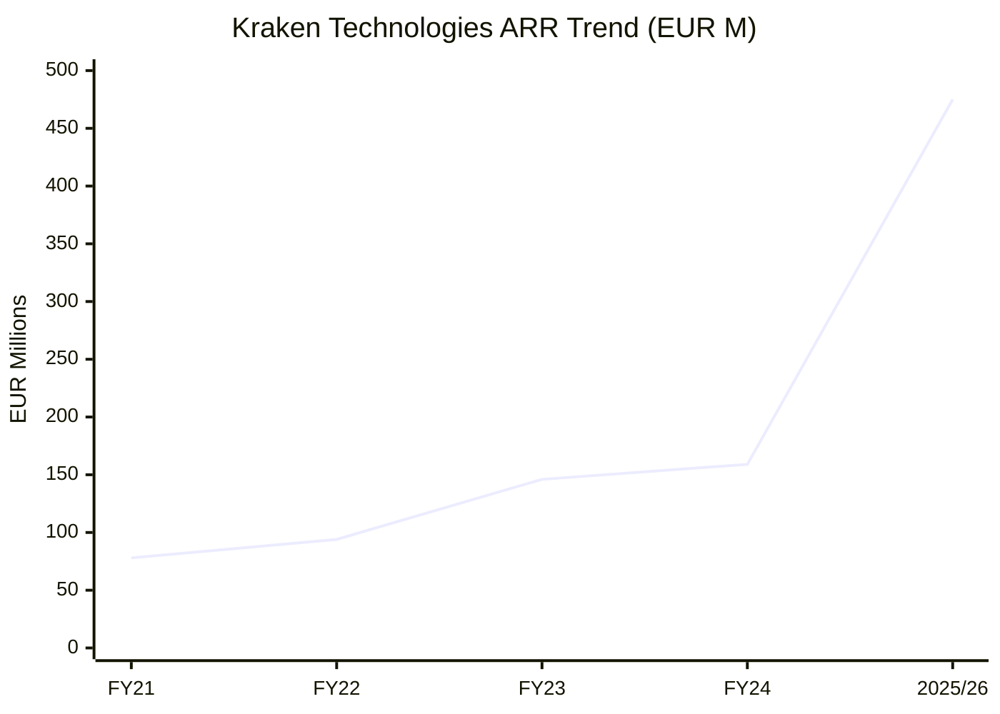
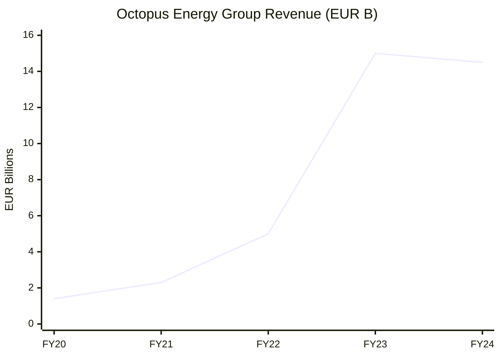
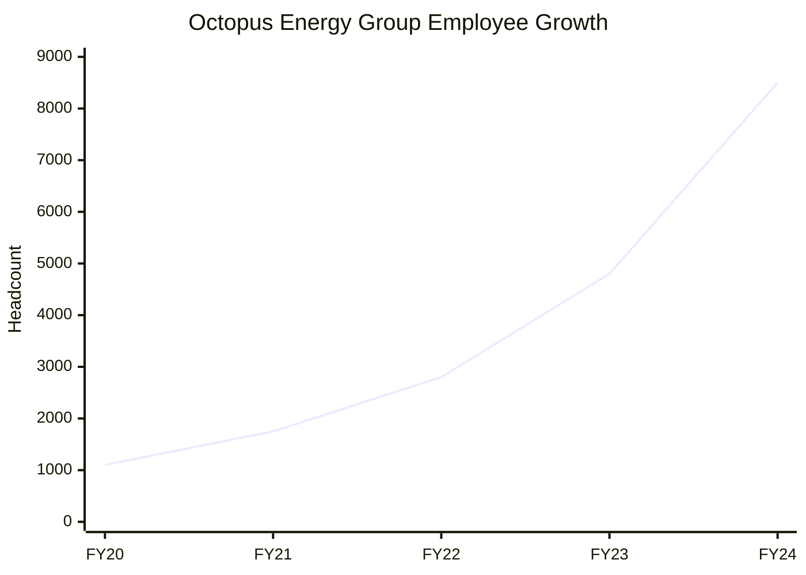
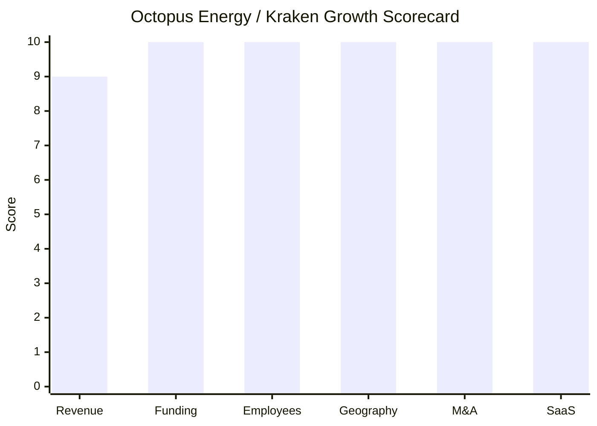

# Financial & Growth Deep-Dive - Octopus Energy Group / Kraken Technologies

**Research Date**: 2026-02-16
**Data Availability**: High (UK private company with extensive annual results press releases, Kraken annual reports filed at Companies House, major media coverage of $1B fundraise, Crunchbase funding data, detailed FY23/FY24 annual results)

**Note on Entity Structure**: Octopus Energy Group Limited is the parent (energy retail supply). Kraken Technologies Ltd is the software/platform arm (spun off as independent company Dec 2025). This analysis covers both entities, with Kraken-specific metrics separated where relevant -- Kraken is the software competitor, while Group revenue is primarily energy retail pass-through.

---

### Revenue Timeline

**Octopus Energy Group (consolidated, primarily energy retail supply)**:

| Year | Revenue | Currency | EUR Equivalent | YoY Growth | Source | Confidence |
| --- | --- | --- | --- | --- | --- | --- |
| FY25 (est., ending Apr 2025) | ~£12-13B | GBP | ~EUR 14-15B | ~0-5% | Estimate from trajectory | Estimated |
| FY24 (ended Apr 2024) | £12.4B | GBP | EUR 14.5B | -5% | Octopus FY24 annual results | Confirmed |
| FY23 (ended Apr 2023) | £13.0B | GBP | EUR 15.0B | +210% | Octopus FY23 annual results | Confirmed |
| FY22 (ended Apr 2022) | £4.2B | GBP | EUR 5.0B | +110% | Octopus FY22 annual results | Confirmed |
| FY21 (ended Apr 2021) | £2.0B | GBP | EUR 2.3B | +62% | Octopus FY21 annual results | Confirmed |
| FY20 (ended Apr 2020) | £1.24B | GBP | EUR 1.4B | +170% | Octopus FY20 annual results | Confirmed |
| FY19 (ended Apr 2019) | £460M | GBP | EUR 520M | +256% | Octopus FY19 press release | Confirmed |

**Revenue CAGR (3yr, FY21-FY24)**: ~84% (driven by energy price crisis and massive customer growth; not organic software growth)
**Revenue CAGR (5yr, FY19-FY24)**: ~93%

**Kraken Technologies (software platform -- the relevant competitor metric)**:

| Year | Revenue / ARR | Currency | EUR Equivalent | YoY Growth | Source | Confidence |
| --- | --- | --- | --- | --- | --- | --- |
| 2025/2026 (current) | $500M committed ARR | USD | ~EUR 475M | ~295% (from FY24 ARR) | Kraken press release, TechCrunch | Confirmed |
| FY24 (ended Apr 2024) | £136.3M revenue (£89.6M recurring) | GBP | EUR 159M | +18% revenue | Kraken FY24 annual report | Confirmed |
| FY23 (ended Apr 2023) | £127M contracted ARR | GBP | EUR 146M | +59% ARR | Kraken FY23 annual report | Confirmed |
| FY22 (ended Apr 2022) | £115M revenue (£80M ARR) | GBP | EUR 136M | +66% revenue | Octopus FY22 annual results | Confirmed |
| FY21 (ended Apr 2021) | £69M revenue | GBP | EUR 78M | +584% | Octopus FY21 annual results | Confirmed |

**Kraken ARR CAGR (3yr, FY22-2025)**: ~84% (£80M ARR -> $500M/~£400M ARR, quadrupled)

#### Revenue Trend Chart (Kraken Platform ARR)

#### Revenue Trend Chart (Octopus Energy Group)

### Profitability

| Data Point | Value | Source | Confidence |
| --- | --- | --- | --- |
| Net Profit (FY24) | £83M (0.7% margin) | Octopus FY24 annual results | Confirmed |
| Net Profit (FY23) | £203M (1.6% margin) -- first full-year profit | Octopus FY23 annual results | Confirmed |
| EBITDA (FY24, Supply Business) | £199.6M | Octopus FY24 CSS filing | Confirmed |
| EBIT (FY24, Supply Business) | £140.0M | Octopus FY24 CSS filing | Confirmed |
| Net Assets (FY24) | £1.7B (+145% YoY from £975M) | Octopus FY24 annual results | Confirmed |
| Net Assets (FY23) | £975M (+106% from £473M) | Octopus FY23 annual results | Confirmed |
| Kraken Recurring Revenue % (FY24) | 66% (£89.6M of £136.3M total) | Kraken FY24 annual report | Confirmed |
| Kraken Operating Profit (FY21) | £46M on £69M revenue (67% margin) | Octopus FY21 annual results | Confirmed |
| Revenue per Employee (Group) | ~EUR 1.71M (£12.4B / 8,500) | Calculated | Confirmed |
| Revenue per Employee (Kraken) | ~EUR 80K (£136.3M / 2,000) | Calculated | Estimated |
| Deliberate Margin Suppression | £74M absorbed in FY24 to keep bills below price cap | Octopus FY24 press release | Confirmed |

**Key Insight**: Group margins are deliberately low -- Octopus prioritizes customer acquisition and market share over profitability. The company absorbed £74M in FY24 to keep customer bills below the Ofgem price cap. Kraken's software margins are strong (67% operating margin in FY21), but the platform is in hyper-growth investment mode with ARR recognition lagging contracted commitments.

### Funding & Investment History

| Date | Round | Amount | Lead Investor(s) | Valuation | Source | Confidence |
| --- | --- | --- | --- | --- | --- | --- |
| Dec 2025 | Kraken Standalone Equity | $1.0B (~EUR 950M) | D1 Capital Partners, Fidelity International, Ontario Teachers' Pension Plan | $8.65B (Kraken standalone) | Kraken press, CNBC, Guardian | Confirmed |
| Jun 2024 | Group Equity | Undisclosed | Galvanize, Lightrock | Not disclosed | Crunchbase, CB Insights | Confirmed |
| May 2024 | Secondary / Stake Increase | Undisclosed | Generation Investment Management (to 13%), CPP Investments (to 12%) | $9.0B (Group) | Reuters | Confirmed |
| Dec 2023 | Group Equity | $800M (~EUR 736M) | Origin Energy, Tokyo Gas, CPP Investments, Generation Investment Management | $7.8B (Group) | Power Technology, press | Confirmed |
| Dec 2021 | Group Equity | Undisclosed | Undisclosed | Not publicly disclosed | CB Insights | Confirmed |
| Jul 2022 | Corporate Minority | Undisclosed | Undisclosed | Not publicly disclosed | CB Insights | Confirmed |
| Earlier rounds (2019-2021) | Multiple | ~$977M+ combined | Generation Investment Management, Origin Energy, others | Various (increasing) | Crunchbase | Estimated |

**Total Raised (Group)**: ~$2.8B across 9 rounds (Crunchbase/CB Insights)
**Total Raised (Kraken standalone)**: $1.0B (Dec 2025)
**Combined**: ~$3.8B total capital raised
**Latest Valuation (Group)**: $9.0B (May 2024)
**Latest Valuation (Kraken)**: $8.65B (Dec 2025, standalone)
**Current Investors**: D1 Capital Partners, Fidelity International, Ontario Teachers' Pension Plan, Generation Investment Management (Al Gore), Canada Pension Plan Investment Board, Origin Energy (22.7% Kraken economic interest), Tokyo Gas, Galvanize, Lightrock, Durable Capital Partners, CPP Investments
**War Chest Signals**: $1B fresh capital in Kraken (Dec 2025), net assets £1.7B (FY24), IPO planned within 1-2 years at potential $15B valuation. Octopus retains only 13.7% of Kraken post-spinoff -- Kraken now has independent access to capital markets.

### Employee Timeline

| Year | Headcount | Scope | YoY Growth | Source | Confidence |
| --- | --- | --- | --- | --- | --- |
| 2026 (current) | ~8,500-10,000+ (Group); 2,000+ (Kraken) | Global | -- | kraken.tech, estimate | Estimated |
| FY24 (Apr 2024) | 8,500 | Global (Group) | +77% | Octopus FY24 annual results | Confirmed |
| FY23 (Apr 2023) | 4,800 | Global (Group) | +68% | Octopus FY24 results (starting point) | Confirmed |
| FY23 (Apr 2023) | 4,700 | UK only (Group) | +68% (from 2,800 UK) | Octopus FY23 annual results | Confirmed |
| FY22 (Apr 2022) | ~2,800 | UK (Group) | -- | Octopus FY23 results (prior year ref) | Confirmed |
| FY21 (Apr 2021) | ~1,500-2,000 | Global (est.) | -- | Estimate from customer/revenue scale | Estimated |
| FY20 (Apr 2020) | ~1,000-1,200 | Global (est.) | -- | Estimate from revenue scale | Estimated |

**Employee CAGR (2yr, FY22-FY24)**: ~74% (2,800 UK -> 8,500 global; comparing like-for-like UK-only would be even higher)
**Employee CAGR (3yr est., FY21-FY24)**: ~62-77%
**Current Open Positions (Kraken)**: 102 open roles
**AI/ML Open Roles**: 2+ dedicated ML Engineer positions (Senior ML Engineer - Utilities, ML Engineer - Utilities)
**Hiring Hotspots**: London (HQ), Tokyo, Melbourne, New York, Rotterdam (Jedlix hub)
**Application Volume**: 300,000 global applications in FY24; 60,000 for Kraken specifically
**Employer Brand**: Glassdoor 4.7/5; Sunday Times Best Places to Work 2024; Top 10 ranking

#### Employee Growth Chart

### Geographic & Market Expansion

| Year | Expansion Event | Details | Source | Confidence |
| --- | --- | --- | --- | --- |
| 2025 | 10M global customers milestone | Retail operations in 8 countries, Kraken in 27 countries | Octopus press release (Oct 2025) | Confirmed |
| 2025 | Germany EV launch | Launched electric vehicle business in Germany (Sep 2025) | Octopus press release | Confirmed |
| 2025 | TalkTalk (Broadband sector) | First major UK ISP to migrate to Kraken platform (Feb 2025) | ISPreview, TalkTalk press | Confirmed |
| 2025 | Kraken spin-off as independent company | Kraken Technologies becomes standalone entity (Dec 2025) | Multiple sources | Confirmed |
| 2024 | National Grid US (6.5M accounts) | Kraken wins largest US utility; displaces legacy vendor | Press releases | Confirmed |
| 2024 | Severn Trent Water (4.6M customers) | Kraken enters water sector; first major water utility win | Press releases | Confirmed |
| 2024 | Rotterdam hub (Jedlix) | Acquisition of Jedlix creates Kraken technology hub in Netherlands | Kraken press, electrive | Confirmed |
| 2024 | Melbourne office (Energetiq) | Energetiq acquisition creates Kraken Australian headquarters | Octopus press | Confirmed |
| 2023 | Shell Energy Retail (UK + Germany) | 1.3M UK customers + German customers + 500K broadband | Octopus press | Confirmed |
| 2023 | Tokyo Gas (Japan, 3M accounts) | Major Japanese utility migrated to Kraken | Press releases | Confirmed |
| 2023 | France: 5th largest supplier | ~600K French customers across Paris, Marseille, Lyon | Octopus press (Oct 2025) | Confirmed |
| 2022 | Italy: SATO + organic growth | Customer base tripled in one year | Octopus press | Confirmed |
| 2022 | Plenitude (Eni) | Italian energy giant migrated to Kraken platform | kraken.tech | Confirmed |

**International Revenue %**: Not separately disclosed; Group notes "tripled non-UK customer base to 1.2M" in FY24
**Expansion Trajectory**: Intercontinental expansion at extraordinary pace. From UK-only (2016) to 8 retail countries and 27 Kraken platform countries across 4 continents. Expanding beyond energy into water and broadband/telco. Germany, France, Italy all achieving scale. Multiple markets on track to 1M customers by 2027.

### M&A Activity

| Date | Target | Deal Size | Capability Gained | Strategic Rationale | Source | Confidence |
| --- | --- | --- | --- | --- | --- | --- |
| Oct 2024 | **Jedlix** (Rotterdam, NL) | Undisclosed | Smart/bidirectional EV charging; OEM APIs (Renault, Polestar, Kia, Hyundai) | Expand KrakenFlex flexibility capabilities; Rotterdam tech hub | Kraken press, electrive | Confirmed |
| Jul 2024 | **Energetiq** (Melbourne, AU) | Undisclosed | Network billing validation and revenue assurance | Expand network billing capabilities globally; Australian HQ | Octopus press, Russell Kennedy | Confirmed |
| Jan 2024 | **Kwest** (Berlin, DE) | Undisclosed | Heat pump and smart meter installation software | Expand smart device installation and management | Sifted, Octopus press | Confirmed |
| Dec 2023 | **Sennen** (Bristol, UK) | Undisclosed | Renewable asset management (offshore wind, solar, batteries) | Expand from 6.5GW to 36GW managed assets; enter generation management | Octopus press, tech.eu | Confirmed |
| Dec 2023 | **Shell Energy Retail** (UK + DE) | Undisclosed (est. >£100M) | 1.3M UK customers, German customers, 500K broadband customers | Massive customer acquisition; broadband entry | Octopus press | Confirmed |
| Dec 2022 | **Bulb** (UK) | £109M (from special administration) | 1.5M UK energy customers | Largest energy crisis casualty; customer acquisition | Octopus press, Wikipedia | Confirmed |
| 2022 | **Plum Energie** (France) | Undisclosed | French energy retail presence | French market entry/expansion | Sifted | Confirmed |
| 2022 | **Depsys** (Switzerland) | Undisclosed | Real-time grid analytics for network operators | Grid monitoring and analytics capabilities | Sifted | Confirmed |
| 2021 | **Avro Energy** (UK) | Undisclosed (~£0 + customer base) | ~600K UK customers | Failed supplier acquisition during energy crisis | Press | Confirmed |
| 2021 | **Configurable** (New Zealand) | Undisclosed | Smart grid software | NZ market entry + grid technology | Sifted | Confirmed |
| 2021 | **SATO Luce e Gas** (Italy) | Undisclosed | Italian energy retail presence | Italian market entry | Sifted | Confirmed |
| 2021 | **Umeme** (Spain) | Undisclosed | Spanish energy retail presence | Spanish market entry | Sifted | Confirmed |
| 2020 | **Evolve Energy** (US) | Undisclosed | US energy retail presence (Texas) | US market entry | Wikipedia | Confirmed |
| 2019 | **4hundred** (Germany) | Undisclosed | German energy retail presence | German market entry | Sifted | Confirmed |
| 2018 | **Affect Energy** (UK) | Undisclosed | UK energy retail customers | Early customer acquisition | Sifted | Confirmed |

**Total Acquisitions**: 15+ confirmed (2018-2024)
**Acquisitions in Last 3 Years**: 8 (Jedlix, Energetiq, Kwest, Sennen, Shell Energy Retail, Bulb, Plum Energie, Depsys)
**Divestitures**: None
**M&A Pattern**: Dual-track acquisition strategy -- (1) **Customer acquisition** through failed/exiting energy suppliers (Bulb, Avro, Shell Energy) adding millions of customers to the Kraken platform, and (2) **Technology capability building** through specialist software acquisitions (Jedlix for EV flexibility, Sennen for renewables, Kwest for smart devices, Energetiq for billing, Depsys for grid analytics). Only 3 people in M&A team -- highly efficient deal machine.

### SaaS Transition Metrics

| Data Point | Value | Source | Confidence |
| --- | --- | --- | --- |
| Deployment Model | Cloud-native from founding (2015); SaaS only, no on-premise | kraken.tech, AWS case study | Confirmed |
| Cloud Revenue % (current) | 100% (SaaS-only model) | kraken.tech architecture | Confirmed |
| Recurring Revenue % (FY24) | 66% of Kraken revenue (£89.6M of £136.3M) | Kraken FY24 annual report | Confirmed |
| Recurring Revenue % (FY23) | Growing; £127M contracted ARR | Kraken FY23 annual report | Confirmed |
| Contracted ARR (current) | $500M (~EUR 475M) | Kraken press release | Confirmed |
| Platform Stack | Python (9M lines), TypeScript (250K lines), single monolith, single git repo | engineering.kraken.tech blog | Confirmed |
| Cloud Provider | AWS (DynamoDB, Lambda, EventBridge Pipes, serverless) | AWS case study, engineering blog | Confirmed |
| Release Cadence | 100+ deployments/day to 25+ client environments in 10+ countries | engineering.kraken.tech | Confirmed |
| Test Suite | 100,000+ unit, integration, and functional tests per deploy | engineering.kraken.tech | Confirmed |
| Deploy Cycle | <30 minutes from commit to production | engineering.kraken.tech | Confirmed |
| Data Processing | 15 billion data points daily; 100M+ daily meter readings | Press releases, case studies | Confirmed |
| Migration Track Record | 40+ successful utility migrations | kraken.tech | Confirmed |
| Migration Speed | Shell Energy Retail: 1.3M customers migrated in <3 months | Octopus FY24 press | Confirmed |
| Licensing Model | Build, Operate and Transfer (BOT); SaaS licensing per contracted account | Kraken annual reports | Confirmed |
| Migration Status | N/A -- cloud-native from day one, no legacy migration needed | Assessment | Confirmed |

### Growth Scorecard

| Dimension | Score (1-10) | Evidence Summary |
| --- | --- | --- |
| Revenue Growth | 9 | Kraken ARR quadrupled in 3yr to $500M (~84% CAGR); Group grew from £2B to £12.4B in 3yr |
| Funding Momentum | 10 | $1B raised Dec 2025 at $8.65B standalone valuation; $2.8B+ total raised; IPO planned at $15B |
| Employee Growth | 10 | Group grew from ~2,800 to 8,500 in 2yr (~74% CAGR); 300K applications/year; Glassdoor 4.7 |
| Geographic Expansion | 10 | 8 retail countries, 27 Kraken countries, 4 continents; entered US, Japan, water, broadband |
| M&A Activity | 10 | 8 acquisitions in 3yr including transformative customer + capability deals; 15+ total |
| SaaS Maturity | 10 | Cloud-native from founding; 100% SaaS; $500M ARR; 100+ deploys/day; AWS serverless |
| **COMPOSITE SCORE** | **9.8** | **Rocket** |

**Classification Thresholds**:

- **Rocket** (avg 7.0-10.0): Explosive growth, heavy investment, market disruptor
- **Riser** (avg 5.0-6.9): Strong growth signals, investing in future, accelerating
- **Steady** (avg 3.0-4.9): Stable but not transforming, evolutionary
- **Dinosaur** (avg 1.0-2.9): Flat or declining, legacy mode, no visible investment

#### Growth Scorecard Radar

> Octopus Energy / Kraken scores near-perfect across all dimensions. This is the highest-scoring competitor in the entire analysis -- a textbook **Rocket** with $3.8B+ raised, $8.65B valuation, 70M+ contracted accounts, intercontinental expansion, aggressive M&A, and cloud-native SaaS architecture from day one. The only dimension below 10 is Revenue Growth (9), and that's because Kraken's recognized revenue (£136M) lags its contracted ARR ($500M) due to the multi-year deployment cycle for large utility clients. The ARR trajectory itself (~84% CAGR) justifies a 9-10 score.

---

**Sources consulted**: octopusenergy.group, octopus.energy/press, kraken.tech, engineering.kraken.tech, Octopus Energy FY19/FY20/FY21/FY22/FY23/FY24 annual results press releases, Kraken Technologies FY23/FY24 annual reports (Companies House), Reuters, CNBC, BBC, The Guardian, TechCrunch, Sifted, ESG Today, Crunchbase, CB Insights, AWS case studies, ISPreview, electrive, Latitude Media, tech.eu, Power Technology, Canary Media, Wikipedia, Growjo.
