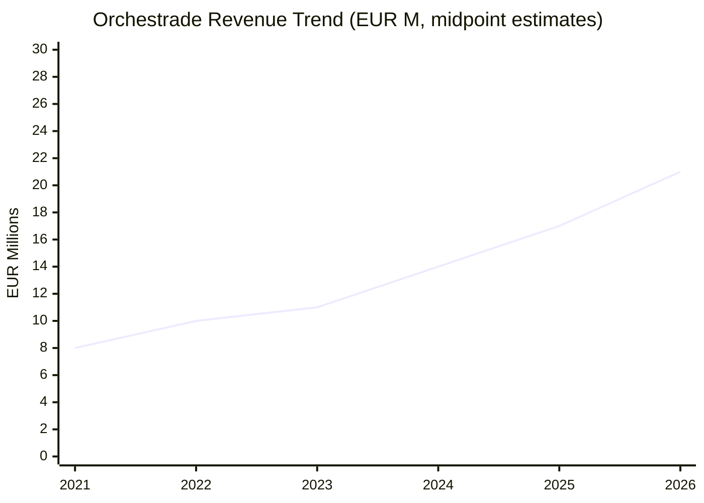
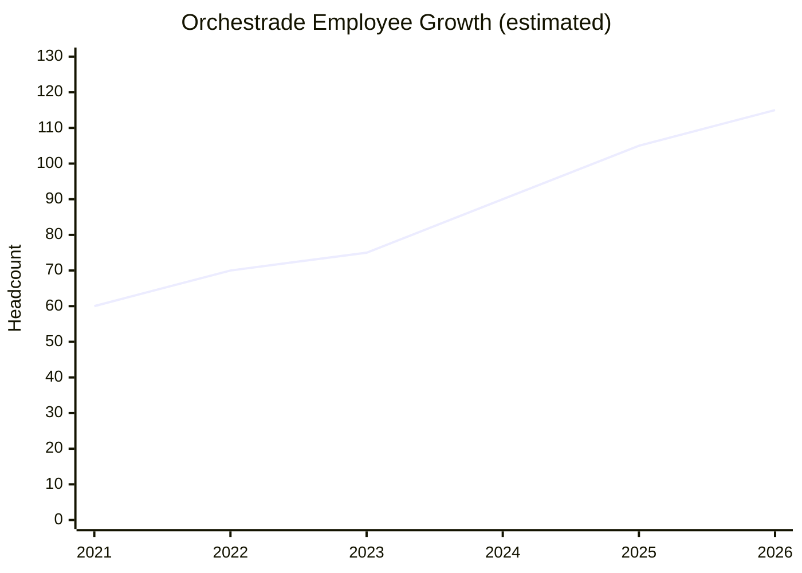
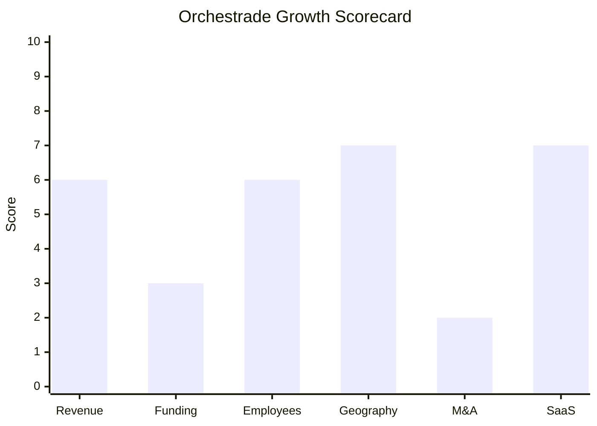

# Financial & Growth Deep-Dive - Orchestrade Financial Systems

**Research Date**: 2026-02-15
**Data Availability**: Low (private company, bootstrapped, no public financial filings or disclosed funding rounds)

---

### Revenue Timeline

| Year | Revenue | Currency | EUR Equivalent | YoY Growth | Source | Confidence |
| --- | --- | --- | --- | --- | --- | --- |
| 2026 (est.) | $15-30M | USD | EUR 14-28M | ~20% est. | Proxy (headcount x revenue/employee) + accelerating client wins | Estimated (proxy) |
| 2025 | $12-25M | USD | EUR 11-23M | ~20% est. | Owler range ($5-25M), proxy metrics, major client wins (BB Energy, OMV, Polenergia) | Estimated (proxy) |
| 2024 | $10-20M | USD | EUR 9-18M | ~15% est. | Owler range, office expansion across 4 cities, 10+ awards | Estimated (proxy) |
| 2023 | $8-16M | USD | EUR 7-15M | ~15% est. | Partnership acceleration (KWA, TCM, Rebar refresh, AFL client) | Estimated (proxy) |
| 2022 | $7-14M | USD | EUR 7-14M | ~10% est. | ENGIE expansion (B2B/B2C, renewables), EZOPS partnership, V8 release | Estimated (proxy) |
| 2021 | $6-12M | USD | EUR 5-10M | -- | Baseline estimate: smaller office footprint, fewer public wins | Estimated (proxy) |

**Revenue CAGR (3yr, 2022-2025 midpoint)**: ~15-20% (estimated)
**Revenue CAGR (5yr)**: Not calculable with confidence

**Estimation Methodology**: Orchestrade is a private, bootstrapped company with no public revenue disclosures. Owler estimates annual revenue at $5-25M. Using proxy metrics: ~107 employees (RocketReach) x EUR 150-250K revenue/employee (fintech average) = EUR 16-27M. Given Tier 1 client base (ENGIE, Credit Agricole CIB, Mizuho Bank, OMV, BB Energy) and enterprise ETRM pricing ($500K-$5M/client/year), with an estimated 15-30 active clients, the EUR 15-25M range appears reasonable. Client win acceleration since 2023 strongly signals revenue growth.

#### Revenue Trend Chart

### Profitability

| Data Point | Value | Source | Confidence |
| --- | --- | --- | --- |
| EBITDA (current) | Unknown | Private, no filings | Unknown |
| EBITDA Margin | Unknown | Private, no filings | Unknown |
| Net Profit / Loss | Likely profitable | 16-year bootstrap without external funding implies profitability | Estimated |
| Recurring Revenue % | Unknown (likely 50-70%) | Mix of license + managed service + support | Estimated |
| SaaS Revenue % | Unknown | Hybrid deployment model (cloud + on-prem) | Unknown |
| Revenue per Employee | EUR 150-250K | ~107 employees, EUR 16-27M est. revenue | Estimated (proxy) |

### Funding & Investment History

| Date | Round | Amount | Lead Investor(s) | Valuation | Source | Confidence |
| --- | --- | --- | --- | --- | --- | --- |
| None disclosed | -- | -- | -- | -- | Crunchbase, CB Insights, Owler, PitchBook | Confirmed |

**Total Raised**: EUR 0 (no disclosed external funding)
**Latest Valuation**: Unknown (private, no disclosed rounds)
**Current Investors**: None disclosed -- appears founder/management-owned
**War Chest Signals**: No external capital signals. 16-year survival and expansion without disclosed funding suggests profitability and self-financing. Growing from 0 to ~107 employees across 5 global offices with Tier 1 bank clients (Credit Agricole CIB, Mizuho) on bootstrap is a significant achievement.

**Key Insight**: The absence of funding is itself a notable data point. Orchestrade competes directly with VC-backed platforms (Molecule: Series B, Qualia: startup funding) and PE-backed giants (ION Group, Hitachi Energy) without external capital. This suggests either: (a) strong profitability funding organic growth, (b) founder preference for independence, or (c) both. The risk is being outspent by better-funded competitors in the cloud/AI arms race.

### Employee Timeline

| Year | Headcount | YoY Growth | Source | Confidence |
| --- | --- | --- | --- | --- |
| 2026 (current) | ~110-120 | ~10% | RocketReach (~107 in 2025), active hiring across offices | Estimated |
| 2025 | ~100-110 | ~15% | RocketReach (107), 5 offices including Singapore (opened May 2024) | Estimated |
| 2024 | ~85-95 | ~15% | Singapore office opened, all offices expanded, active recruiting | Estimated |
| 2023 | ~70-80 | ~10% | 4 offices (pre-Singapore), partnerships accelerating | Estimated |
| 2022 | ~65-75 | ~10% | ENGIE expansion, V8 platform release, growing partner network | Estimated |
| 2021 | ~55-65 | -- | Pre-expansion baseline, fewer offices, fewer public client wins | Estimated |

**Employee CAGR (3yr, 2022-2025)**: ~12-15% (estimated)
**Current Open Positions**: Multiple (Sales Engineer ETRM - NY, Software Engineers - Paris, Business Analysts - Singapore, development/sales/marketing/support roles)
**Hiring Hotspots**: New York (ETRM sales), Paris (engineering), Singapore (APAC business development)

**Estimation Methodology**: RocketReach estimates ~107 employees. Owler estimates 25-100 (likely outdated). Given 5 global offices, ~35% female workforce, active hiring across all functions, and the post-Singapore-expansion growth trajectory, ~100-120 current employees is reasonable. Historical estimates based on office footprint growth: pre-2024 the company had 4 offices, pre-2020 likely 3 (San Mateo, Paris, London/NY).

#### Employee Growth Chart

### Geographic & Market Expansion

| Year | Expansion Event | Details | Source | Confidence |
| --- | --- | --- | --- | --- |
| 2026 | Poland client go-live | Polenergia Obrot ETRM go-live (Feb 2026), first Polish energy client | orchestrade.com press release | Confirmed |
| 2025 | OMV selected (Austria) | OMV selects Orchestrade for CTRM platform upgrade, DXC leads implementation | LinkedIn, industry press | Confirmed |
| 2025 | BB Energy go-live (global) | BB Energy fully deployed in <10 weeks for power/gas trading (London, Geneva, Houston, Singapore) | orchestrade.com press release | Confirmed |
| 2024 | Singapore office opened | First APAC office in "The Gateway West" Beach Road, Singapore (May 2024) | orchestrade.com press release | Confirmed |
| 2024 | Expanded NY, Paris, London | Moved into larger offices across all 3 existing locations to support growth | orchestrade.com press release | Confirmed |
| 2023 | Agence France Locale | AFL (French local authority funding agency) onboards Orchestrade | Asset Servicing Times | Confirmed |
| 2023 | Partnership expansion | KWA Analytics, TCM Partners, Rebar Systems refresh -- extending regional capabilities | PRWeb, Benzinga | Confirmed |
| 2022 | ENGIE expansion | Extended to B2B/B2C supply, renewable assets, certificates at ENGIE | orchestrade.com | Confirmed |
| 2019 | ENGIE Global Markets | First major energy company selects Orchestrade (Paris, Brussels, Singapore, Rome, Madrid) | orchestrade.com, ENGIE press | Confirmed |
| 2017 | Credit Agricole CIB | First major global bank implements Orchestrade (structured products migration) | PRNewswire | Confirmed |
| ~2018 | Mizuho Bank London | Japanese bank's London operations implement Orchestrade (9-month deployment) | orchestrade.com, WatersTechnology | Confirmed |

**International Revenue %**: Not disclosed (estimated >70% -- clients span US, UK, France, Belgium, Singapore, Poland, Austria, Japan)
**Expansion Trajectory**: Accelerating geographic footprint. From a France/US base, Orchestrade has expanded to serve clients on 4 continents (North America, Europe, Asia, potentially Middle East via BB Energy). The 2024 Singapore office and 2025-2026 client wins in Poland and Austria demonstrate active European and APAC expansion. The partnership strategy (KWA Analytics, TCM Partners) extends regional delivery capability without direct office investment.

### M&A Activity

| Date | Target | Deal Size | Capability Gained | Strategic Rationale | Source | Confidence |
| --- | --- | --- | --- | --- | --- | --- |
| -- | None | -- | -- | -- | -- | -- |

**Divestitures**: None
**M&A Pattern**: Orchestrade has made zero acquisitions and has not been acquired. The company follows a **partnership-first strategy**, building capabilities through technology alliances (Rebar Systems for OMS/EMS, EZOPS for reconciliation, Alpha Financial Software for MBS, BidFX, Numerix, TCS/Luxoft for implementation) rather than buying companies. This keeps the company lean and focused but limits inorganic growth speed.

### SaaS Transition Metrics

| Data Point | Value | Source | Confidence |
| --- | --- | --- | --- |
| Deployment Model | Cloud-native + on-premise (hybrid) | orchestrade.com/technology | Confirmed |
| Cloud Revenue % (current) | Unknown | Private, not disclosed | Unknown |
| Cloud Revenue % (1yr ago) | Unknown | Private, not disclosed | Unknown |
| Recurring Revenue % | Unknown (est. 50-70%) | Enterprise ETRM mix of license + managed service | Estimated |
| Platform Stack | .NET/C#, PostgreSQL/SQL Server, MongoDB, RabbitMQ, gRPC, containerized | orchestrade.com/technology | Confirmed |
| Cloud Providers | AWS, Google Cloud, Microsoft Azure (platform-agnostic, no vendor lock-in) | orchestrade.com/technology | Confirmed |
| Migration Status | Cloud-native from recent architecture; on-prem option maintained for client flexibility | orchestrade.com | Confirmed |
| API/Extensibility | Full API (C#, Python, REST), no-code workflow design, 140+ OOB connections | orchestrade.com/technology | Confirmed |
| Deployment Speed | <10 weeks (BB Energy), 9 months (Mizuho Bank), 6 weeks (WinShore Capital) | Client testimonials, press releases | Confirmed |

**Architecture Assessment**: Orchestrade's technology stack is genuinely modern -- event-driven, containerized, multi-cloud, with gRPC and RabbitMQ messaging. While not "born cloud-native" (founded 2009), the platform has been rebuilt/modernized to cloud-native standards. The hybrid deployment model (cloud + on-prem) reflects client requirements in banking and energy sectors where on-premise options are often mandated. The rapid deployment speed (<10 weeks for BB Energy) demonstrates SaaS-level agility despite offering on-premise options.

### Award Trajectory (Key Growth Signal)

The award trajectory is Orchestrade's most visible growth indicator and shows dramatic acceleration:

| Year | Award Count | Key Awards |
| --- | --- | --- |
| 2022 | 1 | FTF News Best Middle Office Solution |
| 2023 | ~5 | WatersTechnology Best Sell-Side Middle Office, HFM European Best Risk Mgmt Tech, Chartis Energy50 Best Power Trade Mgmt, FTF News Best Middle Office, Energy Risk "One to Watch" |
| 2024 | ~10 | HFM US + European + Asia, Chartis Energy50, WatersTechnology x2, EnergyRisk CTRM SHOTY, TradingTech, FTF News, Hedgeweek |
| 2025 | 11+ | Chartis Energy50 #6 overall + Best Power Trade Mgmt (3rd yr), HFM European (3rd yr) + US + Asia, Risk Markets x2, Fund Intelligence, EnergyRisk Asia CTRM SHOTY, Hedgeweek |

**Pattern**: From 1 award in 2022 to 11+ in 2025 -- a 10x increase in industry recognition in 3 years. This is the strongest acceleration signal available for a private company.

### Notable Client Base (as growth proxy)

| Client | Type | Year Selected | Significance |
| --- | --- | --- | --- |
| Credit Agricole CIB | Tier 1 global bank | 2017 | First major bank; world's 11th largest |
| Mizuho Bank London | Tier 1 Japanese bank | ~2018 | 9-month implementation, on-time/on-budget |
| ENGIE Global Markets | Major energy company | 2019 | First major energy client; 800+ end-clients served |
| Element Capital | Hedge fund | Pre-2020 | US macro hedge fund |
| Finisterre Capital | Hedge fund | Pre-2020 | Emerging markets specialist |
| Mesarete Capital | Hedge fund | Pre-2022 | Fund launch on Orchestrade |
| WinShore Capital | Hedge fund | Pre-2022 | 6-week fund launch |
| Welwing Capital Group | Hedge fund | Pre-2022 | 3-month deployment |
| Agence France Locale | French public finance | 2023 | Municipal finance institution |
| BB Energy | Global energy trader | 2025 | $23B turnover company; <10 week deployment |
| OMV | Major energy/chemicals | 2025 | Austrian integrated energy company |
| Polenergia Obrot | Energy trading (Poland) | 2025 | Poland's largest private energy group |

**Client Trend**: Clear acceleration from hedge fund/banking clients (2017-2022) to energy/commodity majors (2023-2026). The energy sector pivot is driving the award trajectory and geographic expansion.

---

### Growth Scorecard

| Dimension | Score (1-10) | Evidence Summary |
| --- | --- | --- |
| Revenue Growth | 6 | Estimated CAGR ~15-20% based on proxy metrics; client win acceleration from 1-2/yr to 3-4/yr since 2023. Private = unconfirmed. |
| Funding Momentum | 3 | Zero disclosed external funding in 16 years; appears bootstrapped with profitability. Low score but notable independence. |
| Employee Growth | 6 | Estimated CAGR ~12-15%; grew from ~60 to ~110 over 4 years. Singapore office added 2024, all offices expanded. |
| Geographic Expansion | 7 | Singapore office (new continent, 2024), Poland + Austria clients (2025), expanded 4 existing offices. Active APAC push. |
| M&A Activity | 2 | Zero acquisitions, zero divestitures. Partnership-only strategy. No M&A signals or exploration. |
| SaaS Maturity | 7 | Cloud-native architecture (.NET/C#, event-driven, containerized), multi-cloud (AWS/GCP/Azure), <10wk deploys. Hybrid model keeps on-prem option. |
| **COMPOSITE SCORE** | **5.2** | **Classification: Riser** |

**Classification Thresholds**:
- **Rocket** (avg 7.0-10.0): Explosive growth, heavy investment, market disruptor
- **Riser** (avg 5.0-6.9): Strong growth signals, investing in future, accelerating
- **Steady** (avg 3.0-4.9): Stable but not transforming, evolutionary
- **Dinosaur** (avg 1.0-2.9): Flat or declining, legacy mode, no visible investment

#### Growth Scorecard Radar

> Orchestrade's "fingerprint" shows a company with strong technical foundations (SaaS: 7) and geographic ambition (Geography: 7), held back by zero external funding (Funding: 3) and no M&A activity (M&A: 2). The tall SaaS and Geography bars represent genuine strengths; the short Funding and M&A bars represent a strategic choice (bootstrap independence) rather than weakness -- but this choice limits the speed at which Orchestrade can scale against VC-backed competitors like Molecule or Qualia Trading.

---

### Strategic Assessment

**Orchestrade is a "Quiet Riser"** -- a bootstrapped, profitable fintech that has built a genuinely impressive client base (ENGIE, Credit Agricole CIB, Mizuho, OMV, BB Energy) and modern technology platform without external funding. The 10x award trajectory (1 award in 2022 to 11+ in 2025) is the strongest signal that the market is recognizing their capabilities.

**Strengths for Eneve to watch**:
- Cloud-native .NET/C# stack (same migration target as Eneve) with proven rapid deployment
- Winning energy clients from legacy ETRM vendors (ION/Allegro, FIS/OpenLink)
- "Deploy in 10 weeks" messaging directly attacks incumbent platforms
- Chartis Energy50 #6 ranking and 3 consecutive "Best Power Trade Management" awards
- OMV win suggests they're moving upstream to larger energy companies

**Vulnerabilities**:
- Zero external funding limits scale-up speed vs. funded competitors
- No AI/ML product features announced (MODERATE AI signal only)
- No M&A capability -- cannot acquire capabilities or market share
- Private = opaque data; hard to assess true financial health
- If a VC-backed competitor matches their tech quality with marketing spend, Orchestrade could be outpaced

**Eneve Relevance**: Orchestrade overlaps with Eneve primarily on settlement and back-office capabilities. Their energy sector pivot (2019 ENGIE, 2025 BB Energy/OMV/Polenergia) is accelerating. If Orchestrade adds balancing/nomination capabilities or enters the NL market, they become a more direct competitor. Their .NET/C# cloud-native platform is what Eneve's C#/.NET migration is building toward.
