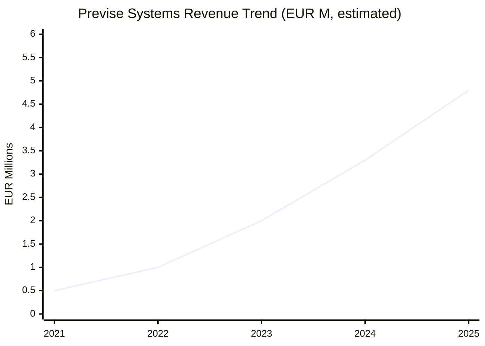
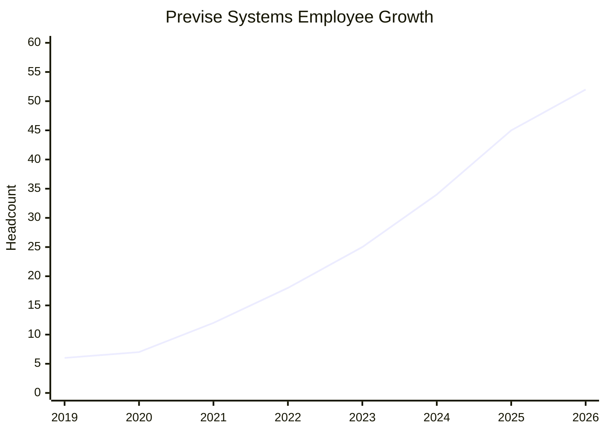
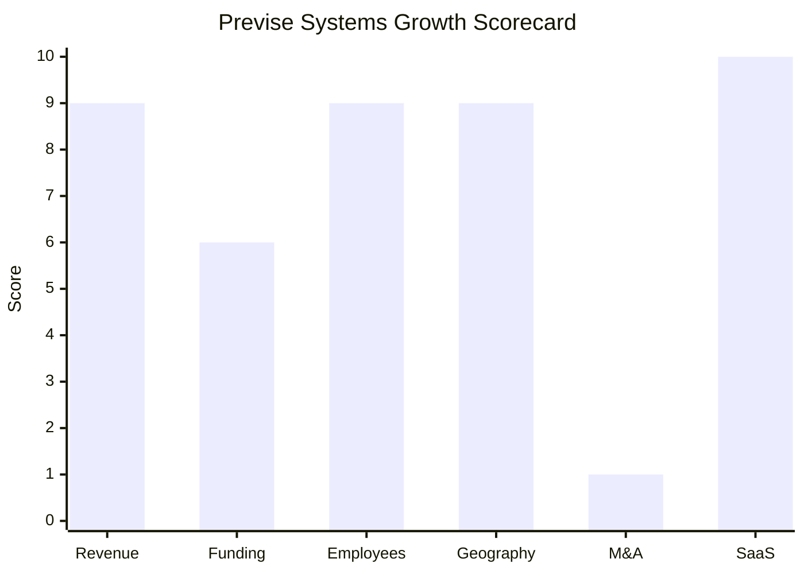

# Financial & Growth Deep-Dive - Previse Systems AG

**Research Date**: 2026-02-15
**Data Availability**: Medium (private, VC-backed startup; revenue estimated via proxy metrics, funding amount undisclosed, employee data from Growjo/LinkedIn; customer count confirmed via press releases and CTRM Center)

### Revenue Timeline

| Year | Revenue | Currency | EUR Equivalent | YoY Growth | Source | Confidence |
| --- | --- | --- | --- | --- | --- | --- |
| 2026 (est.) | ~EUR 6.5M | EUR | EUR 6.5M | ~35% | Employee proxy (52 x EUR 125K) + customer growth trajectory | Estimated (proxy) |
| 2025 | ~EUR 4.8M | USD/EUR | EUR 4.8M | ~45% | Growjo ($5.2M at EUR/USD 0.92) | Estimated |
| 2024 | ~EUR 3.3M | EUR | EUR 3.3M | ~65% | Customer count proxy (16+ x ~EUR 210K blended ARR) | Estimated (proxy) |
| 2023 | ~EUR 2.0M | EUR | EUR 2.0M | ~100% | Customer count proxy (5->14, blended ~9.5 avg x ~EUR 210K) | Estimated (proxy) |
| 2022 | ~EUR 1.0M | EUR | EUR 1.0M | ~100% | Customer proxy (~5 early customers x ~EUR 200K avg) | Estimated (proxy) |
| 2021 | ~EUR 0.5M | EUR | EUR 0.5M | N/A | Startup phase; first customers (Norlys Jan 2021, Orsted Dec 2021) | Estimated (proxy) |

**Revenue CAGR (3yr, 2022-2025)**: ~69%
**Revenue CAGR (2yr, 2023-2025)**: ~55%

**Methodology Note**: Previse Systems is private and does not disclose revenue. Estimates derived from three converging proxies: (1) Growjo revenue estimate of $5.2M with 45 employees, (2) customer count trajectory (5 -> 14 -> 16 -> 23+) multiplied by estimated average ETRM SaaS ARR of EUR 200-250K per customer, and (3) industry-standard revenue per employee for early-stage SaaS (EUR 107-125K). All three proxies converge on EUR 4.5-5.5M for 2025, giving reasonable confidence in the range.

#### Revenue Trend Chart

### Profitability

| Data Point | Value | Source | Confidence |
| --- | --- | --- | --- |
| EBITDA (current) | Unknown | Private company, not disclosed | Unknown |
| EBITDA Margin | Unknown (likely negative or breakeven) | Typical for early-growth SaaS with 32% employee growth | Estimated |
| Net Profit / Loss | Unknown (likely reinvesting for growth) | Growth trajectory suggests investment mode | Estimated |
| Recurring Revenue % | ~100% | Cloud-only SaaS subscription model, no on-premise | Confirmed |
| SaaS Revenue % | ~100% | Exclusively SaaS, no perpetual licenses | Confirmed |
| Revenue per Employee | ~EUR 107K ($116K USD) | Growjo ($5.2M / 45 employees) | Estimated |

**Profitability Assessment**: As a 6-year-old VC-backed SaaS company with 32% annual employee growth and Lightrock growth equity backing, Previse Systems is almost certainly in "invest for growth" mode. The low revenue per employee (EUR 107K) vs. SaaS industry benchmarks (EUR 150-250K for mature SaaS) suggests the company is hiring ahead of revenue, consistent with its rapid customer acquisition strategy. Profitability is not the current objective -- market share capture is.

### Funding & Investment History

| Date | Round | Amount | Lead Investor(s) | Valuation | Source | Confidence |
| --- | --- | --- | --- | --- | --- | --- |
| Aug 2025 | Growth Equity (minority stake) | Undisclosed (est. EUR 10-20M) | Lightrock | Undisclosed (est. EUR 30-60M post-money) | previsesystems.com, Lightrock press release, legalcommunity.ch, startupticker.ch | Amount: Estimated; Round: Confirmed |
| Pre-2025 | Early funding | Undisclosed | Swiss Technology Fund (unconfirmed) | Unknown | startup.ch, existing profile reference | Estimated |
| Aug 2019 | Founding / Bootstrapping | Self-funded (6 founders) | Founders | N/A | startup.ch (founded Aug 2019) | Confirmed |

**Total Raised**: Undisclosed (estimated EUR 10-25M cumulative)
**Latest Valuation**: Undisclosed (estimated EUR 30-60M post-money, based on Lightrock minority stake and typical SaaS multiples of 8-12x ARR on ~EUR 5M ARR)
**Current Investors**: Lightrock (minority stake), founders (majority control retained per press release)
**War Chest Signals**: Lightrock's Growth Fund manages $900M+ in commitments across 29 portfolio companies; their Climate Impact strategy has EUR 860M. Previse has access to a substantial growth equity platform for follow-on funding if needed.

**Valuation Estimation Methodology**: Lightrock acquired a minority stake via ordinary capital increase (CHF 133K -> CHF 171K share capital per Moneyhouse, representing ~28% new share issuance). With ~EUR 5M ARR and cloud-native SaaS positioning, applying 6-12x ARR multiples common for growth-stage European energy SaaS yields EUR 30-60M post-money range. The 28% dilution at the midpoint (~EUR 45M) implies a ~EUR 12-13M investment, consistent with Lightrock's growth equity sizing for Series A/B stage companies.

### Employee Timeline

| Year | Headcount | YoY Growth | Source | Confidence |
| --- | --- | --- | --- | --- |
| 2026 (current) | ~52 | ~16% | Team page (50+ named individuals), Growjo trajectory | Estimated |
| 2025 | ~45 | ~32% | Growjo | Estimated |
| 2024 | ~34 | ~36% | Derived from Growjo 32% YoY back-calculated from 45 | Estimated |
| 2023 | ~25 | ~39% | Derived from growth trajectory; CTRM Center: "hired a lot of people" (Apr 2024) | Estimated |
| 2022 | ~18 | ~50% | Derived from founding trajectory | Estimated |
| 2021 | ~12 | ~100% | Derived from founding (6 people in Aug 2019) | Estimated |
| 2020 | ~6-8 | N/A | Near founding team size | Estimated |
| 2019 (founding) | 6 | N/A | Founded by 6 ETRM industry veterans | Confirmed |

**Employee CAGR (3yr, 2022-2025)**: ~36%
**Current Open Positions**: Limited (careers page shows no specific open roles; encourages speculative applications via career@previsesystems.com)
**AI/ML Hiring Signals**: None -- no AI/ML/Data Science-specific roles found
**Hiring Hotspots**: Zug (Switzerland), distributed team (UK, Hungary, Netherlands, Italy based on team page nationalities)
**Key Recent Hires**: VP HR & Legal (Birgit Rauch-Zumbragel); multiple consultants and product owners added through 2024-2025

#### Employee Growth Chart

### Geographic & Market Expansion

| Year | Expansion Event | Details | Source | Confidence |
| --- | --- | --- | --- | --- |
| 2021 | Denmark entry | Norlys Energy Trading (Jan 2021), Orsted initial (Dec 2021) | previsesystems.com press releases | Confirmed |
| 2023 | UK, NL, DE entry | Orsted expanded deployment for gas & power trading in UK, NL, DE, DK (May 2023) | previsesystems.com press release | Confirmed |
| 2023 | Switzerland expanded | Energie Wasser Bern (Feb 2023) -- first Swiss customer | previsesystems.com press release | Confirmed |
| 2024 | Germany expanded | Syneco Trading GmbH (May 2024) -- Munich-based municipal energy procurement | previsesystems.com press release | Confirmed |
| 2024 | Spain entry | Nexus Energia (2024) -- first Spanish client, power/gas/EUAs/GoOs | previsesystems.com press release | Confirmed |
| 2025 | Pan-EU expansion | GETEC (Jan 2025) -- covers DE, IT, CH, PL, AT, Benelux | previsesystems.com press release | Confirmed |
| 2025 | Germany expanded | citiworks AG (Feb 2025) -- replaced legacy system via EU tender | previsesystems.com press release | Confirmed |
| 2025 | Austria entry | oekostrom AG (Jan 2025) -- renewable portfolio management | previsesystems.com press release | Confirmed |
| Planned | North America entry | Developing US market models, already has customers with US power ops | CTRM Center (Apr 2024) | Confirmed (planned) |
| Planned | Asia-Pacific monitoring | Watching Japan and Asia-Pacific regions | CTRM Center (Apr 2024) | Confirmed (planned) |
| Confirmed | Middle East presence | "Geographic presence across western Europe and into the Middle East" | CTRM Center | Confirmed (vague) |

**International Revenue %**: ~100% international (Swiss company serving customers across 10+ European countries; no domestic-only revenue stream)
**Expansion Trajectory**: Rapid European expansion from DACH core into broader EU (Spain, Italy, Poland, Austria, Benelux) via marquee customer wins. North American entry actively under development with market models being built. Intercontinental expansion signals a shift from European niche player to global ETRM contender.

**Countries Active (confirmed)**: Switzerland, Germany, Denmark, UK, Netherlands, Spain, Italy, Poland, Austria, Benelux region (Belgium, Luxembourg, Netherlands)

### M&A Activity

| Date | Target | Deal Size | Capability Gained | Strategic Rationale | Source | Confidence |
| --- | --- | --- | --- | --- | --- | --- |
| (none) | N/A | N/A | N/A | N/A | N/A | Confirmed (absence) |

**Divestitures**: None
**M&A Pattern**: Purely organic growth. No acquisitions made in company history. The company's strategy is to grow through product development, customer acquisition, and the Coral Ecosystem (app store / SDK) rather than through M&A. The Lightrock investment provides capital for potential future acquisitions, but no signals of imminent M&A activity have been found.

### SaaS Transition Metrics

| Data Point | Value | Source | Confidence |
| --- | --- | --- | --- |
| Deployment Model | Cloud-native SaaS exclusively (no on-premise option) | previsesystems.com | Confirmed |
| Cloud Revenue % (current) | 100% | SaaS-only business model | Confirmed |
| Cloud Revenue % (1yr ago) | 100% | SaaS-only since founding | Confirmed |
| Cloud Revenue % (2yr ago) | 100% | SaaS-only since founding | Confirmed |
| Recurring Revenue % | ~100% | Subscription SaaS model | Confirmed |
| Platform Stack | .NET Core, microservices, serverless computing, REST APIs, CI/CD | previsesystems.com, job context | Confirmed |
| Cloud Provider | Not disclosed (serverless architecture) | Product pages | Estimated |
| Migration Status | N/A -- born cloud-native, no migration needed | Founded 2019 as cloud-native | Confirmed |
| Release Cadence | Continuous delivery (CI/CD) -- no fixed release schedule | previsesystems.com, CTRM Center | Confirmed |
| Implementation Timeline | ~6-13 months (EWB: ~12mo, citiworks: ~13mo target) | Customer press releases | Estimated |

**SaaS Assessment**: Previse Systems represents the ideal SaaS model -- born cloud-native in 2019 with zero legacy debt. 100% recurring revenue from day one. The continuous delivery model (features ship when ready, not on quarterly schedules) is a structural competitive advantage that accelerates feature velocity. The Coral Ecosystem (SDK + App Store) creates ecosystem lock-in typical of mature SaaS platforms, despite the company's young age.

### Growth Scorecard

| Dimension | Score (1-10) | Evidence Summary |
| --- | --- | --- |
| Revenue Growth | 9 | ~69% 3yr CAGR (est.), 5x customer growth in 2yr (5->23+), explosive trajectory from near-zero to ~EUR 4.8M |
| Funding Momentum | 6 | Lightrock growth equity (Aug 2025, est. EUR 10-20M), significant PE backing; amount undisclosed caps score |
| Employee Growth | 9 | ~36% 3yr CAGR, 6 founders to 52 in 6 years, aggressive hiring across all functions |
| Geographic Expansion | 9 | 5+ new countries in last 3yr (ES, IT, PL, AT, Benelux), intercontinental expansion planned (North America) |
| M&A Activity | 1 | No acquisitions, no divestitures, no M&A signals; purely organic growth strategy |
| SaaS Maturity | 10 | Cloud-native from founding, 100% recurring revenue, CI/CD, serverless, .NET Core microservices |
| **COMPOSITE SCORE** | **7.3** | **Rocket** |

**Classification Thresholds**:
- **Rocket** (avg 7.0-10.0): Explosive growth, heavy investment, market disruptor
- Riser (avg 5.0-6.9): Strong growth signals, investing in future, accelerating
- Steady (avg 3.0-4.9): Stable but not transforming, evolutionary
- Dinosaur (avg 1.0-2.9): Flat or declining, legacy mode, no visible investment

**Previse Systems is a Rocket** -- scoring 7.3 with extreme strength in SaaS maturity (10), revenue growth (9), employee growth (9), and geographic expansion (9). The only weakness is M&A activity (1), which is consistent with a young, organically-growing company that doesn't yet need acquisitions to fill capability gaps. The low funding momentum score (6) reflects undisclosed amounts rather than weak investor interest -- Lightrock is a top-tier growth equity firm.

#### Growth Scorecard Radar

> The scorecard shows a company with exceptional organic growth across all dimensions except M&A. The perfect SaaS maturity score (10) reflects zero legacy debt -- Previse was born cloud-native and has never had to migrate from anything. The M&A gap (1) is the one vulnerability: if Lightrock pushes for inorganic growth, acquisitions could accelerate capabilities (e.g., acquiring a nominations/scheduling specialist for NL market entry). The bar chart fingerprint is characteristic of a **cloud-native disruptor** -- strong everywhere that matters for organic scaling, absent where legacy companies rely on acquisition for growth.

### Key Financial Insights for Eneve

**Revenue Context**: Previse's estimated EUR 4.8M revenue (2025) is small in absolute terms but growing at ~69% CAGR. At this trajectory, Previse could reach EUR 10-15M by 2027-2028 -- entering the range where it becomes a credible threat to mid-market incumbents. The critical metric is not revenue size but revenue velocity.

**Funding Asymmetry**: Lightrock manages EUR 860M+ in climate impact commitments. Even a fraction of that deployed to Previse dwarfs what most traditional ETRM vendors can invest in R&D. This creates a structural funding advantage that enables Previse to out-invest competitors on product development while absorbing short-term losses.

**Customer Acquisition Cost Signal**: 23+ customers with ~52 employees means ~2.3 employees per customer -- extremely lean for enterprise ETRM. The partner-led implementation model (e-Flow, Lead Consult, Sparkspire) keeps Previse's own headcount focused on product while partners handle delivery. This is a scalability advantage.

**North America Risk**: If Previse successfully enters North America (confirmed as under development), it validates the platform at intercontinental scale. This would significantly increase Previse's valuation, attract larger funding rounds, and potentially trigger acquisition interest from major ETRM consolidators.

**Eneve Comparison**: Previse's ~EUR 4.8M revenue with 52 employees vs. Eneve's established NL market position. The risk is not current overlap (Previse is ETRM-focused, Eneve is back-office-focused) but future convergence: as Previse adds operational capabilities and Eneve adds trading capabilities, the overlap zone expands. Previse's modern architecture and continuous delivery model mean it can add features faster than Eneve can modernize its legacy platform.

---

**Data Sources**: previsesystems.com (press releases, product pages, team page), Growjo (revenue/employee estimates), CTRM Center (customer count trajectory, market analysis), Moneyhouse.ch (share capital, registration data), startup.ch (founding data), Lightrock.com (investor profile), tech.eu/techfundingnews.com (funding coverage), legalcommunity.ch (legal advisors on Lightrock deal)
