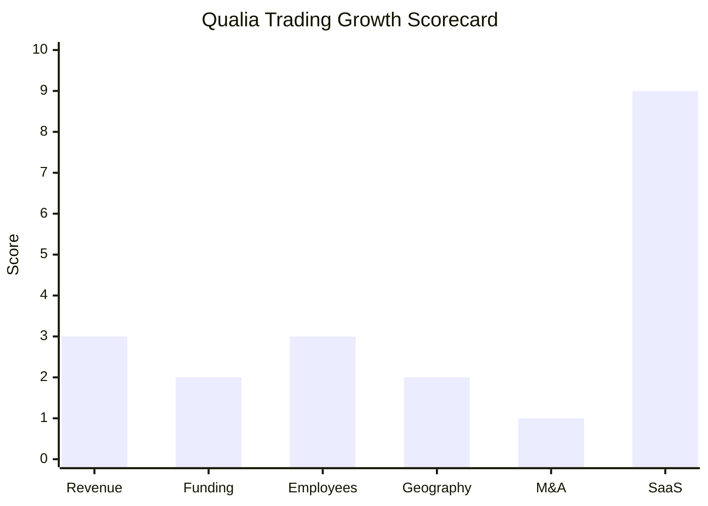

# Financial & Growth Deep-Dive - Qualia Trading (Qualia Technologies Limited)

**Research Date**: 2026-02-15
**Data Availability**: Low (private UK limited company, bootstrapped/self-funded, no public filings beyond Companies House, no Crunchbase/PitchBook records)

## Key Discovery

**CTO Tim Harrison previously founded Igloo Trading Solutions (2015)**, a cloud-native CTRM/ETRM platform that was **acquired by Brady Technologies in October 2021**. Harrison brings 20 years of experience building trading systems at Enron, Lehman Brothers, Barclays, and Mercuria. This gives Qualia significant credibility -- the CTO has already built and exited an ETRM platform in the same market segment. The parallels between Igloo and Qualia (cloud-native, rapid deployment, same target market) suggest Qualia is Harrison's "second act" with lessons learned from Igloo's lifecycle.

---

### Revenue Timeline

| Year | Revenue | Currency | EUR Equivalent | YoY Growth | Source | Confidence |
| --- | --- | --- | --- | --- | --- | --- |
| 2026 (est.) | Unknown | GBP | Unknown | N/A | No disclosure | Unknown |
| 2025 | Unknown | GBP | Unknown | N/A | No disclosure | Unknown |
| 2024 | Unknown | GBP | Unknown | N/A | No disclosure | Unknown |

**Revenue CAGR (3yr)**: Unknown -- no revenue data available
**Revenue CAGR (5yr)**: N/A -- company appears to be ~1-2 years old

**Revenue Estimation (Proxy Method)**:
Using the proxy metric from the prompt guidelines (employee count x EUR 150-250K):
- If Qualia has ~5-10 employees (estimated based on 2-person founding team + small dev team): **EUR 0.75M - 2.5M estimated revenue** (wide range, very low confidence)
- Given they have a live client login portal (app.qualiatrading.ai) and customer testimonials, the platform is generating some revenue, but likely pre-significant-revenue stage
- The "zero upfront cost" pricing model suggests subscription-based SaaS revenue that ramps slowly

**Note**: No revenue data found in UK Companies House filings, Crunchbase, PitchBook, press releases, or industry publications. Company does not appear in Chartis ETRM Systems 2024 vendor landscape report.

#### Revenue Trend Chart

*Skipped -- fewer than 2 confirmed data points available.*

### Profitability

| Data Point | Value | Source | Confidence |
| --- | --- | --- | --- |
| EBITDA (current) | Unknown | No disclosure | Unknown |
| EBITDA Margin | Unknown | No disclosure | Unknown |
| Net Profit / Loss | Likely loss-making (early-stage startup) | Estimated from stage | Estimated |
| Recurring Revenue % | ~100% (SaaS-only model) | qualiatrading.ai pricing FAQ | Estimated |
| SaaS Revenue % | ~100% | qualiatrading.ai (cloud-only, no on-prem) | Confirmed |
| Revenue per Employee | Unknown | No data | Unknown |

### Funding & Investment History

| Date | Round | Amount | Lead Investor(s) | Valuation | Source | Confidence |
| --- | --- | --- | --- | --- | --- | --- |
| N/A | No recorded funding rounds | N/A | N/A | N/A | Crunchbase/PitchBook/press search | Confirmed (absence) |

**Total Raised**: No externally recorded funding
**Latest Valuation**: Unknown -- no valuation data available
**Current Investors**: None publicly known
**War Chest Signals**: None visible

**Funding Assessment**:
- No Crunchbase, PitchBook, or CB Insights records exist for "Qualia Trading" or "Qualia Technologies Limited" as an energy trading company
- No press releases announcing funding rounds were found
- No VC or PE investor mentions were found
- This strongly suggests the company is **bootstrapped or self-funded** by the founders
- Tim Harrison's exit from Igloo (acquired by Brady Technologies 2021) likely provided personal capital for the new venture
- Mohammed Alanizi's background (CEO) could not be traced -- may bring domain capital from energy trading

### Employee Timeline

| Year | Headcount | YoY Growth | Source | Confidence |
| --- | --- | --- | --- | --- |
| 2026 (current) | ~5-15 est. | N/A | Estimated from website/team page | Estimated (proxy) |
| 2025 | ~2-10 est. | N/A | Website copyright 2025 = founding year | Estimated (proxy) |
| 2024 | ~1-2 est. | N/A | Founding/development phase | Estimated (proxy) |

**Employee CAGR (3yr)**: N/A -- company is ~1-2 years old
**Current Open Positions**: 0 visible (no careers page on qualiatrading.ai, no job postings found on LinkedIn/Indeed)
**Hiring Hotspots**: London, UK (registered address: 16 Southern Road, London N2 9LE)

**Employee Estimation Methodology**:
- Website lists 2 named team members: Mohammed Alanizi (CEO) and Tim Harrison (CTO)
- No careers page exists on the website
- No LinkedIn company page found with employee count
- No job postings found on major job boards
- The company has a live product with client login portal, suggesting at minimum a small development team
- Customer support hours quoted as "9am-5pm UK time, Mon-Fri" with "dedicated Customer Support Manager" -- implies at least 1-2 support staff
- Estimated range: 5-15 total (2 founders + 3-8 developers + 1-3 support/ops + possibly 1-2 sales)

#### Employee Growth Chart

*Skipped -- fewer than 2 confirmed data points available.*

### Geographic & Market Expansion

| Year | Expansion Event | Details | Source | Confidence |
| --- | --- | --- | --- | --- |
| 2025 | UK launch | Platform launched from London, UK | qualiatrading.ai | Confirmed |
| 2025 | Global exchange connectivity | Connections to major global exchanges and OTC markets | qualiatrading.ai platform page | Confirmed |

**International Revenue %**: Unknown
**Expansion Trajectory**: Single-country launch (UK) with global ambition signaled by multi-exchange connectivity and support for 15+ commodity types across energy, metals, agricultural, and FX. No evidence of physical offices or dedicated sales teams outside UK. The "9am-5pm UK time" support hours suggest operations are currently UK-centric.

### M&A Activity

| Date | Target | Deal Size | Capability Gained | Strategic Rationale | Source | Confidence |
| --- | --- | --- | --- | --- | --- | --- |
| None | N/A | N/A | N/A | N/A | N/A | Confirmed (absence) |

**Divestitures**: None
**M&A Pattern**: No M&A activity. As an early-stage bootstrapped startup, Qualia is focused on organic product development. The CTO's prior company (Igloo) was itself an acquisition target (acquired by Brady Technologies, 2021), which could signal that Qualia is being built with a similar trajectory in mind -- build a differentiated cloud ETRM, attract customers, position for acquisition.

### SaaS Transition Metrics

| Data Point | Value | Source | Confidence |
| --- | --- | --- | --- |
| Deployment Model | Cloud-native SaaS (only) | qualiatrading.ai | Confirmed |
| Cloud Revenue % (current) | 100% | No on-prem option offered | Confirmed |
| Cloud Revenue % (1yr ago) | 100% | Born cloud-native | Confirmed |
| Recurring Revenue % | ~100% (subscription model, modular pricing) | qualiatrading.ai FAQ | Estimated |
| Platform Stack | Cloud-native, AI-powered (specific technologies undisclosed) | qualiatrading.ai | Confirmed |
| Migration Status | N/A -- born cloud-native, no migration needed | qualiatrading.ai | Confirmed |

### Growth Scorecard

| Dimension | Score (1-10) | Evidence Summary |
| --- | --- | --- |
| Revenue Growth | 3 | No revenue data; early-stage with zero-upfront-cost model suggests slow initial ramp. Proxy estimates EUR 0.75-2.5M. |
| Funding Momentum | 2 | No external funding recorded; appears bootstrapped from founder capital (Tim Harrison's Igloo exit). |
| Employee Growth | 3 | Estimated 5-15 employees from ~2 founders; no visible hiring activity or careers page. |
| Geographic Expansion | 2 | UK-only operations; global exchange connectivity is aspirational, not proven geographic expansion. |
| M&A Activity | 1 | No M&A activity; too early-stage for acquisitions. |
| SaaS Maturity | 9 | Cloud-native from founding, 100% SaaS, modular subscription pricing, same-day deployment. |
| **COMPOSITE SCORE** | **3.3** | **Classification: Steady** |

**Classification Thresholds**:
- **Rocket** (avg 7.0-10.0): Explosive growth, heavy investment, market disruptor
- **Riser** (avg 5.0-6.9): Strong growth signals, investing in future, accelerating
- **Steady** (avg 3.0-4.9): Stable but not transforming, evolutionary
- **Dinosaur** (avg 1.0-2.9): Flat or declining, legacy mode, no visible investment

**Composite Score Commentary**: The 3.3 composite is misleading -- Qualia is a genuinely innovative early-stage venture that scores "Steady" primarily due to data absence, not actual stagnation. The 9/10 SaaS Maturity score (cloud-native from founding) and the CTO's proven track record (built and exited Igloo to Brady Technologies) signal much higher potential than the composite suggests. If Qualia secures funding and starts hiring visibly, the composite could jump to Riser (5.0-6.9) rapidly. Watch for: first funding announcement, first named customer win, LinkedIn company page creation, careers page launch.

#### Growth Scorecard Radar

> The bar chart reveals Qualia's defining characteristic: extreme SaaS maturity (9/10) from a cloud-native founding, contrasted with near-zero scores across funding, geographic expansion, and M&A -- the typical profile of an early-stage bootstrapped startup that hasn't yet entered its growth phase. The CTO's prior exit (Igloo -> Brady Technologies) is the wild card that makes this profile more interesting than it appears.

---

### Research Notes & Data Gaps

**What we know with confidence**:
- Legal entity: Qualia Technologies Limited (UK, London N2 9LE)
- CEO: Mohammed Alanizi; CTO: Tim Harrison
- Tim Harrison previously founded Igloo Trading Solutions (2015), acquired by Brady Technologies (Oct 2021)
- Product is live with a client login portal (app.qualiatrading.ai)
- Customer testimonials exist (referencing "intuitive design" and "outstanding support")
- Cloud-native, 100% SaaS, modular pricing
- Copyright 2025 on website -- suggests 2024-2025 founding
- UK support hours (9am-5pm GMT, Mon-Fri)
- "Project Qualia" (projectqualia.co.uk) appears to be the same platform under development codename

**What we cannot determine**:
- Exact founding date
- Revenue (any year)
- Headcount (beyond 2 named founders)
- Funding status (bootstrapped is assumed, not confirmed)
- Customer count
- Mohammed Alanizi's professional background
- Relationship between "Project Qualia" and "Qualia Trading" branding

**Signals to watch**:
1. First external funding round announcement
2. LinkedIn company page creation with employee count
3. Careers page launch on qualiatrading.ai
4. Named customer wins or case studies
5. Appearance in Chartis ETRM vendor landscape reports
6. Expansion of support hours beyond UK business hours
7. Industry conference presence (Energy Trading Week, E-world, etc.)
