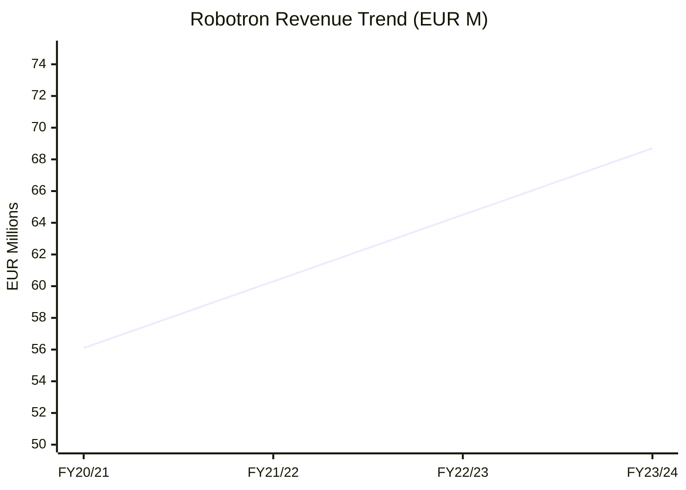
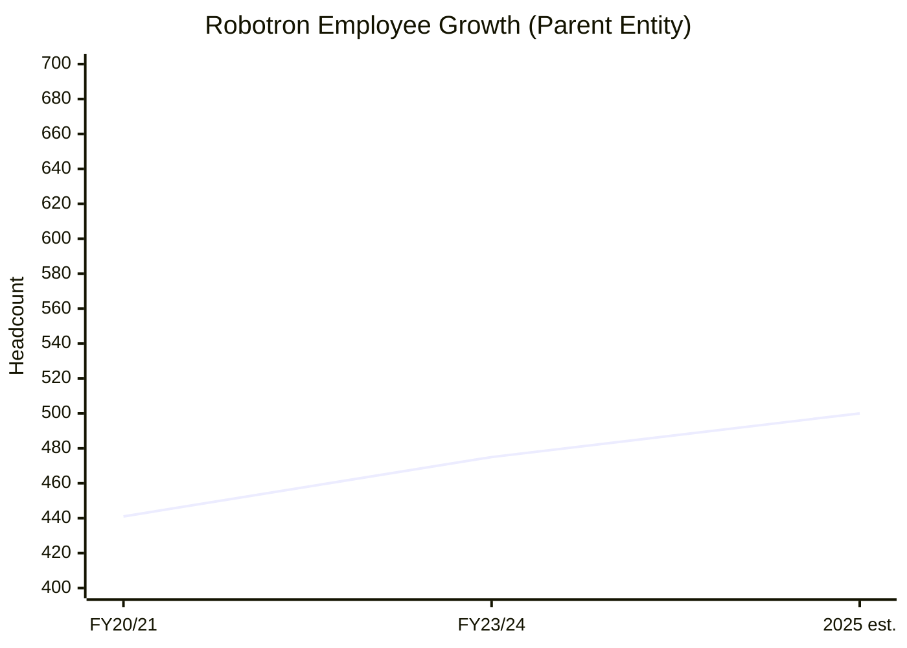
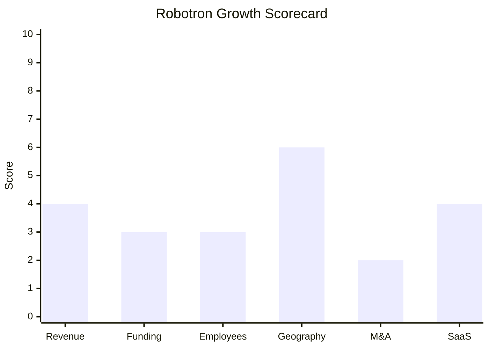

# Financial & Growth Deep-Dive - Robotron Datenbank-Software GmbH

**Research Date**: 2026-02-15
**Data Availability**: Low (private family-owned GmbH; limited public financial disclosures; revenue from company press information and Bundesanzeiger filings)

---

### Revenue Timeline

| Year | Revenue | Currency | EUR Equivalent | YoY Growth | Source | Confidence |
| --- | --- | --- | --- | --- | --- | --- |
| FY2024/25 (est.) | ~EUR 72-75M | EUR | ~EUR 72-75M | ~5-9% | Estimated from trajectory | Estimated |
| FY2023/24 | EUR 68.7M | EUR | EUR 68.7M | — | Robotron press/company information | Confirmed |
| FY2022/23 | Unknown | — | — | — | No public data | Unknown |
| FY2021/22 | Unknown | — | — | — | No public data | Unknown |
| FY2020/21 | EUR 56.1M | EUR | EUR 56.1M | — | Northdata / max-talent.de | Confirmed |
| FY2019/20 | Unknown | — | — | — | No public data | Unknown |

**Note on Fiscal Year**: Robotron's fiscal year runs June 1 to May 31 (confirmed via Northdata/Bundesanzeiger annual reports filed for years ending 31/05). "FY2023/24" = June 2023 to May 2024. "FY2020/21" = June 2020 to May 2021.

**Revenue CAGR (3yr)**: ~7.0% (FY2020/21 to FY2023/24: EUR 56.1M to EUR 68.7M over 3 fiscal years)
**Revenue CAGR (5yr)**: Unknown (insufficient data points)

**Revenue Gap Analysis**: Only 2 confirmed data points exist (FY2020/21 and FY2023/24). As a German GmbH, Robotron files annual accounts with the Bundesanzeiger, but detailed revenue figures require Northdata Premium or direct Handelsregister access. The 22.5% cumulative growth over 3 years implies consistent but unspectacular single-digit annual growth.

#### Revenue Trend Chart

*Note: FY21/22 and FY22/23 values are linear interpolations for visualization purposes only. Actual growth trajectory may differ.*

---

### Profitability

| Data Point | Value | Source | Confidence |
| --- | --- | --- | --- |
| EBITDA (current) | Unknown | Not publicly disclosed | Unknown |
| EBITDA Margin | Unknown | Not publicly disclosed | Unknown |
| Net Profit / Loss | Unknown (profitable implied by sustained growth, no funding, family dividend) | Inference from business model | Estimated |
| Recurring Revenue % | Unknown | Not publicly disclosed | Unknown |
| SaaS Revenue % | Unknown | Not publicly disclosed | Unknown |
| Revenue per Employee (parent) | EUR 144,600 | Calculated: EUR 68.7M / 475 employees (FY2023/24) | Confirmed |
| Revenue per Employee (group est.) | EUR 106,000-115,000 | Calculated: EUR 68.7M / ~600-650 group employees | Estimated |

**Profitability Assessment**: As a 35-year-old family-owned company with no external funding and sustained investment (new building, NZ expansion, product development), Robotron is almost certainly profitable. The revenue-per-employee of EUR 144.6K (parent entity) is below the software industry norm of EUR 150-250K, suggesting a services-heavy business model with lower margins than pure software companies. The parent-only revenue divided by group headcount (~EUR 106-115K) indicates consolidated group revenue may be higher than EUR 68.7M when including subsidiary revenues.

---

### Funding & Investment History

| Date | Round | Amount | Lead Investor(s) | Valuation | Source | Confidence |
| --- | --- | --- | --- | --- | --- | --- |
| 1990 | Founding (MBO) | Unknown | Dr. Rolf Heinemann (Management Buy-Out from VEB Robotron) | N/A | Company history | Confirmed |
| 1993-2005 | Oracle stake | Unknown | Oracle Corporation (minority stake) | Unknown | max-talent.de, company history | Confirmed |
| 2005 | Oracle buyback | Unknown | Heinemann family (repurchased Oracle shares) | N/A | max-talent.de | Confirmed |

**Total Raised**: EUR 0 (external). Self-funded since founding. Oracle had a stake from ~1993-2005 (likely from the Oracle partnership era), which was repurchased by the family in 2005.
**Latest Valuation**: Not applicable (private, no valuations)
**Current Investors**: Heinemann family (100% ownership -- Dr. Rolf Heinemann founder, Ulf Heinemann, Bjorn Heinemann as Managing Directors)
**War Chest Signals**: Unknown. No public balance sheet data. As a profitable company with no debt obligations visible, likely has moderate cash reserves. Conservative growth strategy suggests self-funding capacity for organic expansion.

**Government Grants**:

| Grant | Amount | Purpose | Source | Confidence |
| --- | --- | --- | --- | --- |
| SISSY | EUR 507,803 | SMGW as a safety anchor for control in a system network | Northdata / government funding database | Confirmed |
| digiTechNetz | EUR 1,022,958 | Digitalization technologies for operational management of low-voltage grids | Northdata / government funding database | Confirmed |
| BMU e-mobility | EUR 5,360 | Procurement of e-vehicles ("Clean Air" programme) | Northdata | Confirmed |

**Total Government Funding**: ~EUR 1.54M (research grants, not equity funding)

---

### Employee Timeline

| Year | Headcount | Scope | YoY Growth | Source | Confidence |
| --- | --- | --- | --- | --- | --- |
| 2025 (current) | ~650 | Group-wide (all subsidiaries) | ~5-8% | Career page (karriere.robotron.de) | Estimated |
| FY2023/24 | 475 | Parent entity (German GmbH average) | +7.7% | Robotron press/company information | Confirmed |
| FY2020/21 | 441 | Parent entity | — | max-talent.de investor section | Confirmed |
| 2020 | 554+ | Group-wide (incl. VOCUS from Jan 2020) | — | Company website (30yr anniversary) | Confirmed |
| 2017/18 | 560+ | Group-wide | — | Company website (new building press release) | Confirmed |
| 2024 (NZ) | 30 | NZ subsidiary only | — | robotron.co.nz/about-us | Confirmed |
| 2023 (NZ) | 12 | NZ subsidiary only (Christchurch opening) | — | robotron.co.nz news | Confirmed |
| 1990 | 26 | Founding team | N/A | Company history | Confirmed |

**Employee CAGR (3yr, parent)**: ~2.5% (FY2020/21: 441 to FY2023/24: 475)
**Employee CAGR (5yr, group est.)**: ~3.3% (2020: ~554 to 2025: ~650)
**Current Open Positions**: Not enumerated (German-language careers portal at karriere.robotron.de; positions posted in Software Development, IT Consulting, Technology & Sales)
**AI/ML/Data Science Roles**: Job postings mention Oracle ML/Azure ML knowledge requirements; no dedicated AI/Data Science team roles visible publicly
**Hiring Hotspots**: Dresden (HQ), Berlin, New Zealand (Auckland/Christchurch), Australia (new market entry)

**Employee Count Reconciliation**: The 560 (2017/18) and 554 (2020) group figures vs 441 (2021) and 475 (FY2023/24) parent figures are not contradictory. The group figure includes all subsidiaries: NZ (~30), Czech Republic (Prague office), Switzerland (Wil), Austria (Vienna), VOCUS, OWIGWARE, AESOB, SASKIA. The parent GmbH figure captures only German employees. Estimated current group headcount of ~650 aligns with career page claim.

#### Employee Growth Chart

*Note: Limited data points. 2025 estimate is parent-only (~500), vs group-wide ~650.*

---

### Geographic & Market Expansion

| Year | Expansion Event | Details | Source | Confidence |
| --- | --- | --- | --- | --- |
| 2025 | Australia market entry | Exhibited at Australian Energy Week 2025; marketing Australasian energy platform positioning | robotron.de/au | Confirmed |
| 2025 | NZ: Lodestone Energy partnership | Selected as key software partner for NZ's largest solar energy developer | robotron.co.nz news | Confirmed |
| 2025 | NZ: Pulse Energy | Portfolio management services partnership | robotron.co.nz news | Confirmed |
| 2025 | GEANT framework (EU-wide) | Exclusive Oracle Cloud Infrastructure sales/service partner for Germany under European GEANT OCRE 2024 framework (until 2030) | Robotron press release | Confirmed |
| 2024 | NZ: Mercury NZ Ltd | Signed NZ's largest electricity retailer for commercial billing platform (7,000 ICPs) | reseller.co.nz, robotron.co.nz | Confirmed |
| 2023 | NZ: Christchurch office | New office in Sydenham, Christchurch; grew NZ team from 12 to 30 | robotron.co.nz news | Confirmed |
| 2020 | VOCUS acquisition (DE) | Acquired VOCUS Computer- und Softwaresysteme GmbH (Vogtland); public administration focus | Company history page | Confirmed |
| 2017 | NZ subsidiary established | Robotron New Zealand Limited founded; Auckland office | Company history / robotron.co.nz | Confirmed |
| 2004 | Switzerland subsidiary | Robotron Schweiz GmbH established in Wil | Company history / max-talent.de | Confirmed |
| 1993 | Czech Republic subsidiary | Robotron Database Solutions s.r.o. established in Prague | robotron.cz/about-us | Confirmed |

**International Revenue %**: Unknown (not disclosed)
**Expansion Trajectory**: Robotron follows a deliberate, conservative geographic expansion pattern. After 25+ years in DACH + Czech Republic, the company entered New Zealand in 2017 and has built a meaningful presence there (30 staff, Mercury NZ, Lodestone, Pulse). Australia is the newest target (2025). Expansion targets English-speaking Oceanian markets rather than adjacent European ones -- possibly due to less entrenched competition and simpler market entry vs. entering NL, Nordics, or UK which have established competitors. No signals of interest in Dutch, Nordic, or Southern European markets.

---

### M&A Activity

| Date | Target | Deal Size | Capability Gained | Strategic Rationale | Source | Confidence |
| --- | --- | --- | --- | --- | --- | --- |
| Jan 2020 | VOCUS Computer- und Softwaresysteme GmbH | Undisclosed (small) | Public administration software, eGovernment solutions | Portfolio expansion into government sector; geographic coverage in Vogtland region | Company history page | Confirmed |

**Divestitures**: None identified
**M&A Pattern**: Minimal. One small tuck-in acquisition in 5+ years. Robotron's family-owned, self-funded model prioritizes organic growth over acquisitive expansion. The VOCUS deal was a capability adjacency move (government IT), not a transformative acquisition. No M&A pipeline signals detected.

**Subsidiary Portfolio** (8-9 entities per Northdata consolidated reports):

| Subsidiary | Location | Focus |
| --- | --- | --- |
| Robotron New Zealand Limited | Auckland/Christchurch, NZ | Energy market platform for NZ/AU |
| Robotron Database Solutions s.r.o. | Prague, Czech Republic | Database solutions, Central Europe |
| Robotron Schweiz GmbH | Wil, Switzerland | DACH market operations |
| Robotron Austria GmbH | Austria | Austrian market |
| HAKOM Solutions GmbH (formerly HAKOM Time Series GmbH) | Austria | Time series data management |
| VOCUS Computer- und Softwaresysteme GmbH | Vogtland, Germany | Public administration IT |
| OWIGWARE GmbH | Germany | Software (details limited) |
| AESOB Energiedienstleistungs-GmbH | Germany | Energy services |
| SASKIA Informations-Systeme GmbH | Germany | Information systems |

---

### SaaS Transition Metrics

| Data Point | Value | Source | Confidence |
| --- | --- | --- | --- |
| Deployment Model | Hybrid: SaaS, PaaS, IaaS + On-premise | Cloud services page | Confirmed |
| Cloud Revenue % (current) | Unknown | Not publicly disclosed | Unknown |
| Cloud Revenue % (1yr ago) | Unknown | Not publicly disclosed | Unknown |
| Cloud Revenue % (2yr ago) | Unknown | Not publicly disclosed | Unknown |
| Recurring Revenue % | Unknown (estimated <30% based on business model) | Inference from services-heavy model | Estimated |
| Platform Stack | Oracle Database (core), Java/Eclipse RCP, Oracle SQL/PL-SQL, Oracle Cloud Infrastructure (OCI), Microsoft Azure ML, Microsoft Dynamics 365 (finance module) | Job postings, product pages | Confirmed |
| Migration Status | In-progress (hybrid; own data center + OCI offerings expanding) | Product pages, GEANT contract | Estimated |

**SaaS Assessment**: Robotron's cloud strategy is built on Oracle Cloud Infrastructure (OCI), not cloud-native architecture. The core energy platform remains Oracle Database-dependent (Java/Eclipse RCP client). Cloud offerings are primarily hosting/managed services on OCI, not a re-architected SaaS product. The GEANT framework contract (2025-2030) positions Robotron as an OCI reseller/service provider for research institutions, which diversifies revenue but is not evidence of product SaaS transition. The own data center in Dresden (ISO 27001) remains central to operations. On-premise installations likely still dominate, especially for large utility customers (E.ON, EnBW) who may require on-premise for regulatory/security reasons. The dynamic tariff toolkit and Smart Energy App (PWA) are the most cloud-forward product elements.

---

### Growth Scorecard

| Dimension | Score (1-10) | Evidence Summary |
| --- | --- | --- |
| Revenue Growth | 4 | 3yr CAGR ~7% (EUR 56.1M to EUR 68.7M); solid but modest single-digit growth |
| Funding Momentum | 3 | Zero external funding; family bootstrap with profitability; EUR 1.5M in government research grants |
| Employee Growth | 3 | Parent CAGR ~2.5% (3yr); group CAGR ~3.3% (5yr); stable but not aggressive hiring |
| Geographic Expansion | 6 | NZ deepened significantly (Mercury, Lodestone, Pulse, 30 staff); Australia new entry 2025; active Oceanian push |
| M&A Activity | 2 | One small tuck-in (VOCUS 2020) in 5+ years; no M&A pipeline signals; organic growth focus |
| SaaS Maturity | 4 | Hybrid model with own data center; Oracle DB core (not cloud-native); OCI offerings growing; estimated <30% recurring |
| **COMPOSITE SCORE** | **3.67** | **Steady: Stable family-owned enterprise with conservative growth, strong NZ/AU expansion but no transformative investment** |

**Classification**: **Steady** (avg 3.0-4.9): Stable but not transforming, evolutionary

#### Growth Scorecard Radar

> The bar chart reveals Robotron's "fingerprint": strongest in Geographic Expansion (NZ/AU push is genuinely impressive for a family-owned GmbH) but weak in M&A Activity and Funding Momentum. The Revenue, Employee, and SaaS dimensions cluster around 3-4, reflecting steady-state operations without transformation signals.

---

### Key Insights for Eneve

1. **Not a Rocket, Not a Dinosaur**: Robotron is the archetype of a "Steady" competitor -- profitable, growing modestly, expanding internationally at its own pace. With EUR 68.7M revenue and ~650 employees, it is substantially larger than Eneve but not accelerating.

2. **NZ/AU Playbook is Notable**: Robotron's entry into New Zealand (2017) and growth to 30 staff with Mercury NZ, Lodestone, and Pulse Energy is the most interesting growth story. This demonstrates the company's ability to enter new national markets and win major utility customers far from home base. If Robotron applied this playbook to European markets, it would be more threatening.

3. **Oracle Lock-In is Both Moat and Anchor**: The deep Oracle Database dependency creates switching costs for existing customers but limits cloud-native transformation. Robotron cannot easily pivot to a modern microservices/cloud-native architecture without significant replatforming investment.

4. **Conservative by Design**: The family-owned, self-funded model deliberately avoids VC/PE pressure for aggressive growth. This means Robotron will not suddenly become a "Rocket" -- but it also means the company is financially stable and unlikely to disappear or be acquired.

5. **Revenue per Employee Signals Services-Heavy Model**: At EUR 144.6K/employee (parent), Robotron's revenue efficiency is below the EUR 150-250K software industry norm, suggesting significant professional services and managed operations revenue alongside software licensing.

---

### Sources

| Source | URL | Data Retrieved |
| --- | --- | --- |
| Robotron company website | robotron.de/en | Company overview, products, structure |
| Robotron press information | robotron.de/unternehmen/aktuelles/mediathek/presse-und-unternehmensinformation | Revenue FY2023/24, employee count |
| max-talent.de company profile | max-talent.de/companyProfile/68bb407da44381006465b50d | Revenue 2021, employee 2021, founding history |
| Northdata company profile | northdata.com/Robotron (HRB 1947) | Fiscal year dates, annual report filings, government grants, subsidiary list |
| Robotron New Zealand | robotron.co.nz | NZ employee count, office expansion, customer wins |
| Robotron Czech Republic | robotron.cz/en/about-us | Czech subsidiary details |
| Robotron careers | karriere.robotron.de/en | Employee count claim (~650), hiring signals |
| EnBW CLS press release | robotron.de (news, May 2025) | EnBW contract win |
| GISA partnership | robotron.de (news, Nov 2023) | Strategic partnership expansion |
| GEANT framework | robotron.de (news, Feb 2025) | Oracle Cloud framework contract |
| Mercury NZ announcement | reseller.co.nz (June 2024) | Mercury NZ customer win details |
| Robotron history page | robotron.de/en/company/about-robotron/history | VOCUS acquisition, founding, milestones |
| energate messenger | energate-messenger.com | Dynamic tariffs partnership |
| AeroLeads | aeroleads.com | Employee count reference (172) |
| RocketReach | rocketreach.co | Employee count reference (294), management team |
