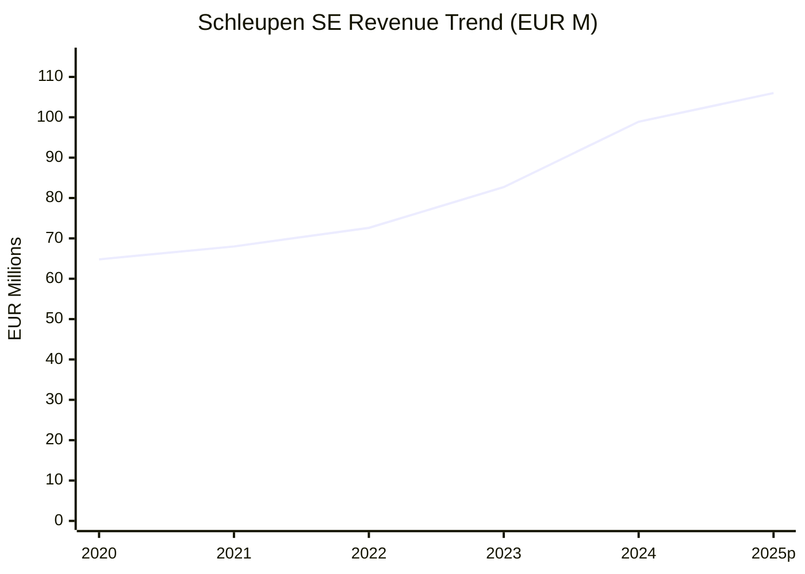
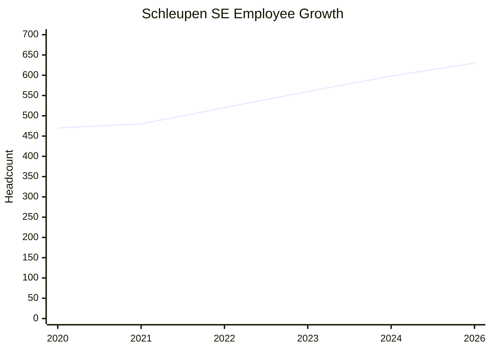
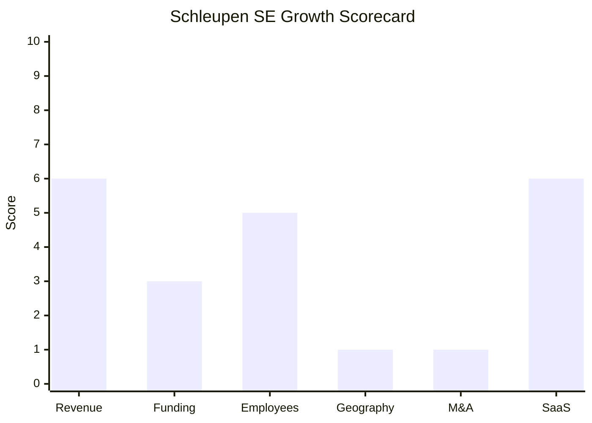

# Financial & Growth Deep-Dive - Schleupen SE

**Research Date**: 2026-02-15 (refreshed)
**Data Availability**: Medium (private company but publishes annual report / Geschäftsbericht with full P&L and balance sheet)

---

### Revenue Timeline

| Year | Revenue | Currency | EUR Equivalent | YoY Growth | Source | Confidence |
| --- | --- | --- | --- | --- | --- | --- |
| 2025 (plan) | EUR 106.0M | EUR | EUR 106.0M | +7.2% | Geschäftsbericht 2024 outlook | Confirmed (guidance) |
| 2024 | EUR 98.9M | EUR | EUR 98.9M | +19.6% | Geschäftsbericht 2024 (schleupen-geschaeftsbericht.de) | Confirmed |
| 2023 | EUR 82.7M | EUR | EUR 82.7M | +13.9% | Geschäftsbericht 2024 prior-year comparison | Confirmed |
| 2022 | EUR 72.6M | EUR | EUR 72.6M | +12.0% est. | softguide.de | Confirmed |
| 2021 | ~EUR 68M | EUR | ~EUR 68M | ~+5% est. | Estimated (interpolation between 2020 and 2022) | Estimated |
| 2020 | EUR 64.8M | EUR | EUR 64.8M | - | firmenpresse.de (SE conversion press release) | Confirmed |
| 2011 | EUR 60M+ | EUR | EUR 60M+ | - | firmenpresse.de (Bilanz 2011 press release) | Confirmed |

**Revenue CAGR (2yr, 2022-2024)**: 16.7%
**Revenue CAGR (4yr, 2020-2024)**: 11.2%
**Revenue CAGR (13yr, 2011-2024)**: ~3.9% (long-term trend; growth accelerated sharply post-2022)

#### Revenue Breakdown 2024

| Revenue Segment | 2024 (EUR M) | 2023 (EUR M) | YoY Change | % of Total (2024) |
| --- | --- | --- | --- | --- |
| SaaS & Cloud | 14.5 | n/a (new segment) | n/a | 14.7% |
| Services | 34.1 | 35.2 | -3.1% | 34.5% |
| Maintenance & Rent | 33.0 | 31.7 | +4.1% | 33.4% |
| Licenses | 15.4 | 13.5 | +14.1% | 15.6% |
| Hardware | 1.7 | 2.3 | -26.1% | 1.7% |
| **Total** | **98.9** | **82.7** | **+19.6%** | **100%** |

> SaaS & Cloud was reported as a separate line item for the first time in 2024. Previously these revenues were included within Services and Maintenance. The apparent decline in Services (-3.1%) reflects this reclassification, not an actual drop -- pure services revenue actually increased. Hardware continues its multi-year decline as workloads shift to cloud.

#### Revenue Trend Chart

---

### Profitability

| Data Point | Value | Source | Confidence |
| --- | --- | --- | --- |
| EBIT (2024) | EUR 8.9M | Geschäftsbericht 2024 | Confirmed |
| EBIT Margin (2024) | 9.0% | Geschäftsbericht 2024 | Confirmed |
| EBIT (2023) | EUR 7.7M | Geschäftsbericht 2024 prior-year | Confirmed |
| EBIT Margin (2023) | 9.3% | Geschäftsbericht 2024 prior-year | Confirmed |
| Pre-Tax Profit (2024) | EUR 9.1M | Geschäftsbericht 2024 | Confirmed |
| Pre-Tax Profit (2023) | EUR 7.9M | Geschäftsbericht 2024 prior-year | Confirmed |
| Net Profit (2024) | EUR 6.2M | Geschäftsbericht 2024 | Confirmed |
| Net Profit (2023) | EUR 5.4M | Geschäftsbericht 2024 prior-year | Confirmed |
| Recurring Revenue % (2024) | 59.3% | Geschäftsbericht 2024 | Confirmed |
| SaaS/Cloud Revenue % (2024) | 14.7% (EUR 14.5M) | Geschäftsbericht 2024 | Confirmed |
| Revenue per Employee (2024) | EUR 165K | Calculated: 98.9M / 598 | Calculated |
| Personnel Costs (2024) | EUR 50.1M (50.6% of revenue) | Geschäftsbericht 2024 | Confirmed |
| Personnel Costs (2023) | EUR 45.9M (55.5% of revenue) | Geschäftsbericht 2024 prior-year | Confirmed |
| Material Costs (2024) | EUR 21.5M (21.7% of revenue) | Geschäftsbericht 2024 | Confirmed |
| Material Costs (2023) | EUR 12.1M (14.6% of revenue) | Geschäftsbericht 2024 prior-year | Confirmed |

> Both 2023 and 2024 were planned as "investment years" (Investitionsjahre) with intentionally lower EBIT margins. Despite this, EBIT grew from EUR 7.7M to EUR 8.9M (+15.6%) as revenue growth outpaced investment spending. The sharp increase in material costs (EUR 12.1M to EUR 21.5M) reflects growing use of third-party cloud infrastructure (AWS) and partner services as the SaaS model scales.

---

### Funding & Investment History

| Date | Round | Amount | Lead Investor(s) | Valuation | Source | Confidence |
| --- | --- | --- | --- | --- | --- | --- |
| - | No external funding | - | - | - | tracxn.com, northdata.de | Confirmed |

**Total Raised**: EUR 0 (bootstrapped since 1970)
**Latest Valuation**: N/A (private, no external investment)
**Current Investors**: None (SE structure, self-funded)
**Ownership**: Private SE (Societas Europaea), registered capital EUR 4.216M. Heineke family represented on Aufsichtsrat (supervisory board) -- Heinz Heineke served 40 years until 2025 retirement; son Kersten Heineke took over his mandate (Generationswechsel completed 2025).
**Vorstand (Management Board)**: Dr. Volker Kruschinski (Vorstandsvorsitzender / CEO), Ekkehard Rosien (Vorstand)

**Balance Sheet Highlights (2024)**:

| Data Point | 2024 | 2023 | Source |
| --- | --- | --- | --- |
| Total Assets | EUR 38.4M | EUR 36.0M | Geschäftsbericht 2024 |
| Equity | EUR 11.3M | EUR 10.6M | Geschäftsbericht 2024 |
| Equity Ratio | 29.5% | 29.3% | Calculated |
| Bank Debt | EUR 10.6M | EUR 9.5M | Geschäftsbericht 2024 |
| Cash on Hand | EUR 33.5K | EUR 558.8K | Geschäftsbericht 2024 |
| Retained Earnings | EUR 6.1M | EUR 5.4M | Geschäftsbericht 2024 |

**War Chest Signals**: Very limited. Cash position is minimal (EUR 33.5K at year-end 2024, down from EUR 558.8K in 2023). Bank debt is EUR 10.6M. The company invests from operating cash flow, not from reserves. No acquisition war chest visible.

**Subsidiaries**: Optinice GmbH, Schleupen EDV GmbH, Tradui Technologies GmbH (all listed as participations in Bundesanzeiger filings)

**Government Subsidies**: Received a grant under the Forschungszulagengesetz (Research Allowance Act), amount < EUR 500K (EU state aid register)

---

### Employee Timeline

| Year | Headcount | YoY Growth | Source | Confidence |
| --- | --- | --- | --- | --- |
| 2026 (current) | 630+ | +5.4% | schleupen.de/karriere ("über 630 Mitarbeitern") | Confirmed |
| 2024 (year-end) | 598 | +6.8% | Geschäftsbericht 2024 | Confirmed |
| 2023 | ~560 | +6.8% | mittelstandcafe.de ("rund 560 Mitarbeitenden") | Confirmed |
| 2022 | ~520 | +8.3% | softguide.de, leadiq.com | Estimated |
| 2021 | ~480 | +2.1% | Estimated (AG-to-SE transition year) | Estimated |
| 2020 | ~470 | - | firmenpresse.de (SE conversion press release) | Confirmed |
| 2011 | ~430 | - | firmenpresse.de (Bilanz 2011 press release) | Confirmed |

**Employee CAGR (4yr, 2020-2024)**: 6.2%
**Employee CAGR (13yr, 2011-2024)**: ~2.6% (long-term; hiring accelerated sharply post-2022)
**Current Open Positions**: Active hiring (QA Developer, IT Administrator, HR positions visible)
**AI/ML/Data Science Open Roles**: 0 (none identified)
**Tech Stack (from job postings)**: C#, Python, JavaScript, PowerShell, .NET, SQL Server, RabbitMQ, Selenium, Robot Framework, Scrum & SAFe
**Hiring Hotspots**: Moers, Ettlingen (both German locations)
**Awards**: kununu "Top Company" 3 consecutive years (through 2024)

#### Employee Growth Chart

---

### Geographic & Market Expansion

| Year | Expansion Event | Details | Source | Confidence |
| --- | --- | --- | --- | --- |
| 2024 | Major customer win | RheinEnergie AG (large German utility) adopted Schleupen.CS | Geschäftsbericht 2024 | Confirmed |
| 2024 | Major customer win | Stadtwerke Langen GmbH | Geschäftsbericht 2024 | Confirmed |
| 2024 | Platform-as-infrastructure | AS4 solution opened to non-Schleupen ERP users, PKI certificates for other vendors | Geschäftsbericht 2024 | Confirmed |
| 2024 | adesso partnership | Strategic alliance with adesso SE for SAP co-existence in utility market | adesso.de press release | Confirmed |
| 2025 | Regulatory expansion | Schleupen.Connect Web-API for 24h supplier switch -- offered to ALL market participants | Geschäftsbericht 2024 | Confirmed |
| - | No new countries | Germany-only focus for EWW division | Multiple sources | Confirmed |
| - | GRC international (minor) | R2C_GRC has customers in FR, UK, NL, TR, BR | grc.schleupen.de | Confirmed |

**International Revenue %**: Not disclosed; estimated <5% (GRC division only)
**Expansion Trajectory**: Zero geographic expansion. Growth is purely domestic through (a) winning new German Stadtwerke customers (300+ total), (b) expanding cloud/SaaS share of wallet, and (c) offering platform infrastructure services (AS4, PKI, Web-API) to non-customers in the German market. The strategy of opening MaKo connectivity services to all market participants is a platform play, not geographic expansion.

---

### M&A Activity

| Date | Target | Deal Size | Capability Gained | Strategic Rationale | Source | Confidence |
| --- | --- | --- | --- | --- | --- | --- |
| 2024 | GIS division (divested) | Not disclosed | Exited GIS business | Focus on core EWW + GRC | Geschäftsbericht 2024 | Confirmed |

**Divestitures**: GIS business unit sold in 2024 (contributed to EUR 1.5M "other operating income")
**Acquisitions (5yr)**: None identified
**M&A Pattern**: Inward-focused. Schleupen divests non-core assets and grows organically through a Generalunternehmer (general contractor) partner ecosystem rather than acquiring capabilities:

| Partner | Product/Service | Integration | Customers |
| --- | --- | --- | --- |
| adesso SE (since Jan 2024) | SAP co-existence consulting | Joint go-to-market for SAP environments | Enterprise |
| ITC AG Dresden (since 2007) | PowerCommerce customer portal (CS.IT) | Deep integration with Schleupen.CS | 160+ |
| endios GmbH | SchleupenOne smartphone app | Integrated utility consumer app | 50+ |
| enytime green GmbH | HEMS (Home Energy Management) | Dynamic tariff marketing extension | Growing |
| CURSOR SOFTWARE AG | EVI / TINA CRM | Full managed service incl. integration | Growing |
| GET AG | EPEX day-ahead price import | Web service for dynamic pricing | Growing |
| Salesforce | CRM interfaces | API-based integration | Available |

---

### SaaS Transition Metrics

| Data Point | Value | Source | Confidence |
| --- | --- | --- | --- |
| Deployment Model | Hybrid: SaaS on AWS (primary) + on-premise available | Geschäftsbericht 2024 | Confirmed |
| Cloud Provider | AWS (Frankfurt region, 3 Availability Zones, German data law) | Geschäftsbericht 2024 | Confirmed |
| Cloud/SaaS Revenue (2024) | EUR 14.5M (14.7% of total) | Geschäftsbericht 2024 | Confirmed |
| Cloud/SaaS Revenue (2023) | Not separately reported (included in Services) | - | Unknown |
| Recurring Revenue % (2024) | 59.3% | Geschäftsbericht 2024 | Confirmed |
| Recurring Revenue % (2023) | Not explicitly stated; est. ~55% based on maintenance/rent share | Estimated | Estimated |
| Platform Stack | HTML5, BPMN 2.0, distributed databases, AWS, C#, .NET, SQL Server, RabbitMQ | Multiple sources | Confirmed |
| Platform Version | Schleupen.CS 3.0 (complete redesign) | Geschäftsbericht 2024 | Confirmed |
| Migration Status | In progress -- growing SaaS share, hardware revenue declining year-on-year | Geschäftsbericht 2024 | Confirmed |
| Hardware Revenue Decline | EUR 2.3M (2023) -> EUR 1.7M (2024), "steady multi-year decline" | Geschäftsbericht 2024 | Confirmed |

> Schleupen explicitly states that cloud/SaaS will continue growing as a share of total revenue. The 59.3% recurring revenue figure includes SaaS/Cloud (EUR 14.5M) + Maintenance/Rent (EUR 33.0M) = EUR 47.5M of the EUR 98.9M total. The remaining 40.7% is non-recurring: Services (EUR 34.1M), Licenses (EUR 15.4M), and Hardware (EUR 1.7M). The company expects "further continuous growth of recurring revenue share."

---

### Growth Scorecard

| Dimension | Score (1-10) | Evidence Summary |
| --- | --- | --- |
| Revenue Growth | 6 | 2yr CAGR 16.7% (2022-2024), 4yr CAGR 11.2% -- solid growth at high end of 10-20% band; 2024 was standout year at +19.6% |
| Funding Momentum | 3 | Zero external funding, bootstrapped since 1970; profitable (9% EBIT margin) but no VC/PE/IPO signals; tiny cash reserves |
| Employee Growth | 5 | 4yr CAGR 6.2% (470 to 598), steady hiring to 630+ by 2026; no AI/ML roles; kununu Top Company |
| Geographic Expansion | 1 | Germany-only focus for core EWW division; no new countries entered; no international expansion signals |
| M&A Activity | 1 | Zero acquisitions in 5+ years; divested GIS unit in 2024; organic growth via partnerships only |
| SaaS Maturity | 6 | 59.3% recurring revenue, AWS SaaS deployment, Schleupen.CS 3.0 platform redesign; still hybrid with license + on-prem |
| **COMPOSITE SCORE** | **3.7** | **Steady -- profitable organic grower with strong SaaS transition but zero geographic/M&A ambition** |

**Classification**: **Steady** (avg 3.0-4.9)

Schleupen is a healthy, profitable mid-market German software company growing at a solid 11-17% CAGR from its own cash flow. It has an unusually strong position in its niche (25% of German Stadtwerke) and is actively transitioning to SaaS on AWS. However, the zero-M&A, zero-funding, zero-international-expansion posture places it firmly in the "Steady" category. It is growing by deepening its German footprint, not by expanding into new markets or capabilities.

#### Growth Scorecard Radar

> The bar chart reveals Schleupen's "Steady" fingerprint: moderate-to-strong performance on operational dimensions (Revenue, Employees, SaaS) but flat-lining on expansion dimensions (Geography, M&A, Funding). This is a company optimizing within its niche, not disrupting or expanding.

---

### Regulatory Growth Drivers (from 2024 Annual Report)

| Regulatory Change | Impact on Schleupen | Timeline |
| --- | --- | --- |
| Dynamic tariffs mandatory (EnWG) | Schleupen.CS supports natively via time-series billing; competitive advantage | Jan 2025 |
| 24h-Lieferantenwechsel (24h supplier switch) | Major development project; Web-API + Verzeichnisdienst offered to ALL market participants | Jun 2025 |
| AS4 encryption in gas sector | Completed successfully in 2024; leveraged electricity sector experience | 2024 |
| XRechnung (e-invoicing B2B/B2G) | Implemented per Wachstumschancengesetz (Mar 2024) | 2024 |
| Reduced network charges (§14a EnWG) | Both reduction models implemented (flat + 60% Arbeitspreis reduction) | 2024 |
| SAP IS-U end of maintenance | Major market opportunity; adesso partnership targets SAP displacement | 2027 |

> These regulatory mandates are the primary growth engine. Each regulation forces utility companies to upgrade or switch systems, creating a migration pipeline that benefits modern platforms like Schleupen.CS 3.0. The 24h-Lieferantenwechsel in particular is described as "exceeding the scope of many other regulatory projects" -- a large development effort that also serves as a customer acquisition vehicle since Schleupen offers its Web-API/PKI infrastructure to non-customers.

---

### Key Insights for Eneve Competitive Intelligence

1. **Better data than expected**: Schleupen publishes a detailed Geschäftsbericht with full P&L, balance sheet, and segment revenue -- unusual for a private German company. This transparency suggests confidence in market position.

2. **Accelerating organic growth**: The 2024 revenue jump (+19.6%) exceeded the company's own target of EUR 93M by EUR 5.9M. This acceleration is driven by new customer wins (RheinEnergie AG) and the SAP IS-U migration wave.

3. **SAP IS-U displacement opportunity**: Schleupen explicitly positions against SAP IS-U (end of maintenance 2027). The adesso partnership provides SAP co-existence capability, targeting "best-of-breed" tenders at large utilities.

4. **Platform infrastructure play**: By opening AS4, PKI certificates, and Web-API services to non-customers, Schleupen is becoming an infrastructure provider for German MaKo, not just an ERP vendor. This mirrors Eneve's own infrastructure role in the Dutch market.

5. **No AI threat**: Confirmed zero AI investment, zero AI hiring, zero AI product features. Schleupen and Eneve share the same vulnerability to AI-native disruptors.

6. **Revenue per employee (EUR 165K)** is low relative to pure-SaaS companies but normal for a hybrid services/software company with significant professional services revenue (34.5% of total).

---

### Sources

- https://schleupen-geschaeftsbericht.de/finanzen/ (2024 Annual Report - Financials, full P&L and balance sheet)
- https://schleupen-geschaeftsbericht.de/marktentwicklung/ (2024 Annual Report - Market Development)
- https://schleupen-geschaeftsbericht.de/softwareentwicklung/ (2024 Annual Report - Software Development)
- https://schleupen-geschaeftsbericht.de/cloud-saas/ (2024 Annual Report - Cloud & SaaS)
- https://www.mittelstandcafe.de/schleupen-se-schlie-t-das-gesch-ftsjahr-2024-erfolgreich-ab-2173749.html (CEO statement, 2024 results press coverage, 2023 baseline data)
- https://www.firmenpresse.de/pressinfo2173749-schleupen-se-schlie-t-das-gesch-ftsjahr-2024-erfolgreich-ab.html (2024 fiscal year press release)
- https://www.firmenpresse.de/pressinfo1941514-aus-schleupen-ag-wird-schleupen-se.html (AG-to-SE conversion, 2020 revenue/employee data)
- https://www.firmenpresse.de/pressinfo555469-bilanz-2011-schleupenuebertrifft-umsatzgrenze-von-60-millionen-euro.html (2011 revenue benchmark)
- https://www.pressebox.de/pressemitteilung/schleupen-ag-3/generationswechsel-im-aufsichtsrat-der-schleupen-se-abgeschlossen/boxid/1268397 (Heineke family Aufsichtsrat transition 2025)
- https://www.northdata.de/Schleupen%20SE,%20Ettlingen/Amtsgericht%20Mannheim%20HRB%20741856
- https://www.softguide.de/firma/schleupen-ag
- https://www.adesso.de/en/news/presse/adesso-and-schleupen-join-forces-to-advance-digitalisation-of-utilities-market.jsp
- https://tracxn.com/d/companies/schleupen/__8iAOEPJmSGt4ruX9sAyuwWBQ1ddkR5gQxz_C1ODTFhA
- https://leadiq.com/c/schleupen-ag/5a1d7e69240000240058847a/employee-directory
- https://www.schleupen.de/karriere
- https://grc.schleupen.de/en/
