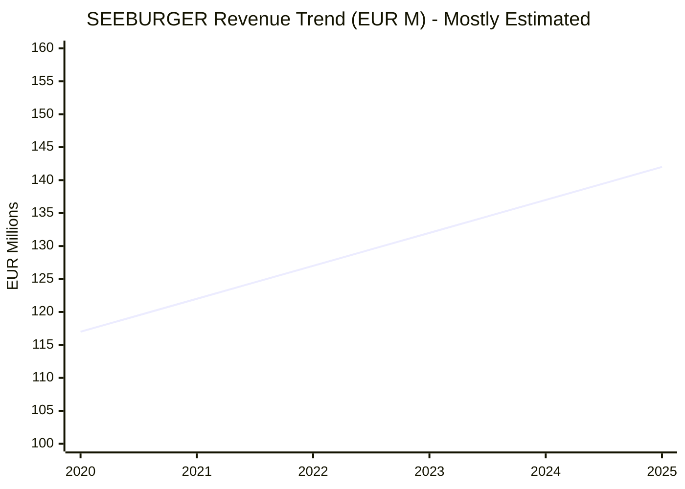
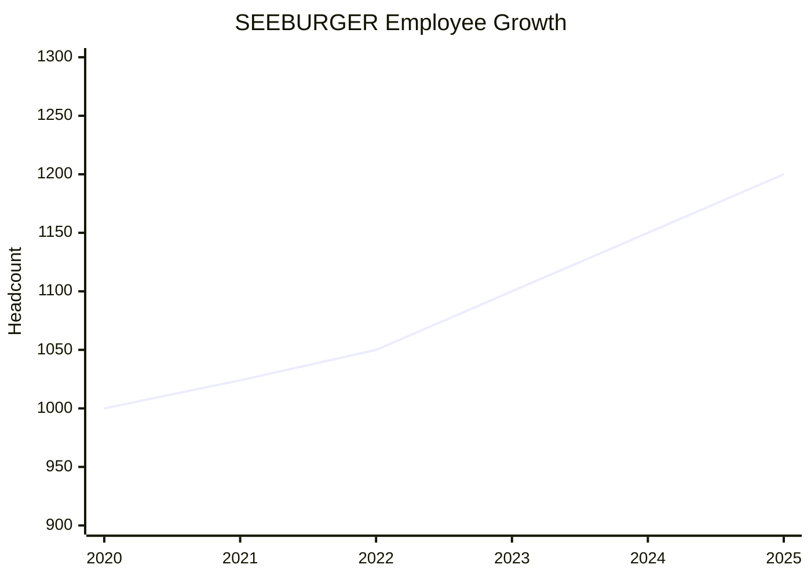
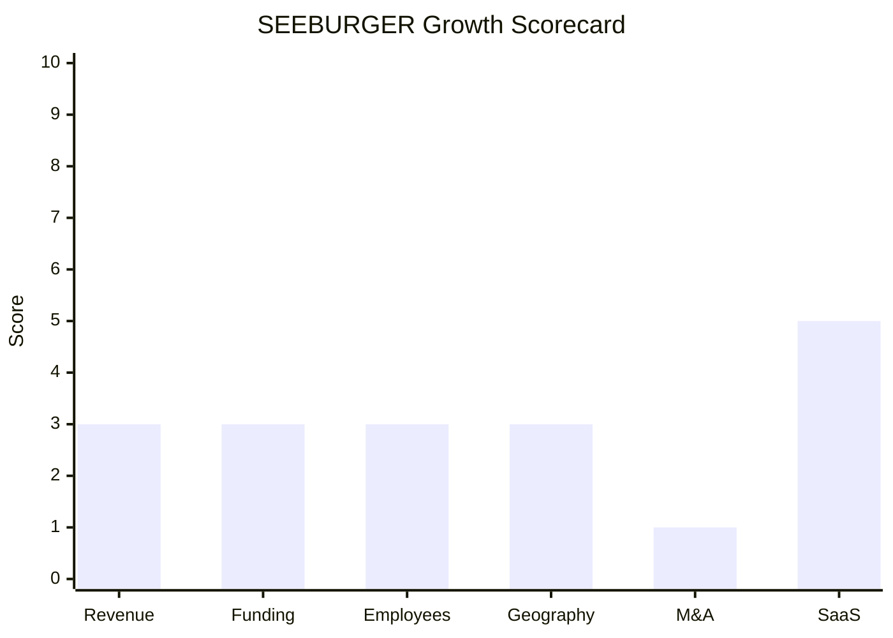

# Financial & Growth Deep-Dive - SEEBURGER AG

**Research Date**: 2026-02-15
**Data Availability**: Low (private, family-owned, unfunded since founding; no public filings, no VC disclosures, limited third-party estimates)

---

### Revenue Timeline

| Year | Revenue | Currency | EUR Equivalent | YoY Growth | Source | Confidence |
| --- | --- | --- | --- | --- | --- | --- |
| 2025 (est.) | ~EUR 142M | EUR | EUR 142M | ~4% | Proxy: headcount growth applied to 2020 base | Estimated |
| 2024 (est.) | ~EUR 137M | EUR | EUR 137M | ~4% | Proxy: interpolated from 2020 base + headcount | Estimated |
| 2023 (est.) | ~EUR 132M | EUR | EUR 132M | ~4% | Proxy: interpolated from 2020 base + headcount | Estimated |
| 2022 (est.) | ~EUR 127M | EUR | EUR 127M | ~4% | Proxy: interpolated from 2020 base + headcount | Estimated |
| 2021 (est.) | ~EUR 122M | EUR | EUR 122M | ~4% | Proxy: 1,024 employees at ~EUR 119K/employee | Estimated |
| 2020 | EUR 117M | EUR | EUR 117M | -- | Tracxn (annual report data) | Confirmed |

**Revenue CAGR (5yr, 2020-2025 est.)**: ~3.9%
**Revenue CAGR (3yr, 2022-2025 est.)**: ~3.8%

**Estimation Methodology**: Only 2020 revenue (EUR 117M) is confirmed from Tracxn's annual report data. Third-party estimates diverge widely: Growjo estimates $144.3M (~EUR 133M), Bitscale estimates $296.9M (~EUR 273M), Owler gives $100-500M range. Given the confirmed 2020 revenue and ~17% employee growth from 2021 to 2025 (1,024 to ~1,200), revenue was projected using conservative ~4% annual growth. Revenue per employee in 2020 was EUR 114K -- below typical software company averages, suggesting a significant services/consulting component.

#### Revenue Trend Chart

> Note: Only 2020 is confirmed. The trend line reflects conservative interpolation, not reported figures.

---

### Profitability

| Data Point | Value | Source | Confidence |
| --- | --- | --- | --- |
| EBITDA (current) | Unknown | Private company, not disclosed | Unknown |
| EBITDA Margin | Unknown | Private company, not disclosed | Unknown |
| Net Profit / Loss | Profitable (implied) | 40yr self-financed with no external funding; company emphasizes "healthy, sustainable, value-oriented growth" | Estimated |
| Recurring Revenue % | Unknown | Not disclosed; hybrid SaaS + licensing model | Unknown |
| SaaS Revenue % | Unknown | Not disclosed | Unknown |
| Revenue per Employee | ~EUR 118K (2025 est.) | Calculated: EUR 142M / 1,200 | Estimated |

**Profitability Assessment**: SEEBURGER has operated for 40 years without external funding, paid for all global expansion from cash flow, and maintained ~1,200 employees. This strongly implies sustained profitability, though margins are unknown. The relatively low revenue-per-employee (~EUR 118K vs. EUR 200-300K for pure SaaS companies) suggests a services-heavy revenue mix typical of traditional B2B integration providers.

---

### Funding & Investment History

| Date | Round | Amount | Lead Investor(s) | Valuation | Source | Confidence |
| --- | --- | --- | --- | --- | --- | --- |
| -- | None | EUR 0 | -- | -- | Tracxn, multiple sources | Confirmed |

**Total Raised**: EUR 0 (unfunded since 1986 founding)
**Latest Valuation**: Unknown (private, no external investment to establish valuation)
**Current Investors**: Bernd Seeburger (founder, ~90% ownership); Katrin Seeburger (family representative on supervisory board)
**War Chest Signals**: No visible war chest. Company is self-financed from operating cash flow. No PE backing, no venture debt, no credit facility disclosures. The 40-year track record of organic growth funded entirely from profits suggests the company generates sufficient cash flow for reinvestment, but has no external capital for aggressive expansion or acquisitions.

**Funding Context**: SEEBURGER is one of the longest-running bootstrapped enterprise software companies in Europe. While this demonstrates financial discipline and independence, it also means the company cannot execute large-scale acquisitions or rapid geographic expansion typical of funded competitors. The family ownership structure (90% founder-held) prioritizes long-term stability over growth acceleration.

---

### Employee Timeline

| Year | Headcount | YoY Growth | Source | Confidence |
| --- | --- | --- | --- | --- |
| 2025 (current) | ~1,200 | ~4% | Company website, Wikipedia, career page | Confirmed |
| 2024 (est.) | ~1,150 | ~5% | Interpolated between 2021 and 2025 | Estimated |
| 2023 (est.) | ~1,100 | ~5% | Interpolated between 2021 and 2025 | Estimated |
| 2022 (est.) | ~1,050 | ~3% | Interpolated between 2021 and 2025 | Estimated |
| 2021 | 1,024 | -- | Tracxn (annual report data, Dec 31 2021) | Confirmed |
| 2020 | ~1,000 | -- | Multiple sources (estimated range) | Estimated |
| 2005 | ~475 | -- | TechMonitor ("expanded from 275 to 475 in 12 months") | Confirmed |

**Employee CAGR (4yr, 2021-2025)**: ~4.1%
**Current Open Positions**: 28 (as of late December 2025)
**AI/ML/Data Science Roles**: Data Mapping Specialists (2 positions); no dedicated AI/ML researcher roles identified
**Hiring Hotspots**: Bretten (Germany - HQ), Kothen (Germany), Sofia/Plovdiv (Bulgaria - 220+ specialists in development center)

**Data Source Discrepancy**: Growjo reports 711 employees; Bitscale shows 438 at HQ. These lower figures likely reflect a single legal entity or LinkedIn profile counts rather than the global workforce across 26 locations. The company's own career page, Wikipedia, and multiple press references consistently cite ~1,200 employees globally.

#### Employee Growth Chart

---

### Geographic & Market Expansion

| Year | Expansion Event | Details | Source | Confidence |
| --- | --- | --- | --- | --- |
| 2015 | New offices: New York + Scottsdale | North American expansion; last documented geographic move | PR Newswire | Confirmed |
| 2010 | Cloud services launch | Cloud integration services from existing infrastructure | Company website | Confirmed |
| 2008 | Plovdiv office opened | Second Bulgaria site; development center expansion | seeburger.bg | Confirmed |
| 1999 | Sofia office opened | Bulgaria development center established | seeburger.bg | Confirmed |
| 1995 | SAP Silver Partnership | 25+ year SAP integration alliance begins | Company website | Confirmed |

**Current Footprint (2025)**:
- **26 offices** globally across 4 regions
- **Germany**: Bretten (HQ), Karlsruhe, Hamburg, Berlin, Kothen, Trier (6 offices)
- **Europe**: Milano (Italy), Vienna (Austria), Sofia & Plovdiv (Bulgaria)
- **North America**: New York, Scottsdale, Atlanta (listed as US HQ by some sources)
- **Active in**: 50+ countries, 15+ industries, 10,000+ customers

**International Revenue %**: Not disclosed
**Expansion Trajectory**: Stagnant. No new offices or country entries documented since 2015 (10 years). The company serves 50+ countries from existing offices through remote/partner channels. Growth is happening within existing geographies (e.g., energy market expansion in Germany via MaKo gas market Oct 2024) rather than through new office openings. The family-owned, capital-conservative model does not prioritize aggressive geographic expansion.

---

### M&A Activity

| Date | Target | Deal Size | Capability Gained | Strategic Rationale | Source | Confidence |
| --- | --- | --- | --- | --- | --- | --- |
| -- | None | -- | -- | -- | Multiple sources | Confirmed |

**Divestitures**: None
**M&A Pattern**: Zero M&A activity in 40 years of operation. SEEBURGER has pursued exclusively organic growth since founding in 1986. This is an extreme outlier among enterprise software companies of similar size and age. The company has never acquired another company, never been acquired, and shows no signals of future M&A interest.

**Strategic Context**: The family-owned, self-financed structure (90% founder ownership, zero external funding) makes acquisitions structurally difficult. There is no PE/VC pressure to "buy and build", no acquisition war chest from funding rounds, and the corporate culture emphasizes building over buying. The company's tagline change to "Orchestrate Apps, Data, and AI" and investment in Agentic AI, MCP integration, and LLM support were all built in-house, not acquired.

---

### SaaS Transition Metrics

| Data Point | Value | Source | Confidence |
| --- | --- | --- | --- |
| Deployment Model | Hybrid (cloud-native iPaaS + on-prem + managed services) | Company website | Confirmed |
| Cloud Revenue % (current) | Unknown | Not disclosed | Unknown |
| Cloud Revenue % (1yr ago) | Unknown | Not disclosed | Unknown |
| Cloud Revenue % (2yr ago) | Unknown | Not disclosed | Unknown |
| Recurring Revenue % | Unknown | Not disclosed; mix of SaaS subscriptions + traditional licensing + services | Unknown |
| Platform Stack | Java-based (inferred), container-native, microservices, API-first; deployed on AWS, GCP, Azure | Job postings, whitepaper | Estimated |
| Migration Status | In-progress (hybrid; cloud available since 2010, not yet fully transitioned) | Company website | Confirmed |

**SaaS Transition Assessment**: SEEBURGER launched cloud integration services in 2010 -- earlier than many competitors -- but has maintained a hybrid model rather than forcing full SaaS migration. The BIS Hub (fully managed cloud iPaaS) is their modern SaaS offering, while BIS Server serves on-premise/private cloud customers. This dual-deployment approach is pragmatic for their enterprise B2B customer base (Bosch, Siemens, Volkswagen) where on-premise requirements remain strong, but means the SaaS transition is incomplete.

**Key indicators**:
- AWS partnership (15 years) for cloud infrastructure
- Container-native architecture (BIS Server)
- Low-code design tools in cloud platform
- AI-assisted capabilities in BIS Hub (cloud-only features)
- Gartner Peer Insights 4.1/5 for BIS platform
- Included in IDC MarketScape for Cloud Integration/iPaaS (2023)
- Certifications: ISO 27001, TISAX Level 2, ISAE 3402, BSI C5

---

### Growth Scorecard

| Dimension | Score (1-10) | Evidence Summary |
| --- | --- | --- |
| Revenue Growth | 3 | Estimated ~4% CAGR (2020-2025); EUR 117M confirmed (2020), ~EUR 142M estimated (2025). Below 5% threshold but data quality is low. |
| Funding Momentum | 3 | Zero external funding in 40 years; bootstrap with sustained profitability. Self-financed all operations including global offices. |
| Employee Growth | 3 | ~4.1% CAGR (2021-2025): 1,024 to ~1,200 employees. Stable, not accelerating. 28 open positions. |
| Geographic Expansion | 3 | 50+ countries served from 26 offices, but no new offices or countries since 2015 (10 years). Growth within existing markets only. |
| M&A Activity | 1 | Zero acquisitions in 40-year history. Extreme outlier. Purely organic, no signals of change. |
| SaaS Maturity | 5 | Hybrid model since 2010; BIS Hub cloud-native iPaaS + BIS Server on-prem. Included in Gartner/IDC iPaaS assessments. No recurring revenue % disclosed. |
| **COMPOSITE SCORE** | **3.0** | **Steady (at Dinosaur/Steady boundary)** |

**Classification Thresholds**:

- **Rocket** (avg 7.0-10.0): Explosive growth, heavy investment, market disruptor
- **Riser** (avg 5.0-6.9): Strong growth signals, investing in future, accelerating
- **Steady** (avg 3.0-4.9): Stable but not transforming, evolutionary
- **Dinosaur** (avg 1.0-2.9): Flat or declining, legacy mode, no visible investment

**Composite Analysis**: SEEBURGER scores exactly 3.0 -- right at the Steady/Dinosaur boundary. The M&A score of 1 is the primary anchor dragging the composite down. Without it, the remaining 5 dimensions average 3.4 (solidly Steady). The company is financially stable, profitable, and investing in AI/cloud technology, but is not pursuing the aggressive growth strategies (acquisitions, fundraising, geographic expansion) that would push scores higher. The SaaS Maturity score of 5 is the standout dimension, reflecting genuine cloud investment since 2010.

**Key Uncertainty**: Revenue estimates have very low confidence. If SEEBURGER's actual revenue is closer to the Bitscale estimate of ~EUR 273M (implying ~8-10% CAGR), both Revenue Growth and Revenue-per-Employee would shift significantly upward, potentially moving the composite to 3.5-4.0 (solidly Steady). The company's opacity makes accurate scoring difficult.

#### Growth Scorecard Radar

> The flat profile at 3 across most dimensions with a notable dip at M&A (1) and spike at SaaS (5) creates a distinctive "stable plateau" fingerprint. This is the profile of a profitable, self-sustaining company that has chosen evolutionary improvement over revolutionary growth -- a strategic choice, not necessarily a weakness, but one that limits competitive dynamism.

---

### Strategic Context for Eneve

**SEEBURGER as Benchmark**: SEEBURGER represents what 40 years of successful organic bootstrapping looks like in enterprise B2B software. The company is profitable, respected (Gartner/IDC recognition), and technically capable (AI/cloud investments). But the growth trajectory is modest -- ~4% revenue CAGR, ~4% employee CAGR, zero acquisitions, no geographic expansion in a decade.

**Relevance to Eneve**:
- SEEBURGER is an infrastructure player (message transport), not a back-office competitor
- The financial profile confirms SEEBURGER is not a growth threat -- it's a stable, steady integration layer
- The company's AI investments (Agentic AI, MCP, LLMs) are more advanced than its growth scores suggest, but they serve integration automation, not energy back-office
- For Eneve's German market strategy, SEEBURGER remains a **potential integration partner**, not a competitive threat
- The risk scenario (SEEBURGER acquiring an energy back-office vendor) is even less likely than previously assessed -- the company has never made an acquisition in 40 years and has no acquisition funding mechanism

---

### Sources

- Tracxn: https://tracxn.com/d/companies/seeburger/
- Growjo: https://growjo.com/company/SEEBURGER_AG
- Owler: https://www.owler.com/company/seeburger
- Bitscale: https://bitscale.ai/directory/seeburger
- Wikipedia: https://en.wikipedia.org/wiki/Seeburger
- SEEBURGER Company Story: https://www.seeburger.com/about-us/the-seeburger-story
- SEEBURGER Worldwide Presence: https://www.seeburger.com/about-us/worldwide-presence
- SEEBURGER Careers: https://careers.seeburger.com/go/All-vacancies/4392201/
- SEEBURGER Bulgaria: https://seeburger.bg/
- SEEBURGER BIS Platform: https://www.seeburger.com/integration-platform/business-integration-suite
- SEEBURGER Cloud Services: https://www.seeburger.com/solutions/cloud-services-overview
- SEEBURGER Partners: https://www.seeburger.com/about-company/partner-and-alliances
- SEEBURGER SAP Integration: https://www.seeburger.com/integration-marketplace/connectors/sap
- PR Newswire (2015 NA expansion): https://www.prnewswire.com/news-releases/continued-growth-leads-to-expansion-in-north-america-for-seeburger-300074171.html
- Gartner Peer Insights: https://www.gartner.com/reviews/market/application-integration-platforms/vendor/seeburger/product/seeberger-bis
- TechMonitor (SAP partnership): https://www.techmonitor.ai/technology/seeburger_super_sizes_with_sap/
