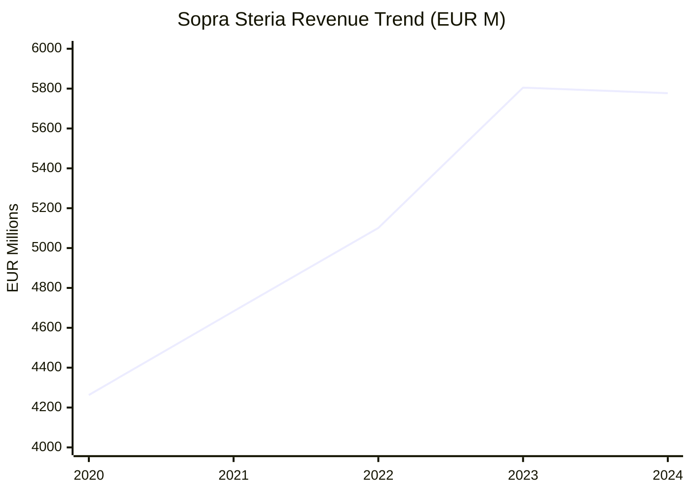
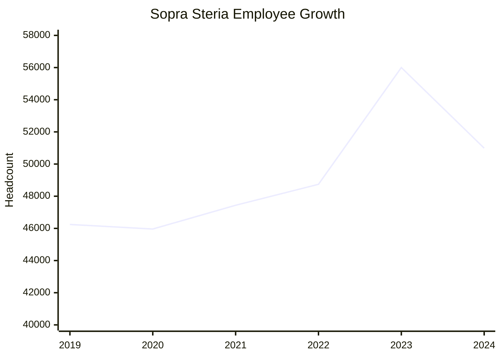
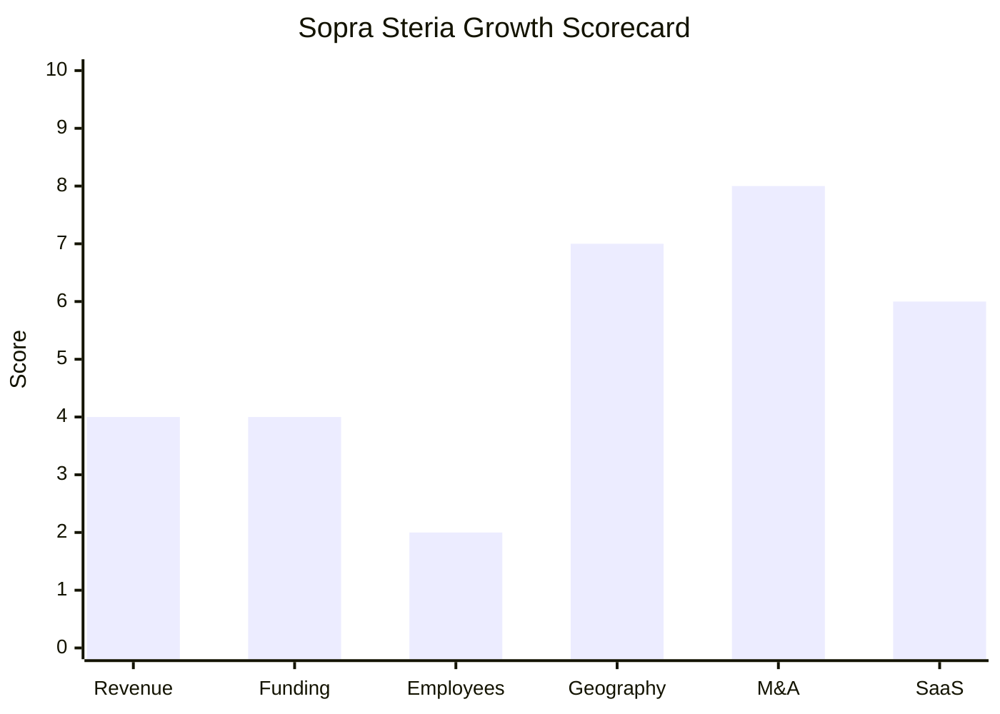

# Financial & Growth Deep-Dive - Sopra Steria (cpX.Energy)

**Research Date**: 2026-02-15
**Data Availability**: High (Sopra Steria SE is publicly listed on Euronext Paris: SOP, ISIN FR0000050809. Annual reports, financial filings, and investor presentations available. cpX.Energy-specific revenue not disclosed separately as it is a product division, not a standalone entity.)

### Revenue Timeline

| Year | Revenue | Currency | EUR Equivalent | YoY Growth | Source | Confidence |
| --- | --- | --- | --- | --- | --- | --- |
| 2025 (est.) | ~EUR 5,650M | EUR | EUR 5,650M | ~-2.2% | H1 2025 results (EUR 2,843.7M at -3.6%), guided H2 improvement | Estimated |
| 2024 | EUR 5,776.8M | EUR | EUR 5,776.8M | -0.5% | FY2024 press release, Feb 2025 | Confirmed |
| 2023 | EUR 5,805.3M | EUR | EUR 5,805.3M | +13.8% | FY2023 press release, Feb 2024 | Confirmed |
| 2022 | EUR 5,101.2M | EUR | EUR 5,101.2M | +8.9% | FY2023 press release (comparison) | Confirmed |
| 2021 | EUR 4,683.0M | EUR | EUR 4,683.0M | +9.9% | MarketScreener, StatisticaTimes | Confirmed |
| 2020 | EUR 4,263.0M | EUR | EUR 4,263.0M | -4.8% (organic) | FY2020 press release, Feb 2021 | Confirmed |

**Revenue CAGR (3yr, 2021-2024)**: 7.2%
**Revenue CAGR (4yr, 2020-2024)**: 7.9%

**Important context**: The +13.8% growth in 2023 was largely M&A-driven (Ordina EUR 518M, CS Group, Tobania acquisitions). Organic growth in 2023 was 6.6%. Organic growth turned negative in 2024 (-0.5%) and worsened in H1 2025 (-3.8%). The company guides a return to "slight organic growth" by Q4 2025.

**Energy & Utilities segment**: ~EUR 347M (6% of group revenue in 2024). cpX.Energy is a product within this segment; its specific revenue is not disclosed.

#### Revenue Trend Chart

### Profitability

| Data Point | Value | Source | Confidence |
| --- | --- | --- | --- |
| Operating Margin on Business Activity (2024) | 9.8% (EUR 564.7M) | FY2024 press release | Confirmed |
| Operating Margin on Business Activity (2023) | 9.4% (EUR 548.2M) | FY2023 press release | Confirmed |
| Operating Margin on Business Activity (2022) | 8.9% (EUR 453.1M) | FY2023 press release (comparison) | Confirmed |
| Operating Margin on Business Activity (2021) | ~8.0% | FY2020 press release (2019 reference), estimated for 2021 | Estimated |
| Operating Margin on Business Activity (2020) | 7.0% | FY2020 press release | Confirmed |
| Net Profit from Continuing Ops (2024) | EUR 309.3M (+68.4% YoY) | FY2024 press release | Confirmed |
| Net Profit (2023) | EUR 183.7M | FY2023 press release | Confirmed |
| Net Profit (2022) | EUR 247.8M | FY2023 press release (comparison) | Confirmed |
| Net Profit (2020) | EUR 106.8M | FY2020 press release | Confirmed |
| Free Cash Flow (2024) | EUR 432.1M (7%+ of revenue) | FY2024 press release | Confirmed |
| Free Cash Flow (2023) | EUR 390.2M (6.7% of revenue) | FY2023 press release | Confirmed |
| Free Cash Flow (2020) | EUR 203.5M | FY2020 press release | Confirmed |
| Return on Capital Employed (2024) | 21.5% (before tax) | FY2024 press release | Confirmed |
| Net Financial Debt (2024) | EUR 382.2M (reduced 59.6% YoY) | FY2024 press release | Confirmed |
| Net Financial Debt (2023) | EUR 946.0M (post-acquisitions) | FY2023 press release | Confirmed |
| Net Financial Debt (2022) | EUR 152.0M | FY2023 press release (comparison) | Confirmed |
| Recurring Revenue % | Not disclosed (services company) | N/A | Unknown |
| SaaS Revenue % | Not disclosed (cpX.Energy is SaaS but not reported separately) | N/A | Unknown |
| Revenue per Employee (2024) | EUR ~113K | Calculated: EUR 5,777M / 50,988 | Calculated |
| Revenue per Employee (2023) | EUR ~104K | Calculated: EUR 5,805M / 56,000 | Calculated |

**Profitability trend**: Margins improving steadily from 7.0% (2020 pandemic low) to 9.8% (2024), even as revenue stagnated. The SBS divestiture (lower-margin banking software) improved the portfolio mix. Net profit from continuing operations surged 68.4% in 2024, partly from the SBS sale gain and improved margins.

### Funding & Investment History

| Date | Round | Amount | Lead Investor(s) | Valuation | Source | Confidence |
| --- | --- | --- | --- | --- | --- | --- |
| 2014 | Merger | Sopra + Steria merger | N/A | N/A | soprasteria.com history | Confirmed |
| Listed | Euronext Paris | SOP (ISIN FR0000050809) | N/A | Market cap ~EUR 2.89B (Jan 2026) | Euronext, MarketScreener | Confirmed |

**Total Raised**: N/A -- publicly listed, self-funded through operations
**Latest Market Cap**: ~EUR 2.89B (Jan 2026); 52-week range EUR 158-240
**Current Share Price**: ~EUR 150.60 (Jan 2026, down ~12% YoY)

**Current Investors / Shareholder Structure (Nov 2025)**:
- **Sopra GMT**: 19.6% of shares, 29.9% voting rights (controlling shareholder)
  - Pasquier family: 54.0% of Sopra GMT
  - Odin family: 22.4% of Sopra GMT
  - One Equity Partners: 22.6% of Sopra GMT
  - Historic managers: 0.6%
- **Public / Institutional**: 67.1% of shares
- **Employee shares**: 6.0% of shares
- **Treasury shares**: 4.8%
- **Founders/management**: 2.5% of shares

**War Chest Signals**: Strong. EUR 432M free cash flow in 2024 (7%+ of revenue). Net debt reduced to EUR 382M from EUR 946M post-acquisitions. Significant acquisition capacity restored after digesting 2023 M&A wave. Proposed dividend EUR 4.65/share (unchanged), indicating confidence in cash generation. Axway share sale generated additional EUR 95.9M in 2024.

### Employee Timeline

| Year | Headcount | YoY Growth | Source | Confidence |
| --- | --- | --- | --- | --- |
| 2026 (proj.) | ~46,245 | ~-9.3% | Eulerpool projection | Estimated |
| 2025 (est.) | ~50,000 | ~-1.9% | H1 2025 reporting context | Estimated |
| 2024 | 50,988 | -8.9% | Sopra Steria Key Figures, StockAnalysis | Confirmed |
| 2023 | 56,000 | +14.9% | FY2023 press release (post-acquisitions) | Confirmed |
| 2022 | 48,741 | +2.7% | StockAnalysis, estimated pre-acquisition | Estimated |
| 2021 | 47,437 | +3.2% | StockAnalysis | Confirmed |
| 2020 | 45,960 | -0.6% | FY2020 press release, StockAnalysis | Confirmed |
| 2019 | 46,245 | - | StockAnalysis | Confirmed |

**Employee CAGR (3yr, 2021-2024)**: 2.4%
**Employee CAGR (4yr, 2020-2024)**: 2.6%

**Important context**: The 2023 spike to 56,000 was driven by acquisitions (Ordina ~3,500, CS Group ~3,600, Tobania ~700). The 2024 drop to ~51,000 was driven by the SBS divestiture (~4,000 employees) and organic headcount adjustments. The trajectory is clearly declining post-divestitures, with projections showing ~46,245 by 2026 -- back to 2019 levels.

**Current Open Positions**: Not quantified from search results. Sopra Steria actively recruits for AI/Data Science, Digital Platform Services, and Cybersecurity roles across Europe via careers.soprasteria.com.
**Hiring Hotspots**: France (primary), India (delivery centres), Germany, Netherlands, Belgium, UK
**Key Recent Hire**: Rajesh Krishnamurthy appointed Group CEO effective Feb 2, 2026, succeeding Cyril Malarge

#### Employee Growth Chart

### Geographic & Market Expansion

| Year | Expansion Event | Details | Source | Confidence |
| --- | --- | --- | --- | --- |
| 2023 | NL/BE market entry (major) | Ordina acquisition: 4,000+ employees across Netherlands and Belgium, 13 offices | Reuters, TechZine | Confirmed |
| 2023 | Belgium expansion | Tobania acquisition: Belgium IT services | soprasteria.com press release | Confirmed |
| 2023 | France critical systems | CS Group acquisition: defense, security, energy, space | Euronext announcement | Confirmed |
| 2024 | Organizational restructure | New Group Operations Department organized by industry verticals and geographic tech centres of excellence | Euronext, Oct 2024 | Confirmed |
| 2025 | cpX.Energy EDSN integration | cpX.MACO integrates with Dutch EDSN for smart meter data retrieval | cpx.soprasteria.de | Confirmed |
| 2026 | cpX.Energy Hydrogen launch | cpX.Energy Hydrogen module for hydrogen market operations (Jan 2026) | cpx.soprasteria.de news | Confirmed |

**International Revenue %**: Not disclosed at segment level. Sopra Steria operates in ~30 countries. France is the largest market, followed by UK, Germany, and Benelux.
**Expansion Trajectory**: The 2023 M&A wave significantly expanded Benelux presence (Ordina, Tobania) and French critical systems (CS Group). The 2024-2025 period focused on integration and restructuring rather than new geographic expansion. cpX.Energy remains primarily Germany-focused but has NL connectivity building blocks in place (EDSN, Sopra Steria NL operations).

### M&A Activity

| Date | Target | Deal Size | Capability Gained | Strategic Rationale | Source | Confidence |
| --- | --- | --- | --- | --- | --- | --- |
| Feb 2023 | CS Group | ~EUR 170M (est. at EUR 11.50/share for 100% equity) | Defence, security, energy, space critical systems; ~3,600 employees | Create leading provider of critical systems and digital services for defence/security/energy sectors | Euronext, soprasteria.com | Confirmed (price estimated) |
| Mar 2023 | Tobania | Undisclosed | Belgium IT services | Strengthen Benelux presence, combine with Ordina | Reuters | Confirmed |
| Oct 2023 | Ordina | EUR 518M (EUR 5.75/share) | NL/BE IT services, 4,000+ employees, 13 offices | Major Benelux expansion, combine with existing operations | Reuters, TechZine | Confirmed |
| Sep 2024 | Sopra Banking Software (SOLD to Axway) | EUR 330M enterprise value (80% of SBS sold) | DIVESTED: Banking software (~EUR 340M revenue, ~4,000 employees) | Strategic refocus on core digital services; exit lower-margin banking software | Banking Gateway, Reuters | Confirmed |
| Sep 2024 | Axway shares (sold to Sopra GMT) | EUR 95.9M (3.619M shares at EUR 26.5) | Cash generation from Axway stake | Part of SBS restructuring | Euronext announcement | Confirmed |

**Divestitures**: Sopra Banking Software (Sep 2024, EUR 330M) -- a major strategic pivot. SBS represented ~EUR 340M in 2023 revenue and ~4,000 employees. Sale to Axway (a related Sopra GMT entity) signals deliberate portfolio reshaping.

**M&A Pattern**: Capability-building + geographic (2023 wave: France critical systems + Benelux expansion), followed by strategic portfolio pruning (2024: divest banking to focus on consulting/digital services). The 2023-2024 M&A cycle reshaped Sopra Steria from a diversified IT conglomerate into a more focused digital services company. No energy-specific acquisitions -- cpX.Energy grows organically.

### SaaS Transition Metrics

| Data Point | Value | Source | Confidence |
| --- | --- | --- | --- |
| Deployment Model (parent) | Traditional IT services (consulting, integration, managed services) | soprasteria.com, annual reports | Confirmed |
| Deployment Model (cpX.Energy) | Cloud-native SaaS exclusively, usage-based pricing | cpx.soprasteria.de | Confirmed |
| Cloud Revenue % (parent) | Not disclosed; Digital Platform Services >EUR 600M (not all SaaS) | FY2024 results | Estimated |
| Recurring Revenue % (parent) | Not disclosed; primarily project-based and managed services | Annual reports | Unknown |
| Recurring Revenue % (cpX.Energy) | High (SaaS, subscription/usage model) but not quantified | cpx.soprasteria.de pricing model | Estimated |
| Platform Stack (cpX.Energy) | Cloud-native, open architecture, standardized web services, OAuth2, scalable cloud parallelisation | cpx.soprasteria.de | Confirmed |
| Migration Status (parent) | N/A -- services company, not migrating product | N/A | N/A |
| Migration Status (cpX.Energy) | Complete -- born cloud-native, no legacy to migrate | cpx.soprasteria.de | Confirmed |
| Security Certification | ISO 27001 | cpx.soprasteria.de | Confirmed |
| New Service Lines (2024) | Digital Platform Services (>EUR 600M), Cybersecurity (>EUR 200M) | FY2024 results | Confirmed |
| AI Recognition | NelsonHall leader in cloud infrastructure; PAC "Best in Class" AI/GenAI service provider | FY2024 press release | Confirmed |

**SaaS assessment**: Sopra Steria is fundamentally an IT services company (consulting, systems integration, managed services). Its cpX.Energy product division is genuinely cloud-native SaaS with usage-based pricing -- a modern deployment model competing well in the energy back-office market. However, cpX.Energy represents a tiny fraction of the EUR 5.8B parent. The parent company does not report SaaS or recurring revenue metrics because its business model is services-driven, not product-driven. This creates a split personality: the product competing with Eneve is fully cloud-native SaaS, but the parent business model and financial reporting are that of a traditional IT services firm.

### Growth Scorecard

| Dimension | Score (1-10) | Evidence Summary |
| --- | --- | --- |
| Revenue Growth | 4 | 3yr CAGR ~7.2% (M&A-inflated; organic growth turned negative: -0.5% in 2024, -3.8% in H1 2025) |
| Funding Momentum | 4 | Public company, strong FCF (EUR 432M), self-funded. No new capital raises. Restored acquisition capacity after 2023 wave. |
| Employee Growth | 2 | 3yr CAGR ~2.4% masks M&A-driven spike (56K) then divestiture-driven decline (51K→projected 46K by 2026). Net trajectory is shrinking. |
| Geographic Expansion | 7 | Ordina acquisition added major NL/BE presence (4,000+ employees). CS Group added French critical systems. cpX.Energy added EDSN (NL) connectivity. |
| M&A Activity | 8 | 3 acquisitions in 2023 (CS Group, Ordina EUR 518M, Tobania) + 1 strategic divestiture (SBS EUR 330M). Active portfolio reshaping. |
| SaaS Maturity | 6 | cpX.Energy is cloud-native SaaS with usage-based pricing (scores 9-10 standalone). But parent is traditional IT services with no disclosed recurring revenue %. Blended score reflects the split. |
| **COMPOSITE SCORE** | **5.2** | **Riser -- Large established player with aggressive M&A and genuine cloud-native product platform, but declining organic growth and shrinking workforce undercut the growth narrative. cpX.Energy is a cloud-native gem inside a decelerating services giant.** |

**Classification Thresholds**:

- **Rocket** (avg 7.0-10.0): Explosive growth, heavy investment, market disruptor
- **Riser** (avg 5.0-6.9): Strong growth signals, investing in future, accelerating
- **Steady** (avg 3.0-4.9): Stable but not transforming, evolutionary
- **Dinosaur** (avg 1.0-2.9): Flat or declining, legacy mode, no visible investment

#### Growth Scorecard Radar

> The bar chart reveals Sopra Steria's split personality: strong M&A execution and geographic expansion (tall bars) contrasted with declining organic revenue growth and shrinking headcount (short bars). The SaaS score of 6 reflects that cpX.Energy is genuinely cloud-native, but the parent company obscures its SaaS metrics within a traditional services reporting model. The key strategic question: can a EUR 5.8B services giant maintain the agility and investment focus needed for a niche cloud-native energy product like cpX.Energy to compete against smaller, faster-moving competitors?

### Eneve Strategic Implications

**Financial comparison**: Sopra Steria's EUR 5.8B revenue dwarfs Eneve, but its Energy & Utilities segment (~EUR 347M, 6% of group) and cpX.Energy specifically are much more comparable in scale. The parent's EUR 432M free cash flow provides theoretical investment capacity that Eneve cannot match, but cpX.Energy must compete internally for budget against higher-priority verticals (defence, public sector, financial services).

**Vulnerability signals**:
- Declining organic revenue (-0.5% in 2024, -3.8% in H1 2025) suggests market headwinds
- Shrinking workforce (56K→51K→projected 46K) indicates cost-cutting, not investment mode
- New CEO (Rajesh Krishnamurthy, Feb 2026) brings leadership transition risk
- cpX.Energy competes internally with larger, higher-margin verticals for investment

**Strength signals**:
- cpX.Energy's cloud-native SaaS model with usage-based pricing is genuinely competitive
- Hydrogen module launch (Jan 2026) shows continued product innovation
- EDSN integration and Ordina-powered NL presence create Dutch market entry capability
- ISO 27001 certification and EnBW (5.5M end customers) reference provide enterprise credibility
- Restored war chest (EUR 382M net debt vs EUR 946M in 2023) enables further M&A

**Bottom line**: Sopra Steria is a financially strong but organically decelerating large-cap services company. cpX.Energy is a well-executed cloud-native product that punches above its weight in the German energy market. The threat to Eneve is real but constrained: cpX.Energy has the right product architecture and the Dutch building blocks in place, but the parent company's declining organic trajectory and internal competition for resources may limit the speed and scale of Dutch market expansion. Monitor cpX.Energy Dutch customer wins as the leading indicator of Eneve competitive pressure.
