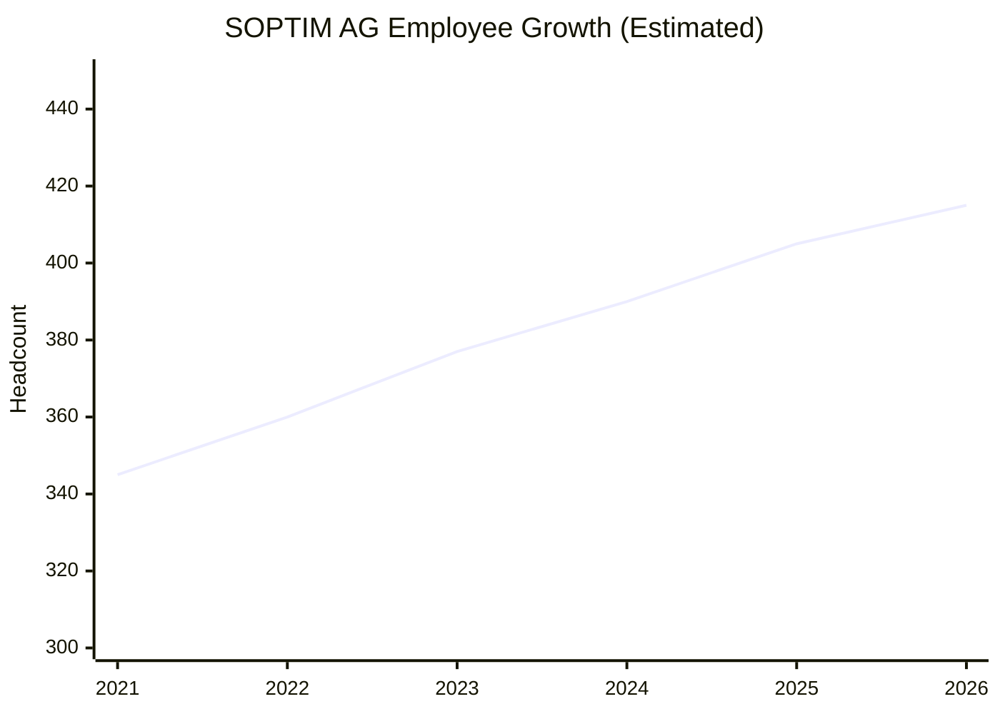
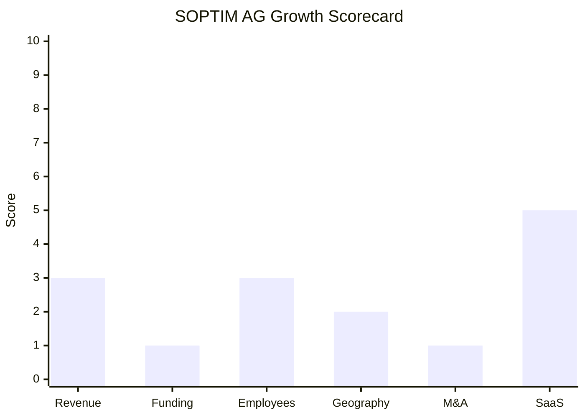

# Financial & Growth Deep-Dive - SOPTIM AG

**Research Date**: 2026-02-15
**Data Availability**: Low (private AG, bootstrapped, no VC backing, no public financial filings found)
**Company Type**: Path D - Private/Bootstrapped (opaque)

---

### Revenue Timeline

| Year | Revenue | Currency | EUR Equivalent | YoY Growth | Source | Confidence |
| --- | --- | --- | --- | --- | --- | --- |
| 2026 (est.) | ~EUR 45M | EUR | ~EUR 45M | ~5% est. | Proxy: headcount growth trend | Estimated (proxy) |
| 2025 | ~EUR 43-44M | EUR | ~EUR 43-44M | ~2-3% est. | Extrapolated from 2023/2024 figure | Estimated (proxy) |
| 2024 | ~EUR 43M | EUR | ~EUR 43M | Unknown | IQB.de company profile, kommunaldigital.de | Estimated |
| 2023 | ~EUR 43M | EUR | ~EUR 43M | Unknown | IQB.de company profile (likely based on 2023 data) | Estimated |
| 2022 | Unknown | EUR | Unknown | Unknown | No data available | Unknown |
| 2021 | Unknown | EUR | Unknown | Unknown | No data available | Unknown |

**Revenue CAGR (3yr)**: Unknown (only single data point ~EUR 43M available)
**Revenue CAGR (5yr)**: Unknown

**Revenue Estimation Methodology**: The EUR 43M figure comes from IQB.de (university career services platform) and is corroborated by kommunaldigital.de. No Bundesanzeiger filings were found. With 377-400+ employees and EUR 43M revenue, the revenue per employee is ~EUR 107K -- significantly below typical pure-play software companies (EUR 200-300K) but consistent with a hybrid model combining project-based consulting/solutions with product revenue. This suggests a heavy services component in the revenue mix.

**Revenue Proxy Cross-Check**: Using industry proxy (377 FTE x EUR 150-250K per employee for energy software) yields EUR 56-94M range. The EUR 43M figure from IQB falls below this range, suggesting either (a) the figure understates actual revenue, (b) the employee mix includes lower-billing roles (consulting, support), or (c) the company has a more service-oriented revenue model than pure software. The EUR 43M figure is treated as the best available estimate.

#### Revenue Trend Chart

> Chart omitted: Fewer than 2 confirmed distinct-year data points available for meaningful trend visualization.

### Profitability

| Data Point | Value | Source | Confidence |
| --- | --- | --- | --- |
| EBITDA (current) | Unknown | Not disclosed | Unknown |
| EBITDA Margin | Unknown | Not disclosed | Unknown |
| Net Profit / Loss | Unknown (likely profitable) | 50+ year survival without external funding implies sustained profitability | Estimated |
| Recurring Revenue % | Unknown (est. 30-50%) | SOPTIM Elements SaaS + project-based mix | Estimated (proxy) |
| SaaS Revenue % | Unknown | Not disclosed | Unknown |
| Revenue per Employee | ~EUR 107,500 | Calculated: EUR 43M / ~400 employees | Estimated |

**Profitability Signal**: A 50+ year old company with no external funding that continues to employ ~400 people and invest in a new cloud platform (SOPTIM Elements) must be sustainably profitable. The AG structure with EUR 1.17M share capital and continued founder leadership (Dr. Wolfgang Thiele) suggests conservative financial management focused on stability over growth.

### Funding & Investment History

| Date | Round | Amount | Lead Investor(s) | Valuation | Source | Confidence |
| --- | --- | --- | --- | --- | --- | --- |
| 1971 | Founding | Unknown | Founders (incl. Dr. Wolfgang Thiele) | N/A | Company website | Confirmed |
| N/A | No external rounds | EUR 0 | N/A | N/A | No Crunchbase/PitchBook entries | Confirmed |

**Total Raised**: EUR 0 (bootstrapped)
**Latest Valuation**: Not applicable (private, no funding rounds)
**Current Investors**: Founder(s) and potentially employee shareholders (AG structure allows share ownership)
**War Chest Signals**: No visible cash reserves, undrawn facilities, or PE dry powder. Share capital is EUR 1,170,000. Self-funded growth model means acquisitions or major international expansion would require either debt, retained earnings, or bringing in external capital.

**Ownership Structure**: Aktiengesellschaft (AG / public limited company) but shares are privately held, not publicly traded. Executive Board: Dr. Wolfgang Thiele (Chairman/CFO, Co-Founder), Christoph Speckamp (Project Solutions), Frank van den Höfel (Digital Solutions). Supervisory Board composition unknown from public sources.

**Subsidiaries**:
- **enprout GmbH** -- BPO and consulting services for energy operations
- **esterion GmbH** (Berlin) -- Software platform for utilities (AI forecasting, workflow automation, time series management; 50+ energy company customers)
- **sbc soptim business consult GmbH** -- Business consulting

### Employee Timeline

| Year | Headcount | YoY Growth | Source | Confidence |
| --- | --- | --- | --- | --- |
| 2026 (current) | ~400-420 est. | ~3-5% est. | IQB.de "over 400", active hiring signals | Estimated |
| 2025 | ~400+ | ~6% (from 377) | IQB.de, kommunaldigital.de "over 400 Mitarbeiter" | Estimated |
| 2024 | ~390 est. | ~3% est. | Interpolation between 377 (Dec 2023) and 400+ | Estimated |
| 2023 | 377 | Unknown | SOPTIM company website (December 2023 FTE) | Confirmed |
| 2022 | ~350-370 est. | Unknown | No data; 201-500 range on TheOrg | Estimated (proxy) |
| 2021 | ~330-360 est. | Unknown | No data; proxy from 50+ year growth trajectory | Estimated (proxy) |

**Employee CAGR (3yr, 2023-2026)**: ~3-4% estimated (377 to ~410)
**Current Open Positions**: Multiple roles listed (software developers, consultants, students, trainees); exact count not available. All positions in German only.
**AI/ML/Data Science Roles**: 0 visible (no explicit AI/ML positions in public job listings)
**Hiring Hotspots**: Aachen (HQ), Essen (branch), remote within Germany
**Key Observation**: Subsidiary esterion GmbH in Berlin offers AI/forecasting capabilities, which may represent SOPTIM's indirect AI talent investment.

#### Employee Growth Chart

> Note: Only 2023 (377 FTE) is confirmed. All other values are estimates based on available signals.

### Geographic & Market Expansion

| Year | Expansion Event | Details | Source | Confidence |
| --- | --- | --- | --- | --- |
| 2017 | ENTSO-E Verification Platform | European-scope project for 30 continental TSOs (Amprion + Swissgrid commission) | ctrmcenter.com | Confirmed |
| 2022 | TransnetBW StromPBG portal | Project for German TSO TransnetBW | pta-consulting.com | Confirmed |
| 2024 | epilot cloud partnership | Integration of SOPTIM Elements into epilot's cloud platform | epilot.cloud | Confirmed |
| 2026 | E-world 2026 presence | Showcasing REMIT II compliance, dynamic tariffs, PARTIN automation | soptim.de | Confirmed |

**International Revenue %**: Not disclosed; estimated <5% (nearly all revenue from Germany/DACH)
**Expansion Trajectory**: SOPTIM remains firmly Germany-focused. The ENTSO-E Verification Platform (2017) demonstrated European technical capability, but the company has not translated this into sustained international market entry. Job listings are German-only, indicating no active expansion beyond DACH. The convergence of German and Dutch energy markets (coupled markets, shared TSO TenneT) represents a natural but unexploited expansion opportunity.

### M&A Activity

| Date | Target | Deal Size | Capability Gained | Strategic Rationale | Source | Confidence |
| --- | --- | --- | --- | --- | --- | --- |
| N/A | No acquisitions found | N/A | N/A | N/A | Comprehensive web search | Confirmed (absence) |

**Divestitures**: None
**M&A Pattern**: SOPTIM follows an organic growth / partnership model rather than acquisition-driven expansion. The company has three subsidiaries (enprout, esterion, sbc) but it is unclear whether these were acquired or founded internally. esterion GmbH (Berlin) operates as a semi-independent entity with its own brand, serving 50+ energy companies with AI/forecasting and time series management -- this may represent an internal corporate venture rather than an acquisition.

**M&A Absence Signal**: For a 50+ year company with ~EUR 43M revenue, zero acquisitions is notable. Competitors in similar positions (Volue, KISTERS) have used M&A actively to expand capabilities and geographies. This suggests either (a) conservative financial philosophy from founder-led management, (b) insufficient cash reserves for acquisitions, or (c) a deliberate strategic choice to grow organically. The lack of M&A constrains the company's ability to rapidly enter new markets or acquire AI/ML capabilities.

### SaaS Transition Metrics

| Data Point | Value | Source | Confidence |
| --- | --- | --- | --- |
| Deployment Model | Hybrid: Cloud SaaS (Elements) + project-based on-premise | soptim.de, product pages | Confirmed |
| Cloud Revenue % (current) | Unknown (est. 20-35%) | No disclosure; SaaS platform is newer, project business is legacy | Estimated (proxy) |
| Cloud Revenue % (1yr ago) | Unknown (est. 15-25%) | SaaS platform still ramping | Estimated (proxy) |
| Cloud Revenue % (2yr ago) | Unknown (est. 10-20%) | Earlier stage of Elements adoption | Estimated (proxy) |
| Recurring Revenue % | Unknown (est. 30-50%) | Mix of SaaS subscriptions + multi-year project contracts | Estimated (proxy) |
| Platform Stack | Cloud-based, modern technologies (details not disclosed) | soptim.de, career page | Estimated |
| Migration Status | In-progress (dual-track: new SaaS platform + legacy project business) | Product portfolio analysis | Estimated |

**SaaS Transition Assessment**: SOPTIM is executing a legitimate SaaS transformation via SOPTIM Elements. The platform is modular (Editions, Thematic Areas, Elements) and addresses real market needs (balancing, scheduling, MaBiS, REMIT II). However, the large project-based consulting business (reflected in low revenue per employee of ~EUR 107K) suggests the company is in early-to-mid SaaS transition, with the majority of revenue still coming from traditional project delivery. The epilot partnership (2024) and new cloud products (dynamic tariffs, PARTIN automation) show genuine investment in the SaaS direction.

---

### Growth Scorecard

| Dimension | Score (1-10) | Evidence Summary |
| --- | --- | --- |
| Revenue Growth | 3 | ~EUR 43M for 50+ year company; only single data point available; low revenue per employee (EUR 107K) suggests services-heavy; CAGR likely <5% |
| Funding Momentum | 1 | Zero external funding ever; bootstrapped since 1971; EUR 1.17M share capital; no VC/PE signals |
| Employee Growth | 3 | 377 FTE (2023) to ~400+ (2025-2026); estimated CAGR ~3-4%; stable but not aggressive growth |
| Geographic Expansion | 2 | Germany/DACH only; ENTSO-E project (2017) was technical not commercial expansion; jobs German-only; no new countries |
| M&A Activity | 1 | Zero acquisitions in 50+ year history; organic growth only; partnership model; no M&A signals |
| SaaS Maturity | 5 | SOPTIM Elements cloud SaaS is real; hybrid model transitioning; estimated 30-50% recurring; active product development |
| **COMPOSITE SCORE** | **2.5** | **Dinosaur (boundary with Steady)** |

**Classification**: **Dinosaur** (avg 2.5, within 1.0-2.9 range)

> **Important Context**: The "Dinosaur" classification reflects growth trajectory and investment momentum, NOT product quality or market position. SOPTIM has genuine strengths: 50+ year domain expertise, 100% German TSO penetration, deep regulatory knowledge, a real SaaS platform in development, and strong employer reputation (kununu Top Company). The classification means SOPTIM is growing slowly, not investing aggressively, and is vulnerable to disruption by well-funded competitors -- it does NOT mean the company or its products are poor quality.

#### Growth Scorecard Radar

---

### Strategic Implications for Eneve

**Shared Vulnerability**: Both SOPTIM and Eneve share a strikingly similar profile: established energy back-office specialists with deep national market expertise, modest growth trajectories, no external funding, and early-stage SaaS transitions. SOPTIM's Dinosaur classification (2.5) likely mirrors what Eneve's own scorecard would show. Both companies risk being squeezed between:
- **Above**: Well-funded AI-native disruptors (tem at $75M funding, Engrate, Qualia Trading)
- **Below**: Large-scale enterprise players absorbing energy operations (Hitachi, Sopra Steria, TietoEVRY)
- **Beside**: Faster-growing mid-tier competitors with M&A strategies (Volue, KISTERS)

**SOPTIM's Moat**: 100% German TSO penetration and the 50+ year Amprion relationship represent genuine competitive moats. Regulatory expertise (MaBiS, REMIT II, Redispatch) creates switching costs. But moats erode when the market shifts to cloud-native, AI-augmented platforms that can replicate regulatory compliance faster.

**Convergence Threat**: As German and Dutch energy markets converge (ENTSO-E harmonization, shared TSO TenneT), SOPTIM represents the most natural NL-market entrant among German competitors. Both companies should be watching for signals of cross-border expansion.

**Data Quality Note**: This analysis is constrained by SOPTIM's low data availability (private, no filings, no VC backing). The EUR 43M revenue figure is from a single indirect source. Employee data beyond 2023 is estimated. All growth scores should be interpreted with appropriate uncertainty margins.

---

**Sources Consulted**:
- soptim.de (company website, product pages, career page, press releases)
- IQB.de (university career portal -- revenue and employee data)
- kommunaldigital.de (German municipal digital platform -- company profile)
- ctrmcenter.com (CTRM industry news -- ENTSO-E platform, iTrade product)
- epilot.cloud (partnership announcement)
- kununu.com (employer reviews -- 4.2/5.0, Top Company 2022-2023)
- XING (company page -- employee range confirmation)
- TheOrg (organizational chart -- 201-500 range)
- LeadIQ (company profile -- basic data)
- esterion.de (subsidiary website -- AI/forecasting capabilities)
- Bundesanzeiger (searched, no SOPTIM filings found)
- Crunchbase/PitchBook (searched, no SOPTIM entries found)
