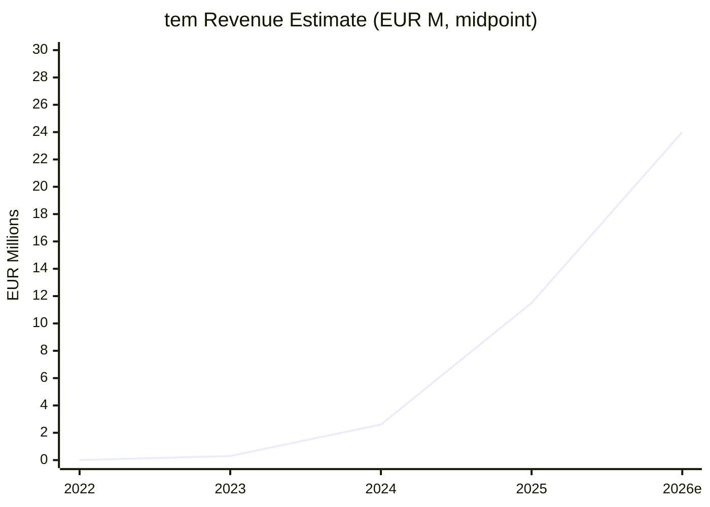
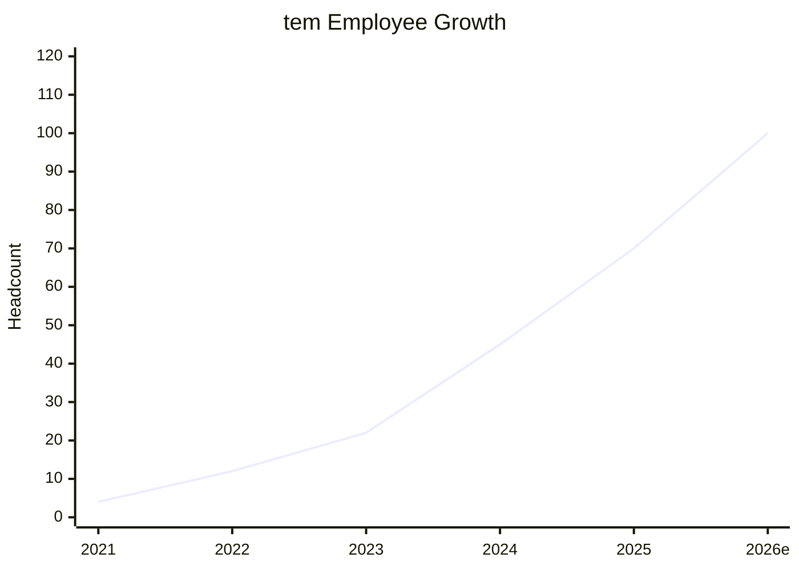
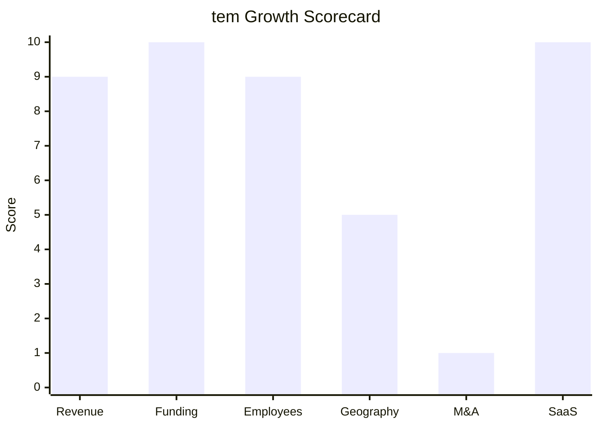

# Financial & Growth Deep-Dive - tem (tem energy)

**Research Date**: 2026-02-15
**Data Availability**: Medium (VC-funded private startup; funding rounds well-documented, revenue not disclosed, GTV and customer metrics available from press)

### Revenue Timeline

tem does not disclose revenue. Estimates below are derived from two proxy methods:
1. **GTV-based**: $300M annual gross transaction value in 2025 (confirmed) x estimated 3-5% marketplace take rate
2. **Employee-based**: 70 employees (confirmed Jul 2025) x EUR 150-200K industry average

| Year | Revenue | Currency | EUR Equivalent | YoY Growth | Source | Confidence |
| --- | --- | --- | --- | --- | --- | --- |
| 2026 (est.) | £16-25M | GBP | EUR 19-30M | +60-100% | Proxy: Series B scaling + international expansion | Estimated (proxy) |
| 2025 | £8-12M | GBP | EUR 9-14M | +300-500% | Proxy: $300M GTV x 3-5% take rate (TFN, TechCrunch) | Estimated (proxy) |
| 2024 | £1.5-3M | GBP | EUR 1.8-3.5M | N/A (first material year) | Proxy: RED launched Nov 2024, ~$50M partial-year GTV (WttJ) | Estimated (proxy) |
| 2023 | <£0.5M | GBP | <EUR 0.6M | N/A | Proxy: seed-stage, early customers, pre-RED platform | Estimated (proxy) |
| 2022 | Pre-revenue | - | - | - | Building platform, no commercial launch | Estimated |
| 2021 | Pre-revenue | - | - | - | Founded July 2021, building technology | Estimated |

**Revenue CAGR (3yr)**: Not calculable (pre-revenue until 2023; explosive growth from near-zero base)
**Revenue CAGR (2024-2025)**: ~300-500% estimated (from first material revenue year)
**Gross Transaction Value (2025)**: $300M (~EUR 280M) -- confirmed by TFN, TechCrunch, Vestbee

#### Revenue Trend Chart

### Profitability

| Data Point | Value | Source | Confidence |
| --- | --- | --- | --- |
| EBITDA (current) | Negative (loss-making) | Typical for Series B startup burning cash for growth | Estimated |
| EBITDA Margin | Negative | Not disclosed; VC-funded hypergrowth phase | Estimated |
| Net Profit / Loss | Net loss (investing ahead of revenue) | Standard for this funding stage | Estimated |
| Recurring Revenue % | ~100% (transaction-based) | Marketplace model: ongoing transaction fees | Estimated |
| SaaS Revenue % | ~100% (cloud-only platform) | No on-premise, no license model | Estimated |
| Revenue per Employee | EUR 135-200K | Calculated: ~EUR 11.5M / 70 employees (2025 midpoint) | Estimated (proxy) |

### Funding & Investment History

| Date | Round | Amount | Lead Investor(s) | Valuation | Source | Confidence |
| --- | --- | --- | --- | --- | --- | --- |
| 2023 | Seed | £2.5M (~EUR 2.9M) | AlbionVC | Not disclosed | AlbionVC press release | Confirmed |
| Sep 2024 | Series A | £10.5M (~EUR 12.3M / ~$14.2M) | Atomico | Not disclosed | UK Tech News, LondonTechWatch, tem blog | Confirmed |
| Feb 2026 | Series B | $75M (~£55M / ~EUR 70M) | Lightspeed Venture Partners | $300M+ (~EUR 280M+) post-money | TechCrunch, TFN, UK Tech News, BuiltInLondon | Confirmed |

**Total Raised**: $94M (~EUR 87M)
**Latest Valuation**: $300M+ (~EUR 280M+) post-money (February 2026)
**Current Investors**:
- **Lightspeed Venture Partners** (Series B lead; Paul Murphy joined board)
- **Atomico** (Series A lead; returning Series B)
- **AlbionVC** (Seed lead; all rounds)
- **Hitachi Ventures** (Series B strategic)
- **Voyager Ventures** (Series B)
- **Schroders Capital** (Series B)
- **Allianz** (Series B strategic)
- **Revent** (Series A + B)
- Angel investors: Holly & Sam Branson, Harsh Sinha (Wise CTO), Nilan Peiris (Wise CPO)

**War Chest Signals**: $75M fresh capital (Feb 2026) earmarked for international expansion (Texas, Australia) and team scaling. At estimated ~£1M/month burn rate, runway extends well into 2028+. Strategic investors (Hitachi Ventures, Allianz) signal potential enterprise partnerships and energy sector access.

### Employee Timeline

| Year | Headcount | YoY Growth | Source | Confidence |
| --- | --- | --- | --- | --- |
| 2026 (current, post-Series B) | ~80-120 | +15-70% | Estimated: post-Series B hiring; WttJ range "21-100" | Estimated |
| 2025 (Jul) | 70 | +40-75% | tem anniversary milestones blog | Confirmed |
| 2024 | ~40-50 | +60-100% | Estimated: post-Series A scaling | Estimated |
| 2023 | ~20-25 | +67-150% | Estimated: post-seed hiring | Estimated |
| 2022 | ~8-15 | +100-275% | Estimated: early team building | Estimated |
| 2021 | 4 | N/A (founding) | 4 co-founders: Joe McDonald, Jason Stocks, Bartlomiej Szostek, Ross Mackay | Confirmed |

**Employee CAGR (3yr, 2022-2025)**: ~70-80% (estimated: from ~12 to 70)
**Current Open Positions**: Multiple -- Senior Customer Experience Specialist, Lead People Partner, Energy Originator (£64-84K) visible on job boards
**Hiring Hotspots**: London (remote-first, UK-based); international hires expected for Texas/Australia expansion
**Team Composition**: 40% female; fully remote with quarterly in-person meetups

#### Employee Growth Chart

### Geographic & Market Expansion

| Year | Expansion Event | Details | Source | Confidence |
| --- | --- | --- | --- | --- |
| 2021 | Founded in London, UK | AI energy transaction platform, Battersea Power Station HQ | Companies House | Confirmed |
| 2023 | UK market launch | Initial customers via generator-business matching platform | tem blog, press | Confirmed |
| 2024 (Nov) | RED platform launch (UK) | First modern utility powered by AI-native infrastructure | TechCrunch, tem website | Confirmed |
| 2025 (May) | 1,500+ UK customers | Milestone: 350,000 MWh matched, £20M saved | The Energyst, Business Focus | Confirmed |
| 2026 (Feb) | 2,600+ UK business customers | $300M GTV, 2 TWh energy transactions in 2025 | TechCrunch, TFN | Confirmed |
| 2026 (planned) | Texas (US) entry | First US market, deregulated electricity market | TechCrunch, Series B announcements | Announced |
| 2026 (planned) | Australia entry | Second international market | TechCrunch, Series B announcements | Announced |

**International Revenue %**: 0% currently (UK-only); will change with planned US/AU expansion
**Expansion Trajectory**: Aggressive intercontinental expansion funded by $75M Series B. Texas chosen for its deregulated electricity market (ERCOT). Australia chosen as a second deregulated market with high renewable penetration. CEO frames this as "rolling out transaction infrastructure on a global scale" over 3-5 years.

### M&A Activity

| Date | Target | Deal Size | Capability Gained | Strategic Rationale | Source | Confidence |
| --- | --- | --- | --- | --- | --- | --- |
| - | None | - | - | - | - | - |

**Divestitures**: None
**M&A Pattern**: No M&A activity. tem is focused entirely on organic growth and product development. The "Stripe of energy" positioning suggests eventual platform/API strategy where they would license infrastructure rather than acquire companies. No M&A signals detected in press, CEO interviews, or investor commentary.

### SaaS Transition Metrics

| Data Point | Value | Source | Confidence |
| --- | --- | --- | --- |
| Deployment Model | Cloud-native from founding | tem website, all press coverage | Confirmed |
| Cloud Revenue % (current) | 100% | No on-premise offering exists | Confirmed |
| Cloud Revenue % (1yr ago) | 100% | Always cloud-only | Confirmed |
| Cloud Revenue % (2yr ago) | 100% | Always cloud-only | Confirmed |
| Recurring Revenue % | ~100% | Transaction-based marketplace model; ongoing, not one-time | Estimated |
| Platform Stack | AI/ML + LLMs, cloud-native infrastructure, remote-first | Job postings, TechCrunch, tem website | Confirmed |
| Migration Status | N/A (born cloud-native) | Never had on-premise; no migration needed | Confirmed |

### Growth Scorecard

| Dimension | Score (1-10) | Evidence Summary |
| --- | --- | --- |
| Revenue Growth | 9 | GTV exploded from ~$50M to $300M (6x) in 2025; revenue from near-zero to est. EUR 9-14M in two years |
| Funding Momentum | 10 | $94M total raised; $75M Series B at $300M+ valuation; Lightspeed + Atomico + Allianz + Hitachi backing |
| Employee Growth | 9 | From 4 founders (2021) to 70 employees (2025); est. ~80% CAGR over 3yr; aggressive multi-function hiring |
| Geographic Expansion | 5 | UK-only today; intercontinental expansion to Texas + Australia announced but not yet executed |
| M&A Activity | 1 | No acquisitions, no divestitures, no M&A signals; pure organic growth focus |
| SaaS Maturity | 10 | Cloud-native from day one; AI-native platform; ~100% recurring transaction-based revenue; no legacy code |
| **COMPOSITE SCORE** | **7.3** | **Rocket (avg 7.0-10.0): Explosive growth, heavy investment, AI-native market disruptor** |

**Classification Thresholds**:

- **Rocket** (avg 7.0-10.0): Explosive growth, heavy investment, market disruptor
- **Riser** (avg 5.0-6.9): Strong growth signals, investing in future, accelerating
- **Steady** (avg 3.0-4.9): Stable but not transforming, evolutionary
- **Dinosaur** (avg 1.0-2.9): Flat or declining, legacy mode, no visible investment

#### Growth Scorecard Radar

> The scorecard shows a distinctive "VC-funded disruptor" fingerprint: extreme strength in funding, revenue growth, employee growth, and SaaS maturity, but near-zero M&A and still-unproven geographic expansion. The 7.3 composite solidly places tem in **Rocket** territory, dragged down only by M&A (not their strategy) and geography (planned but not yet executed).

### Key Signals for Eneve

1. **The Funding Gap is Staggering**: tem raised $94M total vs Engrate's EUR 3M. tem's single Series B ($75M) exceeds most European energy back-office companies' total lifetime funding.

2. **$300M+ Valuation in 4 Years**: From founding to $300M+ in under 5 years validates that AI-native energy platforms can achieve massive valuations. This creates a benchmark that traditional energy software companies cannot match.

3. **Investor Quality Signals Deep Conviction**: Lightspeed (top-5 global VC), Atomico (Spotify founders' fund), Allianz (insurance giant), Hitachi Ventures (energy industry), Schroders Capital (asset management). This investor syndicate signals both financial confidence and energy industry credibility.

4. **165% Demand Increase Thesis**: tem's pitch deck (per TFN) cites a projected 165% increase in electricity demand by 2030 from data centres, AI, and electrification. This macro tailwind benefits all energy platform companies, including Eneve.

5. **Platform API Ambitions**: The "Stripe of energy" positioning and plans to make Rosso available to third parties suggest tem will eventually offer its transaction infrastructure as an API platform. This could eventually encompass back-office settlement functions currently served by Eneve.

6. **Watch List**: Upstream expansion into wholesale markets, TSO/grid integration capabilities, European market entry (especially NL/DE where Eneve operates).

### Sources

| Source | URL | Accessed |
| --- | --- | --- |
| TechCrunch - Series B announcement | https://techcrunch.com/2026/02/09/tem-raises-75m-to-remake-electricity-markets-using-ai/ | 2026-02-15 |
| TechFundingNews - GTV data | https://techfundingnews.com/tem-75m-lightspeed-energy-ai/ | 2026-02-15 |
| UK Tech News - Series B details | https://www.uktechnews.info/2026/02/10/tem-secures-55-million-series-b-investment-led-by-lightspeed-venture-partners/ | 2026-02-15 |
| UK Tech News - Series A | https://www.uktechnews.info/2024/09/11/tem-energy-secures-10-5-million-series-a-investment-led-by-european-vc-atomico/ | 2026-02-15 |
| AlbionVC - Seed + Series A | https://albion.capital/tem-secures-further-10-5m-to-accelerate-its-mission-to-reshape-the-uks-energy-landscape/ | 2026-02-15 |
| LondonTechWatch - Series A deep-dive | https://www.londontechwatch.com/2024/10/tem-marketplace-platform-renewable-energy-business-generators-joe-mcdonald/ | 2026-02-15 |
| The Energyst - 1,500 customer milestone | https://theenergyst.com/tem-surpasses-1500-customers-as-solution-to-replace-wholesale-energy-market-gains-ground/ | 2026-02-15 |
| Entrepreneur UK - London 100, team milestones | https://entrepreneur.com/en-gb/entrepreneurs/entrepreneur-uks-london-100-tem-energy/493306 | 2026-02-15 |
| BuiltIn London - Series B overview | https://builtinlondon.uk/articles/tem-raises-75m-ai-energy-transaction-engine-20260210 | 2026-02-15 |
| Companies House - TEM-ENERGY LIMITED (13499591) | https://find-and-update.company-information.service.gov.uk/company/13499591 | 2026-02-15 |
| Welcome to the Jungle - Company profile | https://app.welcometothejungle.com/companies/tem | 2026-02-15 |
| Vestbee - Funding summary | https://www.vestbee.com/insights/articles/tem-raises-75-m | 2026-02-15 |
