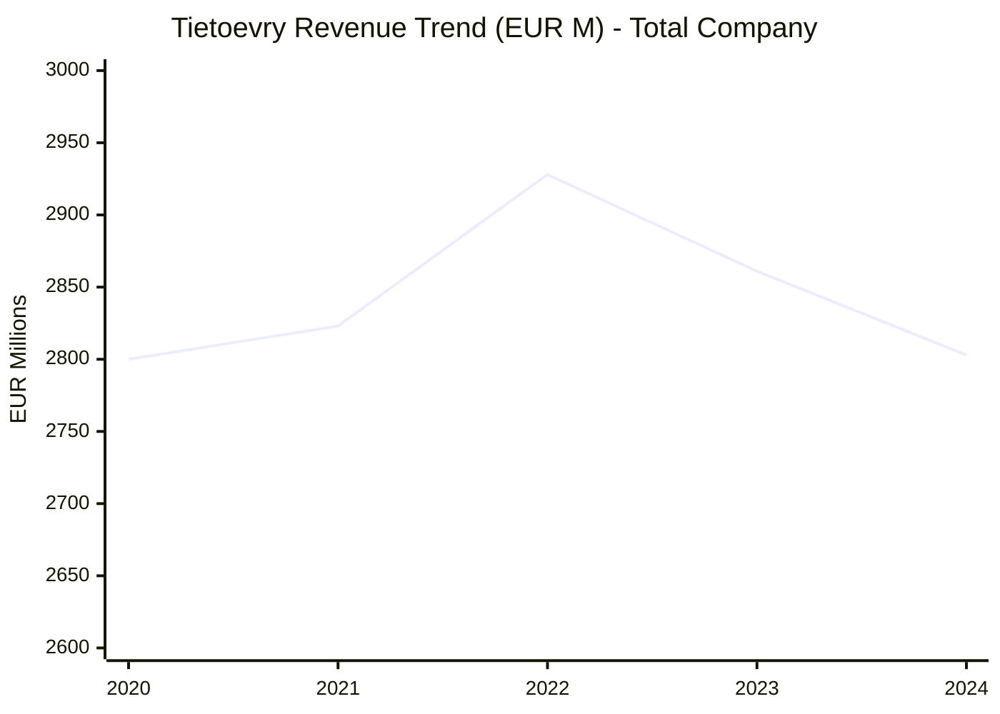
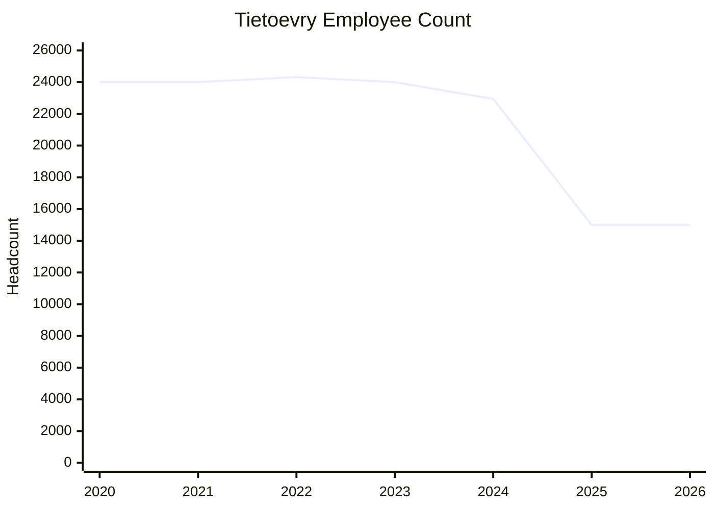
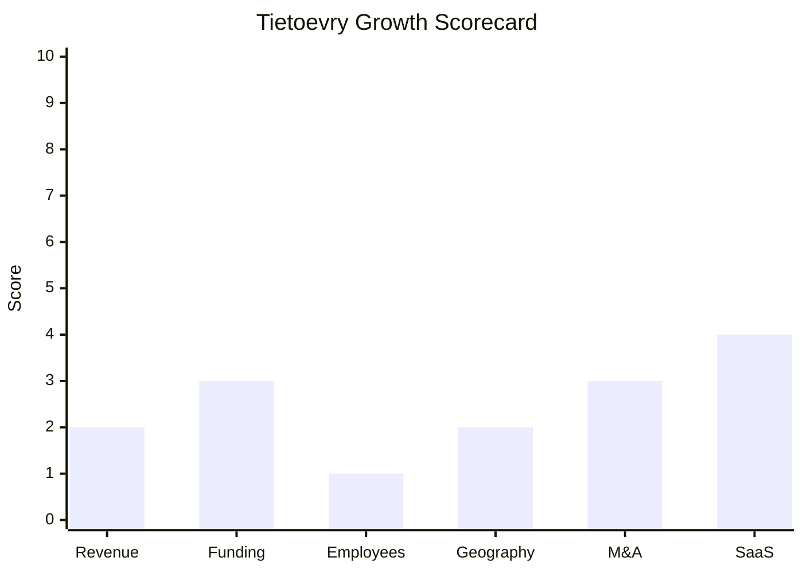

# Financial & Growth Deep-Dive - Tietoevry (Tieto)

**Research Date**: 2026-02-15
**Data Availability**: High (publicly listed on Nasdaq Helsinki, Stockholm, and Oslo -- annual reports, quarterly releases, and investor relations materials readily available)

---

### Revenue Timeline

Tietoevry reports in EUR. Two views are presented: total company (historical continuity) and continuing operations (post-divestment comparability).

#### Total Company Revenue (Including All Operations)

| Year | Revenue | Currency | EUR Equivalent | YoY Growth | Source | Confidence |
| --- | --- | --- | --- | --- | --- | --- |
| 2025 (cont. ops) | EUR 1,852M | EUR | EUR 1,852M | -2% organic | Q4 2025 results (Feb 2026) | Confirmed |
| 2024 | EUR 2,803M | EUR | EUR 2,803M | -2% organic | 2024 Annual Report | Confirmed |
| 2023 | EUR 2,861M | EUR | EUR 2,861M | -2% est. | Calculated (2024 / 0.98) | Estimated |
| 2022 | EUR 2,928M | EUR | EUR 2,928M | +4% organic | Q4 2022 results | Confirmed |
| 2021 | EUR 2,823M | EUR | EUR 2,823M | +1% organic | Q4 2021 results | Confirmed |
| 2020 | EUR 2,800M | EUR | EUR 2,800M | N/A (merger yr 1) | 2020 Annual Report ("~EUR 3B") | Estimated |

#### Continuing Operations (Post-Tech Services Divestment)

| Year | Revenue | YoY Growth | Adj. EBITA Margin | Source | Confidence |
| --- | --- | --- | --- | --- | --- |
| 2026 (guidance) | EUR 1,815-1,852M | -2% to 0% | 14.8-15.8% | Q4 2025 guidance | Confirmed |
| 2025 | EUR 1,852M | -2% organic | 13.8% | Q4 2025 results | Confirmed |
| 2024 (restated) | EUR 1,880M | N/A (baseline) | 12.0% | IFRS 5 restatement (Apr 2025) | Confirmed |

**Revenue CAGR (3yr, 2022-2025 total co.)**: Negative -- total company declined from EUR 2,928M to EUR 1,852M continuing; this comparison is distorted by the Tech Services divestment (EUR 1B revenue removed)
**Revenue CAGR (3yr, like-for-like organic)**: Approximately -2% per year (flat to slightly declining)

#### Revenue Trend Chart

---

### Profitability

| Data Point | Value | Source | Confidence |
| --- | --- | --- | --- |
| Adj. EBITA (2025 cont. ops) | EUR 256M (13.8% margin) | Q4 2025 results | Confirmed |
| Adj. EBITA (2024 total) | EUR 345M (12.3% margin) | 2024 Annual Report | Confirmed |
| Adj. EBITA (2024 cont. restated) | 12.0% margin | IFRS 5 restatement | Confirmed |
| Adj. EBITA (2023) | 12.6-13.0% margin | Q3 2023 report, annual report | Confirmed |
| Adj. EBITA (2022) | 13.0% margin | Q4 2022 results | Confirmed |
| Adj. EBITA (2021) | 13.0% margin | Q4 2021 results | Confirmed |
| Net Profit (2024) | EUR -62.8M (loss) | 2024 Annual Report | Confirmed |
| Net Profit (2023) | EUR 172.2M | 2024 Annual Report (prior year ref.) | Confirmed |
| Operating Cash Flow (2025) | EUR 296M | Q4 2025 results | Confirmed |
| Operating Cash Flow (2024) | EUR 326M | 2024 Annual Report | Confirmed |
| EPS (2024) | EUR -0.53 | 2024 Annual Report | Confirmed |
| EPS (2023) | EUR 1.45 | 2024 Annual Report | Confirmed |
| Net Debt / EBITDA (2024) | 2.2x | 2024 Annual Report | Confirmed |
| Recurring Revenue % | Not disclosed | Annual reports | Unknown |
| SaaS Revenue % | Not disclosed | Annual reports | Unknown |
| Revenue per Employee (2025 cont.) | EUR 123K | Calculated: 1,852M / ~15,000 | Estimated |
| Revenue per Employee (2024 total) | EUR 122K | Calculated: 2,803M / 22,941 | Confirmed |

**Profitability trend**: Margins improved significantly in 2025 through cost optimization (EUR 95M run-rate savings achieved, target uplifted to EUR 130M). Q4 2025 hit 16.2% adj. EBITA -- the highest quarterly margin in recent years. The company is delivering "growth through efficiency" rather than top-line expansion.

**2028 targets**: Adj. EBITA margin >16%, revenue growth >5% CAGR (2027-2028).

---

### Funding & Investment History

| Date | Round | Amount | Lead Investor(s) | Valuation | Source | Confidence |
| --- | --- | --- | --- | --- | --- | --- |
| 1984 | IPO | N/A | Nasdaq Helsinki (Tieto) | N/A | tietoevry.com | Confirmed |
| 1999 | Parallel listing | N/A | Nasdaq Stockholm (Tieto) | N/A | tietoevry.com | Confirmed |
| Dec 2019 | Merger (EVRY) | ~44.3M new shares + NOK 5.28/sh cash | Tieto + EVRY shareholders | Combined ~EUR 3-4B market cap | Stock exchange release | Confirmed |
| Dec 2019 | Parallel listing | N/A | Oslo Bors (TietoEVRY) | N/A | tietoevry.com | Confirmed |
| Jun 2025 | Share buyback #1 | Concluded | N/A | N/A | Stock exchange release | Confirmed |
| Feb 2026 | Share buyback #2 | EUR 150M (Feb 2026 - Mar 2027) | N/A | N/A | Stock exchange release | Confirmed |

**Total Raised**: N/A -- publicly listed since 1984; funded through operations, not venture rounds
**Latest Valuation (Market Cap)**: ~EUR 2.16-2.26B (Jan 2026), ~EUR 18.68/share
**Current Investors**: Silchester International Investors LLP (~10-15%, reduced below 15% Nov 2025), Solidium Oy (Finnish state fund, ~10%+). Free float ~85.66%.
**War Chest Signals**: Tech Services divestment proceeds (EUR 300M + EUR 70M earn-out) used for debt reduction. Bekk Consulting proceeds (EUR 150M) funding the EUR 150M share buyback. Operating cash flow EUR 296M (2025). Dividend EUR 1.50/share (~EUR 178M payout). Net debt/EBITDA target <2x. No signs of building an acquisition war chest -- capital is being returned to shareholders.

---

### Employee Timeline

| Year | Headcount | YoY Growth | Source | Confidence |
| --- | --- | --- | --- | --- |
| 2026 (current) | ~15,000 | ~0% | Tieto careers page ("15,000 experts") | Confirmed |
| 2025 (post-divestments) | ~15,000 | -35% total (-7,230 Tech Services, -600 Bekk) | Q4 2025 report, divestment releases | Confirmed |
| 2024 | 22,941 | -4% | 2024 Annual Report | Confirmed |
| 2023 | ~24,000 | -1% | 2023 Annual Report | Estimated |
| 2022 | 24,320 | +1% | 2022 Annual Report | Confirmed |
| 2021 | ~24,000 | 0% | 2021 Annual Report | Estimated |
| 2020 | ~24,000 | N/A (merger yr 1) | 2020 Annual Report | Estimated |

**Employee CAGR (3yr, 2022-2025)**: Deeply negative (24,320 → ~15,000), but almost entirely driven by divestitures, not organic layoffs
**Organic headcount trend (continuing ops)**: Slightly declining -- restructuring and cost optimization impacting even continuing operations
**Current Open Positions**: 499 (as of Feb 2026) -- Software Engineer (174), Solution Consultant (42), Test Engineer (45), DevOps Engineer (23)
**AI/ML/Data Science roles**: Not specifically labeled in job categories; Azure Cloud Engineer and data roles present but no dedicated "AI/ML data scientist" positions
**Hiring Hotspots**: Finland (99), India (82), Bulgaria (56), Norway (56), Poland (41), Austria (39), Sweden (31)
**Key Recent Hires**: Endre Rangnes (CEO, appointed permanent Jul 2025, replacing Kimmo Alkio after 14 years); Tomi Hyrylainen (CFO, joined 2018)

#### Employee Growth Chart

---

### Geographic & Market Expansion

| Year | Expansion Event | Details | Source | Confidence |
| --- | --- | --- | --- | --- |
| 2023 | MentorMate acquisition | Added presence in Bulgaria, Paraguay, USA (North America customer base expansion) | Press release Jul 2023 | Confirmed |
| 2025 | Tech Services divested | Lost infrastructure services across Nordics (7,230 employees, EUR 1B revenue) | Press release Sep 2025 | Confirmed |
| 2025-2026 | Bekk Consulting divested | Lost consulting presence in Norway (600 employees, NOK 1.1B revenue) | Press release Dec 2025 | Confirmed |
| 2025 | Rebranding to "Tieto" | Strategic refocus as software and digital engineering company | Strategy update Nov 2025 | Confirmed |

**International Revenue %**: Not separately disclosed; operations span ~90 countries but concentrated in Finland, Norway, Sweden, and India (delivery)
**Expansion Trajectory**: Contracting, not expanding. The strategic direction is "selective expansion" from Nordic roots to European markets -- but this is a 2027-2028 aspiration, not current reality. The company is in a portfolio simplification phase, shedding non-core businesses (infrastructure, consulting) to focus on vertical software (Banking, Care, Industry) and digital engineering (Create/Tech Consulting). No new country entries in the last 3 years.

---

### M&A Activity

| Date | Target | Deal Size | Capability Gained | Strategic Rationale | Source | Confidence |
| --- | --- | --- | --- | --- | --- | --- |
| Jul 2023 | MentorMate | Not disclosed (USD 65M revenue, profitable) | 1,000+ employees in Bulgaria/Paraguay/USA; digital engineering, AI, UX | Expand Create's North American customer base and global delivery | Press release | Confirmed |
| Dec 2019 | EVRY ASA | ~44.3M shares + NOK 5.28/share cash | Norwegian IT services, banking software, infrastructure | Create leading Nordic digital services company, EUR 100M synergy target | Stock exchange release | Confirmed |
| 2019 | Meridium AB | ~EUR 6M revenue | Product lifecycle management | Capability extension | Investor relations | Confirmed |

**Divestitures (last 3 years)**:

| Date | Target | Deal Size | Revenue Lost | Employees Lost | Rationale |
| --- | --- | --- | --- | --- | --- |
| Sep 2025 | Tech Services → Agilitas PE (now "Vivicta") | EUR 300M + EUR 70M earn-out | EUR 1,001M (2024) | 7,230 | Non-core infrastructure; focus on software | 
| Dec 2025 / Feb 2026 | Bekk Consulting → Axcel PE | NOK 1,700M (~EUR 150M) | NOK 1,056M (~EUR 95M) | 600 | Non-core consulting; fund share buyback |

**M&A Pattern**: The last 3 years tell a clear "portfolio simplification" story. One capability-building acquisition (MentorMate, 2023) dwarfed by two major divestitures in 2025 that collectively removed ~EUR 1.1B revenue and ~7,830 employees. The company is shrinking to refocus, not acquiring to grow. No acquisition pipeline signals for 2026-2027.

---

### SaaS Transition Metrics

| Data Point | Value | Source | Confidence |
| --- | --- | --- | --- |
| Deployment Model | Hybrid -- SaaS (Banking, Care, Industry software) + consulting/managed services (Create/Tech Consulting) | Product pages, annual report | Confirmed |
| Cloud Revenue % (current) | Not disclosed | Annual reports | Unknown |
| Cloud Revenue % (1yr ago) | Not disclosed | Annual reports | Unknown |
| Cloud Revenue % (2yr ago) | Not disclosed | Annual reports | Unknown |
| Recurring Revenue % | Not disclosed; estimated 30-50% for software divisions (Banking, Care, Industry), much lower for Create (project-based consulting) | Annual reports, segment descriptions | Estimated |
| Platform Stack | Microsoft Azure (primary), Databricks, Azure OpenAI, .NET, SQL Server, Kubernetes, Terraform, GitHub Actions, Google Cloud (some projects) | Job postings, success stories | Confirmed |
| Migration Status | In-progress; Banking/Care/Industry have SaaS offerings; Create is consulting/project-based (inherently not SaaS) | Product pages | Estimated |

**SaaS Assessment**: Tietoevry is a hybrid company. Its vertical software businesses (Banking, Care, Industry) have genuine SaaS products delivered on Azure, but its Create/Tech Consulting division is primarily consulting and project-based engineering -- which represents a significant portion of continuing operations revenue. The company does not disclose cloud revenue or recurring revenue percentages separately, which typically indicates these figures are not yet impressive enough to showcase. The 2028 strategic targets focus on margin and growth, not SaaS metrics, suggesting the transition is still early-to-mid stage.

---

### Growth Scorecard

| Dimension | Score (1-10) | Evidence Summary |
| --- | --- | --- |
| Revenue Growth | 2 | -2% organic CAGR over 2023-2025; flat-to-declining top line across all periods |
| Funding Momentum | 3 | Public since 1984; no new capital raised; returning capital via EUR 150M buyback and dividends; market cap ~EUR 2.2B |
| Employee Growth | 1 | Headcount declined from 24,320 (2022) to ~15,000 (2025); -35% in one year (divestitures + organic reductions) |
| Geographic Expansion | 2 | Contracting: two major divestitures; no new country entries; "selective expansion" is 2027+ aspiration only |
| M&A Activity | 3 | 1 acquisition (MentorMate, 2023) vastly outweighed by 2 divestitures (Tech Services EUR 300M, Bekk EUR 150M); net portfolio shrinkage |
| SaaS Maturity | 4 | Hybrid model; Banking/Care/Industry have SaaS but cloud revenue % undisclosed; Create is consulting-heavy; Azure-based modern stack |
| **COMPOSITE SCORE** | **2.5** | **Dinosaur -- Company in strategic restructuring; shrinking today to potentially grow 2027+** |

**Classification Thresholds**:

- **Rocket** (avg 7.0-10.0): Explosive growth, heavy investment, market disruptor
- **Riser** (avg 5.0-6.9): Strong growth signals, investing in future, accelerating
- **Steady** (avg 3.0-4.9): Stable but not transforming, evolutionary
- **Dinosaur** (avg 1.0-2.9): Flat or declining, legacy mode, no visible investment

#### Growth Scorecard Radar

> The bar chart shows uniformly low scores across all dimensions. The highest score (SaaS Maturity at 4) reflects the company's Azure-based modernization, but even this is limited by undisclosed cloud revenue metrics and a heavy consulting component.

---

### Context & Nuance

**The "Dinosaur" label requires qualification**: Tietoevry scores as a Dinosaur on current growth metrics, but this snapshot captures the company mid-restructuring. Important context:

1. **Intentional shrinkage**: The -35% headcount and -37% revenue reduction are deliberate portfolio simplification, not market failure. The company sold low-margin infrastructure services (Tech Services) and non-core consulting (Bekk) to focus on higher-margin vertical software.

2. **Margin improvement story**: While top-line shrinks, profitability is rising sharply -- adj. EBITA from 12.0% (2024 cont.) to 13.8% (2025) with 2028 target >16%. The company is executing a "shrink to grow" playbook.

3. **2028 targets signal ambition**: Revenue growth >5% CAGR (2027-2028), >16% margin. If achieved, the company would re-score as a "Steady" or low "Riser" by 2028.

4. **Record order backlog**: EUR 1B backlog in Banktech suggests the decline may bottom out in 2026 and reverse in 2027.

5. **Capital allocation shift**: The EUR 150M buyback and EUR 1.50/share dividend (7-9% yield) suggest confidence in future cash generation, not defensive cost-cutting.

**Bottom line for Eneve**: Tietoevry is not a growth threat today. The company is inward-focused, restructuring, and not expanding geographically. However, if the 2028 targets are met and the company pivots to "selective expansion" into broader European markets with improved margins and focused vertical software, it could become a more formidable competitor in 2028+. The energy & utilities practice remains a small, undisclosed sub-segment within the broader company -- unlikely to receive disproportionate investment during the restructuring phase.

---

### Sources

- Tietoevry Investor Relations: https://www.tietoevry.com/en/investor-relations/
- Q4 2025 / FY 2025 Results (Feb 12, 2026): https://www.tietoevry.com/en/newsroom/all-news-and-releases/stock-exchange-releases/26/02/tietos-interim-report-42025-strong-profitability--execution-of-new-strategic-priorities-progressing/
- 2024 Annual Report: https://ar2024.tietoevry.com/en/
- Tech Services Divestment: https://tietoevry.com/en/newsroom/all-news-and-releases/stock-exchange-releases/25/09/tietoevry-completes-the-divestment-of-its-tech-services-business
- Bekk Consulting Divestment: https://www.tietoevry.com/en/newsroom/all-news-and-releases/press-releases/2025/12/tieto-to-sell-bekk-consulting-as-in-norway-to-private-equity-firm-axcel/
- Strategy Update Nov 2025: https://www.tietoevry.com/en/newsroom/all-news-and-releases/stock-exchange-releases/25/11/inside-information-tieto-updates-its-strategy-along-with-financial-targets-and-capital-allocation-policy/
- MentorMate Acquisition: https://tietoevry.com/en/newsroom/all-news-and-releases/press-releases/2023/07/tietoevry-acquires-mentormate-to-expand-north-american-customer-base-and-global-digital-engineering-capabilities-of-its-
- EUR 150M Share Buyback: https://www.tietoevry.com/en/newsroom/all-news-and-releases/stock-exchange-releases/26/02/inside-information-tieto-to-commence-a-share-buyback-programme-of-eur-150-million/
- Q4 2022 Results: https://tietoevry.com/en/newsroom/all-news-and-releases/stock-exchange-releases/2023/02/tietoevrys-interim-report-42022-strong-growth-and-profitability
- MarketScreener (share price, market cap): https://www.marketscreener.com/quote/stock/TIETOEVRY-OYJ-43344312/
- Tieto Careers: https://careers.tietoevry.com/jobs
