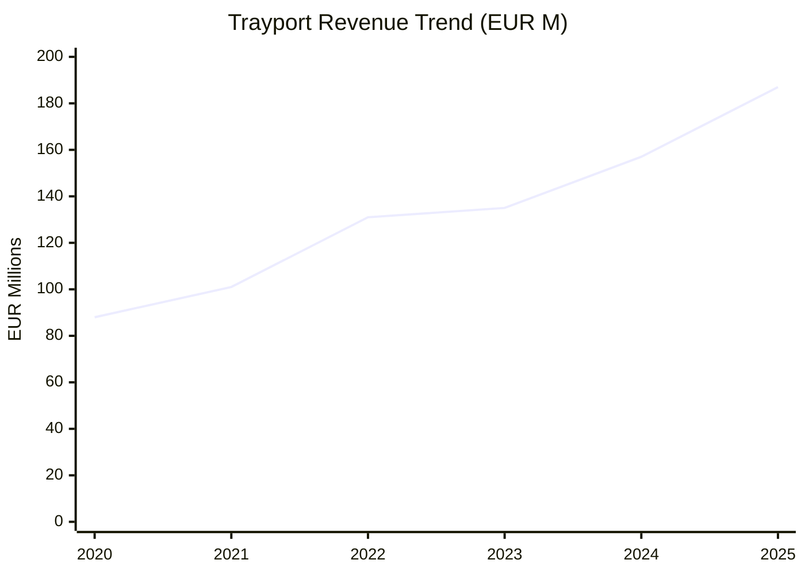
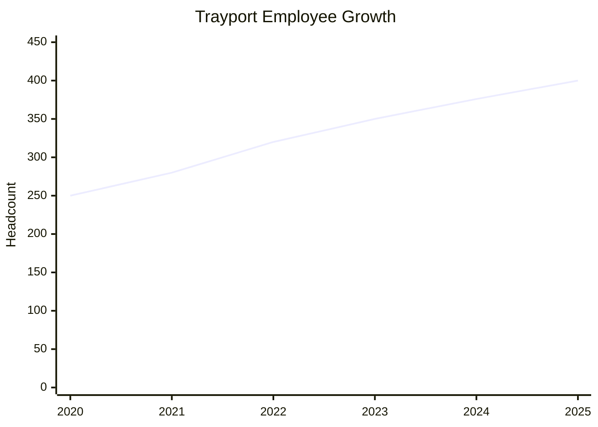
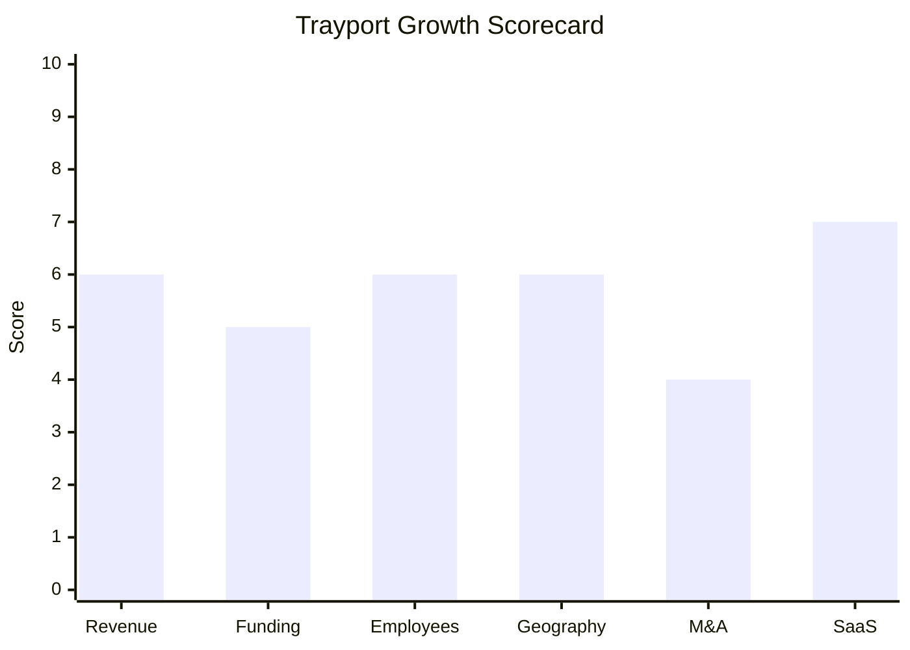

# Financial & Growth Deep-Dive - Trayport (TMX Group)

**Research Date**: 2026-02-15
**Data Availability**: Medium-High (Trayport is a subsidiary of publicly listed TMX Group on TSX; segment-level revenue disclosed in MD&A, but not full standalone P&L)

---

### Revenue Timeline

Trayport operates as the "TMX Trayport" segment within TMX Group Limited (TSX: X). The 2024 MD&A discloses TMX Trayport's 2024 full-year revenue at **CAD $235.0M**. TMX states that "since its acquisition in 2017, Trayport's annual revenues have more than doubled", implying a 2017/2018 base of approximately CAD $100-115M. Historical years are estimated using this anchor, known quarterly YoY growth rates, and energy market conditions.

| Year | Revenue | Currency | EUR Equivalent | YoY Growth | Source | Confidence |
| --- | --- | --- | --- | --- | --- | --- |
| 2025 (est.) | ~CAD 280M | CAD | ~EUR 187M | ~19% | Extrapolated from Q1-Q3 2025 YoY rates (20%, 26%, 16%) | Estimated |
| 2024 | CAD 235.0M | CAD | ~EUR 157M | ~19% | TMX Group 2024 MD&A, pricing changes table | Confirmed |
| 2023 | ~CAD 198M | CAD | ~EUR 135M | ~10% | Derived from 2024 revenue and ~19% growth in 2024 | Estimated |
| 2022 | ~CAD 180M | CAD | ~EUR 131M | ~20% | Estimated; energy crisis year drove trading volumes | Estimated |
| 2021 | ~CAD 150M | CAD | ~EUR 101M | ~15% | Estimated; post-COVID recovery, rising energy prices | Estimated |
| 2020 | ~CAD 130M | CAD | ~EUR 88M | ~8% | Estimated; COVID year but energy markets remained active | Estimated |

**Revenue CAGR (3yr, 2021-2024)**: ~16%
**Revenue CAGR (5yr, 2019-2024)**: ~14% (estimated, using ~CAD 120M 2019 base after Periotheus/VisoTech acquisitions)

**Notes on methodology**:
- 2024 figure is the only confirmed standalone TMX Trayport revenue (from the 2024 MD&A pricing changes table: "TMX Trayport 235.0, 2-3% CPI annual update")
- TMX Group total 2024 revenue was CAD $1,460.1M; TMX Trayport represents ~16% of group revenue
- EUR conversions use approximate annual average CAD/EUR rates (2024: 0.67, 2023: 0.685, 2022: 0.73, 2021: 0.674)
- Third-party estimates (Growjo: USD $65.6M, RocketReach: USD $73.5M) appear to reflect only UK entity revenue, not the full global TMX Trayport segment

#### Revenue Trend Chart

### Profitability

| Data Point | Value | Source | Confidence |
| --- | --- | --- | --- |
| EBITDA (current) | Not separately disclosed | TMX does not break out Trayport EBITDA | Unknown |
| EBITDA Margin | Not separately disclosed | TMX Group GSIA segment margin: 59% (Q1 2024) | Estimated (segment-level proxy) |
| Net Profit / Loss | Not separately disclosed | Subsidiary; absorbed into TMX Group consolidated | Unknown |
| Recurring Revenue % | ~90%+ estimated | Subscription-based licensee model; TMX recurring revenue ~55% overall, GSIA higher | Estimated |
| SaaS Revenue % | ~70-80% estimated | Joule is cloud SaaS; Periotheus hybrid; autoTRADER/Tradesignal SaaS | Estimated |
| Revenue per Employee | ~EUR 393K | Calculated: EUR 157M / ~400 employees (2024) | Estimated |

**Revenue per employee context**: EUR 393K/employee is strong for an energy software company, well above the EUR 150-250K industry range, indicating a high-value platform business with significant pricing power.

### Funding & Investment History

Trayport is a wholly-owned subsidiary of TMX Group Limited -- no external funding rounds apply. The investment story is told through TMX Group's acquisition and ongoing investment.

| Date | Round | Amount | Lead Investor(s) | Valuation | Source | Confidence |
| --- | --- | --- | --- | --- | --- | --- |
| Dec 2015 | ICE acquisition | USD $650M | Intercontinental Exchange (ICE) | USD $650M | Reuters, press releases | Confirmed |
| Dec 2017 | TMX acquisition from ICE | GBP £550M (~CAD $1B) | TMX Group (forced divestiture by UK CMA) | GBP £550M | TMX press release, Reuters, Finance Magnates | Confirmed |
| 2019-2021 | Bolt-on acquisitions | Not separately disclosed | TMX Group (parent) | N/A | Trayport press releases | Confirmed (deals), Unknown (amounts) |

**Total Invested by Parent**: GBP £550M+ (original acquisition) + undisclosed bolt-on acquisition costs
**Latest Valuation**: Not applicable (wholly-owned subsidiary). However, at 2024 revenue of CAD $235M and typical energy software multiples (8-12x revenue), implied value is CAD $1.9-2.8B -- a significant appreciation from the £550M (~CAD $1B) acquisition price.
**Current Investors**: TMX Group Limited (100% ownership); TMX is publicly listed on TSX
**War Chest Signals**: TMX Group has a strong investment-grade balance sheet. 2024 pricing table shows 2-3% CPI annual price increases for Trayport, indicating pricing power. TMX made 3 acquisitions in 2024 (VettaFi, Newsfile, iNDEX Research) showing parent is actively investing, though recent M&A focus has been on data/analytics rather than energy.

### Employee Timeline

| Year | Headcount | YoY Growth | Source | Confidence |
| --- | --- | --- | --- | --- |
| 2026 (current) | 400+ | ~6% | Trayport careers page, company about page | Confirmed |
| 2025 | ~400 | ~6% | Trayport company page ("400+ employees") | Confirmed |
| 2024 | ~376 | ~8% | Growjo estimate | Estimated |
| 2023 | ~350 | ~9% | Estimated from Growjo 8% growth rate | Estimated |
| 2022 | ~320 | ~14% | Estimated; post-Tradesignal acquisition integration | Estimated |
| 2021 | ~280 | ~12% | Estimated; Tradesignal acquired (added Bremen office + staff) | Estimated |

**Employee CAGR (3yr, 2021-2024)**: ~10%
**Current Open Positions**: ~16 (LinkedIn); active hiring via Workday portal
**Hiring Hotspots**: London (HQ), Vienna, Bremen, Singapore
**AI/ML/Data Science Roles**: No specific AI/ML roles identified in current openings
**Key Note**: Original competitor profile listed ~240 employees, which appears to be an undercount or outdated. The 400+ figure from Trayport's own careers page and about page (representing 50+ nationalities across 4 offices) is the current confirmed number.

#### Employee Growth Chart

### Geographic & Market Expansion

| Year | Expansion Event | Details | Source | Confidence |
| --- | --- | --- | --- | --- |
| 2017 | TMX Group acquires Trayport | London HQ; European energy markets focus | TMX press release | Confirmed |
| 2019 | VisoTech acquisition (Vienna) | Added Vienna office; European spot power/gas algorithmic trading | Trayport press release | Confirmed |
| 2019 | Periotheus acquisition | Energy scheduling/nominations for European markets | Trayport about page | Confirmed |
| 2021 | Tradesignal acquisition (Bremen) | Added Bremen office; charting and rule-based trading | Trayport press release | Confirmed |
| ~2022-2024 | Asia-Pacific expansion | Singapore office; Japanese power market entry (world's 3rd largest liberalized power market) | Trayport Asia Pacific page | Confirmed |
| 2024 | North American power entry | Partnership with Nodal Exchange; 4% of revenue from North American sources | TMX Group 2024 MD&A | Confirmed |
| Feb 2026 | Abaxx Exchange partnership | LNG futures, weather derivatives, environmental contracts (CORSIA, REDD+) on Joule | Trayport press release | Confirmed |

**International Revenue %**: ~96% non-North American (TMX MD&A states 4% from North American sources in 2024)
**Expansion Trajectory**: Trayport is methodically expanding from its European core (40+ countries) into North American power and Asia-Pacific LNG/power markets. The strategy is platform-led (extending Joule connectivity to new exchanges and markets) rather than office-led. Expansion pace is steady but not aggressive.

### M&A Activity

| Date | Target | Deal Size | Capability Gained | Strategic Rationale | Source | Confidence |
| --- | --- | --- | --- | --- | --- | --- |
| 2019 | VisoTech (Vienna) | Not disclosed | Algorithmic trading for European spot power/gas | Intraday trading automation, Joule integration | Trayport/TMX press release | Confirmed (deal), Unknown (price) |
| 2019 | Periotheus | Not disclosed | Energy scheduling, nominations, balancing, TSO communication | Expand from pure OTC trading into energy operations | Trayport about page | Confirmed (deal), Unknown (price) |
| 2019 | autoTRADER | Not disclosed (may be organic or part of VisoTech) | Algorithmic trading with out-of-box algorithms | Position closing, flexibility marketing, gas arbitrage | Trayport about page | Estimated |
| May 2021 | Tradesignal (Bremen) | Not disclosed | Rule-based trading, technical charting, 200+ indicators | Complement Joule with charting/backtesting; former certified solutions provider | Trayport press release | Confirmed (deal), Unknown (price) |

**Divestitures**: None
**M&A Pattern**: Capability-building acquisitions in 2019-2021 focused on adding algorithmic trading, technical analysis, and energy operations management to the core Joule OTC trading platform. No acquisitions since May 2021 -- Trayport appears to be in an integration and organic growth phase. Parent TMX Group's recent M&A (VettaFi, Newsfile, iNDEX Research) has been data/analytics-focused, not energy-specific.

### SaaS Transition Metrics

| Data Point | Value | Source | Confidence |
| --- | --- | --- | --- |
| Deployment Model | Hybrid (Joule = cloud SaaS; Periotheus = on-prem + SaaS elements) | Product pages, TMX documentation | Confirmed |
| Cloud Revenue % (current) | ~70-80% estimated | Joule is primary revenue driver and is cloud SaaS | Estimated |
| Recurring Revenue % | ~90%+ estimated | Subscription-based licensee model (9,800+ licensees) | Estimated |
| Platform Stack | Proprietary; Joule web-based, REST APIs, Python SDK for analytics | Product pages, Data Analytics docs | Confirmed |
| Migration Status | Mostly complete for core Joule; Periotheus retains on-prem elements | Product architecture descriptions | Estimated |
| Customer Count | 390+ trader firms, 45+ brokers/exchanges, 65+ 3rd-party providers | Trayport website | Confirmed |
| Total Licensees | 9,800+ (25% increase in 2024) | Trayport website, TMX Q4 2024 earnings | Confirmed |
| Trading Volume | 620M+ trades in 2025 | Trayport/Abaxx press release | Confirmed |
| Asset Classes | 8 (power, gas, coal, emissions, iron ore, oil, freight, voluntary carbon) | Joule product page | Confirmed |
| Market Coverage | 20+ power markets, 15+ gas markets | Joule product page | Confirmed |

### Growth Scorecard

| Dimension | Score (1-10) | Evidence Summary |
| --- | --- | --- |
| Revenue Growth | 6 | ~16% 3yr CAGR (2021-2024); consistent double-digit growth, CAD 235M confirmed for 2024 |
| Funding Momentum | 5 | No external funding (subsidiary), but TMX Group parent invested £550M+ and provides strong backing |
| Employee Growth | 6 | ~10% 3yr CAGR; steady growth from ~280 to 400+ employees across 4 offices |
| Geographic Expansion | 6 | Entering North America (4% of revenue) and Asia-Pacific; new exchange partnerships (Abaxx) |
| M&A Activity | 4 | 4 acquisitions in 2019-2021 (strong), but no M&A activity since May 2021 |
| SaaS Maturity | 7 | Joule is cloud SaaS; ~90%+ recurring revenue; 9,800+ licensees; hybrid model for Periotheus |
| **COMPOSITE SCORE** | **5.7** | **Classification: Riser** |

**Classification Thresholds**:

- **Rocket** (avg 7.0-10.0): Explosive growth, heavy investment, market disruptor
- **Riser** (avg 5.0-6.9): Strong growth signals, investing in future, accelerating
- **Steady** (avg 3.0-4.9): Stable but not transforming, evolutionary
- **Dinosaur** (avg 1.0-2.9): Flat or declining, legacy mode, no visible investment

#### Growth Scorecard Radar

---

### Key Insights for Eneve

1. **Bigger than expected**: At CAD $235M (~EUR 157M) in 2024 revenue and 400+ employees, Trayport is significantly larger than the original competitor profile suggested (~240 employees, revenue "not disclosed"). This makes Trayport one of the largest direct competitors in the energy back-office space.

2. **Platform network effects**: With 9,800+ licensees, 390+ firms, and 620M+ trades annually, Trayport has built strong network effects around its Joule platform that are difficult to replicate. The 25% licensee growth in 2024 shows the network is still expanding.

3. **Steady but not explosive**: At a 5.7 composite score (Riser), Trayport is growing consistently (~16% revenue CAGR) but not aggressively disrupting. No AI/ML push, no recent acquisitions, no transformative funding. The "fastest-growing TMX business" claim is relative to TMX's other financial infrastructure businesses.

4. **Periotheus is the Eneve overlap**: Trayport's main business (Joule) is OTC energy trading connectivity -- a different market from Eneve. Periotheus (scheduling, nominations, TSO communication) is the direct competitor. Periotheus is a relatively small part of the CAD $235M total and is not the growth driver.

5. **Geographic diversification risk**: Trayport's expansion into North America and Asia-Pacific could eventually bring scale advantages back into European operations, but currently 96% of revenue remains European. Eneve's NL-focused position is not under direct geographic threat from Trayport's expansion strategy.

6. **No AI signals**: Unlike many competitors investing heavily in AI/ML (tem, MaxBill, Volue, EG), Trayport's autoTRADER is algorithmic/rule-based, not ML-driven. No AI/ML hiring signals detected. This could become a competitive disadvantage if AI-native entrants disrupt energy scheduling.

---

**Data Sources**: TMX Group 2024 MD&A (Feb 2025), TMX Group Q4 2025 earnings release (Feb 2026), TMX Group Investor Day materials (Jun 2024), Trayport press releases, Trayport product pages, Reuters, Finance Magnates, Growjo, RocketReach, UK Companies House, LinkedIn.
