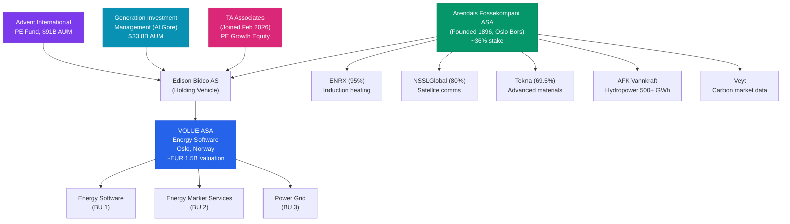
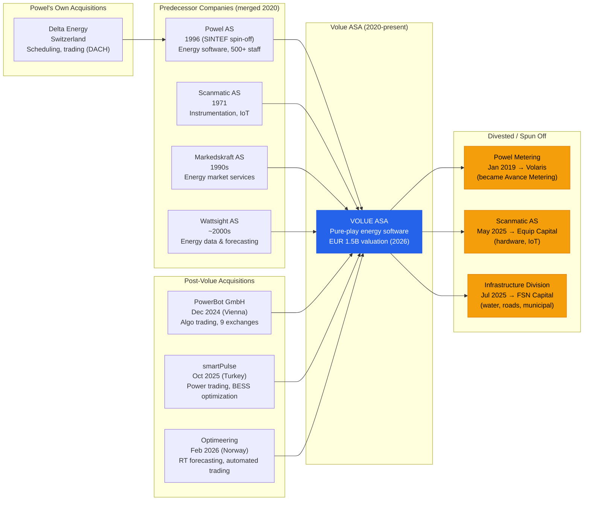

# Volue ASA - Corporate History

**Research Date**: 2026-02-15
**Genealogy Confidence**: High (extensive public disclosures from listed period 2020-2024, AFK annual reports, Euronext filings, press releases)

## Current Ownership & Key Parties

| Stakeholder | Role | Stake % | Type | Since | Source |
|---|---|---|---|---|---|
| Advent International | PE co-investor (via Edison Bidco AS) | ~43% (pre-TA) | PE | Oct 2024 | Euronext filing, volue.com |
| Arendals Fossekompani ASA | Founding parent / co-investor | ~36% (post-TA) | Strategic / Industrial | 2020 (reduced from 60%) | AFK press release Feb 2026 |
| Generation Investment Management | Co-investor (via Edison Bidco AS) | ~17% (pre-TA) | Sustainable / ESG | Oct 2024 | Euronext filing |
| TA Associates | New strategic investor | Undisclosed (joined Feb 2026) | PE / Growth equity | Feb 2026 | volue.com, BusinessWire |

**Note on ownership**: TA Associates entered in February 2026 at an implied equity valuation of ~EUR 1.5 billion (NOK 17 billion). AFK's stake was diluted from ~40% to ~36%, receiving ~EUR 38M in cash proceeds with remaining shareholding valued at ~EUR 520M. The exact redistribution among Advent, Generation, and TA has not been publicly disclosed.

**Board of Directors** (post take-private):

| Name | Role | Represents | Background | Source |
|---|---|---|---|---|
| Pete Daffern | Chairman | Investors | Appointed post-acquisition | volue.com/management |
| Douglas Hallstrom | Board member | Advent International | Director at Advent | MergerLinks, AFK filing |
| Dave Easton | Board member | Generation Investment Management | Growth Equity Partner | AFK filing |

**Note**: Full post-acquisition board composition is not fully public since delisting. Board likely includes AFK representative(s) and additional independent directors.

**Corporate Structure** (Mermaid diagram):



**AFK sister companies in the energy sector**: Veyt (carbon market data/analytics, acquired by AFK 2021) and AFK Vannkraft (hydropower generation, 500+ GWh/year) are the most relevant. ENRX (wireless charging for EVs) has tangential energy transition relevance. None directly compete with or complement Volue's energy software offering, suggesting AFK treats Volue as its primary energy software vehicle.

## Origin Story

| Data Point | Value | Source | Confidence |
|---|---|---|---|
| Ultimate origin | 1896 - Arendals Fossekompani founded in Arendal, Norway, for hydropower | arendalsfossekompani.no/history | Confirmed |
| Energy software origin | 1996 - Powel AS founded as spin-off from EFI (Norwegian Electric Power Research Institute), part of SINTEF Group, in Trondheim | ctrmcenter.com, Wikipedia | Confirmed |
| Data analytics origin | ~1990s - Wattsight (25+ years of energy market analysis experience by 2020) | Wattsight company descriptions | Estimated |
| Market services origin | 1990s - Markedskraft AS established during Norwegian electricity market deregulation | arendalsfossekompani.no/history | Confirmed |
| Hardware/IoT origin | 1971 - Scanmatic AS founded (instrumentation, automation, signal processing) | scanmatic.no | Confirmed |
| Volue formed | March 2020 - AFK consolidates Powel + Scanmatic + Markedskraft + Wattsight into Volue | AFK press release, volue.com | Confirmed |
| Original mission | Green-tech software group for Europe's energy transition | AFK launch announcement | Confirmed |
| Original product portfolio | Energy software (Powel), data analytics (Wattsight), market services (Markedskraft), infrastructure IoT (Scanmatic) | volue.com | Confirmed |
| First markets | Norway, Nordics, DACH (Switzerland through Delta Energy acquisition by Powel) | Various | Confirmed |
| Pro forma at launch (2019) | NOK 800M revenue, 500 employees, 2,000+ customers across 44 countries | AFK launch announcement | Confirmed |

**Deeper origin narrative**: Volue's roots extend much further than its 2020 founding date suggests. The company is the culmination of Arendals Fossekompani's 125+ year journey from hydropower producer to technology investor. The most important predecessor is **Powel AS** (1996), which was spun off from the prestigious SINTEF/EFI research institute -- giving Volue a deep academic and R&D heritage in energy systems. Powel grew to 500+ employees across 8 countries before being folded into Volue. The **Markedskraft** lineage (1990s) brings wholesale electricity market expertise born from Norway's early deregulation of its power market. **Wattsight** brings 25+ years of energy data analytics and forecasting. **Scanmatic** (1971) brought 50 years of instrumentation experience, but was later divested as non-core.

## Corporate Identity Changes

| # | Date | From | To | Reason | Source |
|---|---|---|---|---|---|
| 1 | 1996 | EFI/SINTEF spin-off | Powel AS | Company founded as commercial spin-off from research institute | ctrmcenter.com, Wikipedia |
| 2 | Mar 2020 | Powel + Scanmatic + Markedskraft + Wattsight | Volue (group name) | AFK consolidation of four portfolio companies into unified green-tech group | AFK press release |
| 3 | Jan 2021 | Powel, Scanmatic, Markedskraft, Wattsight (individual brands) | All renamed to Volue | Full corporate identity rebrand; 7 product families under single brand | mynewsdesk.com/volue |
| 4 | Jan 2024 | Volue Industrial IoT | Scanmatic AS (rebranded back) | Autonomous subsidiary status restored before planned divestiture | volue.com press release |

**Product name changes**: Powel's "Smart Generation Suite" and individual product names were absorbed into Volue's product family structure (Volue Smart Power, Volue Insight, Ancitra, etc.). Delta Energy's scheduling/trading products became part of Volue Smart Power. Wattsight's analytics became "Insight by Volue."

## Mergers & Acquisitions Timeline

### Acquisitions Made (as buyer)

| Date | Target Company | Deal Value | What Was Gained | Integration Outcome | Source |
|---|---|---|---|---|---|
| Pre-2020 | Delta Energy Solution AG (Switzerland) | Undisclosed | Power/gas scheduling, logistics, capacity planning, trading, contract management for DACH region; Basel became Powel's DACH HQ | Integrated into Volue Smart Power | ctrmcenter.com |
| Mar 2020 | Powel AS (internal consolidation) | N/A (AFK restructuring) | Energy software platform, 500+ employees, 1,000+ clients, 8 countries | Core of Volue Energy Software BU | AFK press release |
| Mar 2020 | Scanmatic AS (internal consolidation) | N/A (AFK restructuring) | Instrumentation, IoT, water/infrastructure monitoring (founded 1971) | Became Volue Industrial IoT; later divested | AFK press release |
| Mar 2020 | Markedskraft AS (internal consolidation) | N/A (AFK restructuring) | Energy market analysis, wholesale electricity services (1990s) | Integrated into Volue energy services | AFK press release |
| Mar 2020 | Wattsight AS (internal consolidation) | N/A (AFK restructuring) | Energy data forecasting, price analytics, 25+ years of market intelligence | Became "Insight by Volue" | AFK press release |
| Dec 2024 | PowerBot GmbH (Vienna, Austria) | Undisclosed | Quantitative algorithmic trading on 9 European power exchanges, 85+ customers across 26 countries | Joined Volue product portfolio Jan 2025 | AFK press release, volue.com |
| Oct 2025 | smartPulse (Turkey) | Undisclosed | Short-term power trading, battery optimization (BESS), ISV at EPEX SPOT/Nord Pool, 80+ specialists, Central/Eastern/Southern Europe + Turkey presence | Extended geographic reach and battery optimization capabilities | volue.com, pes.eu.com |
| Feb 2026 | Optimeering (Norway) | Undisclosed | Real-time power market forecasting (grid imbalances, aFRR, mFRR prediction), automated trading execution | Combined with Volue's trading engine for end-to-end short-term optimization | volue.com, AFK press release |

### Acquired By (as target)

| Date | Acquiring Entity | Deal Value | Strategic Rationale | Source |
|---|---|---|---|---|
| Oct 2024 | Edison Bidco AS (Advent International + Generation Investment Management + AFK) | NOK 6.1B (~EUR 530M) at NOK 42/share (51% premium) | Take-private to enable accelerated growth without public market constraints; position for energy transition opportunity | Euronext filing, volue.com |
| Feb 2026 | TA Associates (additional PE investor) | Implied equity valuation ~EUR 1.5B (NOK 17B) | Growth capital for innovation, expansion, and strategic M&A acceleration | volue.com, BusinessWire |

## Investment & Financial Events

| Date | Event Type | Details | Investors/Counterparty | Investor Type | Amount | Source |
|---|---|---|---|---|---|---|
| Oct 2020 | IPO (Merkur Market / Euronext Growth) | Private placement and listing on Oslo Stock Exchange's Merkur Market at NOK 32/share | Public market + 9 cornerstone investors | Public market | NOK 500M primary raise; NOK 4B pre-money valuation | Euronext, AFK press release |
| Oct 2020 | Secondary offering | AFK sold existing shares alongside IPO | Arendals Fossekompani (seller) | Strategic | Up to NOK 500M in existing shares | AFK press release |
| Jul 2024 | Take-private offer announced | Voluntary tender offer at NOK 42/share (51% premium); implied ~NOK 6.1B enterprise value | Advent International, Generation Investment Management, AFK | PE + Sustainable + Strategic | NOK 6.1B total | Euronext filing |
| Oct 2024 | Take-private completed | Edison Bidco acquired 98.9% of shares; compulsory acquisition of remainder | Edison Bidco AS | PE consortium | NOK 42/share | Euronext filing |
| Dec 2024 | Delisting | Shares delisted from Oslo Stock Exchange | N/A | N/A | N/A | Euronext |
| Feb 2026 | New PE investor | TA Associates joins as 4th strategic investor | TA Associates | PE / Growth equity | Implied EUR 1.5B equity valuation (NOK 17B); AFK received EUR 38M cash | volue.com, BusinessWire |

**Revenue milestones**:

| Year | Revenue (NOK M) | YoY Growth | Adj. EBITDA Margin | Source | Confidence |
|---|---|---|---|---|---|
| 2019 (pro forma) | ~800 | N/A | N/A | AFK launch announcement | Confirmed |
| 2020 | 892 | ~12% (vs pro forma) | N/A | Historical filings | Confirmed |
| 2021 | 1,061 | +19% | N/A | stockanalysis.com | Confirmed |
| 2022 | 1,219 | +15% | N/A | stockanalysis.com | Confirmed |
| 2023 | 1,464 | +20% | 18% | 2023 annual report | Confirmed |
| 2024 (est.) | ~1,600-1,700 | +10-16% | 21-22% | Extrapolated from H1 2024 | Estimated |

**Valuation trajectory**: NOK 4B (IPO Oct 2020) -> NOK 6.1B (take-private Oct 2024, +53%) -> NOK 17B (TA Associates Feb 2026, +179% from take-private). The ~3x valuation increase in 15 months of private ownership signals massive value creation through strategic transformation, divestitures, and M&A.

## Splits, Spin-offs & Divestitures

| Date | Event Type | What Was Separated | Destination / Buyer | Reason | Source |
|---|---|---|---|---|---|
| Jan 2019 | Divestiture (pre-Volue) | Powel Metering AS + Powel Energy Management AB (meter data management, AMR/AMI for 50 DSOs) | Volaris Group (rebranded as Avance Metering) | Focus Powel on core energy software; exit commoditized metering market | GlobeNewsWire, alpha.no |
| Jan 2024 | Subsidiary autonomy | Volue Industrial IoT -> rebranded back to Scanmatic AS | Autonomous subsidiary of Volue | Preparation for divestiture; hardware didn't fit software strategy | volue.com press release |
| May 2025 | Divestiture | Scanmatic AS (instrumentation, automation, IoT; founded 1971) | Measure It / Cautus Geo (owned by Equip Capital) | Non-core; hardware company within software group | volue.com press release |
| Jul 2025 | Divestiture | Infrastructure division (~100 employees, Gemini suite, water/roads/municipal software) | FSN Capital VI (PE fund, EUR 1.8B) | Sharpen focus on energy and power grid; exit water/infrastructure | volue.com, Bluefield Research |

**Divestiture pattern analysis**: Volue has systematically shed everything that is not core energy software. The metering business went first (2019, before Volue even existed). After the take-private, the pace accelerated: Scanmatic (hardware, 2025), Infrastructure (water/construction, 2025). What remains is a pure-play energy software company across three business units. This is classic PE portfolio optimization -- buy at a lower multiple as a conglomerate, divest non-core to concentrate the thesis, re-rate as a focused energy software platform.

## Critical Events & Milestones

| Date | Event | Impact | Source |
|---|---|---|---|
| 1896 | Arendals Fossekompani founded in Arendal, Norway | Origin of parent company; hydropower roots give energy sector DNA spanning 130 years | arendalsfossekompani.no |
| 1913 | AFK listed on Oslo Stock Exchange; first power from Bøylefoss | Establishes AFK as public company and energy producer | AFK history page |
| 1960s | AFK transitions from energy producer to investment company | Strategic pivot: energy production -> technology investment. Seeds the future of Volue | AFK history page |
| 1971 | Scanmatic AS founded | Instrumentation heritage; eventually integrated then divested | scanmatic.no |
| 1990s | Markedskraft established during Norwegian electricity deregulation | First-mover advantage in Nordic energy market services | AFK history page |
| 1996 | Powel AS spun off from EFI/SINTEF in Trondheim | Energy software R&D heritage; becomes core of future Volue | Wikipedia, ctrmcenter.com |
| Pre-2020 | Powel acquires Delta Energy Solution AG (Switzerland) | DACH market entry; scheduling/trading capabilities added | ctrmcenter.com |
| Jan 2019 | Powel divests metering business to Volaris | Signals focus shift away from meter data management toward trading/optimization | GlobeNewsWire |
| Mar 2020 | Volue formed by AFK consolidating Powel + Scanmatic + Markedskraft + Wattsight | Creates integrated energy technology group; NOK 800M revenue, 500 employees, 2,000+ customers | AFK press release |
| Oct 2020 | Volue IPO on Euronext Growth (Merkur Market) at NOK 32/share; raises NOK 500M | Public listing; NOK 4B pre-money valuation; validates green-tech thesis | Euronext, AFK |
| Jan 2021 | All group companies formally rebranded to Volue; 7 product families launched | Single unified brand; market repositioning from "Powel etc." to "Volue" | mynewsdesk.com |
| 2021-2023 | Rapid revenue growth: NOK 892M -> 1,464M (64% in 3 years) | Proves organic growth + SaaS transition model; attracts PE interest | Annual reports |
| 2023 | SaaS transformation passes 70% recurring revenue milestone | Fundamental business model shift from perpetual licenses to recurring SaaS | Q1/Q2 2024 results |
| Jul 2024 | Take-private announced: Advent + Generation + AFK offer NOK 42/share (51% premium) | Transitions from public scrutiny to PE-backed growth mode; NOK 6.1B enterprise value | Euronext filing |
| Oct 2024 | Take-private completed via Edison Bidco AS; 98.9% acceptance | AFK reduces from 60% to ~40%; Advent (~43%) and Generation (~17%) join | Euronext filing |
| Dec 2024 | PowerBot GmbH acquired (Vienna); Volue delisted from Oslo Stock Exchange | Adds algo trading on 9 exchanges; company goes fully private | volue.com, Euronext |
| Jan 2025 | Reorganized into 3 business units: Energy Software, Energy Market Services, Power Grid | Streamlined structure post-acquisition; prepares for focused growth | volue.com press release |
| May 2025 | Scanmatic AS divested to Equip Capital | Sheds hardware/IoT; pure software focus | volue.com |
| Jul 2025 | Infrastructure division sold to FSN Capital VI | Exits water/construction software; pure-play energy company | volue.com |
| Aug 2025 | CEO Trond Straume steps down after 5.5 years | End of founding-CEO era; interim leadership by Martin Vieider + Pete Daffern | volue.com |
| Oct 2025 | smartPulse acquired (Turkey); SpotEx15 ML forecasting launched | Southern/Eastern Europe + Turkey expansion; AI capabilities advancing | volue.com |
| Jan 2026 | Stephan Sieber appointed CEO | New PE-backed growth CEO; mandate to drive transformation and global expansion | volue.com |
| Feb 2026 | TA Associates joins as 4th investor at EUR 1.5B valuation; Optimeering acquired | Valuation nearly 3x from take-private; forecasting + automated trading capabilities added | volue.com, BusinessWire |
| Feb 2026 | AI-weather forecasting showcased at E-world 2026 | 24 hourly updates/day vs 4 traditional; positions Volue as AI leader in energy | volue.com |

## Corporate Timeline (Visual)

```mermaid
timeline
    title Volue ASA - Corporate History
    section Deep Roots (1896-1995)
        1896 : Arendals Fossekompani founded (hydropower)
        1913 : AFK listed on Oslo Stock Exchange
        1960s : AFK pivots from energy producer to investment company
        1971 : Scanmatic AS founded (instrumentation)
        1990s : Markedskraft established during NO electricity deregulation
    section Energy Software Genesis (1996-2019)
        1996 : Powel AS spun off from EFI/SINTEF (Trondheim)
        ~2000s : Wattsight established (energy data analytics)
        Pre-2020 : Powel acquires Delta Energy (Switzerland, DACH entry)
        Jan 2019 : Powel divests metering business to Volaris
    section Volue Formation & Growth (2020-2023)
        Mar 2020 : Volue formed (Powel + Scanmatic + Markedskraft + Wattsight)
        Oct 2020 : IPO on Euronext Growth at NOK 32/share, raises NOK 500M
        Jan 2021 : All entities rebranded to Volue
        2021-2023 : Revenue grows 64% (NOK 892M to 1,464M)
    section PE Transformation (2024-2026)
        Jul 2024 : Take-private announced (Advent + Generation + AFK)
        Oct 2024 : Acquisition completed via Edison Bidco at NOK 42/share
        Dec 2024 : PowerBot acquired (Vienna); delisted from OSE
        Jan 2025 : Reorganized into 3 business units
        May 2025 : Scanmatic divested (Equip Capital)
        Jul 2025 : Infrastructure division sold (FSN Capital)
        Aug 2025 : CEO Trond Straume departs
        Oct 2025 : smartPulse acquired (Turkey); SpotEx15 ML launched
        Jan 2026 : Stephan Sieber appointed CEO
        Feb 2026 : TA Associates invests at EUR 1.5B valuation; Optimeering acquired
```



## M&A Genealogy (Visual)



## Corporate Timeline (Text Summary)

```text
1896 - Arendals Fossekompani (AFK) founded in Arendal, Norway, for hydropower generation
1913 - AFK listed on Oslo Stock Exchange; delivers first power from Bøylefoss plant
1960s - AFK transitions from energy producer to investment company
1971 - Scanmatic AS founded (instrumentation, automation, signal processing)
1990s - Markedskraft AS established during Norwegian electricity market deregulation
1996 - Powel AS founded as spin-off from EFI/SINTEF Group in Trondheim
~2000s - Wattsight established (energy market data and forecasting)
Pre-2020 - Powel acquires Delta Energy Solution AG (Switzerland) for DACH expansion
Jan 2019 - Powel divests metering software to Volaris (becomes Avance Metering)
Mar 2020 - AFK forms Volue by consolidating Powel + Scanmatic + Markedskraft + Wattsight
Oct 2020 - Volue IPO on Euronext Growth (Merkur Market) at NOK 32/share; raises NOK 500M; NOK 4B valuation
Jan 2021 - All entities formally rebranded to Volue; 7 product families launched
2021 - Revenue reaches NOK 1,061M (+19%); employee count 648
2022 - Revenue reaches NOK 1,219M (+15%); employee count 778
2023 - Revenue reaches NOK 1,464M (+20%); SaaS transition crosses 70% recurring revenue; 825 employees
Jul 2024 - Take-private announced: Advent + Generation + AFK at NOK 42/share (51% premium); NOK 6.1B
Oct 2024 - Take-private completed via Edison Bidco AS; 98.9% shares tendered
Dec 2024 - PowerBot GmbH acquired (Vienna, algo trading); Volue delisted from Oslo Stock Exchange
Jan 2025 - Reorganized into 3 BUs: Energy Software, Energy Market Services, Power Grid
May 2025 - Scanmatic AS divested to Equip Capital (hardware exit)
Jul 2025 - Infrastructure division sold to FSN Capital VI (water/construction exit)
Aug 2025 - CEO Trond Straume steps down after 5.5 years
Oct 2025 - smartPulse acquired (Turkey, power trading + battery optimization); SpotEx15 ML forecasting launched
Jan 2026 - Stephan Sieber appointed CEO with mandate for global expansion
Feb 2026 - TA Associates joins as 4th investor at EUR 1.5B (~NOK 17B) valuation; Optimeering acquired
Feb 2026 - AI-weather forecasting showcased at E-world 2026 (24 updates/day vs 4 traditional)
```

## Pattern Analysis

**Growth Strategy**: Hybrid -- strong organic growth (18% revenue CAGR 2020-2023) combined with accelerating acquisition cadence (3 acquisitions in 16 months since going private: PowerBot Dec 2024, smartPulse Oct 2025, Optimeering Feb 2026). The PE-backed phase shows clear shift toward acquisition-led growth.

**Acquisition Pattern**: Capability + Geographic expansion. Each acquisition fills a specific gap:
- PowerBot: algorithmic trading execution (capability)
- smartPulse: Southern/Eastern Europe + Turkey market access (geography) + battery optimization (capability)
- Optimeering: real-time forecasting + automated trading (capability)
Combined, these three acquisitions create an end-to-end short-term power market platform: forecast -> optimize -> trade -> execute.

**Divestiture Pattern**: Classic PE portfolio concentration. Systematic shedding of non-core assets (metering 2019, hardware/IoT 2025, water/infrastructure 2025) to create a pure-play energy software company. Each divestiture narrows the focus and increases the "software multiple" story for investors.

**Technology Evolution**:
- 1996-2019 (Powel era): On-premise energy software, enterprise deployments, Nordic focus
- 2020-2023 (Public Volue): SaaS transformation (reaching 71% recurring revenue), cloud migration, data analytics integration
- 2024-present (Private Volue): AI/ML integration (weather forecasting, price prediction, algorithmic trading), platform consolidation, automated execution

**Leadership Stability**: Moderate turnover at CEO level. Trond Straume served 5.5 years (2020-2025), bridging the formation-through-privatization period. His departure aligns with the classic PE pattern of replacing the "builder" CEO with a "scaler" CEO (Stephan Sieber). The CTO (Jorg Lienhardt) and CFO (Arnstein Kjesbu) provide continuity.

**Investor Evolution**: Public market (2020-2024) -> PE consortium (2024-2026) -> Multi-PE with growth equity (2026+). Each stage brings different capital and expertise. The addition of TA Associates (known for growth-stage software investments) alongside Advent (operational PE) signals a shift from restructuring to scaling.

## Strategic Implications for Eneve

**What the history reveals about future direction**:
- Volue is being systematically assembled as a European energy software champion. The PE consortium (Advent + Generation + TA + AFK) has an implied EUR 1.5B+ exit target, requiring significant revenue and geographic expansion. Expect 2-3 more acquisitions in 2026-2027.
- The divestiture of metering (2019), hardware (2025), and infrastructure (2025) shows deliberate avoidance of Eneve's meter data management space -- but this could change if Volue needs settlement/metering capabilities to complete its platform.
- The ~3x valuation increase in 15 months of private ownership (NOK 6.1B -> NOK 17B) means investors expect continued rapid value creation. This creates pressure for both growth and profitability that will drive aggressive market expansion.

**Inherited strengths from corporate history**:
- **Deep Nordic energy heritage** (via Powel/Markedskraft/Wattsight): 25+ years of energy market knowledge inherited from SINTEF research origins and Norwegian electricity deregulation
- **Academic R&D pedigree** (via Powel/SINTEF): The EFI/SINTEF spin-off origin gives Volue deep connections to Scandinavian energy research, different from competitors who grew from consulting or trading backgrounds
- **Data moat** (via Wattsight/Insight): 25+ years of accumulated energy market data and forecasting models; this historical dataset is a competitive advantage for AI/ML training that cannot be easily replicated
- **Multi-exchange connectivity** (via PowerBot + Algo Trader): 9+ European power exchanges, 190+ clients, handling >1/3 of European intraday trading volume. Network effects make this hard to displace.
- **PE war chest**: Four PE/institutional investors with combined AUM exceeding $125B. Acquisition capacity is essentially unlimited within the energy software domain.

**Inherited weaknesses / risks from corporate history**:
- **Integration complexity**: Volue is a patchwork of 7+ acquired/merged entities (Powel, Scanmatic, Markedskraft, Wattsight, Delta Energy, PowerBot, smartPulse, Optimeering). Integrating these into a cohesive platform is a multi-year challenge. Technical debt from merging different codebases, architectures, and data models is likely significant.
- **PE timeline pressure**: PE investors typically target 3-5 year exits. The 2024 investment implies a 2027-2029 exit window. This creates tension between long-term platform investment and short-term value creation metrics.
- **Leadership discontinuity**: CEO change during PE transformation period (Straume -> Sieber) introduces execution risk. New CEO must navigate both organic growth and M&A integration simultaneously.
- **Geographic breadth vs depth**: Acquisitions have spread Volue across Nordics, DACH, Italy, Turkey, Eastern Europe -- but none of these markets have the depth of penetration that Eneve has in the Netherlands. Breadth without depth is a classic PE trap.

**M&A prediction**: Based on the acquisition pattern (trading, forecasting, optimization) and stated gaps, Volue's next acquisitions are likely to target:
1. **Settlement/reconciliation capability** -- to complete the trade-to-settle cycle (this would directly threaten Eneve)
2. **Battery/storage optimization at scale** -- smartPulse was a start, but the BESS market is growing rapidly
3. **German market depth** -- Volue is present but not dominant in Germany, the largest European power market
4. **UK market entry** -- a notable gap in their European coverage

Eneve should particularly watch for Volue acquiring a Dutch or Belgian energy back-office player, which would instantly bridge the EDSN/settlement gap.
