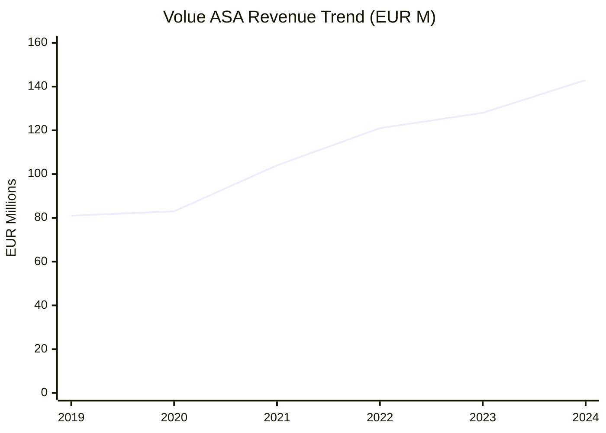
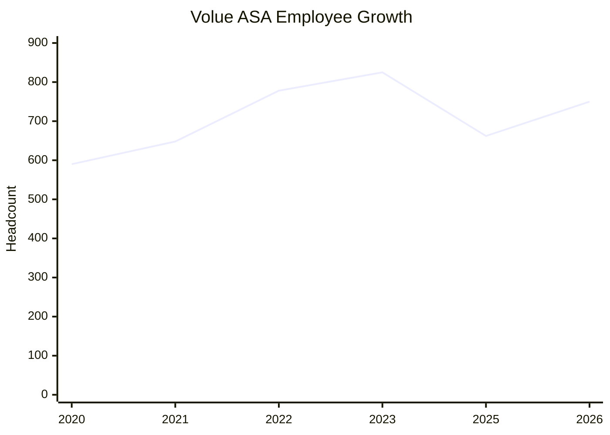
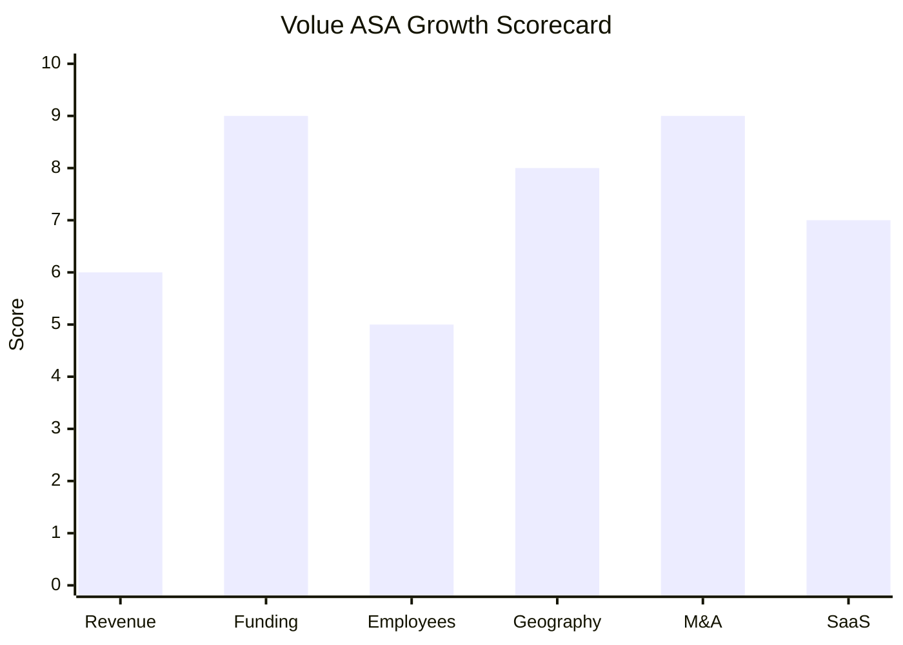

# Financial & Growth Deep-Dive - Volue ASA

**Research Date**: 2026-02-15
**Data Availability**: High (publicly traded on Oslo Stock Exchange Oct 2020 - Dec 2024; 4 years of audited annual reports, quarterly results, and Euronext filings available. Post-delisting data from Arendals Fossekompani annual report 2024 and press releases.)

### Revenue Timeline

| Year | Revenue | Currency | EUR Equivalent | YoY Growth | Source | Confidence |
| --- | --- | --- | --- | --- | --- | --- |
| 2024 | NOK 1,634M | NOK | ~EUR 143M | +12% | AFK 2024 Annual Report | Confirmed |
| 2023 | NOK 1,464M | NOK | ~EUR 128M | +20% | Volue 2023 Annual Report | Confirmed |
| 2022 | NOK 1,219M | NOK | ~EUR 121M | +15% | Volue 2022 Annual Report, stockanalysis.com | Confirmed |
| 2021 | NOK 1,061M | NOK | ~EUR 104M | +19% | Volue 2021 Annual Report, stockanalysis.com | Confirmed |
| 2020 | NOK 892M | NOK | ~EUR 83M | ~12% (vs pro forma) | Historical filings | Confirmed |
| 2019 (pro forma) | ~NOK 800M | NOK | ~EUR 81M | N/A | AFK launch announcement | Confirmed |

**Revenue CAGR (3yr, 2021-2024)**: ~15.4%
**Revenue CAGR (4yr, 2020-2024)**: ~16.3%

**EUR conversion notes**: Annual average exchange rates used (approximate): 2020: 10.72 NOK/EUR, 2021: 10.16, 2022: 10.10, 2023: 11.42, 2024: 11.40. NOK weakened significantly in 2023-2024, which compresses EUR-denominated growth. In constant-currency NOK terms, growth was stronger.

#### Revenue Trend Chart



### Profitability

| Data Point | Value | Source | Confidence |
| --- | --- | --- | --- |
| Adj. EBITDA (2024) | ~NOK 359M (~EUR 32M) | AFK 2024 Annual Report (22% margin on NOK 1,634M) | Confirmed |
| Adj. EBITDA Margin (2024) | 22% | AFK 2024 Annual Report | Confirmed |
| Adj. EBITDA (2023) | NOK 267M (~EUR 23M) | Volue 2023 Annual Report | Confirmed |
| Adj. EBITDA Margin (2023) | 18% | Volue 2023 Annual Report | Confirmed |
| EBITDA (2023) | NOK 208M (14% margin) | Volue 2023 Annual Report | Confirmed |
| Adj. EBITDA (2022) | NOK 203M (17% margin) | Volue 2022 Annual Report | Confirmed |
| EBITDA (2022) | NOK 147M (12% margin) | Volue 2022 Annual Report | Confirmed |
| Net Income (2023) | NOK 36.0M (~EUR 3.2M) | stockanalysis.com | Confirmed |
| Net Income (2022) | ~NOK 19.3M (~EUR 1.9M) | Derived (2023 was +86% vs 2022) | Estimated |
| Net Income (2021) | NOK 27.8M (~EUR 2.7M) | stockopedia.com | Confirmed |
| Recurring Revenue % (H1 2024) | 71% | Q1/Q2 2024 financial results | Confirmed |
| Recurring Revenue % (Q4 2023) | 66% | Q4 2023 financial results | Confirmed |
| Recurring Revenue % (2022) | 63% | Volue 2022 Annual Report | Confirmed |
| SaaS Revenue % (H1 2024) | 32-33% of total revenue | Q1/Q2 2024 financial results | Confirmed |
| SaaS Revenue Growth (Q1 2024 YoY) | +42% (NOK 126M) | Q1 2024 financial results | Confirmed |
| SaaS Revenue Growth (Q2 2024 YoY) | +38% (NOK 135M) | Q2 2024 financial results | Confirmed |
| Revenue per Employee (2023) | ~EUR 155K (NOK 1,464M / 825 employees) | Calculated | Confirmed |
| Revenue per Employee (2024 est.) | ~EUR 183K (NOK 1,634M / ~780 est. employees) | Calculated | Estimated |

**Profitability trajectory**: Volue's adj. EBITDA margin improved from 17% (2022) to 18% (2023) to 22% (2024), driven by SaaS transition (higher-margin recurring revenue replacing lower-margin project revenue) and a comprehensive restructuring program that reduced the operational cost base during 2024. The company is profitable at the net income level but thin margins reflect ongoing investment in SaaS transformation and R&D.

**Revenue composition shift**: The business model is actively transitioning away from volatility-driven non-recurring revenues toward stable ARR and SaaS revenue. SaaS revenue is growing 38-42% YoY even as total revenue grows 12-20%, meaning the revenue mix is rapidly improving in quality. The ARR base reached NOK 1,138M by end of 2023.

### Funding & Investment History

| Date | Round | Amount | Lead Investor(s) | Valuation | Source | Confidence |
| --- | --- | --- | --- | --- | --- | --- |
| Oct 2020 | IPO (Euronext Growth Oslo) | NOK 500M primary (~EUR 47M) + secondary offering | 9 cornerstone investors (Eika, Luxor, et al.) | NOK 4.0B pre-money (~EUR 373M) | Euronext filing, AFK press release | Confirmed |
| Jul 2024 | Take-private (tender offer) | NOK 6.1B enterprise value (~EUR 530M) | Advent International + Generation Investment Management + AFK | NOK 42/share (51% premium) | Euronext filing | Confirmed |
| Oct 2024 | Compulsory acquisition | 98.9% shares tendered | Edison Bidco AS | NOK 42/share | Euronext filing | Confirmed |
| Feb 2026 | Growth PE investment | Undisclosed (AFK received EUR 38M cash) | TA Associates | ~EUR 1.5B equity (~NOK 17B) | volue.com, BusinessWire | Confirmed |

**Total Capital Events Value**: NOK 500M IPO + NOK 6.1B take-private + EUR 1.5B valuation event = transformative capital trajectory
**Latest Valuation**: EUR 1.5 billion (February 2026) -- nearly 3x the take-private valuation of 15 months prior
**Current Investors**: Advent International (~43% pre-TA), Arendals Fossekompani (~36%), Generation Investment Management (~17% pre-TA), TA Associates (new entrant Feb 2026). Exact post-TA redistribution not disclosed.
**War Chest Signals**: Four institutional investors with combined AUM exceeding $125B (Advent: $91B, TA: $47.5B, Generation: $33.8B). PE guidance calls for 1-2 M&A deals per year. Acquisition capacity is effectively unlimited within the energy software domain. AFK 2024 annual report notes comprehensive restructuring program improving cash generation.

**Valuation trajectory**:

```text
NOK 4.0B (IPO Oct 2020) → NOK 6.1B (take-private Oct 2024, +53%) → NOK 17B (TA Feb 2026, +179%)
= ~4.25x valuation increase in 5 years
= ~2.8x increase in 15 months of private ownership
```

### Employee Timeline

| Year | Headcount | YoY Growth | Source | Confidence |
| --- | --- | --- | --- | --- |
| 2026 (Feb) | 750+ | ~+13% (vs post-divestiture base) | TA Associates press release | Confirmed |
| 2025 (May) | ~662 | ~-20% (vs 2023; reflects divestitures) | clay.com | Estimated |
| 2023 | 825 (746 FT + 79 PT) | +6% | Volue 2022 Annual Report, stockanalysis.com | Confirmed |
| 2022 | 778 | +20% | stockanalysis.com | Confirmed |
| 2021 | 648 | +10% | stockanalysis.com | Confirmed |
| 2020 | 590 | N/A (founding year as Volue) | stockanalysis.com | Confirmed |

**Employee CAGR (3yr, 2020-2023)**: ~11.8%
**Current Open Positions**: 21 (per volue.teamtailor.com, Feb 2026)
**AI/ML/Data Science Roles**: Not explicitly labeled as "AI/ML" in job titles, but software engineering roles in Gdansk (Poland) and Vienna are working on ML/AI trading applications; also hiring Trading Consultants and SmartPulse integration roles.
**Hiring Hotspots**: Gdansk (Poland) -- majority of engineering roles; Oslo/Trondheim (Norway); Munich (Germany); Vienna (Austria); Belgrade (Serbia, new market)

**Headcount context**: The apparent decline from 825 (2023) to ~662 (May 2025) is primarily driven by two divestitures: Scanmatic AS (May 2025, instrumentation/IoT) and Infrastructure division (Jul 2025, ~100 employees, water/construction software). The subsequent recovery to "750+" (Feb 2026) reflects the smartPulse acquisition (80+ specialists, Oct 2025) and Optimeering acquisition (Feb 2026). Net of divestitures and acquisitions, the organic core workforce is relatively stable with moderate hiring.

#### Employee Growth Chart



**Note**: 2025 figure reflects post-divestiture low point (May 2025); 2026 figure reflects post-acquisition recovery (Feb 2026). The dip is strategic portfolio optimization, not business decline.

### Geographic & Market Expansion

| Year | Expansion Event | Details | Source | Confidence |
| --- | --- | --- | --- | --- |
| 2024 | Italy market entry | Algo Trader Power deployed on IPEX (Italian Power Exchange) | volue.com | Confirmed |
| 2024 | Austria presence | PowerBot GmbH acquisition brings Vienna office, 85+ customers across 26 countries | volue.com, AFK press release | Confirmed |
| 2025 | Poland development center | Active engineering hiring in Gdansk; multiple open roles | volue.teamtailor.com | Confirmed |
| 2025 | Turkey + Central/SE Europe | smartPulse acquisition (Istanbul) brings presence in Turkey, Central Europe, Southern Europe | volue.com, pes.eu.com | Confirmed |
| 2025 | Baltic states | Expanded following EU grid synchronization (Feb 2025) | volue.com press releases | Confirmed |
| 2025 | Eastern Europe expansion | Sales Account Executive role open for South East Europe (Serbia-based) | volue.teamtailor.com | Confirmed |
| 2026 | Norway (forecasting) | Optimeering acquisition strengthens Norwegian operations | volue.com | Confirmed |

**International Revenue %**: Not disclosed as a separate figure; majority of revenue comes from Nordic markets (Norway, Sweden, Finland, Denmark) with growing contributions from DACH (Germany, Austria, Switzerland) and expanding Southern/Eastern European presence.

**Expansion Trajectory**: Aggressive geographic expansion under PE ownership. From a Nordic-focused company (2020-2023), Volue has added Italy, Austria, Turkey, Poland, Serbia, and the Baltics in just 2 years. Each acquisition brings a geographic footprint: PowerBot (26 countries via exchange connectivity), smartPulse (Turkey + Central/SE Europe + 80 specialists). The stated goal is to serve "Europe's energy system" by 2030, implying full pan-European coverage.

### M&A Activity

| Date | Target | Deal Size | Capability Gained | Strategic Rationale | Source | Confidence |
| --- | --- | --- | --- | --- | --- | --- |
| Pre-2020 | Delta Energy Solution AG (CH) | Undisclosed | Power/gas scheduling, trading, contract management for DACH region | DACH market entry; scheduling capabilities | ctrmcenter.com | Confirmed |
| Dec 2024 | PowerBot GmbH (Vienna) | Undisclosed | Quantitative algo trading on 9 European power exchanges; 85+ customers, 26 countries, 25 employees | Algorithmic trading execution capability | AFK press release, volue.com | Confirmed |
| Oct 2025 | smartPulse (Turkey) | Undisclosed | Short-term power trading, BESS optimization, ISV at EPEX SPOT/Nord Pool; 80+ specialists | Geographic expansion (Turkey, Central/SE Europe) + battery optimization | volue.com, pes.eu.com | Confirmed |
| Feb 2026 | Optimeering (Norway) | Undisclosed | Real-time power market forecasting (grid imbalances, aFRR, mFRR prediction), automated trading | End-to-end short-term optimization (forecast -> trade -> execute) | volue.com, AFK press release | Confirmed |

**Divestitures**:

| Date | What Was Divested | Buyer | Rationale |
| --- | --- | --- | --- |
| Jan 2019 | Powel Metering AS (meter data mgmt for 50 DSOs) | Volaris Group | Exit commoditized metering market |
| May 2025 | Scanmatic AS (instrumentation, IoT, founded 1971) | Equip Capital | Non-core hardware in a software company |
| Jul 2025 | Infrastructure division (~100 employees, water/construction) | FSN Capital VI (EUR 1.8B PE fund) | Sharpen pure-play energy software focus |

**M&A Pattern**: Classic PE-backed capability + geographic bolt-on strategy. Acquisitions are small, targeted, and each fills a specific gap in the short-term power trading value chain (forecast -> optimize -> trade -> execute). Divestitures strip away anything non-core to create a pure-play energy software narrative. The 3 acquisitions in 16 months of private ownership (PowerBot, smartPulse, Optimeering) validate the stated "1-2 M&A per year" guidance and suggest the pace may actually exceed that.

### SaaS Transition Metrics

| Data Point | Value | Source | Confidence |
| --- | --- | --- | --- |
| Deployment Model | SaaS (primary), cloud-based, 24/7 availability; continuous updates | volue.com, financial reports | Confirmed |
| Cloud Revenue % (H1 2024) | SaaS = 32-33% of total revenue; Recurring = 71% of total | Q1/Q2 2024 financial results | Confirmed |
| Cloud Revenue % (Q4 2023) | Recurring = 66% of total | Q4 2023 financial results | Confirmed |
| Cloud Revenue % (2022) | Recurring = 63% of total | Volue 2022 Annual Report | Confirmed |
| Recurring Revenue % Trajectory | 63% (2022) -> 66% (Q4 2023) -> 71% (H1 2024) | Annual/quarterly reports | Confirmed |
| SaaS Revenue Growth | +42% Q1 2024 YoY, +38% Q2 2024 YoY | Q1/Q2 2024 financial results | Confirmed |
| ARR Base | NOK 1,138M (end 2023) | Q4 2023 financial results | Confirmed |
| Platform Stack | .NET 8, C#, F# (under evaluation), React (frontend), GitHub, Microsoft DevOps | Job postings (tekjobb.no, teamtailor) | Confirmed |
| Migration Status | In-progress; actively transitioning from on-premise + perpetual licenses to SaaS + subscription. Cloud-native for new products (Algo Trader, Optimeering). Legacy products migrating. | Financial reports, product pages | Confirmed |
| Customer Churn / Retention | Not disclosed; recurring revenue growth of 24-27% YoY suggests strong retention | Implied from financial metrics | Estimated |

**SaaS transition assessment**: Volue is mid-transition from a legacy on-premise model to full SaaS. The progression from 63% recurring (2022) to 71% (H1 2024) in 2 years is strong. New acquisitions (PowerBot, Optimeering) are already cloud-native, which accelerates the overall SaaS mix. The stated strategy explicitly prioritizes ARR and SaaS revenue growth over total revenue growth, accepting that non-recurring volatility-driven revenue will decline while high-quality recurring revenue scales. At the current trajectory, Volue should reach 80%+ recurring revenue by 2026-2027.

### Growth Scorecard

| Dimension | Score (1-10) | Evidence Summary |
| --- | --- | --- |
| Revenue Growth | 6 | 3yr CAGR ~15% (NOK), consistent 12-20% YoY growth; SaaS sub-segment growing 38-42% |
| Funding Momentum | 9 | EUR 1.5B valuation (Feb 2026), 4 PE/institutional investors with $125B+ combined AUM, ~3x valuation increase in 15 months |
| Employee Growth | 5 | 12% CAGR (2020-2023) during growth phase; headcount declined post-divestiture then recovered via acquisitions; 21 open positions |
| Geographic Expansion | 8 | Added Italy, Austria, Turkey, Poland, Serbia, Baltics in 2 years; acquisitions bring 26-country exchange connectivity |
| M&A Activity | 9 | 3 acquisitions in 16 months post-delisting (PowerBot, smartPulse, Optimeering) + 3 divestitures; clear capability-building pattern; 1-2 M&A/year guidance |
| SaaS Maturity | 7 | 71% recurring revenue, SaaS growing 38-42% YoY, modern .NET 8/React stack, new acquisitions cloud-native |
| **COMPOSITE SCORE** | **7.3** | **Rocket** |

**Classification**: **Rocket** (avg 7.3, threshold 7.0-10.0) -- Volue is a PE-backed growth machine with massive investment capacity, aggressive M&A cadence, and a rapidly improving SaaS business model. The Rocket classification is driven by extraordinary funding momentum (EUR 1.5B valuation, 4 major PE investors) and M&A velocity, even though organic revenue growth is "only" in the 12-20% range (strong, but not explosive). The employee score is the weak point, dragged down by strategic divestitures rather than business weakness.

**Classification Thresholds**:

- **Rocket** (avg 7.0-10.0): Explosive growth, heavy investment, market disruptor
- **Riser** (avg 5.0-6.9): Strong growth signals, investing in future, accelerating
- **Steady** (avg 3.0-4.9): Stable but not transforming, evolutionary
- **Dinosaur** (avg 1.0-2.9): Flat or declining, legacy mode, no visible investment

#### Growth Scorecard Radar



> The bar chart shows Volue's distinctive PE-backed growth fingerprint: towering bars on Funding (9) and M&A (9) reflect the Advent/Generation/TA Associates investment thesis and aggressive acquisition cadence. Geographic expansion (8) and SaaS maturity (7) are strong enablers. Revenue growth (6) is solid but not explosive -- classic for a company in SaaS transition where high-quality recurring revenue is replacing volatile non-recurring revenue. Employee growth (5) is the only below-average dimension, primarily due to strategic divestitures shedding ~160+ non-core employees.

### Key Comparative Insights vs Eneve

**Scale differential**: Volue's EUR 143M revenue (2024) dwarfs Eneve's estimated revenue. With 750+ employees vs Eneve's much smaller team, Volue operates at approximately 5-10x Eneve's scale.

**Investment differential**: Volue has EUR 1.5B valuation with four PE/institutional investors providing essentially unlimited acquisition capital for the energy software domain. This is the most significant competitive asymmetry -- Volue can acquire capabilities that Eneve must build.

**SaaS differential**: Volue is at 71% recurring revenue with 38-42% SaaS growth, having invested heavily in cloud transformation since 2020. Eneve is still migrating from on-premise MSSQL to C#/.NET. Volue is approximately 3-4 years ahead in SaaS maturity.

**Growth mode**: Volue's revenue growth (12-20% organically) is supplemented by 1-2 acquisitions per year. The combination of organic growth + M&A + SaaS transition creates a compounding growth engine that is difficult for smaller competitors to match.

**Vulnerability for Eneve**: The EUR 1.5B valuation implies PE investors expect continued aggressive expansion. If Volue identifies Dutch/Belgian energy back-office as a gap, they have the capital and M&A infrastructure to acquire a local player instantly. Eneve's best defense is its deep EDSN expertise and NL regulatory moat, which cannot be easily acquired without buying a NL-specific player.
