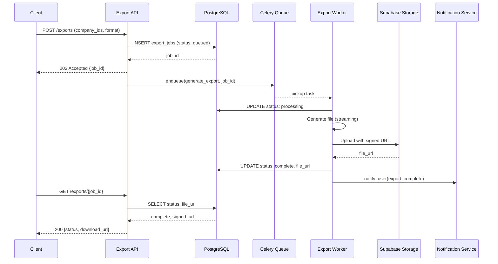

# EPIC-030: Export Pipeline Modernization

| Field | Value |
|-------|-------|
| **Status** | 🔴 Not Started |
| **Priority** | P2 – Medium |
| **Severity** | High |
| **Stories** | 5 |
| **Created** | 2026-03-01 |
| **Target Milestone** | [M3: Modern Data Layer](../../MILESTONES/M3-Modern-Data-Layer.md) |

---

## Context

The current export pipeline generates files synchronously within HTTP request threads. For datasets with 100+ companies, 5 years of financial history, 200+ signals per company, and LLM-generated narratives, this exceeds the 30-second Celery task timeout. The API returns a 500 error, the export is lost, and the user has no recourse. This epic transforms the export pipeline into an asynchronous, resilient, observable system capable of handling production data volumes.

## The Problem

| Current State | Impact |
|--------------|--------|
| Synchronous file generation in request thread | Timeouts on real datasets |
| No export status tracking | Users cannot check progress |
| No retry mechanism | Failed exports are lost |
| Limited format support (Excel only) | Cannot meet diverse user needs |
| Local file storage | No CDN, no signed URLs, no expiration |

## The Solution

Move exports to an async Celery-based pipeline with:
- **Immediate response**: API returns job ID within 1 second
- **Background processing**: File generation runs on dedicated queue
- **Status tracking**: PostgreSQL table tracks job state
- **Multiple formats**: Excel, PDF, and structured data
- **Cloud storage**: Supabase Storage with signed URLs

## Scope

| Story | Title | Priority | Size | Risk |
|-------|-------|----------|------|------|
| [STORY-111](STORIES/STORY-111-async-export-celery.md) | Move Exports to Async Celery Tasks | P2 | M | Medium |
| [STORY-112](STORIES/STORY-112-streaming-excel-export.md) | Streaming Excel Export for Large Datasets | P2 | L | Medium |
| [STORY-113](STORIES/STORY-113-export-status-tracking.md) | Export Status Tracking and Download Links | P2 | M | Low |
| [STORY-114](STORIES/STORY-114-pdf-export-format.md) | Add PDF Export Format | P2 | M | Low |
| [STORY-115](STORIES/STORY-115-export-supabase-storage.md) | Store Exports in Supabase Storage | P2 | M | Medium |

## Dependencies

- **EPIC-025** (Worker Reliability): Must have persistent DLQ before exports can fail safely
- **EPIC-019** (Multi-Tenancy): Export jobs must be tenant-scoped
- **STORY-104** (Notification Service): User notification when export completes

## Architecture

## Target Data Flow

1. **Request**: Client POSTs export request with filter criteria
2. **Queue**: API validates, creates job record, enqueues task
3. **Process**: Worker streams data, applies format, uploads to storage
4. **Notify**: User receives notification (email/Slack) on completion
5. **Download**: Client polls or receives webhook, downloads via signed URL

## Definition of Done

- [ ] All exports complete asynchronously without timeout
- [ ] Export jobs are idempotent (re-trigger doesn't duplicate)
- [ ] Failed exports appear in DLQ with full context
- [ ] Users can track export status via API
- [ ] Multiple formats supported (Excel, PDF)
- [ ] Files stored in Supabase Storage with signed URLs
- [ ] Load test: 10 concurrent exports complete successfully

## Success Metrics

| Metric | Current | Target |
|--------|---------|--------|
| Export timeout rate | ~40% | 0% |
| Max export size | ~50 companies | 1000+ companies |
| Time to first response | 5-30s | <1s |
| Export success rate | ~60% | >99% |

## Risks

| Risk | Likelihood | Impact | Mitigation |
|------|------------|--------|------------|
| Large exports still timeout | Medium | High | Implement chunked/streaming generation |
| Storage costs escalate | Low | Medium | Set file expiration, monitor usage |
| Format compatibility issues | Medium | Medium | Extensive testing with real data |

## Related Documentation

- [SYSTEM_MAP.md](../../SYSTEM_MAP.md) — Target architecture
- [EPIC-033](../EPIC-033-data-completeness-export-integrity/README.md) — Data completeness
- [EPIC-025](../EPIC-025-worker-reliability/README.md) — Worker reliability

## Autonomous Continuation Notes

### Current Develop Status

- Consult `docs/audit/DEVELOP_BACKLOG_AUTONOMY_AUDIT_2026-03-30.md` first.
- This epic currently carries a historical open or in-progress backlog badge.
- If `planning/QUEUE.md` does not currently schedule this epic, treat it as triage-required backlog inventory instead of self-startable work.

### Next Agent Action

- Reconcile this epic against current code reality, `planning/QUEUE.md`, and the develop autonomy audit before selecting a story.
- Do not start implementation from this README alone unless the queue or a fresh planning decision activates the epic.

### Required Working Style

- Follow `docs/reference/ENGINEERING_GUARDRAILS.md`, `docs/reference/PIPELINE_QUALITY_ENFORCEMENT_PLAN.md`, and `docs/reference/TYPESCRIPT_ISSUE_MAPPING_2026-03-26.md`.
- Prefer narrow, machine-checkable progress over broad narrative backlog churn.

### Minimum Verification For Future Agents

- If this epic is reactivated, update the queue or controlling planning artifact first.
- Then execute one story at a time with the relevant tests, gates, and generated references for the touched surface.
